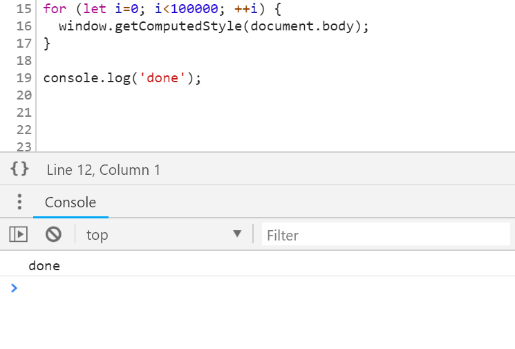
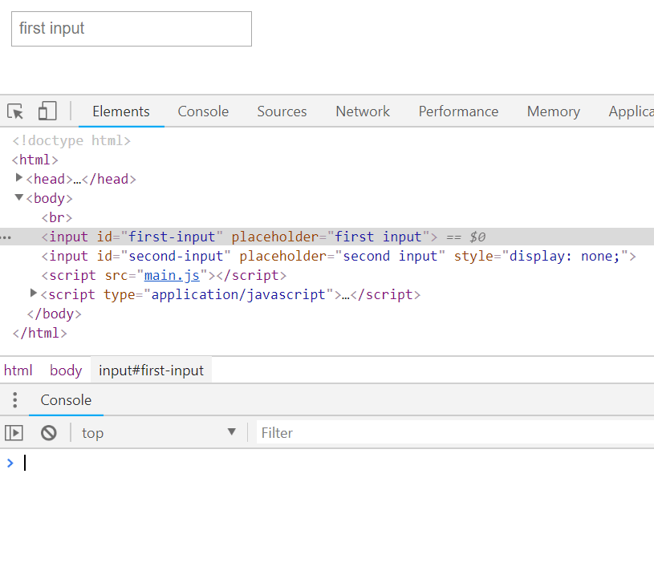
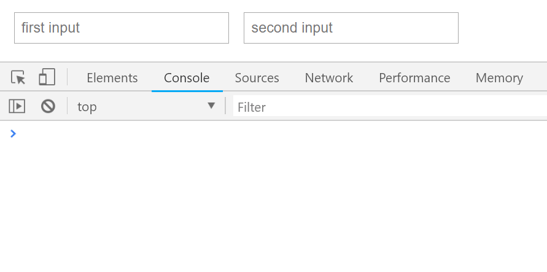
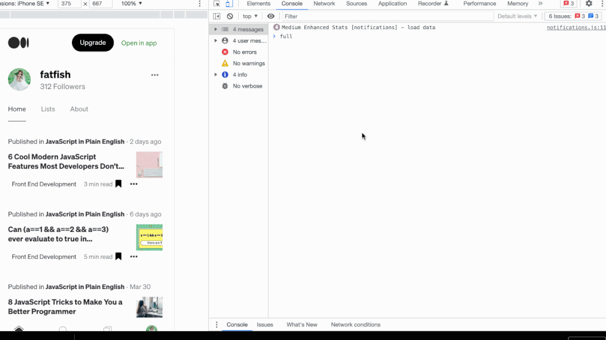

# DevTools 开发者工具调试

[代码调试 - 牧涯的收藏集 - 掘金 (juejin.cn)](https://juejin.cn/collection/7072953319152418829)

[关于浏览器调试的30个奇淫技巧 - 掘金 (juejin.cn)](https://juejin.cn/post/7345297230201716776)

## 前端属性、方法兼容性查询网站

https://caniuse.com/

## 笔记待整理：看语雀《学习笔记》

如何看懂性能调试的火焰图：<https://www.ruanyifeng.com/blog/2017/09/flame-graph.html>

Node 调试工具入门教程：<https://www.ruanyifeng.com/blog/2019/12/git-undo.html>

## 1. Chrome Devtools 的用处

Chrome DevTools 是一款功能丰富的浏览器内置开发工具集，为Web开发者提供了从元素检查、网络监控到性能分析和安全检测等全方位的开发和调试支持。通过 Devtools 可以实时编辑和调试网页的HTML、CSS和JavaScript代码，监控和分析网络请求和性能数据，管理浏览器数据和应用状态，以及确保网页的安全性。此外，DevTools还支持设备模拟功能，方便开发者测试网页在不同设备上的显示效果。

**官方文档：**https://developer.chrome.com/docs/devtools?hl=zh-cn

前端开发：开发预览、远程调试、性能调优、bug 跟踪、断点调试等

后端开发：网络抓包、开发调试 Response

测试：服务端 API 数据是否正确、审查页面元素样式及布局、页面加载性能分析、自动化测试

其他：安装扩展插件，如 AdBlock、Gliffy、Axure 等

---

基本用法

- 打开关闭
- 常用配置

元素面板

- 审查、修改元素
- 查看、修改样式
- 查看、管理事件

终端面板

- 审查变量
- 运行代码

## 2. 菜单面板拆解

Elements - 页面 dom 元素

Console - 控制台

Sources - 页面静态资源（html+css+js） ---- JavaScript 代码断点调试

Resources - 数据的存储和缓存

Network - 网络

Performance - 设备加载性能分析

Application - 应用信息，PWA/Storage/Cache/Frames

Security - 安全分析

Audits - 审计，自动化测试工具

---

网络面板

- 过滤、审查网络请求
- 网速限制、录制等

资源面板

- 审查、管理 Cookie
- 查看、管理 LocalStorage

源码面板

- 查看、格式化源代码
- 实时 Javascript 调试

### 查看元素

### 网络请求

### 断点调试 JavaScript

### Performance-设备加载性能分析

## CSS Overview 工具：CSS 调试工具

视频参考：[调试 CSS 好帮手 - CSS Overview 工具\_哔哩哔哩\_bilibili](https://www.bilibili.com/video/BV1kv4y1D7Y5/?spm_id_from=333.999.0.0&vd_source=5f0c99b3deddffe219938763769b15ac)

开发者工具--右上角三个点(自定义和控制开发工具)--更多工具(More tools)--CSS 概述(# CSS Overview)：点击蓝色按钮--捕获概述(Capture overview)：就可以开始根据分析来进行调试

分析调试颜色对比度和其他信息

字体信息：是否有继承

未使用的声明

媒体查询

## 内存泄漏实战调试

### Chrome devTools 查看内存情况

> - 打开`Chrome`的无痕模式，这样做的目的是为了屏蔽掉`Chrome`插件对我们之后测试内存占用情况的影响
> - 打开开发者工具，找到`Performance`这一栏，可以看到其内部带着一些功能按钮，例如：开始录制按钮；刷新页面按钮；清空记录按钮；记录并可视化 js 内存、节点、事件监听器按钮；触发垃圾回收机制按钮等


简单录制一下百度页面，看看我们能获得什么，如下动图所示：


> 从上图中我们可以看到，在页面从零到加载完成这个过程中`JS Heap`（js 堆内存）、`documents`（文档）、`Nodes`（DOM 节点）、`Listeners`（监听器）、`GPU memory`（`GPU`内存）的最低值、最高值以及随时间的走势曲线，这也是我们主要关注的点

看看开发者工具中的`Memory`一栏，其主要是用于记录页面堆内存的具体情况以及 js 堆内存随加载时间线动态的分配情况


堆快照就像照相机一样，能记录你当前页面的堆内存情况，每快照一次就会产生一条快照记录


> 如上图所示，刚开始执行了一次快照，记录了当时堆内存空间占用为`33.7MB`，然后我们点击了页面中某些按钮，又执行一次快照，记录了当时堆内存空间占用为`32.5MB`。并且点击对应的快照记录，能看到当时所有内存中的变量情况（结构、占总占用内存的百分比...）


> 在开始记录后，我们可以看到图中右上角有起伏的蓝色与灰色的柱形图，其中`蓝色`表示当前时间线下占用着的内存；`灰色`表示之前占用的内存空间已被清除释放

在得知有内存泄漏的情况存在时，我们可以改用`Memory`来更明确得确认问题和定位问题

首先可以用`Allocation instrumentation on timeline`来确认问题，如下图所示：


### 内存泄漏的场景

- 闭包使用不当引起内存泄漏
- 全局变量
- 分离的`DOM`节点
- 控制台的打印
- 遗忘的定时器

**1. 闭包使用不当引起内存泄漏**

使用`Performance`和`Memory`来查看一下闭包导致的内存泄漏问题

```html
<button onclick="myClick()">执行fn1函数</button>
<script>
	function fn1() {
		let a = new Array(10000); // 这里设置了一个很大的数组对象

		let b = 3;

		function fn2() {
			let c = [1, 2, 3];
		}

		fn2();

		return a;
	}

	let res = [];

	function myClick() {
		res.push(fn1());
	}
</script>
```

> 在退出`fn1`函数执行上下文后，该上下文中的变量`a`本应被当作垃圾数据给回收掉，但因`fn1`函数最终将变量`a`返回并赋值给全局变量`res`，其产生了对变量`a`的引用，所以变量`a`被标记为活动变量并一直占用着相应的内存，假设变量`res`后续用不到，这就算是一种闭包使用不当的例子

设置了一个按钮，每次执行就会将`fn1`函数的返回值添加到全局数组变量`res`中，是为了能在`performacne`的曲线图中看出效果，如图所示：


- 在每次录制开始时手动触发一次垃圾回收机制，这是为了确认一个初始的堆内存基准线，便于后面的对比，然后我们点击了几次按钮，即往全局数组变量`res`中添加了几个比较大的数组对象，最后再触发一次垃圾回收，发现录制结果的 JS Heap 曲线刚开始成阶梯式上升的，最后的曲线的高度比基准线要高，说明可能是存在内存泄漏的问题
- 在得知有内存泄漏的情况存在时，我们可以改用`Memory`来更明确得确认问题和定位问题
- 首先可以用`Allocation instrumentation on timeline`来确认问题，如下图所示：


- 在我们每次点击按钮后，动态内存分配情况图上都会出现一个`蓝色的柱形`，并且在我们触发垃圾回收后，`蓝色柱形`都没变成灰色柱形，即之前分配的内存并未被清除
- 所以此时我们就可以更明确得确认内存泄漏的问题是存在的了，接下来就精准定位问题，可以利用`Heap snapshot`来定位问题，如图所示：


- 第一次先点击快照记录初始的内存情况，然后我们多次点击按钮后再次点击快照，记录此时的内存情况，发现从原来的`1.1M`内存空间变成了`1.4M`内存空间，然后我们选中第二条快照记录，可以看到右上角有个`All objects`的字段，其表示展示的是当前选中的快照记录所有对象的分配情况，而我们想要知道的是第二条快照与第一条快照的区别在哪，所以选择`Object allocated between Snapshot1 and Snapshot2`即展示第一条快照和第二条快照存在差异的内存对象分配情况，此时可以看到 Array 的百分比很高，初步可以判断是该变量存在问题，点击查看详情后就能查看到该变量对应的具体数据了

以上就是一个判断闭包带来内存泄漏问题并简单定位的方法了

**2. 全局变量**

全局的变量一般是不会被垃圾回收掉的当然这并不是说变量都不能存在全局，只是有时候会因为疏忽而导致某些变量流失到全局，例如未声明变量，却直接对某变量进行赋值，就会导致该变量在全局创建，如下所示：

```js
function fn1() {
	// 此处变量name未被声明
	name = new Array(99999999);
}

fn1();
```

- 此时这种情况就会在全局自动创建一个变量`name`，并将一个很大的数组赋值给`name`，又因为是全局变量，所以该内存空间就一直不会被释放
- 解决办法的话，自己平时要多加注意，不要在变量未声明前赋值，或者也可以`开启严格模式`，这样就会在不知情犯错时，收到报错警告，例如

```js
function fn1() {
	"use strict";
	name = new Array(99999999);
}

fn1();
```

**3. 分离的`DOM`节点**

假设你手动移除了某个`dom`节点，本应释放该 dom 节点所占用的内存，但却因为疏忽导致某处代码仍对该被移除节点有引用，最终导致该节点所占内存无法被释放，例如这种情况

```html
<div id="root">
	<div class="child">我是子元素</div>
	<button>移除</button>
</div>
<script>
	let btn = document.querySelector("button");
	let child = document.querySelector(".child");
	let root = document.querySelector("#root");

	btn.addEventListener("click", function () {
		root.removeChild(child);
	});
</script>
```

> 该代码所做的操作就是点击按钮后移除`.child`的节点，虽然点击后，该节点确实从`dom`被移除了，但全局变量`child`仍对该节点有引用，所以导致该节点的内存一直无法被释放，可以尝试用`Memory`的快照功能来检测一下，如图所示


> 同样的先记录一下初始状态的快照，然后点击移除按钮后，再点击一次快照，此时内存大小我们看不出什么变化，因为移除的节点占用的内存实在太小了可以忽略不计，但我们可以点击第二条快照记录，在筛选框里输入`detached`，于是就会展示所有脱离了却又未被清除的节点对象

解决办法如下图所示：

```html
<div id="root">
	<div class="child">我是子元素</div>
	<button>移除</button>
</div>
<script>
	let btn = document.querySelector("button");

	btn.addEventListener("click", function () {
		let child = document.querySelector(".child");
		let root = document.querySelector("#root");

		root.removeChild(child);
	});
</script>
```

> 改动很简单，就是将对`.child`节点的引用移动到了`click`事件的回调函数中，那么当移除节点并退出回调函数的执行上文后就会自动清除对该节点的引用，那么自然就不会存在内存泄漏的情况了，我们来验证一下，如下图所示：


结果很明显，这样处理过后就不存在内存泄漏的情况了

**4. 控制台的打印**

```html
<button>按钮</button>
<script>
	document.querySelector("button").addEventListener("click", function () {
		let obj = new Array(1000000);

		console.log(obj);
	});
</script>
```

我们在按钮的点击回调事件中创建了一个很大的数组对象并打印，用`performance`来验证一下


> 开始录制，先触发一次垃圾回收清除初始的内存，然后点击三次按钮，即执行了三次点击事件，最后再触发一次垃圾回收。查看录制结果发现`JS Heap`曲线成阶梯上升，并且最终保持的高度比初始基准线高很多，这说明每次执行点击事件创建的很大的数组对象`obj`都因为`console.log`被浏览器保存了下来并且无法被回收

接下来注释掉`console.log`，再来看一下结果：

```html
<button>按钮</button>
<script>
	document.querySelector("button").addEventListener("click", function () {
		let obj = new Array(1000000);

		// console.log(obj);
	});
</script>
```


可以看到没有打印以后，每次创建的`obj`都立马被销毁了，并且最终触发垃圾回收机制后跟初始的基准线同样高，说明已经不存在内存泄漏的现象了

其实同理 `console.log`也可以用`Memory`来进一步验证

未注释 `console.log`


注释掉了`console.log`


> 最后简单总结一下：在开发环境下，可以使用控制台打印便于调试，但是在生产环境下，尽可能得不要在控制台打印数据。所以我们经常会在代码中看到类似如下的操作：

```js
// 如果在开发环境下，打印变量obj
if (isDev) {
	console.log(obj);
}
```

> 这样就避免了生产环境下无用的变量打印占用一定的内存空间，同样的除了`console.log`之外，`console.error`、`console.info`、`console.dir`等等都不要在生产环境下使用

**5. 遗忘的定时器**

> 定时器也是平时很多人会忽略的一个问题，比如定义了定时器后就再也不去考虑清除定时器了，这样其实也会造成一定的内存泄漏。来看一个代码示例：

```html
<button>开启定时器</button>
<script>
	function fn1() {
		let largeObj = new Array(100000);

		setInterval(() => {
			let myObj = largeObj;
		}, 1000);
	}

	document.querySelector("button").addEventListener("click", function () {
		fn1();
	});
</script>
```

这段代码是在点击按钮后执行`fn1`函数，`fn1`函数内创建了一个很大的数组对象`largeObj`，同时创建了一个`setInterval`定时器，定时器的回调函数只是简单的引用了一下变量`largeObj`，我们来看看其整体的内存分配情况吧：


按道理来说点击按钮执行`fn1`函数后会退出该函数的执行上下文，紧跟着函数体内的局部变量应该被清除，但图中`performance`的录制结果显示似乎是存在内存泄漏问题的，即最终曲线高度比基准线高度要高，那么再用`Memory`来确认一次：


- 在我们点击按钮后，从动态内存分配的图上看到出现一个蓝色柱形，说明浏览器为变量`largeObj`分配了一段内存，但是之后这段内存并没有被释放掉，说明的确存在内存泄漏的问题，原因其实就是因为`setInterval`的回调函数内对变量`largeObj`有一个引用关系，而定时器一直未被清除，所以变量`largeObj`的内存也自然不会被释放
- 那么我们如何来解决这个问题呢，假设我们只需要让定时器执行三次就可以了，那么我们可以改动一下代码：

```html
<button>开启定时器</button>
<script>
	function fn1() {
		let largeObj = new Array(100000);
		let index = 0;

		let timer = setInterval(() => {
			if (index === 3) clearInterval(timer);
			let myObj = largeObj;
			index++;
		}, 1000);
	}

	document.querySelector("button").addEventListener("click", function () {
		fn1();
	});
</script>
```

现在我们再通过`performance`和`memory`来看看还不会存在内存泄漏的问题

- `performance`


> 这次的录制结果就能看出，最后的曲线高度和初始基准线的高度一样，说明并没有内存泄漏的情况

- `memory`


这里做一个解释，图中刚开始出现的蓝色柱形是因为我在录制后刷新了页面，可以忽略；然后我们点击了按钮，看到又出现了一个蓝色柱形，此时就是为`fn1`函数中的变量`largeObj`分配了内存，`3s`后该内存又被释放了，即变成了灰色柱形。所以我们可以得出结论，这段代码不存在内存泄漏的问题

> 简单总结一下： 大家在平时用到了定时器，如果在用不到定时器后一定要清除掉，否则就会出现本例中的情况。除了`setTimeout`和`setInterval`，其实浏览器还提供了一个`API`也可能就存在这样的问题，那就是`requestAnimationFrame`

## 67 个奇怪的调试技巧

翻译自：[67 Weird Debugging Tricks Your Browser Doesn't Want You to Know | Alan Norbauer](https://alan.norbauer.com/articles/browser-debugging-tricks)

一系列有用的、不明显的技巧，可帮助您充分利用浏览器的 [1](https://alan.norbauer.com/articles/browser-debugging-tricks#user-content-fn-1) 调试器。假设对开发人员工具有中级或更高的了解。

### 高级条件断点

通过在您意想不到的地方使用具有副作用的表达式，我们可以从条件断点等基本功能中挤出更多功能。

#### 日志点/跟踪点

例如，我们可以在断点中 `console.log` 。日志点是记录到控制台而不暂停执行的断点。虽然 Microsoft Edge 内置日志点已经有一段时间了，Chrome 也只是在 v73 中添加了它们，但 Firefox 却没有。但是，我们可以使用条件断点在任何浏览器中模拟它们。


如果您还想获得该行执行次数的运行计数，请使用 `console.count` 而不是 `console.log` 。

更新（2020 年 5 月）：所有主要浏览器现在都直接支持日志点/跟踪点（Chrome 日志点、Edge 跟踪点、Firefox 日志点）

##### 监视窗格

您还可以在监视窗格中使用 `console.log` 。例如，要在每次应用程序在调试器中暂停时转储 `localStorage` 的快照，您可以创建一个 `console.table(localStorage)` 监视：


或者要在 DOM 突变后执行表达式，请设置 DOM 突变断点（在元素检查器中）：

然后添加您的手表表达式，例如记录 DOM 的快照： `(window.doms = window.doms || []).push(document.documentElement.outerHTML)` 。现在，在修改任何 DOM 子树之后，调试器将暂停执行，新的 DOM 快照将位于 `window.doms` 数组的末尾。 （无法创建不暂停执行的 DOM 突变断点。）

##### 跟踪调用堆栈

假设您有一个显示加载微调器的函数和一个隐藏它的函数，但在代码中的某个地方您调用了 show 方法，而没有匹配的 hide 调用。如何找到未配对的显示通话的来源？在 show 方法的条件断点中使用 `console.trace` ，运行代码，找到 show 方法的最后一个堆栈跟踪，然后单击调用者转到代码：


#### 改变程序行为

通过使用对程序行为有副作用的表达式，我们可以在浏览器中即时更改程序行为。

例如，您可以将参数重写为 `getPerson` 函数 `id` 。由于 `id=1` 的计算结果为 true，因此该条件断点将暂停调试器。为了防止这种情况，请将 `, false` 附加到表达式中。


#### 快速而肮脏的性能分析

您不应该将性能分析与条件断点评估时间之类的内容混为一谈，但如果您想要快速准确地测量某项运行所需的时间，则可以在条件断点中使用控制台计时 API。在起点设置一个具有条件 `console.time('label')` 的断点，并在终点设置一个具有条件 `console.timeEnd('label')` 的断点。每次您正在测量的东西运行时，浏览器都会将其花费的时间记录到控制台。



#### 使用函数参数

##### 参数数量中断

仅在使用 3 个参数调用当前函数时暂停： `arguments.callee.length === 3`

当您有一个带有可选参数的重载函数时很有用。


##### 函数参数数量不匹配时中断

仅在使用错误数量的参数调用当前函数时暂停： `(arguments.callee.length) != arguments.length`


在查找函数调用站点中的错误时很有用。

#### 使用时间

##### 跳过页面加载

页面加载后 5 秒才暂停： `performance.now() > 5000`

当您想要设置断点但您只想在初始页面加载后暂停执行时很有用。

##### 跳过 N 秒

如果在接下来的 5 秒内命中断点，则不暂停执行，但在以下时间后随时暂停： `window.baseline = window.baseline || Date.now(), (Date.now() - window.baseline) > 5000`

您可以随时从控制台重置计数器： `window.baseline = Date.now()`

#### 使用 CSS

根据计算出的 CSS 值暂停，例如仅当文档正文具有红色背景色时暂停执行： `window.getComputedStyle(document.body).backgroundColor === "rgb(255,0,0)"`

#### 甚至仅通话

仅在执行该行时每隔一段时间暂停一次： `window.counter = (window.counter || 0) + 1, window.counter % 2 === 0`

#### 样品断裂

仅在该行执行的随机样本上中断，例如该行每执行 10 次，只中断 1 次： `Math.random() < 0.1`

#### 永远不要在这里暂停

**Chrome**

当您右键单击装订线并选择“永不在此暂停”时，Chrome 会创建一个条件断点 `false` 并且永远不会通过。这使得调试器永远不会在此行暂停。


当您想要从 XHR 断点中免除一行、忽略正在抛出的异常等时很有用。

#### 自动实例 ID

通过在构造函数中设置条件断点，自动为类的每个实例分配唯一的 ID： `(window.instances = window.instances || []).push(this)`

然后检索唯一 ID： `window.instances.indexOf(instance)` （例如，在类方法中时为 `window.instances.indexOf(this)` ）

#### 以编程方式切换

使用全局布尔值来门控一个或多个条件断点：


然后以编程方式切换布尔值，例如

- 手动，从控制台

  ```javascript
  1window.enableBreakpoints = true;
  ```

- 从其他断点

- 从控制台上的计时器

  ```javascript
  1setTimeout(() => (window.enableBreakpoints = true), 5000);
  ```

- etc

### Monitor() 类调用

**Chrome**

您可以使用 Chrome 的 `monitor` 命令行方法轻松跟踪对类方法的所有调用。例如。给定一个类 `Dog`

```javascript
class Dog {
	bark(count) {
		/* ... */
	}
}
```

如果我们想知道对 `Dog` 的所有实例进行的所有调用，请将其粘贴到命令行中：

```javascript
var p = Dog.prototype;

Object.getOwnPropertyNames(p).forEach((k) => monitor(p[k]));
```

你将在控制台中得到输出：

```
> function bark called with arguments: 2
```

如果您想暂停任何方法调用的执行（而不是仅仅记录到控制台），可以使用 `debug` 而不是 `monitor` 。

#### 来自特定实例

**Chrome**

如果您不知道该类但有一个实例：

```javascript
var p = instance.constructor.prototype;

Object.getOwnPropertyNames(p).forEach((k) => monitor(p[k]));
```

当您想编写一个对任何类的任何实例执行此操作的函数（而不仅仅是 `Dog` ）时很有用

### 调用和调试函数

在控制台中调用要调试的函数之前，请调用 `debugger` 。例如。给定：

```javascript
function fn() {
	/* ... */
}
```

从您的控制台：

```bash
> debugger; fn(1);
```

然后“Step into next function call”来调试 `fn` 的实现。

当您不想查找 `fn` 的定义并手动添加断点，或者如果 `fn` 动态绑定到函数并且您不知道源在哪里时，这很有用。

在 Chrome 中，您还可以选择在命令行上调用 `debug(fn)` ，调试器将在每次调用时暂停 `fn` 内的执行。

### URL 更改时暂停执行

要在单页应用程序修改 URL 之前暂停执行（即发生某些路由事件）：

```javascript
const dbg = () => {
	debugger;
};

history.pushState = dbg;

history.replaceState = dbg;

window.onhashchange = dbg;

window.onpopstate = dbg;
```

创建一个暂停执行而不中断导航的 `dbg` 版本是留给读者的练习。

另请注意，当代码直接调用 `window.location.replace/assign` 时，这不会处理，因为页面将在分配后立即卸载，因此无需调试。如果您仍然想查看这些重定向的来源（并调试重定向时的状态），在 Chrome 中您可以 `debug` 相关方法：

```javascript
debug(window.location.replace);

debug(window.location.assign);
```

### 调试属性读取

如果您有一个对象并且想知道何时读取该对象的属性，请使用带有 `debugger` 调用的对象 getter。例如，将 `{configOption: true}` 转换为 `{get configOption() { debugger; return true; }}` （在原始源代码中或使用条件断点）。

当您将一些配置选项传递给某些东西并且您想了解它们如何使用时很有用。

### 使用 copy()

**Chrome、Firefox**

您可以使用 `copy()` 控制台 API 将感兴趣的信息从浏览器直接复制到剪贴板，而无需任何字符串截断。您可能想要复制一些有趣的内容：

- 当前 DOM 的快照： `copy(document.documentElement.outerHTML)`
- 有关资源的元数据（例如图像）： `copy(performance.getEntriesByType("resource"))`
- 一个大的 JSON blob，格式为： `copy(JSON.parse(blob))`
- 本地存储的转储： `copy(localStorage)`
- ETC。

### 调试 HTML/CSS

JS 控制台在诊断 HTML/CSS 问题时非常有用。

#### 在禁用 JS 的情况下检查 DOM

在 DOM 检查器中按 ctrl+\ (Chrome/Windows) 可随时暂停 JS 执行。这允许您检查 DOM 的快照，而不必担心 JS 改变 DOM 或事件（例如鼠标悬停）导致 DOM 从您的下方发生变化。

#### 检查难以捉摸的元素

假设您想要检查仅有条件出现的 DOM 元素。检查所述元素需要将鼠标移动到它，但是当你尝试这样做时，它就会消失：


要检查该元素，您可以将其粘贴到控制台中： `setTimeout(function() { debugger; }, 5000);` 。这给了你 5 秒的时间来触发 UI，然后一旦 5 秒计时器到了，JS 执行就会暂停，并且没有任何东西会让你的元素消失。您可以自由地将鼠标移动到开发工具而不会丢失该元素：



当 JS 执行暂停时，您可以检查元素、编辑其 CSS、在 JS 控制台中执行命令等。

在检查依赖于特定光标位置、焦点等的 DOM 时很有用。

#### 记录 DOM 的快照

要获取当前状态下 DOM 的副本：

```javascript
1copy(document.documentElement.outerHTML);
```

每秒记录一次 DOM 快照：

```javascript
doms = [];

setInterval(() => {
	const domStr = document.documentElement.outerHTML;

	doms.push(domStr);
}, 1000);
```

或者将其转储到控制台：

```javascript
setInterval(() => {
	const domStr = document.documentElement.outerHTML;

	console.log("snapshotting DOM: ", domStr);
}, 1000);
```

#### 监控重点元素

```javascript
(function () {
	let last = document.activeElement;

	setInterval(() => {
		if (document.activeElement !== last) {
			last = document.activeElement;

			console.log("Focus changed to: ", last);
		}
	}, 100);
})();
```



#### 寻找大胆的元素

```javascript
const isBold = (e) => {
	let w = window.getComputedStyle(e).fontWeight;

	return w === "bold" || w === "700";
};

Array.from(document.querySelectorAll("*")).filter(isBold);
```

##### 只是后裔

或者只是当前在检查器中选择的元素的后代：

```javascript
Array.from($0.querySelectorAll("*")).filter(isBold);
```

#### 参考当前选定的元素

控制台中的 `$0` 是对元素检查器中当前选定元素的自动引用。

##### 以前的元素

**Chrome、Edge**

在 Chrome 和 Edge 中，您可以使用 `$1` 访问上次检查的元素，使用 `$2` 访问之前的元素，等等。

##### 获取事件监听器

**Chrome**

在 Chrome 中，您可以检查当前所选元素的事件侦听器： `getEventListeners($0)` ，例如


#### 监视元素的事件

**Chrome**

调试所选元素的所有事件： `monitorEvents($0)`

调试所选元素的特定事件： `monitorEvents($0, ["control", "key"])`


### Footnotes

Chrome、Firefox 和 Edge 均支持提示，除非浏览器徽标另有说明： 

# chrome高级调试技巧

## 前言 

chrome浏览器作为前端童鞋的`老婆`，相信你一定不陌生。`调页面`、`写BUG`、`画样式`、`看php片`少了它整个世界都不香了。

不信？一起来看看我们的`老婆`有多厉害....

## 1#. 一键重新发起请求

在与后端接口联调或排查线上BUG时，你是不是也经常听到他们说这句话：**你再发起一次请求试试，我这边看下为啥出错了！**

重发请求，这有一种简单到发指的方式。

1. 选中`Network`
2. 点击`Fetch/XHR`
3. 选择要重新发送的请求
4. 右键选择`Replay XHR`


不用刷新页面，不用走页面交互，是不是非常爽！！！

## 2#. 在控制台快速发起请求

还是联调或修BUG的场景，针对同样的请求，有时候需要**修改入参**重新发起，有啥快捷方式？

1. 选中`Network`
2. 点击`Fetch/XHR`
3. 选择`Copy as fetch`
4. 控制台粘贴代码
5. 修改参数，回车搞定


曾经我总是通过改代码或者手写`fetch`的方式处理，想想真是太傻了...

## 3#. 复制JavaScript变量

假如你的代码经过计算会输出一个**复杂的对象**，且需要被复制下来发送给其他人，怎么办？

1. 使用`copy`函数，将`对象`作为入参执行即可


以前我总是通过`JSON.stringify(fetfishObj, null, 2)`打印到控制台，再手动复制粘贴，这效率实在是太低了...

## 4#. 控制台获取Elements面板选中的元素

调试网页时通过`Elements`面板选中元素后，如果想通过`JS`知道它的一些属性，如`宽`、`高`、`位置`等怎么办呢？

1. 通过`Elements`选择要调试的元素
2. 控制台直接用`$0`访问


## 5#. 截取一张全屏的网页

偶尔咱们也会有对网页截屏的需求，一屏还好，系统自带的截屏或者微信截图等都可以办到，但是要求**将超出一屏的内容也截下来咋办呢**？

1. 准备好需要截屏的内容
2. `cmd + shift + p` 执行`Command`命令
3. 输入`Capture full size screenshot` 按下回车



**如果要截取选中的部分元素呢？**

答案也很简单，第三步输入`Capture node screenshot`即可


## 6#. 一键展开所有DOM元素

调试元素时，在层级比较深的情况下，你是不是也经常一个个展开去调试？有一种更加快捷的方式

1. 按住`opt`键 + click（需要展开的最外层元素）


## 7#. 控制台引用上一次执行的结果

来看看这个场景，我猜你也一定遇到过, 对某个字符串进行了各种工序，然后我们想知道每一步执行的结果，该咋办？。

```
'fatfish'.split('').reverse().join('') // hsiftaf
```

**你可能会这样做**

```
// 第1步
'fatfish'.split('') // ['f', 'a', 't', 'f', 'i', 's', 'h']
// 第2步
['f', 'a', 't', 'f', 'i', 's', 'h'].reverse() // ['h', 's', 'i', 'f', 't', 'a', 'f']
// 第3步
['h', 's', 'i', 'f', 't', 'a', 'f'].join('') // hsiftaf
```


**更简单的方式**

使用`$_`引用上一次操作的结果，不用每次都复制一遍

```
// 第1步
'fatfish'.split('') // ['f', 'a', 't', 'f', 'i', 's', 'h']
// 第2步
$_.reverse() // ['h', 's', 'i', 'f', 't', 'a', 'f']
// 第3步
$_.join('') // hsiftaf
```


## 8.# 快速切换主题

有的同学喜欢chrome的白色主题，有的喜欢黑色，我们可以使用快捷键迅速切换两个主题。

1. `cmd + shift + p` 执行`Command`命令
2. 输入`Switch to dark theme`或者`Switch to light theme`进行主题切换


## 9.# "`$`"和"`$$`"选择器

在控制台使用`document.querySelector`和`document.querySelectorAll`选择当前页面的元素是最常见的需求了，不过着实有点太长了，咱们可以使用`$`和`$$`替代。


## 10.# `$i`直接在控制台安装npm包

你遇到过这个场景吗？有时候想使用比如`dayjs`或者`lodash`的某个`API`，但是又不想去官网查，如果可以在控制台直接试出来就好了。

Console Importer 就是这么一个插件，用来在控制台直接安装`npm`包。

1. 安装`Console Importer`插件
2. $i('name')安装npm包


## 11.# Add conditional breakpoint条件断点的妙用

假设有下面这段代码，咱们希望食物名字是`🍫`时才触发断点，可以怎么弄？

```
const foods = [
  {
    name: '🍔',
    price: 10
  },
  {
    name: '🍫',
    price: 15
  },
  {
    name: '🍵',
    price: 20
  },
]

foods.forEach((v) => {
  console.log(v.name, v.price)
})
```

这在大量数据下，只想对符合条件时打断点条件将会非常方便。试想如果没有条件断点咱们是不是要点n次debugger？


