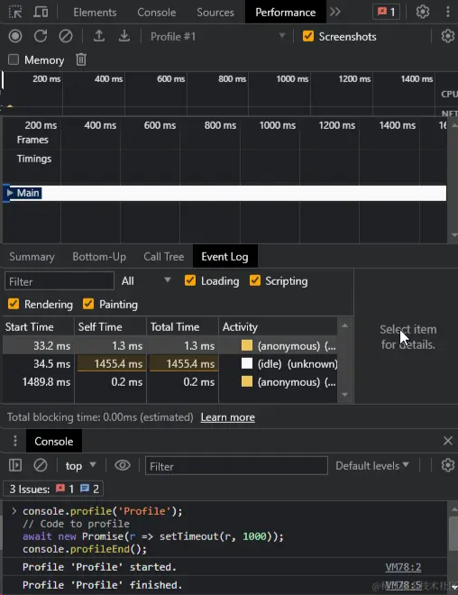

# JavaScript 开发调试指导

## 项目本地以 Debug 模式启动

## console.log() 代码打印调试

- console.log()– 打印内容的通用方法。
- console.info()– 打印资讯类说明信息。
- console.debug()– 在控制台打印一条 "debug" 级别的消息。
- console.warn()– 打印一个警告信息。
- console.error()– 打印一条错误信息。

### console.log

Console 作为 JS 中的一个原生对象，为我们提供了在浏览器控制台进行调试的能力。百分百的前端人都知道 console.log()语句，但通过本文的介绍会发现，console.log()真的是一个最熟悉的陌生'人'。

常用的占位符：

- %s - 字符串
- %d or %i - 整数
- %f - 浮点数
- %o - 对象
- %c - CSS 样式

#### 常规用法

console.log()是最为常用的打印输出方法，其可以接收任意类型的内容并输出：

```javascript
console.log(
	"1",
	1,
	true,
	null,
	undefined,
	Symbol,
	{ a: 1 },
	[1],
	new Set(),
	new Date()
);
```

#### 冷门用法

除了常规用法外，console.log()还可以利用以下通配符发挥特殊作用：

##### %c：用于添加样式。

可以把输出的语句看做是一个节点，常见的 color、font、padding 等 css 属性都可以使用。具体用法是在需要添加样式的字符串前加入%c 匹配符，紧接着的第二个参数用于定义样式。请看以下示例：

```javascript
console.log(
	"1231 %c这是你没有见过的console.log",
	"color: #fff; border-radius: 5px; padding: 10px 25px;background: linear-gradient(315deg, #1fd1f9 0%, #b621fe 74%)",
	"1231"
);
```

##### %o or %O：用于以对象格式打印。

在字符串中加入%o 或者 %O，可以将字符串后紧接着的对象插入到字符串中。请看示例：

```javascript
console.log("一串%o字符", $0);
```

##### 另外呢，%o 和%O 也有一定的差别，%O 的作用更像 console.dir:

```javascript
console.log("一串%o字符", $0);
console.log("一串%O字符", $0);
```

##### %d or %i：用于将数字输出为整数。

%d or %i 可以将其之后紧随的字符作为整数输出，类似于 toFixed(0)：

```javascript
console.log("输出为整数%i", 1.99);
```

##### 转换类数字的字符串也是可以的：

```javascript
console.log("输出为整数%i", "1.99");
```

##### 其余的转换逻辑其实与 js 是一样的：

```javascript
console.log("输出为整数%i", "aa1.99");
```

##### %s：用于打印字符串。

%s 可以将其之后紧随的任意类型的值作为字符串输出，类似于 js 中的字符串拼接：

```javascript
console.log("类似于字符串拼接%s", 123);
console.log("类似于字符串拼接%s", [1, 2, 3]);
console.log("类似于字符串拼接%s", null);
console.log("类似于字符串拼接%s", {});
```

##### %f：用于格式化打印浮点数。

%f 可以将其之后紧随的任意类型的值作为浮点数输出，可以通过%.2f 这样的形式来指定需要格式化的位数：

```javascript
console.log("浮点数格式化 %f", 1);
console.log("浮点数格式化 %.3f", 1.232323);
```

值得注意的是，该语法在 chrome 及 edge 中并不会生效。

### time('time')|timeEnd('time') 时间打印

console.time 和 console.timeEnd

测量执行一段代码所需的时间。识别代码中的性能瓶颈并对其进行优化

```js
console.time("开始获取数据");

fetch("https://reqres.in/api/users")
	.then((response) => response.json())
	.then((data) => {
		console.timeEnd("获取数据花费时间：");
		// ...code
	});
```

### dir()

`dir()` 方法显示指定 JavaScript 对象的交互式属性列表。它提供了对象结构的详细视图，包括其属性及其值。

```js
const promise = new Promise((resolve, reject) => resolve("foo"));
console.dir(promise);

const person = { name: "John Doe", age: 30 };
console.dir(person);
```


### dirxml()

`dirxml()` 方法在控制台中显示指定 JavaScript 对象的 XML 表示形式。在处理可表示为 XML 的 XML 数据或对象时，它特别有用。

```javascript
console.dirxml(document);
```


### groupCollapsed()

`groupCollapsed()` 方法在控制台中创建一个折叠的组，类似于 `group()` 。但是，该组最初处于折叠状态，提供日志语句的精简视图。

```javascript
console.groupCollapsed("Collapsed Group");
console.log("This group is collapsed by default.");
console.groupEnd();
```


### count()

console.count 方法来计算特定日志消息的输出次数。这对于跟踪特定代码路径的执行次数以及识别代码中的热点非常有用

```js
const fun = (x) => console.count(x);

fun("刻晴"); // 1
fun("甘雨"); // 1
fun("刻晴"); // 2

console.count("Click"); // Logs "Click: 1"
console.count("Click"); // Logs "Click: 2"
```

### countReset()

`countReset()` 方法重置使用 `count()` 创建的特定标签的计数。它允许您重新启动特定事件或函数的计数。

```javascript
console.count("Click");
console.countReset("Click");
console.count("Click"); // Logs "Click: 1"
```

### group()

`group()` 方法在控制台中创建新的可折叠组。它允许您将相关的日志语句组合在一起，从而更轻松地导航和理解复杂的日志。

```javascript
console.group("User");
console.log("Name: John Doe");
console.log("Email: john@example.com");
console.groupEnd();
```

### groupEnd()

`groupEnd()` 方法标记使用 `group()` 或 `groupCollapsed()` 创建的组的结束。必须关闭组以在控制台中保持适当的缩进和层次结构。

```javascript
console.group("Group");
console.log("This is inside the group.");
console.groupEnd();
console.log("This is outside the group.");
```


### console.trace

`trace()` 方法显示导致当前执行点的函数调用的堆栈跟踪。它可以帮助您了解代码流并识别函数调用的顺序

```js
const foo = () => console.trace();
const bar = () => foo();
bar();

unction foo() {
  console.trace('Trace function calls');
}

function bar() {
  foo();
}

bar();
```


### profile()、profileEnd()

`profile()` 方法启动 JavaScript 探查器。它记录代码特定部分的性能配置文件，允许您分析和优化其执行。

`profileEnd()` 方法停止 JavaScript 探查器并显示记录的性能配置文件。它提供了对代码的不同函数或部分所花费的时间的见解。

测量代码块的性能。这对于识别性能瓶颈以及优化代码以提高速度和效率非常有用。

```js
console.profile("MyProfile");
// 想要测量性能的代码
for (let i = 0; i < 100000; i++) {
	// ...code
}
console.profileEnd("MyProfile");

console.profile("Profile");
// Code to profile
await new Promise((r) => setTimeout(r, 1000));
console.profileEnd();
```



### memory

`memory` 方法提供有关 JavaScript 代码的内存使用情况的信息。它显示当前内存消耗，并允许您跟踪与内存相关的优化。

```javascript
console.memory;
```


### debug()

`debug()` 方法用于将调试信息记录到控制台。它类似于 `log()` ，但它专门用于调试目的。它可以帮助您打印有关代码中的变量、对象或特定点的详细信息。

```javascript
console.debug("Debug information");
```


### info()

`info()` 方法用于在控制台中显示信息性消息。它类似于 `log()` ，但它提供了额外的视觉提示来区分输出作为信息性消息。

```javascript
console.info("This is an informational message.");
```


```javascript
// 创建打印对象
const log = prettyLog();

// 不带标题
log.info('这是基础信息!');
//带标题
log.info('注意看', '这是个男人叫小帅!');
```


#### 实现美化的信息打印

我们创建一个prettyLog方法，用于逻辑编写

```javascript
// 美化打印实现方法
const prettyLog = () => {
  const isEmpty = (value: any) => {
    return value == null || value === undefined || value === '';
  };
  const prettyPrint = (title: string, text: string, color: string) => {
    console.log(
      `%c ${title} %c ${text} %c`,
      `background:${color};border:1px solid ${color}; padding: 1px; border-radius: 2px 0 0 2px; color: #fff;`,
      `border:1px solid ${color}; padding: 1px; border-radius: 0 2px 2px 0; color: ${color};`,
      'background:transparent'
    );
  };
  // 基础信息打印
  const info = (textOrTitle: string, content = '') => {
    const title = isEmpty(content) ? 'Info' : textOrTitle;
    const text = isEmpty(content) ? textOrTitle : content;
    prettyPrint(title, text, '#909399');
  };
  return {
    info
  };
};
```

代码定义了一个 prettyLog 函数，用于美化打印信息到控制台。通过自定义样式，输出信息以更易读和美观的格式呈现。

### success()

`success()` 方法用于在控制台中显示成功消息。它使用成功图标突出显示输出。

### warn()

`warn()` 方法用于在控制台中显示警告消息。它使用警告图标突出显示输出，以便轻松识别潜在问题或需要注意的区域。

```javascript
console.warn("Warning: This operation is deprecated.");
```


### 成功信息与警告信息打印

```javascript
// 美化打印实现方法
const prettyLog = () => {
    const isEmpty = (value: any) => {
        return value == null || value === undefined || value === '';
    };
    const prettyPrint = (title: string, text: string, color: string) => {
        console.log(
            `%c ${title} %c ${text} %c`,
            `background:${color};border:1px solid ${color}; padding: 1px; border-radius: 2px 0 0 2px; color: #fff;`,
            `border:1px solid ${color}; padding: 1px; border-radius: 0 2px 2px 0; color: ${color};`,
            'background:transparent'
        );
    };
    const info = (textOrTitle: string, content = '') => {
        const title = isEmpty(content) ? 'Info' : textOrTitle;
        const text = isEmpty(content) ? textOrTitle : content;
        prettyPrint(title, text, '#909399');
    };
    const error = (textOrTitle: string, content = '') => {
        const title = isEmpty(content) ? 'Error' : textOrTitle;
        const text = isEmpty(content) ? textOrTitle : content;
        prettyPrint(title, text, '#F56C6C');
    };
    const warning = (textOrTitle: string, content = '') => {
        const title = isEmpty(content) ? 'Warning' : textOrTitle;
        const text = isEmpty(content) ? textOrTitle : content;
        prettyPrint(title, text, '#E6A23C');
    };
    const success = (textOrTitle: string, content = '') => {
        const title = isEmpty(content) ? 'Success ' : textOrTitle;
        const text = isEmpty(content) ? textOrTitle : content;
        prettyPrint(title, text, '#67C23A');
    };
    // retu;
    return {
        info,
        error,
        warning,
        success
    };
};
// 创建打印对象
const log = prettyLog();

log.warning('奥德彪', '我并非无路可走 我还有死路一条! ');

log.success('奥德彪', '钱没了可以再赚，良心没了便可以赚的更多。 ');
```


### error()

`error()` 方法用于在控制台中显示错误消息。它使用错误图标标记输出，并且通常包括堆栈跟踪，允许您跟踪和修复代码中的错误。

```javascript
console.error("An error occurred while processing the data.");
```


#### 美化错误信息打印：

```javascript
const prettyLog = () => {
    const isEmpty = (value: any) => {
        return value == null || value === undefined || value === '';
    };
    const prettyPrint = (title: string, text: string, color: string) => {
         // ...
    };
    const info = (textOrTitle: string, content = '') => {
        // ...
    };
    const error = (textOrTitle: string, content = '') => {
        const title = isEmpty(content) ? 'Error' : textOrTitle;
        const text = isEmpty(content) ? textOrTitle : content;
        prettyPrint(title, text, '#F56C6C');
    };
    // retu;
    return {
        info,
        error,
    };
};
// 创建打印对象
const log = prettyLog();

log.error('奥德彪', '出来的时候穷 生活总是让我穷 所以现在还是穷。');

log.error('前方的路看似很危险,实际一点也不安全。');
```


### picture()

#### 实现图片打印

```javascript
// 美化打印实现方法
const prettyLog = () => {
  // ....
  const picture = (url: string, scale = 1) => {
    const img = new Image();
    img.crossOrigin = 'anonymous';
    img.onload = () => {
        const c = document.createElement('canvas');
        const ctx = c.getContext('2d');
        if (ctx) {
            c.width = img.width;
            c.height = img.height;
            ctx.fillStyle = 'red';
            ctx.fillRect(0, 0, c.width, c.height);
            ctx.drawImage(img, 0, 0);
            const dataUri = c.toDataURL('image/png');

            console.log(
                `%c sup?`,
                `font-size: 1px;
                padding: ${Math.floor((img.height * scale) / 2)}px ${Math.floor((img.width * scale) / 2)}px;
                background-image: url(${dataUri});
                background-repeat: no-repeat;
                background-size: ${img.width * scale}px ${img.height * scale}px;
                color: transparent;
                `
            );
        }
    };
    img.src = url;
};

  return {
    info,
    error,
    warning,
    success,
    picture
  };
}

// 创建打印对象
const log = prettyLog();

log.picture('https://nimg.ws.126.net/?url=http%3A%2F%2Fdingyue.ws.126.net%2F2024%2F0514%2Fd0ea93ebj00sdgx56001xd200u000gtg00hz00a2.jpg&thumbnail=660x2147483647&quality=80&type=jpg');
```


---

### assert()

`assert()` 方法用于断言条件为 `true`。如果条件为 `false`，则会抛出错误并在控制台中显示错误消息。

```javascript
console.assert(1 === 2, "1 should be equal to 2."); // Throws an error
```


### clear()

`clear()` 方法用于清除控制台，删除以前记录的所有消息。它为调试或记录新信息提供了全新的平台。

```javascript
console.clear();
```


### time()

`time()` 方法在控制台中启动计时器。它记录执行代码的特定部分所花费的时间。可以使用 `timeEnd()` 停止计时器并显示经过的时间。

```javascript
console.time("API Request");
// Perform the API request
console.timeEnd("API Request"); // Logs the elapsed time
```


### timeEnd()

`timeEnd()` 方法停止使用 `time()` 启动的计时器，并在控制台中显示经过的时间。它提供了一种测量特定代码块执行时间的便捷方法。

```javascript
console.time("Timer");
// Code execution
console.timeEnd("Timer"); // Logs the elapsed time
```

### timeLog()

`timeLog()` 方法记录使用 `time()` 启动的计时器的当前值。它允许您在代码执行期间记录中间值或检查点。

```javascript
console.time("Timer");
// Code execution
console.timeLog("Timer", "Checkpoint 1");
// More code execution
console.timeLog("Timer", "Checkpoint 2");
console.timeEnd("Timer");
```


### table()

`table()` 方法在控制台中以表格格式显示表格数据。它在处理数组或对象时特别有用，因为它提供了数据的结构化视图。

```javascript
const users = [
	{ name: "John Doe", age: 30 },
	{ name: "Jane Smith", age: 25 },
];
console.table(users);
```


掌握这些 console 方法可以帮助您更好地理解和优化代码。不仅可以进行常规的日志记录，还可以创建分组、测量执行时间、分析性能，并查看内存使用情况。这些工具将成为您的好朋友，提高开发速度，减少错误，让编码变得更加愉快。开始尝试并探索这些方法，它们将成为您的强大助手！

#### 实现美化的数组打印

打印对象或者数组，其实用原生的console.table比较好

```javascript
const data = [
  { id: 1, name: 'Alice', age: 25 },
  { id: 2, name: 'Bob', age: 30 },
  { id: 3, name: 'Charlie', age: 35 }
];

console.table(data);
```


当然，我们也可以伪实现

```javascript
const table = () => {
    const data = [
        { id: 1, name: 'Alice', age: 25 },
        { id: 2, name: 'Bob', age: 30 },
        { id: 3, name: 'Charlie', age: 35 }
    ];
    console.log(
        '%c id%c name%c age',
        'color: white; background-color: black; padding: 2px 10px;',
        'color: white; background-color: black; padding: 2px 10px;',
        'color: white; background-color: black; padding: 2px 10px;'
    );

    data.forEach((row: any) => {
        console.log(
            `%c ${row.id} %c ${row.name} %c ${row.age} `,
            'color: black; background-color: lightgray; padding: 2px 10px;',
            'color: black; background-color: lightgray; padding: 2px 10px;',
            'color: black; background-color: lightgray; padding: 2px 10px;'
        );
    });
};

```


但是，我们无法控制表格的宽度，因此，这个方法不太好用，不如原生。


### 打印 Html 元素

```js
console.log(document.body);
```

## 仅在开发环境使用

```javascript
// 美化打印实现方法
const prettyLog = () => {
  //判断是否生产环境
  const isProduction = import.meta.env.MODE === 'production';

  const isEmpty = (value: any) => {
    return value == null || value === undefined || value === '';
  };
  const prettyPrint = (title: string, text: string, color: string) => {
    if (isProduction) return;
    // ...
  };
  // ...
  const picture = (url: string, scale = 1) => {
    if (isProduction) return;
    // ...
    };

    // retu;
    return {
        info,
        error,
        warning,
        success,
        picture,
        table
    };
};
```

我们可以通过import.meta.env.MODE 判断当前环境是否为生产环境，在生产环境，我们可以禁用信息打印！

## 完整代码

```javascript
// 美化打印实现方法
const prettyLog = () => {
    const isProduction = import.meta.env.MODE === 'production';

    const isEmpty = (value: any) => {
        return value == null || value === undefined || value === '';
    };
    const prettyPrint = (title: string, text: string, color: string) => {
        if (isProduction) return;
        console.log(
            `%c ${title} %c ${text} %c`,
            `background:${color};border:1px solid ${color}; padding: 1px; border-radius: 2px 0 0 2px; color: #fff;`,
            `border:1px solid ${color}; padding: 1px; border-radius: 0 2px 2px 0; color: ${color};`,
            'background:transparent'
        );
    };
    const info = (textOrTitle: string, content = '') => {
        const title = isEmpty(content) ? 'Info' : textOrTitle;
        const text = isEmpty(content) ? textOrTitle : content;
        prettyPrint(title, text, '#909399');
    };
    const error = (textOrTitle: string, content = '') => {
        const title = isEmpty(content) ? 'Error' : textOrTitle;
        const text = isEmpty(content) ? textOrTitle : content;
        prettyPrint(title, text, '#F56C6C');
    };
    const warning = (textOrTitle: string, content = '') => {
        const title = isEmpty(content) ? 'Warning' : textOrTitle;
        const text = isEmpty(content) ? textOrTitle : content;
        prettyPrint(title, text, '#E6A23C');
    };
    const success = (textOrTitle: string, content = '') => {
        const title = isEmpty(content) ? 'Success ' : textOrTitle;
        const text = isEmpty(content) ? textOrTitle : content;
        prettyPrint(title, text, '#67C23A');
    };
    const table = () => {
        const data = [
            { id: 1, name: 'Alice', age: 25 },
            { id: 2, name: 'Bob', age: 30 },
            { id: 3, name: 'Charlie', age: 35 }
        ];
        console.log(
            '%c id%c name%c age',
            'color: white; background-color: black; padding: 2px 10px;',
            'color: white; background-color: black; padding: 2px 10px;',
            'color: white; background-color: black; padding: 2px 10px;'
        );

        data.forEach((row: any) => {
            console.log(
                `%c ${row.id} %c ${row.name} %c ${row.age} `,
                'color: black; background-color: lightgray; padding: 2px 10px;',
                'color: black; background-color: lightgray; padding: 2px 10px;',
                'color: black; background-color: lightgray; padding: 2px 10px;'
            );
        });
    };
    const picture = (url: string, scale = 1) => {
        if (isProduction) return;
        const img = new Image();
        img.crossOrigin = 'anonymous';
        img.onload = () => {
            const c = document.createElement('canvas');
            const ctx = c.getContext('2d');
            if (ctx) {
                c.width = img.width;
                c.height = img.height;
                ctx.fillStyle = 'red';
                ctx.fillRect(0, 0, c.width, c.height);
                ctx.drawImage(img, 0, 0);
                const dataUri = c.toDataURL('image/png');

                console.log(
                    `%c sup?`,
                    `font-size: 1px;
                    padding: ${Math.floor((img.height * scale) / 2)}px ${Math.floor((img.width * scale) / 2)}px;
                    background-image: url(${dataUri});
                    background-repeat: no-repeat;
                    background-size: ${img.width * scale}px ${img.height * scale}px;
                    color: transparent;
                    `
                );
            }
        };
        img.src = url;
    };

    // retu;
    return {
        info,
        error,
        warning,
        success,
        picture,
        table
    };
};
// 创建打印对象
const log = prettyLog();
```


## 其他：

从 206 个 console.log()完全弄懂数据类型转换的前世今生(下)：

5 分钟教你使用 console.log 输出五彩斑斓的黑：<https://juejin.cn/post/7087192401978064933>

你应该会的前端 Debug 技能：<https://juejin.cn/post/7084924971901779998>
