# Vue开发调试

前后端联调和接口对接：<https://juejin.cn/collection/7061786423799578637>

代码调试：<https://juejin.cn/collection/7072953319152418829>

Chrome 调试技巧：
<https://frontendwingman.com/Chrome/C02/hotkey.html>

<https://github.com/dendoink/FrontendWingman>

## Vue Devtools

Vue DevTools是一款专为Vue.js框架设计的浏览器扩展工具，它提供了一系列功能来帮助开发者更好地理解和调试Vue.js应用程序。这些功能包括概览应用信息、查看页面和路由、深入探索组件层次结构、管理项目资源、追踪状态变化、可视化组件依赖关系、自定义设置以及与其他Vite插件的集成。Vue DevTools还可以作为一个独立的窗口运行，便于开发者在需要时进行分屏调试。

**官方文档：**https://devtools-next.vuejs.org/

# 如何优雅的调试 Vue 项目

## **引言**

在前端开发过程中，我们经常会使用 `console.log` 或 `debugger` 语句来进行调试，`console.log` 优点在于简单易用，缺点就是入侵了代码，缺乏上下文信息，而且可能会造成性能影响，影响开发体验；`debugger` 语句优点在于可以暂停逐行调试，可以看到完整的调试信息，例如变量、调用堆栈、作用域链等等，缺点是代码入侵，无法支持条件断点，这两种语句虽然我们可以在打包的时候去掉，但是不够优雅，简单的情况下可以用用。

本文以 Vue 项目为例，介绍另一种方式，使用 VSCode Debugger 功能进行开发调试，以及如何调试线上代码的报错问题。

## **调试准备**

相关环境：

- 编辑器：VS Code
- Node 版本：16.20.x
- 包管理器：pnpm

## **调试 Vue 项目**

初始化一个 Vue 项目有两种方式，分别基于 Vite 和 Webpack 作为构建工具：

- 使用 create-vue[1] 脚手架工具，创建基于 Vite 的 Vue 项目；

  ```
  pnpm create vue
  ```

- 使用 Vue CLI[2] 的 @vue/cli 脚手架工具，创建基于 Webpack 的 Vue 项目；

  ```
  # 先全局安装 @vue/cli 包
  npm i -g @vue/cli
  # 再使用 vue 命令创建项目
  vue create vue-project
  ```

分别来看一下两种方式创建的项目如何调试；

### **调试基于 Vite 的 Vue 项目**

1. 使用 `pnpm create vue` 命令创建一个基于 Vite 的 Vue 3 项目，启动服务 `pnpm dev`；

   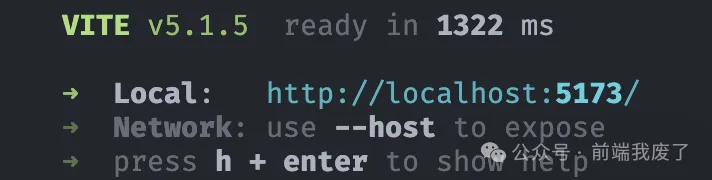

2. 创建调试配置文件 `launch.json`，添加一个调试配置，

   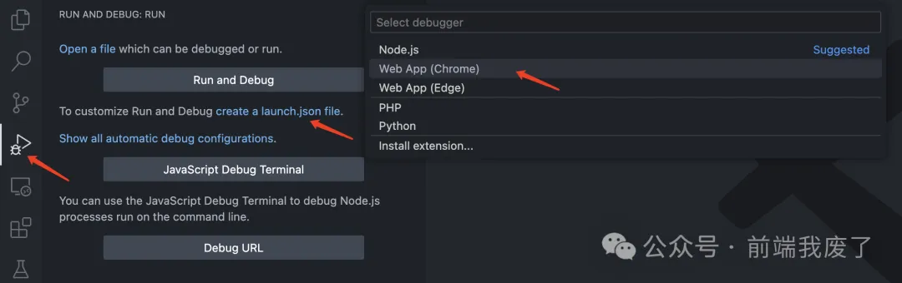

   url 改为启动服务后对应的地址和端口，启动调试，会打开一个新的 chrome 窗口实例访问我们指定的 url；

   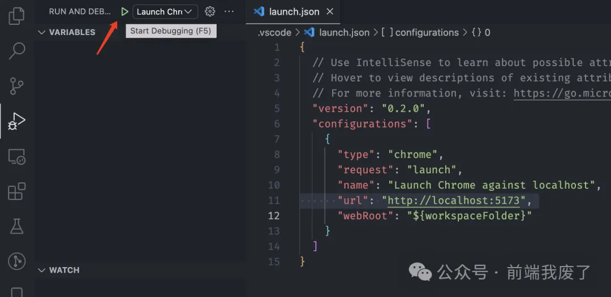

   PS：启动调试时，默认打开的浏览器是一个全新的窗口，啥都没有，可以添加 `userDataDir` 配置来指定用户数据目录，例如`userDataDir: false` 这样打开的就是使用浏览器默认登录的用户。注意浏览器的用户数据目录有个特点，只能被一个 Chrome 实例访问。

3. 在 App.vue 文件打个断点试试，刷新页面，没问题能断住。

   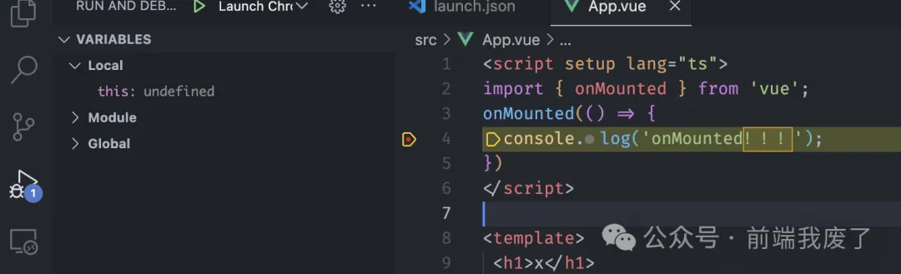

**PS：**

- 如果发现先打断点再启动调试，先断在了编译后的文件，可以试试先启动调试，再打断点。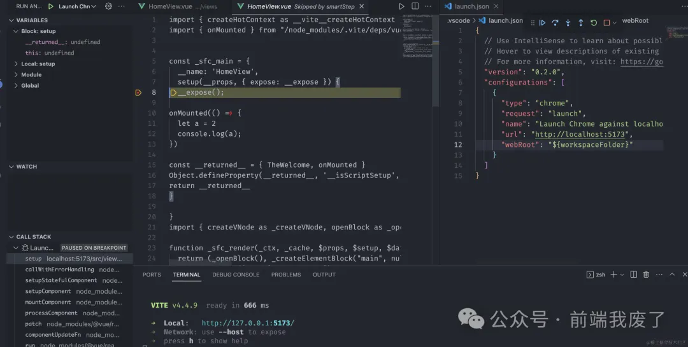

- 如果启动调试后，第一次能断住，后面刷新网页没断住，有可能是缓存的原因，可以禁用掉缓存，勾选 Network 面板 Disable cache。

  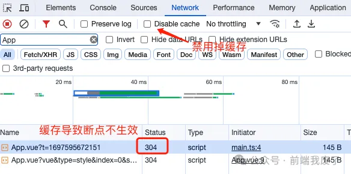

### **调试基于 Webpack 的 Vue 项目**

1. 使用 `vue create vue3-webpack-debug` 创建一个基于 Webpack 的 Vue 3 项目，启动服务 `pnpm serve`；

   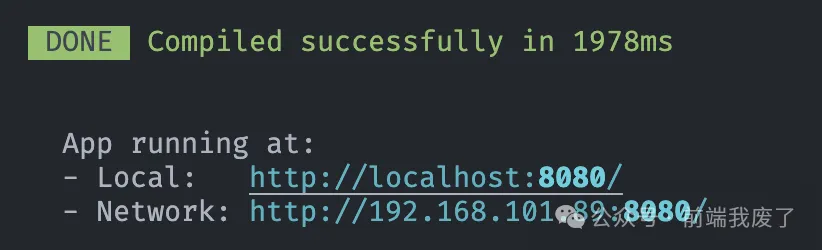

2. 创建调试配置文件 `launch.json`，添加一个调试配置；url 改为启动服务时对应的地址和端口，启动调试；

   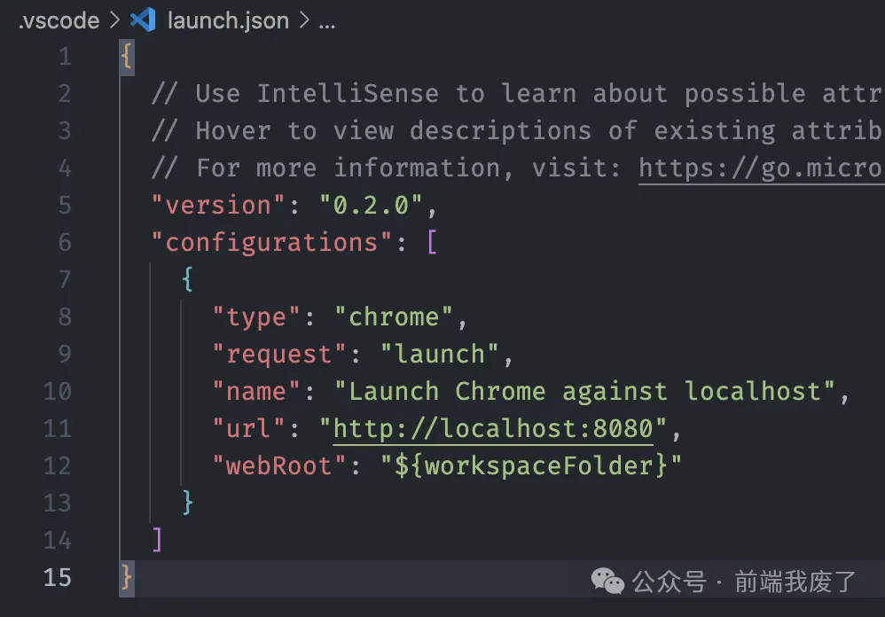

3. 在 App.vue 文件打个断点，没断住，需要将 vue cli 的 `devtool` 默认配置 `eval-cheap-module-source-map` 改为 `cheap-module-source-map` ；

   ```
   // vue.config.js
   const { defineConfig } = require('@vue/cli-service')
   module.exports = defineConfig({
     // 修改 devtool 配置为 cheap-module-source-map
     chainWebpack: (config) => {
       config.devtool("cheap-module-source-map");
     },
     // 省略其他配置
   })
   ```

   修改 `devtool` 原因是，vue cli 默认配置为 `eval-cheap-module-source-map`，其中的 `eval` 会导致映射的模块文件带有 hash 参数，无法在本地找到对应文件；如下图，我们在代码中用 debugger 打断点，发现打开的是一个 `App.vue?91a0` 文件，这个路径无法映射到本地文件，只能只读，应该把 hash 参数处理掉：

   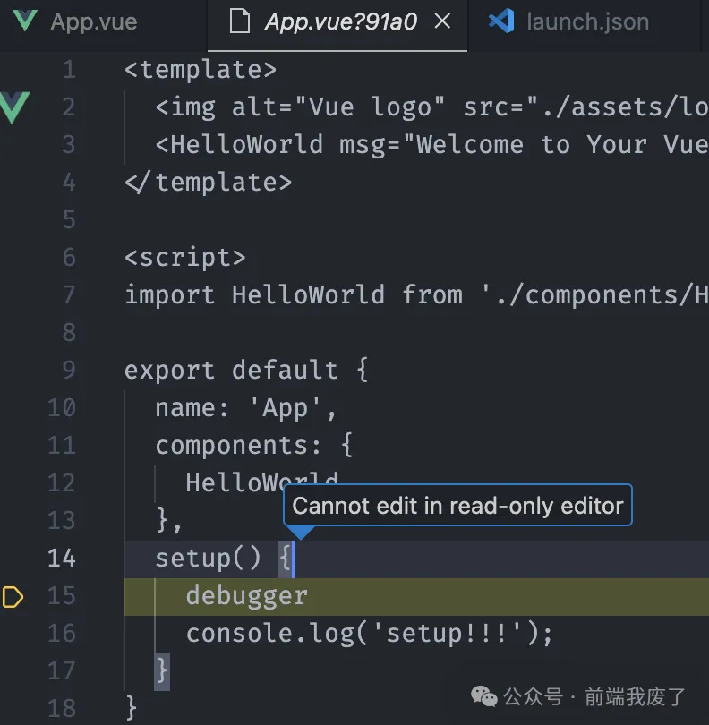

   devtool 配置详情参考文档 **webpack - devtool**[3]

## **调试线上代码报错**

这里我们通过关联 sourcemap 文件的方式，将打包后的代码映射回源码进行调试。关联 sourcemap 是通过在文件末尾添加一行注释，例如`//# sourceMappingURL=xxx.js.map`。但是，在生产部署的代码中，不会将 sourcemap 文件关联在一起，否则源码就会被暴露。

首先，在打包时需要生成单独的 sourcemap 文件，打包工具都有相应的配置：

- 对于 webpack，可以通过将 `devtool` 配置为`hidden-source-map`来实现。该配置的意思是生成 sourcemap 文件，但不会在代码文件末尾中添加关联注释。
- 对于 vite，可以通过将 `build.sourcemap` 配置为 `hidden` 来实现，其效果与 webpack 配置相同。

然后需要一个 url 来访问 sourcemap 文件。这里我们在本地 sourcemap 文件所在目录起一个服务 `npx http-server .` ，这样就有一个本地的 url 能访问到 sourcemap 文件了，接下来就是进行关联操作，有以下几种方式：

**方式 1：开发者工具 - Source 面板中手动关联 sourcemap**

在 Source 面板报错文件中右键添加 sourcemap 将报错文件的 sourmap url 输入，就能映射到源码文件了。但是这种方式页面刷新就得重新添加 sourcemap url。

- 截图：未关联 sourcemap 的源文件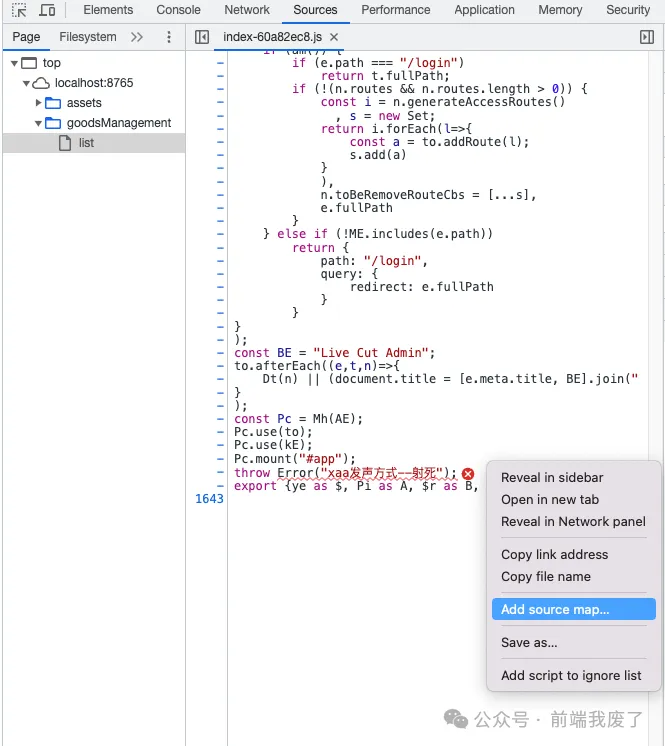
- 截图：添加 sourcemap url 映射到源文件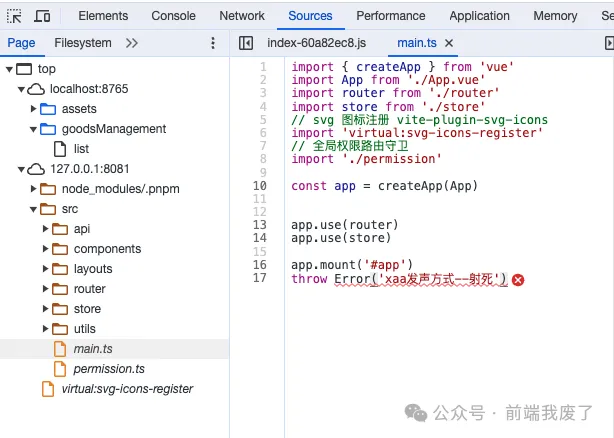

**方式 2：开发者工具 - Source 面板 - Overrides 修改文件内容关联 sourcemap**

在 Network 面板中，右键报错文件请求选择 Override content，会在 Source 面板中保存一份为本地文件，页面刷新重新请求将会使用该本地文件，因此可以在该报错文件末尾添加 sourcemap url，这样就能映射到源码文件了。

- 截图：Override content 修改内容

**方式 3：通过 Charles 等抓包工具断点修改响应内容关联 sourcemap**

在 Charles 中勾选报错文件断点，断住时修改 Response，在文件内容末尾处添加 sourcemap url。对比方式 1 的好处就是修改的内容会缓存，跟方式 2 差不多。

## **总结**

有效的代码调试无疑是提高开发效率的关键一步，无论是在开发新功能的过程中，还是在定位修复现有问题。通过本文了解了如何调试 Vue 项目，包括基于 Vite 和 Webpack 的 Vue 项目的调试方法，调试其他框架项目应该也差不多。同时也介绍了如何调试线上代码报错，通过关联 sourcemap 文件的方式，将打包后的代码映射回源码进行调试。大家如果有更优的调试方案，欢迎交流！另外推荐神光的前端调试通关秘籍，学到很多。

**参考资料**

[1] create-vue: *https://github.com/vuejs/create-vue*

[2] Vue CLI: *https://cli.vuejs.org/zh/guide/*

[3] webpack - devtool: *https://webpack.js.org/configuration/devtool/*
