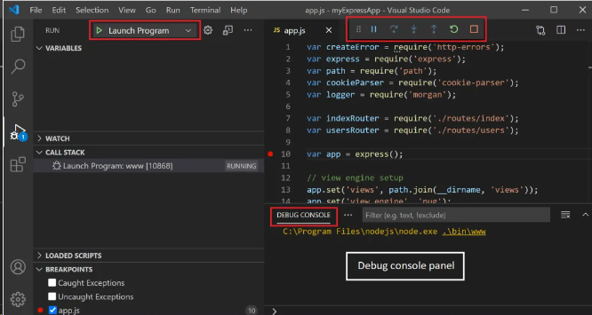
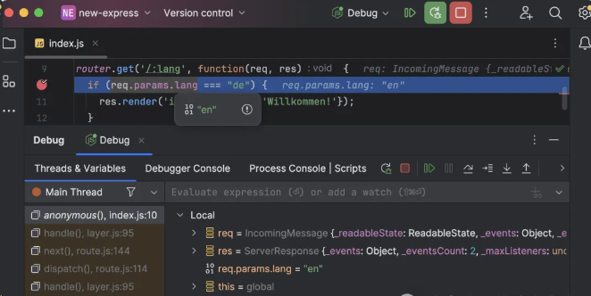
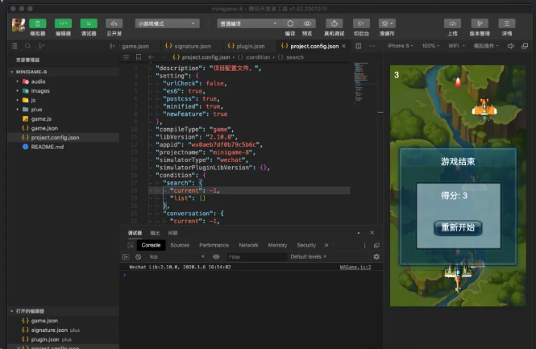

# 代码编辑器调试

## VS Code

VSCode 是一款功能强大的开源代码编辑器，提供了内置的调试器，支持多种语言，包括 Node.js 和 JavaScript。用户可以轻松地通过选择“运行和调试”或使用快捷键 F5 开始调试过程。在调试过程中，VSCode 还支持断点、日志点、数据检查、变量替换等高级功能，以及一个调试控制台。

**官方文档：**https://code.visualstudio.com/docs/editor/debugging

[深入讲解VsCode各场景高级调试与使用技巧 - 掘金 (juejin.cn)](https://juejin.cn/post/7071146744339234846)

## WebStorm

WebStorm 是一款很受欢迎的集成开发环境，它允许用户调试 JavaScript 和 TypeScript 编写的应用，它提供了断点设置、逐步执行代码、评估表达式等高级功能，帮助开发者更加高效地调试代码。用户可以通过简单的操作，如选择调试图标或使用快捷键，来启动调试过程。此外，WebStorm 还支持远程调试和多种调试配置选项，为用户提供了极大的灵活性和便利性。

**官方文档：**https://www.jetbrains.com/help/webstorm/debugging-code.html

## 微信开发者工具

微信开发者工具是微信官方为微信小程序开发者提供的一站式开发环境。它不仅集成了代码编辑、编译、预览、上传、发布以及调试等功能，还支持断点调试、观察变量值、执行代码片段等常见的调试功能。

**官方文档：**https://developers.weixin.qq.com/miniprogram/dev/devtools/debug.html