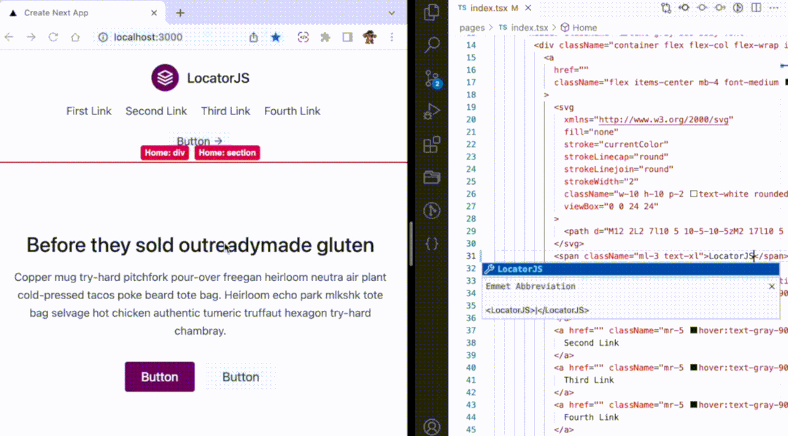
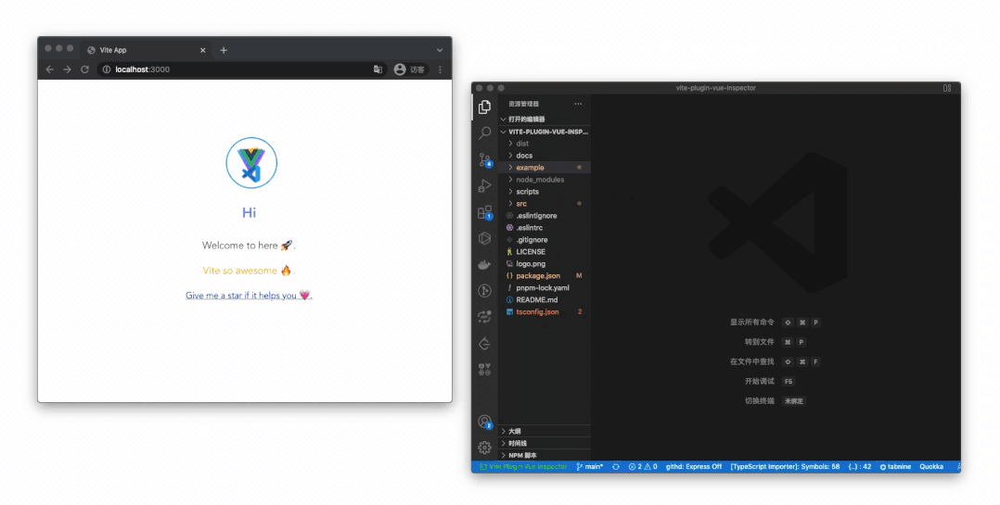

# 其他调试工具

前端人必须掌握的抓包技能：[前端人必须掌握的抓包技能 - 掘金 (juejin.cn)](https://juejin.cn/post/7140040425129115684)

前端人抓包羊了个羊，玩一次就过关：[前端人抓包羊了个羊，玩一次就过关 - 掘金 (juejin.cn)](https://juejin.cn/post/7145256312488591391)

CSS Lint

地址： csslint.net/

CSSLint 是一个用来帮你找出 CSS 代码中问题的工具，它可做基本的语法检查以及使用一套预设的规则来检查代码中的问题，规则是可以扩展的。

JSON Formatter & Validator

地址：jsonformatter.curiousconcept.com/

在未格式化的 JSON 中很难发现语法错误或键值不正确的键，因为它很难读取。 对于 压缩的 JSON 文件，要发现其中的错误是比较难的，所以我们需要一种格式化的工具。

JSON Formatter & Validator tool 就是一个格式化 JSON 的工具，只需输入压缩的JSON格式，就能获得正确格式。该工具也可以验证 JSON 到 RFC 标准。

### Sentry

地址：sentry.io/welcome/

无论测试如何完善的程序，bug总是免不了会存在的，有些bug不是每次都会出现，测试时运行好好的代码可能在某个用户使用时就歇菜了，可是当程序在用户面前崩溃时，你是看不到错误的，当然你会说:”Hey, 我有记日志呢”。 但是说实话，程序每天每时都在产生大量的日志，而且分布在各个服务器上，并且如果你有多个服务在维护的话，日志的数量之多你是看不过来的吧。等到某天某个用户实在受不了了，打电话来咆哮的时候，你再去找日志你又会发现日志其实没什么用：缺少上下文，不知道用户什么操作导致的异常，异常太多（从不看日志的缘故）不知如何下手 等等。

Sentry就是来帮我们解决这个问题的，它是是一个实时事件日志记录和聚合平台。它专门用于监视错误和提取执行适当的事后操作所需的所有信息, 而无需使用标准用户反馈循环的任何麻烦。
Sentry是一个日志平台, 它分为客户端和服务端，客户端(目前客户端有Python, PHP,C#, Ruby等多种语言)就嵌入在你的应用程序中间，程序出现异常就向服务端发送消息，服务端将消息记录到数据库中并提供一个web节目方便查看。Sentry 由 python 编写，源码开放，性能卓越，易于扩展，目前著名的用户有Disqus, Path, mozilla, Pinterest等。

### BrowserStack

地址：www.browserstack.com/

现在拥有各自内核的浏览器越来越多，各自的特性也千差万别。如果作为一个前端攻城师想要检测网站在不同的操作系统和移动平台下的各种浏览器的兼容性，那是相当痛苦不堪的。看到有在自己电脑上装虚拟机配置各种环境，有自己的电脑上组建好这样的环境，然后一一测试，可是人的精力毕竟有限，我们没法在同一台电脑上装那么多系统，那么多浏览器的。幸好出了个 BrowserStack 是前端的福音呀。

BrowserStack 是一款提供网站浏览器兼容性测试的在线云端测试工具，从而开发测试人员不必再准备很多虚拟机或者手机模拟器。

BrowserStack 是一个提供网站浏览器兼容性测试的在线云端应用，支持9大操作系统上的100多款浏览器。支持本地测试，支持与Visual Studio集成。或者你也可以直接前往 modern.ie 在线测试，现在注册可以免费试用三个月，三个月后是收费的，三个月后要是你想用又不想付费作为天朝的开发者你懂得。

## 点击元素跳转代码

### LocatorJS

使用 LocatorJS，在浏览器中单击 UI 组件就可以直接在 IDE 中打开其代码。可以通过浏览器插件（支持 Chrome 和 Firfox）或者在项目中安装依赖来引入 LocatorJS，其适用于 React、Preact、Solid、Vue 和 Svelte。

**Github：**https://github.com/infi-pc/locatorjs

### react-dev-inspector

只需单击一下即可直接从浏览器 React 组件跳转到本地 IDE 对用的代码。适用于几乎所有的 React 框架，例如 Vite、 Next.js、 Create React App、 Umi3、 Ice.js，或任何其他在内置中使用 @babel/plugin-transform-react-jsx-source 的 React 项目。该插件仅适用于 VS Code，但简单，无需任何其他配置。

**Github：**https://github.com/zthxxx/react-dev-inspector

### vite-plugin-vue-inspector

一个 vite 插件，当点击浏览器的元素时，它提供了自动跳转到本地 IDE 的能力，支持 Vue2、Vue3、Nuxt3、SSR。

**Github：**https://github.com/webfansplz/vite-plugin-vue-inspector
