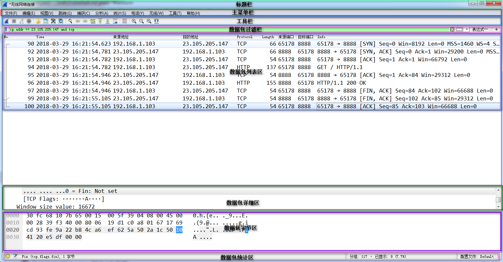
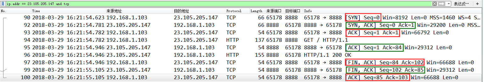
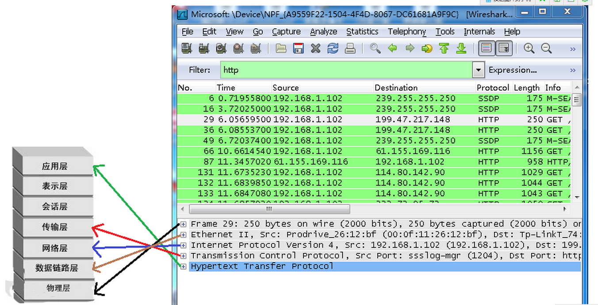
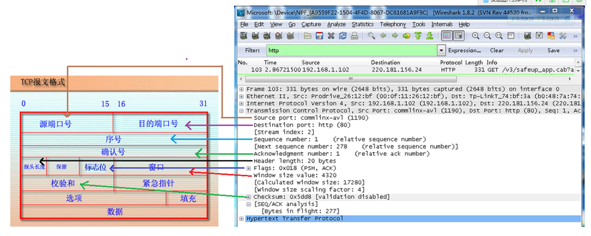
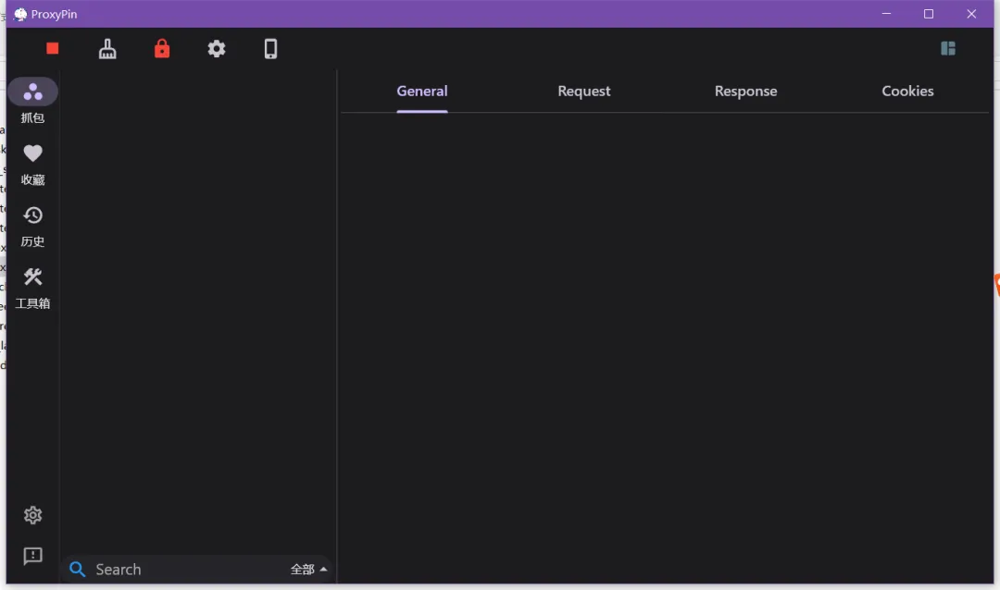
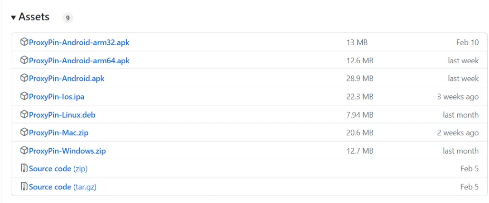
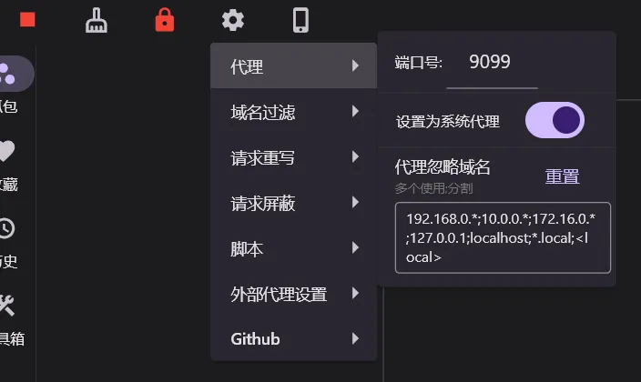
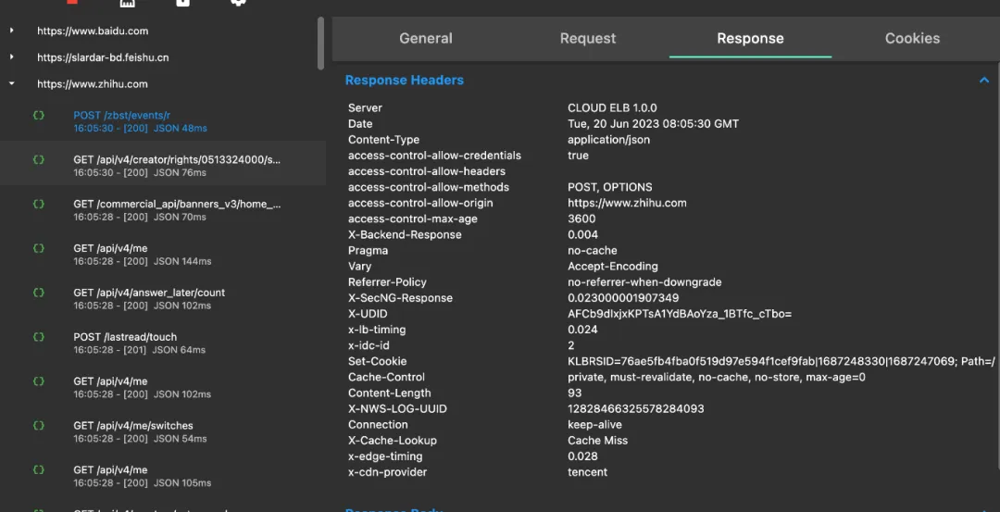

# 抓包工具调试

抓包技能：<https://juejin.cn/post/7140040425129115684>

抓包工具：Fiddler/HTTPDebugger/Charles【PC】、HttpCarry【Android】、Stream【iphone】

## Fiddler

**官方文档：**https://www.telerik.com/fiddler

Fiddler是一个HTTP协议的调试代理工具，以代理服务器的方式监听系统的HTTP网络数据流动。Fiddler的功能特点包括截获客户端的HTTP/HTTPS请求，进行分析与开发调试，解决开发接口跨域问题、资源访问限制问题，快速调试线上脚本、排除故障，进行弱网络环境模拟测试以暴露应用在弱网下的用户体验，进行接口性能测试，以及模拟各种网络攻击。

## whistle

**官方文档**：<https://wproxy.org/whistle/>

**GitHub**：<https://github.com/avwo/whistle>

介绍：于 Node 实现的跨平台 web 调试代理工具，类似的工具有 Windows 平台上的 Fiddler，主要用于查看、修改 HTTP、HTTPS、Websocket 的请求、响应，也可以作为 HTTP 代理服务器使用，不同于 Fiddler 通过断点修改请求响应的方式，whistle 采用的是类似配置系统 hosts 的方式，一切操作都可以通过配置实现，支持域名、路径、正则表达式、通配符、通配路径等多种匹配方式，且可以通过 Node 模块扩展功能

Whistle是一个基于Node.js的跨平台抓包调试工具，适用于Mac、Windows等桌面系统以及服务端等命令行系统。它功能全面，可以作为HTTP、HTTPS、SOCKS的代理及反向代理，并支持抓包及修改HTTP、HTTPS、HTTP2、WebSocket、TCP请求。此外，它还允许重放和构造各种请求，提供上游代理、PAC脚本、Hosts设置以及请求响应的延迟或限速功能。

---

### whistle 的使用

通过 https 访问仅支持 http 的网站

场景：本地开发用 https 访问

本地开发时，假设服务启动在 127.0.0.1:3000 上，它可能只支持 http 访问，不支持 https 访问。但是有一些 API 是只能在 https 使用的（例如 navigator 定位相关）。

如果你想使用 https 访问 127.0.0.1:3000，你只需要配置这样的代理即可：

<https://127.0.0.1:3000/> <http://127.0.0.1:3000/>

配置应该写在如图所示的地方：

你访问<https://127.0.0.1:3000/时，就会以https方式访问到你的前端服务啦。>

原理

whistle 服务和你的前端服务是通过 http 连接的，你的浏览器和你的 whistle 服务是通过 https 连接的。whistle 作为中间人，只是转发、透传。

通过线上域名访问你的本地服务

场景一：前端代码里可能有域名判断。以前，我们可能得在代码里这么写：

```javascript
if (["127.0.0.1", "localhost"].includes(window.location.host)) {
} else if (window.location.host === "online.com") {
}
```

有什么后果？线上分支测试不到。你本地只测试了第一个分支，但是第二个分支没法测。

场景二：跨域问题

有时候代码依赖后端 API，但是后端开发没给 127.0.0.1 域名配置 CORS 头，只允许同域名的来源访问 API。本地开发时用 127.0.0.1 发请求会报跨域问题。

场景三：切换线上数据、测试数据、mock 数据

我们代码中发请求，可能都是对服务器线上域名发请求。这样切换测试数据、mock 数据不太方便。

解决

你可以配置代理，将线上域名转到本地开发服务器上（或者转到测试环境、mock 数据）。这样虽然浏览器认为你的域名是线上服务，但展示内容其实是你的开发服务器（请求到数据也都是测试环境或 mock 数据）。

假设你的本地服务器是 127.0.0.1:3000，线上服务器是 online.com，你可以配置代理：

<http://online.com/> <http://127.0.0.1:3000/>

原理

你的浏览器通过<http://online.com/访问你的whistle服务，whistle服务访问http://127.0.0.1:3000/。whistle作为中间人，只是转发、透传。>

解决跨域问题

场景：某个别人的网站报错跨域 bug

如果你访问一些网站时崩溃了，那个网站没人修，但你着急用，你可以找到报错的域名，通过 whistle 解决跨域问题。

解决

有 2 种方法（下面 2 行分别是一种），可以都试一下，看哪个好用就用哪个，记得把域名改成跨域请求的域名。

```bash
i.snssdk.com resCors://enable
mcs.snssdk.com resCors://*
```

参考 whistle 的 resCors 语法。

原理

跨域，是浏览器行为。其实发生跨域时，请求已经发出，响应也已经收到，但是浏览器发现服务器不允许跨域，就不展示给用户了。

只要我们让 whistle 做一个「中间人」，修改响应头，给跨域头通通加上，再把 Response 返回给浏览器，就解决跨域问题了。

修改 API 响应内容

场景：看看掘金双 Lv8 Logo 是什么样子

如果我们想修改掘金 API 返回结果怎么办？

改一些 UI 逻辑，改 DOM 可不容易，你可能还要去其他人那里找现成的来复制。

不如干脆直接，改请求结果！那么页面自动按照请求结果渲染，如下图：

解决

详见 whistle 的 resBody 语法。

原理

whistle 作为中间人，用你提供的 Response Body 替换了掘金服务器的 Response Body。

启动本地静态资源服务器

场景：本地预览编译结果

有时候，我们编译好了，想测试一下编译产物是否正常。难道需要部署完才能测试吗？

大可不必，启动 whistle，把某个域名解析到你的某个文件目录，那么就可以直接用 HTTP 协议访问啦。

解决

详见 whistle 的 file 语法。

原理

whistle 作为中间人，用你提供的文件路径，作为 Response，返回给了浏览器。

## wireshark 抓包工具的使用

参考珠峰教学文章笔记：<http://www.zhufengpeixun.com/strong/html/12.NetWork-3.html#t01.%20wireshark%E6%9C%89%E4%BB%80%E4%B9%88%E7%94%A8>

### 1. wireshark 有什么用

1. 分析网络底层协议
2. 解决网络故障问题
3. 找寻网络安全问题

### 2. 安装

- [download](https://www.wireshark.org/download.html)
- [wiresharkbook](http://wiresharkbook.com/)

### 3. 快速抓包

- 初始化界面
- 选择网卡
- 停止抓包
- 保存数据包

### 4. 界面



- 标题栏
- 主菜单栏
- 工具栏
- 数据包过滤栏
- 数据包列表区
- 数据包详细区
- 数据包字节区
- 数据包统计区

### 5. 过滤器设置

#### 5.1 抓包过滤器


##### 5.1.1 语法

协议+方向+类型+值

- HOST net port host
- 方向 src、dst、src and dst、src or dst
- 协议 ether ip tcp udp http ftp
- 逻辑运算符 && || !

##### 5.1.2 例子

- src host 192.168.1.1 && dst port 80 抓取来源地址为 192.168.1.1，并且目的为 80 端口的流量
- host 192.168.1.1|| host host 192.168.1.2 抓取 192.168.1.1 或 192.168.1.2 的流量
- !broadcast 不抓取广播包

###### 5.1.2.1 过滤 MAC

- ether host 00:00:00:00:00:00 网卡主机
- ether src host 00:00:00:00:00:00 来源 MAC
- ether dst host 00:00:00:00:00:00 目标 MAC

###### 5.1.2.2 过滤 IP

- host 192.168.1.1
- src host 192.168.1.1
- det host 192.168.1.1

###### 5.1.2.3 过滤端口

- port 80
- !port 80
- dst port 80
- src port 80

###### 5.1.2.4 过滤协议

- arp
- tcp

###### 5.1.2.5 综合过滤

- host 192.168.1.100 && port 8080

#### 5.2 显示过滤器

显示过滤器：对捕捉到的数据包依据协议或包的内容进行过滤 

##### 5.2.1 语法

- 比较操作符 `== != > < >= <=`

- 逻辑操作符 and or xor(有且仅有一个条件被满足) not

- IP 地址 ip addr ip.src ip.dst

- 端口过滤 tcp.port tcp.srcport tcp.dstport tcp.flags.syn tcp.flag.ack

- 协议过滤 arp ip icmp udp tcp bootp dns

##### 5.2.2 案例

###### 5.2.2.1 过滤 IP

- ip.addr == 192.168.0.1

- ip.src == 192.168.0.1

- ip.dst == 192.168.0.1

- ip.src == 192.168.0.1 and ip.dst == 192.168.0.1

###### 5.2.2.2 过滤端口

- tcp.port == 80
- tcp.srcport == 80
- tcp.dstport == 80
- tcp.flags.sync == 1

###### 5.2.2.3 过滤协议

- arp
- tcp
- udp
- not http
- not arp

###### 5.2.2.4 案例

- ip.src == 192.168.0.1 and tcp.dstport == 80
- ip.addr == 192.168.0.1 and udp.port == 60000

### 6. 三次握手



#### 7. Wireshark 与对应的 OSI 七层模型



#### TCP 包具体内容 [#](http://www.zhufengpeixun.com/strong/html/12.NetWork-3.html#t22TCP包具体内容)



#### 8.参考

- [wireshark](https://www.cnblogs.com/TankXiao/archive/2012/10/10/2711777.html)

### spy-debugger：移动端抓包调试工具

- 一站式页面调试、抓包工具。远程调试任何手机浏览器页面，任何手机移动端 webview（如：微信，HybridApp 等）。支持 HTTP/HTTPS，无需 USB 连接设备。

- 学习

  - [spy-debugger - 移动端抓包调试工具\_Yushia-Lin 的博客-CSDN 博客\_spy-debugger](https://blog.csdn.net/shrimp6/article/details/123630050)

- 特性

  - 1.页面调试＋抓包

  - 2.操作简单，无需 USB 连接设备

  - 3.支持 HTTPS。

  - 4.spy-debugger 内部集成了 weinre、node-mitmproxy、AnyProxy。

  - 5.自动忽略原生 App 发起的 https 请求，只拦截 webview 发起的 https 请求。对使用了 SSL pinning 技术的原生 App 不造成任何影响。

  - 6.可以配合其它代理工具一起使用(默认使用 AnyProxy) (设置外部代理)

- 网址
  - github
    - https://github.com/wuchangming/spy-debugger

### Windows 上用 Fiddler

- 作用设置

  - Fiddler 是位于客户端和服务器端的 HTTP 代理，也是目前最常用的 http 抓包工具之一 。 它能够记录客户端和服务器之间的所有 HTTP 请求，可以针对特定的 HTTP 请求，分析请求数据、设置断点、调试 web 应用、修改请求的数据，甚至可以修改服务器返回的数据，功能非常强大，是 web 调试的利器。

  - 设置 http 代理为 127.0.0.1:8888 的浏览器和应用程序

  - Fiddler 可以直接抓取所有接口数据，无需设置。

- 特点

  - 1.可以调试 PC、Mac 或 Linux 系统和移动设备的之间的通信，支持大部分框架如 java、.net、java、Ruby，需要设置代理。

  - 2.能够暂停 Http 通讯，并且允许修改请求和响应方便进行安全测试，也可以设置检查点做功能测试。

  - 3.通过暴露 HTTP 头，用户可以看见哪些页面被允许在客户端或者是代理端进行缓存。如果要是一个响应没有包含 Cache-Control 头，那么他就不会被缓存在客户端。

  - 4.可以通过 Composer 进行接口测试。

- 作用

  - 断点拦截修改参数请求

    - 1.设置断点，修改参数的传值

    - 2.选中请求地址-右边：Inspectors-WebFrom-QueryString 栏目

      - 2.1 分支功能： -- 底下黄色按钮 "Break on Response" 中断响应

      - 2.2 TextView (响应的网页 html 文件)

        - 1.可在底部搜索找到字符，在网页文件里面添加和修改 html 和 js 代码，达到显示自己想要的元素在页面上

        - 2.点右边底下的 绿色按钮"Run to Completion" 再点顶部 "绿色播放图标+Go"按钮 , 释放断点，这时候网页便重新加载出来，这个时候网页上便有自己添加的相关元素

        - 3.再次断点拦截当前请求，黄色按钮 "Break on Response" 中断响应，再次搜索关键词修改 js 判断的代码

        - 4.点右边底下的 绿色按钮"Run to Completion" 再点顶部 "绿色播放图标+Go"按钮 , 释放断点

    - 3.修改参数值

    - 4.底部关掉断点(点两下，直到没有图标)

    - 5.最后点右边底下的 绿色按钮"Run to Completion" 再点顶部 "绿色播放图标+Go"按钮 , 释放断点 请求数据

    - 断点-跳支付 测试

  - 断点后 R 包创建多条断点，复制多条当前的断点请求，可以 一次活动 多次请求 领取多次奖励

    - 1.断点状态下

    - 英文输入法下快捷键

      - r

        - 点击一次复制一条

      - Shift+r
        - 可弹出复制多少条请求，输入多少条，就复制多少条断点请求

  - fiddler 开发插件 - 通过设置随机定位地址和伪造 ip(虚拟 ip)

- 子主题 4

### Mac 上用 Charles

- Charles 是 mac os 和 windows 下的另外一个抓包软件（均收费，可破解），功能与 fiddler 类似，优点是可以自定义上下行网速、External Proxy、反向代理配置简单、可解析 AMF 协议数据……

- Charles 对于 https 无法直接获取到，可获取的呈现出来也都是乱码，需要安装 ssl 证书

- Charles 是获取到的数据没有 Fiddler 全面，想要的数据几乎都没抓到，比对后发现 Charles 没有抓取到的数据刚好在 Fiddler 下全部都是 https 协议的，对于这部分 https 协议 Charles 几乎都获取不到，能够获取到的也都是乱码状态，问题解决:

  - 解决方案：https://blog.csdn.net/baidu_32542573/article/details/83624472

  - https://blog.csdn.net/u011032846/article/details/50350752

### 浏览器调试工具

- Firebug

  - 1、Firebug 是 firefox 下的一个扩展，它除了能进行网络分析还能够调试所有网站语言，如 js、Html、Css 等，支持各种浏览器如 IE、Firefox、Opera,、Safari。

  - 2. Firebug 是开源工具，能够将页面中的 CSS、javascript 以及网页中引用的图片载入所消耗的时间以矩状图呈现出来，方便我们对网页进行调优。

  - 3.Firebug 编辑、删改任何网站的 CSS、HTML、DOM 以及 JavaScript 代码，可以通过小箭头定位页面元素。

### httpwatch

- 1. httpwatch 与 IE 和 firefox 浏览器集成，但不支持 chrome；httpwatch 界面清晰直观，发送请求后可以快速简单的查看 Cookies, Headers, Query Strings and POST data，能够通过页面分组处理多页面场景。

- 2. 实时分级时间展示图能够展示一个 http/https 请求的处理过程；通过不同的颜色展示网络请求计时，如 DNS 查询，tcp 连接；以瀑布形式展示浏览器事件，例如从浏览器渲染和页面加载计时就开始了，可以自动检查性能问题。

- 3. 安装简单，不需要设置代理和证书；提供接口 API 可以被大部分编程语言自动化调用、录制、保存结果。

- 4. 但只能看不能修改。

### wireshark

- 是一个网络封包分析软件。网络封包分析软件的功能是撷取网络封包，并尽可能显示出最为详细的网络封包资料。Wireshark 使用 WinPCAP 作为接口，直接与网卡进行数据报文交换。

- 网络管理员使用 Wireshark 来检测网络问题，网络安全工程师使用 Wireshark 来检查资讯安全相关问题，开发者使用 Wireshark 来为新的通讯协定除错，普通使用者使用 Wireshark 来学习网络协定的相关知识。当然，有的人也会“居心叵测”的用它来寻找一些敏感信息……

- Wireshark 不是入侵侦测系统（Intrusion Detection System,IDS）。对于网络上的异常流量行为，Wireshark 不会产生警示或是任何提示。然而，仔细分析 Wireshark 撷取的封包能够帮助使用者对于网络行为有更清楚的了解。Wireshark 不会对网络封包产生内容的修改，它只会反映出流通的封包资讯。 Wireshark 本身也不会送出封包至网络上。

### SmartSniff

- SmartSniff 可以让捕获你的网络适配器的 TCP/IP 数据包，并且可以让 你按顺序地查看客户端与服务器之间会话的数据。你可以使用 ASCII 模式 (用于基于文本的协议，例如 HTTP、SMTP、POP3 与 FTP。)、十六进制模式来查看 TCP/IP 会话 (用于基于非文本的协议，例如 DNS)。 　　 SmartSniff 支持 IP 过滤设置，可以不显示自己的和你认为不需要显示出来的 IP。初次运行时需要指定网卡。基本不需要改写系统注册表，是个绿色的免费工具。

### burp suite

- 安全渗透测试工具

- Burp Suite 是用于攻击 web 应用程序的集成平台。它包含了许多工具，并为这些工具设计了许多接口，以促进加快攻击应用程序的过程。所有的工具都共享一个能处理并显示 HTTP 消息，持久性，认证，代理，日志，警报的一个强大的可扩展的框架。

- 功能

  - 1.Target(目标)——显示目标目录结构的的一个功能

  - 2.Proxy(代理)——拦截 HTTP/S 的代理服务器，作为一个在浏览器和目标应用程序之间的中间人，允许你拦截，查看，修改在两个方向上的原始数据流。

  - 3.Spider(蜘蛛)——应用智能感应的网络爬虫，它能完整的枚举应用程序的内容和功能。

  - 4.Scanner(扫描器)——高级工具，执行后，它能自动地发现 web 应用程序的安全漏洞。

  - 5.Intruder(入侵)——一个定制的高度可配置的工具，对 web 应用程序进行自动化攻击，如：枚举标识符，收集有用的数据，以及使用 fuzzing 技术探测常规漏洞。

  - 6.Repeater(中继器)——一个靠手动操作来触发单独的 HTTP 请求，并分析应用程序响应的工具。

  - 7.Sequencer(会话)——用来分析那些不可预知的应用程序会话令牌和重要数据项的随机性的工具。

  - 8.Decoder(解码器)——进行手动执行或对应用程序数据者智能解码编码的工具。

  - 9.Comparer(对比)——通常是通过一些相关的请求和响应得到两项数据的一个可视化的"差异"。

  - 10.Extender(扩展)——可以让你加载 Burp Suite 的扩展，使用你自己的或第三方代码来扩展 Burp Suit 的功能。

  - 11.Options(设置)——对 Burp Suite 的一些设置

## Charles

Charles是一个HTTP代理服务器、HTTP监视器以及反转代理服务器。当浏览器连接Charles的代理访问互联网时，Charles可以监控浏览器发送和接收的所有数据。它能够允许开发者查看所有连接互联网的HTTP通信，包括request、response以及HTTP headers。

**官方文档：**https://www.charlesproxy.com/documentation/

## ProxyPin

GitHub：https://github.com/wanghongenpin/network_proxy_flutter

`ProxyPin` 是一款开源免费的抓包工具，使用 Flutter 开发，界面简洁美观，操作简单易上手,支持 Windows、Mac、Android、iOS 全平台系统



核心功能有：

- 手机扫码连接：无需手动配置 WiFi 代理，所有终端都可以互相扫码连接转发流量。
- 域名过滤：只拦截您所需要的流量，不拦截其他流量，避免干扰其他应用。
- 请求重写：支持重定向，支持替换请求或响应报文，也可以根据规则修改请求或响应。
- 请求屏蔽：支持根据 URL 屏蔽请求，不让请求发送到服务器。
- 脚本：支持编写 JavaScript 脚本来处理请求或响应。
- 搜索：根据关键词、响应类型等多种条件搜索请求。
- 其他：收藏、历史记录、工具箱等。

### 性能特色

ProxyPin 具有以下性能特色：

- 跨平台：支持 Windows、Mac、Android、iOS 全平台系统。
- 易用性：界面简洁美观，操作简单易上手。
- 功能强大：支持多种抓包功能，满足大部分开发者的需求。
- 开源免费：完全开源，免费使用。

### 快速使用

在项目release页面，找到对应的安装包下载并安装 ProxyPin。



打开 ProxyPin，设置代理端口。



在要抓取的应用上，如浏览器或其他应用中设置代理服务器地址和端口。然后访问目标网站或应用，即可抓取到相关的网络请求和响应数据。



总体感觉，ProxyPin 还是挺好用的，功能强大、易于使用，很适合开发人员进行网络调试和安全分析。
