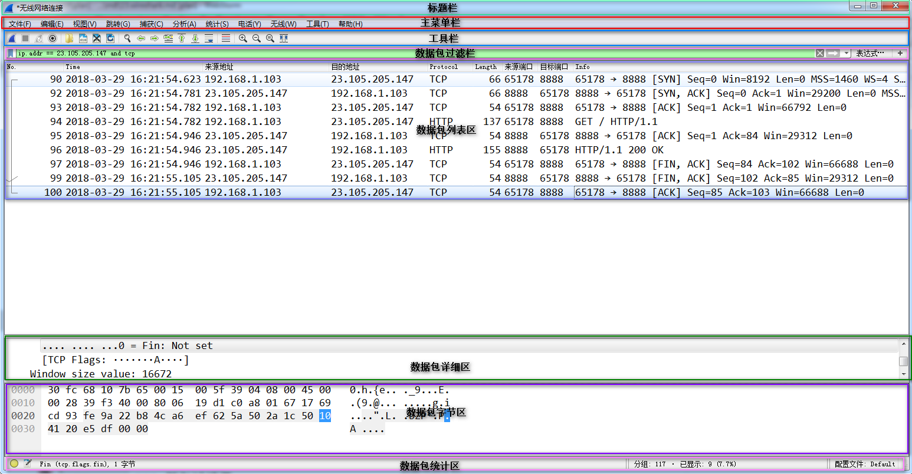
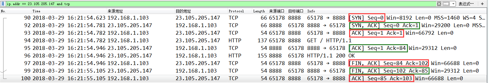
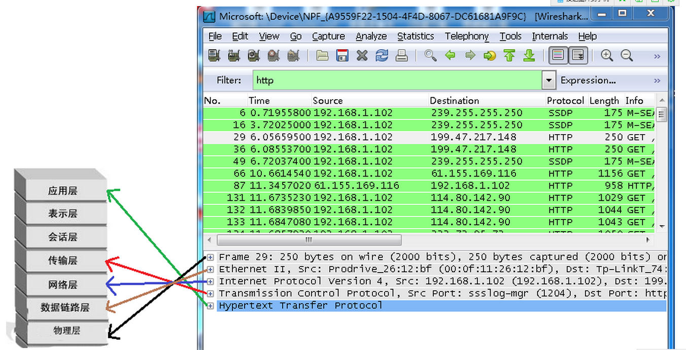
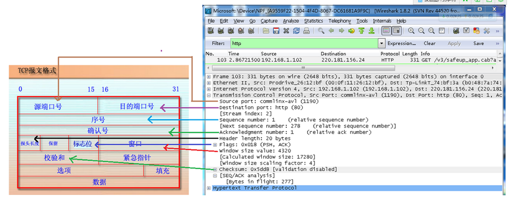

# 抓包工具调试

抓包技能：<https://juejin.cn/post/7140040425129115684>

抓包工具：Fiddler/HTTPDebugger/Charles【PC】、HttpCarry【Android】、Stream【iphone】

## Fiddler

待定

## whistle

**官方文档**：<https://wproxy.org/whistle/>

**GitHub**：<https://github.com/avwo/whistle>

介绍：于 Node 实现的跨平台 web 调试代理工具，类似的工具有 Windows 平台上的 Fiddler，主要用于查看、修改 HTTP、HTTPS、Websocket 的请求、响应，也可以作为 HTTP 代理服务器使用，不同于 Fiddler 通过断点修改请求响应的方式，whistle 采用的是类似配置系统 hosts 的方式，一切操作都可以通过配置实现，支持域名、路径、正则表达式、通配符、通配路径等多种匹配方式，且可以通过 Node 模块扩展功能

---

### whistle 的使用

通过 https 访问仅支持 http 的网站

场景：本地开发用 https 访问

本地开发时，假设服务启动在 127.0.0.1:3000 上，它可能只支持 http 访问，不支持 https 访问。但是有一些 API 是只能在 https 使用的（例如 navigator 定位相关）。

如果你想使用 https 访问 127.0.0.1:3000，你只需要配置这样的代理即可：

<https://127.0.0.1:3000/> <http://127.0.0.1:3000/>

配置应该写在如图所示的地方：

你访问<https://127.0.0.1:3000/时，就会以https方式访问到你的前端服务啦。>

原理

whistle 服务和你的前端服务是通过 http 连接的，你的浏览器和你的 whistle 服务是通过 https 连接的。whistle 作为中间人，只是转发、透传。

通过线上域名访问你的本地服务

场景一：前端代码里可能有域名判断。以前，我们可能得在代码里这么写：

```javascript
if (["127.0.0.1", "localhost"].includes(window.location.host)) {
} else if (window.location.host === "online.com") {
}
```

有什么后果？线上分支测试不到。你本地只测试了第一个分支，但是第二个分支没法测。

场景二：跨域问题

有时候代码依赖后端 API，但是后端开发没给 127.0.0.1 域名配置 CORS 头，只允许同域名的来源访问 API。本地开发时用 127.0.0.1 发请求会报跨域问题。

场景三：切换线上数据、测试数据、mock 数据

我们代码中发请求，可能都是对服务器线上域名发请求。这样切换测试数据、mock 数据不太方便。

解决

你可以配置代理，将线上域名转到本地开发服务器上（或者转到测试环境、mock 数据）。这样虽然浏览器认为你的域名是线上服务，但展示内容其实是你的开发服务器（请求到数据也都是测试环境或 mock 数据）。

假设你的本地服务器是 127.0.0.1:3000，线上服务器是 online.com，你可以配置代理：

<http://online.com/> <http://127.0.0.1:3000/>

原理

你的浏览器通过<http://online.com/访问你的whistle服务，whistle服务访问http://127.0.0.1:3000/。whistle作为中间人，只是转发、透传。>

解决跨域问题

场景：某个别人的网站报错跨域 bug

如果你访问一些网站时崩溃了，那个网站没人修，但你着急用，你可以找到报错的域名，通过 whistle 解决跨域问题。

解决

有 2 种方法（下面 2 行分别是一种），可以都试一下，看哪个好用就用哪个，记得把域名改成跨域请求的域名。

```bash
i.snssdk.com resCors://enable
mcs.snssdk.com resCors://*
```

参考 whistle 的 resCors 语法。

原理

跨域，是浏览器行为。其实发生跨域时，请求已经发出，响应也已经收到，但是浏览器发现服务器不允许跨域，就不展示给用户了。

只要我们让 whistle 做一个「中间人」，修改响应头，给跨域头通通加上，再把 Response 返回给浏览器，就解决跨域问题了。

修改 API 响应内容

场景：看看掘金双 Lv8 Logo 是什么样子

如果我们想修改掘金 API 返回结果怎么办？

改一些 UI 逻辑，改 DOM 可不容易，你可能还要去其他人那里找现成的来复制。

不如干脆直接，改请求结果！那么页面自动按照请求结果渲染，如下图：

解决

详见 whistle 的 resBody 语法。

原理

whistle 作为中间人，用你提供的 Response Body 替换了掘金服务器的 Response Body。

启动本地静态资源服务器

场景：本地预览编译结果

有时候，我们编译好了，想测试一下编译产物是否正常。难道需要部署完才能测试吗？

大可不必，启动 whistle，把某个域名解析到你的某个文件目录，那么就可以直接用 HTTP 协议访问啦。

解决

详见 whistle 的 file 语法。

原理

whistle 作为中间人，用你提供的文件路径，作为 Response，返回给了浏览器。

## wireshark 抓包工具的使用

参考珠峰教学文章笔记：<http://www.zhufengpeixun.com/strong/html/12.NetWork-3.html#t01.%20wireshark%E6%9C%89%E4%BB%80%E4%B9%88%E7%94%A8>

### 1. wireshark 有什么用

1. 分析网络底层协议
2. 解决网络故障问题
3. 找寻网络安全问题

### 2. 安装

- [download](https://www.wireshark.org/download.html)
- [wiresharkbook](http://wiresharkbook.com/)

### 3. 快速抓包

- 初始化界面
- 选择网卡
- 停止抓包
- 保存数据包

### 4. 界面



- 标题栏
- 主菜单栏
- 工具栏
- 数据包过滤栏
- 数据包列表区
- 数据包详细区
- 数据包字节区
- 数据包统计区

### 5. 过滤器设置

#### 5.1 抓包过滤器


##### 5.1.1 语法

协议+方向+类型+值

- HOST net port host
- 方向 src、dst、src and dst、src or dst
- 协议 ether ip tcp udp http ftp
- 逻辑运算符 && || !

##### 5.1.2 例子

- src host 192.168.1.1 && dst port 80 抓取来源地址为 192.168.1.1，并且目的为 80 端口的流量
- host 192.168.1.1|| host host 192.168.1.2 抓取 192.168.1.1 或 192.168.1.2 的流量
- !broadcast 不抓取广播包

###### 5.1.2.1 过滤 MAC

- ether host 00:00:00:00:00:00 网卡主机
- ether src host 00:00:00:00:00:00 来源 MAC
- ether dst host 00:00:00:00:00:00 目标 MAC

###### 5.1.2.2 过滤 IP

- host 192.168.1.1
- src host 192.168.1.1
- det host 192.168.1.1

###### 5.1.2.3 过滤端口

- port 80
- !port 80
- dst port 80
- src port 80

###### 5.1.2.4 过滤协议

- arp
- tcp

###### 5.1.2.5 综合过滤

- host 192.168.1.100 && port 8080

#### 5.2 显示过滤器

显示过滤器：对捕捉到的数据包依据协议或包的内容进行过滤 

##### 5.2.1 语法

- 比较操作符 == != > < >= <=

- 逻辑操作符 and or xor(有且仅有一个条件被满足) not

- IP 地址 ip addr ip.src ip.dst

- 端口过滤 tcp.port tcp.srcport tcp.dstport tcp.flags.syn tcp.flag.ack

- 协议过滤 arp ip icmp udp tcp bootp dns

##### 5.2.2 案例

###### 5.2.2.1 过滤 IP

- ip.addr == 192.168.0.1

- ip.src == 192.168.0.1

- ip.dst == 192.168.0.1

- ip.src == 192.168.0.1 and ip.dst == 192.168.0.1

###### 5.2.2.2 过滤端口

- tcp.port == 80
- tcp.srcport == 80
- tcp.dstport == 80
- tcp.flags.sync == 1

###### 5.2.2.3 过滤协议

- arp
- tcp
- udp
- not http
- not arp

###### 5.2.2.4 案例

- ip.src == 192.168.0.1 and tcp.dstport == 80
- ip.addr == 192.168.0.1 and udp.port == 60000

### 6. 三次握手



#### 7. Wireshark 与对应的 OSI 七层模型



#### TCP 包具体内容 [#](http://www.zhufengpeixun.com/strong/html/12.NetWork-3.html#t22TCP包具体内容)



#### 8.参考

- [wireshark](https://www.cnblogs.com/TankXiao/archive/2012/10/10/2711777.html)
