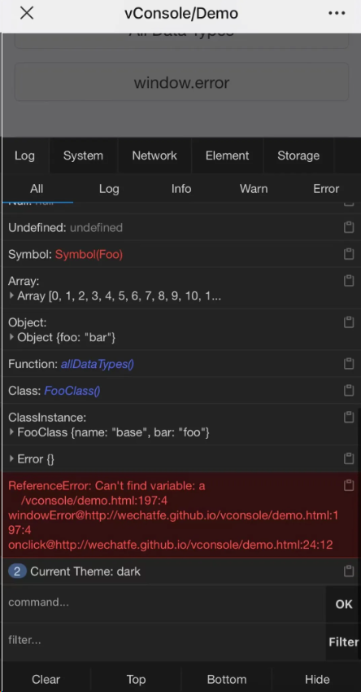

# 移动端开发调试

[远程调试 Android 设备网页 - 阮一峰的网络日志 (ruanyifeng.com)](https://www.ruanyifeng.com/blog/2019/06/android-remote-debugging.html)

Termux 入门教程：架设手机 Server 下载文件：<https://www.ruanyifeng.com/blog/2019/07/termux-tutorial.html>

---

## 插件工具

### 腾讯移动端 vConsole 调试库

#### 介绍

- 一个轻量、可拓展、针对手机网页的前端开发者调试面板。

- vConsole 是框架无关的，可以在 Vue、React 或其他任何框架中使用

- 现在 vConsole 是微信小程序的官方调试工具。

vConsole 是腾讯开源的一款专为手机网页设计的轻量级、可扩展的前端开发者调试面板。这款工具与框架无关，无论是Vue、React还是其他任何前端框架，开发者都可以轻松集成vConsole来辅助开发。更值得一提的是，vConsole 现已成为微信小程序的官方调试工具。

#### 网址

- 官方开源库：https://github.com/Tencent
  
- github：https://github.com/Tencent/vConsole

### 远程调试 H5 、或者远程 Web 项目的工具——PageSpy

- 官网：[PageSpy](https://www.pagespy.org/)
- GitHub：[page-spy-web/README_ZH.md at main · HuolalaTech/page-spy-web (github.com)](https://github.com/HuolalaTech/page-spy-web/blob/main/README_ZH.md)
- [相见恨晚的前端开发利器-PageSpy - 掘金 (juejin.cn)](https://juejin.cn/post/7327691403844665380)

PageSpy 是货拉拉大前端开源的一款用来调试远程 Web 项目的工具。基于对原生 API 的封装，它将调用原生方法时的参数进行过滤、转化，整理成格式规范的消息供调试端消费；调试端收到消息数据，提供类控制台可交互式的功能界面将数据呈现出来。

### web 调试神器 Eruda

GitHub开源地址：<https://github.com/liriliri/eruda>

eruda 使用教程：<https://juejin.cn/post/7147533241983959071>

Eruda是一个专为手机网页设计的调试面板，功能齐全。

- **Console面板**：捕捉各种日志类型，支持自定义样式输出和正则表达式过滤，还能执行JavaScript脚本。
- **Elements面板**：查看和编辑页面元素及样式，支持高亮和点击选取，还能查看事件绑定。
- **Network面板**：捕获和分析网络请求，查看详细信息。
- **Resources面板**：查看和清除存储数据，包括localStorage、sessionStorage和cookies，还能查看页面加载的脚本、样式和图片。
- **Sources面板**：查看和格式化页面源码，包括html、css、js和json。
- **Info面板**：显示URL和User Agent，支持自定义输出。
- **Snippets面板**：为页面元素添加边框、刷新时间戳，还支持自定义代码片段。

### Weinre

- [nupthale/weinre: weinre 入门手册 (github.com)](https://github.com/nupthale/weinre)
- [weinre - Home (apache.org)](http://people.apache.org/~pmuellr/weinre/docs/latest/)
- 官网：[weinre - 首页 (apache.org)](https://people.apache.org/~pmuellr/weinre/docs/latest/Home.html)

### Chii

Chii是一款与weinre类似的远程调试工具，它主要将web inspector替换为最新的chrome devtools frontend。这款工具可以帮助开发者在移动设备上进行网页调试，无需在移动设备上安装任何特殊的应用或浏览器插件。

**GitHub：**https://github.com/liriliri/chii

官网：https://chii.liriliri.io/

教程：[使用 Chii 调试移动端页面 - 知乎 (zhihu.com)](https://zhuanlan.zhihu.com/p/144169144)

### Spy-Debugger

GitHub开源地址：https://www.npmjs.com/package/spy-debugger

---

移动端没有控制台该如何调试：<https://juejin.cn/post/7147583032130535455>

---

电脑端通用的抓包工具抓移动端的包

#### responsively-app：多个移动设备同时调试软件

- 介绍：面向所有前端开发人员的必备 DevTool，可使您的工作更轻松

- 网址

  - github：https://github.com/responsively-org/responsively-app

  - 官网：https://responsively.app/
