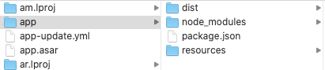
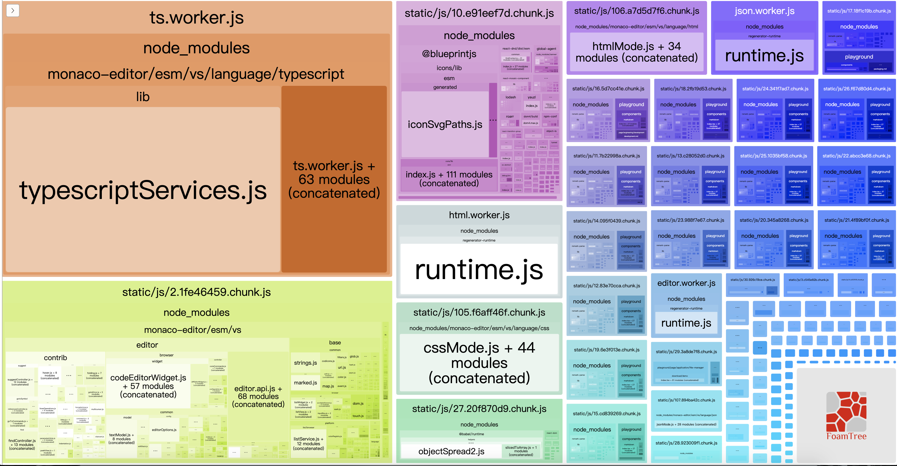
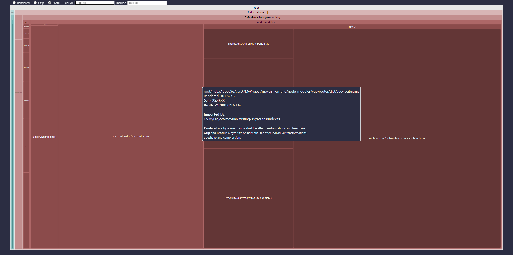
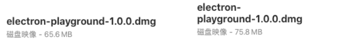

# Electron项目打包优化配置

## node_modules优化：

分析一下打包后的文件包，在release -> 【版本号命名的文件夹】 -> win-ia32-unpacked -> resources 下有个app.asar文件，这其实是个压缩包，目的是保护代码隐私，在build中可配置是否需要压缩为asar包。  
在electron-builder.yml中加入：

```shell
asar: true, // asar打包
```

用asar工具包解压。

```shell
# 安装
npm install asar -g

# 解压
asar extract app.asar <解压后的目录>
```

解压然后看下包中有哪些内容：  
  
dist和resources是配置项中指定的需要复制打包的内容，这没有问题，可是node_modules中的依赖项已经在webpack打包构建时一同打包进了dist下，它不应该在这里，而且electron-builder配置项files中也没有指定复制此文件夹。带着这个疑问，查看一下[文档](https://www.electron.build/configuration/contents)，找到了原因，原来files有默认值：

```json
[
  "**/*",
  "!**/node_modules/*/{CHANGELOG.md,README.md,README,readme.md,readme}",
  "!**/node_modules/*/{test,__tests__,tests,powered-test,example,examples}",
  "!**/node_modules/*.d.ts",
  "!**/node_modules/.bin",
  "!**/*.{iml,o,hprof,orig,pyc,pyo,rbc,swp,csproj,sln,xproj}",
  "!.editorconfig",
  "!**/._*",
  "!**/{.DS_Store,.git,.hg,.svn,CVS,RCS,SCCS,.gitignore,.gitattributes}",
  "!**/{__pycache__,thumbs.db,.flowconfig,.idea,.vs,.nyc_output}",
  "!**/{appveyor.yml,.travis.yml,circle.yml}",
  "!**/{npm-debug.log,yarn.lock,.yarn-integrity,.yarn-metadata.json}"
]
```

```vhdl
package.json and **/node_modules/**/* (only production dependencies will be copied) is added to your custom in any case. 

意思是：package.json和node_modules（仅仅生产依赖项会被复制）在任何情况下都会被添加至自定义（应该是files配置项下吧）中。
```

那这就很清楚了，我只需要在files中添加"!node_modules"即可，打包后体积是128M，足足小了37M，安装执行，没有问题。

---

##### 图片优化

图片优化在整个项目的优化中是优先级较高的，所谓的图片优化，其实是体积与质量之间的博弈，因此要想减小包中图片的体积，是要牺牲一部分图片质量的，也就是清晰度。做出如下优化：

- 首先对gif图在不影响用户观看的前提下做了一定压缩；
- 将一些png（流程图，logo，线条简单的）转为svg；
- 将一些截图png转为jpg；

最终将整体包体积dmg减小至102M，ia32exe为80M左右

---

### 依赖项，按需加载:

检查一下依赖项的位置和引用，首先对于package.json中依赖项进行排查，查看dependencies和devDependencies中的依赖项有没有错位的（开发依赖项写在了生产依赖项中），由于打包时只打包dependencies中的依赖项，所以在生产环境中用不到的依赖项一律塞至devDependencies。  
然后再检查引用库的按需加载：

如果是webpack：可以使用[webpack-bundle-analyzer](https://www.npmjs.com/package/webpack-bundle-analyzer)可视化插件看一下依赖体积图示



如果是vite：就使用[rollup-plugin-visualizer](https://www.npmjs.com/package/rollup-plugin-visualizer)



---

### vite打包优化配置：

### webpack打包优化配置：

### vue项目优化配置：

### react项目优化配置：

#### electron-builder打包配置优化：

##### 双package.json

官方重构了生产依赖项，提出双package.json结构（[two package.json](https://www.electron.build/tutorials/two-package-structure.html)）。顾名思义，通过两个package.json管理依赖项。一个用来管理开发依赖项，一个管理应用程序依赖项，最终打包时只打包应用程序依赖项。

- 开发依赖
  
  此package.json在项目根目录下，文件中声明开发依赖和打包脚本；

- 应用程序依赖；
  
  在app文件夹下，声明应用程序依赖，打包时仅打包此文件中声明的依赖。所有的元字段应当在此文件声明（version，name等）。

##### 版本

electron版本也会对打包体积有影响，这里用electron^8和10.1.5小试一下，下图左为8版本，右为10版本。或许系统版本对打包体积也有影响，这里不做尝试了，有条件同学的可以试一下。


