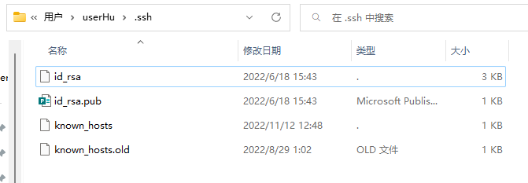
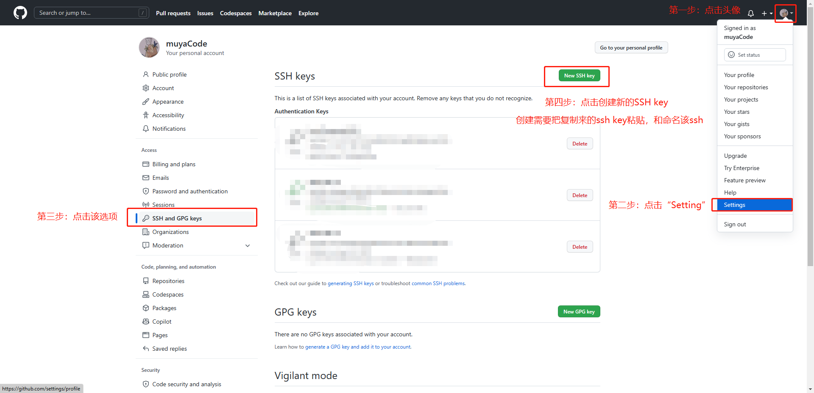

# Git软件安装和配置

**Git软件下载**：[Git - Downloads (git-scm.com)](https://git-scm.com/downloads)

## 一、安装Git软件


## 二、下载安装完Git软件后

是否安装成功，可以使用查看git版本命令

```bash
git --version
```

## 三、桌面右键菜单Git功能

**Git GUI**：图形界面的Git，不建议初学者使用，尽量先熟悉常用命令

**Git Bash**：Unix与Linux风格的命令行，使用最多，推荐最多

### Git Bash命令(基本和shell命令一样)

#### 基本文件操作命令

```bash
# 改变目录
cd 
# 回退到上一个目录，直接cd进入默认目录
cd ..
# 回到默认路径下
cd ~
# tab键：补全文件夹名称
cd Deskt + tab键

# 显示当前所在的目录路径
pwd 

# 都是列出当前目录中的所有文件，只不过ll(两个ll)列出的内容更为详细
ls(ll)
# 显示隐藏文件
ls -la 

# 删除一个文件, rm index.js 就会把index.js文件删除
rm

# 新建一个文件 如 touch index.js 就会在当前目录下新建一个index.js文件
touch

# 新建一个目录，就是新建一个文件夹
mkdir

# 删除一个文件夹, rm -r src 删除src目录， 好像不能用通配符
rm -r

# 移动文件, mv index.html src index.html 是我们要移动的文件, src 是目标文件夹,当然, 这样写,必须保证文件和目标文件夹在同一目录下
mv 

# 重新初始化终端/清屏
reset 

# 清屏
clear

# 查看命令历史
history 

# 帮助
help 

# 退出
exit
```

## 四、初始化Git

### 1、配置用户

安装号Git后，若没有配置git的账户/邮箱和密码，项目代码提交时，会提示配置用户：初始化用户名和邮箱命令

```bash
git config --global user.name "用户名" # user.name是你的git账号用户名
git config --global user.email "邮箱地址" # user.email是你的git邮箱


# 显示所有配置列表
git config -list
#查看全部config
git config -l
#查看系统config
git config --system --list
#查看当前用户全局config
git config --global --list

# 获取配置的用户名
git config user.name
# 显示命令帮助
git help
```

### 2、添加SSH密钥

#### 2.1、git bash 下 输入 ssh-keygen

首先 ssh-keygen 会确认   密钥的存储位置（默认是 .ssh/id_rsa），然后它会要求你输入两次密钥口令。 如果你不想在使用密钥时输入口令，将其留空即可。

然而，如果你使用了密码，那么请确保添加了 -o 选项，它会以比默认格式更能抗暴力破解的格式保存私钥。 你也可以用 ssh-agent 工具来避免每次都要输入密码。

```bash
ssh-keygen -t rsa -C "邮箱名称"
```

生成后的文件，保存在 C:/Users/电脑当前用户名/.ssh文件夹下；



#### 2.2、查看密钥

```bash
cd  ~/.ssh
```

#### 2.3、输出密钥

```bash
cat id_rsa.pub
```

#### 2.4、复制密钥

打开给gitlab，点击自己头像`Settings`选项 =>左边选项：`SSH and GPG keys` => 在SSH key创建中添加密钥

用文本工具打开之前生成的id_rsa.pub文件，把内容拷贝到key下面的输入框，并为这个key定义一个名称（通常用来区分不同主机），然后保存；



## 五、初始化项目

1、选择一个合适的地方，创建一个项目目录：

2、当前项目目录下，使用命令窗口，输入 `git init` 命令，对项目初始化一个Git仓库。

远程创建仓库，把本地项目添加到远程Git仓库，分两步：

- 使用命令 `git add [file文件]`，注意，可反复多次使用，添加多个文件；添加所有文件暂存：`git add .`
- 提交并输入描述：使用命令 `git commit -m ‘message’`，完成。

3、或者 `git clone` 命令克隆项目看看是否成功配置和 ssh key