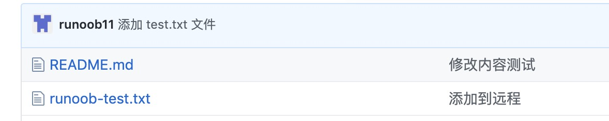

# 02_Git 命令详解

## Git 代码提交管理

git bisect 命令教程：https://www.ruanyifeng.com/blog/2018/12/git-bisect.html

### branch——分支管理

#### 命令

```bash
# 查看本地分支，或者创建新的分支
git branch [分支名]
# 切换到指定的分支，或者创建并切换到新的分支
git checkout [分支名]
# 将指定分支合并到当前分支
git merge [分支名]
# 删除指定本地分支
git branch -d [分支名]
# 删除远端分支
git push <远端仓库的名称> --delete <删除的远端分支的名称>
# 删除远端分支：简写
git push <远端仓库的名称> :<删除的远端分支的名称>
# 重命名指定分支
git branch -m [分支名]
# 查看分支合并图
git log --graph [分支名]


# 查看每个分支的最后一次提交
git branch -v
# 查看已经合并到当前分支的分支
git branch --merged [分支名]
# 查看尚未合并到当前分支的分支
git branch --no-merged [分支名]
# 查看远程分支
git branch -r [分支名]
# 查看本地和远程分支
git branch -a [分支名]
# 重命名指定分支
git branch -m <old_branch_name> <new_branch_name>
# 强制移动指定分支到某个提交
git branch -f <branch_name> <commit>
# 设置本地分支与远程分支的跟踪关系
git branch --set-upstream-to=<remote_branch_name>
# 取消本地分支与远程分支的跟踪关系
git branch --unset-upstream
```

#### 流程

```bash
# 克隆远端分支feat/sass-v1到本地
git checkout -b feat/sass-v1 origin/feat/sass-v1
# 从当前分支新建一个分支feat/saas-0817
git checkout -b feat/saas-0817
# 将branchName合并到当前分支
git merge [branchName]
# 将branchName合并到当前分支，并将branchName上的所有提交合并成一次提交
git merge [branchName] --squash
# 修改上次的提交信息，push后不会增加新的commit记录，但是会修改本次的commithash(也可以理解为删掉了最新的一次commit，重新又提交了一次)
git commit --amend
```

#### git commit --amend

修改 commit msg

```bash
# 删除本地分支
git branch -D [branchName]
# 删除远端分支
git push origin -D [branchName]
# 删除远端分支
rebase branch

# 远端分支提交
git pull --rebase origin [branchName] = git fetch + git rebase


# 假设当前分支dev, commit 为 a b c d e
# 假设main分支, commit 为 a b f g h
git pull --rebase origin main
# 当前分支dev commit 变为 a b c d e f g h
```

#### git rebase main

```bash
# 假设当前分支dev, commit 为 a b c d e
# 假设main分支, commit 为 a b f g h
git rebase origin/main
# 当前分支dev commit 变为 a b f g h c d e
```

#### git remote 远端分支

git remote 是一个用于管理 Git 仓库中的远程仓库的命令。远程仓库是指托管在网络上的你的项目的版本库，你可以与其他人协作或备份你的代码。git remote 命令可以让你查看、添加、重命名和删除远程仓库，以及设置它们的 URL 和跟踪分支。

以下是 git remote 命令的一些常见用法：

```bash
# 列出当前仓库中已配置的远程仓库的简写
git remote
# 列出当前仓库中已配置的远程仓库的简写和 URL
git remote -v
# 添加一个新的远程仓库，指定一个简写和一个 URL
git remote add <remote_name> <remote_url>
# 重命名一个已配置的远程仓库
git remote rename <old_name> <new_name>
# 删除一个已配置的远程仓库
git remote remove <remote_name>
# 修改一个已配置的远程仓库的 URL
git remote set-url <remote_name> <new_url>
# 显示一个已配置的远程仓库的详细信息，包括 URL 和跟踪分支
git remote show <remote_name>
```

### stash——贮藏代码

场景：当你的功能还没开发完不能 commit 但是现在需要 rebase 下 main,缓存区的代码该咋办？当你写了几行代码，但是现在需要切到其他分支去改 bug，缓存区的代码该咋办？

用 git stash 就好啦

```bash
# 贮藏代码
git stash
# 取消贮藏：恢复到工作区和缓存区，会移除stashid
git stash pop
# 查看当前贮藏区
git stash list
```

注意：stash@{0} stash@{1} stash@{2} 是 stashname

```bash
# 恢复指定贮藏代码到工作区和缓存区，会保留stashid
git stash apply stashname
# 带描述备注贮藏
git stash save 'msg'
# 显示最新的贮藏文件具体改动
git stash show -p
# stashname 显示指定的贮藏文件具体改动
git stash show -p
```

### add——暂存

```bash
# 添加一个或多个文件到暂存区。
git add [file1] [file2] ...
# 添加指定目录到暂存区，包括子目录。
git add [dir]
# 添加当前目录下的所有文件到暂存区。
git add .
# 添加已跟踪文件的修改到暂存区，不包括新文件。
git add -u
# 添加所有文件的修改到暂存区，包括新文件和删除的文件。
git add -A
# 交互式地选择文件的部分修改添加到暂存区。
git add -p

# 从暂存区中移除 index.html 文件，但是保留工作目录中的文件。这样，您可以取消对 index.html 文件的跟踪，而不影响您的本地修改。
git rm --cached index.html
```

### commit——提交

```bash
# 强制提交不检查
git commit -m "msg" --no-verify
# 强制提交代码并以本地版本代码为主覆盖远程
git push -f

# git push -f 是不安全的，git push --force-with-lease更安全，注意--force-with-lease 失败后再执行一次也会强制提交覆盖
```

### push——推送到远程

**git push** 命令用于从将本地的分支版本上传到远程并合并。

命令格式如下：

```
git push <远程主机名> <本地分支名>:<远程分支名>
```

如果本地分支名与远程分支名相同，则可以省略冒号：

```
git push <远程主机名> <本地分支名>
```

#### 实例

以下命令将本地的 main 分支推送到 origin 主机的 main 分支。

```bash
git push origin main
```

相等于：

```bash
git push origin main:main
```

如果本地版本与远程版本有差异，但又要强制推送可以使用 --force 参数：

```bash
git push --force origin main
```

删除主机的分支可以使用 --delete 参数，以下命令表示删除 origin 主机的 main 分支：

```bash
git push origin --delete main
```

以我的 https://github.com/tianqixin/runoob-git-test 为例，本地添加文件：

```bash
touch runoob-test.txt      # 添加文件
git add runoob-test.txt
git commit -m "添加到远程"
main 69e702d] 添加到远程
 1 file changed, 0 insertions(+), 0 deletions(-)
 create mode 100644 runoob-test.txt

git push origin main    # 推送到 Github
```

将本地的 main 分支推送到 origin 主机的 main 分支。

重新回到我们的 Github 仓库，可以看到文件已经提交上来了：



### pull——远程拉取到本地

git pull：将远程仓库的修改拉取到本地仓库，更新本地分支的内容。命令格式如下：

```bash
git pull <远程主机名> <远程分支名>:<本地分支名>
```

如果远程分支是与当前分支合并，则冒号后面的部分可以省略。例如，`git pull origin main` 表示将 origin 主机的 main 分支拉取并合并到当前分支。

```bash

```

### reset——回退

#### 1.暂存区回退到工作区

```bash
# 查看提交日志
git log

# 将所有暂存区回退到工作区
git reset
# 丢弃工作区所有的更改
git checkout .

# 取消暂存：如果您想要取消已经暂存的文件的修改，可以使用 git reset 命令，它会将暂存区的内容恢复到上一次提交的状态。例如，如果您想要取消暂存 index.html 文件，可以运行
git reset index.html
```

#### 2.版本回退

```bash
# 将从commithash(不包括此hash)之后的丢弃
git reset --hard [commit hash]
# 将暂存区、工作区所有内容丢弃
git reset --hard

# 将从commithash(不包括此hash)之后的提交回退到暂存区
git reset --soft [commit hash]
# 回退最近4次提交到暂存区
git reset --soft HEAD~4
```

#### 3.git reset 和 git rm --cached

git reset 和 git rm --cached 都是用于修改暂存区的命令，但是有以下几点相同和不同：

- 相同点：都可以从暂存区中移除文件的修改，使暂存区恢复到上一次提交的状态。
- 不同点：
  - git reset 可以同时修改工作目录和暂存区，根据不同的选项，可以保留或丢弃工作目录中的修改。例如，`git reset --hard` 会丢弃工作目录中的所有修改，而 `git reset --soft` 会保留工作目录中的所有修改。
  - git rm --cached 只能修改暂存区，不会影响工作目录中的文件。它可以用于取消对文件的跟踪，或者从版本控制中删除文件，而不删除本地文件。

### cherry-pick——复制提交

场景：当你在 merge 或者 rebase 的时候发现冲突太多了，想哭的时候，可以用原分支 check 目标分支处理，然后再 cherry-pick 当前分支的每个提交，这样冲突就会少很多。或者另一分支上有些代码还没有 merge 到 main，但是你当前分支又非要用的时候，就可以 cherry-pick 过来一份。

```bash
# 将其他分支上已提交的commit在当前分支再提交一次，产生新的commithash
git cherry-pick [commit hash]
```

### revert

```bash
# 非merge的commit
git revert [commit hash]
# merge类型的commit
git revert -m [1|2] [commit hash]

# 查看
git show [commit hash]
```

- 第三行第一个 hash 为编号 1，第二个 hash 为编号 2，以哪个父 hash 为主线则保留哪个，删除另一个

- git revert -m 1 bd86846 则回滚 bd86846 的提交，且以 ba25a9d main 分支为主线保留，回滚掉 1c7036f 所在分支提交
  rebase -i

场景：使用 merge 导致 git 提交线乱七八糟，提交日志过多非常难看。自从使用了 rebase 提交线变得无比丝滑，使用 rebase -i 合并每个需求的所有提交成 1 个，使日志变得清晰

git rebase -i HEAD~10 调整最近 10 次提交的日志、或合并多次提交为 1 次，让 log 更好看更清晰

p 使用，pick = use commit

s 合并掉，squash = use commit, but meld into previous commit

所有的提交按时间倒序排列

被 s 的会合并到上一次 commit，也就是当前排列的上一个里面

## 完整流程命令

参考：[GIT 版本控制(详解)\_Ferao 的博客-CSDN 博客\_git 版本控制](https://blog.csdn.net/qq_21561501/article/details/122611578)

1. 查看本地 git 配置命令

   ```bash
   # 查看全部config
   git config -l

   # 查看系统config
   git config --system --list

   # 查看当前用户全局config
   git config --global --list

   # 设置用户名
   git config --global user.name "[名称]"

   # 设置邮箱
   git config --global user.email [邮箱]
   ```

   当你安装 Git 后首先要做的事情是设置你的用户名称和 e-mail 地址。这是非常重要的，因为每次 Git 提交都会使用该信息。它被永远的嵌入到了你的提交中

2. 远程库信息查看命令

   ```bash
   # 查看远程库信息
   git remote

   # 远程库详细信息
   git remote -v

   # 查看远程分支
   git branch -r ， git branch -a

   # 为远程仓库地址创建别名
   git  remote add origin  https://github.com/sun766/Programming-art.git（此处举例）

   # 查看当前别名所对应的远程仓库地址
   git  remote show origin

   # 从远程仓库获取代码（拉取所有版本到本地）
   git clone  origin

   # 删除当前别名所对应的远程仓库地址
   git  remote remove origin
   ```

3. 分支交互命令

   ```bash
   # 查看分支 (显示结果中 有* 代表当前所在分支)
   git branch

   # 创建分支
   git branch 分支名称

   # 建立本地分支和远程分支的关联
   git branch –set-upstream branch-name origin/branch-name

   # 切换分支（工作区文件内容会立即变化成对应分支的内容 ）
   git checkout 分支名称

   # 创建+切换分支，git checkout -b dev，即origin/dev
   git checkout -b 分支名称

   # 更新
   git pull

   # 将远程主机 origin 的 main 分支拉取过来，与本地的 brantest 分支合并
   git pull origin main:brantest

   # 远程分支是与当前分支合并，冒号后面的部分可以省略
   git pull origin main

   # 将当前分支推送到远程对应的分支（若远程无对应分支，则推送无效）
   git push

   # 将分支dev提交到远程origin/dev（远程没有则创建, 远程没有dev则创建）
   git push origin dev

   # 如果当前分支与多个主机存在追踪关系，则可以使用 -u 参数指定一个默认主机，这样后面就可以不加任何参数使用git push
   #，不带任何参数的git push，默认只推送当前分支，这叫做simple方式，还有一种matching方式，会推送所有有对应的远程分支的本地分支， Git 2.0之前默认使用matching，现在改为simple方式
   git push -u origin main

   # 删除分支 （如果分支没有被合并不允许删除）
   git  branch -d 分支名称

   # 删除分支（强制删除分支）
   git  branch  -D 分支名称

   # 合并某分支到当前分支（当前目录主分支，将来源分支合并到主分支上。合并后来源分支仍然存在）
   git merge 来源分支

   # 合并分支（禁用 Fast forward）
   git merge –no-ff -m “描述” dev

   # 查看分支合并情况
   git log –graph –pretty=oneline –abbrev-commit
   ```

4. 标签常用命令

   ```bash
   # 创建标签

   ## 对当前版本建立标签
   git tag tagname

   ## 对历史版本建立标签
   git tag tagname commit_id

   ## commit_id 添加说明
   git tag -a tagname -m “描述…”

   ## 查看所有标签
   git tag

   ## 查看某个标签具体信息
   git show tagname

   # 删除标签

   ## 删除本地标签
   git tag -d tagname

   # 推送标签

   ## 推送本地的某个标签到远程
   git push origin tagname

   ## 一次性推送所有分支
   git push origin –tags

   # 删除远程标签

   ## 先删除本地
   git tag -d tagname

   ## 从远程删除
   git push origin :refs/tags/tagname
   ```

5. 暂存区命令

   ```bash
   # 添加指定文件到暂存区
   git add [file1] [file2] ...

   # 添加指定目录到暂存区，包括子目录
   git add [dir]

   # 添加当前目录的所有文件到暂存区
   git add .

   # 用暂存区中的文件覆盖工作目录中的文件
   git  checkout -- 文件名

   # 将暂存区中文件删除
   git  rm  --cached 文件名

   # 查看当前的状态
   git status

   # 提交文件(将暂存区的文件提交到本地git仓库)
   git commit -m '添加内容'
   ```

> Git Bash 命令图示

```bash
# 创建一个名称为FH_0222的分支
git branch FH_0222
# 查看下本地和远程分别有哪些分支
git branch -a
```


```bash
# 切换到本地的dev分支
git checkout FH_0222
```


```bash
# 将代码暂存到暂存区(点前面有空格)
git add .
# 提交代码到本地分支
git commit -m "代码提交"
```


> Git Bash 常用命令流

```bash
# 检查全局配置
git config -l

# 检查当前用户全局config
git config --global --list

# 设置用户名与邮箱
git config --global user.name "user"
git config --global user.email 123456@qq.com


# 指定存放的目录
cd d:/test

# 获取项目
git clone https地址orgit clone ssh地址

# 添加、修改文件后推送到服务器
## 添加指定文件(将需要进行版本控制的文件放入暂存区)
git add 文件名

## 添加所有文件(将需要进行版本控制的文件放入暂存区)
git add .

## 查看当前的状态
git status

# 提交文件(将暂存区的文件提交到本地git仓库)
git commit -m '添加内容'

# 推送文件(将本地仓库的文件Push到远程仓库)
git push origin main

# 推送
git push

# 查看分支
git branch

# 新建分支
git branch 	分支名

# 切换分支
git checkout 分支名

# 将dev分支合并到main分支
git merge dev

# 主分支
main	默认分支

```

[注]

1.所有的配置文件，其实都保存在本地

2.Git\etc\gitconfig ：Git 安装目录下的 gitconfig --system 系统级

3.C:\Users\Administrator\ .gitconfig 只适用于当前登录用户的配置 --global 全局

直接编辑配置文件，通过命令设置后会响应到这里。

### 查看版本线图

命令

```bash
git log
git log -oneline
git log -oneline -graph
git log -oneline -graph -all
git log -oneline -graph -[number]
```

## Git 代码提交规范

vue 规范：https://github.com/vuejs/vue/blob/dev/.github/COMMIT_CONVENTION.md

Angular 规范：https://github.com/conventional-changelog/conventional-changelog/tree/main/packages/conventional-changelog-angular

规范 1：

```bash
feat：增加新功能
fix：修复问题/BUG
style：代码风格相关无影响运行结果的
perf：优化/性能提升
refactor：重构
revert：撤销修改
test：测试相关
docs：文档/注释
chore：依赖更新/脚手架配置修改等
workflow：工作流改进
ci：持续集成
types：类型定义文件更改
wip：开发中
```

规范 2：

```bash
scope
feat: 新功能、新特性
fix: 修改 bug
perf: 更改代码，以提高性能（在不影响代码内部行为的前提下，对程序性能进行优化）
refactor: 代码重构（重构，在不影响代码内部行为、功能下的代码修改）
docs: 文档修改
style: 代码格式修改, 注意不是 css 修改（例如分号修改）
test: 测试用例新增、修改
build: 影响项目构建或依赖项修改
revert: 恢复上一次提交
ci: 持续集成相关文件修改
chore: 其他修改（不在上述类型中的修改）
release: 发布新版本
workflow: 工作流相关文件修改
```
