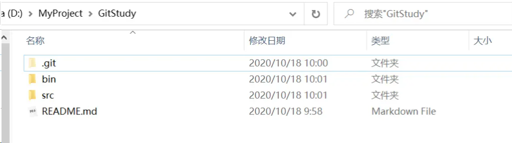
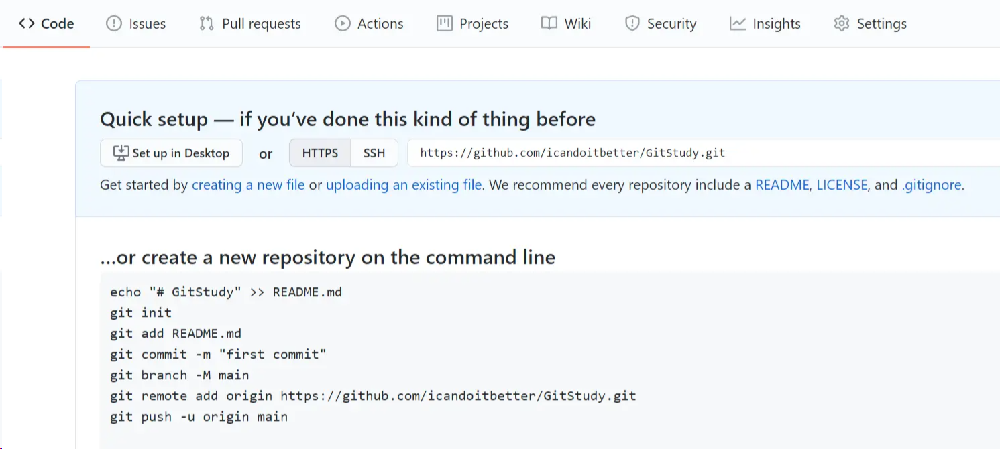
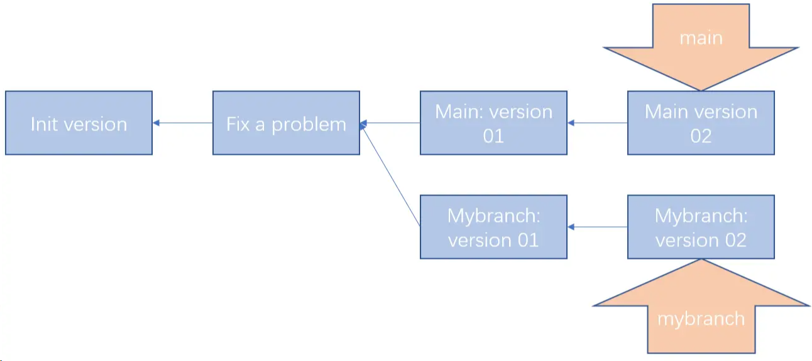
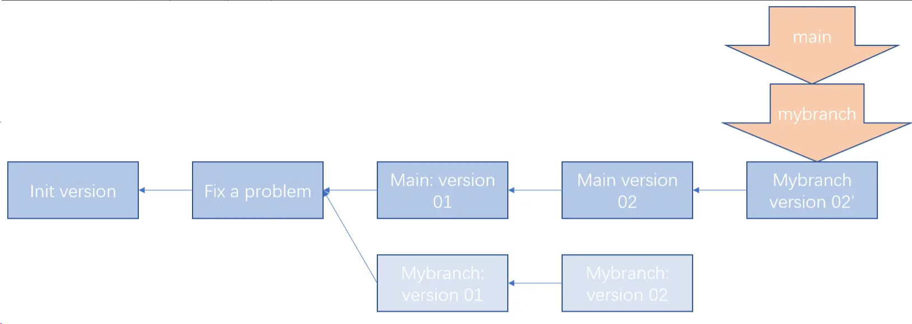
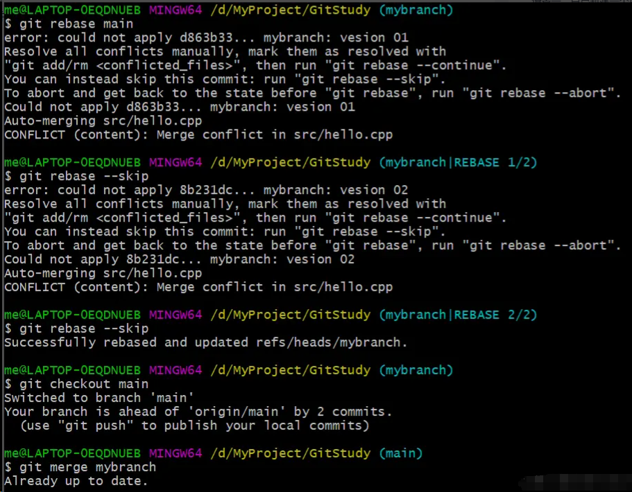
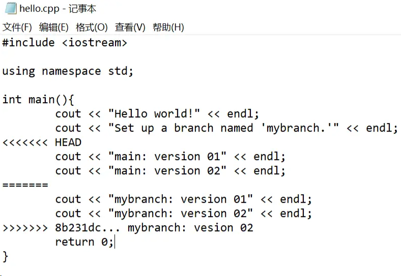

# Git 使用简要备忘录

## 1. 初次运行 Git 前的配置

Step1：配置用户信息。鼠标右键单击打开`Git Bash`，初次使用 Git 首先须设置你的用户名（例如：me）和邮件地址（例如：muyaCode@163.com）。（`--global`意味着你的用户名和邮件地址信息为全局信息，之后无论你在该系统上做任何事情， Git 都会使用那些信息。）

```bash
git config --global user.name "me"

git config --global user.email muyaCode@163.com
```

Step2：检查配置信息。设置好用户名和邮件地址后，可以用下列命令查看配置的信息。

```bash
git config --list
```

## 2. 获取 Git 本地仓库

### 情景一：自己新建一个项目（以 Win10 系统为例）

Step1：初始化本地仓库。初始化仓库后，当前工作目录下会有一个 .git 文件。

```bash
cd D:\MyProject\GitStudy  #选择工作目录；

git init                  #初始化仓库；
```

Step2：添加项目文件。例如，可以在初始化好的空的本地仓库创建一个`README.md`文件，再加入一个 bin 目录和一个 src 目录。

```bash
echo "# GitStudy" >> README.md        #创建一个`README.md`文件

git add --all                         #将创建好的文件添加到暂存区，并跟踪(track)这些文件；

git commit -m 'initial version'       #将暂存区的文件提交到本地仓库，并备注：'initial version'
```



### 情景二：为某个项目贡献自己的一份力（以 Win10 系统为例）

```bash
#将用户'TheAlgorithms'的'Python'远程库的项目克隆到本地仓库，并将该项目自定义为'myPython'；
git clone https://github.com/muyaCode/Python.git myPython
```

Git 支持多种数据传输协议。 上面的例子使用的是 `https`协议，不过你也可以使用 SSH 传输协议，SSH 协议的格式为： user@server:path/to/repo.git 。

## 3. 记录每次更新到仓库

添加文件。假设添加了一个名为`hello.cpp`的文件到项目中的`src`分目录下，则通过以下操作将新增内容更新到仓库。

```bash
git add src/hello.cpp #将该`hello.cpp`文件添加到暂存区，并跟踪(track)该文件；

git status            #查看当前已暂存且待提交的文件和还未暂存(untracked)的文件;

git commit -m 'version 1.0.0: Add hello.cpp'  #提交至本地库，并加备注；
```

移除文件。如果想移除上述添加的`hello.cpp`文件，则通过以下操作将新增内容更新到仓库。

```bash
rm src/hello.cpp        #先删除该文件；

git rm src/hello.cpp    #再删除该文件在本地库的记录，不让Git继续对其跟踪；
```

## 4. 查看提交记录和撤销操作

可以使用`git log`命令和`git reflog`查看提交历史。

```bash
me@LAPTOP-0EQDNUEB MINGW64 /d/MyProject/GitStudy (main)
git log
commit d1b5ad37d697cd4906af1646fb52d4de16124c52 (HEAD -> main)　#最近一次提交的commit id；
Author: Me <1572952478@qq.com>
Date:   Sun Oct 18 10:04:59 2020 +0800
version 1.0.0: Add hello.cpp　　　　　　　　　　#最近一次提交的提交备注；
commit 63a0bb0caaf03715455f93542ef2cad6d7bd5d79　#上一次提交的commit id；

Author: Me <1572952478@qq.com>
Date:   Sun Oct 18 10:00:10 2020 +0800
initial version　　　　　　　　#上一次提交的提交备注；
me@LAPTOP-0EQDNUEB MINGW64 /d/MyProject/GitStudy (main)
git reflog
d1b5ad3 (HEAD -> main) HEAD@{0}: commit: version 1.0.0: Add hello.cpp
63a0bb0 HEAD@{1}: commit (initial): initial version
```

可以通过`git reset`命令撤销对文件的修改。

```bash
git reset HEAD^       #回退到上一个版本；
git reset 63a0bb0     #也可以回退到指定版本，例如：回退到commit ID为63a0bb0开头的这个版本；
```

## 5.使用远程仓库（以 GitHub 为例）

远程仓库可以是自己搭建的服务器，也可以是`GitHub`或`Gitee`等远程库，这里以`GitHub`为例。

首先在 GitHub 上注册并登录自己的账户，新建一个 Repository。



添加远程仓库（以 https://github.com/muyaCode/GitStudy.git 为例）并命名为 origin 。

```bash
git remote add origin https://github.com/muyaCode/GitStudy.git
```

重命名当前分支为`main`。

```bash
git branch -M main
```

将当前(`main`)分支上的内容上传到刚刚添加的`origin`远程库。

```bash
git push -u origin main
```

或者也可以这样，上传到远程库的指定分支：

```bash
git push origin main:mybranch　　#将本地main分支的内容上传到origin远程库的mybranch分支；
```

查看当前已添加的远程库（库名称和对应的 URL）。

```bash
git remote -v
origin  https://github.com/muyaCode/GitStudy.git (fetch)
origin  https://github.com/muyaCode/GitStudy.git (push)
```

从`origin`远程库拉取该远程库有但你的本地库没有的内容。

```bash
git fetch origin
```

也可以这样，从远程库 origin 拉取并合并你的本地库没有的内容：

```bash
git pull origin
```

移除`origin`远程库。

```bash
git remote remove origin
```

## 6.Git 分支

在开发一个项目时，开发人员可通过创建分支的方式在该分支上**实现某个新功能**或**修复某个问题**，在该分支上完成任务后再将成果合并到主分支上。

新建分支，并命名该分支为：`mybranch`。

```bash
git branch mybranch       #创建mybranch分支；
git checkout mybranch     #切换到mybranch分支；
```

也可采用下面这种形式。

```bash
git checkout -b mybranch  #创建并切换到mybranch分支；
```

在`mybranch`分支完成任务后，该分支的内容合并到主分支（即 main 分支）。

```bash
git checkout main     #切换到main分支；
git merge mybranch    #将mybranch分支的内容合并到当前分支；
```

最后可删除`mybranch`分支。

```bash
git branch -d mybranch
```

使用 rebase 命令将其他分支的内容合并到主分支上来

例如：假设当前分支结构如下（main 分支为主分支，mybranch 分支为其他分支）：



现在要将 mybranch 分支的内容合并到 main 分支上来，先使用 rebase 命令进行变基操作，再使用 merge 命令进行快速合并，可以使提交日志显得简洁清晰：

Step1：使用 rebase 命令将 mybranch 分支的当前版本的父节点变成 main 分支的头节点

```bash
git rebase main
```

Step2：使用 merge 命令将 mybranch 分支合并到 main 分支

```bash
git checkout main
git merge mybranch
```



（PS：合并时产生了冲突，由于冲突内容位于同一个文件的同一处代码，所以只能进行取舍后再合并，最后合并成功）



冲突内容如下：



## 7. 几种使用 Git 的项目开发工作流程

### 情景一：集中式工作流

多名开发者从中心仓库克隆代码下来，并同时作一些修改。工作完成后，除了第一个开发者可以顺利提交外，其他后边提交的开发者都必须将前一个提交的开发者的工作与自己的工作合并后，才能完成提交。

或者各自开发者在自己本地创建自己独立的分支，然后写完代码后，先本地 git pull 远程的代码，然后切到 main 分支，将自己的分支合并到 main，然后提交。

### 情景二：集成管理者工作流

例如，在 GitHub 上参与某个开源项目的开发，你先将该开源项目克隆到本地，你的开发工作完成后，可以申请该项目维护者将你的工作成果合并到其维护的开源项目中。工作流程如下：

1. 项目维护者推送到主仓库。
2. 贡献者克隆此仓库，做出修改。
3. 贡献者将数据推送到自己的公开仓库。
4. 贡献者给维护者发送邮件，请求拉取自己的更新。
5. 维护者在自己本地的仓库中，将贡献者的仓库加为远程仓库并合并修改。
6. 维护者将合并后的修改推送到主仓库。

### 情景三：主管和副主管工作流

例如，开发一个需要数百人协同参与的超大型项目时，项目设一名主管，根据项目的开发需要，每个开发模块设置一名副主管，每个副主管下属若干名开发者协同完成该模块的开发。工作流程如下：

1. 普通开发者在自己的主题分支上工作，并根据 `main` 分支进行变基。 这里是主管推送的参考仓库的 `main` 分支。
2. 副主管将普通开发者的主题分支合并到自己的 `main` 分支中。
3. 主管将所有副主管的 `main` 分支并入自己的 `main` 分支中。
4. 最后，主管将集成后的 `main` 分支推送到参考仓库中，以便所有其他开发者以此为基础进行变基。

## 总结总结一下：

1. 使用 Git 将自己的项目成果按提交版本依次保存并上传远程库的操作顺序分为：**暂存 git add** ->**提交 git commit** ->**上传 git remote** ；
2. 从远程库下载一个完整项目到本地采用：**克隆 git clone** ；
3. 将远程库上有的但你没有的内容合并到本地库采用：**拉取 git fetch** `，`**拉取并合并 git pull** 。

- 查看当前分支

```bash
$ git branch
```

- 创建分支

```bash
$ git checkout -b 分支名
```

`git checkout` 命令加上`-b`参数，表示创建分支并切换，它相当于下面的两个命令：

```bash
$ git branch dev        //创建分支
$ git checkout dev      //切换到创建的分支
```

### 提交

在上面，我们已经创建好了一个分支`myBranch`，我们一天要写两章小说，当我每写完一章以后，我要将它先存入暂存区，当一天的工作完毕以后，统一将暂存区的代码提交到本地仓库，最后再上传到远程仓库，并且合并

- 上传暂存区

```bash
$ git add .    //将修改的文件全部上传
$ git add xxx    //将xxx文件上传
```

- 提交到本地仓库

```bash
git commit -m '提交代码的描述'
```

- 提交到远程仓库的对应分支

```bash
$ git push origin xxx    //xxx是对应分支名
```

- 合并分支

```bash
$ git checkout main    //首先切换分支到main
$ git merge mybranch
```

- 删除分支

当你合并完分支以后，`mybranch`分支就可以删除了

```bash
$ git branch -d mybranch
```

### 解决冲突

Git 合并分支产生冲突的原因通常是因为两个或多个分支上的相同部分有了不同的修改。这可能是因为以下几个原因：

1. **并行开发**：团队中的不同成员在不同的分支上同时开发功能或修复 bug。如果他们修改了相同的文件或代码行，就会导致合并冲突。
2. **分支基于旧版本**：当从一个旧的提交创建分支，然后在原始分支上进行了更改时，可能会导致冲突。这是因为在创建分支后，原始分支可能已经有了新的提交。
3. **重命名或移动文件**：如果一个分支重命名或移动了一个文件，而另一个分支对同一文件进行了修改，就会导致冲突。
4. **合并冲突的解决方法不同**：在合并分支时，有时会使用不同的合并策略或解决方法，这可能会导致冲突。
5. **历史分叉**：如果两个分支的历史分叉很远，可能会存在较大的差异，从而导致合并时出现冲突。

于是我们需要将冲突解决再重新合并分支，解决冲突也就是查看文件新增了哪些代码，你需要保留哪些代码，把不需要的删去就可以了...

我们还需养成一个好习惯，就是在开发之前先`git pull` 一下，更新一下自己本地的代码确保版本是最新的。

### 添砖加瓦

如果我已经使用`git commit -m 'xxx'`将代码提交到了本地仓库，但是我后续还想向这个提交中添加文件，那我该怎么办呢？

1. 首先将你想添加到文件使用`git add xxx`加入暂存区
2. 然后运行以下命令：

```bash
$ git commit --amend
```

这将会打开一个编辑器，让你编辑上一次提交的提交信息。如果你只是想要添加文件而不改变提交信息，你可以直接保存并关闭编辑器。

1. Git 将会创建一个新的提交，其中包含之前的提交内容以及你刚刚添加的文件。

### 您撤回了一次 push

代码推送到远程仓库的 main 上以后，我发现有 bug，挨批是不可避免了，批完还得接着解决...

1. 撤销最新的提交并保留更改

```bash
$ git reset HEAD^
```

这会将最新的提交从 main 分支中撤销，但会保留更改在工作目录中。你可以修改这些更改，然后重新提交。

1. 撤销最新的提交并丢弃更改

```bash
$ git reset --hard HEAD^
```

这会完全撤销最新的提交，并丢弃相关的更改。慎用，因为这将永久丢失你的更改

1. 创建新的修复提交

如果你不想删除最新的提交，而是创建一个新的提交来修复问题，可以进行如下操作：

- 在 main 分支上创建一个新的分支来进行修复：

```bash
$ git checkout -b fix-branch main
```

- 在新分支上进行修改，修复代码中的问题。
- 提交并推送修复：

```bash
$ git add .
$ git commit -m "Fixing the issue"
$ git push origin fix-branch
```

# 多个 Git 账户提交切换

原文：[组织多个 Git 标识 |Garrit 的笔记](https://garrit.xyz/posts/2023-10-13-organizing-multiple-git-identities)

以下是有关如何管理多个 Git 标识（例如 personal、work、client1、client2）的快速提示。

我把我的 Git 存储库分为三个级别。我的个人项目位于目录中。我所有的工作项目都住在.这是第一级。` ~/sources``~/work `

级别 2 是客户端，例如 .当然，第 3 级是项目存储库：.` ~/work/client1``~/work/client1/foo-api `

我的工作目录是这样组织的：

```
/Users/garrit/work
├── client1
│   ├── foo-api
│   ├── foo-ios
│   └── foo-android
└── client2
    ├── bar-ios
    └── bar-middleware
```

现在，假设这要求我们使用与默认工作电子邮件不同的标识进行提交。除此之外，您可能还拥有自己的项目的个人电子邮件地址。你是怎么做到的？`client2`

## .gitconfig 包括

Git 的全局配置文件是 。如果您曾经设置过这样的参数：这就是它结束的地方。` ~/.gitconfig``git config user.name "Foo Bar" `

.gitconfig 文件的一个很棒的功能是您可以**有条件地包含其他配置文件**，这就是诀窍所在。这是我的文件：`~/.gitconfig`

```ini
[user]
    name = Garrit Franke
    email = garrit@slashdev.space

[includeIf "gitdir:~/work/"]
    path = ~/.gitconfig-work

[includeIf "gitdir:~/work/client2/"]
    path = ~/.gitconfig-client2

[includeIf "gitdir:~/sources/"]
    path = ~/.gitconfig-personal

# ...
```

默认情况下，我的姓名和电子邮件始终设置为我的个人身份。我还在此处存储了一些其他全局设置，但这些与本文无关。如果存储库位于目录内，则包含一个名为这只是另一个 gitconfig 文件。在我的情况下，这是这样的：` ~/work``~/.gitconfig-work `

```ini
[user]
    name = Garrit Franke
    signingkey = 12345678
    email = garrit@work.de

[commit]
    gpgsign = true
```

我希望你能明白这是怎么回事。对于每个标识，您保留一个单独的 gitconfig 文件，并将其包含在 main .至关重要的是，这需要您按客户端分组来组织存储库。`~/.gitconfig`

这个技巧大大简化了我的项目入职。不再有来自客户的“您忘记更新您的电子邮件地址”请求！
