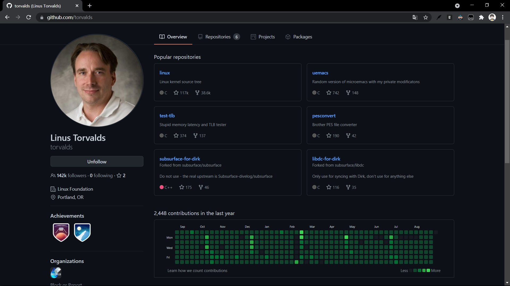
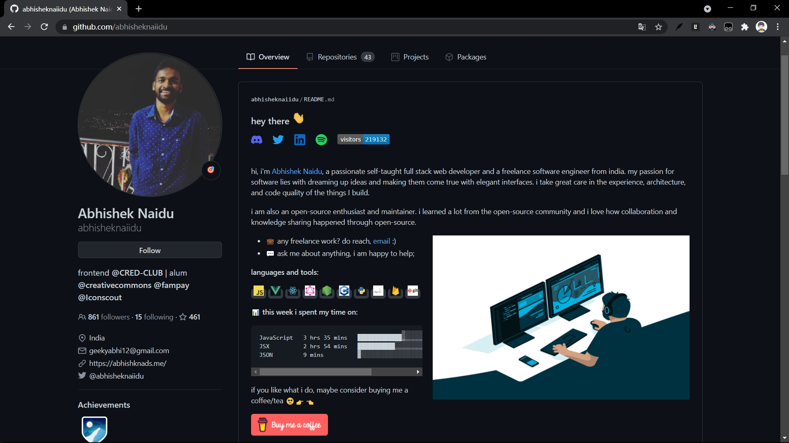
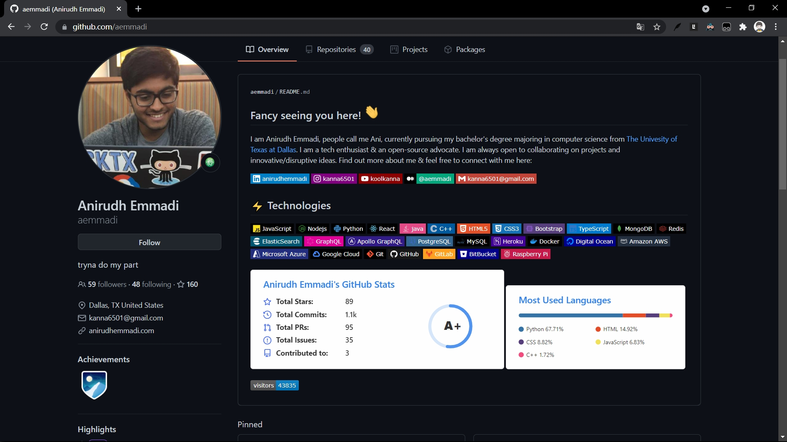
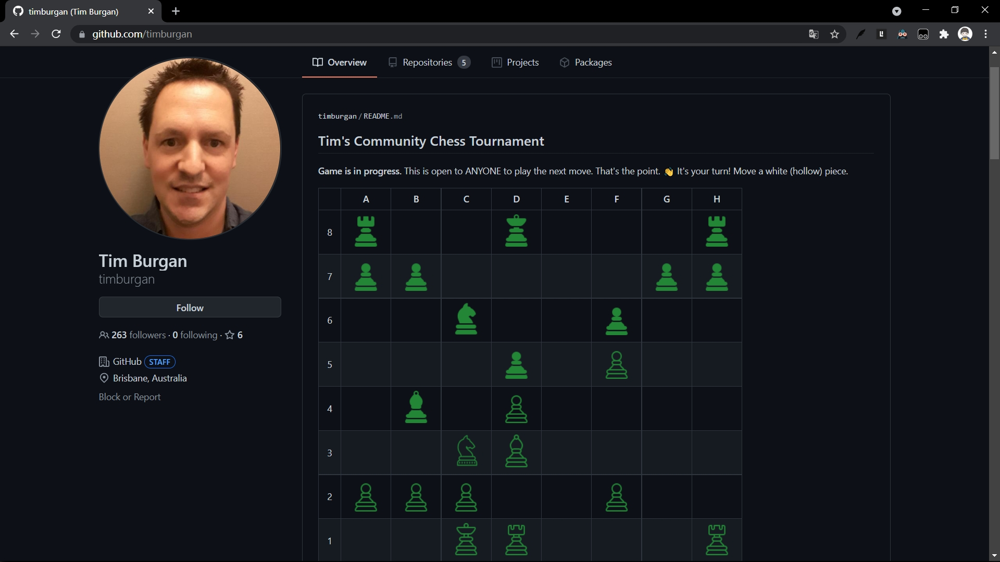
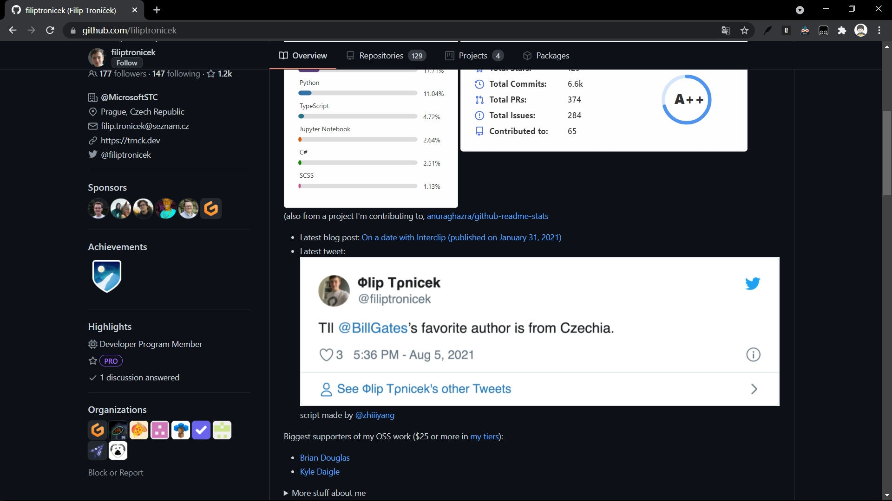
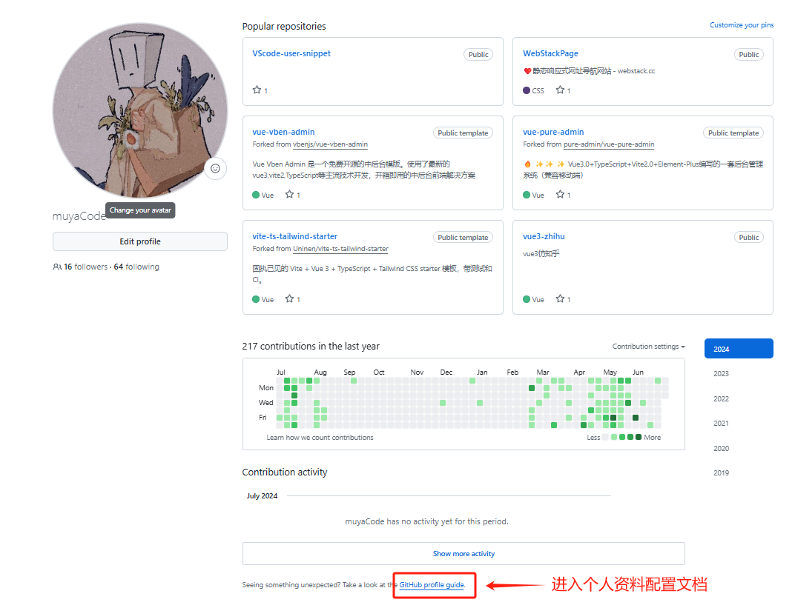
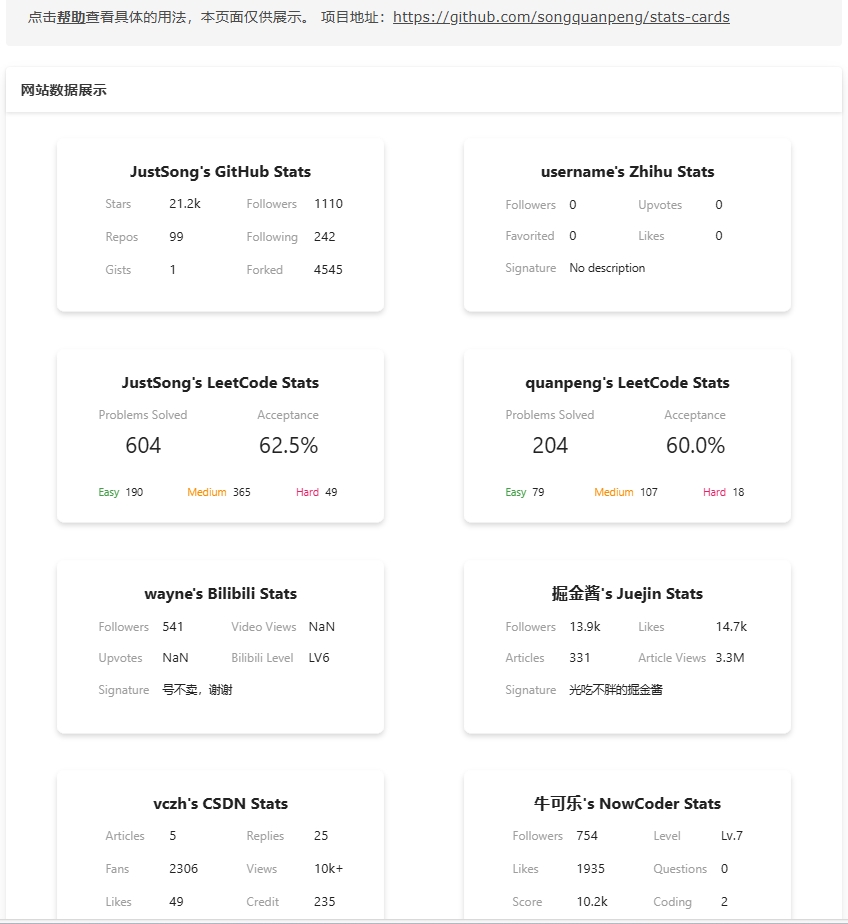
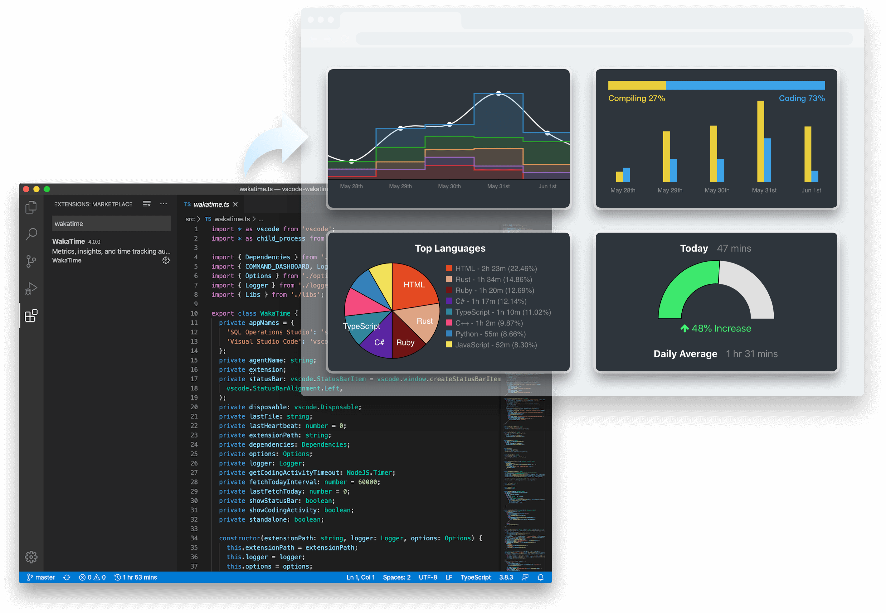
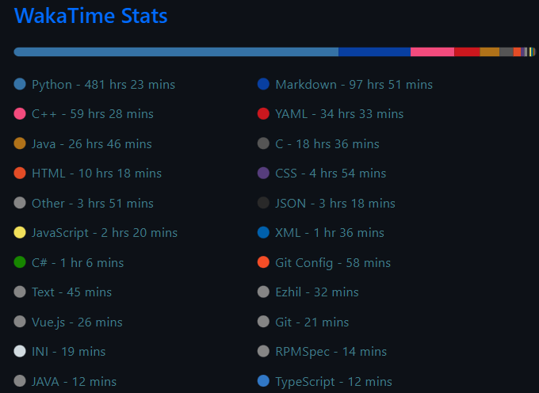

# GitHub个人主页配置

## 一、前言

相信很多同学在敲代码之余，都致力于美化自身所处的环境。比如对博客网站的魔改，对IDE的美化，对电脑壁纸的精挑细选等等。
GitHub（Gayhub）相信大多数童靴（程序基）都不陌生，GitHub用户主页默认布局是这样的。


我们在GitHub上见到过更炫酷的主页。

像这样



这样



甚至你可以在GitHub主页上下棋



显示自己的社交状态



哇哦，太酷了，那么如何拥有呢？

## 二、如何实现

### 2.1 配置和文档

设置和管理 GitHub 配置文件文档：[设置和管理 GitHub 配置文件 - GitHub 文档](https://docs.github.com/en/account-and-profile/setting-up-and-managing-your-github-profile)



### 2.2 创建public公开权限仓库，并勾选添加一个 `README.md`自述文件配置

其实DIY Github 的个人主页很简单，我们只需要新建一个仓库名和自己 Github 用户名相同的仓库，并且勾选添加一个 `README.md`自述文件即可。

**此仓库必须设置为公开状态**

具体文档：

- [关于你的个人资料- GitHub Docs](https://docs.github.com/en/account-and-profile/setting-up-and-managing-your-github-profile/customizing-your-profile/about-your-profile)
- [管理个人资料 README - GitHub Docs](https://docs.github.com/en/account-and-profile/setting-up-and-managing-your-github-profile/customizing-your-profile/managing-your-profile-readme)

新建一个同名仓库，并添加一个README自述文件后确认

创建成功，再回到个人首页，便会出现再仓库的顶部。

下一步就是编辑 Markdown 文件按照我们想要的样式进行 DIY 了。

### 2.3 个性化自定义配置（同理以下也支持仓库的`README.md`文件美化）

Github提供了这样一个特殊的`markdown`文件以供我们DIY主页，扩展性很高，如果熟悉HTML，CSS以及MarkDown 语法，可配置出自己独特个性的GitHub主页。

#### emoji 的表情符号代码

[Complete list of github markdown emoji markup](https://gist.github.com/rxaviers/7360908)

[🎁 Emoji cheat sheet for GitHub, Basecamp, Slack & more (webfx.com)](https://www.webfx.com/tools/emoji-cheat-sheet/)

[📙 Emojipedia — 😃 Home of Emoji Meanings 💁👌🎍😍](https://emojipedia.org/)

> 😀😃😄😁😆😅🤣😂🙂🙃😉😊😇🥰😍🤩😘😗☺️😚😙🥲😋😛😜🤪😝🤑🤗🤭🤫🤔🤐🤨😐😑😶😏😒🙄😬🤥😌😔😪🤤😴😷🤒🤕🤢🤮🤧🥵🥶🥴😵🤯🤠🥳🥸😎🤓🧐😕😟🙁☹️😮😯😲😳🥺😦😧😨😰😥😢😭😱😖😣😞😓😩😫🥱😤😡😠🤬

> 👶🧒👦👧🧑👱👨🧔👨‍🦰👨‍🦱👨‍🦳👨‍🦲👩👩‍🦰🧑‍🦰👩‍🦱🧑‍🦱👩‍🦳🧑‍🦳👩‍🦲🧑‍🦲👱‍♀️👱‍♂️🧓👴👵🙍🙍‍♂️🙍‍♀️🙎🙎‍♂️🙎‍♀️🙅🙅‍♂️🙅‍♀️🙆🙆‍♂️🙆‍♀️💁💁‍♂️💁‍♀️🙋🙋‍♂️🙋‍♀️🧏🧏‍♂️🧏‍♀️🙇🙇‍♂️🙇‍♀️🤦🤦‍♂️🤦‍♀️🤷🤷‍♂️🤷‍♀️🧑‍⚕️👨‍⚕️👩‍⚕️🧑‍🎓👨‍🎓👩‍🎓🧑‍🏫👨‍🏫👩‍🏫🧑‍⚖️👨‍⚖️👩‍⚖️🧑‍🌾👨‍🌾👩‍🌾🧑‍🍳👨‍🍳👩‍🍳🧑‍🔧👨‍🔧👩‍🔧🧑‍🏭👨‍🏭👩‍🏭🧑‍💼👨‍💼👩‍💼🧑‍🔬👨‍🔬👩‍🔬🧑‍💻👨‍💻👩‍💻🧑‍🎤👨‍🎤👩‍🎤🧑‍🎨👨‍🎨👩‍🎨🧑‍✈️👨‍✈️👩‍✈️🧑‍🚀👨‍🚀👩‍🚀🧑‍🚒👨‍🚒👩‍🚒👮👮‍♂️👮‍♀️🕵️🕵️‍♂️🕵️‍♀️💂💂‍♂️💂‍♀️🥷👷👷‍♂️👷‍♀️🤴👸👳👳‍♂️👳‍♀️👲🧕🤵🤵‍♂️🤵‍♀️👰👰‍♂️👰‍♀️🤰🤱👩‍🍼👨‍🍼🧑‍🍼👼🎅🤶🧑‍🎄🦸🦸‍♂️🦸‍♀️🦹🦹‍♂️🦹‍♀️🧙🧙‍♂️🧙‍♀️🧚🧚‍♂️🧚‍♀️🧛🧛‍♂️🧛‍♀️🧜🧜‍♂️🧜‍♀️🧝🧝‍♂️🧝‍♀️🧞🧞‍♂️🧞‍♀️🧟🧟‍♂️🧟‍♀️💆💆‍♂️💆‍♀️💇💇‍♂️💇‍♀️🚶🚶‍♂️🚶‍♀️🧍🧍‍♂️🧍‍♀️🧎🧎‍♂️🧎‍♀️🧑‍🦯👨‍🦯👩‍🦯🧑‍🦼👨‍🦼👩‍🦼🧑‍🦽👨‍🦽👩‍🦽🏃🏃‍♂️🏃‍♀️💃🕺🕴️👯👯‍♂️👯‍♀️🧖🧖‍♂️🧖‍♀️🧘🧑‍🤝‍🧑👭👫👬💏👩‍❤️‍💋‍👨👨‍❤️‍💋‍👨👩‍❤️‍💋‍👩💑👩‍❤️‍👨👨‍❤️‍👨👩‍❤️‍👩👪👨‍👩‍👦👨‍👩‍👧👨‍👩‍👧‍👦👨‍👩‍👦‍👦👨‍👩‍👧‍👧👨‍👨‍👦👨‍👨‍👧👨‍👨‍👧‍👦👨‍👨‍👦‍👦👨‍👨‍👧‍👧👩‍👩‍👦👩‍👩‍👧👩‍👩‍👧‍👦👩‍👩‍👦‍👦👩‍👩‍👧‍👧👨‍👦👨‍👦‍👦👨‍👧👨‍👧‍👦👨‍👧‍👧👩‍👦👩‍👦‍👦👩‍👧👩‍👧‍👦👩‍👧‍👧🗣️👤👥🫂

> 👋🤚🖐️✋🖖👌🤌🤏✌️🤞🤟🤘🤙👈👉👆🖕👇☝️👍👎✊👊🤛🤜👏🙌👐🤲🤝🙏✍️💅🤳💪

> 👣👀👁️👄💋👂🦻👃👅🧠🫀🫁🦷🦴💪🦾🦿🦵🦶👓🕶️🥽🥼🦺👔👕👖🧣🧤🧥🧦👗👘🥻🩱🩲🩳👙👚👛👜👝🎒🩴👞👟🥾🥿👠👡🩰👢👑👒🎩🎓🧢🪖⛑️💄💅💍💼🌂☂️💈🛀🛌💥💫💦💨

> 📱📲📶📳📴☎📞📟📠🤳

> ♻🏧🚮🚰♿🚹🚺🚻🚼🚾⚠🚸⛔🚫🚳🚭🚯🚱🚷🔞💈

> 🙈🙉🙊💥💫💦💨🐵🐒🦍🦧🐶🐕🦮🐕‍🦺🐩🐺🦊🦝🐱🐈🐈‍⬛🦁🐯🐅🐆🐴🐎🦄🦓🦌🦬🐮🐂🐃🐄🐷🐖🐗🐽🐏🐑🐐🐪🐫🦙🦒🐘🦏🦛🐭🐁🐀🐹🐰🐇🐿️🦫🦔🦇🐻🐻‍❄️🐨🐼🦥🦦🦨🦘🦡🐾🦃🐔🐓🐣🐤🐥🐦🐧🕊️🦅🦆🦢🦉🦩🦚🦜🐸🐊🐢🦎🐍🐲🐉🦕🦖🐳🐋🐬🦭🐟🐠🐡🦈🐙🐚🐌🦋🐛🐜🐝🪲🐞🦗🪳🕷️🕸️🦂🦟🦠🦀🦞🦐🦑

> 💐🌸💮🏵️🌹🥀🌺🌻🌼🌷🌱🌲🌳🌴🌵🌾🌿☘️🍀🍁🍂🍃

> 🌍🌎🌏🌐🪨🌑🌒🌓🌔🌕🌖🌗🌘🌙🌚🌛🌜☀️🌝🌞⭐🌟🌠☁️⛅⛈️🌤️🌥️🌦️🌧️🌨️🌩️🌪️🌫️🌬️🌈☂️☔⚡❄️☃️⛄☄️🔥💧🌊

> 🍇🍈🍉🍊🍋🍌🍍🥭🍎🍏🍐🍑🍒🍓🥝🍅🥥🥑🍆🥔🥕🌽🌶️🥒🥬🥦🧄🧅🍄🥜🌰🍞🥐🥖🫓🥨🥯🥞🧇🧀🍖🍗🥩🥓🍔🍟🍕🌭🥪🌮🌯🥙🧆🥚🍳🥘🍲🥣🥗🍿🧈🧂🥫🍱🍘🍙🍚🍛🍜🍝🍠🍢🍣🍤🍥🥮🍡🥟🥠🥡🦪🍦🍧🍨🍩🍪🎂🍰🧁🥧🍫🍬🍭🍮🍯🍼🥛☕🫖🍵🍶🍾🍷🍸🍹🍺🍻🥂🥃🥤🧋🧃🧉🧊🥢🍽️🍴🥄

> 🧗🧗‍♂️🧗‍♀️🤺🏇⛷️🏂🏌️🏌️‍♂️🏌️‍♀️🏄🏄‍♂️🏄‍♀️🚣🚣‍♂️🚣‍♀️🏊🏊‍♂️🏊‍♀️⛹️⛹️‍♂️⛹️‍♀️🏋️🏋️‍♂️🏋️‍♀️🚴🚴‍♂️🚴‍♀️🚵🚵‍♂️🚵‍♀️🤸🤸‍♂️🤸‍♀️🤼🤼‍♂️🤼‍♀️🤽🤽‍♂️🤽‍♀️🤾🤾‍♂️🤾‍♀️🤹🤹‍♂️🤹‍♀️🧘🧘‍♂️🧘‍♀️🎪🛹🛼🛶🎗️🎟️🎫🎖️🏆🏅🥇🥈🥉⚽⚾🥎🏀🏐🏈🏉🎾🥏🎳🏏🏑🏒🥍🏓🏸🥊🥋🥅⛳⛸️🎣🎽🎿🛷🥌🎯🎱🎮🎰🎲🧩♟️🎭🎨🧵🧶🎼🎤🎧🎷🪗🎸🎹🎺🎻🥁🪘🎬🏹

> 😈👿👹👺💀☠👻👽👾💣

> 👣🎠🎡🎢🚣🏔️⛰️🌋🗻🏕️🏖️🏜️🏝️🏞️🏟️🏛️🏗️🛖🏘️🏚️🏠🏡🏢🏣🏤🏥🏦🏨🏩🏪🏫🏬🏭🏯🏰💒🗼🗽⛪🕌🛕🕍⛩🕋⛲⛺🌁🌃🏙️🌄🌅🌆🌇🌉🎠🎡🎢🚂🚃🚄🚅🚆🚇🚈🚉🚊🚝🚞🚋🚌🚍🚎🚐🚑🚒🚓🚔🚕🚖🚗🚘🚙🛻🚚🚛🚜🏎️🏍️🛵🛺🚲🛴🚏🛣️🛤️⛽🚨🚥🚦🚧⚓⛵🚤🛳️⛴️🛥️🚢✈️🛩️🛫🛬🪂💺🚁🚟🚠🚡🛰️🚀🛸🪐🌠🌌⛱️🎆🎇🎑💴💵💶💷🗿🛂🛃🛄🛅🧭

> 💌💎🔪💈🚪🚽🚿🛁⌛⏳⌚⏰🎈🎉🎊🎎🎏🎐🎀🎁📯📻📱📲☎📞📟📠🔋🔌💻💽💾💿📀🎥📺📷📹📼🔍🔎🔬🔭📡💡🔦🏮📔📕📖📗📘📙📚📓📃📜📄📰📑🔖💰💴💵💶💷💸💳✉📧📨📩📤📥📦📫📪📬📭📮✏✒📝📁📂📅📆📇📈📉📊📋📌📍📎📏📐✂🔒🔓🔏🔐🔑🔨🔫🔧🔩🔗💉💊🚬🔮🚩🎌💦💨

> ♠️♥️♦️♣️🃏🀄🎴🔇🔈🔉🔊📢📣📯🔔🔕🎵🎶💹🛗🏧🚮🚰♿🚹🚺🚻🚼🚾⚠️🚸⛔🚫🚳🚭🚯🚱🚷📵🔞☢️☣️⬆️↗️➡️↘️⬇️↙️⬅️↖️↕️↔️↩️↪️⤴️⤵️🔃🔄🔙🔚🔛🔜🔝🛐⚛️🕉️✡️☸️☯️✝️☦️☪️☮️🕎🔯♈♉♊♋♌♍♎♏♐♑♒♓⛎🔀🔁🔂▶️⏩⏭️⏯️◀️⏪⏮️🔼⏫🔽⏬⏸️⏹️⏺️⏏️🎦🔅🔆📶📳📴♀️♂️✖️➕➖➗♾️‼️⁉️❓❔❕❗〰️💱💲⚕️♻️⚜️🔱📛🔰⭕✅☑️✔️❌❎➰➿ 〽️✳️✴️❇️©️®️™️#️⃣*️⃣0️⃣1️⃣2️⃣3️⃣4️⃣5️⃣6️⃣7️⃣8️⃣9️⃣🔟🔠🔡🔢🔣🔤🅰️🆎🅱️🆑🆒🆓ℹ️🆔Ⓜ️🆕🆖🅾️🆗🅿️🆘🆙🆚🈁🈂️🈷️🈶🈯🉐🈹🈚🈲🉑🈸🈴🈳㊗️㊙️🈺🈵🔴🟠🟡🟢🔵🟣🟤⚫⚪🟥🟧🟨🟩🟦🟪🟫⬛⬜◼️◻️◾◽▪️▫️🔶🔷🔸🔹🔺🔻💠🔘🔳🔲🏁🚩🎌🏴🏳️🏳️‍🌈🏳️‍⚧️🏴‍☠️

> 🐁🐂🐅🐇🐉🐍🐎🐐🐒🐓🐕🐖

> ♈♉♊♋♌♍♎♏♐♑♒♓⛎

> 🕛🕧🕐🕜🕑🕝🕒🕞🕓🕟🕔🕠🕕🕡🕖🕢🕗🕣🕘🕤🕙🕥🕚🕦⌛⏳⌚⏰⏱⏲🕰

> 💘❤💓💔💕💖💗💙💚💛💜💝💞💟❣

> 💐🌸💮🏵️🌹🥀🌺🌻🌼🌷🌱🌿☘️🍀

> 🌿☘️🍀🍁🍂🍃

> 🌑🌒🌓🌔🌕🌖🌗🌘🌙🌚🌛🌜🌝

> 🍇🍈🍉🍊🍋🍌🍍🍎🍏🍐🍑🍒🍓🥝

> 💴💵💶💷💰💸💳

> 🚂🚃🚄🚅🚆🚇🚈🚉🚊🚝🚞🚋🚌🚍🚎🚏🚐🚑🚒🚓🚔🚕🚖🚗🚘🚚🚛🚜🚲⛽🚨🚥🚦🚧⚓⛵🚣🚤🚢✈💺🚁🚟🚠🚡🚀

> 🏟️🏛️🏗️🛖🏘️🏚️🏠🏡🏢🏣🏤🏥🏦🏨🏩🏪🏫🏬🏭🏯🏰💒🗼🗽⛪🕌🛕🕍⛩️🕋⛲⛺🌁🌃🏙️🌄🌅🌆🌇🌉

> 📱📲☎️📞📟📠🔋🔌💻🖥️🖨️⌨️🖱️🖲️💽💾💿📀🧮🎥🎞️📽️📺📷📸📹📼🔍🔎🕯️💡🔦🏮🪔📔📕📖📗📘📙📚📓📒📃📜📄📰🗞️📑🔖🏷️💰🪙💴💵💶💷💸💳🧾✉️📧📨📩📤📥📦📫📪📬📭📮🗳️✏️✒️🖋️🖊️🖌️🖍️📝📁📂🗂️📅📆🗒️🗓️📇📈📉📊📋📌📍📎🖇️📏📐✂️🗃️🗄️🗑️🔒🔓🔏🔐🔑🗝️

> ⬆↗➡↘⬇↙⬅↖↕↔↩↪⤴⤵🔃🔄🔙🔚🔛🔜🔝

#### GitHub专用的emoji

```md
:bowtie:	bowtie
:neckbeard:	neckbeard
:octocat:	octocat
:shipit:	shipit
:trollface:	trollface
:suspect:	 suspect
:hurtrealbad:	hurtrealbad
:feelsgood:	feelsgood
:goberserk:	 goberserk
:finnadie:	finnadie
:rage1:	rage1
:rage2:	rage2
:rage3:	rage3
:rage4:	rage4
:godmode:	godmode
```

#### 添加浮动图像或 GIF

```html

```

#### 社交图标部分

```html
<h3 align="left">Connect with me:</h3><p align="left"><a href="your link" target="blank"></a><a href="your link" target="blank"></a><a href="your link" target="blank"></a><a href="your link" target="blank"></a></p>
```

#### 语言和工具部分

```html
<h3 align="left">Languages and Tools:</h3><p align="left"> <a href="https://www./" target="_blank">  </a> <a href="https://www./cpp/" target="_blank">  </a> <a href="https://www./css/" target="_blank">  </a> <a href="https://www./" target="_blank">  </a> <a href="https://v" target="_blank">  </a> <a href="https:///" target="_blank">  </a> <a href="https://www./html/" target="_blank">  </a> <a href="https://www./" target="_blank">  </a> <a href="https://www./en" target="_blank">  </a> <a href="https://www." target="_blank">  </a> </p>
```

#### 1.Metrics（GitHub 信息统计）

GitHub 数据统计，需要用到一个在线工具[「Metrics」](https://metrics.lecoq.io/)，打开网站之后，在左侧输入你的 GitHub ID，稍等一会，就会返回右侧所有和你相关的数据。

点击右侧的 Markdown code 选项卡，切换到统计视图对应的 Markdown 链接，复制代码添加到`README.md`文件中。

> 代码格式可以是markdown语法，也可以是HTML语法，但HTML的扩展性更强一点，建议采用HTML语法格式书写。

```html
<div align="center">
	
</div>
```


```bash

```

#### 网站数据卡片

在 README 中展示你在知乎，GitHub，B 站，LeetCode，掘金，CSDN，牛客等网站的数据，也可用于服务状态监控. Show your LeetCode & GitHub stats in GitHub Profile。

GitHub：https://github.com/songquanpeng/stats-cards

官网：[网站数据卡片 (justsong.cn)](https://stats.justsong.cn/)



#### 2、GitHub Stats Card（GitHub 统计卡片）

在你的自述文件中获取动态生成的 GitHub 统计信息：https://github.com/anuraghazra/github-readme-stats

详情可以看上面的官方文档，在README.md添加如下代码，查看展示demo.

```html
<div align="center">
	
</div>
```


```bash
[](https://github.com/anuraghazra/github-readme-stats)
```

#### WakaTime：统计写代码的语言种类以及时长

官网：[WakaTime - Dashboards for developers](https://wakatime.com/)

它是免费的。尽管它有 Pro 版的，但是一般没必要，基础版足够了。它不是一款软件，而是一款插件，一款在几乎所有 IDE 中都能下载的插件。



##### 注册 WakaTime 账号

这里，我们注册的时候，选择使用 GitHub 账号注册并绑定： 

进入官网（上面给了链接），点击右上角的 “Log in”（登录），此时我们没有账号，我们点击页面底部的 “Sign up”（注册），此时会跳转到注册页面，再点击 “Sign up with GitHub” 便可以完成注册！这样，WakaTime 就和我们的 GitHub 绑定了。

##### WakaTime 的使用

在 WakaTime 官网登录账号，即可看到数据面板，点击右上角用户头像，可以配置一些选项，在其中找到名为 Secret API Key 的字样，其后面有一段密钥，这段密钥是与你 WakaTime 账号绑定在一起的，唯一的一个。

打开任意主流的 IDE，搜索并下载插件/扩展：WakaTime，重启 IDE 激活插件/扩展后，它会要求你输入一段密钥，把上面得到的密钥输入进去，IDE 就会记录你写代码的时长、语种等数据，并发送到 WakaTime 官网进行统计。（放心，这段密钥只需要输入一次，除非你卸载重装 WakaTime 插件）

##### 代码编写总时长

```html

```



##### 开源项目

```html

```

将代码中的 {YOUR_USERNAME} 改成你自己的就行。还有其它很多的展示形式，大家自行去开源项目的自述文件中看吧！

#### 3、Most used languages（GitHub 使用语言比例统计）

在你的自述文件中添加使用编程语言对比统计图：https://github.com/anuraghazra/github-readme-stats

```html
<div align="center">
	
</div>
```


```bash

```

#### 贪吃蛇代码贡献图

GitHub：[Platane/snk：🟩⬜从 github 用户贡献图生成贪吃蛇游戏，并将屏幕截图输出为动画 svg 或 gif](https://github.com/Platane/snk)

#### 萌萌计数器

一款多种风格可选的萌萌计数器。Moe-counter 每被刷新一次，显示的数字便会 `+1`，借此达到计数的目的。

GitHub：[journey-ad/Moe-Counter: 多种风格可选的萌萌计数器 (github.com)](https://github.com/journey-ad/Moe-Counter)

在线：[Moe Counter! (moe-counter.glitch.me)](https://moe-counter.glitch.me/)

打开这个网址后，在最下面**Tool**一栏中，可以看到一个链接：`https://count.getloli.com/get/@:name?theme=asoul`，凭借这个链接即可直接使用。

其中 `:name` 是计数器的 ID，使用不同的 name 就可以生成不同的计数器。

后面的 `asoul` 则是计数器的主题外观，Moe-counter 拥有多种风格可选，点击 `asoul` 便出现选择框可以选择其他主题外观，点击 **Get** 即可查看预览效果。

[rule34 ](https://moe-counter.glitch.me/get/@codeacg.github.readme?theme=rule34)这个主题会动。

粘贴以下在markdown：

```bash

```

#### 统计访问次数

GitHub：[YogPanjarale/profile-counter：一个配置文件计数器，每次点击都会更新，看起来不错 (github.com)](https://github.com/YogPanjarale/profile-counter/)

```java
# 访问次数
 
```

说明：

{ubrong}替换为自己的标记，建议使用 github用户名。注意这个值可以是任意的，因为它仅是一个标记。

统计访问次数

#### 技术栈图标展示

GitHub：[tandpfun/skill-icons：在 Github 自述文件或简历上轻松✨展示您的技能](https://github.com/tandpfun/skill-icons)

##### 使用方式

```html

```

将上述代码中的 {YOUR_TECH_STACK} 改成你想要的，多个以逗号方式间隔，支持的图标以及更多的配置选项见开源项目的自述文件。

#### 页面顶部和底部的动图

##### 动态图像渲染

GitHub：[kyechan99/capsule-render：🌈动态胶片图像渲染 (github.com)](https://github.com/kyechan99/capsule-render)

##### 页面顶部（section=header）

```html
<p align="center">

</p>
```

其中，{TITLE} 替换成你想要的大标题，{SUB_TITLE} 替换成你想要的小标题。 

##### 页面底部（section=footer）

```html
<p align="center">

</p>
```

同上，此外，需要配置更多个性化的选项，见上方此开源项目的链接。 

#### 4、Github Profile Trophy（GitHub 资料奖杯）

添加奖杯信息：https://github.com/ryo-ma/github-profile-trophy/

```html
<div align="center">
	
</div>
```


```bash
[](https://github.com
```


#### 5、GitHub 徽章

##### Shields.io

GitHub：[徽章/盾牌：简洁、一致且清晰的 SVG 和光栅格式徽章 (github.com)](https://github.com/badges/shields)

为你的开源项目生成高质量小徽章图标，直接复制链接使用：https://shields.io/

```html
<span >
	
	
	
</span>
```


```bash


```

##### GitHub Profile Page 访问统计小徽章的开源项目

GitHub：[antonkomarev/github-profile-views-counter：它计算您的 GitHub 个人资料被查看的次数。免费的云微服务。](https://github.com/antonkomarev/github-profile-views-counter)

```html

```

将上述代码中的 {YOUR_USERNAME} 替换成你自己的用户名即可。更多配置选项见开源项目自述文件。

##### badgen

```java
# 徽标
 
```

badgen的url格式说明：

https://badgen.net/badge/{subject}/{status}/{color}?icon=github

subject (string) 徽标左侧文字，如：node

status (string) 徽标右侧文案，如：16.0.1

color (string) 徽标右侧背景色，如：red,green等

icon (string) 图标，如：git,github,wiki等

##### dev.to

官网：[📛 Awesome Badges - DEV Community](https://dev.to/envoy_/150-badges-for-github-pnk)

```bash

```

#### 6、Visitor Badge（GitHub 访客徽章）

这个徽章会实时改变，记录此页面被访问的次数：https://visitor-badge.glitch.me/

```html
<div align="center">
	
</div>
```


```bash

```

#### 7、GitHub Readme Activity Graph （GitHub 活动统计图 | 贡献统计图）

动态生成的活动图，用于显示您过去 31 天的 GitHub 活动：https://github.com/Ashutosh00710/github-readme-activity-graph/

```html
<div align="center">
    
</div>
```


```bash
[](https://github.com/GitHubName)
```


#### 8、GitHub streak（GitHub 连续打卡|连续贡献 数据记录）

在 README 中展示您连续提交代码的次数：https://github.com/DenverCoder1/github-readme-streak-stats

官方有专门生成这个的网站：[GitHub Readme Streak Stats Demo (demolab.com)](https://streak-stats.demolab.com/demo/)

#### 9、社交统计

在 README 中展示你在一些流行的网站的数据：https://github.com/songquanpeng/stats-cards

```html
<div align="center">
	
</div>
```


```bash
https://stats.justsong.cn/api/csdn?id=weixin_50915462)]
```

#### 开发人员语录

GitHub：[PiyushSuthar/github-readme-quotes：🔥将编程引号添加到 GitHub 自述文件](https://github.com/PiyushSuthar/github-readme-quotes)


#### 10、打字机效果动图

循环打字的效果：https://github.com/DenverCoder1/readme-typing-svg

官方有专门生成效果的网站：[Readme Typing SVG - Demo Site (demolab.com)](https://readme-typing-svg.demolab.com/demo/) 

生成之后，将 Markdown 代码复制到自己的 README.md 中即可。

```html
<h1 align="center">
	<a href="https://sunguoqi.com/">
		
	</a>
</h1>
```

## 个人主页生成器工具

GitHub：[maurodesouza/profile-readme-generator：🎨使用这个神奇的工具增强您的 GitHub 个人资料，它允许您快速轻松地创建个性化的 README。这个配置文件 README 生成器是你能找到🚀的最好的](https://github.com/maurodesouza/profile-readme-generator)

官网：[Profile Readme Generator (profile-readme-generator.com)](https://profile-readme-generator.com/)


GitHub：[VishwaGauravIn/github-profile-readme-maker：🏆最佳配置文件生成器，以最佳方式创建完美的 GitHub 配置文件自述文件。包括许多功能和工具，全部免费！💫](https://github.com/VishwaGauravIn/github-profile-readme-maker)

官网：[GPRM : GitHub Profile ReadMe Maker (itsvg.in)](https://gprm.itsvg.in/)


GitHub：[wuyasong/github-profile-generator](https://github.com/wuyasong/github-profile-generator)

官网：[GitHub个人主页生成器 | 在几分钟内创建一个很棒的GitHub个人主页 (githubprofile.com)](https://githubprofile.com/zh)


## 完整 README.md 示例

### 个人示例

#### heartyang520

- GitHub：[heartyang520/HeartYang.github.io: 个人简介](https://github.com/heartyang520/HeartYang.github.io)
- 示例：[heartyang520/HeartYang.github.io: 个人简介](https://github.com/heartyang520/HeartYang.github.io)

#### yumuing

- GitHub：
- 示例：[yumuing (yumuing) (github.com)](https://github.com/yumuing)

#### erbanku

- GitHub：
- 示例：[erbanku (Cactus) (github.com)](https://github.com/erbanku)

#### eryajf

- GitHub：
- 示例：[eryajf (二丫讲梵) (github.com)](https://github.com/eryajf)

#### L1cardo

- GitHub：
- 示例：[L1cardo (Licardo) (github.com)](https://github.com/L1cardo)

#### codeacg

- GitHub：
- 示例：[codeacg (乐宝) (github.com)](https://github.com/codeacg)


```html
<p align="center">

</p>
 
<!-- https://github.com/DenverCoder1/readme-typing-svg -->
<p align="center">

</p>
 
<p align="center">
<!-- https://github.com/anuraghazra/github-readme-stats -->

<!-- https://github.com/DenverCoder1/github-readme-streak-stats -->

<br/>
<!-- https://github.com/Ashutosh00710/github-readme-activity-graph -->

<br/>
<!-- https://github.com/anuraghazra/github-readme-stats -->

<!-- https://github.com/anuraghazra/github-readme-stats -->

<br/>
<!-- https://github.com/tandpfun/skill-icons -->

</p>
 
<!-- https://github.com/badges/shields -->
<p align="center">
<a href="https://github.com/muyaCode"></a>
<a href="https://muyaCode.blog.csdn.net"></a>
<a href="https://space.bilibili.com/498105668"></a>

<!-- https://github.com/antonkomarev/github-profile-views-counter -->

</p>
 
<!-- https://github.com/kyechan99/capsule-render -->
<p align="center">

</p>
```


## 三、开源个人主页案例

GitHub是一个大的开源代码托管仓库，自述文件（`README.md`）也是开源的，当我们看到好的创意，优秀的布局，炫酷的页面的时候，我们直接仓库里拉取就好了。

[abhisheknaiidu/awesome-github-profile-readme：😎实时更新的精彩 GitHub 配置文件的精选列表](https://github.com/abhisheknaiidu/awesome-github-profile-readme)

[durgeshsamariya/awesome-github-profile-readme-templates：此存储库包含最佳配置文件自述文件供您参考。](https://github.com/durgeshsamariya/awesome-github-profile-readme-templates)

[kautukkundan/Awesome-Profile-README-templates：一组很棒的自述文件模板，可显示在您的个人资料中 (github.com)](https://github.com/kautukkundan/Awesome-Profile-README-templates)

[EddieHubCommunity/awesome-github-profiles：具有出色自定义功能的 GitHub 配置文件列表，可用于获取灵感](https://github.com/EddieHubCommunity/awesome-github-profiles)

[coderjojo/creative-profile-readme：带有真棒自述文件的 GitHub 配置文件集合](https://github.com/coderjojo/creative-profile-readme)

[eryajf/awesome-github-profile-readme-chinese: 🦩 优秀的中文区个人主页搜集](https://github.com/eryajf/awesome-github-profile-readme-chinese)

[GitHubProfileGenerate](https://githubprofile.com/)