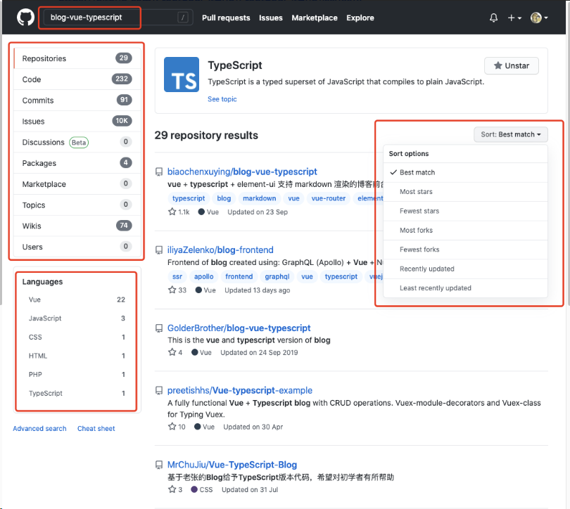

# 在 GitHub 精准搜索和寻找项目

参考：[恕我直言，你可能连 GitHub 搜索都不会用 - 如何精准搜索的神仙技巧 · Issue #4 · FrontEndGitHub/FrontEndGitHub](https://github.com/FrontEndGitHub/FrontEndGitHub/issues/4)

## 1.直接搜索技术栈相关

## 2.根据 最匹配、最多 Star 来进行排序、选择相应的语言、选择仓库或者代码来进行筛选

## 3.搜索语法

- 搜索 GitHub 时，你可以构建匹配特定数字和单词的查询

- 1）查询大于或小于另一个值的值

  - 1.您可以使用 >、>=、< 和 <= 搜索大于、大于等于、小于以及小于等于另一个值的值。

    - \>*n*	[cats vue:>1000](https://github.com/search?utf8=✓&q=vue+stars%3A>1000&type=Repositories) 匹配含有 "vue" 字样、星标超过 1000 个的仓库

    - \>=*n*	[vue topics:>=5](https://github.com/search?utf8=✓&q=vue+topics%3A>%3D5&type=Repositories) 匹配含有 "vue" 字样、有 5 个或更多主题的仓库

    - <*n*	[vue size:<10000](https://github.com/search?utf8=✓&q=vue+size%3A<10000&type=Code) 匹配小于 10 KB 的文件中含有 "vue" 字样的代码

    - <=*n*	[vue stars:<=50](https://github.com/search?utf8=✓&q=vue+stars%3A<%3D50&type=Repositories) 匹配含有 "vue" 字样、星标不超过 50 个的仓库

  - 2.还可以使用 范围查询 搜索大于等于或小于等于另一个值的值。

    - *n*..*	[vue stars:10..*](https://github.com/search?utf8=✓&q=vue+stars%3A10..*&type=Repositories) 等同于 stars:>=10 并匹配含有 "vue" 字样、有 10 个或更多星号的仓库。

    - *..*n*	[vue stars:*..10](https://github.com/search?utf8=✓&q=vue+stars%3A"*..10"&type=Repositories) 等同于 stars:<=10 并匹配含有 "vue" 字样、有不超过 10 个星号的仓库。

- 2）查询范围之间的值

  - 您可以使用范围语法 *n*..*n* 搜索范围内的值，其中第一个数字 n 是最低值，而第二个是最高值。

  - *n*..*n*	
    - [vue stars:10..50](https://github.com/search?utf8=✓&q=cats+stars%3A10..50&type=Repositories) 匹配含有 "vue" 字样、有 10 到 50 个星号的仓库。

- 3）查询日期

  - 您可以通过使用 >、>=、<、<= 和 范围查询 搜索早于或晚于另一个日期，或者位于日期范围内的日期。

  - 日期格式必须遵循 [ISO8601](http://en.wikipedia.org/wiki/ISO_8601) 标准，即 YYYY-MM-DD（年-月-日）。

    - \>*YYYY*-*MM*-*DD*	[vue created:>2016-04-29](https://github.com/search?utf8=✓&q=vue+created%3A>2016-04-29&type=Issues) 匹配含有 "vue" 字样、在 2016 年 4 月 29 日之后创建的议题。

    - \>=*YYYY*-*MM*-*DD*	[vue created:>=2017-04-01](https://github.com/search?utf8=✓&q=vue+created%3A>%3D2017-04-01&type=Issues) 匹配含有 "vue" 字样、在 2017 年 4 月 1 日或之后创建的议题。

    - <*YYYY*-*MM*-*DD*	[vue pushed:<2012-07-05](https://github.com/search?q=vue+pushed%3A<2012-07-05&type=Code&utf8=✓) 匹配在 2012 年 7 月 5 日之前推送的仓库中含有 "vue" 字样的代码。

    - <=*YYYY*-*MM*-*DD*	[vue created:<=2012-07-04](https://github.com/search?utf8=✓&q=vue+created%3A<%3D2012-07-04&type=Issues) 匹配含有 "vue" 字样、在 2012 年 7 月 4 日或之前创建的议题。

    - *YYYY*-*MM*-*DD*..*YYYY*-*MM*-*DD*	[vue pushed:2016-04-30..2016-07-04](https://github.com/search?utf8=✓&q=vue+pushed%3A2016-04-30..2016-07-04&type=Repositories) 匹配含有 "vue" 字样、在 2016 年 4 月末到 7 月之间推送的仓库。

    - *YYYY*-*MM*-*DD*..*	[vue created:2012-04-30..*](https://github.com/search?utf8=✓&q=vue+created%3A2012-04-30..*&type=Issues) 匹配在 2012 年 4 月 30 日之后创建、含有 "vue" 字样的议题。

    - *..*YYYY*-*MM*-*DD*	[vue created:*..2012-04-30](https://github.com/search?utf8=✓&q=vue+created%3A*..2012-07-04&type=Issues) 匹配在 2012 年 7 月 4 日之前创建、含有 "vue" 字样的议题。

    - 您也可以在日期后添加可选的时间信息 THH:MM:SS+00:00，以便按小时、分钟和秒进行搜索。 这是 T，随后是 HH:MM:SS（时-分-秒）和 UTC 偏移 (+00:00)

    

    - *YYYY*-*MM*-*DD*T*HH*:*MM*:*SS*+*00*:*00*	[vue created:2017-01-01T01:00:00+07:00..2017-03-01T15:30:15+07:00](https://github.com/search?utf8=✓&q=vue+created%3A2017-01-01T01%3A00%3A00%2B07%3A00..2017-03-01T15%3A30%3A15%2B07%3A00&type=Issues) 匹配在 2017 年 1 月 1 日凌晨 1 点（UTC 偏移为 07:00）与 2017 年 3 月 1 日下午 3 点（UTC 偏移为 07:00）之间创建的议题。 UTC 偏移量 07:00，2017 年 3 月 1 日下午 3 点。 UTC 偏移量 07:00。

    - *YYYY*-*MM*-*DD*T*HH*:*MM*:*SS*Z	[vue created:2016-03-21T14:11:00Z..2016-04-07T20:45:00Z](https://github.com/search?utf8=✓&q=vue+created%3A2016-03-21T14%3A11%3A00Z..2016-04-07T20%3A45%3A00Z&type=Issues) 匹配在 2016 年 3 月 21 日下午 2:11 与 2016 年 4 月 7 日晚上 8:45 之间创建的议题。

- 4）排除特定结果

  - 您可以使用 NOT 语法排除包含特定字词的结果。 NOT 运算符只能用于字符串关键词， 不适用于数字或日期
    - NOT	[hello NOT world](https://github.com/search?q=hello+NOT+world&type=Repositories) 匹配含有 "hello" 字样但不含有 "world" 字样的仓库。

  - 缩小搜索结果范围的另一种途径是排除特定的子集。 您可以为任何搜索限定符添加 - 前缀，以排除该限定符匹配的所有结果

    - -*QUALIFIER*	[vue stars:>10 -language:javascript](https://github.com/search?q=vue+stars%3A>10+-language%3Ajavascript&type=Repositories) 匹配含有 "vue" 字样、有超过 10 个星号但并非以 JavaScript 编写的仓库。

    - ​	[mentions:biaochenxuying -org:github](https://github.com/search?utf8=✓&q=mentions%3Adefunkt+-org%3Agithub&type=Issues) 匹配提及 [@biaochenxuying](https://github.com/biaochenxuying) 且不在 GitHub 组织仓库中的议题

- 5）对带有空格的查询使用引号

  - 如果搜索含有空格的查询，您需要用引号将其括起来。 例如：

    - [cats NOT "hello world"](https://github.com/search?utf8=✓&q=cats+NOT+"hello+world"&type=Repositories) 匹配含有 "vue" 字样但不含有 "hello world" 字样的仓库。

    - [build label:"bug fix"](https://github.com/search?utf8=✓&q=build+label%3A"bug+fix"&type=Issues) 匹配具有标签 "bug fix"、含有 "build" 字样的议题。

  - 某些非字母数字符号（例如空格）会从引号内的代码搜索查询中删除，因此结果可能出乎意料。

- 6）对带有空格的查询使用引号
  - 

- 7）使用用户名的查询
  - 

## 4.高级搜索

## **开源项目的组成部分**

先来了解一下一个开源项目有哪些搜索的关键点：

- name: 项目名

- description: 项目的简要描述

- 项目的源码

- README.md: 项目的详细情况的介绍

- star 数和 fork 数

- 项目的最近更新日期：项目是否活跃更新

## **如何搜索**

默认搜索是从 master 分支搜索代码

搜索语句不能有特殊字符如., : ; / \ ` ' " = \* ! ? # $ & + ^ | ~ < > ( ) { } [].

直接搜索框内 搜索相关项目名：”vue“，然后回车

搜索结果会显示非常多的开源项目，让你应接不暇，无从下手，很多小伙伴搜到这一步就放弃了，因为项目太多了，根本找不到如何找到自己感兴趣的开源项目，所以这样搜索非常的不准确。所以我们来学习一下稍微精确一点的搜索方法。

### 仓库详情：

打开一个项目，看下一个项目主页包含哪些信息，我已经做了标注：

上图可以看到，一个项目含有的基本信息，这些信息都可以通过搜索框来来匹配，从而更快的找到目标项目。通常星数，观看数，更新日期，表示了一个项目的火热程度。比如说我想搜索 readme 中含有 “web development” 关键字，主要编程语言为 ”Python“，星数大于 3000 的项目，就可以这样搜索：

"web development" in:readme language:python stars:>3000

搜索结果就只有 14 个，大大减轻了自己筛选的负担，结果如下：

下面列举下 GitHub 相关的搜索技巧：

1.常用词含义

- watch：会持续收到项目的动态
- fork：复制某个项目到自己的仓库
- star：可以理解为点赞
- clone：将项目下载到本地
- follow：关注你感兴趣的作者，会收到他们的动态

### 1、通过 in 关键字搜索

关键字 in 可以搜索出 GitHub 上的资源名称 name、说明 description 和 readme 文件中的内容。description 就是 About 那一块的信息。

比如说 `python in:name,description,readme` 其中，逗号分割表示或的意思，意思就是三者中只要有一个有 python 就行。
（1）公式
xxx in:name 项目名包含 xxx 的
xxx in:description 项目描述包含 xxx 的
xxx in:readme 项目
（2）case
搜索项目名或者 readme 中包含秒杀的项目
seckill in:name,readme

###### 进行精准搜索的筛选条件：（关键字可以是多个，以空格分割）

- in:name [关键词]// 按照仓库项目名搜索

- in:readme [关键词]// 按照 README 文档内容搜索

- in:description [关键词]// 按照 description 摘要搜索

### 2、通过 stars、fork 数量搜索

搜索 GitHub 时用 star 数量和 fork 数量判断这个项目是否优秀的标准之一，我们可以使用 大小，小于，范围等方式过滤：

`python in:name stars:>1000 forks:>500` 就表示星数大于 1000 且 forks 数大于 500，名字中含有 python 的项目。

如果要指定范围，可以这样：

`python in:name stars:5000..10000` 表示星数在 5000 到 10000 之间，名字中有 python 的项目。

（1）公式
:> 或者 :>=
数字 1..数字 2

（2）case
查找 star 数大于等于 5000 的 springboot 项目
springboot stars:>=5000
查找 fork 数大于 500 的 springcloud 项目
springcloud forks:>500
查找 fork 在 100 到 200 之间并且 stars 数在 80 到 100 之间的 springboot 项目
springboot forks:100..200 stars:80..100

###### stars、forks、language、pushed 筛选条件：

- **stars:>[num][关键词]** // 筛选 stars 数量大于某个值的仓库

- **stars:start..end**：stars:10..20[关键词] // 筛选 stars 数量在 start 和 end 区间的仓库

- **fork:start..end** // 筛选 stars 数量在 start 和 end 区间的仓库

- **forks:>3000** // forks 数大于 xxx

- **language:xxx** // 编程语言是 xxx

- **display language:scss** // 搜索用 scss 写的包含 display 的代码

- **pushed:>YYYY-MM-DD** // 最后更新时间大于 YYYY-MM-DD

- **created:>YYYY-MM-DD** // 创建时间大于 YYYY-MM-DD

### 3、按项目创建、更新时间搜索

按创建、更新时间搜索可以把版本老旧的资源筛选出去，比如说:

- 按创建时间：`created:>=YYYY-MM-DD`

- 按更新时间：`pushed:>=YYYY-MM-DD`

比如说搜索 2021 年之后创建的 Python 项目：`python in:name created:>=2021-01-01 pushed:>=2021-01-01`

### 4、按文件、路径内容搜索

在 GitHub 还可以按文件内容和文件路径搜索，不过有一定的限制，首先必须登录，此外项目的文件不能太多，文件不能太大，在需要搜索 fork 资源 时，只能搜索到 star 数量比父级资源多的 fork 资源，并需要加上 fork:true 查询，搜索结果最多可显示同一文件的两个分段，但文件内可能有更多结果，不能使用通配符。

语法格式：

- 按文件内容 `关键字 in:file`

- 按文件路径 `关键字 in:path`

比如：`python in:file,path`

###### 搜索路径和搜索文件：

**octocat in:file** // 搜索文件中有 octocat 的代码

**octocat in:path** // 搜索路径中有 octocat 的代码

**octocat in:file,path** // 搜索路径中有 octocat 的代码或者文件中有 octocat 的代码

**console path:app/public** // 在 app/public directory 目录下搜索 console 关键字

**form path:cgi-bin language:perl** // 搜索 cgi-bin 目录下包含 form 的 perl 代码

###### 通过文件名搜索

**filename:.vimrc commands** // 搜索 文件名匹配*.vimrc* 并且包含 commands 的代码

**minitest filename:test_helper path:test language:ruby** // 在 test 目录中搜索包含 minitest 且文件名匹配"_test_helper_"的代码

**form path:cgi-bin extension:pm** // 搜索 cgi-bin 目录下以 pm 为扩展名的代码

**icon size:>200000 extension:css** // 搜索超过 200kb 包含 icon 的 css 代码

**user:github extension:rb** // 通过用户或者组织来查找

### 5、按文件名、大小、扩展名搜索

语法格式如下：

- 按文件名搜索：`关键字 filename:FILENAME`

- 按文件大小搜索：`关键字 size:>=大小`

- 按扩展名搜索：`关键字 extension:EXTENSION`

举个例子：`python filename:aaa size:>10 extension:py`

### 6、按编程语言来搜索

语法格式：`关键字 language:LANGUAGE`

比如：`python language:javascript` 表示搜索 javascrip 语言中关于 python 的项目。

搜索一个 springboot 项目，你是否就直接输入 springboot 关键字直接搜索，但是搜索出了 118,085 个结果，当然了，你还可以做一些简单的排序，比如通过 stars、forks 的数量。

### 7、根据某个人或组织进行搜索

- 这个可以用来精准搜索你关注的大神是不是提交了新的项目

1. 搜索特定个人的项目：
   - **语法：** `user:用户名 关键字`
2. 搜索特定组织的项目：
   - **语法：** `org:组织名 关键字`

###### 某个组织或个人的仓库、被关注人数 followers：

**org:wang**

**user:joshlong**

**followers:>5000**

| 示例                       | 说明                                                       |
| -------------------------- | ---------------------------------------------------------- |
| user:torvalds linux kernel | 搜索用户 Linus Torvalds 的项目中包含 "linux kernel" 的内容 |
| org:Microsoft azure cloud  | 搜索 Microsoft 组织的项目中包含 "azure cloud" 的内容       |

### 8、根据仓库的 LICENSE 搜索

在使用任何开源项目之前，最好详细阅读并理解项目所采用的具体授权协议，因为有的开源项目作者是明确禁止商用的，如果你使用在商业上，后面会很麻烦的！

**按照许可证搜索：**

- **语法：** `license:许可证类型 关键字`

###### 仓库的大小和开源许可证筛选：

**size:>=[num]**    // num 以 K 为单位

**license:apache-2.0**

| 示例                   | 说明                                                      |
| ---------------------- | --------------------------------------------------------- |
| license:gpl encryption | 搜索包含 GPL 许可证的仓库中含有 "encryption" 关键字的项目 |

### 5.高亮显示某一行代码

地址后面紧跟#L 数字

地址后面紧跟#L 数字 1-数字 2

例如：[springBoot/CommonUtil.java at master · 527515025/springBoot · GitHub](https://github.com/527515025/springBoot/blob/master/springboot-mybatis/src/main/java/com/us/example/util/CommonUtil.java#L21-L47)

### 6.项目内搜索

英文 t：https://help.github.com/en/articles/keyboard-shortcuts

### 7.搜索某个地区内的牛逼人物

（1）公式

location：地区

language：语言

（2）case

location:guangzhou language:java

### 4."awesome"关键字

搜索优秀的 redis 相关项目，框架，教程

GitHub 上有各种 awesome 系列，简单来说就是这个系列搜罗整理了 GitHub 上各领域的资源大汇总，比如有 awesome-android, awesome-ios, awesome-java, awesome-Python 等等。

例如:awesome redis

（1）公式
awesome 关键字
awesome 系列一般是用来收集学习、工具、书籍类相关的项目
（2）case
搜索优秀的 redis 相关的项目，包括框架、教程等
awesome redis

### 10、热门搜索（GitHub Trend 和 GitHub Topic）

- GitHub Trend 允许你查看当前在 GitHub 上受欢迎的项目，根据不同的编程语言和时间范围进行筛选

- GitHub Topic 是一种对项目进行标签分类的方式。GitHub 上的项目可以被分配到不同的主题标签，使得你可以通过主题来浏览和发现项目。

### 高级搜索

除了使用这种特定的限定词来筛选之外，其实 github 还给我们提供了一种筛选的搜索链接。

https://github.com/search/advanced

其实就是界面化的搜索条件筛选框，想不起搜索关键词或者单词的时候可以收藏这个高级搜索界面哈。

## 高级的搜索

### 按仓库名称、说明或自述文件内容搜索

通过 `in` 限定符，您可以将搜索限制为仓库名称、仓库说明、自述文件内容或这些的任意组合。

如果省略此限定符，则只搜索仓库名称和说明。

| 限定符            | 示例                                                               |
| ----------------- | ------------------------------------------------------------------ |
| `in:name`         | **vue in:name** 匹配其名称中含有 "jquery" 的仓库。                 |
| `in:description`  | **vue in:name,description** 匹配其名称或说明中含有 "vue" 的仓库。  |
| `in:readme`       | **vue in:readme** 匹配其自述文件中提及 "vue" 的仓库。              |
| `repo:owner/name` | **repo:haha/blog** 匹配特定仓库名称，比如：用户为 biaochenxuhaha。 |

### 在用户或组织的仓库内搜索

要在 `特定用户或组织` 拥有的所有仓库中搜索，您可以使用 `user` 或 `org` 限定符。

| 限定符            | 示例                                                            |
| ----------------- | --------------------------------------------------------------- |
| `user:*USERNAME*` | **user:haha forks:>=100** 匹配来自 @biaochenxuhaha 复刻的仓库。 |
| `org:*ORGNAME*`   | **org:github** 匹配来自 GitHub 的仓库。                         |

### 按仓库大小搜索

`size` 限定符使用 大于、小于和范围限定符 查找匹配特定大小（以千字节为单位）的仓库。

| 限定符     | 示例                                                   |
| ---------- | ------------------------------------------------------ |
| `size:*n*` | **size:1000** 匹配恰好为 1 MB 的仓库。                 |
|            | **size:>=30000** 匹配至少为 30 MB 的仓库。             |
|            | **size:<50** 匹配小于 50 KB 的仓库。                   |
|            | **size:50..120** 匹配介于 50 KB 与 120 KB 之间的仓库。 |

### 按关注者数量搜索

您可以使用 `followers` 限定符以及大于、小于和范围限定符基于仓库拥有的关注者数量过滤仓库。

| 限定符          | 示例                                                                                                       |
| --------------- | ---------------------------------------------------------------------------------------------------------- |
| `followers:*n*` | **node followers:>=10000** 匹配有 10,000 或更多关注者提及文字 "node" 的仓库。                              |
|                 | **styleguide linter followers:1..10** 匹配拥有 1 到 10 个关注者并且提及 "styleguide linter" 一词的的仓库。 |

### 按复刻数量搜索

`forks` 限定符使用大于、小于和范围限定符指定仓库应具有的复刻数量。

| 限定符      | 示例                                              |
| ----------- | ------------------------------------------------- |
| `forks:*n*` | **forks:5** 匹配只有 5 个复刻的仓库。             |
|             | **forks:>=205** 匹配具有至少 205 个复刻的仓库。   |
|             | **forks:<90** 匹配具有少于 90 个复刻的仓库。      |
|             | **forks:10..20** 匹配具有 10 到 20 个复刻的仓库。 |

### 按星号数量搜索

您可以使用 大于、小于和范围限定符 基于仓库具有的 星标 数量搜索仓库

| 限定符      | 示例                                                                                                  |
| ----------- | ----------------------------------------------------------------------------------------------------- |
| `stars:*n*` | **stars:500** 匹配恰好具有 500 个星号的仓库。                                                         |
|             | **stars:10..20** 匹配具有 10 到 20 个星号、小于 1000 KB 的仓库。                                      |
|             | **stars:>=500 fork:true language:vue** 匹配具有至少 500 个星号，包括复刻的星号（以 vue 编写）的仓库。 |

### 按仓库创建或上次更新时间搜索

你可以基于创建时间或上次更新时间过滤仓库。

- 对于仓库创建，您可以使用 `created` 限定符；

- 要了解仓库上次更新的时间，您要使用 `pushed` 限定符。 `pushed` 限定符将返回仓库列表，按仓库中任意分支上最近进行的提交排序。

两者均采用日期作为参数。日期格式必须遵循 ISO8601 标准，即 `YYYY-MM-DD`（年-月-日）。

也可以在日期后添加可选的时间信息 `THH:MM:SS+00:00`，以便按小时、分钟和秒进行搜索。这是 `T`，随后是 `HH:MM:SS`（时-分-秒）和 UTC 偏移 (`+00:00`)。

日期支持 `大于、小于和范围限定符`。

| 限定符                 | 示例                                                                                                              |
| ---------------------- | ----------------------------------------------------------------------------------------------------------------- |
| `created:*YYYY-MM-DD*` | **vue created:<2020-01-01** 匹配具有 "vue" 字样、在 2020 年之前创建的仓库。                                       |
| `pushed:*YYYY-MM-DD*`  | **css pushed:>2020-02-01** 匹配具有 "css" 字样、在 2020 年 1 月之后收到推送的仓库。                               |
|                        | **vue pushed:>=2020-03-06 fork:only** 匹配具有 "vue" 字样、在 2020 年 3 月 6 日或之后收到推送并且作为复刻的仓库。 |

### 按语言搜索

您可以基于其编写采用的主要语言搜索仓库。

| 限定符                | 示例                                                                        |
| --------------------- | --------------------------------------------------------------------------- |
| `language:*LANGUAGE*` | **vue language:javascript** 匹配具有 "vue" 字样、以 JavaScript 编写的仓库。 |

### 按主题搜索

您可以查找归类为特定 主题 的所有仓库。

| 限定符          | 示例                                                      |
| --------------- | --------------------------------------------------------- |
| `topic:*TOPIC*` | **topic:algorithm** 匹配已归类为 "algorithm" 主题的仓库。 |

估计又有很多人不知道 GitHub 上有话题一说的吧。

### 按主题数量搜索

您可以使用 `topics` 限定符以及 大于、小于和范围限定符 按应用于仓库的 主题 数量搜索仓库。

| 限定符       | 示例                                   |
| ------------ | -------------------------------------- |
| `topics:*n*` | **topics:5** 匹配具有五个主题的仓库。  |
|              | **topics:>3** 匹配超过三个主题的仓库。 |

### 使用可视界面搜索

还可以使用 search page 或 advanced search page 搜索 GitHub 哦。

这种搜索方式，估计就更少人知道了吧。

advanced search page 提供用于构建搜索查询的可视界面。

您可以按各种因素过滤搜索，例如仓库具有的星标数或复刻数。在填写高级搜索字段时，您的查询将在顶部搜索栏中自动构建。

高级搜索

### 按许可搜索

您可以按其许可搜索仓库。您必须使用许可关键词按特定许可或许可系列过滤仓库。

| 限定符                      | 示例                                                            |
| --------------------------- | --------------------------------------------------------------- |
| `license:*LICENSE_KEYWORD*` | **license:apache-2.0** 匹配根据 Apache License 2.0 授权的仓库。 |

### 按公共或私有仓库搜索

您可以基于仓库是公共还是私有来过滤搜索。

| 限定符       | 示例                                                                 |
| ------------ | -------------------------------------------------------------------- |
| `is:public`  | **is:public org:github** 匹配 GitHub 拥有的公共仓库。                |
| `is:private` | **is:private pages** 匹配您有访问权限且包含 "pages" 字样的私有仓库。 |

### 按公共或私有仓库搜索

您可以根据仓库是否为镜像以及托管于其他位置托管来搜索它们。

| 限定符         | 示例                                                           |
| -------------- | -------------------------------------------------------------- |
| `mirror:true`  | **mirror:true GNOME** 匹配是镜像且包含 "GNOME" 字样的仓库。    |
| `mirror:false` | **mirror:false GNOME** 匹配并非镜像且包含 "GNOME" 字样的仓库。 |

### 基于仓库是否已存档搜索

你可以基于仓库是否已存档来搜索仓库。

| 限定符           | 示例                                                           |
| ---------------- | -------------------------------------------------------------- |
| `archived:true`  | **archived:true GNOME** 匹配已存档且包含 "GNOME" 字样的仓库。  |
| `archived:false` | **archived:false GNOME** 匹配未存档且包含 "GNOME" 字样的仓库。 |

### 基于具有 `good first issue` 或 `help wanted` 标签的议题数量搜索

您可以使用限定符 `help-wanted-issues:>n` 和 `good-first-issues:>n` 搜索具有最少数量标签为 `help-wanted` 或 `good-first-issue` 议题的仓库。

| 限定符                  | 示例                                                                                                                 |
| ----------------------- | -------------------------------------------------------------------------------------------------------------------- |
| `good-first-issues:>n`  | **good-first-issues:>2 javascript** 匹配具有超过两个标签为 `good-first-issue` 的议题且包含 "javascript" 字样的仓库。 |
| `help-wanted-issues:>n` | **help-wanted-issues:>4 react** 匹配具有超过四个标签为 `help-wanted` 的议题且包含 "React" 字样的仓库。               |

## 搜索语法

搜索 GitHub 时，你可以构建匹配特定数字和单词的查询。

### 查询大于或小于另一个值的值

您可以使用 `>`、`>=`、`<` 和 `<=` 搜索大于、大于等于、小于以及小于等于另一个值的值。

| 查询    | 示例                                                               |
| ------- | ------------------------------------------------------------------ |
| `>*n*`  | **cats vue:>1000** 匹配含有 "vue" 字样、星标超过 1000 个的仓库。   |
| `>=*n*` | **vue topics:>=5** 匹配含有 "vue" 字样、有 5 个或更多主题的仓库。  |
| `<*n*`  | **vue size:<10000** 匹配小于 10 KB 的文件中含有 "vue" 字样的代码。 |
| `<=*n*` | **vue stars:<=50** 匹配含有 "vue" 字样、星标不超过 50 个的仓库。   |

您还可以使用 范围查询 搜索大于等于或小于等于另一个值的值。

| 查询     | 示例                                                                                       |
| -------- | ------------------------------------------------------------------------------------------ |
| `*n*..*` | **vue stars:10..\*** 等同于 `stars:>=10` 并匹配含有 "vue" 字样、有 10 个或更多星号的仓库。 |
| `*..*n*` | **vue stars:\*..10** 等同于 `stars:<=10` 并匹配含有 "vue" 字样、有不超过 10 个星号的仓库。 |

### 查询范围之间的值

您可以使用范围语法 `*n*..*n*` 搜索范围内的值，其中第一个数字 _n_ 是最低值，而第二个是最高值。

| 查询       | 示例                                                                 |
| ---------- | -------------------------------------------------------------------- |
| `*n*..*n*` | **vue stars:10..50** 匹配含有 "vue" 字样、有 10 到 50 个星号的仓库。 |

### 查询日期

您可以通过使用 `>`、`>=`、`<`、`<=` 和 范围查询 搜索早于或晚于另一个日期，或者位于日期范围内的日期。

日期格式必须遵循 ISO8601 标准，即 `YYYY-MM-DD`（年-月-日）。

| 查询                                 | 示例                                                                                                |
| ------------------------------------ | --------------------------------------------------------------------------------------------------- |
| `>*YYYY*-*MM*-*DD*`                  | **vue created:>2016-04-29** 匹配含有 "vue" 字样、在 2016 年 4 月 29 日之后创建的议题。              |
| `>=*YYYY*-*MM*-*DD*`                 | **vue created:>=2017-04-01** 匹配含有 "vue" 字样、在 2017 年 4 月 1 日或之后创建的议题。            |
| `<*YYYY*-*MM*-*DD*`                  | **vue pushed:<2012-07-05** 匹配在 2012 年 7 月 5 日之前推送的仓库中含有 "vue" 字样的代码。          |
| `<=*YYYY*-*MM*-*DD*`                 | **vue created:<=2012-07-04** 匹配含有 "vue" 字样、在 2012 年 7 月 4 日或之前创建的议题。            |
| `*YYYY*-*MM*-*DD*..*YYYY*-*MM*-*DD*` | **vue pushed:2016-04-30..2016-07-04** 匹配含有 "vue" 字样、在 2016 年 4 月末到 7 月之间推送的仓库。 |
| `*YYYY*-*MM*-*DD*..*`                | **vue created:2012-04-30..\*** 匹配在 2012 年 4 月 30 日之后创建、含有 "vue" 字样的议题。           |
| `*..*YYYY*-*MM*-*DD*`                | **vue created:\*..2012-04-30** 匹配在 2012 年 7 月 4 日之前创建、含有 "vue" 字样的议题。            |

您也可以在日期后添加可选的时间信息 `THH:MM:SS+00:00`，以便按小时、分钟和秒进行搜索。这是 `T`，随后是 `HH:MM:SS`（时-分-秒）和 UTC 偏移 (`+00:00`)。

| 查询                                        | 示例                                                                                                                                                                                                                                                                |
| ------------------------------------------- | ------------------------------------------------------------------------------------------------------------------------------------------------------------------------------------------------------------------------------------------------------------------- |
| `*YYYY*-*MM*-*DD*T*HH*:*MM*:*SS*+*00*:*00*` | **vue created:2017-01-01T01:00:00+07:00..2017-03-01T15:30:15+07:00** 匹配在 2017 年 1 月 1 日凌晨 1 点（UTC 偏移为 `07:00`）与 2017 年 3 月 1 日下午 3 点（UTC 偏移为 `07:00`）之间创建的议题。UTC 偏移量 `07:00`，2017 年 3 月 1 日下午 3 点。UTC 偏移量 `07:00`。 |
| `*YYYY*-*MM*-*DD*T*HH*:*MM*:*SS*Z`          | **vue created:2016-03-21T14:11:00Z..2016-04-07T20:45:00Z** 匹配在 2016 年 3 月 21 日下午 2:11 与 2016 年 4 月 7 日晚上 8:45 之间创建的议题。                                                                                                                        |

### 排除特定结果

您可以使用 `NOT` 语法排除包含特定字词的结果。 `NOT` 运算符只能用于字符串关键词， 不适用于数字或日期。

| 查询  | 示例                                                                   |
| ----- | ---------------------------------------------------------------------- |
| `NOT` | **hello NOT world** 匹配含有 "hello" 字样但不含有 "world" 字样的仓库。 |

缩小搜索结果范围的另一种途径是排除特定的子集。您可以为任何搜索限定符添加 `-` 前缀，以排除该限定符匹配的所有结果。

| 查询           | 示例                                                                                                         |
| -------------- | ------------------------------------------------------------------------------------------------------------ |
| `-*QUALIFIER*` | **vue stars:>10 -language:javascript** 匹配含有 "vue" 字样、有超过 10 个星号但并非以 JavaScript 编写的仓库。 |
|                | **mentions:haha -org:github** 匹配提及 [haha] 且不在 GitHub 组织仓库中的议题                                 |

### 对带有空格的查询使用引号

如果搜索含有空格的查询，您需要用引号将其括起来。例如：

- cats NOT "hello world" 匹配含有 "vue" 字样但不含有 "hello world" 字样的仓库。

- build label:"bug fix" 匹配具有标签 "bug fix"、含有 "build" 字样的议题。

某些非字母数字符号（例如空格）会从引号内的代码搜索查询中删除，因此结果可能出乎意料。

### 使用用户名的查询

如果搜索查询包含需要用户名的限定符，例如 `user`、`actor` 或 `assignee`，您可以使用任何 GitHub 用户名指定特定人员，或使用 `@me` 指定当前用户。

| 查询                 | 示例                                                 |
| -------------------- | ---------------------------------------------------- |
| `QUALIFIER:USERNAME` | `author:haha` 匹配 [haha] 创作的提交。               |
| `QUALIFIER:@me`      | `is:issue assignee:@me` 匹配已分配给结果查看者的议题 |

`@me` 只能与限定符一起使用，而不能用作搜索词，例如 `@me main.workflow`。

## 学习

其实，以上很多内容的都是来自于 GitHub 的官方文档，如果你还想学习更多技巧，请看

GitHub 官方文档 : [GitHub Documentation](https://docs.github.com/cn)

如果你还不了解或者不会使用 GitHub ，可以看看这一章节：

Git 和 GitHub 学习资源 ：[Git 和 GitHub 学习资源 - GitHub Docs](https://docs.github.com/cn/free-pro-team@latest/github/getting-started-with-github/git-and-github-learning-resources)

## 2. Follow

关注 GitHub 上活跃的大牛。

GitHub 主页有一个类似微信的朋友圈，所有你关注的人（相当于微信的好友）的动作，比如 create、star、fork 了某个项目都会出现在你的时间线上，这种方式适合我这种比较懒的人，不用主动去找项目，而这种基本是我每天获取信息的一个很重要的方式。

一些大牛 create、star、fork 了某个项目，很大程度是因为该项目做的好，或者对他有用的。

比如：github 上的 actions 功能刚出不是很久，很多人还不会用，然后阮玉峰老师今天就创建了一个 github-actions-demo 的仓库。

再比如：还有过几天就是中秋了，所以很多人抢票回家，所以不少人 star 了 12306 的智能刷票，订票的项目。

比如下图就是我关注的一些大牛在今天点了 Star 的项目。

不知道怎么关注这些人？那么很简单，关注我 haha ，以及我 GitHub 上关注的一些大牛，基本就差不多了，因为我关注的很多在 GitHub 上活跃的大牛，平时看到活跃的大牛也会继续关注。

可能很多人不想 Follow 别人，因为不想被别人看到，不想承认别人比自己优秀。

但我想说：**承认别人比自己优秀不丢脸**。

Vue.js 的作者尤雨溪够牛 B 吧，都关注了不少大牛呢，都虚心向别人学习呢，更何况我们呢。

活跃是指：经常在 GitHub 上做开源项目、 Star 别人优秀项目、Fork 别人优秀项目、Flow 别人、或者写博客。

但是你关注太多比你的 level 高太多的大牛用处不是很大的，往往对你现在的帮助不是很大，所以关注顶级大牛的目的应该是更好的知道行业的动态或者方向。

多关注一些 level 高一两级的大牛，比如你是初级前端，那你应该关注多一些中级或者高级的前端， 只比你的 level 高一两级的前端现在关注的内容或者知识往往是你即将要学到或者用到的。

至于为什么只关注活跃的大牛呢，因为自己能从他那里有所收获，如果某个技术大牛确实很厉害，但是对你没什么帮助，关注 TA 有个毛用嘛！

## 3. Explore Repositories

github 也会推一些你可能感兴趣的仓库给你的，只要你一打开 [github.com](https://github.com/) 网站，就出现了。比如下图是今天推送给我的仓库。

## 4. Explore

### 4.1 Trending

Trending：趋势的意思。

在 Trending 页面，你可以看到最近一些热门的开源项目或者开发者，这个页面可以算是很多人主动获取一些开源项目和活跃开发者最好的途径。

首先点击 Explore => Trending。

- 可以选择看开源项目还是开发者，切换 Repositories 和 Developers 即可。

- 可以选择「当天热门」、「一周之内热门」和「一月之内热门」来查看。

- 可以选择语言类来查看，比如你想查看最近热门的 Vue 项目，那么右边就可以选择 Vue 语言。

这个页面推荐大家每隔几天就去看下，主动发掘一些优秀的开源项目。

### 4.2 Topics

Topics 里面也可以看某个话题或者领域内最优秀的项目。

比如前端领域： [Front end](https://github.com/topics/frontend)

## 5. Star

因为笔者也做过几个开源项目，所以知道 star 数会给作者动力的，越多人点 star ，维护这个开源项目的驱动力就越足。

笔者经常看到不错的、有趣的、有用的，或者现在没用，以后会用到的优秀开源项目，都会 star 一下，当是给这个开源的作者一份鼓励，希望 TA 更好的维护这个开源项目，以后用到的时候可以在 star 过的项目里面找出来。

笔者不想 fork 别人的项目，除非想深入研究该项目的源码才会 fork。

**别人是把 fork 当收藏，而我把是 star 当收藏，把 fork 当研究**。

所以你也可以在某些大牛的 star 列表里面找优秀开源项目，比如笔者就 star 了不少优秀的开源项目，如下图。

如果你在笔者的 [star 列表](https://github.com/haha?tab=stars) 里面找的话，你应该会有惊喜，你会发现很多有趣实用的项目的。

因为笔者 star 过前端学习、教程、免费电子书、工具、资源、面试、Git 的奇技淫巧、有趣实用的项目等等。

比如：

- [油猴脚本 一个脚本搞定百度网盘下载](https://github.com/syhyz1990/baiduyun)

- [总结关于科学上网的概念方法及工具](https://github.com/crifan/scientific_network_summary)

## 6. Search

除了平时主动发现优秀开源项目之外，主动搜索又是非常重要的技能，很多百度或者 google 不到的东西，在 github 上都能找到。

输入搜索关键字，可以选择排序的方式、语言、仓库。

[73 个 GitHub 高级搜索技巧\_执章学长的博客-CSDN 博客\_github 高级搜索技巧](https://blog.csdn.net/PaperJack/article/details/118543980)

## 轻松发现开源项目

**开源不仅仅是合并一个 `Pull Request`（`PR`）。**

在这个互联互通的世界里，成为开源社区的一员可能是开启新机遇、实现个人成长的关键。对我而言，这是一个在无需工作的情况下产生影响、在数百万用户中留下印记的机会。你参与编码、共同合作、扩展社交网络。但最重要的是，你受到欢迎，并且时刻与经验丰富的人互动。

> **小贴士**：为了长期利益，选择好的组织而不是单个存储库。

大多数人都苦于如何找到优秀的开源项目。本文为你提供了多种选项，量身定制，完美适应你的需求。

### [Trending repositories on GitHub today](https://github.com/trending)

你可以根据`Spoken Language`、`Programming Language`和`Date`来查找热门的仓库。这些都是能够提升你在开源社区中信誉和声望的精选仓库。

### `GitHub Advanced Filters`

如：[Repository search results (github.com)](https://github.com/search?q=Vue&type=repositories)

如果你想完全掌控搜索，那么这个选项正是为你量身打造的。你可以使用 60 多个选项进行过滤，包括`Language`、`Number of Stars`、`Number of Forks`、`License`、`Issues`，甚至是`Commits`。

### [Good First Issue: Make your first open-source contribution](https://goodfirstissue.dev/)

如果你刚开始涉足开源，请不要把它弄得比实际情况更复杂。请记住，适合新贡献者的问题通常会被标记为“`good first issue`”或“`help wanted`”，这有助于你进行首次开源贡献。你可以通过友好的用户界面找到几个好的首次贡献机会，并选择你偏好的编程语言。

### [Up For Grabs (up-for-grabs.net)](https://up-for-grabs.net/)

这个选项是寻找优秀开源项目的最受欢迎的网站之一。你可以按照项目名称 (`name`) 和标签 (`label`)（例如 `good first issues`）进行筛选，同时探索 `popular tags`（例如 `JavaScript` 和 `Python`）。此外，你还可以查看仓库的最后更新时间。

### [First Contributions](https://firstcontributions.github.io/)

一个网站，你可以使用你喜好的编程语言作为过滤器，从预定义的列表中搜索项目。

### [Contribute - Quine](https://quine.sh/contribute)

`Quine` 帮助你通过为开源项目做出贡献来积累声誉。他们拥有自己的排行榜、任务，以及许多创新功能。你可以在不注册的情况下搜索项目，但我强烈建议你注册并进行探索。该网站的突出特点是它显示了`PR`合并的时间（以小时为单位），展示了当前月份有多少新的贡献者，并详细说明了问题的类型。这为你提供了对项目的清晰了解。

你甚至可以向你的个人资料添加小部件。所以，赶紧去探索吧！

### [Highlights | OpenSauced](https://app.opensauced.pizza/feed)

有大量的统计数据可以增加可信度，提供了一些相关的过滤选项，例如`Top 100 Repos`、`Minimum 5 Contributors`、`Recent`、`Most Active`。

你可以查看`PR Velocity`和`PR Overview`，并使用`language`或`tags`进行过滤。

在`Open Sauced`中，有许多特色功能，它会为你的开源之旅推荐一些特别适合的优秀仓库。

还有许多其他功能，比如创建亮点来跟踪你选择的仓库中的活动。

### [Home | GSoC Organizations](https://www.gsocorganizations.dev/)

根据我的经验，对组织的贡献带来的好处远远超过对个别仓库的贡献。你肯定听说过“`Google Summer of Code`”，许多知名组织都会参与其中。在这里，你可以探索“`Google Summer of Code`”中所有被接受的组织列表，了解它们使用的技术栈，并可以按照主题和类别进行过滤。
