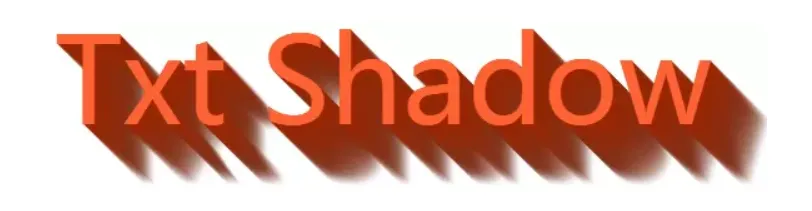
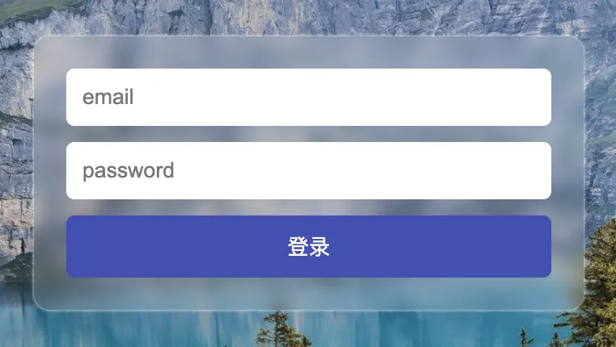

# CSS 奇淫巧技

Defensive CSS：<https://defensivecss.dev/>

这个网站收集各种防御性的 CSS 技巧，防止客户端出现各种破坏 CSS 显示的情况

## 技巧

[我写 CSS 的常用套路(附 demo 的效果实现与源码） - 知乎 (zhihu.com)](https://zhuanlan.zhihu.com/p/158672754)

[104 道 CSS 面试题，助你查漏补缺 - 知乎 (zhihu.com)](https://zhuanlan.zhihu.com/p/114257330)

[55 个提高你 CSS 开发效率的必备片段 - 知乎 (zhihu.com)](https://zhuanlan.zhihu.com/p/118436424)

[为什么 CSS 这么难学？ - 知乎 (zhihu.com)](https://www.zhihu.com/question/66167982/answer/1160351616)

[为什么 CSS 3 要实现垂直居中那么的难？ - 知乎 (zhihu.com)](https://www.zhihu.com/question/19583370/answer/149631260)

[CSS :has() Interactive Guide (ishadeed.com)](https://ishadeed.com/article/css-has-guide/)

[纯 CSS 实现多标签自动显示超出数量 - 掘金 (juejin.cn)](https://juejin.cn/post/7352785768094203913)

[分享css的一些小技巧 - 掘金 (juejin.cn)](https://juejin.cn/post/7383205958828671013)

## CSS 阴影技巧与细节

最近一个新的项目，CSS-Inspiration，挖掘了其他很多有关 CSS 阴影的点子，是之前的文章没有覆盖到的新内容，而且有一些很有意思，遂打算再起一篇。

本文的题目是 CSS 阴影技巧与细节。CSS 阴影，却不一定是 `box-shadow` 与 `filter:drop-shadow`，为啥？因为使用其他属性也可以模拟阴影，而且是各种各样的阴影。下面且听我娓娓道来~

## **单侧投影**

先说单侧投影，关于 `box-shadow`，大部分时候，我们使用它都是用来生成一个两侧的投影，或者一个四侧的投影。如下：


OK，那如果要生成一个单侧的投影呢？

我们来看看 box-shadow 的用法定义：

```
{
  box-shadow: none | [inset? && [ <offset-x> <offset-y> <blur-radius>? <spread-radius>? <color>? ] ]#
}
```

以 `box-shadow: 1px 2px 3px 4px #333` 为例，4 个数值的含义分别是，x 方向偏移值、y 方向偏移值 、模糊半径、扩张半径。

这里有一个小技巧，**扩张半径可以为负值**。

继续，如果阴影的模糊半径，与**负的**扩张半径一致，那么我们将看不到任何阴影，因为生成的阴影将被包含在原来的元素之下，除非给它设定一个方向的偏移量。所以这个时候，我们给定一个方向的偏移值，即可实现单侧投影：


## **投影背景 / 背景动画**

接着上面的说。

很明显，`0 = -0`，所以当 `box-shadow` 的模糊半径和扩张半径都为 0 的时候，我们也可以得到一个和元素大小一样的阴影，只不过被元素本身遮挡住了，我们尝试将其偏移出来。

CSS 代码如下：

-
-
-
-
-
-
-

```
div {    width: 80px;    height: 80px;    border: 1px solid #333;    box-sizing: border-box;    box-shadow: 80px 80px 0 0 #000;}
```

得到如下结果：


有什么用呢？好像没什么意义啊。

额，确实好像没什么用。不过我们注意到，`box-shadow` 是可以设置多层的，也就是多层阴影，而且可以进行过渡变换动画（补间动画）。但是 `background-image: linear-gradient()`，也就是渐变背景是不能进行补间动画的。

这又扯到哪里去了。好我们回来，利用上面的特性，我们可以利用 `box-shadow` 实现原本只能利用渐变才能实现的背景图：


用 `box-shadow`，实现它的 CSS 代码如下（可以更简化）：

-
-
-
-
-
-
-
-
-
-
-
-
-
-
-
-
-
-
-
-

```
.shadow {    position: relative;    width: 250px;    height: 250px;}
.shadow::before {    content: "";    position: absolute;    width: 50px;    height: 50px;    top: -50px;    left: -50px;    box-shadow:        50px 50px #000, 150px 50px #000, 250px 50px #000,        50px 100px #000, 150px 100px #000, 250px 100px #000,        50px 150px #000, 150px 150px #000, 250px 150px #000,        50px 200px #000, 150px 200px #000, 250px 200px #000,        50px 250px #000, 150px 250px #000, 250px 250px #000;}
```

用渐变来实现的话，只需要这样：

-
-
-
-
-
-

```
.gradient {    width: 250px;    height: 250px;    background-image: linear-gradient(90deg, #000 0%, #000 50%, #fff 50%, #fff 100%);    background-size:  100px 100px;}
```

为什么选择更为复杂的 `box-shadow` 呢？因为它可以进行补间动画，像这样，这是使用渐变做不到的：


当然，这只是个示例 Demo，运用点想象力还有很多有意思的效果，再贴一个：


嗯，很有意思，就是实际用途可能不大。

## **立体投影**

好，我们继续。下一个主题是**立体投影**。

这个说法很奇怪，阴影的出现，本就是为了让原本的元素看起来更加的立体，那这里所谓的立体投影，是个怎么立体法？

这里所谓的立体投影，并不一定是使用了 `box-shadow`、`text-shadow` 或者 `drop-shadow`，而是我们使用其他元素或者属性模拟元素的阴影。而这样做的目的，是为了能够突破 `box-shadow` 这类元素的一些定位局限。**让阴影的位置、大小、模糊度可以更加的灵活**。

OK，让我们来看看，这样一个元素，我们希望通过自定义阴影的位置，让它更加立体：


上图 div 只是带了一个非常浅的 `box-shadow` ，看上去和立体没什么关系，接下来，我们通过 div 的伪元素，给它生成一个和原图边角形状类似的图形，再通过 transform 位移一下，可能是这样：


OK，最后对这个用伪元素生成的元素进行一些虚化效果（filter 或者 box-shadow 都可以），就可以实现一个边角看起来像被撕开的立体效果：


代码非常简单，伪 CSS 代码示意如下：

-
-
-
-
-
-
-
-
-
-
-
-
-
-
-
-
-
-
-
-
-

```
div {    position: relative;    width: 600px;    height: 100px;    background: hsl(48, 100%, 50%);    border-radius: 20px;}
div::before {    content: "";    position: absolute;    top: 50%;    left: 5%;    right: 5%;    bottom: 0;    border-radius: 10px;    background: hsl(48, 100%, 20%);    transform: translate(0, -15%) rotate(-4deg);    transform-origin: center center;    box-shadow: 0 0 20px 15px hsl(48, 100%, 20%);}
```

所以总结一下：

- 立体投影的关键点在于利于伪元素生成一个大小与父元素相近的元素，然后对其进行 rotate 以及定位到合适位置，再赋于阴影操作
- 颜色的运用也很重要，阴影的颜色通常比本身颜色要更深，这里使用 hsl 表示颜色更容易操作，l 控制颜色的明暗度

还有其他很多场景：

**演示地址：**https://codepen.io/Chokcoco/pen/LgdRKE?editors=1100

### **文字立体投影 / 文字长阴影**

上面的立体效果在文字上就完全不适用了，所以对待文字的立体阴影效果，还需要另辟蹊径。

正常而言，我们使用 text-shadow 来生成文字阴影，像这样：

-
-
-
-
-

```html
<div>Txt Shadow</div>

div { text-shadow: 6px 6px 3px hsla(14, 100%, 30%, 1);}
```


嗯，挺好的，就是不够立体。那么要做到立体文字阴影，最常见的方法就是使用多层文字阴影叠加。

> Tips：和 `box-shadow` 一样，`text-shadow` 是可以叠加多层的！但是对于单个元素而言， `drop-shadow` 的话就只能是一层。

好，上面的文字，我们试着叠加个 50 层文字阴影试一下。额，50 层手写，其实很快的~

好吧，手写真的太慢了，还容易出错，所以这里我们需要借助一下 SASS/LESS 帮忙，写一个生成 50 层阴影的 `function` 就好，我们每向右和向下偏移 1px，生成一层 text-shadow：

-
-
-
-
-
-
-
-
-
-
-
-
-

```
@function makeLongShadow($color) {    $val: 0px 0px $color;
    @for $i from 1 through 50 {        $val: #{$val}, #{$i}px #{$i}px #{$color};    }
    @return $val;}
div {    text-shadow: makeLongShadow(hsl(14, 100%, 30%));}
```

上面的 SCSS 代码。经过编译后，就会生成如下 CSS：

-
-
-

```
div {      text-shadow: 0px 0px #992400, 1px 1px #992400, 2px 2px #992400, 3px 3px #992400, 4px 4px #992400, 5px 5px #992400, 6px 6px #992400, 7px 7px #992400, 8px 8px #992400, 9px 9px #992400, 10px 10px #992400, 11px 11px #992400, 12px 12px #992400, 13px 13px #992400, 14px 14px #992400, 15px 15px #992400, 16px 16px #992400, 17px 17px #992400, 18px 18px #992400, 19px 19px #992400, 20px 20px #992400, 21px 21px #992400, 22px 22px #992400, 23px 23px #992400, 24px 24px #992400, 25px 25px #992400, 26px 26px #992400, 27px 27px #992400, 28px 28px #992400, 29px 29px #992400, 30px 30px #992400, 31px 31px #992400, 32px 32px #992400, 33px 33px #992400, 34px 34px #992400, 35px 35px #992400, 36px 36px #992400, 37px 37px #992400, 38px 38px #992400, 39px 39px #992400, 40px 40px #992400, 41px 41px #992400, 42px 42px #992400, 43px 43px #992400, 44px 44px #992400, 45px 45px #992400, 46px 46px #992400, 47px 47px #992400, 48px 48px #992400, 49px 49px #992400, 50px 50px #992400;}
```

看看效果：


额，很不错，很立体。但是，就是丑，而且说不上来的奇怪。

问题出在哪里呢，阴影其实是存在明暗度和透明度的变化的，所以，对于渐进的每一层文字阴影，明暗度和透明度应该都是不断变化的。这个需求，SASS 可以很好的实现，下面是两个 SASS 颜色函数：

- `fade-out` 改变颜色的透明度，让颜色更加透明
- `desaturate` 改变颜色的饱和度值，让颜色更少的饱和

> 关于 SASS 颜色函数，可以看看这里：Sass 基础—颜色函数

我们使用上面两个 SASS 颜色函数修改一下我们的 CSS 代码，主要是修改上面的 `makeLongShadow` function 函数：

-
-
-
-
-
-
-
-
-
-

```
@function makelongrightshadow($color) {    $val: 0px 0px $color;
    @for $i from 1 through 50 {        $color: fade-out(desaturate($color, 1%), .02);        $val: #{$val}, #{$i}px #{$i}px #{$color};    }
    @return $val;}
```

好，看看最终效果：



嗯，大功告成，这次顺眼了很多~

CodePen Demo -- 立体文字阴影

当然，使用 CSS 生成立体文字阴影的方法还有很多，下面再贴出一例，使用了**透明色叠加底色的多重线性渐变**实现的文字立体阴影，感兴趣的同学可以去看看具体实现：

线性渐变配合阴影实现条纹立体阴影条纹字

## **长投影**

上面提到了通过多层阴影叠加实现文字的立体阴影。运用在 div 这些容器上也是可以的。当然这里还有一种挺有意思的方法。假设我们，有一个矩形元素，希望给他添加一个长投影，像下面这样：


要生成这种长投影，刚刚说的叠加多层阴影可以，再就是借助元素的两个伪元素，其实上面的图是这样的：


关键点在于，我们通过对两个伪元素的 `transform: skew()` 变换以及从实色到透明色的背景色变化，实现了长投影的效果：

**CodePen Demo -- 线性渐变模拟长阴影：**https://codepen.io/Chokcoco/pen/qJvVGy

## **彩色投影**

通常而言，我们生成阴影的方式大多是 `box-shadow` 、`filter: drop-shadow()` 、`text-shadow` 。但是，使用它们生成的阴影通常只能是单色或者同色系的。

你这么说，难道还可以生成渐变色的阴影不成？

额，当然不行。

这个真不行，但是通过巧妙的利用 `filter: blur` 模糊滤镜，我们可以假装生成渐变色或者说是颜色丰富的阴影效果。

假设我们有下述这样一张头像图片：


下面就利用滤镜，给它添加一层与原图颜色相仿的阴影效果，核心 CSS 代码如下：

-
-
-
-
-
-
-
-
-
-
-
-
-
-
-
-
-

```
.avator {    position: relative;    background: url($img) no-repeat center center;    background-size: 100% 100%;
    &::after {        content: "";        position: absolute;        top: 10%;        width: 100%;        height: 100%;        background: inherit;        background-size: 100% 100%;        filter: blur(10px) brightness(80%) opacity(.8);        z-index: -1;    }}
```

看看效果：


其简单的原理就是，利用伪元素，生成一个与原图一样大小的新图叠加在原图之下，然后利用滤镜模糊 `filter: blur()` 配合其他的亮度/对比度，透明度等滤镜，制作出一个虚幻的影子，伪装成原图的阴影效果。

嗯，最重要的就是这一句 `filter: blur(10px) brightness(80%) opacity(.8);` 。

**CodePen Demo -- filter create shadow：**https://codepen.io/Chokcoco/pen/eGYYpo

## **使用 box-shadow 实现的灯光效果**

好，上文主要是一些实现各种阴影的方法，接下来是效果篇。先来看看使用 `box-shadow`实现的一些灯光效果。

### box-shadow 实现霓虹氖灯文字效果

这个效果也叫 Neon，Codepen 上有很多类似的效果，本质上都是大范围的 `box-shadow` 过渡效果与白色文字的叠加：


**CodePen Demo -- box-shadow 实现霓虹氖灯文字效果：**https://codepen.io/Chokcoco/pen/WaLdwX

### **使用 box-shadow 实现阴影灯光 show**

和上面的效果类似，本质上都是多重阴影的过渡效果，或许再来点 3D 效果？

合理搭配，效果更佳：


**CodePen Demo -- 使用 box-shadow 实现阴影灯光 show：**https://codepen.io/Chokcoco/pen/ReOgvq

## 1. 毛玻璃特效

可以使用 CSS 中的 `backdrop-filter` 属性来实现毛玻璃特效：

```
.login {
  backdrop-filter: blur(5px);
}
```

实现效果如下：



**backdrop-filter** 属性可以为一个元素后面区域添加图形效果（如模糊或颜色偏移）。因为它适用于元素*背后*的所有元素，为了看到效果，必须使元素或其背景至少部分透明。

## 2. 将文本设为大写或小写

大写或小写字母可以不必在 HTML 中设置。可以在 CSS 中使用`text-transform`属性来强制任何文本为大写或小写。

```
/* 大写 */
.upper {
  text-transform: uppercase;
}

/* 小写 */
.lower {
  text-transform: lowercase;
}
```

效果如下：


`text-transform` 属性专门用于控制文本的大小写，当值为`uppercase`时会将文本转为大写，当值为`capitalize`时会将文本转化为小写，当值为`capitalize`时会将每个单词以大写字母开头。

## 3. 实现首字下沉

我们可以使用`::first-letter`来实现文本首字母的下沉：

```
p.texts:first-letter {
  font-size: 200%;
  color: #8A2BE2;
}
```

`:first-letter`选择器用来指定元素第一个字母的样式，它仅适用于在块级元素中。效果如下：


## 4. 实现正方形

我们可以通过 CSS 中的纵横比来实现一个正方形，这样只需要设置一个宽度即可：

```
.square {
  background: #8A2BE2;
  width: 25rem;
  aspect-ratio: 1/1;
}
```

`aspect-ratio` 媒体属性可以用来测试视口的宽高比。当然上述例子比较简单，来看看 MDN 中给出的纵横比的示例：

```
/* 最小宽高比 */
@media (min-aspect-ratio: 8/5) {
  div {
    background: #9af; /* blue */
  }
}

/* 最大宽高比 */
@media (max-aspect-ratio: 3/2) {
  div {
    background: #9ff;  /* cyan */
  }
}

/* 明确的宽高比, 放在最下部防止同时满足条件时的覆盖*/
@media (aspect-ratio: 1/1) {
  div {
    background: #f9a; /* red */
  }
}
```

这里通过媒体查询在页面视口不同纵横比时，显示不同的背景颜色。关于纵横比，还有很多用途等着你去探索！

## 5. 图片文字环绕

`shape-outside` 是一个允许设置形状的 CSS 属性。它还有助于定义文本流动的区域：

```
.any-shape {
  width: 300px;
  float: left;
  shape-outside: circle(50%);
}
```


**shape-outside** 属性定义了一个可以是非矩形的形状，相邻的内联内容应围绕该形状进行包装。默认情况下，内联内容包围其边距框; `shape-outside`提供了一种自定义此包装的方法，可以将文本包装在复杂对象周围而不是简单的框中。

## 6. :where() 简化代码

当对多个元素应用相同的样式时，CSS 可能如下：

```
.parent div,
.parent .title,
.parent #article {
  color: red;
}
```

这样代码看起来可读性不是很好，`:where()` 伪类这时就派上用场了。**:where()** 伪类函数接受**选择器列表**作为它的参数，将会选择所有能被该选择器列表中任何一条规则选中的元素。

上面的代码使用`:where()`就可以这么写：

```
.parent :where(div, .title, #article) {
  color: red;
}
```

代码是不是看起来简洁了很多？

## 7. 实现平滑滚动

可以使用 CSS 的`scroll-behavior`属性来实现在网页上进行平滑滚动，而无需编写复杂的 JavaScript 或使用插件。可以用于页面锚点之间的滚动或者返回顶部等功能。

```
html {
  scroll-behavior: smooth;
}
```

当用户手动导航或者 CSSOM scrolling API 触发滚动操作时，CSS 属性 **scroll-behavior** 为一个滚动框指定滚动行为，其他任何的滚动，例如那些由于用户行为而产生的滚动，不受这个属性的影响。在根元素中指定这个属性时，它反而适用于视窗。当该属性的值为`smooth`时就可以实现页面的平滑滚动。

## 8. 悬停放大

想要实现图片的悬停方法效果，使用下面的 CSS 代码即可：

```
img:hover {
  transform: scale(1.5);
}
```

transform 属性应用于元素的 2D 或 3D 转换。这个属性允许将元素旋转，缩放，移动，倾斜等。当值为 scale 就可以实现元素的 2D 缩放转换。

## 9. 背景混合模式

在 CSS 中可以使用 `background-blend-mode` 来实现元素背景的混合：

```
.blend-1 {
  background-image: url(https://duomly.nyc3.digitaloceanspaces.com/articles/coding/alps-lake.jpg);
  width: 100vw;
  height: 500px;
  background-size: cover;
}

.blend-2 {
  background-image: url(https://duomly.nyc3.digitaloceanspaces.com/articles/coding/alps-lake.jpg);
  width: 100vw;
  height: 500px;
  background-color: #20126f;
  background-size: cover;
  background-blend-mode: overlay;
}
```

实现的效果如下：


上面的图片是单纯的一张图片背景，下面的图片是背景图片和背景颜色混合而成的。`background-blend-mode` 属性就用于定义了背景层的混合模式（图片与颜色）。支持的背景混合模式：正常|乘法|屏幕|叠加|变暗|变亮|颜色减淡|饱和度|颜色|亮度；

## 10.**自定义光标**

我们可以通 CSS 中的`cursor`属性来自定义光标的样式，只需要指定自定义光标的图片路径即可：

```
body{
   cursor: url("path-to-image.png"), auto;
}
```

除此之外， `cursor`还内置了很多鼠标样式供我们选择：


## **使用 drop-shadow | box-shadow 实现单标签抖音 LOGO**

嗯哼，既然标题叫你所不知道的 CSS 阴影技巧与细节，那么本文也应该有一点奇技淫巧。

先来看这个，单个标签实现仿抖音 LOGO，当然由于限定在一个元素，所以细节方面还是有很多瑕疵。

> 想着仿的缘由是某天刷抖音的时候看见这个 LOGO 的一时兴起，CSS 写多了，看见什么东西都会条件反射的想这个能不能用 CSS 实现。

我们先来看看抖音的 LOGO：


其实很简单，主体其实是由 3 个颜色不同类似 J 的形状组成。而单独拎出一个，又可以把它分成**四分之三圆**、**|\*\*以及\*\*㇏**组成。

正好，一个元素加上它的两个伪元素，刚好可以凑成这三个形状，我们试着实现以下，简单 CSS 代码如下：

```html
<div></div>

div { position: relative; width: 37px; height: 218px; background: #fff;
&::before { content: ""; position: absolute; width: 100px; height: 100px;
border: 37px solid #fff; border-top: 37px solid transparent; border-radius: 50%;
top: 123px; left: -137px; transform: rotate(45deg); } &::after { content: "";
position: absolute; width: 140px; height: 140px; border: 30px solid #fff;
border-right: 30px solid transparent; border-top: 30px solid transparent;
border-left: 30px solid transparent; top: -100px; right: -172px; border-radius:
100%; transform: rotate(45deg); }}
```

上面的代码就可以生成整个形状的主体：


接下来就是轮到 `filter: drop-shadow()` 登场，它可以在元素呈现之前，为元素的渲染提供一些效果，最常见的也就用它渲染整体阴影。我们通常会用它来实现对话框的小三角与整个对话框的阴影效果，像下面这样，左边是使用 `drop-shadow` 的效果，右边是使用普通 `box-shadow`的效果。


> 本文假定读者已经了解了 drop-shadow 的基本用法，上图效果来自这里：CodePen Demo -- Drop-shadow vs box-shadow (2) By Kseso

OK，回到我们正文，下面我们使用 `filter: drop-shadow()` 生成它的第一层左边的蓝色阴影，添加在主体 div：

-
-
-
-
-
-
-
-
-
-
-
-

```
div {    position: relative;    width: 37px;    height: 218px;    background: #fff;    filter:drop-shadow(-10px -10px 0 #24f6f0);
   &::before,   &::after {    ...    }}
```

得到如下效果：


好，接下来我们只需要再添加一层红色 `filter: drop-shadow()` 在右侧就大功告成！

等等！哪里不对，上面我也有提到过， **和** **`box-shadow` 一样，`text-shadow` 是可以叠加多层的！但是对于单个元素而言， `drop-shadow` 的话就只能是一层。**

也就是说，无法在 div 上再使用 `filter: drop-shadow()` 生成另一侧的红色投影，不过还好，我们还有两个伪元素的`filter: drop-shadow()` 以及 `box-shadow` 还没有用上，经过一番尝试：

-
-
-
-
-
-
-
-
-
-
-
-
-
-
-
-
-
-

```
div {    position: relative;    width: 37px;    height: 218px;    background: #fff;    filter:drop-shadow(-10px -10px 0 #24f6f0) contrast(150%) brightness(110%);    box-shadow: 11.6px 10px 0 0 #fe2d52;
    &::before {        ....        filter: drop-shadow(16px 0px 0 #fe2d52);    }
    &::after {        ....        filter:drop-shadow(14px 0 0 #fe2d52);    }}
```

我们分别再利用 div 的 `box-shadow` 以及两个伪元素的 `filter: drop-shadow()` ，在单个标签的限制下，最终结果如下：


**CodePen Demo -- 单标签实现抖音 LOGO：**https://codepen.io/Chokcoco/pen/qJQmyY

总结一下：

- 主要借助了两个伪元素实现了整体结构，借助了 drop-shadow 生成一层整体阴影
- drop-shadow 只能是单层阴影，所以另一层阴影需要多尝试
- contrast(150%) brightness(110%) 则可以增强图像的对比度和亮度，更贴近抖音 LOGO 的效果

关于上述抖音 LOGO，经友人提醒，其实应该只是两个类 J 形的形状重叠在一起，重叠部分为白色，非重叠部分为各自原色。

当初想复杂了，这个效果我尝试了一下，使用 CSS 的混合模式 `mix-blend-mode` 也是可以实现的，下面给出实现方法如下，感兴趣的同学可以看看：

**CodePen Demo -- 使用 mix-blend-mode 实现抖音 LOGO：**https://codepen.io/Chokcoco/pen/oQxQyw

---

当然，关于 CSS 阴影还有很多有意思的技巧和细节，本文限于篇幅不再一一罗列。

[chokcoco/CSS-Inspiration: CSS Inspiration，在这里找到写 CSS 的灵感！ (github.com)](https://github.com/chokcoco/CSS-Inspiration)

[csscoco.com/inspiration/#/./init](https://csscoco.com/inspiration/#/./init)

CSS-Inspiration 仓库，以分类的形式，展示不同 CSS 属性或者不同的课题使用 CSS 来解决的各种方法。更多有意思的 CSS 技巧可以在这里找到。

## CSS Modules

阮一峰的日志：[CSS Modules 用法教程 - 阮一峰的网络日志 (ruanyifeng.com)](https://www.ruanyifeng.com/blog/2016/06/css_modules.html)

CSS Modules 不是官方规范或浏览器中的实现，而是构建步骤中的一个过程（在 Webpack 或 Browserify 的帮助下），它改变了类名和选择器的作用域（即有点像命名空间）。

目的：**解决 CSS 中全局作用域的问题**

### 开启 CSS Module

在 vue 中开启：开启后，class 的类名会在后面随机生成字符串，达到独一无二的类名效果

```html
<style module>

<style>
```

在 React 中默认开启了 CSS Module，样式表文件需要以 `xxx.module.sass/less/css` 命名

我们也可以通过配置 webpack 来开启 CSS Module

webpack.config.js

```javascript
module.exports = {
	module: {
		rules: [
			{
				test: /\.css$/i,
				loader: "css-loader",
				options: {
					modules: true,
					localIdentName: "[name]_[local]__[hash:base64:5]",
				},
			},
		],
	},
};
```

`localIdentName` 可以定义生产的哈希类名，默认是 `[hash:base64]`

详细配置见: [css-loader | webpack 中文文档 (docschina.org)](https://webpack.docschina.org/loaders/css-loader/)

`localIdentName`选项的占位符有：

```bash
 [name] 源文件名称 (样式文件的文件名)
 [folder] 文件夹相对于 compiler.context 或者 modules.localIdentContext 配置项的相对路径。
 [path] 源文件相对于 compiler.context 或者 modules.localIdentContext 配置项的相对路径。
 [file] - 文件名和路径。
 [ext] - 文件拓展名。
 [hash] - 字符串的哈希值。基于 localIdentHashSalt、localIdentHashFunction、localIdentHashDigest、localIdentHashDigestLength、localIdentContext、resourcePath 和 exportName 生成。
 [<hashFunction>:hash:<hashDigest>:<hashDigestLength>] - 带有哈希设置的哈希。
 [local] - 原始类名。
```

### 局部作用域

#### 没有 CSS Module 的组件样式

默认 CSS 的规则是全局生效的，任何一个组件下的 CSS 样式，都会影响其他组件中使用相同类名的地方。

style.css

```css
.title {
	color: red;
}
```

App.js

```javascript
import "./styles.css";

export default function App() {
	return (
		<div className="title">
			<h1>Hello World</h1>
		</div>
	);
}
```

Header.css

```css
.title {
	color: green;
}
```

Header.js

```javascript
import "./Header.css";

export default function Header() {
	return <h2 className="title">Header 组件</h2>;
}
```

index.js

```javascript
import { StrictMode } from "react";
import ReactDOM from "react-dom";

import App from "./App";
import Header from "./Header";

const rootElement = document.getElementById("root");
ReactDOM.render(
	<StrictMode>
		<Header />
		<App />
	</StrictMode>,
	rootElement
);
```

此时我们的页面上展示的就是绿色的 `Header 组件` 和 `Hello World`

因为定义了两个相同的 title class，虽然是在不同的组件中导入，但是他们的类名是一样的，最终都会在全局作用域下生效，因为这两个组件都渲染在了页面上。  
至于为什么会显示成绿色，因为 Header 组件是后导入的，所以 Header 的 title 样式就覆盖了 App 的 title 样式，这就是 CSS 层叠样式的概念了，此处不再赘述。（如果导入顺序换一下，那么就是红色了）

#### CSS Module 是怎么局部作用 CSS 样式的？

**答案**：产生局部作用域的唯一方法，就是使用一个独一无二的 class 的名字，不会与其他选择器重名。这就是 CSS Modules 的做法。

这里就拿 React 项目来进行解释

在 React 中，默认是开启 CSS Module 的。但是对于样式表文件的命名一个约束。需要以`.module.less/css/sass`结尾

随意我们就可以这样改造一下 Header 组件，来使用 CSS Module 的功能。

1. 重命名：Header.css -> Header.module.css

```css
.title {
	color: green;
}
```

2.修改 Header.js 中的导入

```javascript
import styles from "./Header.module.css";

export default function Header() {
	return <h2 className={styles.title}>Header 组件</h2>;
}
```

效果： `Header 组件` 展示为绿色；`Hello World`展示为红色。可以看到 Header 中相同类名的样式并没有影响到我们的 App 组件

此时在控制台中查看 HTML，发现我们 Header 组件中的 h2 标签上的 class 类名变成了`<h2class="_src_Header_module__title">Header 组件</h2>`

同理在样式表文件中也变成了

```css
._src_Header_module__title {
	color: green;
}
```

App 组件

```html
<div class="title"><h1>Hello World</h1></div>
```

```css
.title {
	color: red;
}
```

随机的 className 是可以配置的：通过 webpack.config.js 中配置 css-loader 的 localIdentName 选项来定义生成的随机类名

### 全局作用域(:global)

通常在我们的日常开发中有这种场景：  
我们有一个自己的组件，但是这个组件使用了一些第三方的组件库，对于我们使用的第三方组件我们又想修改一下它的样式。

如果此时，我们直接在当前组件的样式文件中，通过定义一个和第三方组件相同类名的类（比如说 antd button 的 antdr-btn 类），然后写自己的样式：

Button.module.css

```css
.antdr-btn {
	color: pink;
}
```

然后我在组件中导入

Button.js

```javascript
import styles from "./Button.module.css";
```

此时我们会发现我们的修改并没有生效，为什么呢？原因就是最后我们导入的类名会被 css-loader 处理成一个随机的值，所以导致不再是`antdr-btn`。

那么我们如何实现在自定义组件中修改第三方组件的样式呢？

**需要不对第三方组件的类名进行哈希，保留原始类名，才能起到样式覆盖的作用`:global`**

```css
:global(.antdr-btn) {
	color: red;
}
```

:global(.className)那么此时这个 className 即使是在组件的样式表中定义的也不会被添加 hash 值，所以就可以影响全局所有类名为 className 的样式

**注意：**

此时组件中对该类的样式修改会影响全局所有使用该类名的地方，所以为了将样式修改限制到本组件，一般推荐将:global 使用在组件自定义类名范围下，然后添加这个自定义类名到组件中

```sass
.Header {
  padding-bottom: 20px;
  /* stylelint-disable-next-line selector-class-pattern */
  :global(.antdr-tabs-nav) {
    padding: 0;
    background: #ffffff;
  }

}
```

CSS Modules 还提供一种显式的局部作用域语法:local(.className)，等同于.className（直接在样式文件中写.className）该类名在编译后会被添加 hash 值

### class 的组合

在 CSS Modules 中，一个选择器可以继承另一个选择器的规则，这称为"组合"。

在 Header.module.css 中，让.title 继承.back 。

Header.module.css

```css
.back {
	background-color: blue;
}
.title {
	composes: back;
	color: green;
}
```

Header.js

```javascript
import styles from "./Header.module.css";

export default function Header() {
	return <h2 className={styles.title}>Header 组件</h2>;
}
```

编译后

CSS

```css
._src_Header_module__back {
	background-color: blue;
}
._src_Header_module__title {
	color: green;
}
```

HTML

```html
<h2 class="_src_Header_module__title _src_Header_module__back">Header 组件</h2>
```

### 继承其他模块

选择器也可以继承其他 CSS 文件里面的规则。

other.module.css

```css
.other {
	background-color: chartreuse;
}
```

Header.module.css

```css
.title {
	composes: other from "./other.module.css";
	color: green;
}
```

**注意：**

导入的类名需要和被导入文件中的类名相同

编译之后的效果和 composes 同一个文件中的 class 效果相同

## CSS in JS

参考：

- [CSS-IN-JS\_拾荒李的博客-CSDN 博客\_css in js](https://blog.csdn.net/woyebuzhidao321/article/details/121410908)

- [CSS in JS 简介 - 阮一峰的网络日志 (ruanyifeng.com)](http://www.ruanyifeng.com/blog/2017/04/css_in_js.html)

- [CSS in JS 的好与坏 - 知乎 (zhihu.com)](https://zhuanlan.zhihu.com/p/103522819)

React 项目的 CSS 使用方法：

## CSS 实现-视觉差滚动效果

利用

## CSS 动画硬件加速-动画渲染优化属性（实现高性能 CSS 动画）

### 浏览器 CSS 动画渲染原理图示


### 浏览器 CSS 动画渲染调试

开发者工具-Performance-点击左上角刷新图标-整个动画过程被完整记录，可以点击上面的时间轴，记录了动画加载的过程

#### 浏览器渲染的阶段

**RECORDS**：

1. Function Call

2. Recalculate Style

3. LayoutPaint Setup

4. Paint

5. Composite Layers

---

### CSS Triggers

官方网址：[https://csstriggers.com/](https://wanghi.cn/go.php?https://csstriggers.com/)

简介描述：提供在线的页面解析参考，**CSS 动画的各个属性在各个浏览器内核渲染的步骤**

CSS Triggers 提供在线的页面解析参考，程序员可通过此参考了解哪些 CSS 属性触发了重绘和合成，但不引发布局，这些是浏览器在渲染网页时的执行过程。

**Layout**：浏览器生成每个元素的几何形状和位置

**Paint**：浏览器将每个元素的像素解析为图层

**Composite**：浏览器在屏幕上绘制图层。

合成操作是浏览器执行的最廉价操作，如果你的 CSS 动画的代码反复触发合成和重绘操作的属性，则很难将 60fps(每秒帧数)作为平滑网页动画的关键数字。

---

### 做动画尽量使用的属性：只执行 Composite Layer 阶段，执行效率高

- 3d 或者 perspective、transform 属性

- 使用 animation，transition 改变 opacity，transform 的元素

- video、canvas、flash、CSS filters 等

---

### 硬件加速

当我们需要高频交互的 CSS 动画时候，我们需要考虑使用 css3 硬件加速。

- css3 硬件加速又叫做 GPU 加速，是利用 GPU 进行渲染，减少 CPU 操作的一种优化方案。

- 浏览器首先将页面解析成 DOM 树，DOM 树和 CSS 让浏览器构建渲染树，渲染树包括渲染对象。

- 每个渲染对象会被分配到一个图层中，每个图层会被更新到 GPU 中，由于 GPU 中的 transform 等 CSS 属性不触发 repaint，因此不需要重绘，单独处理，所以能大大提高网页的性能。

- 当浏览器引擎检测到页面中某个 MOD 元素应用了某些 CSS 规则时候就会开启，最显著的特征的元素是 3D 变换。

- 页面 css 做图片滑动，滚动，特别是手机端，可能出现卡顿，闪白等情况，解决这些动画卡顿的情况，我们通常可以采用 GPU 加速的方式。

- 由于 GPU 中的 transform 等 CSS 属性不会触发 repaint，所以能大大提高网页的性能。

---

- GPU 擅长对 texture 进行偏移、放大缩小、旋转等

- GPU 渲染时跳过 Layout、paint 阶段，只触发 Composite，速度极快

**开启硬件加速**：

CSS 中的以下几个属性能触发硬件加速：

```css
transform

opacity

filter

will-change
```

**强行开始加速**：

如果有一些元素不需要用到上述属性，但是需要触发硬件加速效果，可以使用一些小技巧来诱导浏览器开启硬件加速

- transform：translate3d(0,0,0);

- ```css
  .haorooms_element {
  	-webkit-transform: translateZ(0);
  	-moz-transform: translateZ(0);
  	-ms-transform: translateZ(0);
  	-o-transform: translateZ(0);
  	transform: translateZ(0);
  	/**或者**/
  	transform: rotateZ(360deg);
  	transform: translate3d(0, 0, 0);
  }
  ```

- 通过-webkit-transform:transition3d/translateZ 开启 GPU 硬件加速之后，有些时候可能会导致浏览器频繁闪烁或抖动，可以尝试以下办法解决之：

  ```css
  -webkit-backface-visibility: hidden;
  -webkit-perspective: 1000;
  ```

- 通过-webkit-transform:transition3d/translateZ 开启 GPU 硬件加速的适用范围：

  > 1、使用很多大尺寸图片(尤其是 PNG24 图)进行动画的页面。
  >
  > 2、页面有很多大尺寸图片并且进行了 css 缩放处理，页面可以滚动时。
  >
  > 3、使用 background-size:cover 设置大尺寸背景图，并且页面可以滚动时。
  >
  > 4、编写大量 DOM 元素进行 CSS3 动画时(transition/transform/keyframes/absTop&Left)。
  >
  > 5、使用很多 PNG 图片拼接成 CSS Sprite 时。

**注意问题**：

- 1、过多的使用 GPU 处理会导致内存问题，可能导致浏览器崩溃。

- 2、在 GPU 渲染字体会导致抗锯齿无效，因为 GPU 和 CPU 的算法不同，因此即使最终硬件加速停止了，文本还是会在动画期间显示的很模糊，尽量不要包含文字。

现在，像 Chrome、FireFox、Safari、IE9+和最新版本的 Opera 都支持硬件加速，当它们检测到页面中某个 DOM 元素应用了某些 CSS 规则时就会开启，最显著的特征的元素的 3D 变换。

---

### will-change 属性

will-change 文档：[will-change - CSS（层叠样式表） | MDN (mozilla.org)](https://developer.mozilla.org/zh-CN/docs/Web/CSS/will-change)

#### 1、will-change 是做什么的呢?

CSS 是用来描述结构化文档（如 HTML、[XML](https://so.csdn.net/so/search?q=XML&spm=1001.2101.3001.7020)）怎样渲染的语言。

CSS 渲染器在渲染属性前，会有个准备的过程。有些属性需要 css 渲染器事先做很多准备才能实现渲染。这就容易导致页面出现卡顿，交互体验不好等问题。

如果设置了 will-change 属性，那么浏览器就可以提前知道哪些元素的属性将会改变，提前做好准备。待需要改变元素的时机到来时，就可以立刻实现它们。从而避免卡顿等问题。

> 例如，使用 3D Transforms 让元素在屏幕上移动时，此元素和它的上下文会被提到另一个“层”，独立于其它元素被渲染。这样那些不变的元素就能避免被重复渲染。这可以显著提高性能。

然而，将元素提取到一个新层，相对来说是代价较高的操作。这可能使 transform 动画延迟几百毫秒。

**总结**：增强页面渲染性能

#### 2、怎么用

下面是一个使用脚本应用 will-change 属性的例子：

> ```js
> var el = document.getElementById("element");
> // 当鼠标移动到该元素上时给该元素设置 will-change 属性
> el.addEventListener("mouseenter", hintBrowser);
> // 当 CSS 动画结束后清除 will-change 属性
> el.addEventListener("animationEnd", removeHint);
> function hintBrowser() {
> 	// 填写上那些你知道的，会在 CSS 动画中发生改变的 CSS 属性名们
> 	this.style.willChange = "transform, opacity";
> }
> function removeHint() {
> 	this.style.willChange = "auto";
> }
> ```

##### 语法说明

```css
Formal syntax: auto | <animateable-feature>#
<animateable-feature> = scroll-position | contents | <custom-ident>
```

语法：

```css
/* 关键字值 */
will-change: auto;
will-change: scroll-position;
will-change: contents;
will-change: transform; /* <custom-ident>示例 */
will-change: opacity; /* <custom-ident>示例 */
will-change: left, top; /* 两个<animateable-feature>示例 */

/* 全局值 */
will-change: inherit;
will-change: initial;
will-change: unset;
```

###### auto

**浏览器会根据情况，自行进行优化。**

###### scroll-position

**表示开发者将要改变元素的滚动位置。**

> 例如，浏览器通常仅呈现可滚动元素“滚动窗口”中的内容。而某些内容超过该窗口。如设置了此值，浏览器将扩展呈现“滚动窗口”周围的内容，从而顺利地进行更长、更快的滚动。

###### content

**表示开发者将要改变元素的内容。**

> 例如，浏览器常将大部分不经常改变的元素缓存下来。但如果一个元素的内容不断发生改变，那么产生和维护这个缓存就是在浪费时间。此属性值可以减少浏览器对元素的缓存，或者完全避免缓存。变为从始至终都重新渲染元素。

注意：这个值会被应用到它所声明元素的子节点。在文档树较高的节点上使用，可能会对页面性能造成很大的影响。尽量在文档树最末端使用。

###### [custom-ident]

**表示开发者将要改变的元素属性。如果给定的值是缩写，则默认被扩展全。**

> 例如，设置 will-change: background 将会被补全 background 的所有属性 will-change: background-image, background-position, ...

###### [animateable-feature]

**表示可以动画的一些特征值。比如：left、top、margin 等。**

---

will-change 虽然可以加速，但是，一定一定要适度使用。遵循最小化影响原则。

可以让父元素 hover 的时候，声明 will-change，这样，移出的时候就会自动 remove，触发的范围基本上是有效元素范围。

```css
.will-change-parent:hover .will-change {
	will-change: transform;
}
.will-change {
	transition: transform 0.3s;
}
.will-change:hover {
	transform: scale(1.5);
}
```

如果使用 JS 添加 will-change, 事件或动画完毕，一定要及时 remove. 比方说点击某个按钮，其他某个元素进行动画。点击按钮(click)，要先按下(mousedown)再抬起才出发。因此，可以 mousedown 时候提示浏览器准备 GPU 加速, 动画结束自带回调，移除 GPU 加速：

```css
dom.onmousedown = function() {
    target.style.willChange = 'transform';
};
dom.onclick = function() {
    // target动画哔哩哔哩...
};
target.onanimationend = function() {
    // 动画结束回调，移除will-change
    this.style.willChange = 'auto';
};
```

#### 3、使用时须注意的几点

##### **1、不要在过多的属性和元素上使用 will-change**

> ```css
> * {
> 	will-change: transform, opacity /*, ...*/;
> }
> ```

你可能会觉得这么做不错，就可以优化一切属性了。

其实并非如此。

will-change 可能会引发一些十分耗费资源的优化措施。如果像上边这样给所有元素都添加，可能会使页面变慢，甚至崩溃。

##### **2、在元素属性变化完成后最好移除 will-change 属性**

有些情况，可以不移除。

比如，给页面中少量的元素使用 will-change 属性能使交互体验更好。

> ```css
> body > .sidebar {
> 	will-change: transform;
> 	/*当鼠标移动到侧边栏时，会有滑动效果*/
> }
> ```

因为只在很少的元素上使用，所以它所能产生的副作用可以忽略不计。

当变化很频繁时也可以不移除。例如，鼠标移动产生的变化，或者持续存在的动画效果。此时设置 will-change 属性，其实就是在提示浏览器，这些元素会持续或有规律的发生变化，要保持对它们的优化。

> ```css
> .cats-flying-around-the-screen {
> 	will-change: left, top;
> }
> ```

##### **3、给 will-change 属性足够的时间做准备**

如果在动画开始的那一刻才添加 will-change 属性，是没有优化效果的。一些优化是需要充分的准备时间的.如果没有足够的时间，那 will-change 所能提高的性能也就无从谈起。所以要找到添加 will-change 属性的时机。

> 比如，当一个元素被点击时发生变化。那么就可以在 hover 事件上设置 will-change 属性。这能给浏览器提供大概 200 毫秒准备时间。因为相较之下，人类的响应速度较慢。这可以通过脚本或者简单的 CSS 来实现。
>
> ```css
> .element {
> 	transition: opacity 0.2s;
> 	opacity: 1;
> }
> .element:hover {
> 	will-change: opacity;
> }
> .element:active {
> 	opacity: 0.3;
> }
> ```

如果变化是发生在触发 hover 事件时，上边的做法就无法起到优化作用了。但还是可以找到恰当的时机的。比如在祖先元素上设置 will-change 属性，就可以给浏览器预留足够的准备时间。

> ```css
> .element {
> 	transition: opacity 0.2s;
> 	opacity: 1;
> }
> .container:hover > .element {
> 	will-change: opacity;
> }
> .element:hover {
> 	opacity: 0.3;
> }
> ```

#### will-change 的兼容性一览

["will-change" | Can I use... Support tables for HTML5, CSS3, etc](https://caniuse.com/?search=will-change)

---

#### 使用硬件加速的注意事项

内存。如果 GPU 加载了大量的纹理，那么很容易就会发生内容问题，这一点在移动端浏览器上尤为明显，所以，一定要牢记不要让页面的每个元素都使用硬件加速。

使用 GPU 渲染会影响字体的抗锯齿效果。这是因为 GPU 和 CPU 具有不同的渲染机制。即使最终硬件加速停止了，文本还是会在动画期间显示得很模糊。

## 解决痛点的那些 CSS

在写一些页面时，有些东西老是感觉能解决但就是想不起来具体怎么写，本文记录一些容易忘但很实用的 css 属性。

### 01- video 隐藏控件

有时候页面上的 video 视频可能需要显示默认的进度条音量等控件


```
/* 隐藏video 进度条 */
  video::-webkit-media-controls-timeline {
    display: none;
  }

  /* 隐藏video 观看的当前时间 */
  video::-webkit-media-controls-current-time-display {
    display: none;
  }

  /* 隐藏video 剩余时间 */
  video::-webkit-media-controls-time-remaining-display {
    display: none;
  }

  /* 隐藏video 音量按钮 */
  video::-webkit-media-controls-mute-button {
    display: none;
  }

  video::-webkit-media-controls-toggle-closed-captions-button {
    display: none;
  }

  /* 隐藏video 音量的控制条 */
  video::-webkit-media-controls-volume-slider {
    display: none;
  }

  /* 隐藏video 所有控件 */
  video::-webkit-media-controls-enclosure {
    display: none;
  }
```

### 02- 自定义鼠标光标

把默认的箭头改成自己喜欢的图片

首先需要把图片转换为.ico 格式，这里有一个在线转换的网址

https://convertio.co/zh/png-ico/

```html
<!DOCTYPE html>
<html>
	<head>
		<meta charset="utf-8" />
		<title></title>
		<style>
			body {
				min-height: 100vh;
				cursor: url("./img/happy.ico") 34 34, pointer;
			}
		</style>
	</head>
	<body></body>
</html>
```


### 03- 横向滑动

页面中横向滑动实用的场景也不少

```html
<!DOCTYPE html>
<html>
	<head>
		<meta charset="utf-8" />
		<title></title>
		<style>
			.Box {
				background: rgb(220, 220, 220);
				width: 100%;
				overflow: hidden;
				overflow-x: auto;
				white-space: nowrap;
			}

			.item {
				display: inline-block;
				background: #aaffff;
				margin: 10px;
				width: 120px;
				height: 100px;
			}
		</style>
	</head>
	<body>
		<div class="Box">
			<div class="item"></div>
			<div class="item"></div>
			<div class="item"></div>
			<div class="item"></div>
			<div class="item"></div>
			<div class="item"></div>
			<div class="item"></div>
			<div class="item"></div>
			<div class="item"></div>
			<div class="item"></div>
		</div>
	</body>
</html>
```

### 04- border 占位置

有时候使用 border 会出现挤压或挤出的情况，是因为 border 是占位置的，把它改成 outline 就行了。

```html
outline: 1px solid #ccc;
```

### 05- 虚线效果

css 默认的虚线边框太密集，可以使用以下方法解决

```html
<!DOCTYPE html>
<html>
	<head>
		<meta charset="utf-8" />
		<title></title>
		<style>
			.box {
				width: 500px;
				margin: 20% auto;
				padding: 5px;
				box-sizing: border-box;
				border: 1px dashed transparent;
				background: linear-gradient(white, white) padding-box, repeating-linear-gradient(
						-45deg,
						#ccc 0,
						#ccc 5px,
						white 0,
						white 10px
					);
			}
		</style>
	</head>
	<body>
		<div class="box">解决虚线太密集解决虚线太密集</div>
	</body>
</html>
```


### 06- 自定义滚动条

css 默认滚动条各个浏览器都不一样，而且不好看，以下方法可自定义滚动条

```html
<!DOCTYPE html>
<html>
	<head>
		<meta charset="utf-8" />
		<title></title>
		<style>
			.box {
				width: 600px;
				height: 100px;
				outline: 1px solid;
				overflow-y: auto;
				padding: 5px;
				box-sizing: border-box;
			}

			.box::-webkit-scrollbar {
				/* 宽度 */
				width: 8px;
				background-color: #ebedf0;
			}

			.box::-webkit-scrollbar-track {
				border-radius: 3px;
				background-color: transparent;
			}

			.box::-webkit-scrollbar-thumb {
				border-radius: 5px;
				/* 滚动条的颜色 */
				background-color: #ff5500;
				border: 2px solid #ebedf0;
			}
		</style>
	</head>
	<body>
		<div class="box">
			自定义滚动条自定义滚动条自定义滚动条自定义滚动条自定义滚动条自定义滚动条
			自定义滚动条自定义滚动条自定义滚动条自定义滚动条自定义滚动条自定义滚动条
			自定义滚动条自定义滚动条自定义滚动条自定义滚动条自定义滚动条自定义滚动条
			自定义滚动条自定义滚动条自定义滚动条自定义滚动条自定义滚动条自定义滚动条
			自定义滚动条自定义滚动条自定义滚动条自定义滚动条自定义滚动条自定义滚动条
			自定义滚动条自定义滚动条自定义滚动条自定义滚动条自定义滚动条自定义滚动条
			自定义滚动条自定义滚动条自定义滚动条自定义滚动条自定义滚动条自定义滚动条
		</div>
	</body>
</html>
```


### 07- 媒体元素显示不全

一个视频或者图片设置了宽高 100%，但是还是显示不完整，就像这样，宽度并没有 100%显示


给 video 元素添加一个属性就好了 **object-fit: cover;**

```
video{
  width: 100%;
  height: 100%;
  object-fit: cover;
}
```

### 08- 禁止文本选中

user-select: none; 这个属性就是禁止选中文本

```html
<!DOCTYPE html>
<html lang="zh">
	<head>
		<meta charset="UTF-8" />
		<meta name="viewport" content="width=device-width, initial-scale=1.0" />
		<title>Document</title>
		<style>
			p {
				user-select: none;
			}
		</style>
	</head>
	<body>
		<p>禁止文本的选中禁止文本的选中禁止文本的选中</p>
	</body>
</html>
```

### 09- 另一种阴影 drop-shadow

和 box-shadow 差别还是挺大的，可以试试

```html
<!DOCTYPE html>
<html lang="zh">
	<head>
		<meta charset="UTF-8" />
		<meta name="viewport" content="width=device-width, initial-scale=1.0" />
		<title>Document</title>
		<style>
			.drop-shadow {
				filter: drop-shadow(2px 4px 8px #c7c7c7);
			}
		</style>
	</head>
	<body>
		
	</body>
</html>
```

# 不再需要 JS，使用 CSS 可做的事

### 使用 css 控制 svg 动画

原文绘制了一个放烟花的 例子，本质上是用 css 控制 svg 产生动画效果，核心代码：

```
.trail {
  stroke-width: 2;
  stroke-dasharray: 1 10 5 10 10 5 30 150;
  animation-name: trail;
  animation-timing-function: ease-out;
}

@keyframes trail {
  from,
  20% {
    stroke-width: 3;
    stroke-dashoffset: 80;
  }
  100%,
  to {
    stroke-width: 0.5;
    stroke-dashoffset: -150;
  }
}
```

可以看到，主要使用 `stroke-dasharray` 控制线条实虚线的样式，再利用动画效果对 `stroke-dashoffset` 产生变化，从而实现对线条起始点进行位移，实现线条 “绘图” 的效果，且该 css 样式对 svg 绘制的路径是生效的。

### sidebar

可以完全使用 css 实现 hover 时才出现的侧边栏：

```
nav {
  position: 'absolute';
  right: 100%;
  transition: 0.2s transform;
}

nav:hover,
nav:focus-within {
  transform: translateX(100%);
}
```

核心在于 `hover` 时设置 `transform` 属性可以让元素偏移，且 `translateX(100%)` 可以位移当前元素宽度的身位。

另一个有意思的是，如果使用 TABS 按键聚焦到 sidebar 内元素也要让 sidebar 出来，可以直接用 `:focus-within` 实现。如果需要 hover 后延迟展示可以使用 `transition-delay` 属性。

### sticky position

使用 `position: sticky` 来黏住一个元素：

```
.square {
  position: sticky;
  top: 2em;
}
```

这样该元素会始终展示在其父容器内，但一旦其出现在视窗时，当 top 超过 `2em` 后就会变为 `fixed` 定位并保持原位。

使用 JS 判断还是挺复杂的，你得设法监听父元素滚动，并且在定位切换时可能产生一些抖动，因为 JS 的执行与 CSS 之间是异步关系。但当我们只用 CSS 描述这个行为时，浏览器就有办法解决转换时的抖动问题。

### 手风琴菜单

使用 `<details>` 标签可以实现类似一个简易的折叠手风琴效果：

```html
<details>
	<summary>title</summary>
	<p>1</p>
	<p>2</p>
</details>
```

在 `<details>` 标签内的 `<summary>` 标签内容总是会展示，且点击后会切换 `<details>` 内其他元素的显隐藏。虽然这做不了特殊动画效果，但如果只为了做一个普通的展开折叠功能，用 HTML 标签就够了。

### 暗色主题

虽然直觉上暗色主题好像是一种定制业务逻辑，但其实因为暗色主题太过于普遍，以至于操作系统和浏览器都内置实现了，而 CSS 也实现了对应的方法判断当前系统的主题到底是亮色还是暗色：prefers-color-scheme。

所以如果系统要实现暗色系主题，最好可以和操作系统设置保持一致，这样用户体验也会更好：

```
@media (prefers-color-scheme: light) {
  /** ... */
}
@media (prefers-color-scheme: dark) {
  /** ... */
}
@media (prefers-color-scheme: no-preference) {
  /** ... */
}
```

如果使用 Checkbox 勾选是否开启暗色主题，也可以仅用 CSS 变量判断，核心代码是：

```
#checkboxId:checked ~ .container {
  background-color: black;
}
```

`~` 这个符号表示，`selector1 ~ selector2` 时，为选择器 `selector1` 之后满足 `selector2` 条件的兄弟节点设置样式。

## 精读

除了上面例子外，笔者再追加几个例子。

### 幻灯片滚动

幻灯片滚动即每次滚动有固定的步长，把子元素完整的展示在可视区域，不可能出现上下或者左右两个子元素各出现一部分的 “割裂” 情况。

该场景除了用浏览器实现幻灯片外，在许多网站首页也被频繁使用，比如将首页切割为 5 个纵向滚动的区块，每个区块展示一个产品特性，此时滚动不再是连续的，而是从一个区块到另一个区块的完整切换。

其实这种效果无需 JS 实现：

```
html {
  scroll-snap-type: y mandatory;
}
.child {
  scroll-snap-align: start;
}
```

这样便将页面设置为精准捕捉子元素滚动位置，在滚轮触发、鼠标点击滚动条松手或者键盘上下按键时，`scroll-snap-type: y mandatory` 可以精准捕捉这一垂直滚动行为，并将子元素完全滚动到可视区域。

### 颜色选择器

使用 HTML 原生就能实现颜色选择器：

```html
<input type="color" value="#000000" />
```


该选择器的好处是性能、可维护性都非常非常的好，甚至可以捕捉桌面的颜色，不好的地方是无法对拾色器进行定制。

## 总结

关于 CSS 可以实现哪些原本需要 JS 做的事，有很多很好的文章，比如：

- youmightnotneedjs。
- You-Dont-Need-JavaScript。
- 以及本文简介里介绍的 5 things you don't need Javascript for。

但并不是读了这些文章，我们就要尽量用 CSS 实现所有能做的事，那样也没有必要。CSS 因为是描述性语言，它可以精确控制样式，但却难以精确控制交互过程，对于标准交互行为比如幻灯片滑动、动画可以使用 CSS，对于非标准交互行为，比如自定义位置弹出 Modal、用 svg 绘制完全自定义路径动画尽量还是用 JS。

另外对于交互过程中的状态，如果需要传递给其他元素响应，还是尽量使用 JS 实现。虽然 CSS 伪类可以帮我们实现大部分这种能力，但如果我们要监听状态变化发一个请求什么的，CSS 就无能为力了，或者我们需要非常 trick 的利用 CSS 实现，这也违背了 CSS 技术选型的初衷。

最后，能否在合适的场景选择 CSS 方案，也是技术选型能力的一种，不要忘了 CSS 适用的领域，不要什么功能都用 JS 实现。
