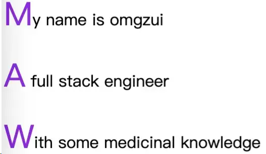
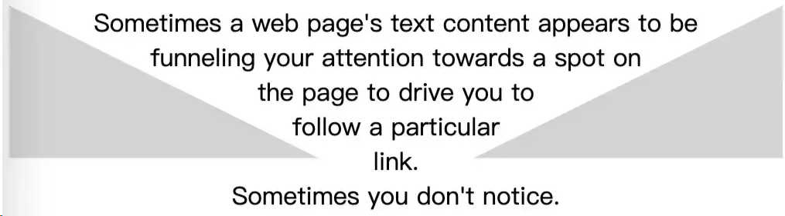
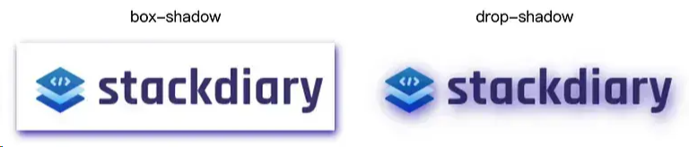

# CSS 开发技巧

灵活运用 CSS 开发技巧：<https://juejin.cn/post/6844903926110617613>

Css Sprite 精灵图：<https://www.jb51.cc/css-sprite-tutorial/1187472.html>

[纯 CSS 检测文本是否溢出 - 掘金 (juejin.cn)](https://juejin.cn/post/7347221074704777226)

## 1. First letter drop 首字母丢失



我们可以使用 `:first-letter` 来删除文本的第一个字母：

```css
p:first-letter {
	font-size: 200%;
	color: #8a2be2;
}
```

`:first-letter` 选择器用于指定元素的首字母样式，它仅适用于块级元素。效果如下:

[first-letter (codepen.io)](https://codepen.io/OMGZui/pen/oNEMVvN)

## 2. 图像文本环绕



CSS 中的 `shape-outside` 属性是一个非常有用且强大的工具，它允许设计师和开发者控制内容如何围绕一个浮动元素（通常是图像或图形）进行排列。通过定义这个属性中的形状，您可以创建更复杂和吸引人的布局，使文本环绕复杂的形状，而不仅仅是通常的矩形。

`shape-outside` 属性定义了内容将围绕其排列的形状。它通常与 float 属性一起使用，因为只有浮动的元素才会有内容围绕它。

**可用的值:**

1. none: 默认值。不创建任何形状；内容围绕元素的盒子进行排列。
2. `<shape-box>`: 使用元素的边距盒、边框盒、填充盒或内容盒作为参考盒。

- margin-box
- border-box
- padding-box
- content-box

1. `<basic-shape>`: 可以定义一个基本的形状，例如：

- circle()
- ellipse()
- inset()
- polygon()

1. `<image>`: 一个图像可以用作形状的参考。图像的 alpha 通道决定了形状的尺寸。

#### 举例

使用椭圆:

```css
.element {
	float: left;
	shape-outside: ellipse(50% 50% at 50% 50%);
}
```

使用多边形:

```css
.element {
	float: left;
	shape-outside: polygon(0% 0%, 100% 0%, 50% 100%);
}
```

使用图像:

```css
.element {
	float: left;
	shape-outside: url("path-to-image.png");
}
```

#### 实际应用

假设你有一个圆形图像，您希望文本围绕它排列，同时尊重圆的边界。没有 shape-outside，文本只会围绕图像的矩形边界盒子进行排列。但使用 `shape-outside`，可以使文本平滑地围绕圆形图像进行排列，从而得到更加视觉上吸引人的布局。

整合地址：[shape-outside (codepen.io)](https://codepen.io/OMGZui/pen/JjpBzGP)

## 3. 使用 `:where()` 简化代码

当将同一样式应用于多个元素时，CSS 可能会像这样：

```css
.page div,
.paget .title,
.page #article {
	color: red;
}
```

这段代码看起来并不是很易读，而 `:where()` 伪类就派上了用场。 `:where()` 伪类函数接受一个选择器列表作为其参数，并将选择所有可以由选择器列表中的任何规则选择的元素。

```css
.page :where(div, .title, #article) {
	color: red;
}
```

## 4. 透明图像的阴影



你是否曾尝试在透明图像上添加 box-shadow ，结果却看起来像是你添加了边框？我想我们都有过这样的经历。为透明图像添加阴影效果的解决方案是使用 `drop-shadow` 。

它的工作方式是， `drop-shadow` 属性遵循给定图像的`alpha`通道。因此，阴影是基于图像内部的形状，而不是显示在其外部。

事例地址：[shadow (codepen.io)](https://codepen.io/OMGZui/pen/bGLjJNO)

## 5. 文字的打字效果

网页设计正在以每分钟的速度变得更富创意。借助 CSS 动画功能，您可以让您的网页充满生机。在这个例子中，我们使用动画和`@keyframes`属性来实现打字机效果。

具体来说，对于这个演示，我们实现了 `steps()` 属性来分割我们的文本动画。首先，你需要指定 `steps()` 的数量，就我们的情况来说，这是我们希望进行动画处理的文本的字符长度。

其次，我们使用 `@keyframes` 来声明动画何时开始。例如，如果你在“文字打字效果”后面写了另一个词，除非你改变 CSS 片段中的 steps() 数量，否则动画将无法工作。

也就是说，这种效果并不是特别新颖。然而，尽管可以通过使用 CSS 达到同样的效果，但大多数开发者仍然会选择使用 JavaScript 库。

事例地址：[Typing Effect (codepen.io)](https://codepen.io/OMGZui/pen/MWQBxqd)

## 6. 设置自定义光标

你可能永远不需要强制让你的访客使用独特的光标。至少，对于一般的用户体验目的来说是这样。然而，关于 `cursor` 属性的一点值得注意的是，它允许你展示图片。这相当于以照片格式展示工具提示。

一些使用场景包括能够比较两张不同的照片，而无需在视口中渲染这些照片。例如，可以使用光标属性来节省设计中的空间。由于你可以将自定义光标锁定到特定的 `div`元素上，所以它不会干扰到元素之外的其他元素。

事例地址：[cursor (codepen.io)](https://codepen.io/OMGZui/pen/abqjMXd)

## 7. 纯 CSS 的清单

正如我在文章开头提到的，CSS 正在稳步发展。而这个动态清单的演示就是一个很好的例证。

它的工作方式是我们将复选框输入类型与 `:checked` 伪类一起使用。并使用 transform 属性在 `:checked` 规范返回真值时更改状态。

使用这种方法可以实现各种各样的目标。例如，当用户点击特定的复选框时，切换隐藏的内容。它适用于单选和复选框等输入类型，但也可以应用于`<option>`和`<select>`元素。

事例地址：[checklist (codepen.io)](https://codepen.io/OMGZui/pen/yLvqwZW)

### 1. 自定义光标（cursor）

首先来看一下`CSS`的内置光标样式。平时开发中用到的基本上就是`default`、`pointer`、`not-allowed`、`move`这几个。其实内置的光标样式还有很多，大家可以把鼠标放到下面的颜色块上体验一下。

自定义光标也很简单，只需要通过`cursor: url(xxx)`引入一张图片即可。有时候我们下载的`chrome`主题会改变光标的样式，用的就是这个方法。

[鼠标光标样式 - 码上掘金 (juejin.cn)](https://code.juejin.cn/pen/7187210955057528888)

### 2. 自定义 placeholder 样式（::placeholder）

如果一个输入框是必填的，如果没有输入具体值，在失焦的情况下一般都会标红提示。这时候也可以把`placeholder`变成红色的达到更加醒目的效果。

[自定义 placeholder 字体颜色 - 码上掘金 (juejin.cn)](https://code.juejin.cn/pen/7187211344746119200)

### 3. 自定义选中样式（::selection）

有时候我们看到网页的文字选中会有特殊的样式，就是通过`::selection`这个伪元素来实现的。

`::selection`伪元素用来应用于文档中被用户高亮的部分。在使用这个伪元素时，有一点需要注意，只有以下这些`CSS`属性可以用于`::selection` 选择器：

- [`color`](https://link.juejin.cn/?target=https%3A%2F%2Fdeveloper.mozilla.org%2Fzh-CN%2Fdocs%2FWeb%2FCSS%2Fcolor)
- [`background-color`](https://link.juejin.cn/?target=https%3A%2F%2Fdeveloper.mozilla.org%2Fzh-CN%2Fdocs%2FWeb%2FCSS%2Fbackground-color)
- [`cursor`](https://link.juejin.cn/?target=https%3A%2F%2Fdeveloper.mozilla.org%2Fzh-CN%2Fdocs%2FWeb%2FCSS%2Fcursor)
- [`caret-color`](https://link.juejin.cn/?target=https%3A%2F%2Fdeveloper.mozilla.org%2Fzh-CN%2Fdocs%2FWeb%2FCSS%2Fcaret-color)
- [`outline`](https://link.juejin.cn/?target=https%3A%2F%2Fdeveloper.mozilla.org%2Fzh-CN%2Fdocs%2FWeb%2FCSS%2Foutline)
- [`text-decoration`](https://link.juejin.cn/?target=https%3A%2F%2Fdeveloper.mozilla.org%2Fzh-CN%2Fdocs%2FWeb%2FCSS%2Ftext-decoration)
- [`text-emphasis-color` (en-US)](https://link.juejin.cn/?target=https%3A%2F%2Fdeveloper.mozilla.org%2Fen-US%2Fdocs%2FWeb%2FCSS%2Ftext-emphasis-color)
- [`text-shadow`](https://link.juejin.cn/?target=https%3A%2F%2Fdeveloper.mozilla.org%2Fzh-CN%2Fdocs%2FWeb%2FCSS%2Ftext-shadow)

[选中文字背景变色 - 码上掘金 (juejin.cn)](https://code.juejin.cn/pen/7187212680875704377)

### 4. 禁止用户选择 & 可以整段选择（user-select）

有些网站会禁止用户选中内容进行复制，在 CSS 层面可以通过`user-select: none`来实现。

`user-select`属性用来控制用户能否选中文本。它可以接收的参数还有`auto`、`text`、`contain`、`all`等。

当为`all`时，当点击子元素或者上下文时，包含该子元素的最顶层元素也会被选中。有了这个属性，我们在复制整篇内容时，不用先选中然后通过拖动滚动条来实现复制大段的内容了，可以通过先找到想要复制的元素的根元素，然后给它加上`user-select: all`的属性，就可以轻松的点击一下就全部选中了。

[选择整段文字的方式 - 码上掘金 (juejin.cn)](https://code.juejin.cn/pen/7187213869830373388)

### 5. 禁止鼠标事件（pointer-events）

在有些需求中，需要禁止用户点击某个区域，看起来鼠标在这个区域完全不起作用，不会响应相应的事件。这时候可以通过`pointer-events`属性来限制。

`pointer-events`属性用来指定在什么情况下某个特定的图形元素可以成为鼠标事件的`target`。把它设置成`none`即可到达效果。

[禁止鼠标点击事件 - 码上掘金 (juejin.cn)](https://code.juejin.cn/pen/7187214405023563831)

### 6. 让网站变灰（filter:grayscale）

在一些公祭日的时候，我们浏览网站通常都会发现网站整体风格都会变成灰色的。这种效果就是用`filter`这个属性实现的。

`filter`属性可以将模糊或颜色偏移等图形效果应用于元素，可以接收的函数包括：

- [`blur()`](https://link.juejin.cn?target=https%3A%2F%2Fdeveloper.mozilla.org%2Fen-US%2Fdocs%2FWeb%2FCSS%2Ffilter-function%2Fblur)、
- [`brightness()`](https://link.juejin.cn?target=https%3A%2F%2Fdeveloper.mozilla.org%2Fen-US%2Fdocs%2FWeb%2FCSS%2Ffilter-function%2Fbrightness)
- [`contrast()`](https://link.juejin.cn?target=https%3A%2F%2Fdeveloper.mozilla.org%2Fen-US%2Fdocs%2FWeb%2FCSS%2Ffilter-function%2Fcontrast)
- [`grayscale()`](https://link.juejin.cn?target=https%3A%2F%2Fdeveloper.mozilla.org%2Fen-US%2Fdocs%2FWeb%2FCSS%2Ffilter-function%2Fgrayscale)
- [`hue-rotate()`](https://link.juejin.cn?target=https%3A%2F%2Fdeveloper.mozilla.org%2Fen-US%2Fdocs%2FWeb%2FCSS%2Ffilter-function%2Fhue-rotate)
- [`invert()`](https://link.juejin.cn?target=https%3A%2F%2Fdeveloper.mozilla.org%2Fen-US%2Fdocs%2FWeb%2FCSS%2Ffilter-function%2Finvert)
- [`opacity()`](https://link.juejin.cn?target=https%3A%2F%2Fdeveloper.mozilla.org%2Fen-US%2Fdocs%2FWeb%2FCSS%2Ffilter-function%2Fopacity)
- [`saturate()`](https://link.juejin.cn?target=https%3A%2F%2Fdeveloper.mozilla.org%2Fen-US%2Fdocs%2FWeb%2FCSS%2Ffilter-function%2Fsaturate)
- [`sepia()`](https://link.juejin.cn?target=https%3A%2F%2Fdeveloper.mozilla.org%2Fen-US%2Fdocs%2FWeb%2FCSS%2Ffilter-function%2Fsepia)
- [`drop-shadow()`](https://link.juejin.cn?target=https%3A%2F%2Fdeveloper.mozilla.org%2Fen-US%2Fdocs%2FWeb%2FCSS%2Ffilter-function%2Fdrop-shadow)

其中`grayscale(）`函数的作用就是将图片转换成灰度，可以接收数字或者百分比参数。0 代表不做处理，1 代表完全变成灰度。两者之间的数值通过线性插值来生成具体的灰度值。不传参默认为 1。所以我们用`filter:grayscale()`一行代码就可以实现让网站变灰的效果。

[前端页面一键置黑 - 码上掘金 (juejin.cn)](https://code.juejin.cn/pen/7187214942305517600)

### 7. 多行文本截断展示省略号(-webkit-line-clamp)

单行文本截断展示省略号的方法估计大家已经应用的很是得心应手了。

```css
white-space: nowrap;
overflow: hidden;
text-overflow: ellipsis;
```

多行文本省略号用到：`-webkit-line-clamp`，`-webkit-line-clamp`属性可以把块容器中的内容限制为指定的行数。它只有在`display`属性设置成`-webkit-box`或者`-webkit-inline-box`并且`-webkit-box-orient`属性设置成`vertical`时才有效果。再配合上`overflow: hidden`和`text-overflow: ellipsis`就可以实现多行文本截断展示省略号的效果了。

[多行显示省略号 - 码上掘金 (juejin.cn)](https://code.juejin.cn/pen/7187217068771508257)

### 8. 实现镜像、倒影等效果（-webkit-box-reflect）

`-webkit-box-reflect`这个属性可以在不同方向反射元素的内容。有了这个属性，我们就可以实现一些神奇的效果，比如镜像、倒影等。

[图片镜像及倒影 - 码上掘金 (juejin.cn)](https://code.juejin.cn/pen/7187217522876219448)
