# CSS 新特性

[检测 CSS 中的 JavaScript 支持 (ryanmulligan.dev)](https://ryanmulligan.dev/blog/detect-js-support-in-css/)

[您需要了解的现代 CSS 知识（2024 年春季版）– Frontend Masters Boost](https://frontendmasters.com/blog/what-you-need-to-know-about-modern-css-spring-2024-edition/)

[使用样式查询为您的 CSS 变量添加超能力 |那个 HTML 博客 (thathtml.blog)](https://thathtml.blog/2024/03/superpowered-container-style-queries/)

[现代 CSS 解决方案 --- Modern CSS Solutions](https://moderncss.dev/)

[Google I/O 2022 CSS Part 全览 (qq.com)](https://mp.weixin.qq.com/s?__biz=MzkxNzYyNzE2NA==&mid=2247494048&idx=1&sn=eb2471eb8881160a944721f3dc617668&source=41#wechat_redirect)

专栏：[CSS 之美 - 程普的专栏 - 掘金 (juejin.cn)](https://juejin.cn/column/7303816445040721983)

新的特性，最近发表的特性，对于旧版本的浏览器或者部分浏览器不支持，或者不兼容，酌情使用

HTML+CSS+JavaScript 兼容性查询网站：[Can I use... Support tables for HTML5, CSS3, etc](https://caniuse.com/ciu/about)

可以快速可视化哪些前端技术与哪些浏览器兼容

直接从 CanIUse 网站查看支持表外，还有一个为喜欢命令行工具的用户提供的选项。这个设置非常简单。首先，您需要确保安装了 Node.js，它是 npm 预打包的。要检查是否已经安装了 npm，只需在 CLI 中运行 npm -v。

```shell
npm install -g caniuse-cmd
caniuse preload
```


还有许多选项可以根据个人喜好和所需的信息来使用。这些内容包括:

—short， -s short 输出:一行显示浏览器，不显示注释或描述[显示多个结果时默认](布尔值)

—long， -l long 输出:显示更多信息[显示单个结果时的默认值](布尔值)

—oneline， -1 单行输出:只有全局百分比，没有每个浏览器的信息

---

**CSS** 的**2019-2022 年**的新特性发展状态报告：

[The State of CSS 2019](https://2019.stateofcss.com/tw/)

[The State of CSS 2020](https://2020.stateofcss.com/zh-Hans/)

[The State of CSS 2021](https://2021.stateofcss.com/zh-Hans/)

[The State of CSS 2022](https://2022.stateofcss.com/en-US/)

---

CSS 新特性文章参考：

2017：

- [2017 年值得学习的 3 个 CSS 新特性 - 掘金 (juejin.cn)](https://juejin.cn/post/6844903480100913166)

- [css3 新特性汇总 - 掘金 (juejin.cn)](https://juejin.cn/post/6844903518931795982)

2019：

- [CSS3 和 HTML5 新特性一览 - 掘金 (juejin.cn)](https://juejin.cn/post/6844903829679390728)

- [2019 年这 1 年多学到的 CSS 新特性 | 掘金年度征文 - 掘金 (juejin.cn)](https://juejin.cn/post/6844904033149255688)

- [CSS3 新特性 - 掘金 (juejin.cn)](https://juejin.cn/post/6844904033870675981)

2020：

- [2020 不容错过！24 个 CSS 新特性来了 - 知乎 (zhihu.com)](https://zhuanlan.zhihu.com/p/267066908)

2021：

- [详解 16 个 CSS 新特性（2021 最新版-下）](https://blog.csdn.net/Taobaojishu/article/details/120574222)

- [超详|2020 年你不应该错过的 CSS 新特性 - 掘金 (juejin.cn)](https://juejin.cn/post/6886258269137043464)

- [一起了解一下 css 新特性@property - 掘金 (juejin.cn)](https://juejin.cn/post/7007336931092594701)

- [5 个你已经可以尝试的 css 新特性 (gxlsystem.com)](https://www.gxlsystem.com/qianduan-8992.html)

- [CSS 新特性 contain，控制页面的重绘与重排 - 掘金 (juejin.cn)](https://juejin.cn/post/6958990366888607757)

- [2021 年你可能不知道的 CSS 特性（下篇） - 掘金 (juejin.cn)](https://juejin.cn/post/6978647140910727176)

2022：

- [2022 年你不知道的 CSS 新特性\_wei 佳的博客-CSDN 博客\_css 2022 新特性](https://blog.csdn.net/weixin_47426048/article/details/125594552)

- [2022 年 CSS 的 6 个新特性，赶快来了解一下（看过就会的那种） - 掘金 (juejin.cn)](https://juejin.cn/post/7108549853969383455)

- [2022 年你不应该错过的 CSS 新特性 - 掘金 (juejin.cn)](https://juejin.cn/post/7073291417728057381)

- [2022 年你不知道的 CSS 新特性 - 掘金 (juejin.cn)](https://juejin.cn/post/7103409377821851662)

- [都 2022 年了，还不知道这几个 CSS 特性该 out 了 - 掘金 (juejin.cn)](https://juejin.cn/post/7118892686861402120)

- [全新的 CSS 语法，2024 新年新样式 - 掘金 (juejin.cn)](https://juejin.cn/post/7334755783751794724)

## CSS 变量

### 一、变量的声明

声明变量的时候，变量名前面要加两根连词线（`--`）。

```css
body {
	--foo: #7f583f;
	--bar: #f7efd2;
}
```

上面代码中，`body`选择器里面声明了两个变量：`--foo`和`--bar`。

它们与`color`、`font-size`等正式属性没有什么不同，只是没有默认含义。所以 CSS 变量（CSS variable）又叫做**"CSS 自定义属性"**（CSS custom properties）。因为变量与自定义的 CSS 属性其实是一回事。

你可能会问，为什么选择两根连词线（`--`）表示变量？因为`$foo`被 Sass 用掉了，`@foo`被 Less 用掉了。为了不产生冲突，官方的 CSS 变量就改用两根连词线了。

各种值都可以放入 CSS 变量。

```css
:root {
	--main-color: #4d4e53;
	--main-bg: rgb(255, 255, 255);
	--logo-border-color: rebeccapurple;

	--header-height: 68px;
	--content-padding: 10px 20px;

	--base-line-height: 1.428571429;
	--transition-duration: 0.35s;
	--external-link: "external link";
	--margin-top: calc(2vh + 20px);
}
```

变量名大小写敏感，`--header-color`和`--Header-Color`是两个不同变量。

### 二、var() 函数

`var()`函数用于读取变量。

```css
a {
	color: var(--foo);
	text-decoration-color: var(--bar);
}
```

`var()`函数还可以使用第二个参数，表示变量的默认值。如果该变量不存在，就会使用这个默认值。

```css
color: var(--foo, #7f583f);
```

第二个参数不处理内部的逗号或空格，都视作参数的一部分。

```css
var(--font-stack, "Roboto", "Helvetica");
var(--pad, 10px 15px 20px);
```

`var()`函数还可以用在变量的声明。

```css
:root {
	--primary-color: red;
	--logo-text: var(--primary-color);
}
```

注意，变量值只能用作属性值，不能用作属性名。

```css
.foo {
	--side: margin-top;
	/* 无效 */
	var(--side): 20px;
}
```

上面代码中，变量`--side`用作属性名，这是无效的。

### 三、变量值的类型

如果变量值是一个字符串，可以与其他字符串拼接。

```css
--bar: "hello";
--foo: var(--bar) " world";
```

利用这一点，可以 debug（[例子](https://codepen.io/malyw/pen/oBWMOY)）。

```css
body:after {
	content: "--screen-category : " var(--screen-category);
}
```

如果变量值是数值，不能与数值单位直接连用。

```css
.foo {
	--gap: 20;
	/* 无效 */
	margin-top: var(--gap) px;
}
```

上面代码中，数值与单位直接写在一起，这是无效的。必须使用`calc()`函数，将它们连接。

```css
.foo {
	--gap: 20;
	margin-top: calc(var(--gap) * 1px);
}
```

如果变量值带有单位，就不能写成字符串。

```css
/* 无效 */
.foo {
	--foo: "20px";
	font-size: var(--foo);
}

/* 有效 */
.foo {
	--foo: 20px;
	font-size: var(--foo);
}
```

### 四、作用域

同一个 CSS 变量，可以在多个选择器内声明。读取的时候，优先级最高的声明生效。这与 CSS 的"层叠"（cascade）规则是一致的。

下面是一个[例子](http://jsbin.com/buwahixoqo/edit?html,css,output)。

```html
<style>
	:root {
		--color: blue;
	}
	div {
		--color: green;
	}
	#alert {
		--color: red;
	}
	* {
		color: var(--color);
	}
</style>

<p>蓝色</p>
<div>绿色</div>
<div id="alert">红色</div>
```

上面代码中，三个选择器都声明了`--color`变量。不同元素读取这个变量的时候，会采用优先级最高的规则，因此三段文字的颜色是不一样的。

这就是说，变量的作用域就是它所在的选择器的有效范围。

```css
body {
	--foo: #7f583f;
}

.content {
	--bar: #f7efd2;
}
```

上面代码中，变量`--foo`的作用域是`body`选择器的生效范围，`--bar`的作用域是`.content`选择器的生效范围。

由于这个原因，全局的变量通常放在根元素`:root`里面，确保任何选择器都可以读取它们。

```css
:root {
	--main-color: #06c;
}
```

### 五、响应式布局

CSS 是动态的，页面的任何变化，都会导致采用的规则变化。

利用这个特点，可以在响应式布局的`media`命令里面声明变量，使得不同的屏幕宽度有不同的变量值。

```css
body {
	--primary: #7f583f;
	--secondary: #f7efd2;
}

a {
	color: var(--primary);
	text-decoration-color: var(--secondary);
}

@media screen and (min-width: 768px) {
	body {
		--primary: #f7efd2;
		--secondary: #7f583f;
	}
}
```

### 六、兼容性处理

对于不支持 CSS 变量的浏览器，可以采用下面的写法。

```css
a {
	color: #7f583f;
	color: var(--primary);
}
```

也可以使用`@support`命令进行检测。

```css
@supports ((--a: 0)) {
	/* supported */
}

@supports (not (--a: 0)) {
	/* not supported */
}
```

### 七、JavaScript 操作

JavaScript 也可以检测浏览器是否支持 CSS 变量。

```javascript
const isSupported =
	window.CSS && window.CSS.supports && window.CSS.supports("--a", 0);

if (isSupported) {
	/* supported */
} else {
	/* not supported */
}
```

JavaScript 操作 CSS 变量的写法如下。

```javascript
// 设置变量
document.body.style.setProperty("--primary", "#7F583F");

// 读取变量
document.body.style.getPropertyValue("--primary").trim();
// '#7F583F'

// 删除变量
document.body.style.removeProperty("--primary");
```

这意味着，JavaScript 可以将任意值存入样式表。下面是一个监听事件的例子，事件信息被存入 CSS 变量。

```javascript
const docStyle = document.documentElement.style;

document.addEventListener('mousemove', (e) ={
  docStyle.setProperty('--mouse-x', e.clientX);
  docStyle.setProperty('--mouse-y', e.clientY);
});
```

那些对 CSS 无用的信息，也可以放入 CSS 变量。

```css
--foo: if(x 5) this.width = 10;
```

上面代码中，`--foo`的值在 CSS 里面是无效语句，但是可以被 JavaScript 读取。这意味着，可以把样式设置写在 CSS 变量中，让 JavaScript 读取。

所以，CSS 变量提供了 JavaScript 与 CSS 通信的一种途径。

## CSS 属性

### :in-range 和:out-of-range 伪类

CSS 的`:in-range`和`:out-of-range`伪类用于样式化在指定范围限制内和外的输入。

#### (a) :in-range

如果输入元素的当前值在 `min` 和 `max` 属性的范围之间，那么它就处于范围内。

这个伪类可以方便地确定字段的当前值是否可接受。

#### (b) :out-of-range

如果输入元素的当前值超出了`min`和`max`属性的范围，那么它就是超出范围的。

它给用户一个视觉指示，告诉他们字段值是否超出了范围。

```css
/* in-range */
input:in-range {
	background-color: rgba(0, 255, 0, 0.25);
}
/* out-of-range */
input:out-of-range {
	background-color: rgba(255, 0, 0, 0.25);
}
```

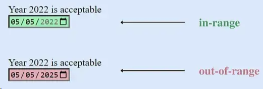

注意：这些伪类只适用于具有范围限制的元素，没有这个限制，元素就无法处于范围内或范围外。

相关文档：[:in-range - CSS: Cascading Style Sheets | MDN (mozilla.org)](https://developer.mozilla.org/en-US/docs/Web/CSS/:in-range)

### 2. grayscale() 函数 2. grayscale（）函数

如果使用`0`到`100%`之间的值，可以创建不同的效果。较低的值将保留一些颜色，而较高的值将使图像更接近黑白。

这种图像效果可以通过 CSS 的滤镜属性实现。通过将图像的`filter`属性设置为`grayscale(100%)`，可以将图像完全转换为黑白。要创建不同的效果，可以尝试不同的`grayscale`值，例如`grayscale(50%)`将使图像呈现一种半色调效果。

使用 CSS 的图像转换效果，可以通过调整值来轻松地将彩色图像转换为黑白，并实现各种不同的效果。

```css
.grayscale-image {
	filter: grayscale(100%);
}
```


### 3. 玻璃效果

我们可以使用几行代码实现一个玻璃效果。玻璃效果非常美丽，可以为我们的设计增添优雅。

[Glass.CSS](https://css.glass/)是最受欢迎的玻璃效果生成器，我们可以免费为项目创建 CSS 玻璃效果。只需要根据您的需求调整一些设置，并将 CSS 代码复制粘贴到您的项目中即可。

```css
.glass-effect {
	-webkit-backdrop-filter: blur(6.2px);
	backdrop-filter: blur(6.2px);
	background: rgba(255, 255, 255, 0.4);
	border-radius: 16px;
	border: 1px solid rgba(255, 255, 255, 0.24);
}
```

## 4.使用以下 CSS 代码来样式化文本

这些是一些每个人都应该知道的非常基本的文本样式技巧。然而，还有许多其他高级选项可供选择。

```css
p {
	font-family: Helvetica, Arial, sans-serif;
	font-size: 5rem;
	text-transform: capitalize;
	text-shadow: 2px 2px 2px pink, 1px 1px 2px pink;
	text-align: center;
	font-weight: normal;
	line-height: 1.6;
	letter-spacing: 2px;
}
```

## 5.clamp() 函数

CSS 的`clamp()`函数将一个值限制在两个上下界之间。必须有一个首选值、一个最小值和一个最大值。

当字体大小根据视口变化时，`clamp()` 会派上用场。

```css
p {
	font-size: clamp(1.8rem, 2.5vw, 2.8rem);
}
```

## 6. 居中一个 div

开发者最重要的任务之一是将一个`div`居中。有很多其他的选项可以实现 div 的居中。在这个例子中，我们使用 CSS 的`flexbox`来实现`div`的水平和垂直居中。

```css
div {
	display: flex;
	justify-content: center;
	align-items: center;
}
```

## 7. CSS 线性渐变

要创建一个渐变的 CSS 线性渐变，只需使用下面的 CSS 代码。

```css
div {
	background: linear-gradient(35deg, #ccffff, #ffcccc, rgb(204, 204, 255));
	border-radius: 20px;
	width: 70%;
	height: 400px;
	margin: 50px auto;
}
```

## 8. CSS 抖动效果

这个“摇晃”动画效果会在用户输入无效内容时晃动输入框。它简单而优雅。例如，如果用户在文本框中输入数字而不是字母，输入框将会摇晃。

```html
<input
	id="name"
	type="text"
	placeholder="Enter your name"
	pattern="[A-Za-z]*"
/>
input:invalid{ animation: shake 0.2s ease-in-out 0s 2; box-shadow: 0 0 0.4em
red; } @keyframes shake { 0% { margin-left: 0rem; } 25% { margin-left: 0.5rem; }
75% { margin-left: -0.5rem; } 100% { margin-left: 0rem; } }
```

## 9. 文本溢出

可以使用此属性来截断溢出的文本。它可以被裁剪并显示为省略号`(...)`或自定义字符串。

```css
.text {
	white-space: nowrap;
	overflow: hidden;
	text-overflow: clip;
	width: 200px;
}
div.text {
	white-space: nowrap;
	width: 200px;
	overflow: hidden;
	text-overflow: ellipsis;
	border: 1px solid #000000;
}
div.text:hover {
	overflow: visible;
}
```

## 10. 'column-count' 属性

它指定了一个元素应该被分成的列数。

```css
p {
	column-count: 2;
}
```

## 11. CSS 动画

动画逐渐改变元素的样式。只有在指定关键帧之后才能使用。关键帧描述了动画序列中特定点上动画元素的外观。

```css
div {
	width: 200px;
	height: 200px;
	background-color: blue;
	animation-name: square;
	animation-duration: 8s;
}
@keyframes square {
	from {
		background-color: blue;
	}
	to {
		background-color: black;
	}
}
```

## 12. 阴影效果

使用 CSS，我们可以为文本和元素添加效果。将属性定义为`text-shadow`和`box-shadow`。使用`text-shadow`为文本添加阴影，使用 box-shadow 为元素添加阴影。

(i) `text-shadow`: It gives the text a shadow. (i) `text-shadow`: 它给文本添加了阴影。

```css
h1 {
	color: blue;
	text-shadow: 2px 2px 4px #000000;
}
```

`box-shadow`：用于给元素添加阴影效果。下面的示例中，实际的 `div` 元素是紫色的，盒子阴影是天蓝色的，并且设置在右下方 `10` 像素处。

```css
div {
	width: 200px;
	height: 200px;
	padding: 15px;
	background-color: purple;
	box-shadow: 10px 10px skyblue;
}
```

## 13. CSS 剪裁

使用`clip-path`属性，您可以仅显示元素的一部分，同时隐藏其余部分。

```css
.bg {
	height: 100%;
	width: 100%;
	background-color: rgba(199, 62, 133, 0.9);
	clip-path: polygon(100% 0, 100% 0, 100% 51%, 0 100%, 0 90%, 0 52%, 0 51%);
	position: absolute;
}
```

## 14.CSS 背景混合模式属性

该属性描述了背景颜色和图像（或两个图像）的混合方式。一个与每个背景图像对应的混合模式列表组成了该值。混合模式指定了背景图层如何混合（颜色或图片）。

可以使用`background-blend-mode`属性创建令人惊艳的背景。

```css
div {
	width: 600px;
	height: 400px;
	background-repeat: no-repeat, repeat;
	background-position: center;
	background-image: url("flower.png"), url("background-image.png");
	background-blend-mode: color;
}
```

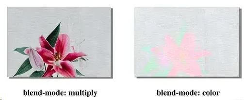

## 15. 色相旋转动画

还有其他一些选项可供选择。如果你想了解更多关于这个属性的信息，[请在 W3Schools 上查看](https://www.w3schools.com/cssref/pr_background-blend-mode.php)。

可以在网站的主要部分和按钮上添加色相旋转动画。例如，天气预报网站的主要部分将因此而变得令人惊艳。

```css
button {
	background: linear-gradient(35deg, #8c52ff, #c669ff);
	animation: hue-rotate 3s linear infinite alternate;
}
@keyframes hue-rotate {
	to {
		filter: hue-rotate(85deg);
	}
}
```

## 6 个 CSS 属性

### 1. `all`

你是否曾经使用过 CSS 框架呢？如果是的话，我可以肯定你有好几次都想要根据自己的喜好覆盖某些元素的样式定义。

最常用的方法是使用 CSS 中的 `!important` 属性来强调当前属性，而忽略所有其他设置和规则。

```
.header {
    color: blue !important;
    font-size: 14px !important;
}
```

但是，重复书写相同的关键字会让 CSS 文件看起来很混乱。

而一个更简单的覆盖样式定义的方法，是使用 `all` 属性。

`all` 共有 3 个可用的属性值 —— `initial`、`inherit` 和 `unset`。

```
.header {
    all: initial;
    color: blue;
    font-size: 14px;
}
```

`all: initial` 会将元素的所有属性设置为回退值或初始值。

从 Chrome 版本 37 和 Firefox 版本 27 开始它们都支持了这个属性。Edge 浏览器也支持此属性，但 IE 并不支持。

### 2. `writing-mode`

我最近写过一篇有关寻找设计灵感的神奇地方的文章，里面列举的网站和我偶然发现的许多站点中，文本都是在一侧竖直排列的。

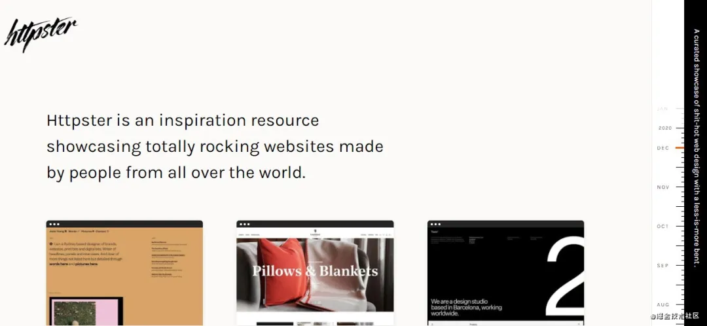来源：httpster

在上图的右侧（滚动条附近），我们可以看到侧边竖直排列的文本，而这恰好就是一种显示附加信息的巧妙方法。

`writing-mode` 属性可以让我们实现这个效果。

该属性支持以下值：

- `sideways-rl`：文本和其他内容从上到下垂直排列，并向右横向放置。
- `sideways-lr`：和 `sideways-rl` 一样，文本和其他内容从上到下垂直排列，但向左倾斜。
- `vertical-rl`：文本和其他内容从上到下垂直排列，从右到左水平排列。如果有两行或更多行，则这些行会被**放置在前一行的左侧**。
- `vertical-lr`：与 `vertical-rl` 不同，水平地将文本从左到右排列，并且如果有两行或更多行，则这些行会被放置在前一行的右侧。

`horizontal-tb` 属性则实现默认排列文本的效果。

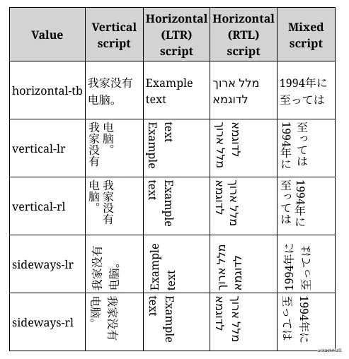来源：MDN Web 文档

你可以在这里找到相关实现和代码块。

### 3. `background-clip`

这是一个有趣的属性，它让我们可以为元素的背景设置自定义图形。

我们的自定义图形可以延伸到元素的边框，内边距盒或内容盒。

以下是此属性的简短实现：

HTML：

```
<p class="border-box">背景延伸到边框。</p>
<p class="padding-box">背景延伸到边框的内部边缘。</p>
<p class="content-box">背景仅延伸到内容盒的边缘。</p>
<p class="text">背景被裁剪为前景文本。</p>
```

CSS：

```
p {
    border: .8em darkviolet;
    border-style: dotted double;
    margin: 1em 0;
    padding: 1.4em;
    background: linear-gradient(60deg, red, yellow, red, yellow, red);
    font: 900 1.2em sans-serif;
    text-decoration: underline;
}

.border-box {
    background-clip: border-box;
}

.padding-box {
    background-clip: padding-box;
}

.content-box {
    background-clip: content-box;
}

.text {
    background-clip: text;
    -webkit-background-clip: text;
    color: rgba(0, 0, 0, .2);
}
```

效果：

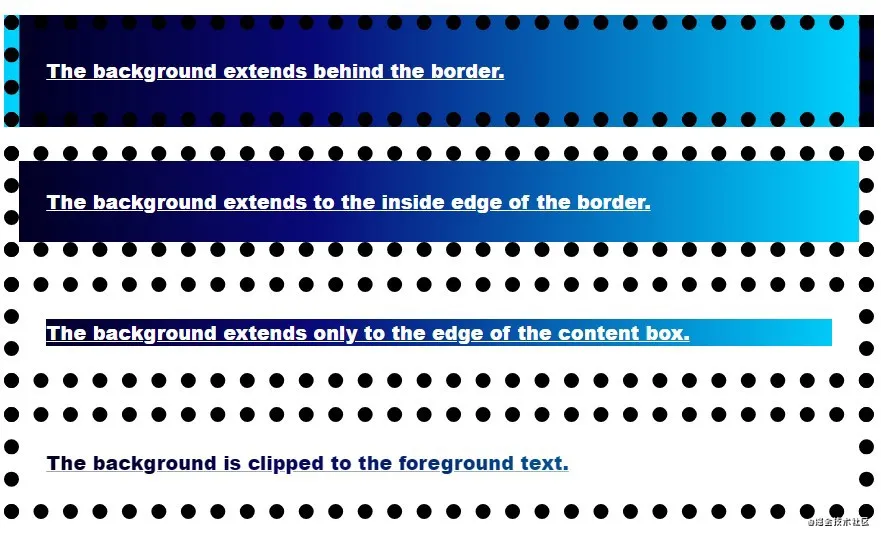图源作者

我们也可以使用自定义图片作为文本的背景：

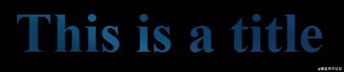图源作者

值得注意的是，在 Chrome 上我们需要使用 `-webkit-background-clip` 属性，并确保文本颜色设置为透明。

### 4. `user-select`

如果我们的网站上有着一些不想让用户复制的文本，我们可以使用此属性。

`user-select` 属性指定是否可以选择元素的文本。

这对除文本框之外的内容没有任何影响。

```
.row-of-icons {
    -webkit-user-select: none; /* Chrome & Safari all */
    -moz-user-select: none; /* Firefox all */
    -ms-user-select: none; /* IE 10+ */
    user-select: none;
}
```

此属性也可用于确保选择了整个元素。

```
.force-select {
    user-select: all;
    -webkit-user-select: all; /* Chrome 49+ */
    -moz-user-select: all; /* Firefox 43+ */

}
```

你可以在这里找到完整的说明。

### 5. `white-space`

在使用 `text-overflow` 的时候，该属性非常有用，因为它允许我们控制元素的文本流。

它接受 `nowrap`、`pre`、`pre-wrap`、`pre-line` 和 `normal` 作为属性值。

`nowrap` 可防止文本环绕在元素的宽度和高度内，并使其溢出。

`pre` 值强制浏览器渲染代码中默认会去除的换行符和空格。`pre-wrap` 值和 `pre` 值作用相同，但是它不会让文本溢出元素。

`pre-line` 属性会在代码中相应的地方换行，但是不会显示多余的空格。

通过以下示例可以清楚地看出它们的区别：

HTML:

```
<div>
    <p class='zero'>

        Some text
    </p>

    <p class='first'>

        Some text
    </p>
    <p class='second'>
        Some text
    </p>
    <p class='third'>
        Some text
    </p>
    <p class='fourth'>
        Some text
    </p>
</div>
```

CSS:

```
div {
    width: 100px;
}

p {
    background: red;
    font-size: 2rem;
}

.first {
    white-space: nowrap;
}

.second {
    white-space: pre;
}

.third {
    white-space: pre-line;
}

.fourth {
    white-space: nowrap;
    text-overflow: ellipsis;
    overflow: hidden;
}
```

效果:

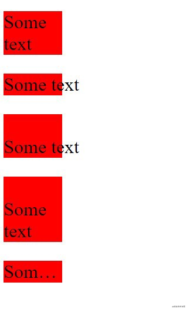图源作者

### 6. `border-image`

此属性非常适合设计我们的网站，我们可以使用此属性在元素周围创建漂亮的边框 —— `border-image` 允许你将自定义图像设置为边框。

下面的图像就展示了这个属性的应用：

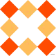图源: MDN 网站

HTML 和 CSS 代码如下：

```
<body>
<h1>This is a title</h1>
</body>
h1 {
    border: 10px solid transparent;
    padding: 15px;
    border-image: url(border.png) 20% round;
}
```

效果:

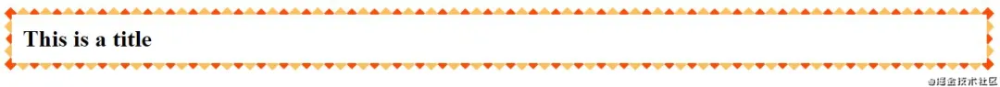图源作者

此属性可用于创建精美卡片或强调部分文本。

### 最后的想法

前端开发者们除了使用 JavaScript 之外，还同时使用着 CSS 和 HTML。了解更多的 CSS 属性知识，能够帮助我们更快、更好地构建 Web 应用程序。

尽管我分享了一些较少被人们所提及的 CSS 属性，但这样的属性还有很多。

虽然 CSS 已有 20 多年的历史了，但它仍然具有许多奇技淫巧。

知道这些 CSS 属性可以实现具有艺术气息的网站。

## CSS 整洁之道——:is()、:where()和:has()的用法

让我们写出优雅界面的 CSS，它也总是把自己进化得更加优雅。

今天我们花 5 分钟时间学习三个优雅的 CSS 伪类：**`:is()`**、**`:where()`** 和 **`:has()`**。

### `:is()` - 取代组合选择器

**`:is()`** 允许你在一个规则中包含多个选择器。它接受一组选择器作为参数，并应用样式到匹配的元素上。

```css
/* 传统方法 */
ul > li > a,
ol > li > a,
nav > ul > li > a,
nav > ol > li > a {
	color: blue;
}

/* 使用 :is() */
:is(ul, ol, nav > ul, nav > ol) > li > a {
	color: blue;
}
```

**`:is()`** 可以简化多层嵌套和多种选择器组合的写法，让你维护样式更方便。

**`:is()`** 优先级依然遵循 CSS 选择器的优先级规则，即 `ID -> 类 -> 元素` 的顺序。

```css
:is(.class1) a {
	color: blue;
}

:is(#id1) a {
	color: red;
}
```

这段代码里两条规则如果命中相同的元素，那么第二条会优先应用。

**`:is()`** 的参数也可以传一个匹配规则

```css
:is([class^="is-styling"]) a {
	color: yellow;
}
```

这样的写法会匹配所有 **`class`** 开头是 **`is-styling`** 的选择器。

### `:where()` - 拥有最低优先级

**`:where()`** 和 **:is()** 相似，都可以传入选择器或者匹配规则来简化你的 CSS 代码。

```css
:where([class^="where-styling"]) a {
	color: yellow;
}
```

但和 **:is()** 不同的是，**`:where()`** 拥有最低优先级，这样的好处是它定义的样式规则不会影响其他样式规则，避免了样式冲突。

```css
/* <footer class="where-styling">……</footer> */

footer a {
	color: green;
}

:where([class^="where-styling"]) a {
	color: red;
}
```

当有其他规则和 **`:where()`** 同时被命中时，**`:where()`** 一定是失效的。所以上面这个例子实际效果是链接显示绿色。

### `:has()` - 基于其他元素进行匹配

**`:has()`** 可以根据直接后代元素的存在来匹配元素

```css
/* 选择直接包含 p 元素的 div */
div:has(> p) {
	border: 1px solid black;
}
```

也可以根据紧邻的下一个兄弟元素来匹配元素

```css
/* 选择后面跟着 p 元素的 div */
div:has(+ p) {
	border: 1px solid black;
}
```

你还可以把它跟其他伪类一起使用，比如 **`:has()`** 和 **`:is()`** 一起使用

[:has()和:is()一起使用 - 码上掘金 (juejin.cn)](https://code.juejin.cn/pen/7314946185520201763)

**`:has()`** 使用场景很多，只要是强互动的页面都可能用到，以后有机会单独分享一篇～

### 总结

大部分浏览器的新版本都已支持 **`:is()`**、 **`:where()`** 和 **`:has()`** 这三个伪类了，如果你的项目跑在低版本的浏览器中，那么需要考虑一下回退策略。

## 2023 年的 CSS

[CSS 封装：2023 年！ | Blog | Chrome for Developers](https://developer.chrome.com/blog/css-wrapped-2023?hl=zh-cn)

### 众望所归的 CSS 嵌套和 CSS 父选择器正式落地

今年除了 JavaScript 以外，CSS 也同样迎来了一系列新特性，这些特性不仅增强了样式和布局的能力，还提升了开发者的效率和用户体验。下面笔者仅介绍个人认为比较重要的两个 CSS 新特性，具体更多新特性的详情可以参考文章：[【第 3144 期】2023 年 CSS 新特性盘点](https://mp.weixin.qq.com/s?__biz=MjM5MTA1MjAxMQ==&mid=2651268063&idx=1&sn=275d824d73102d0dbf743efb8ce126cd&chksm=bd48fa5b8a3f734da9e0f87e75530cf0e06b865fbab4a2f81cc8127387f67fabc635df3110a4&scene=21#wechat_redirect)

### 1、原生 CSS 支持嵌套

CSS 支持嵌套一直是 Sass 中最受开发者喜爱的功能点之一，它允许让开发者在编写样式的时候更加整洁、内聚。据上一年 State of CSS 统计，CSS 嵌套是受访者认为 CSS 最需要补充的功能之一。

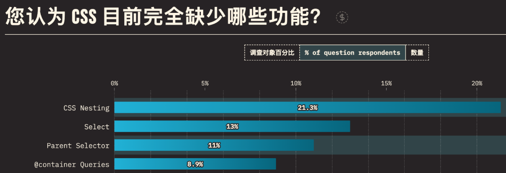

（图选自 https://2023.stateofcss.com/zh-Hans/usage/#what_do_you_use_css_for）

而在今年 CSS 2023 新特性中，原生 CSS 正式支持嵌套写法，在高版本浏览器中，无需依赖额外的编译器即可享受 Sass 嵌套语法，很大程度上优化了开发者体验，提高了 CSS 的可读性和可维护性。

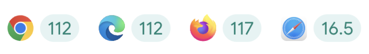（图选自[【第 3144 期】2023 年 CSS 新特性盘点](https://mp.weixin.qq.com/s?__biz=MjM5MTA1MjAxMQ==&mid=2651268063&idx=1&sn=275d824d73102d0dbf743efb8ce126cd&chksm=bd48fa5b8a3f734da9e0f87e75530cf0e06b865fbab4a2f81cc8127387f67fabc635df3110a4&scene=21#wechat_redirect)）

### 2、各大浏览器正式支持 CSS 父选择器

除了 CSS 嵌套外，父选择器也是受访者认为 CSS 最需要补充的功能之一。简单来说，CSS 父选择器的作用能通过子元素选中其父元素。既然是万众期待且如此实用的选择器，为什么各大浏览器迟迟没有支持呢？

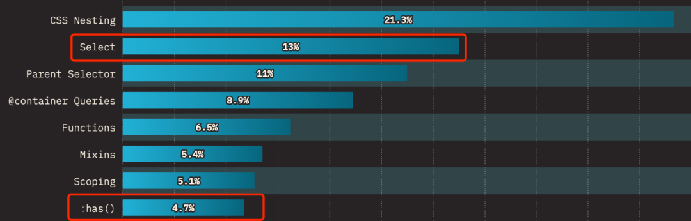

（图选自 https://2023.stateofcss.com/zh-Hans/usage/#what_do_you_use_css_for）

笔者总结答案主要是以下两个原因：

1. 浏览器的渲染模式是以流的方式，一个元素接一个元素进入。因此当一个元素在浏览器渲染出来时，其父元素的样式计算已经完成并且也已经渲染好了。在此之后，通过子元素选择父元素并应用样式触发重绘时，需要对父元素和子元素都进行重新绘制，这样的计算对于当时的渲染引擎而言是昂贵的。
2. 与其他选择器而言，父选择器触发重绘的性能开销很大，如果有一个父选择器，那将很容易成为低效率选择器中的新老大。

近几年浏览器的渲染引擎有了很大的改进，目前浏览器可以有效地确定哪些需要渲染或更新，而哪些不需要。因此在今年众望所归的父选择器 :has 也正式被各大浏览器所支持。

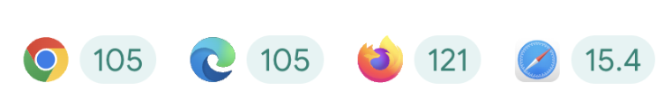

（图选自[【第 3144 期】2023 年 CSS 新特性盘点](https://mp.weixin.qq.com/s?__biz=MjM5MTA1MjAxMQ==&mid=2651268063&idx=1&sn=275d824d73102d0dbf743efb8ce126cd&chksm=bd48fa5b8a3f734da9e0f87e75530cf0e06b865fbab4a2f81cc8127387f67fabc635df3110a4&scene=21#wechat_redirect)）

参考内容：

CSS 的父选择器:has()：https://www.w3cplus.com/css/css-parent-selector.html

CSS 原生嵌套语法来了！ - 知乎：https://zhuanlan.zhihu.com/p/603168988
