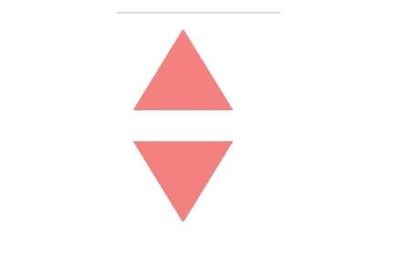

# CSS 画图例子

[终极 CSS 形状集合 (css-shape.com)](https://css-shape.com/)

## 不同样式 tooltip 对话框小三角的 css 实现

开发过程中已经遇到过好多次需要手动实现 `tooltip` 样式了，这里就总结下，以便未来更好的复制粘贴。


如上图，常见的 `tooltip` 总共有 `3` 种类型，纯背景色无边框、有边框、包含背景图，其中的小三角可能是纯色、尖尖有弧度。

下边介绍四种常用的方法来实现 `tooltip`。

### 贴图

简单方便快捷，一个三角形的图定下位即可。在女朋友的帮助下，用 `AI` 成功画了三种三角形。


下边我们只需要把三角形贴到矩形下边即可。

- 纯背景色三角形

  ```
  .wxml
  <view class="tooltip">
        <view class="tooltip-text">我是一句提示内容</view>
        <image class="tooltip-triangle" src="https://windliangblog.oss-cn-beijing.aliyuncs.com/tooltip-01.png" />
  </view>

  .wxss
  .tooltip {
    width: 400rpx;
    margin: 100rpx;
    position: relative;
  }

  .tooltip-text {
    height: 60rpx;
    line-height: 60rpx;
    background: #F5F8FF;
    color: #494949;
    border-radius: 5rpx;
    padding: 0 20rpx;
  }

  .tooltip-triangle {
    position: absolute;
    width: 30rpx;
    height: 30rpx;
    top: 60rpx;
    left: 200rpx;
  }
  ```

  

- 带边框的三角形和三角形圆角

  ```
  .wxml
  <view class="tooltip">
        <view class="tooltip-text">我是一句提示内容</view>
        <image class="tooltip-triangle" src="https://windliangblog.oss-cn-beijing.aliyuncs.com/tooltip-02.png" />
  </view>

  .wxss
  .tooltip {
  width: 400rpx;
  margin: 100rpx;
  position: relative;
  }

  .tooltip-text {
  height: 60rpx;
  line-height: 60rpx;
  background: #f5f8ff;
  color: #494949;
  border-radius: 5rpx;
  padding: 0 20rpx;
  border: 2px solid #002fa7;
  }

  .tooltip-triangle {
  position: absolute;
  width: 30rpx;
  height: 30rpx;
  top: 62rpx;
  left: 200rpx;
  }
  ```

  

  发现原有的 `border` 没有盖住，然后从重新做了一张上边延伸背景色的图。

  

  

  圆角的三角同理，换下 `image` 的 `src` 即可。

  

### 利用 border

不知道是谁第一个想到的这种方案，是真的很神奇。我们经常写 `border` ，可有没有想过它的四个角的连接处是什么样的？


让我们将连接处放大：


会发现每条边其实是一个梯形，然后互相接起来。那么如果 `border` 中内容的宽高都是 `0` 会怎么样呢？


```
.border {
  border-width: 4px;
  border-color: #F00 #0F0 #00F #0FF;
  border-style: solid;
  width: 0px;
  height: 0px;
}
```


三角形出现了！我们只需要将左边下边右边的 `border` 颜色设置为透明就是我们要的三角形了,`border-color: #F00 transparent transparent transparent;`

此外，虽然底部 `boder` 设置为透明了，但是还占据高度，我们可以将它的 `width` 设为 `0`：`border-bottom-width: 0`。


然后我们只需要将之前使用的图片替换掉即可。

```
.wxml
<view class="tooltip">
        <view class="tooltip-text">我是一句提示内容</view>
        <view class="tooltip-triangle"></view>
</view>

.wxss
.tooltip {
    max-width: 400rpx;
    margin-left: 20rpx;
    position: relative;
}
.tooltip-text {
    padding: 15rpx;
    background: #002FA7;
    color: #fff;
    border-radius: 5rpx;
}

.tooltip-triangle {
    position: absolute;
    top: 62rpx;
    left: 200rpx;
    border-width: 30rpx;
    border-color: #002FA7 transparent transparent transparent;
    border-style: solid;
    width: 0px;
    height: 0px;
}
```

效果如下：


三角形形状的话，我们可以通过 `border-width` 属性去调整高低胖瘦。

- 带边框三角

上边的矩形和三角形都没有边框，如果是有边框的，下边这种该怎么实现呢？


其实很简单，我们只需要在原有三角形的位置写一个一样的三角形，然后颜色设置为对话框的背景色，向上偏移一定位置即可。

把覆盖的三角形颜色设置为红色，这样看起来就很明显了，如下图：


代码如下：

```
.wxml
<view class="tooltip">
        <view class="tooltip-text">我是一句提示内容</view>
        <view class="tooltip-triangle-top"></view>
        <view class="tooltip-triangle"></view>
</view>

.wxss
.tooltip {
    max-width: 400rpx;
    margin-left: 20rpx;
    position: relative;
}

.tooltip-text {
    padding: 15rpx;
    background: #fff;
    border-radius: 5rpx;
    border: 5rpx solid #002FA7;
}

.tooltip-triangle-top {
    position: absolute;
    top: 71rpx;
    left: 200rpx;
    border-width: 30rpx;
    border-left-width: 20rpx;
    border-right-width: 20rpx;
    border-color: #FFF transparent transparent transparent;
    border-style: solid;
    width: 0px;
    height: 0px;
    z-index: 10;
}

.tooltip-triangle {
    position: absolute;
    top: 76rpx;
    left: 200rpx;
    border-width: 30rpx;
    border-left-width: 20rpx;
    border-right-width: 20rpx;
    border-color: #002FA7 transparent transparent transparent;
    border-style: solid;
    width: 0px;
    height: 0px;
}
```

### 矩形旋转

只需要两个同样位置的矩形，然后旋转上边的矩形即可。旋转过来的三角形的长边就是原来矩形的长，三角形边长比是`1` 比 `1` 比根号 `2`。所以原有矩形的长宽比应该为根号 `2` 比 `1`。即，`width = 1.41 * height` 。


代码的话，我们用伪元素矩形旋转，另一个矩形设置 `overflow:hidden` 即可。

```
.wxml
<view class="tooltip">
        <view class="tooltip-text">我是一句提示内容</view>
        <view class="tooltip-triangle"></view>
</view>

.wxss
.tooltip {
    max-width: 400rpx;
    position: relative;
}

.tooltip-text {
    padding: 15rpx;
    background: #002FA7;
    border-radius: 5rpx;
    color: #FFF;
}


.tooltip-triangle {
    position: relative;
    left: 150rpx;
    width: calc(30rpx * 1.41);
    height: 30rpx;
    overflow: hidden;
}


.tooltip-triangle::before {
    content: '';
    width: 100%;
    height: 100%;
    background: #002FA7;
    display: block;
    transform: rotate(-45deg);
    transform-origin: left top;
}
```


由于我们三角形是由矩形生成的，所以带边框的 `tooltip` 相对 `border` 的方法就容易多了。

我们只需要给伪元素设置边框即可。

```
.wxss
.tooltip {
    max-width: 400rpx;
    position: relative;
}

.tooltip-text {
    padding: 15rpx;
    background: #f5f8ff;
    color: #494949;
    border-radius: 5rpx;
    border: 4rpx solid #002fa7;
}


.tooltip-triangle {
    position: relative;
    left: 150rpx;
    width: calc(30rpx * 1.41);
    height: 30rpx;
    overflow: hidden;
}


.tooltip-triangle::before {
    content: '';
    border: 4rpx solid #002fa7;
    background: #f5f8ff;
    width: 100%;
    height: 100%;
    display: block;
    transform: rotate(-45deg);
    transform-origin: left top;
    box-sizing: border-box;
    border-radius: 8rpx;
}
```

此时出现了一个问题，上边矩形的 `border` 露了出来。


这里用一个 `trick` 的方法，我们在原有矩形上边加一个 `border` 盖住上边矩形的边框。

```
.wxss 添加下边的属性
.tooltip-triangle {
    border-top: 4rpx solid #f5f8ff;
    bottom: 8rpx;
}
```


此外，带弧角的三角形，我们也只需要在伪元素矩形上设置圆角即可。

```
.wxss 添加下边的属性
.tooltip-triangle::before
    border-radius: 8rpx;
}
```


### clip-path

下边这种 `tooltip` 类型，小三角延伸了背景图片(背景图片 `url` 可能不是固定的），上边几种方法都是无能为力的。


此时就需要 `clip-path` 属性了，我们可以在 clippy 快速生成我们需要的多边形路径。

*https://bennettfeely.com/clippy/*


`polygon` 就是画多边形，然后给定各个点的坐标即可，代码中各个颜色和图片中的各个点是对应的。

然后我们把上边的代码复制过来即可。

```
.wxml
<view class="tooltip">
        <image src="https://windliangblog.oss-cn-beijing.aliyuncs.com/meituan4.jpg" class="tooltip-text"></image>
</view>

.wxss
.tooltip {
    max-width: 400rpx;
    position: relative;
}

.tooltip-text {
    width: 400rpx;
    height: 200rpx;
    overflow: hidden;
    clip-path: polygon(0% 0%, 100% 0%, 100% 80%, 70% 80%, 63% 100%, 55% 80%, 1% 80%);
}
```

使用 `clip-path` 的话 `border` 和圆角就比较难搞了，因为最下边的边其实是被截掉了。


在 `Web` 页面中可以使用 `SVG` 来实现想要的效果，可以 参考这里 的一个回答。

*https://stackoverflow.com/questions/31854185/how-to-add-border-in-my-clip-path-polygon-css-style*


但在小程序中我没想到好方法，欢迎大家和我交流。

### 总结

上边主要介绍了贴图、`border`、矩形旋转、`clip-path`四种方法。日常开发中，`border` 方案基本满足需要了，偷懒的话也可以直接找设计要图。

## 十几个 CSS 高级常见技巧汇总

**「列举一下效果」**

- 设置 input 的 placeholder 的字体样式
- 单行和多行文本超出省略号
- 负边距使用技巧
- 定位同时设置方位情况
- 相邻兄弟选择器之常用场景
- outline 属性的妙用技巧
- 隐藏滚动条或更改滚动条样式
- 纯 CSS 绘制三角形
- 虚线框绘制技巧
- 卡券效果制作
- 隐藏文本的常用两种方法
- 表格边框合并

**「1-1. 设置 input 的 placeholder 的字体样式」**

设置 input 占位符的样式

```
input::-webkit-input-placeholder {    /* Chrome/Opera/Safari */
    color: red;
}
input::-moz-placeholder { /* Firefox 19+ */
    color: red;
}
input:-ms-input-placeholder { /* IE 10+ */
    color: red;
}
input:-moz-placeholder { /* Firefox 18- */
    color: red;
}

<input type="text" placeholder="请设置用户名">
```

设置 input 聚焦时的样式

```
input:focus {
  background-color: red;
}
```

取消 input 的边框

```
border: none;
outline: none;
<!DOCTYPE html>
<html lang="en">
<head>
  <meta charset="UTF-8">
  <title>CSS高级常见技巧汇总</title>
  <style type="text/css">
    input::-webkit-input-placeholder {    /* Chrome/Opera/Safari */
      color: red;
    }
    input::-moz-placeholder { /* Firefox 19+ */
      color: red;
    }
    input:-ms-input-placeholder { /* IE 10+ */
      color: red;
    }
    input:-moz-placeholder { /* Firefox 18- */
      color: red;
    }
    input:focus {
      background-color: red;
    }
    input{
      border: none;
      outline: none;
    }
</style>
</head>
<body>
<input type="text" placeholder="请设置用户名">
</body>
</html>
```

**「1-2. 单行和多行文本超出省略号」**

```
// 单行文本出现省略号
width: 300px;
overflow: hidden;
text-overflow: ellipsis;
white-space: nowrap;
word-break: break-all;

// 多行文本出现省略号
display: -webkit-box; /*重点，不能用block等其他，将对象作为弹性伸缩盒子模型显示*/
-webkit-box-orient: vertical; /*从上到下垂直排列子元素（设置伸缩盒子的子元素排列方式）*/
-webkit-line-clamp: 3; /*行数，超出三行隐藏且多余的用省略号表示...*/
line-clamp: 3;
word-break: break-all;
overflow: hidden;
max-width: 100%;
<div class="container">
  <p class="single">
    <span class="c-red">单行溢出：</span>《ECMAScript 6 入门教程》是一本开源的 JavaScript 语言教程，
    全面介绍 ECMAScript 6 新引入的语法特性。
  </p>
  <p class="mutiple">
    <span class="c-red">多行溢出：</span>《ECMAScript 6 入门教程》是一本开源的 JavaScript 语言教程，
    全面介绍 ECMAScript 6 新引入的语法特性。本书覆盖 ES6 与上一个版本 ES5 的所有不同之处，
    对涉及的语法知识给予详细介绍，并给出大量简洁易懂的示例代码。
  </p>
</div>
/*容器*/
    .container {
      width: 300px;
      height: 200px;
      margin: 100px;
      padding: 20px;
      border: 1px solid #eee;
      font-size: 13px;
      color: #555;
    }

    .c-red {
      color: red;
    }

    p {
      background-color: rgba(189, 227, 255, 0.28);
      padding: 2px 5px;
    }

    /*单行*/
    .single {
      width: 300px;
      overflow: hidden;
      text-overflow: ellipsis;
      white-space: nowrap;
      word-break: break-all;
    }

    /*多行*/
    .mutiple {
      display: -webkit-box; /*重点，不能用block等其他，将对象作为弹性伸缩盒子模型显示*/
      -webkit-box-orient: vertical; /*从上到下垂直排列子元素（设置伸缩盒子的子元素排列方式）*/
      -webkit-line-clamp: 3; /*行数，超出三行隐藏且多余的用省略号表示...*/
      line-clamp: 3;
      word-break: break-all;
      overflow: hidden;
      max-width: 100%;
    }
```


**「1-3. 负边距使用技巧」**

> ❝
>
> 规律: 左为负时，是左移，右为负时，是左拉。上下与左右类似
>
> ❞

```
*{
    margin:0;
    padding:0;
}
.wrap{
    /* 利用负值技巧进行整体移动 */
    margin-left:-6px;
}
.item{
    float:left;
    width: 20%;
    height: 300px;
    border-left:6px solid #fff;
    box-sizing: border-box;
}
<div class="wrap">
    <div class="item" style="background-color: red;"></div>
    <div class="item" style="background-color: green;"></div>
    <div class="item" style="background-color: yellow;"></div>
    <div class="item" style="background-color: pink;"></div>
    <div class="item" style="background-color: green;"></div>
</div>
```


**「1-4. 定位同时设置方位情况」**

> ❝
>
> 规律: 绝对定位和固定定位时，同时设置 left 和 right 等同于隐式地设置宽度
>
> ❞

```
span{
  border:1px solid red;
  position: absolute;
  left:0;
  right:0;

   /* 等同于设置  width:100%;display:block */
}
<span>1</span>
```

**「1-5. 相邻兄弟选择器之常用场景」**

```
ul{
  width: 500px;
   margin:auto;
   list-style: none;
   padding:0;
   border:1px solid red;
   text-align: center;
 }
 li+li{
   border-top:1px solid red;
 }
<ul>
 <li>1</li>
  <li>2</li>
  <li>3</li>
  <li>4</li>
  <li>5</li>
  <li>6</li>
</ul>
```


**「1-6. outline 属性的妙用技巧」**

> ❝
>
> 区别: outline 不计算大小 border 计算大小
>
> ❞

```
* {
    padding: 0;
    margin: 0;
  }

  ul {
    list-style: none;
    width: 600px;
    margin: auto;
  }

  li {
    padding: 10px;
    border: 10px solid pink;
    outline-offset: -10px;
  }
  li+li{
    margin-top:-10px;
  }
  li:hover{
    /* border:10px solid gold; */
    outline:10px solid gold;
  }
<ul>
    <li>1</li>
    <li>2</li>
    <li>3</li>
    <li>4</li>
    <li>5</li>
    <li>6</li>
</ul>
```


**「1-7. 隐藏滚动条或更改滚动条样式」**

```
.scroll-container {
   width: 500px;
   height: 150px;
   border: 1px solid #ddd;
   padding: 15px;
   overflow: auto;     /*必须*/
 }

 .scroll-container::-webkit-scrollbar {
   width: 8px;
   background: white;
 }

 .scroll-container::-webkit-scrollbar-corner,
   /* 滚动条角落 */
 .scroll-container::-webkit-scrollbar-thumb,
 .scroll-container::-webkit-scrollbar-track {      /*滚动条的轨道*/
   border-radius: 4px;
 }

 .scroll-container::-webkit-scrollbar-corner,
 .scroll-container::-webkit-scrollbar-track {
   /* 滚动条轨道 */
   background-color: rgba(180, 160, 120, 0.1);
   box-shadow: inset 0 0 1px rgba(180, 160, 120, 0.5);
 }

 .scroll-container::-webkit-scrollbar-thumb {
   /* 滚动条手柄 */
   background-color: #00adb5;
 }
<p class="scroll-container">
        庭院深深，不知有多深？杨柳依依，飞扬起片片烟雾，一重重帘幕不知有多少层。豪华的车马停在贵族公子寻欢作乐的地方，她登楼向远处望去，却看不见那通向章台的大路。春已至暮，三月的雨伴随着狂风大作，再是重门将黄昏景色掩闭，也无法留住春意。泪眼汪汪问落花可知道我的心意，落花默默不语，纷乱的，零零落落一点一点飞到秋千外。庭院深深，不知有多深？杨柳依依，飞扬起片片烟雾，一重重帘幕不知有多少层。豪华的车马停在贵族公子寻欢作乐的地方，她登楼向远处望去，却看不见那通向章台的大路。春已至暮，三月的雨伴随着狂风大作，再是重门将黄昏景色掩闭，也无法留住春意。泪眼汪汪问落花可知道我的心意，落花默默不语，纷乱的，零零落落一点一点飞到秋千外。庭院深深，不知有多深？杨柳依依，飞扬起片片烟雾，一重重帘幕不知有多少层。豪华的车马停在贵族公子寻欢作乐的地方，她登楼向远处望去，却看不见那通向章台的大路。春已至暮，三月的雨伴随着狂风大作，再是重门将黄昏景色掩闭，也无法留住春意。泪眼汪汪问落花可知道我的心意，落花默默不语，纷乱的，零零落落一点一点飞到秋千外。庭院深深，不知有多深？杨柳依依，飞扬起片片烟雾，一重重帘幕不知有多少层。豪华的车马停在贵族公子寻欢作乐的地方，她登楼向远处望去，却看不见那通向章台的大路。春已至暮，三月的雨伴随着狂风大作，再是重门将黄昏景色掩闭，也无法留住春意。泪眼汪汪问落花可知道我的心意，落花默默不语，纷乱的，零零落落一点一点飞到秋千外。
</p>
```


**「1-8. 纯 CSS 绘制三角形」**

```
/* 正三角 */
.up-triangle {
   width: 0;
   height: 0;
   border-style: solid;
   border-width: 0 25px 40px 25px;
   border-color: transparent transparent rgb(245, 129, 127) transparent;
 }

 /* 倒三角 */
 .down-triangle {
   width: 0;
   height: 0;
   border-style: solid;
   border-width: 40px 25px 0 25px;
   border-color:  rgb(245, 129, 127) transparent transparent transparent;
 }
 div:last-child {
   margin-top: 1rem;
 }
```



**「1-9. 虚线框绘制技巧」**

```
.dotted-line {
  width: 800px;
  margin: auto;
  padding: 20px;
  border: 1px dashed transparent;
  background: linear-gradient(white, white) padding-box, repeating-linear-gradient(-45deg, red 0, #ccc .25em, white 0, white .75em);
}
<p class="dotted-line">庭院深深，不知有多深？杨柳依依，飞扬起片片烟雾，一重重帘幕不知有多少层
```


**「1-10. 卡券效果制作」**

```
.coupon {
 width: 300px;
  height: 100px;
  line-height: 100px;
  margin: 50px auto;
  text-align: center;
  position: relative;
  background: radial-gradient(circle at right bottom, transparent 10px, #ffffff 0) top right /50% 51px no-repeat,
  radial-gradient(circle at left bottom, transparent 10px, #ffffff 0) top left / 50% 51px no-repeat,
  radial-gradient(circle at right top, transparent 10px, #ffffff 0) bottom right / 50% 51px no-repeat,
  radial-gradient(circle at left top, transparent 10px, #ffffff 0) bottom left / 50% 51px no-repeat;
  filter: drop-shadow(2px 2px 2px rgba(0, 0, 0, .2));
}
.coupon span {
  display: inline-block;
  vertical-align: middle;
  margin-right: 10px;
  color: red;
  font-size: 50px;
  font-weight: 400;
}
<p class="coupon">
 <span>200</span>优惠券
</p>
```


**「1-11. 隐藏文本的常用两种方法」**

> ❝
>
> text-indent: -9999px; 或者 font-size: 0;
>
> ❞

```
.logo {
 width: 190px;
  height: 80px;
  float: left;
  margin-top: 8px
}

.logo h1 {
  position: relative
}

.logo h1 .logo-bd {
  display: block;
  margin-left: 22px;
  padding-top: 58px;
  width: 142px;
  overflow: hidden;
  background: url(http://img.alicdn.com/tfs/TB1_uT8a5ERMeJjSspiXXbZLFXa-143-59.png) 0 0 no-repeat;
  text-indent: -9999px;
}
<h1>
  <a href="#" role="img" class="logo-bd clearfix">淘宝网</a>
</h1>
```

**「1-12. 表格边框合并」**

```
table{
  border-collapse: collapse;
}
<table border="1">
    <thead>
    <tr>
      <th>第一列</th>
      <th>第二列</th>
      <th>第三列</th>
      <th>第四列</th>
    </tr>
    </thead>
    <tbody>
    <tr>
      <td>1.1</td>
      <td>1.2</td>
      <td>1.3</td>
      <td>1.4</td>
    </tr>
    <tr>
      <td>2.1</td>
      <td>2.2</td>
      <td>2.3</td>
      <td>2.4</td>
    </tr>
    <tr>
      <td>3.1</td>
      <td>3.2</td>
      <td>3.3</td>
      <td>3.4</td>
    </tr>
    </tbody>
  </table>
```


合并后


## CSS 实现一只猫咪

通过 vite+scss 去完成一个橘猫心情变化的创意动画，这里的逻辑我们将不使用任何 js 代码，仅依靠 css 来完成，所以，通过本期的动画，你可以到一些 css 动画和绘制的一些技巧。


还比较可爱吧。当鼠标（鱼）移入出，橘子闷闷不乐，无精打采的。但当鼠标（鱼）移入，橘子一看见最喜欢的鱼立马就开心了，连天气都变好了，对，这只橘子就是这么馋，变成胖橘是有原因的。

好了，我们马上就要进入正文了，我们会从基础搭建，太阳，云，猫的绘制和动画去了解制作这个动画的流程。

### 1.搭建与结构

```bash
yarn add vite sass sass-loader
```

我们是用 vite 和 sass 去完成项目的构建，和样式的书写，所以我们先安装下他们。

```html
<div id="app">
	<div class="warrper">
		<div class="sun"></div>
		<div class="cloud"></div>
		<div class="cat">
			<div class="eye left"><div class="eye-hide"></div></div>
			<div class="eye right"><div class="eye-hide"></div></div>
			<div class="nose"></div>
			<div class="mouth"></div>
		</div>
	</div>
</div>
```

在 html 我们先写出结构来。div#app 作为主界面去填满一屏，而 div.warrper 就作为主要内容的展示区域也就是那个圆圈。然后，在圆圈里面我们放太阳 div.sun，云朵 div.cloud，猫 div.cat，当然猫里面还有眼睛鼻子嘴巴这些，至于猫的耳朵就用两个伪类做个三角形去实现。

### 2.变量与界面

```css
$cat: rgb(252, 180, 125);

:root {
	--bgColor: rgb(81, 136, 168);
	--eyeHideTop: 0px;
	--cloudLeft: 45%;
	--mouthRadius: 10px 10px 0 0;
}
#app {
	width: 100%;
	height: 100vh;
	position: relative;
	display: flex;
	justify-content: center;
	align-items: center;
	background-image: repeating-linear-gradient(
			0deg,
			hsla(340, 87%, 75%, 0.2) 0px,
			hsla(340, 87%, 75%, 0.2) 30px,
			transparent 30px,
			transparent 60px
		), repeating-linear-gradient(
			90deg,
			hsla(340, 87%, 75%, 0.2) 0px,
			hsla(340, 87%, 75%, 0.2) 30px,
			transparent 30px,
			transparent 60px
		), linear-gradient(90deg, rgb(255, 255, 255), rgb(255, 255, 255));
}

.warrper {
	width: 320px;
	height: 320px;
	border-radius: 50%;
	border: 10px solid white;
	position: relative;
	overflow: hidden;
	background-color: var(--bgColor);
	transition: background-color 1s linear;
	cursor: url("./assets/fish.png"), default;
	&:hover {
		--bgColor: rgb(178, 222, 247);
		--eyeHideTop: -20px;
		--cloudLeft: 100%;
		--mouthRadius: 0 0 10px 10px;
	}
}
```

我们先定义猫的主色调，还有一些要变化的颜色和距离，因为我们移入将通过 css3 去改变这些属性，来达到某些动画的实现。

我们期望的是，当鼠标移入圆圈后，天空变晴，云朵退散，猫开心充满精神，所以，bgColor：天空颜色，eyeHideTop 猫的眼皮 y 轴距离，cloudLeft 云朵 x 轴偏移距离，mouthRadius 猫嘴巴的圆角值。目前来说，当鼠标移入 div.warrper 后，这些值都会发生变化。另外，我自定义了鼠标图标移入圆圈变成了一条鱼（即 cursor:url(图片地址)）。这里的 hover 后的值是我事先算好的，如果大家重新开发别的动画可以一边做一边算。


### 3.太阳与云朵

```css
.sun {
	width: 50px;
	height: 50px;
	position: absolute;
	background-color: rgb(255, 229, 142);
	border: 7px solid rgb(253, 215, 91);
	border-radius: 50%;
	left: 55%;
	top: 14%;
	box-shadow: 0 0 6px rgb(255, 241, 48);
}
```

太阳我们就画个圆圈定好位置，然后用 box-shadow 投影去完成一点发光的效果。

微信截图\_20211030200343.png

然后，我们再开始画云朵~

```css
.cloud {
	width: 100px;
	height: 36px;
	background-color: white;
	position: absolute;
	transition: left 0.6s linear;
	left: var(--cloudLeft);
	top: 23%;
	border-radius: 36px;
	animation: bouncy 2s ease-in-out infinite;
	&::before {
		content: "";
		width: 50px;
		height: 50px;
		background-color: white;
		border-radius: 50%;
		position: absolute;
		top: -23px;
		left: 18px;
	}
	&::after {
		content: "";
		width: 26px;
		height: 26px;
		background-color: white;
		border-radius: 50%;
		position: absolute;
		top: -16px;
		left: 56px;
	}
}

@keyframes bouncy {
	0% {
		transform: scale(1);
	}
	50% {
		transform: scale(1.05);
	}
	100% {
		transform: scale(1);
	}
}
```

云朵很简单，我们就是画一个圆角矩形，然后用两个伪类画一个大圆和小圆叠在一起就非常像云了，另外，我们再加个 animation 动画，让他时大时小，有动的感觉。


### 4.橘猫与动画

```css
.cat {
	width: 180px;
	height: 160px;
	background-color: $cat;
	position: absolute;
	bottom: -20px;
	left: 50%;
	margin-left: -90px;
	animation: wait 2s ease-in-out infinite;
	&::after,
	&::before {
		content: "";
		display: block;
		border-style: solid;
		border-width: 20px 30px;
		position: absolute;
		top: -30px;
	}
	&::after {
		right: 0;
		border-color: transparent $cat $cat transparent;
	}
	&::before {
		left: 0;
		border-color: transparent transparent $cat $cat;
	}
	.eye {
		width: 42px;
		height: 42px;
		border-radius: 50%;
		position: absolute;
		top: 30px;
		background: white;
		overflow: hidden;
		display: flex;
		justify-content: center;
		align-items: center;
		.eye-hide {
			height: 20px;
			position: absolute;
			top: var(--eyeHideTop);
			left: -2px;
			right: -2px;
			background-color: $cat;
			transition: top 0.5s ease-in-out;
			z-index: 2;
		}
		&::before {
			content: "";
			height: 36px;
			width: 36px;
			background-color: black;
			border-radius: 50%;
		}
		&::after {
			content: "";
			width: 24px;
			height: 24px;
			background-color: white;
			border-radius: 50%;
			position: absolute;
			right: 0px;
			top: 0px;
		}
		&.left {
			left: 24px;
		}
		&.right {
			right: 24px;
		}
	}
	.nose {
		width: 0;
		height: 0;
		border-top: 7px solid rgb(248, 226, 226);
		border-left: 7px solid transparent;
		border-right: 7px solid transparent;
		position: absolute;
		left: 50%;
		margin-left: -7px;
		top: 70px;
	}
	.mouth {
		width: 26px;
		height: 20px;
		background-color: rgb(255, 217, 217);
		position: absolute;
		top: 85px;
		left: 50%;
		margin-left: -13px;
		border-radius: var(--mouthRadius);
		transition: border-radius 0.2s linear;
		overflow: hidden;
		&::after,
		&::before {
			content: "";
			position: absolute;
			display: block;
			top: 0;
			border-top: 7px solid white;
			border-left: 2px solid transparent;
			border-right: 2px solid transparent;
		}
		&::after {
			right: 5px;
		}
		&::before {
			left: 5px;
		}
	}
}

@keyframes wait {
	0% {
		bottom: -20px;
	}
	50% {
		bottom: -25px;
	}
	100% {
		bottom: -20px;
	}
}
```

我们可以实现分解出，耳朵（伪类）+ 一双眼睛 + 鼻子 + 嘴（包含两颗尖牙） = 猫。

通过以上代码就不难看出主要都是在使用绝对定位来完成，面部器官的摆放。绝大部分都是 css 基础代码来实现的。唯一可以注意的点，就是耳朵这个三角形，我们是通过伪类实现，将它不设置宽高，而主是通过 border-width+boder-color 这个技巧去绘制出三角形的，算是个 css 小技巧吧，后面的鼻子和嘴巴里的尖牙都是这个小技巧来实现的。

另外，还要说的是那双眼睛，我们用先填充白底再分别用伪类去实现里面的黑底圆和白色小圆，肯定有同学问了为什么不用 border 是实现白色圆框，就不用浪费一个伪类去完成黑底圆了？因为我们用了 overflow: hidden，他多余隐藏的内容是 border 以下的元素，而 border 边框可以无损，那么他的伪类能盖不住他的 border，这样显得眼皮垂下的圆圈还是很大不自然，所以我们又造了一个伪类去实现他的黑底，让外圆不使用 border 了。

剩下的就是做一个等待的 animation 动画给猫，让他上下移动着，来实现不停的呼吸的效果。


这样一直无精打采的橘猫就完成了。因为在第一部分，我们事先已经把移入后改变的变量算好了，现在把鼠标移入，效果就出现咯~


### 结语

讲到这里我们就已经完成了这个动画了，不得不说，看见食物这么激动不愧都叫他胖橘！

这里有我这个动画**【I Like Fish】**[2]codepen 地址可以看到演示和代码，有兴趣的小伙伴可以康康。

本期还是比较侧重基础和动画创意的，主要是新手向

## CSS 实现一个故障时钟效果

完整效果：https://code.juejin.cn/pen/7355385801644965938


### 什么是故障效果(Glitch)

> ❝
>
> "glitch" 效果是一种模拟数字图像或视频信号中出现的失真、干扰或故障的视觉效果。它通常表现为图像的一部分或整体闪烁、抖动、扭曲、重叠或变形。这种效果常常被用来传达技术故障、数字崩溃、未来主义、复古风格等主题，也经常在艺术作品、音乐视频、电影、广告和网页设计中使用。Glitch 效果通常通过调整图像、视频或音频的编码、解码或播放过程中的参数来实现。来自 ChatGPT
>
> ❞

可以看到关键的表现为`一部分或整体闪烁、抖动、扭曲、重叠或变形`，所以我们应该重点关注用`CSS`实现`整体闪烁、抖动、扭曲、重叠或变形`

### `CSS` 实现闪烁

> ❝
>
> Glitch 闪烁通常是指图像或视频中出现的突然的、不规则的、瞬间的明暗变化或闪烁效果
>
> ❞

那么我们有没有办法通过`CSS`来实现上述的效果，答案是通过随机不规则的`clip-path`来实现！

我们先来看看`clip-path`的定义与用法

> ❝
>
> **「`clip-path`」** CSS 属性使用裁剪方式创建元素的可显示区域。区域内的部分显示，区域外的隐藏。
>
> ❞

```css
/* <basic-shape> values */
clip-path: inset(100px 50px);
clip-path: circle(50px at 0 100px);
clip-path: ellipse(50px 60px at 0 10% 20%);
clip-path: polygon(50% 0%, 100% 50%, 50% 100%, 0% 50%);
clip-path: path(
	"M0.5,1 C0.5,1,0,0.7,0,0.3 A0.25,0.25,1,1,1,0.5,0.3 A0.25,0.25,1,1,1,1,0.3 C1,0.7,0.5,1,0.5,1 Z"
);
```

再想想所谓的`Glitch`故障闪烁时的效果是不是就是部分画面被切掉了~

```css
span {
	display: block;
	position: relative;
	font-size: 128px;
	line-height: 1;
	animation: clock 1s infinite linear alternate-reverse;
}

@keyframes clock {
	0% {
		clip-path: inset(0px 0px calc(100% - 10px) 0);
	}
	100% {
		clip-path: inset(calc(100% - 10px) 0px 0px 0);
	}
}
```

此时的效果如下:


啥啥啥，这看着是什么呀根本不像闪烁效果嘛，先别急，想想我们闪烁效果的定义`突然的、不规则的、瞬间的明暗变化`,此时因为我们是在切割整体元素，如果我们再后面再重叠一个正常元素！

```css
span {
	display: block;
	position: relative;
	font-size: 128px;
	line-height: 1;
	//animation: clock 1s infinite linear alternate-reverse;

	&:before {
		display: block;
		content: attr(data-time);
		position: absolute;
		top: 0;
		color: $txt-color;
		background: $bg-color;
		overflow: hidden;
		width: 720px;
		height: 128px;
	}

	&:before {
		left: -2px;
		animation: c2 1s infinite linear alternate-reverse;
	}
}

@keyframes c2 {
	0% {
		clip-path: inset(0px 0px calc(100% - 10px) 0);
	}
	100% {
		clip-path: inset(calc(100% - 10px) 0px 0px 0);
	}
}
```


可以看到通过手动偏移了`-2px`后然后不断剪裁元素已经有了一定的闪烁效果，但是目前的闪烁效果过于呆滞死板，我们通过`scss`的随机函数优化一下效果。

```css
@keyframes c2 {
	@for $i from 0 through 20 {
		#{percentage($i / 20)} {
			$y1: random(100);
			$y2: random(100);
			clip-path: polygon(
				0% $y1 * 1px,
				100% $y1 * 1px,
				100% $y2 * 1px,
				0% $y2 * 1px
			);
		}
	}
	23% {
		transform: scaleX(0.8);
	}
}
```

此时效果如下

效果 03.gif

可以看到闪烁的效果已经很强烈了,我们依葫芦画瓢再叠加一个元素上去使得故障效果再强烈一些。

```css
span {
	display: block;
	position: relative;
	font-size: 128px;
	line-height: 1;

	&:before,
	&:after {
		display: block;
		content: attr(data-time);
		position: absolute;
		top: 0;
		color: $txt-color;
		background: $bg-color;
		overflow: hidden;
		width: 720px;
		height: 128px;
	}

	&:before {
		left: calc(-#{$offset-c2});
		text-shadow: #{$lay-c2} 0 #{$color-c2};
		animation: c2 1s infinite linear alternate-reverse;
	}

	&:after {
		left: #{$offset-c1};
		text-shadow: calc(-#{$lay-c1}) 0 #{$color-c1};
		animation: c1 2s infinite linear alternate-reverse;
	}
}
```

效果 04.gif

此时我们已经通过`:before`和`:after`叠加了相同的元素并且一个设置蓝色一个设置红色，让故障效果更真实！

### `CSS` 实现扭曲效果

上述的效果已经非常贴近我们传统意义上理解的`Glitch`效果了，但是还差了一点就是`通常表现为图像的一部分或整体闪烁、抖动、扭曲、重叠或变形`中的`扭曲`和`变形`,碰巧的是`CSS`实现这个效果非常容易，来看看~

> ❝
>
> **「`skewX()`」** 函数定义了一个转换，该转换将元素倾斜到二维平面上的水平方向。它的结果是一个`<transform-function>`数据类型。
>
> ❞


`Cool~`最后一块拼图也被补上了~~

```css
@keyframes is-off {
	0%,
	50%,
	80%,
	85% {
		opacity: 1;
	}
	56%,
	57%,
	81%,
	84% {
		opacity: 0;
	}
	58% {
		opacity: 1;
	}
	71%,
	73% {
		transform: scaleY(1) skewX(0deg);
	}
	72% {
		transform: scaleY(3) skewX(-60deg);
	}
	91%,
	93% {
		transform: scaleX(1) scaleY(1) skewX(0deg);
		color: $txt-color;
	}
	92% {
		transform: scaleX(1.5) scaleY(0.2) skewX(80deg);
		color: green;
	}
}
```

完整效果：https://code.juejin.cn/pen/7355385801644965938

# CSS 开发效率片段

## 清除浮动

浮动给我们的代码带来的麻烦，想必不需要多说，我们会用很多方式来避免这种麻烦，其中我觉得最方便也是兼容性最好的一种是，在同级目录下再创建一个`<div style="clear:both;"></div>`；不过这样会增加很多无用的代码。此时我们用`:after`这个伪元素来解决浮动的问题，如果当前层级有浮动元素，那么在其父级添加上 clearfix 类即可。

```css
// 清除浮动
.clearfix:after {
	content: "\00A0";
	display: block;
	visibility: hidden;
	width: 0;
	height: 0;
	clear: both;
	font-size: 0;
	line-height: 0;
	overflow: hidden;
}
.clearfix {
	zoom: 1;
}
```

## 垂直水平居中

在 css 的世界里水平居中比垂直居中来的简单一些，经过了多年的演化，依然没有好的方式来让元素垂直居中(各种方式各有优缺点，但都不能达到兼容性好，破坏力小的目标)，以下是几种常见的实现方式

```
绝对定位方式且已知宽高
position: absolute;
top: 50%;
left: 50%;
margin-top: -3em;
margin-left: -7em;
width: 14em;
height: 6em;
绝对定位 ＋ 未知宽高 ＋ translate
position: absolute;
left: 50%;
top: 50%;
transform: translate(-50%, -50%);
//需要补充浏览器前缀
flex 轻松搞定水平垂直居中(未知宽高)
display: flex;
align-items: center;
justify-content: center;
```

## 文本末尾添加省略号

当文本的内容超出容器的宽度的时候，我们希望在其默认添加省略号以达到提示用户内容省略显示的效果。

```
宽度固定，适合单行显示...
overflow: hidden;
text-overflow: ellipsis;
white-space: nowrap;
宽度不固定，适合多行以及移动端显示
overflow: hidden;
text-overflow: ellipsis;
display: -webkit-box;
-webkit-line-clamp: 3;
-webkit-box-orient: vertical;
```

## 制造文本的模糊效果

当我们希望给文本制造一种模糊效果感觉的时候，可以这样做

```css
color: transparent;
text-shadow: 0 0 2px rgba(0, 0, 0, 0.5);
```

## 动画实现简洁 loading 效果

我们来实现一个非常简洁的 loading 效果

```css
.loading:after {
	display: inline-block;
	overflow: hidden;
	vertical-align: bottom;
	content: "\2026";
	-webkit-animation: ellipsis 2s infinite;
}

// 动画部分
@-webkit-keyframes ellipsis {
	from {
		width: 2px;
	}
	to {
		width: 15px;
	}
}
```

## 自定义文本选中样式

默认情况下，我们在网页上选中文字的时候，会给选中的部分一个深蓝色背景颜色(可以自己拿起鼠标试试)，如果我们想自己定制被选中的部分的样式呢？

```css
// 注意只能修改这两个属性 字体颜色 选中背景颜色

element::selection {
	color: green;
	background-color: pink;
}
element::-moz-selection {
	color: green;
	background-color: pink;
}
```

## 顶角贴纸效果

有时候我们会有这样的需求，在一个列表展示页面，有一些列表项是新添加的、或者热度比较高的，就会要求在其上面添加一个贴纸效果的小条就像 hexo 默认博客的 fork me on github 那个效果一样。

**接下来我们开始一步步完成最左边的这个效果**

```
html
<div class="wrap">
  <div class="ribbon">
    <a href="#">Fork me on GitHub</a>
  </div>
</div>
css
/* 外层容器几本设置  */
.wrap {
  width: 160px;
  height: 160px;
  overflow: hidden;
  position: relative;
  background-color: #f3f3f3;
}

.ribbon {
  background-color: #a00;
  overflow: hidden;
  white-space: nowrap;
  position: absolute;
  /* shadom */
  -webkit-box-shadow: 0 0 10px #888;
  -moz-box-shadow: 0 0 10px #888;
  box-shadow: 0 0 10px #888;
  /* rotate */
  -webkit-transform: rotate(-45deg);
  -moz-transform: rotate(-45deg);
  -ms-transform: rotate(-45deg);
  -o-transform: rotate(-45deg);
  transform: rotate(-45deg);
  /* position */
  left: -50px;
  top: 40px;
}

.ribbon a {
  border: 1px solid #faa;
  color: #fff;
  display: block;
  font: bold 81.25% "Helvetica Neue", Helvetica, Arial, sans-serif;
  margin: 1px 0;
  padding: 10px 50px;
  text-align: center;
  text-decoration: none;
  /* shadow */
  text-shadow: 0 0 5px #444;
}
```

## input 占位符

当我们给部分 input 类型的设置 placeholder 属性的时候，有的时候需要修改其默认的样式。

```css
input::-webkit-input-placeholder {
	color: green;
	background-color: #f9f7f7;
	font-size: 14px;
}
input::-moz-input-placeholder {
	color: green;
	background-color: #f9f7f7;
	font-size: 14px;
}
input::-ms-input-placeholder {
	color: green;
	background-color: #f9f7f7;
	font-size: 14px;
}
```

## 移动端可点击元素去处默认边框

在移动端浏览器上，当你点击一个链接或者通过 Javascript 定义的可点击元素的时候，会出现蓝色边框，说实话，这是很恶心的，怎么去掉呢?

```css
-webkit-tap-highlight-color: rgba(255, 255, 255, 0);
```

## 首字下沉

要实现类似 word 中首字下沉的效果可以使用以下代码

```css
element:first-letter {
	float: left;
	color: green;
	font-size: 30px;
}
```

## 小三角

在很多地方我们可以用得上小三角，接下来我们画一下四个方向的三角形

```css
.triangle {
	/* 基础样式 */
	border: solid 10px transparent;
}
/*下*/
.triangle.bottom {
	border-top-color: green;
}
/*上*/
.triangle.top {
	border-bottom-color: green;
}
/*左*/
.triangle.top {
	border-right-color: green;
}
/*右*/
.triangle.top {
	border-left-color: green;
}
```

**可以看出画一个小三角非常简单，只要两行样式就可以搞定，对于方向只要想着画哪个方向则设置反方向的样式属性就可以**

## 鼠标手型

一般情况下，我们希望在以下元素身上添加鼠标手型

- a
- submit
- input[type="iamge"]
- input[type="button"]
- button
- label
- select

```css
a[href],
input[type="submit"],
input[type="image"],
input[type="button"],
label[for],
select,
button {
	cursor: pointer;
}
```

## 屏蔽 Webkit 移动浏览器中元素高亮效果

在访问移动网站时，你会发现，在选中的元素周围会出现一些灰色的框框，使用以下代码屏蔽这种样式

```css
-webkit-touch-callout: none;
-webkit-user-select: none;
-khtml-user-select: none;
-moz-user-select: none;
-ms-user-select: none;
user-select: none;
```

## 移除常用标签的浏览器默认的 margin 和 padding

pre、code、legend、fieldset、blockquote … 等标签不是很常用，所以就不一一列举，如果项目中使用到，可以自己单独写

```css
body,
p,
h1,
h2,
h3,
h4,
h5,
h6,
dl,
dd,
ul,
ol,
th,
td,
button,
figure,
input,
textarea,
form {
	margin: 0;
	padding: 0;
}
```

## 统一 input、select、textarea 宽度

不同浏览器的 input、select、textarea 的盒子模型宽度计算方式不同，统一为最常见的 content-box

```css
input,
select,
textarea {
	-webkit-box-sizing: content-box;
	-moz-box-sizing: content-box;
	box-sizing: content-box;
}

table {
	/*table 相邻单元格的边框间的距离设置为 0*/
	border-spacing: 0;
	/*默认情况下给 tr 设置 border 没有效果，如果 table 设置了边框为合并模式：「border-collapse: collapse;」就可以了*/
	border-collapse: collapse;
}
```

## 移除浏览器部分元素的默认边框

acronym、fieldset … 等其他标签不是很常用，就不会一一列举；如果项目中用到，可以自己单独写

```css
img,
input,
button,
textarea {
	border: none;
	-webkit-appearance: none;
}

input {
	/*由于 input 默认不继承父元素的居中样式，所以设置：「text-align: inherit」*/
	text-align: inherit;
}

textarea {
	/*textarea 默认不可以放缩*/
	resize: none;
}
```

## 取消元素 `outline` 样式

由于以下元素的部分属性没有继承父节点样式，所以声明这些元素的这些属性为父元素的属性

```css
a,
h1,
h2,
h3,
h4,
h5,
h6,
input,
select,
button,
option,
textarea,
optgroup {
	font-family: inherit;
	font-size: inherit;
	font-weight: inherit;
	font-style: inherit;
	line-height: inherit;
	color: inherit;
	outline: none;
}
```

## 取消超链接元素的默认文字装饰

另外 del、ins 标签的中划线、下划线还是挺好的，就不去掉

```css
a {
	text-decoration: none;
}

ol,
ul {
	/*开发中 UI 设计的列表都是和原生的样式差太多，所以直接给取消 ol，ul 默认列表样式*/
	list-style: none;
}

button,
input[type="submit"],
input[type="button"] {
	/*鼠标经过是「小手」形状表示可点击*/
	cursor: pointer;
}

input::-moz-focus-inner {
	/*取消火狐浏览器部分版本 input 聚焦时默认的「padding、border」*/
	padding: 0;
	border: 0;
}
```

## 取消部分浏览器数字输入控件的操作按钮

```css
input[type="number"] {
	-moz-appearance: textfield;
}

input[type="number"]::-webkit-inner-spin-button,
input[type="number"]::-webkit-outer-spin-button {
	margin: 0;
	-webkit-appearance: none;
}
```

## 输入控件 placeholder 色设置 #999

```css
input::-webkit-input-placeholder,
textarea::-webkit-input-placeholder {
	color: #999;
}

input:-moz-placeholder,
textarea:-moz-placeholder {
	color: #999;
}

input::-moz-placeholder,
textarea::-moz-placeholder {
	color: #999;
}

input:-ms-input-placeholder,
textarea:-ms-input-placeholder {
	color: #999;
}

template {
	/*由于部分浏览 template 会显示出来，所以要隐*/
	display: none;
}
```

## position: fixed 的缩写

```css
.pf {
	position: fixed;
	/*chrome 内核 浏览器 position: fixed 防止抖动*/
	-webkit-transform: translateZ(0);
}
```

## 利用绝对定位宽高拉升原理，中心居中元素

```css
.middle {
	position: absolute;
	top: 0;
	right: 0;
	bottom: 0;
	left: 0;
	margin: auto;
}
```

## 利用相对定位于 CSS3 使元素垂直居中

```css
.v-middle {
	position: relative;
	top: 50%;
	-webkit-transform: -webkit-translateY(-50%);
	-moz-transform: -moz-translateY(-50%);
	-o-transform: -o-translateY(-50%);
	transform: translateY(-50%);
}
```

## 元素计算宽高的盒子模型以 border 为外界限「bb ==> border-box」

```css
.bb {
	-webkit-box-sizing: border-box;
	-moz-box-sizing: border-box;
	box-sizing: border-box;
}
```

## 单行文本溢出显示省略号「to ==> text-overflow」

```css
.to {
	overflow: hidden;
	white-space: nowrap;
	text-overflow: ellipsis;
}
```

## 初始化样式

不同的浏览器对各个标签默认的样式是不一样的，而且有时候我们也不想使用浏览器给出的默认样式，我们就可以用 reset.css 去掉其默认样式

```css
body,
h1,
h2,
h3,
h4,
h5,
h6,
hr,
p,
blockquote,
dl,
dt,
dd,
ul,
ol,
li,
pre,
form,
fieldset,
legend,
button,
input,
textarea,
th,
td {
	margin: 0;
	padding: 0;
}
body,
button,
input,
select,
textarea {
	font: 12px/1.5 tahoma, arial, \5b8b\4f53;
}
h1,
h2,
h3,
h4,
h5,
h6 {
	font-size: 100%;
}
address,
cite,
dfn,
em,
var {
	font-style: normal;
}
code,
kbd,
pre,
samp {
	font-family: couriernew, courier, monospace;
}
small {
	font-size: 12px;
}
ul,
ol {
	list-style: none;
}
a {
	text-decoration: none;
}
a:hover {
	text-decoration: underline;
}
sup {
	vertical-align: text-top;
}
sub {
	vertical-align: text-bottom;
}
legend {
	color: #000;
}
fieldset,
img {
	border: 0;
}
button,
input,
select,
textarea {
	font-size: 100%;
}
table {
	border-collapse: collapse;
	border-spacing: 0;
}
```

## 强制换行/自动换行/强制不换行

```css
/* 强制不换行 */
div {
	white-space: nowrap;
}

/* 自动换行 */
div {
	word-wrap: break-word;
	word-break: normal;
}

/* 强制英文单词断行 */
div {
	word-break: break-all;
}
```

## table 边界的样式

```css
table {
	border: 1px solid #000;
	padding: 0;
	border-collapse: collapse;
	table-layout: fixed;
	margin-top: 10px;
}
table td {
	height: 30px;
	border: 1px solid #000;
	background: #fff;
	font-size: 15px;
	padding: 3px 3px 3px 8px;
	color: #000;
	width: 160px;
}
```

## 绝对定位与 margin

当我们提前知道要居中元素的长度和宽度时，可以使用这种方式：

```css
.container {
	position: relative;
	width: 300px;
	height: 200px;
	border: 1px solid #333333;
}
.content {
	background-color: #ccc;
	width: 160px;
	height: 100px;
	position: absolute;
	top: 50%;
	left: 50%;
	margin-left: -80px; /* 宽度的一半 */
	margin-top: -50px; /* 高度的一半 */
}
```

## 绝对定位与 transform

当要居中的元素不定宽和定高时，我们可以使用 transform 来让元素进行偏移。

```css
.container {
	position: relative;
	width: 300px;
	height: 200px;
	border: 1px solid #333333;
}
.content {
	background-color: #ccc;
	position: absolute;
	top: 50%;
	left: 50%;
	transform: translate3d(-50%, -50%, 0);
	text-align: center;
}
```

## line-height

`line-height`其实是行高，我们可以用行高来调整布局！

不过这个方案有一个比较大的缺点是：文案必须是单行的，多行的话，设置的行高就会有问题。

```css
.container {
	width: 300px;
	height: 200px;
	border: 1px solid #333333;
}
.content {
	line-height: 200px;
}
```

## table 布局

给容器元素设置`display: table`，当前元素设置`display: table-cell`：

```css
.container {
	width: 300px;
	height: 200px;
	border: 1px solid #333333;
	display: table;
}
.content {
	display: table-cell;
	vertical-align: middle;
	text-align: center;
}
```

## flex 布局

我们可以给父级元素设置为`display: flex`，利用 flex 中的`align-items`和`justify-content`设置垂直方向和水平方向的居中。这种方式也不限制中间元素的宽度和高度。

同时，flex 布局也能替换`line-height`方案在某些 Android 机型中文字不居中的问题。

```css
.container {
	width: 300px;
	height: 200px;
	border: 1px solid #333333;
	display: flex;
	align-items: center;
	justify-content: center;
}
.content {
	background-color: #ccc;
	text-align: center;
}
```

## 图片上下左右居中

一种常用的方式是把外层的 div 设置为 table-cell；然后让内部的元素上下左右居中。当然也还有一种方式，就是把 img 当做 div，参考 6 中的代码进行设置。
CSS 代码如下：

```css
.content {
	width: 400px;
	height: 400px;
	border: 1px solid #ccc;
	text-align: center;
	display: table-cell;
	vertical-align: middle;
}
```

html 代码如下：

```html
<div class="content">
	
</div>
```

## 标题两边的小横杠

我们经常会遇到这样的 UI 需求，就是标题两边有两个小横岗，之前是怎么实现的呢？比如用个`border-top`属性，然后再把中间的文字进行绝对定位，同时给这个文字一个背景颜色，把中间的这部分盖住。

现在我们可以使用伪元素来实现！

```html
<div class="title">标题</div>
title { color: #e1767c; font-size: 0.3rem; position: relative; &:before, &:after
{ content: ""; position: absolute; display: block; left: 50%; top: 50%;
-webkit-transform: translate3d(-50%, -50%, 0); transform: translate3d(-50%,
-50%, 0); border-top: 0.02rem solid #e1767c; width: 0.4rem; } &:before {
margin-left: -1.2rem; } &:after { margin-left: 1.2rem; } }
```

## 用 border 属性绘制元素

border 除了作为简单的绘制边框以外，还可以绘制三角形，梯形，星形等任意的多边形，以下为绘制的两个三角形和梯形

```html
<div class="triangle1"></div>
<div class="triangle2"></div>
<div class="trapezoid"></div>
.triangle1 { /*锐角三角形*/ width: 0; height: 0; border-top: 50px solid
transparent; border-bottom: 100px solid #249ff1; border-left: 30px solid
transparent; border-right: 100px solid transparent; } .triangle2 {
/*直角三角形*/ width: 0; height: 0; border-top: 80px solid transparent;
border-bottom: 80px solid #ff5b01; border-left: 50px solid #ff5b01;
border-right: 50px solid transparent; } .trapezoid { /*梯形*/ width: 0; height:
0; border-top: none; border-right: 80px solid transparent; border-bottom: 60px
solid #13dbed; border-left: 80px solid #13dbed; }
```

## 用 border-radius 绘制元素

`border-radius`主要用于绘制圆点、圆形、椭圆、圆角矩形等形状，以下为简单绘制的两个图形。

```html
<div class="circle"></div>
<div class="ellipse"><div></div></div>
.circle, .ellipse { width: 100px; height: 100px; background: #249ff1;
border-radius: 50%; } .ellipse { width: 150px; background: #ff9e01; }
```

但`border-radius`属性实际上可以设置最多 8 个值，通过改变 8 个值可以得到许多意想不到的图像

## 用 box-shadow 绘制元素

对于`box-shadow`，其完整的声明为`box-shadow: h-shadow v-shadow blur spread color inset`,各个值表示的意义分别为：s 水平方向的偏移，垂直方向的便宜，模糊的距离（羽化值），阴影的大小（不设置或为 0 时阴影与主体的大小一致），阴影的颜色和是否使用内阴影。实际应用时可以接收 3-6 个值，对应分别如下：

- 3 个值： h-shadow v-shadow color
- 4 个值： h-shadow v-shadow blur color
- 5 个值： h-shadow v-shadow blur spread color
- 6 个值： h-shadow v-shadow blur spread color inset

同时，`border-shadow`接受由多个以上各种值组成的以逗号分隔的值，通过这一特性，我们可以实现如多重边框的等效果。以下我们用该属性来实现一个单标签且不借助伪元素的**添加图标**和**代表目标的的图标**。

```html
<div class="plus"></div>
<div class="target"></div>
.plus { width: 30px; height: 30px; margin-left: 50px;
/*由于box-shadow不占空间，常常需要添加margin来校正位置*/ background: #000;
box-shadow: 0 -30px 0 red, 0 30px 0 red, -30px 0 0 red, 30px 0 0 red; } .target
{ width: 30px; height: 30px; background: red; border-radius: 50%; margin-left:
50px; box-shadow: 0 0 0 10px #fff, 0 0 0 20px red, 0 0 0 30px #fff, 0 0 0 40px
red; }
```

## 使用 CSS 渐变来绘制图标

CSS3 的渐变属性十分强大，理论上通过渐变可以绘制出任何的图形，渐变的特性和使用足足可以写一篇长文，以下为一个例子

```html
<div class="gradient"></div>
.gradient { position: relative; width: 300px; height: 300px; border-radius: 50%;
background-color: silver; background-image: linear-gradient(335deg, #b00 23px,
transparent 23px), linear-gradient(155deg, #d00 23px, transparent 23px),
linear-gradient( 335deg, #b00 23px, transparent 23px ), linear-gradient(155deg,
#d00 23px, transparent 23px); background-size: 58px 58px; background-position:
0px 2px, 4px 35px, 29px 31px, 34px 6px; }
```

- 杯子

```css
.cup {
	display: inline-block;
	width: 0.9em;
	height: 0.4em;
	border: 0.25em solid;
	border-bottom: 1.1em solid;
	border-radius: 0 0 0.25em 0.25em;
}
cup:before {
	position: absolute;
	right: -0.6em;
	top: 0;
	width: 0.3em;
	height: 0.8em;
	border: 0.25em solid;
	border-left: none;
	border-radius: 0 0.25em 0.25em 0;
	content: "";
}
```

- 心形

```css
.heart {
	display: inline-block;
	margin-top: 1.5em;
	width: 50px;
	height: 50px;
	background: green;
}
.heart:before,
.heart:after {
	position: absolute;
	width: 1em;
	height: 1.6em;
	background: #000;
	border-radius: 50% 50% 0 0;
	content: "";
	bottom: 0;
}
.heart:before {
	-webkit-transform: rotate(45deg);
	-webkit-transform-origin: 100% 100%;
	right: 0;
	background: red;
	opacity: 0.5;
	z-index: 5;
}
.:after {
	-webkit-transform: rotate(-45deg);
	-webkit-transform-origin: 0 100%;
	left: 0;
	opacity: 0.8;
}
```

- 相机

```css
.camera {
	display: inline-block;
	border-style: solid;
	border-width: 0.65em 0.9em;
	border-radius: 0.1em;
}
.camera:before {
	position: absolute;
	top: -0.3em;
	left: -0.3em;
	width: 0.4em;
	height: 0.4em;
	border-radius: 50%;
	border: 0.1em solid #fff;
	box-shadow: 0 0 0 0.08em, 0 0 0 0.16em #fff;
	content: "";
}
.camera:after {
	position: absolute;
	top: -0.5em;
	left: 0.5em;
	width: 0.2em;
	border-top: 0.125em solid #fff;
	content: "";
}
```

- 月亮

```css
.moon {
	display: inline-block;
	height: 1.5em;
	width: 1.5em;
	box-shadow: inset -0.4em 0 0;
	border-radius: 2em;
	transform: rotate(20deg);
}
```

## 浮动类

常规浮动 list 浮动 image 浮动

```css
.float-left {
	float: left;
}
.float-right {
	float: right;
}
.float-li li,/*定义到li父元素或祖先元素上*/ li.float-li {
	float: left;
}
.float-img img,/*定义到img父元素或祖先元素上*/ img.float-li {
	float: left;
}
.float-span span,/*定义到span父元素或祖先元素上*/ span.float-span {
	float: right;
}
```

## 背景图片嵌入与定位

```css
.bg-img {
	background-image: url("../img/bg.png");
	background-position: center top;
	background-repeat: no-repeat;
}
.bg01-img {
	background-image: url("../img/bg01.png");
	background-position: center top;
	background-repeat: no-repeat;
}
.bg02-img {
	background-image: url("../img/bg02.png");
	background-position: center top;
	background-repeat: no-repeat;
}
.bg03-img {
	background-image: url("../img/bg03.png");
	background-position: center top;
	background-repeat: no-repeat;
}
.bg04-img {
	background-image: url("../img/bg04.png");
	background-position: center top;
	background-repeat: no-repeat;
}
```

## 继承类

```css
.inherit-width {
	width: inherit;
}
.inherit-min-width {
	min-width: inherit;
}
.inherit-height {
	height: inherit;
}
.inherit-min-height {
	min-height: inherit;
}
.inherit-color {
	color: inherit;
}
```

## 文本缩进

```css
.text-indent {
	text-indent: 2rem;
}
/*16px*/
.text-indent-xs {
	text-indent: 1.5rem;
}
/*12px*/
.text-indent-sm {
	text-indent: 1.7rem;
}
/*14px*/
.text-indent-md {
	text-indent: 2rem;
}
/*18px*/
.text-indent-lg {
	text-indent: 2.4rem;
}
/*20px*/
```

## 行高

```css
.line-height-xs {
	line-height: 1.3rem;
}
.line-height-sm {
	line-height: 1.5rem;
}
.line-height-md {
	line-height: 1.7rem;
}
.line-height-lg {
	line-height: 2rem;
}

.line-height-25x {
	line-height: 25px;
}
.line-height-30x {
	line-height: 30px;
}
```

## ul 缩进

```css
.ul-indent-xs {
	margin-left: 0.5rem;
}
.ul-indent-sm {
	margin-left: 1rem;
}
.ul-indent-md {
	margin-left: 1.5rem;
}
.ul-indent-lg {
	margin-left: 2rem;
}
.ol-list,
.ul-list {
	list-style: disc;
}
```

## 文本截断

```css
.truncate {
	max-width: 100%;
	overflow: hidden;
	text-overflow: ellipsis;
	white-space: nowrap;
}
.hide {
	display: none;
}
```

## 图片、视频规范

```css
.img-max,
.video-max {
	width: 100%;
	height: auto;
}
/*display显示方式*/
.inline {
	display: inline;
}
.inline-block {
	display: inline-block;
}
.block {
	display: block;
}
```

## 边框样式

```css
.border-xs-black {
	border: 1px solid #000;
}
.border-sm-black {
	border: 2px solid #000;
}
.border-md-black {
	border: 3px solid #000;
}
.border-lg-black {
	border: 5px solid #000;
}

.border-xs-gray {
	border: 1px solid #9c9c9c;
}
.border-sm-gray {
	border: 2px solid #9c9c9c;
}
.border-md-gray {
	border: 3px solid #9c9c9c;
}
.border-lg-gray {
	border: 5px solid #9c9c9c;
}
```

## 背景颜色

```css
.bg-white {
	background: #fff !important;
}
.bg-black {
	background: #1b1c1d !important;
}
.bg-gray {
	background: #767676 !important;
}
.bg-light-gray {
	background: #f8f7f7 !important;
}
.bg-yellow {
	background: #fbbd08 !important;
}
.bg-orange {
	background: #f2711c !important;
}
.bg-red {
	background: #db2828 !important;
}
.bg-olive {
	background: #b5cc18 !important;
}
.bg-green {
	background: #21ba45 !important;
}
.bg-teal {
	background: #00b5ad !important;
}
.bg-darkGreen {
	background: #19a97b !important;
}
.bg-threeGreen {
	background: #097c25 !important;
}
.bg-blue {
	background: #2185d0 !important;
}
.bg-violet {
	background: #6435c9 !important;
}
.bg-purple {
	background: #a333c8 !important;
}
.bg-brown {
	background: #a5673f !important;
}
```

## 分割线预设

```css
hr,
.hr-xs-Silver,
.hr-sm-black,
.hr-sm-Silver,
.hr-xs-gray,
.hr-sm-gray {
	margin: 20px 0;
}
hr {
	border: none;
	border-top: 1px solid #000;
}
.hr-xs-Silver {
	border: none;
	border-top: 1px solid #c0c0c0;
}
.hr-sm-black {
	border: none;
	border-top: 2px solid #000;
}
.hr-sm-Silver {
	border: none;
	border-top: 2px solid #c0c0c0;
}
.hr-xs-gray {
	border: none;
	border-top: 1px solid #767676;
}
.hr-sm-gray {
	border: none;
	border-top: 2px solid #767676;
}
```

## 鼠标 a 标签 hover 效果

```css
.hover-red a:hover,/*为a标签祖先元素添加类名 默认无智能提醒*/ a.hover-red:hover {
	color: red;
} /*单独为a标签添加类名*/
.hover-yellow a:hover,/*为a标签祖先元素添加类名 默认无智能提醒*/ a.hover-yellow:hover {
	color: #ffd700;
} /*单独为a标签添加类名*/
.hover-green a:hover,/*为a标签祖先元素添加类名 默认无智能提醒*/ a.hover-green:hover {
	color: #70aa39;
} /*单独为a标签添加类名*/
.hover-blue a:hover,/*为a标签祖先元素添加类名 默认无智能提醒*/ a.hover-blue:hover {
	color: blue;
} /*单独为a标签添加类名*/
.hover-gray a:hover,/*为a标签祖先元素添加类名 默认无智能提醒*/ a.hover-gray:hover {
	color: #9c9c9c;
} /*单独为a标签添加类名*/
.underline a:hover,
a.underline:hover {
	text-decoration: underline;
}
```

## 阴影效果

```css
.shadow-text-xs {
	text-shadow: 4px 3px 0 #1d9d74, 9px 8px 0 rgba(0, 0, 0, 0.15);
} /*智能兼容ie10以上 暂不考虑*/

.shadow-xs {
	-ms-filter: "progid:DXImageTransform.Microsoft.Shadow(Strength=1, Direction=100, Color='#cccccc')"; /* For IE 8 */
	filter: progid:DXImageTransform.Microsoft.Shadow(Strength=1, Direction=100, Color='#cccccc'); /* For IE 5.5 - 7 */
	-moz-box-shadow: 1px 1px 2px #cccccc; /* for firefox */
	-webkit-box-shadow: 1px 1px 2px #cccccc; /* for safari or chrome */
	box-shadow: 1px 1px 2px #cccccc; /* for opera or ie9 */
}
.shadow-sm {
	-ms-filter: "progid:DXImageTransform.Microsoft.Shadow(Strength=2, Direction=120, Color='#cccccc')"; /* For IE 8 */
	filter: progid:DXImageTransform.Microsoft.Shadow(Strength=2, Direction=120, Color='#cccccc'); /* For IE 5.5 - 7 */
	-moz-box-shadow: 2px 2px 3px #cccccc; /* for firefox */
	-webkit-box-shadow: 2px 2px 3px #cccccc; /* for safari or chrome */
	box-shadow: 2px 2px 3px #cccccc; /* for opera or ie9 */
}
.shadow-md {
	-ms-filter: "progid:DXImageTransform.Microsoft.Shadow(Strength=3, Direction=135, Color='#cccccc')"; /* For IE 8 */
	filter: progid:DXImageTransform.Microsoft.Shadow(Strength=3, Direction=135, Color='#cccccc'); /* For IE 5.5 - 7 */
	-moz-box-shadow: 3px 3px 5px #cccccc; /* for firefox */
	-webkit-box-shadow: 3px 3px 5px #cccccc; /* for safari or chrome */
	box-shadow: 3px 3px 5px #cccccc; /* for opera or ie9 */
}
.shadow-lg {
	-ms-filter: "progid:DXImageTransform.Microsoft.Shadow(Strength=5, Direction=150, Color='#cccccc')"; /* For IE 8 */
	filter: progid:DXImageTransform.Microsoft.Shadow(Strength=5, Direction=150, Color='#cccccc'); /* For IE 5.5 - 7 */
	-moz-box-shadow: 5px 5px 8px #cccccc; /* for firefox */
	-webkit-box-shadow: 5px 5px 8px #cccccc; /* for safari or chrome */
	box-shadow: 5px 5px 8px #cccccc; /* for opera or ie9 */
}
```

## 圆角

```css
.border-radius-xs {
	-webkit-border-radius: 3px;
	-moz-border-radius: 3px;
	border-radius: 3px;
}
.border-radius-sm {
	-webkit-border-radius: 5px;
	-moz-border-radius: 5px;
	border-radius: 5px;
}
.border-radius-md {
	-webkit-border-radius: 7px;
	-moz-border-radius: 5px;
	border-radius: 5px;
}
.border-radius-lg {
	-webkit-border-radius: 9px;
	-moz-border-radius: 9px;
	border-radius: 9px;
}
```
