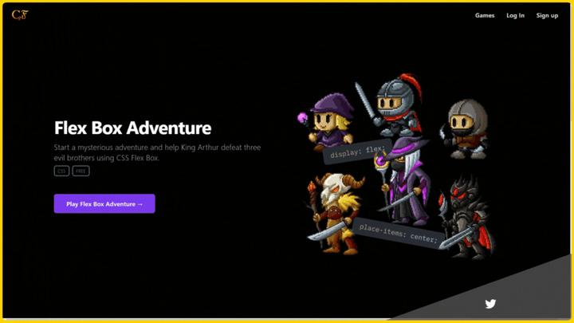
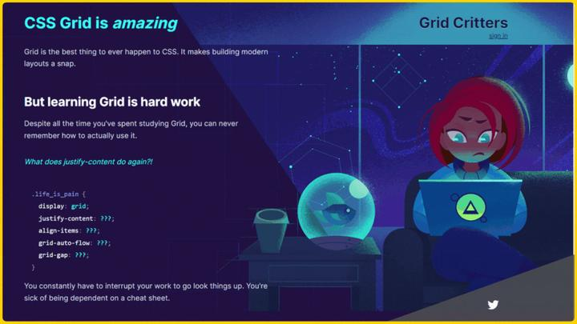
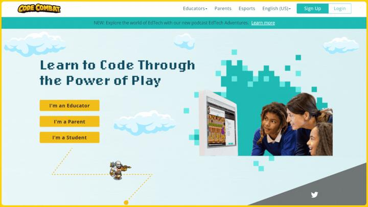
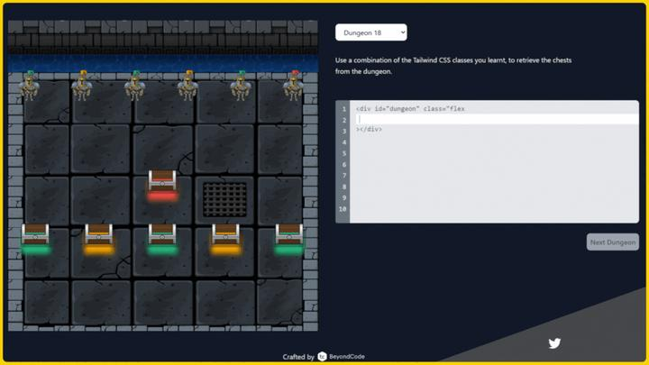
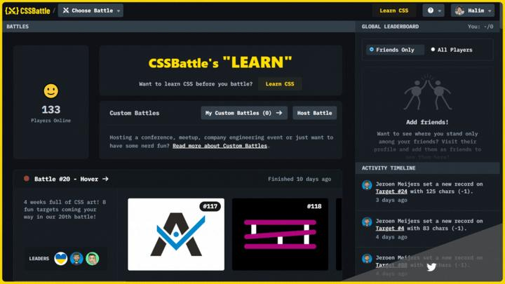
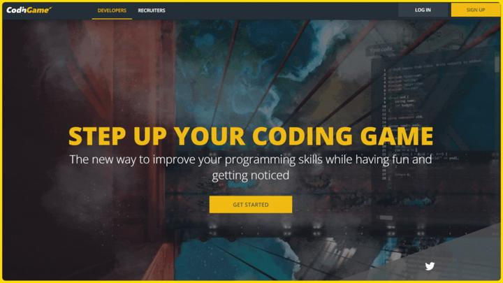
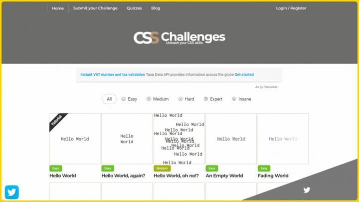

# CSS练习

[Flexbox Froggy - 学习 CSS flexbox 的游戏](https://flexboxfroggy.com/)

[flexboxfroggy（flex布局学习游戏）攻略 - 知乎 (zhihu.com)](https://zhuanlan.zhihu.com/p/542118955)

[CSS Grid Generator (cssgrid-generator.netlify.app)](https://cssgrid-generator.netlify.app/)

学习编码并不容易，尤其是 CSS，所以，在本文中我将跟大家分享一些既能学习CSS知识技能有可以玩游戏的网站，以有趣好玩的方式来帮助你提高学习兴趣以及解决问题的能力。现在，就让我们进入一些在线学习CSS的游戏网站列表，以提高你的 Web 开发技能。

## 1.Coding Fantasy

地址：https://codingfantasy.com/games

通过玩此网站上提供的游戏来提升你的 HTML、CSS 和 JavaScript 技能。

## 2.Grid Gritters

地址：https://gridcritters.com/

CSS Grid是 CSS 中最难掌握的部分之一，也是最枯燥的部分之一。这个网站将帮助你以有趣的方式掌握 CSS Grid。

## 3.CodeCombat

地址：https://codecombat.com/

一个适合初学者的多人实时编码策略游戏来学习编程的网站。

## 4.Knights of the Flexbox

地址：https://knightsoftheflexboxtable.com/

Tailwind 是一个 CSS 框架，也是当今最常用与流行的框架之一，如果你想练习你的 CSS 和 Tailwind技能，那么，这个网站会是一个不错的地方。

## 5.CSSBattle

地址：https://cssbattle.dev/

全球 CSS 挑战网站，通过解决问题获得全球奖励！

## 6.Coding Games

地址：https://www.codingame.com

一个面向程序员的基于编程挑战的培训平台，你可以在其中以有趣的方式提高你的编程技能。

**7.CSS Challenges**

地址：https://css-challenges.com/

每天挑战自我，提高 CSS 技能并学习新技巧。