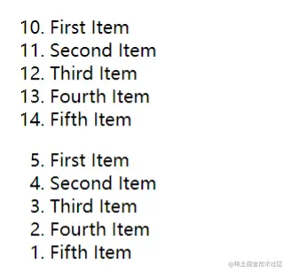
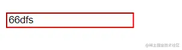
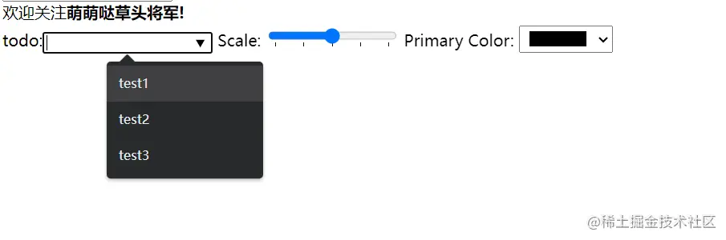
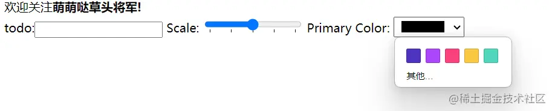

# HTML实用技巧

## 💡Tip 1：告别 `display: none`

当你需要隐藏一个元素时，首先想到的可能是`display: none`，或者`visibility: hidden`,

现在有一个更简便的方式：直接在`HTML`元素使用`hidden`属性，它的值还可以是`hidden="hidden"`或者`hidden="invalid value"`

```html
<section hidden>
    <div>嘿嘿，我不会显示</div>
</section>
```

## 💡Tip 2: 修改 `ol`标签的排序

通过 `start` 属性控制排序的起始位置

```html
<ol start="10">
    <li>First Item</li>
    <li>Second Item</li>
    <li>Third Item</li>
    <li>Fourth Item</li>
    <li>Fifth Item</li>
</ol>
```

使用 `reversed` 反转排序

```html
<ol reversed>
    <li>First Item</li>
    <li>Second Item</li>
    <li>Third Item</li>
    <li>Fourth Item</li>
    <li>Fifth Item</li>
</ol>
```



## 💡Tip 3: 使用 `inputmode="numeric"`代替 `type="number"`

当使用 `type="number"` 输入的数字时，如果输入的内容是非法的，那么实际得到的值为空字符串

但是如果使用 `inputmode="numeric"` 当输入的值为非法的内容时，会自动触发警告

```html
<style>
input:invalid {
    border-color: red;
}
</style>

<input type="text" inputmode="numeric" pattern="[0-9]*" />
```




## 💡Tip 4: 使用 `contenteditable="true"`开启富文本编辑器

在任意的`HTML`元素中使用`contenteditable="true"`即可以开启富文本编辑器。

```html
<div contenteditable="true">富文本编辑!</div>
```


## 💡Tip 5: 使用`<datalist>`提高用户体验

`<datalist>` 标签，它是 `HTML5` 中的一个表单元素，用于创建输入字段的预定义选项列表。它通常与`input` 标签的 `list` 属性一起使用，以提供给用户一组可供选择的选项

```html
<label>
  todo:
  <input type="text" list="datalist" />
  <datalist id="datalist">
    <option value="test1" />
    <option value="test2" />
    <option value="test3" />
  </datalist>
</label>

<label>
  Scale:
  <input type="range" min="1" max="5" step="1" list="scales" />
  <datalist id="scales">
    <option value="1"></option>
    <option value="2"></option>
    <option value="3"></option>
    <option value="4"></option>
    <option value="5"></option>
  </datalist>
</label>

<label>
  Primary Color:
  <input type="color" list="colors" />
  <datalist id="colors">
    <option value="#4d32bf"></option>
    <option value="#ac45fa"></option>
    <option value="#f9427c"></option>
    <option value="#fac642"></option>
    <option value="#4fd6be"></option>
  </datalist>
</label>
```





## 💡Tip 6: 使用`loading="lazy"`懒加载资源，提高加载速度

```html

<iframe src="http://www.baidu.com" loading="lazy" />
```