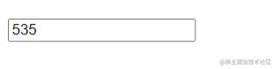

# HTML实用技巧

**01、创建联系链接**

使用 HTML 创建可点击的电子邮件、电话和短信链接：

```
<!-- Email link --><a href="mailto:name@example.com"> Send Email </a>
<!-- Phone call link --><a href="tel:+1234567890"> Call Us </a>
<!-- SMS link --><a href="sms:+1234567890"> Send SMS </a>
```

**02、创建可折叠内容**

当您想要在网页上包含可折叠内容时，可以使用 `<details>` 和 `<summary>` 标记。

`<details>` 标签创建隐藏内容的容器，而 `<summary>` 标签提供可单击的标签来切换该内容的可见性。

```
<details>  <summary>Click to expand</summary>  <p>This content can be expanded or collapsed.</p></details>
```

**03、利用语义元素**

为您的网站选择语义元素而不是非语义元素。它们使您的代码变得有意义，并改善结构、可访问性和 SEO。


*上图，左边为非语义结构，右边为语义元素结构*

**04、对表单元素进行分组**

使用 `<fieldset>` 标记对表单中的相关元素进行分组，并使用 `<legend>` 标记和 `<fieldset>` 来定义 `<fieldset>` 标记的标题。

这对于创建更高效、更易于访问的表单非常有用。

```
<form>   <fieldset>      <legend>Personal details</legend>      <label for="firstname">First name:</label>      <input type="text" id="firstname" name="firstname" />      <label for="email">Email:</label>      <input type="email" id="email" name="email" />      <label for="contact">Contact:</label>      <input type="text" id="contact" name="contact" />      <input type="button" value="Submit" />   </fieldset></form>
```

**05、增强下拉菜单**

您可以使用 `<optgroup>` 标签对 `<select>` HTML 标签中的相关选项进行分组。

当您使用大型下拉菜单或长选项列表时可以使用此功能。

```
<select>   <optgroup label="Fruits">      <option>Apple</option>      <option>Banana</option>      <option>Mango</option>   </optgroup>   <optgroup label="Vegetables">      <option>Tomato</option>      <option>Broccoli</option>      <option>Carrot</option>   </optgroup></select>
```

**06、改进视频演示**

poster属性可以与 `<video>` 元素一起使用来显示图像，直到用户播放视频。

```
<video controls poster="image.png" width="500">  <source src="video.mp4" type="video/mp4 /></video>
```

**07、支持多项选择**

您可以将 multiple 属性与 `<input>` 和`<select>` 元素一起使用，以允许用户一次选择/输入多个值。

```
<input type="file" multiple /><select multiple>    <option value="java">Java</option>    <option value="javascript">JavaScript</option>    <option value="typescript">TypeScript</option>    <option value="rust">Rust</option></select>
```

**08、将文本显示为下标和上标**

`<sub>` 和 `<sup>` 元素可用于分别将文本显示为下标和上标。


**09、创建下载链接**

您可以使用带有 `<a>` 元素的 download 属性来指定当用户单击链接时，应下载而不是导航到链接的资源。

```
<a href="document.pdf" download="document.pdf"> Download PDF </a>
```

**10、定义相对链接的基本 URL**

您可以使用 `<base>` 标签来定义网页中所有相对 URL 的基本 URL。

当您想要为网页上的所有相对 URL 创建共享起点时，这会很方便，从而更轻松地导航和加载资源。

```
<head>   <base href="https://shefali.dev" target="_blank" /></head><body>   <a href="/blog">Blogs</a>   <a href="/get-in-touch">Contact</a></body>
```

**11、控制图像加载**

`` 元素的loading 属性可用于控制浏览器加载图像的方式。它具有三个值：“eager”、“lazy”和“auto”。

```

```

**12、管理翻译功能**

您可以使用translate 属性来指定元素的内容是否应由浏览器的翻译功能进行翻译。

```
<p translate="no">  This text should not be translated.</p>
```

**13、设置最大输入长度**

通过使用 maxlength 属性，您可以设置用户在输入字段中输入的最大字符数。

```
<input type="text" maxlength="4">
```

**14、设置最小输入长度**

通过使用 minlength 属性，您可以设置用户在输入字段中输入的最小字符数。

```
<input type="text" minlength="3">
```

**15、启用内容编辑**

使用 contenteditable 属性指定元素的内容是否可编辑。

它允许用户修改元素内的内容。

```
<div contenteditable="true">   You can edit this content.</div>
```

**16、控制拼写检查**

您可以将拼写检查属性与 `<input>` 元素、内容可编辑元素和 `<textarea>` 元素结合使用，以启用或禁用浏览器的拼写检查。

```
<input type="text" spellcheck="true"/>
```

**17、确保无障碍**

alt 属性指定图像无法显示时的替代文本。

始终包含图像的描述性 alt 属性，以提高可访问性和 SEO。

```

```

**18、定义链接的目标行为**

您可以使用目标属性来指定单击链接资源时将显示的位置。

```
<!-- Opens in the same frame --><a href="https://shefali.dev" target="_self">Open</a>
<!-- Opens in a new window or tab --><a href="https://shefali.dev" target="_blank">Open</a>
<!-- Opens in the parent frame --><a href="https://shefali.dev" target="_parent">Open</a>
<!-- Opens in the full body of the window --><a href="https://shefali.dev" target="_top">Open</a>
<!-- Opens in the named frame --><a href="https://shefali.dev" target="framename">Open</a>
```

**19、提供附加信息**

title 属性可用于在用户将鼠标悬停在元素上时提供有关该元素的附加信息。

```
<p title="World Health Organization">WHO</p>
```

**20、接受特定文件类型**

可以使用accept属性指定服务器接受的文件类型（仅适用于文件类型）。 这与 `<input>` 元素一起使用。

```
<input type="file" accept="image/png, image/jpeg" />
```

**21、优化视频加载**

您可以通过使用 `<video>` 元素的 preload 属性来加快视频文件的加载速度，从而实现更流畅的播放。

```
<video src="video.mp4" preload="auto">   Your browser does not support the video tag.</video>
```

## contenteditable

`html`中大部分标签都是不可以编辑的，但是添加了`contenteditable`属性之后，标签会变成可编辑状态。

```html
<div contenteditable="true"></div>
```

不过通过这个属性把标签变为可编辑状态后只有`input`事件，没有`change`事件。也不能像表单一样通过`maxlength`控制最大长度。我也忘记我在什么情况下用到过了，后面想起来再补吧。

## calc

这是一个`css`属性，我一般称之为`css`表达式。可以计算`css`的值。最有趣的是他可以计算不同单位的差值。很好用的一个功能，缺点是不容易阅读。接盘侠没办法一眼看出`20px`是啥。

```css
div {
    width: calc(25% - 20px);
}
```

## 💡Tip 1：告别 `display: none`

当你需要隐藏一个元素时，首先想到的可能是`display: none`，或者`visibility: hidden`,

现在有一个更简便的方式：直接在`HTML`元素使用`hidden`属性，它的值还可以是`hidden="hidden"`或者`hidden="invalid value"`

```html
<section hidden>
    <div>嘿嘿，我不会显示</div>
</section>
```

## 💡Tip 2: 修改 `ol`标签的排序

通过 `start` 属性控制排序的起始位置

```html
<ol start="10">
    <li>First Item</li>
    <li>Second Item</li>
    <li>Third Item</li>
    <li>Fourth Item</li>
    <li>Fifth Item</li>
</ol>
```

使用 `reversed` 反转排序

```html
<ol reversed>
    <li>First Item</li>
    <li>Second Item</li>
    <li>Third Item</li>
    <li>Fourth Item</li>
    <li>Fifth Item</li>
</ol>
```


## 💡Tip 3: 使用 `inputmode="numeric"`代替 `type="number"`

当使用 `type="number"` 输入的数字时，如果输入的内容是非法的，那么实际得到的值为空字符串

但是如果使用 `inputmode="numeric"` 当输入的值为非法的内容时，会自动触发警告

```html
<style>
input:invalid {
    border-color: red;
}
</style>

<input type="text" inputmode="numeric" pattern="[0-9]*" />
```




## 💡Tip 4: 使用 `contenteditable="true"`开启富文本编辑器

在任意的`HTML`元素中使用`contenteditable="true"`即可以开启富文本编辑器。

```html
<div contenteditable="true">富文本编辑!</div>
```


## 💡Tip 5: 使用`<datalist>`提高用户体验

`<datalist>` 标签，它是 `HTML5` 中的一个表单元素，用于创建输入字段的预定义选项列表。它通常与`input` 标签的 `list` 属性一起使用，以提供给用户一组可供选择的选项

```html
<label>
  todo:
  <input type="text" list="datalist" />
  <datalist id="datalist">
    <option value="test1" />
    <option value="test2" />
    <option value="test3" />
  </datalist>
</label>

<label>
  Scale:
  <input type="range" min="1" max="5" step="1" list="scales" />
  <datalist id="scales">
    <option value="1"></option>
    <option value="2"></option>
    <option value="3"></option>
    <option value="4"></option>
    <option value="5"></option>
  </datalist>
</label>

<label>
  Primary Color:
  <input type="color" list="colors" />
  <datalist id="colors">
    <option value="#4d32bf"></option>
    <option value="#ac45fa"></option>
    <option value="#f9427c"></option>
    <option value="#fac642"></option>
    <option value="#4fd6be"></option>
  </datalist>
</label>
```


## 💡Tip 6: 使用`loading="lazy"`懒加载资源，提高加载速度

```html

<iframe src="http://www.baidu.com" loading="lazy" />
```