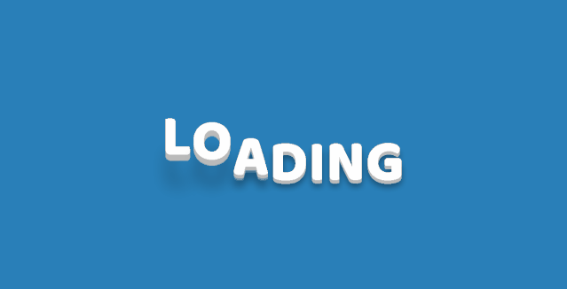

# UI组件库

[ibelick/background-snippets：现代背景片段：复制、粘贴、即用型 (github.com)](https://github.com/ibelick/background-snippets)

[bg.ibelick - ready-to-use background snippets for web developers](https://bg.ibelick.com/)

## HTMLrev：1200+ 免费开源模板

HTMLrev网站地址：https://htmlrev.com/

### 什么是 HTMLrev

`TMLrev` 是一个在线网站，它提供了超过 `1200+` 免费的网站模板。这些模板涵盖了各种类型的网站、落地页、博客、作品集、电子商务、仪表盘、后台系统等。

用户可以根据自己的需求选择合适的模板进行下载和使用。

### 支持多种技术框架

`HTMLrev` 支持多种技术框架，开发人员可以根据自己的技术选择适合自己开发的模板，目前官方支持的技术有：HTML、Bootstrap、Tailwind、Bulma、Angular、React、Vue、Next、Nuxt、Svelte、Astro、Laravel、Django、Gatsby、Hugo、Jekyll、BCMS、Framer。


## Uiverse.io：打造 超炫酷 界面 的秘密武器

一个 `UI` 组件元素的网站，提供了大量漂亮有趣的 UI 元素。

### Uiverse 网址

> [uiverse.io/](https://uiverse.io/)

### 什么是 Uiverse.io

`Uiverse.io` 一个开源免费的 `UI` 组件库，由 `HTML&CSS` 组成，为前端开发人员提供了全面有趣的 UI 元素，只需要复制粘贴代码到 Web 或者应用里面，帮你轻松节省创作 UI 组件的时间和精力，无需花费一分钱，就能使用漂亮细腻的 UI 组件。

这里的 UI 组件包含了`按钮`、`复选框`、`开关`、`卡片`、`加载`、`输入`等六种组件类型，让写代码就像拼积木一样简单，如果你是开发人员可不要错过这么不错的资源哦。


重点是它所有样式均提供代码`开源免费`使用， 只需要动动手指复制粘贴即可！！！

### 4000+ 组件

是的，没有听错，目前官网一共提供了 `4158` 个组件！！！


`Uiverse.io` 网站上的 UI 组件确实为开发者提供了丰富的选择和灵活性，这些组件可以根据不同的需求和项目特点进行定制和组合。以下是对您提到的几类组件的详细说明和应用建议：

#### 布局组件


- **格子布局**：网格系统是现代网页设计的基础，可以帮助开发者创建整齐、一致的布局。
- **卡片**：卡片式布局可用于展示内容块，适合博客、新闻网站和产品页面。
- **侧边栏**：侧边栏可用于放置导航链接、广告、搜索框等，增加页面的可用性。
- **导航栏**：导航栏是网页的门户，对于大型网站或多页面应用至关重要。

#### 文本组件


- **头部和段落**：定义文档结构和内容层次，使用不同的样式来吸引用户注意。
- **引用**：用于引述文本或强调特定信息，通常带有不同的样式。
- **列表**：有序和无序列表用于展示项目或要点，可以自定义列表项的样式。

#### 表单组件


- **输入框**：用于收集用户信息，如姓名、邮箱、搜索关键词等。
- **单选框和复选框**：用于让用户从多个选项中选择一个或多个答案。
- **滑动条**：适合于范围输入，如音量控制、日期选择等。
- **按钮**：用于触发动作，如提交表单、发起请求等。

#### 功能性组件


- **模态窗口**：用于弹出式对话框，可以在不离开当前页面的情况下展示信息或请求用户操作。
- **弹出菜单**：下拉菜单或侧边菜单，用于减少页面上的元素数量，优化布局。
- **提示框**：用于显示通知、警告或信息提示，增强用户体验。
- **进度条**：展示操作进度，如加载、处理中状态等。

#### 装饰性组件


- **边框**：可以为元素添加边框，以突出显示或区分不同的内容块。
- **阴影**：为元素添加深度和立体感，提升视觉效果。
- **颜色渐变**：颜色渐变可以创造吸引人的视觉效果，用于背景、按钮或文本。

Uiverse.io 上的每个组件都提供了自定义的空间，允许开发者根据自己的需求调整样式、尺寸和行为。通过这些组件，开发者可以构建出既美观又功能丰富的网页和应用界面。此外，Uiverse.io 的社区活跃，开发者可以在这里获得支持、分享经验和参与讨论，进一步提升自己的前端开发技能。

## AwA 用户界面

官网：[AwA | HANDSOME-CSS3-LIB](https://www.handsome-css.com/show-all)

GitHub：[ZiYi0414/handsome-css3-lib：在网上收集各种帅气的CSS3特效和动画，按钮标题等各种好玩酷炫的特效组件，网站主旨在于收集网上仅靠 CSS 与 HTML 就可以实现的动效UI。 ](https://github.com/ZiYi0414/handsome-css3-lib)

在网上收集各种帅气的CSS3特效和动画，按钮标题等各种好玩酷炫的特效组件，网站主旨在于收集网上仅靠 CSS 与 HTML 就可以实现的动效UI。


# 动画或组件实现

### 1、evanyou 效果-彩带


注：这个主要用的是 Canvas 画布实现的，点击背景绘制新的图形，代码如下： 

```html
<canvas id="evanyou" width="1920" height="934"></canvas> 
/*CSS代码:*/
<style type="text/css">
  #evanyou {
    position: fixed;
    width: 100%;
    height: 100%;
    left: 0;
    top: 0;
  }
</style>
<script>
  var c = document.getElementById('evanyou'),
    x = c.getContext('2d'),
    pr = window.devicePixelRatio || 1,
    w = window.innerWidth,
    h = window.innerHeight,
    f = 90,
    q, m = Math,
    r = 0,
    u = m.PI * 2,
    v = m.cos,
    z = m.random;
  c.width = w * pr;
  c.height = h * pr;
  x.scale(pr, pr);
  x.globalAlpha = 0.6;
  function evanyou() {
    x.clearRect(0, 0, w, h) q = [{
      x: 0,
      y: h * .7 + f
    }, {
      x: 0,
      y: h * .7 - f
    }]
    while(q[1].x <
      w + f) d(q[0], q[1])
  }
  function d(i, j) {
    x.beginPath() x.moveTo(i.x, i.y) x.lineTo(j.x, j.y) var k = j.x + (z() * 2 - 0.25) * f,
      n = y(j.y) x.lineTo(k, n) x.closePath() r -= u / -50 x.fillStyle = '#' + (v(r) * 127 + 128 << 16 | v(r + u / 3) * 127 + 128 << 8 | v(r + u / 3 * 2) * 127 + 128).toString(16) x.fill() q[0] = q[1] q[1] = {
        x: k,
        y: n
      }
  }
  function y(p) {
    var t = p + (z() * 2 - 1.1) * f
    return(t > h || t <
      0) ? y(p) : t
  }
  document.onclick = e vanyou document.ontouchstart = e vanyou evanyou();
</script>
```

### 2、返回顶部特效（滚动条上移或者点击会自动隐藏和显示）


代码如下：

```html
//Html代码: body>
<!--回到顶部-->
<div id="back-to-top" class="red" data-scroll="body" style="top:-46px;color:red;">回到顶部 </div>
<!--撑开网页代码-->
<p>hello</p>
<p>hello</p>
<p>hello</p>
<p>hello</p>
<p>hello</p>
<p>hello</p>
<p>hello</p>
<p>hello</p>
<p>hello</p>
<p>hello</p>
<p>hello</p>
<p>hello</p>
<p>hello</p>
<p>hello</p>
<p>hello</p>
<p>hello</p>
<p>hello</p>
<p>hello</p>
<p>hello</p>
<p>hello</p>
<p>hello</p>
<p>hello</p>
<p>hello</p>
<p>hello</p>
<p>hello</p>
<p>hello</p>
<p>hello</p>
<p>hello</p>
<p>hello</p>
<p>hello</p>
<p>hello</p>
<p>hello</p>
<p>hello</p>
<!--以上是撑开网页代码-->//CSS样式 #back-to-top { position:fixed; right:50px; z-index:9; width:70px; height:900px; background:url('/Content/Images/scroll.png'); transition:0.5s; cursor:pointer; } //JS部分:
<script src="~/Scripts/jquery-1.8.2.min.js"></script>
<script type="text/javascript">
  window.onload = function() {
    // 利用 data-scroll 属性，滚动到任意 dom 元素           
    $.scrollto = function(scrolldom, scrolltime) {
      $(scrolldom).click(function() {
        var scrolltodom = $(this).attr("data-scroll");
        $(this).addClass("active").siblings().removeClass("active");
        $('html, body').animate({
          scrollTop: $(scrolltodom).offset().top
        }, scrolltime);
        return false;
      });
    };
    //判断位置控制 返回顶部的显隐
    if($(window).width() > 800) {
      //如果窗体的宽度大于800
      var backTo = $("#back-to-top");
      //获取back-to-top对象
      var backHeight = $(window).height() - 980 + 'px';
      //让window高度减980
      $(window).scroll(function() {
        if($(window).scrollTop() > 700 && backTo.css('top') === '-900px') {
          backTo.css('top', backHeight);
        } else if($(window).scrollTop() <= 700 && backTo.css('top') !== '-900px') {
          backTo.css('top', '-900px');
        }
      });
    }
    //启用            
    $.scrollto("#back-to-top", 800);
  }
</script>
```

### 3、左下角探头效果


 

PS：这个图片在网页的左下角，鼠标移动上去探头效果，代码如下

```html
<div class="xm">  </div> //CSS代码
<style>
  .xm {
    position: fixed;
    bottom: 0;
    left: 0;
    z-index: 1;
    font-size: 0;
    transition: all .3s ease-in-out;
    transform: translateY(3px);
  }
  
  .xm:hover {
    -webkit-transform: translateY(0);
    -ms-transform: translateY(0);
  }
  
  .xm img {
    width: 50px;
  }
</style>
```

### 4、文字翻转效果（点击翻转，一开始加载页面也翻转）


代码如下：

```html
<header class="header-description">
  <div id="site-header">
    <h1>                <a href="@Url.Action("JianJIe", "Home")" title="Anneke.cn">日月君地带</a>            </h1>
    <p class="typed">
      <a href="@Url.Action(" JianJIe ", "Home ")" title="Anneke.cn">日月君地带</a><span class="typed-cursor">|</span></p>
  </div>
</header> //CSS代码
<style type="text/css">
  #site-header {
    font-size: 40px !important;
    font-weight: 700;
    z-index: 1;
    text-align: center;
    position: relative;
    top: 180px;
    font-family: kilsonburg, "Avenir Next", Helvetica, Arial, "Lantinghei SC", "Microsoft YaHei", sans-serif;
    font-size: 34px;
    text-shadow: 0 1px 1px #47456d;
    margin-bottom: 130px;
    animation: show-site-title 1s ease-out;
    -o-animation: show-site-title 1s ease-out;
    -moz-animation: show-site-title 1s ease-out;
    -webkit-animation: show-site-title 1s ease-out;
  }
  
  #site-header h1 {
    display: none;
  }
  
  #site-header a {
    color: #fff;
    font-weight: 400;
  }
  
  body {
    background-color: #0094ff;
  }
</style>
<script>
  $(document).ready(function($) {
    $(".typed a").typed({
      strings: ["这里是地狱之门", "日月君地带"],
      typeSpeed: 30,
      backSpeed: 30,
      backDelay: 700
    });
  });
  //PS：需要引入两个文件：一个是jquery-1.8.2.min.js文件，一个是 typed.min.js文件（PS：自定义的，下面会贴出来）
</script>
```

typed.min.js 代码:

```js
! function(t) {
  "use strict";
  var s = function(s, e) {
    this.el = t(s), this.options = t.extend({}, t.fn.typed.defaults, e), this.isInput = this.el.is("input"), this.attr = this.options.attr, this.showCursor = this.isInput ? !1 : this.options.showCursor, this.elContent = this.attr ? this.el.attr(this.attr) : this.el.text(), this.contentType = this.options.contentType, this.typeSpeed = this.options.typeSpeed, this.startDelay = this.options.startDelay, this.backSpeed = this.options.backSpeed, this.backDelay = this.options.backDelay, this.stringsElement = this.options.stringsElement, this.strings = this.options.strings, this.strPos = 0, this.arrayPos = 0, this.stopNum = 0, this.loop = this.options.loop, this.loopCount = this.options.loopCount, this.curLoop = 0, this.stop = !1, this.cursorChar = this.options.cursorChar, this.shuffle = this.options.shuffle, this.sequence = [], this.build()
  };
  s.prototype = {
    constructor: s,
    init: function() {
      var t = this;
      t.timeout = setTimeout(function() {
        for(var s = 0; s < t.strings.length; ++s) t.sequence[s] = s;
        t.shuffle && (t.sequence = t.shuffleArray(t.sequence)), t.typewrite(t.strings[t.sequence[t.arrayPos]], t.strPos)
      }, t.startDelay)
    },
    build: function() {
      var s = this;
      if(this.showCursor === !0 && (this.cursor = t('<span class="typed-cursor">' + this.cursorChar + "</span>"), this.el.after(this.cursor)), this.stringsElement) {
        s.strings = [], this.stringsElement.hide();
        var e = this.stringsElement.find("p");
        t.each(e, function(e, i) {
          s.strings.push(t(i).html())
        })
      }
      this.init()
    },
    typewrite: function(t, s) {
      if(this.stop !== !0) {
        var e = Math.round(70 * Math.random()) + this.typeSpeed,
          i = this;
        i.timeout = setTimeout(function() {
          var e = 0,
            r = t.substr(s);
          if("^" === r.charAt(0)) {
            var o = 1;
            /^\^\d+/.test(r) && (r = /\d+/.exec(r)[0], o += r.length, e = parseInt(r)), t = t.substring(0, s) + t.substring(s + o)
          }
          if("html" === i.contentType) {
            var n = t.substr(s).charAt(0);
            if("<" === n || "&" === n) {
              var a = "",
                h = "";
              for(h = "<" === n ? ">" : ";"; t.substr(s).charAt(0) !== h;) a += t.substr(s).charAt(0), s++;
              s++, a += h
            }
          }
          i.timeout = setTimeout(function() {
            if(s === t.length) {
              if(i.options.onStringTyped(i.arrayPos), i.arrayPos === i.strings.length - 1 && (i.options.callback(), i.curLoop++, i.loop === !1 || i.curLoop === i.loopCount)) return;
              i.timeout = setTimeout(function() {
                i.backspace(t, s)
              }, i.backDelay)
            } else {
              0 === s && i.options.preStringTyped(i.arrayPos);
              var e = t.substr(0, s + 1);
              i.attr ? i.el.attr(i.attr, e) : i.isInput ? i.el.val(e) : "html" === i.contentType ? i.el.html(e) : i.el.text(e), s++, i.typewrite(t, s)
            }
          }, e)
        }, e)
      }
    },
    backspace: function(t, s) {
      if(this.stop !== !0) {
        var e = Math.round(70 * Math.random()) + this.backSpeed,
          i = this;
        i.timeout = setTimeout(function() {
          if("html" === i.contentType && ">" === t.substr(s).charAt(0)) {
            for(var e = "";
              "<" !== t.substr(s).charAt(0);) e -= t.substr(s).charAt(0), s--;
            s--, e += "<"
          }
          var r = t.substr(0, s);
          i.attr ? i.el.attr(i.attr, r) : i.isInput ? i.el.val(r) : "html" === i.contentType ? i.el.html(r) : i.el.text(r), s > i.stopNum ? (s--, i.backspace(t, s)) : s <= i.stopNum && (i.arrayPos++, i.arrayPos === i.strings.length ? (i.arrayPos = 0, i.shuffle && (i.sequence = i.shuffleArray(i.sequence)), i.init()) : i.typewrite(i.strings[i.sequence[i.arrayPos]], s))
        }, e)
      }
    },
    shuffleArray: function(t) {
      var s, e, i = t.length;
      if(i)
        for(; --i;) e = Math.floor(Math.random() * (i + 1)), s = t[e], t[e] = t[i], t[i] = s;
      return t
    },
    reset: function() {
      var t = this;
      clearInterval(t.timeout);
      var s = this.el.attr("id");
      this.el.after('<span id="' + s + '"/>'), this.el.remove(), "undefined" != typeof this.cursor && this.cursor.remove(), t.options.resetCallback()
    }
  }, t.fn.typed = function(e) {
    return this.each(function() {
      var i = t(this),
        r = i.data("typed"),
        o = "object" == typeof e && e;
      r || i.data("typed", r = new s(this, o)), "string" == typeof e && r[e]()
    })
  }, t.fn.typed.defaults = {
    strings: ["These are the default values...", "You know what you should do?", "Use your own!", "Have a great day!"],
    stringsElement: null,
    typeSpeed: 0,
    startDelay: 0,
    backSpeed: 0,
    shuffle: !1,
    backDelay: 500,
    loop: !1,
    loopCount: !1,
    showCursor: !0,
    cursorChar: "|",
    attr: null,
    contentType: "html",
    callback: function() {},
    preStringTyped: function() {},
    onStringTyped: function() {},
    resetCallback: function() {}
  }
}(window.jQuery);
```

### 5、在离开网页时，触发事件（这里以改变标题为例）


注:这里鼠标移开时，同时改变网页 title 和 icon 图标，代码如下：

```html
<head>
  <meta name="viewport" content="width=device-width" />
  <title>IT发烧友，一个真正的技术交流群</title>
  <link rel="shortcut icon" href="/Content/Images/icon.png"> </head> //JS部分
<script src="~/Scripts/jquery-1.8.2.min.js"></script>
<script>
  window.onload = function() {
    var OriginTitile = document.title;
    var titleTime;
    document.addEventListener('visibilitychange', function() {
      if(document.hidden) {
        $('[rel="shortcut icon"]').attr('href', "/Content/Images/fail.ico");
        document.title = '(●—●)喔哟，崩溃啦！';
        clearTimeout(titleTime);
      } else {
        $('[rel="shortcut icon"]').attr('href', "/Content/Images/icon.png");
        document.title = '(/≧▽≦/)咦！又好了！' + OriginTitile;
        titleTime = setTimeout(function() {
          document.title = OriginTitile;
        }, 2000);
      }
    });
  }
</script>
```

### 6、移入网页时改变鼠标的样式


PS:这个只要在样式里面设置即可，也就是移入时显示一张图片，代码如下：

```html
/css如下所示
<style>
  abbr,
  acronym,
  address,
  applet,
  article,
  aside,
  audio,
  b,
  big,
  blockquote,
  body,
  canvas,
  caption,
  center,
  cite,
  code,
  dd,
  del,
  details,
  dfn,
  dl,
  dt,
  em,
  embed,
  fieldset,
  figcaption,
  figure,
  footer,
  form,
  h1,
  h2,
  h3,
  h4,
  h5,
  h6,
  header,
  html,
  iframe,
  img,
  ins,
  kbd,
  label,
  legend,
  li,
  mark,
  menu,
  nav,
  object,
  ol,
  output,
  p,
  pre,
  q,
  ruby,
  s,
  samp,
  section,
  small,
  span,
  strike,
  strong,
  sub,
  summary,
  sup,
  table,
  tbody,
  td,
  tfoot,
  th,
  thead,
  time,
  tr,
  tt,
  u,
  ul,
  var,
  video {
    margin: 0;
    padding: 0;
    cursor: url('/Content/Image/cursor.ico'), auto;
  }
</style>
```

### 7、文字向上滚动效果（PS：鼠标悬停停止滚动）


代码如下:

```html
<div align="center" id="demo">
  <div id="demo1"> 我是滚动内容<br/> 你来抓我啊<br/> 嗖嗖嗖<br/> 2333333333333333333333333 </div>
  <div id="demo2"></div>
</div>
<style>
  #demo {
    overflow: hidden;
    height: 200px;
    width: 250px;
    border: 1px solid #6699cc;
    font-size: 14px;
    color: #336699;
    line-height: 22px;
    text-align: left;
    padding: 10px;
  }
</style>
<script>
  //JS代码: 
  var demo = document.getElementById("demo");
  var demo1 = document.getElementById("demo1");
  var demo2 = document.getElementById("demo2");
  var speed = 30;
  //滚动速度值,值越大速度越慢
  var nnn = 200 / demo1.offsetHeight;
  for(i = 0; i < nnn; i++) {
    demo1.innerHTML += "<br />" + demo1.innerHTML
  }
  demo2.innerHTML = d emo1.innerHTML
  //克隆demo2为demo1 
  function Marquee() {
    if(demo2.offsetTop - demo.scrollTop <= 0)
      //当滚动至demo1与demo2交界时,demo跳到最顶端
      demo.scrollTop -= demo1.offsetHeight
    else {
      demo.scrollTop++ //如果是横向的 将 所有的 height top 改成 width left 
    }
  }
  var MyMar = s etInterval(Marquee, speed);
  //设置定时器,鼠标经过时清除定时器达到滚动停止的目的 
  demo.onmouseover = f unction() {
    clearInterval(MyMar)
  }
  //鼠标移开时重设定时器
  demo.onmouseout = f unction() {
    MyMar = s etInterval(Marquee, speed)
  }
</script>
```

### 8、 鼠标移入效果


鼠标移入，使区域旋转变色，代码如下：

```html
//Style样式
<link href="~/Content/amazeui.min.css" rel="stylesheet" />
<style type="text/css">
  #XuanZhuan li {
    width: 200px;
    height: 50px;
    background-color: pink;
    margin-left: 15px;
    position: relative;
    float: left;
    list-style: none;
    margin-top: 15px;
  }
  
  div {
    width: 470px;
  }
  
  #XuanZhuan li:hover {
    cursor: pointer;
  }
</style> //Html标签
<div>
  <ul id="XuanZhuan">
    <li> 11111111111111111 </li>
    <li> 222222222222222 </li>
    <li> 333333333333333 </li>
    <li> 4444444444444444 </li>
  </ul>
</div> //Script
<script src="~/Scripts/jquery-1.8.2.min.js"></script>
<script type="text/javascript">
  //在友情链接页面，鼠标放在li上,li旋转效果        
  $(function() {
    $("#XuanZhuan li").hover(function() {
      $(this).css("background-color", "yellow");
      $(this).attr("class", "am-animation-spin");
    }, function() {
      $(this).css("background-color", "pink");
      $(this).attr("class", "");
    });
  })
</script>
```

### 9、旋转星空，点击放烟花效果


实现代码:

```html

<div> <canvas id="canvas"></canvas> <canvas id="snow"></canvas>
  <div class="am-g" style="position: fixed; bottom: 0px;">
    <div class="am-u-sm-12">
      <div style="z-index: 9999" id="player" class="aplayer"> </div>
    </div>
  </div>
</div> //CSS代码 canvas { position: fixed; width: 100%; height: 100%; z-index: -1; } //引入JS
<script src="~/Content/assets/js/jquery.min.js"></script>
<script src="~/Scripts/Blog/universe.js"></script>
<!--旋转背景-->
<script src="~/Scripts/Blog/Fireworks.js"></script>
<!--点击放烟花-->
```

universe.js

```js

var canvas = document.getElementById('canvas'),
  ctx = canvas.getContext('2d'),
  w = canvas.width = window.innerWidth,
  h = canvas.height = window.innerHeight,
  hue = 217,
  stars = [],
  count = 0,
  maxStars = 1300; //星星数量 
var canvas2 = document.createElement('canvas'),
  ctx2 = canvas2.getContext('2d');
canvas2.width = 100;
canvas2.height = 100;
var half = canvas2.width / 2,
  gradient2 = ctx2.createRadialGradient(half, half, 0, half, half, half);
gradient2.addColorStop(0.025, '#CCC');
gradient2.addColorStop(0.1, 'hsl(' + hue + ', 61%, 33%)');
gradient2.addColorStop(0.25, 'hsl(' + hue + ', 64%, 6%)');
gradient2.addColorStop(1, 'transparent');
ctx2.fillStyle = gradient2;
ctx2.beginPath();
ctx2.arc(half, half, half, 0, Math.PI * 2);
ctx2.fill(); // End cache 
function random(min, max) {
  if(arguments.length < 2) {
    max = min;
    min = 0;
  }
  if(min > max) {
    var hold = max;
    max = min;
    min = hold;
  }
  return Math.floor(Math.random() * (max - min + 1)) + min;
}
 
function maxOrbit(x, y) {
  var max = Math.max(x, y),
    diameter = Math.round(Math.sqrt(max * max + max * max));
  return diameter / 2; //星星移动范围，值越大范围越小， 
}
var Star = function() {
  this.orbitRadius = random(maxOrbit(w, h));
  this.radius = random(60, this.orbitRadius) / 8; //星星大小    
  this.orbitX = w / 2;
  this.orbitY = h / 2;
  this.timePassed = random(0, maxStars);
  this.speed = random(this.orbitRadius) / 50000; //星星移动速度    
  this.alpha = random(2, 10) / 10;
  count++;
  stars[count] = this;
}
Star.prototype.draw = function() {
  var x = Math.sin(this.timePassed) * this.orbitRadius + this.orbitX,
    y = Math.cos(this.timePassed) * this.orbitRadius + this.orbitY,
    twinkle = random(10);
  if(twinkle === 1 && this.alpha > 0) {
    this.alpha -= 0.05;
  } else if(twinkle === 2 && this.alpha < 1) {
    this.alpha += 0.05;
  }
  ctx.globalAlpha = this.alpha;
  ctx.drawImage(canvas2, x - this.radius / 2, y - this.radius / 2, this.radius, this.radius);
  this.timePassed += this.speed;
}
for(var i = 0; i < maxStars; i++) {
  new Star();
}
 
function animation() {
  ctx.globalCompositeOperation = 'source-over';
  ctx.globalAlpha = 0.5; //尾巴    
  ctx.fillStyle = 'hsla(' + hue + ', 64%, 6%, 2)';
  ctx.fillRect(0, 0, w, h) ctx.globalCompositeOperation = 'lighter';
  for(var i = 1, l = stars.length; i < l; i++) {
    stars[i].draw();
    canvas2.style.cssText = "display:none";
  };
  window.requestAnimationFrame(animation);
}
animation();
```

### 10、音乐播放组件

  

PS：此插件由迅雷提供，实现如下:

```html

<div id="player1" class="aplayer">
  <pre class="aplayer-lrc-content">
[ti:断桥残雪]
[ar:Vae]
[al:断桥残雪（EP）]
[00:01.90]Vae - 断桥残雪
[00:05.16]词、曲 编曲：许嵩（Vae）
[00:08.16]
[00:24.99]寻不到花的折翼枯叶蝶
[00:30.09]永远也看不见凋谢
[00:36.90]江南夜色下的小桥屋檐
[00:42.04]读不懂塞北的荒野
[00:48.94]梅开时节因寂寞而缠绵
[00:54.07]春归后又很快湮灭
[01:01.21]独留我赏烟花飞满天
[01:06.03]摇曳后就随风飘远
[01:13.11]断桥是否下过雪
[01:15.83]我望着湖面
[01:18.77]水中寒月如雪
[01:21.78]指尖轻点融解
[01:24.81]断桥是否下过雪
[01:27.69]又想起你的脸
[01:30.66]若是无缘再见
[01:33.75]白堤柳帘垂泪好几遍
[02:03.83]寻不到花的折翼枯叶蝶
[02:09.12]永远也看不见凋谢
[02:15.84]江南夜色下的小桥屋檐
[02:21.17]读不懂塞北的荒野
[02:28.01]梅开时节因寂寞而缠绵
[02:33.09]春归后又很快湮灭
[02:39.79]独留我赏烟花飞满天
[02:45.19]摇曳后就随风飘远
[02:52.06]断桥是否下过雪
[02:54.83]我望着湖面
[02:57.80]水中寒月如雪
[03:00.82]指尖轻点融解
[03:03.85]断桥是否下过雪
[03:06.83]又想起你的脸
[03:09.90]若是无缘再见
[03:12.74]白堤柳帘垂泪好几遍
</pre>
</div>
//JS部分
<script type="text/javascript">
  //初始化APlayer音乐播放器插件。
  var ap = new APlayer({
    element: document.getElementById('player1'),
    narrow: false,
    autoplay: false, //是否自动播放
    showlrc: true, //是否显示歌词
    theme: '#66B7FF', //主题颜色
    music: {
      title: '断桥残雪',
      author: '许嵩大人',
      url: '/Content/Music/许嵩 - 断桥残雪.mp3',
      pic: '/Content/Music/dqcx.jpg',
    }
  });
  ap.init();
</script>
//引入JS部分
<script src="~/Scripts/jquery-1.8.2.min.js"></script>
<link href="//cdn.bootcss.com/aplayer/1.4.8/APlayer.min.css" rel="stylesheet">
<script src="//cdn.bootcss.com/aplayer/1.4.8/APlayer.min.js"></script>
```

### 11、点击弹出指定的内容


PS:点击弹出显示内容，过一会自动消失, 说白了也就是一个弹出内容插件，比 alert 好看些，代码如下：

```html

<input type="button" value="显示获取到的内容" id="btn1" /> //JS代码
<script src="~/Scripts/jquery-1.8.2.min.js"></script>
<script src="~/Scripts/layer/layer.js"></script>
<script type="text/javascript">
  $(function() {
    $("#btn1").click(function() {
      layer.msg("我是弹出的内容");
    });
  })
</script>
```

利用上面的插件还可以实现 confirm 选择效果


实现代码：

```js
layer.confirm('确定要删除?', {
  icon: 3,
  title: '提示'
}, function() {
  alert("当然确定了~");
});
```

### 1、交错动画


有时候，我们需要给多个元素添加同一个动画，播放后，不难发现它们会一起运动，一起结束，这样就会显得很平淡无奇。

那么如何将动画变得稍微有趣一点呢？很简单，既然它们都是同一时刻开始运动的，那么让它们不在同一时刻运动不就可以了吗。如何让它们不在同一时刻运动呢？注意到CSS动画有延迟（`delay`）这一属性。

举个栗子，比如有十个元素播放十个动画，将第二个元素的动画播放时间设定为比第一个元素晚0.5秒（也就是将延迟设为0.5秒），其他元素以此类推，这样它们就会错开来，形成一种独特的视觉效果。


这就是所谓的交错动画：通过设置不同的延迟时间，达到动画交错播放的效果。

**本demo地址：**https://codepen.io/alphardex/pen/XWWWBmQ

## **2、用JS分割文本**

还有一种经常用到的玩法：用JS将句子或单词分割成字母，并给每个字母加上不同延时的动画，同样也很华丽。


**本demo地址：**https://codepen.io/alphardex/full/KKwvKGY

一般我们都是从第一个元素开始交错的。但如果要从中间元素开始交错的话，就要给当前元素的延时各加上一个值，这个值就是中间元素的下标到当前元素的下标的距离（也就是下标之差的绝对值）与步长的乘积，即：`delay + Math.abs(i - middle) * step`，其中中间元素的下标`middle = letters.filter(e => e !== "").length / 2`


**本demo地址：**https://codepen.io/alphardex/full/eYYMYXJ

所有有交错特性的动画都在这儿

## **3、随机粒子动画**

说到随机性，我们可以实现一种更疯狂的效果：给几百个粒子添加交错动画，并且交错时间随机，位置大小也都是随机。如此一来我们就能用纯CSS模拟出下雪的效果。

又到了白色相簿的季节呢~为什么你写CSS这么熟练啊？


**本demo地址：**https://codepen.io/alphardex/full/dyPorwJ

## 伪类和伪元素

### 4、伪类


HTML元素的状态是可以动态变化的。举个栗子，当你的鼠标悬浮到一个按钮上时，按钮就会变成“悬浮”状态，这时我们就可以利用伪类`:hover`来选中这一状态的按钮，并对其样式进行改变。

`:hover`是笔者最最常用的一个伪类。还有一个很常用的伪类是`:nth-child`，用于选中元素的某一个子元素。其他的类似`:focus`、`:focus-within`等也有一定的使用。

**本demo地址：**https://codepen.io/alphardex/pen/pooYKVa

### **5、绝对定位实现多重边框**

谁规定按钮只能有一套边框的？利用绝对定位和`padding`，我们可以给按钮做出3套大小不一的边框来，这样效果更炫了。


**本demo地址：**https://codepen.io/alphardex/full/ZEYXomW

## **6、伪元素**


简而言之，伪元素就是在原先的元素基础上插入额外的元素，而且这个元素不充当HTML的标签，这样就能保持HTML结构的整洁。

我们知道每个元素都有`::before`和`::after`这两个伪元素，也就是说每个元素都提供了3个矩形（元素本身1个，伪元素2个）来供我们进行形状的绘制。现在又有了`clip-path`这个属性，几乎任意的形状都可以被绘制出来，全凭你的想象力

上面的动图是条子划过文本的动画，条子就是每个文本所对应的伪元素，对每个文本和其伪元素应用动画，就能达到上图的效果了

**本demo地址：**https://codepen.io/alphardex/pen/jOEOEzZ

### **7、attr()生成文本内容**

元素可以有自定义的属性值，它的命名格式通常为`data-*`

`attr()`用于获取元素的这种自定义属性值，并赋值给其伪元素的`content`作为其生成的内容

利用这个函数，我们可以用伪元素在原先文本的基础上“复制”出另一个文本，如下图所示。


看上去有点乱糟糟的对吧？没事，给它加上`overflow: hidden`，把多余的文本遮住。通过JS分割文本并应用交错动画，就得到了如下的效果，这也是接下来本文要讲的`overflow`障眼法。


**本demo地址：**https://codepen.io/alphardex/full/wvBeXjd

### 8、overflow障眼法

之前有做过闪光按钮的效果：鼠标悬浮按钮上时一道光从左到右划过去。

笔者就用渐变来模拟那道光，通过`transform: translateX()`将其平移至右边。


但这样明显不对啊，这光为啥能被看见呢？不应该把它给“挡”起来吗？

于是乎，给按钮加上`overflow: hidden`，光在按钮外的位置时就被隐藏起来了。


这就是障眼法的力量:)

**本demo地址：**https://codepen.io/alphardex/pen/eYYzXBZ

更多障眼法可以看看这个作品，一次性看个够XD

### 9、兄弟选择符定制表单元素

提示：这里最好将`input`作为`label`的子元素，这样用户点击`label`时就能传到`input`上

默认的`input`太丑怎么办？那就把它先抹掉，用`appearance: none`或`opacity: 0`都可以

然后，利用兄弟选择符`~`来定制和`input`相邻的所有元素（`+`号也行，只不过只能选中最近的元素），例如可以用伪元素生成一个新的方框代替原先的`input`，利用伪类`:checked`和动画来表示它被勾选后的状态，本质上还是障眼法哦~


**本demo地址：**https://codepen.io/alphardex/full/rNNPQwa

## CSS特性

善用某些CSS特性，也可以为你的作品增色不少哦

### 10、animation

此处包括`transition`和`transform`

**CSS动画可以说是利用CSS设计炫酷特效的最强法器，它几乎贯穿了我的所有作品**

有人问我为什么我能想出这么多的动画？笔者阅番百部，对常用的动画技巧了如指掌，同样那些酷炫的网站只要细心观察，也会给笔者带来很多设计上的灵感。

一言以蔽之：只有多欣赏动画，才能写出好的动画。

### 11、border-radius

为盒子添加圆角，经常用来美化按钮等组件

如果设定为`50%`则是圆形，也很常用

#### 不规则的曲边形状

调整多个顶点的`border-radius`可以做出不规则的曲边形状


**本demo地址：**https://codepen.io/alphardex/full/abbWOPR

### 12、box-shadow

为盒子添加阴影，增加盒子的立体感，可以多层叠加，并且会使阴影更加丝滑


**本demo地址：**https://codepen.io/alphardex/full/QWwwwpp

### 13、遮罩

如果给`box-shadow`的扩张半径设定足够大的值，可以用它来遮住背景，而无需额外的div元素


**本demo地址：**https://codepen.io/alphardex/full/BaaKvVZ

### 14、内发光

注意到`box-shadow`还有个`inset`，用于盒子内部发光

利用这个特性我们可以在盒子内部的某个范围内设定颜色，做出一个新月形


再加点动画和滤镜效果，“猩红之月”闪亮登场！


**本demo地址：**https://codepen.io/alphardex/full/eYmGEGp

## text-shadow

文本阴影，本质上和`box-shadow`相同，只不过是相对于文本而言，常用于文本发光，也可通过多层叠加来制作霓虹文本和伪3D文本等效果

### 15、发光文本


**本demo地址：**https://codepen.io/alphardex/full/Exxodoq

### 16、霓虹文本


**本demo地址：**https://codepen.io/alphardex/full/rNNwmZz

### 17、伪3D文本



**本demo地址**：https://codepen.io/alphardex/full/QWWavvx

### 18、background-clip:text

能将背景裁剪成文字的前景色，常用来和`color: transparent`配合生成渐变文本


**本demo地址：**https://codepen.io/alphardex/full/QWwveZG

## gradient

渐变可以作为背景图片的一种，具有很强的色彩效果，甚至可以用来模拟光

### 19、linear-gradient

线性渐变是笔者最常用的渐变


这个作品用到了HTML的`dialog`标签，渐变背景，动画以及`overflow`障眼法，细心的你看出来了吗:)

**本demo地址：**https://codepen.io/alphardex/full/eYYxzBm

### 20、radial-gradient

径向渐变常用于生成圆形背景，上面例子中Snow的背景就是一个椭圆形的径向渐变

此外，由于背景可以叠加，我们可以叠加多个不同位置大小的径向渐变来生成圆点群，再加上动画就产生了一种微粒效果，无需多余的`div`元素。

**本demo地址：**https://codepen.io/alphardex/full/OJPvMGx

### 21、conic-gradient

圆锥渐变可以用于制作饼图


用一个伪元素叠在饼图上面，并将`content`设为某个值（这个值通过CSS变量计算出来），就能制作出度量计的效果，障眼法又一次完成了它的使命。


**本demo地址：**https://codepen.io/alphardex/full/BaydVvQ

## filter

PS里的滤镜，玩过的都懂，`blur`最常用

### 22、backdrop-filter

对背景应用滤镜，产生毛玻璃的效果


**本demo地址：**https://codepen.io/alphardex/full/pooQMVp

### 23、mix-blend-mode

PS里的混合模式，常用于文本在背景下的特殊效果

以下利用滤色模式（`screen`）实现文本视频蒙版效果**本demo地址：**https://codepen.io/alphardex/full/wvvLYpV

### 24、clip-path

PS里的裁切，可以制作各种不规则形状。如果和动画结合也会相当有意思。


**本demo地址：**https://codepen.io/alphardex/full/ZEEBRrq

### 25、-webkit-box-reflect

投影效果，不怎么常用，适合立体感强的作品。


**本demo地址：**https://codepen.io/alphardex/full/ExaZgxp

### 26、web animations

虽然这并不是一个CSS特性，但是它经常用于完成那些CSS所做不到的事情

那么何时用它呢？当CSS动画中有属性无法从CSS中获取时，自然就会使用到它了

#### 跟踪鼠标的位置

目前CSS还尚未有获取鼠标位置的API，因此考虑用JS来进行

通过查阅相关的DOM API，发现在监听鼠标事件的API中，可通过`e.clientX`和`e.clientY`来获得鼠标当前的位置

既然能够获取鼠标的位置，那么跟踪鼠标的位置也就不是什么难事了：通过监听`mouseenter`和`mouseleave`事件，来获取鼠标出入一个元素时的位置，并用此坐标来当作鼠标的位移距离，监听`mousemove`事件，来获取鼠标在元素上移动时的位置，同样地用此坐标来当作鼠标的位移距离，这样一个跟踪鼠标的效果就实现了。


**本demo地址：**https://codepen.io/alphardex/full/OJPmQGz

## CSS Houdini

CSS Houdini是CSS的底层API，它使我们能够通过这套接口来扩展CSS的功能

### 让渐变动起来

目前来说，我们无法直接给渐变添加动画，因为浏览器不理解要改变的值是什么类型

这时，我们就可以利用`CSS.registerProperty()`来注册我们的自定义变量，并声明其语法类型（`syntax`）为颜色类型`<color>`，这样浏览器就能理解并对颜色应用插值方法来进行动画

还记得上文提到的圆锥渐变`conic-gradient()`吗？既然它可以用来制作饼图，那么我们能不能让饼图动起来呢？答案是肯定的，定义三个变量：`--color1`、`--color2`和`--pos`，其中`--pos`的语法类型为长度百分比`<length-percentage>`，将其从`0`变为`100%`，饼图就会顺时针旋转出现。


利用绝对定位和层叠上下文，我们可以叠加多个从小到大的饼图，再给它们设置不同的颜色，应用交错动画，就有了下面这个炫丽的效果。


**本demo地址：**https://codepen.io/alphardex/full/RwNxpXQ

### 27、彩蛋


将交错动画和伪类伪元素结合起来写出来的慎重勇者风格的菜单

**本demo地址：**https://codepen.io/alphardex/full/ExavZdV
