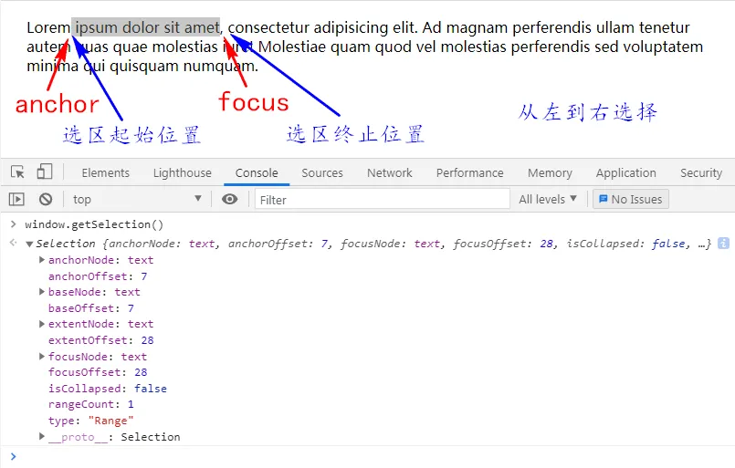
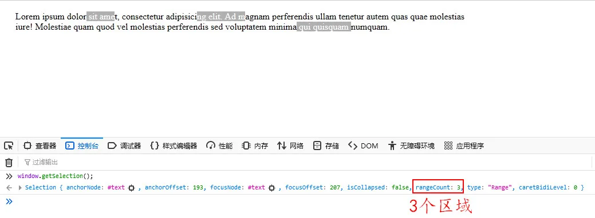
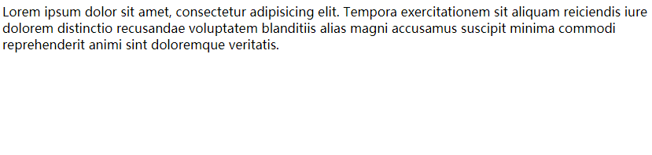
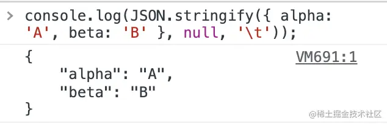

# JavaScript 代码技巧

[我敢打赌你不知道的十个JavaScript技巧 - 掘金 (juejin.cn)](https://juejin.cn/post/7296755101622878248)

## ES6 简化代码技巧

### 块级作用域

为什么需要块级作用域?

ES5 只有全局作用域和函数作用域，没有块级作用域，这导致很多场景不合理。

- 第一种场景，内层变量可能会覆盖外层变量。

```js
var tmp = new Date()
function fn() {
  console.log(tmp)
  if (false) {
    var tmp =  hello world
  }
}
fn() // undefined
```

以上代码的原意是， if 代码块的外部使用外层的 tmp 变量，内部使用内层的 tmp 变量。但是，函数 `fn` 执行后，输出结果为 `undefined` ，原因在于变量提升导致内层的 tmp 变量覆盖了外层的 tmp 变量。

- 第二种场景，用来计数的循环变量泄露为全局变量。

```js
var s = hello;
for (var i = O; i < s.length; i++) {
	console.log(s[i]);
}
console.log(i); // 5
```

上面的代码中，变量 `i` 只用来控制循环，但是循环结束后，它并没有消失，而是泄露成了全局变量。

`let` 实际上为 `JavaScript` 新增了块级作用域。

```js
function fl() {
	let n = 5;
	if (true) {
		let n = 10;
	}
	console.log(n); // 5
}
```

上面的函数有两个代码块，都声明了变量 `n`，运行后输出 `5` 。这表示外层代码块不受内层代码块的影响。如果使用 `var` 定义变量 ，最后输出的值就是 `10`

那么我们能利用`块级作用域`做什么呢？

我们先来做道面试题

```js
for (var i = 0; i < 5; i++) {
	setTimeout(() => {
		console.log(i);
	}, 1000);
}
// 5 5 5 5 5
```

改成 `ES6` 中的 let

```js
for (let i = 0; i < 5; i++) {
	setTimeout(() => {
		console.log(i);
	}, 1000);
}
// 0 1 2 3 4
```

看到这，相信聪明的你已经理解块级作用域的好处了 O(∩_∩)O

那么 `ES5` 能不能实现 `块级作用域` 的效果呢? 可以的，我们可以利用闭包

```js
for (var i = 0; i < 5; i++) {
	(function (index) {
		setTimeout(() => {
			console.log(index);
		}, 1000);
	})(i);
}
// 0 1 2 3 4
```

### 解构

> 解构 ：是将一个数据结构分解为更小的部分的过程。ES6 中，从数组和对象中提取值，对变量进行赋值。

那么解构有什么用处呢？

1. 可以大大的简化变量声明操作。

```js
// ES5
var foo = 1;
var bar = 2;
var baz = 3;

// ES6
let [foo, bar, baz] = [1, 2, 3];
```

1. 变量交换：看起来如同镜像。赋值语句的左侧的解构模式，右侧是临时创建的数组字面量。x 被赋值为数组中的 y，y 被赋值为数组中的 x。

```js
let x = 1;
let y = 2;
[x, y] = [y, x];
// x = 2, y = 1
```

1. 对象解构

```js
var obj = { x: 1, y: 2, c: 1 };
let { x, y } = obj;
// x = 1
// y = 2
```

1. 字符串解构

```js
const [a, b, c, d, e] = hello;
// a => h
// b => e
// c => l
// d => l
// e => o
```

1. 函数参数解构

```js
const xueyue = {
	name: 雪月,
	age: 18,
};

function getAge({ name, age }) {
	return `${name}今年${age}岁`;
}

getAge(xueyue); // 雪月今年18岁
```

### 箭头函数

`ES6` 允许使用箭头 `=>` 定义函数

```js
var f = (v) => v;

// 等同于 ES5 的
var f = function (v) {
	return v;
};
```

如果箭头函数不需要参数或需要多个参数，就使用圆括号代表参数部分。

```js
var f = () => 5;
// 等同于 ES5 的
var f = function () {
	return 5;
};

var sum = (numl, num2) => numl + num2;
// 等同于 ES5 的
var sum = function (numl, num2) {
	return numl + num2;
};
```

箭头函数可以与解构结合使用。

```js
const full = ({ first, last }) => first + +last;
// 等同于 ES5 的
function full(person) {
	return person.first + +person.last;
}
```

箭头函数使得表达更加简洁

```js
const isEven = (n) => n % 2 === 0;
const square = (n) => n * n;

var result = values.sort((a, b) => a - b);
// 等同于 ES5 的
var result = values.sort(function (a, b) {
	return a - b;
});
```

上面代码只用了两行，就定义了两个简单的工具函数。如果不用箭头函数，可能就要占用多行，而且还不如现在这样写醒目。

**箭头函数使用注意点**

1. 函数体内的 `this` 对象，就是定义时所在的对象，而不是使用时所在的对象。
2. 不可以当作构造函数，也就是说，不可以使用 `new` 命令，否则会抛出一个错误。
3. 不可以使用 `arguments` 对象，该对象在函数体内不存在。如果要用，可以用 `rest` 参数代替。
4. 不可以使用 `yield` 命令，因此箭头函数不能用作 `Generator` 函数。

上面四点中，第一点尤其值得注意。`this` 对象的指向是可变的，但是在箭头函数中，它是固定的。

```js
// ES6
function foo() {
  setTimeout(() => {
    console.log( id: , this.id)
  }, 100)
}

// 转换成ES5
function foo() {
  var _this = this

  setTimeout(function () {
    console.log( id: , _this.id)
  }, 100)
}
```

上面代码中，转换后的 `ES5` 版本清楚地说明了，箭头函数里面根本没有自己的 `this`，而是引用外层的 `this`。

### 模板字符串

> 模板字符串（ template string ）是增强版的字符串 ，用反引号 ` (``) ` 标识 。它可以当作普通字符串使用，也可以用来定义多行字符串，或者在字符串中嵌入变量。

```js
const { log } = console;
const name = 雪月;
const age = 18;

// 普通字符串拼接
const result = name + 今年 + age + 岁;
// 使用模板字符串
const result2 = `${name}今年${age}岁`;
log(result); // 雪月今年18岁
log(result2); // 雪月今年18岁

// ${} 大括号可以放入任意的 JavaScript 表达式，可以进行运算
const result3 = `${name}今年${age * 2}岁`;
log(result3); // 雪月今年36岁
```

### 剩余参数 / 展开语法

ES6 引入了 rest 参数（形式为`...变量名`），用于获取函数的多余参数，这样就不需要使用 `arguments` 对象了。`rest` 参数搭配的变量是一个数组，该变量将多余的参数放入其中。

```js
function sortNumbers() {
	return Array.prototype.slice.call(arguments).sort();
}
// 使用 rest
const sortNumbers = (...numbers) => numbers.sort();
```

比较上面的两种写法可以发现， `rest` 参数的写法更自然也更简洁。

扩展运算符（ `spread` ）是三个点（...） 如同 `rest` 参数的逆运算 将一个数组转为用逗号分隔的参数序列

```js
console.log(...[1, 2, 3]);
// 1 2 3

console.log(1, ...[2, 3, 4], 5);
// 1 2 3 4 5
```

下面是扩展运算符取代 `apply` 方法的一个实际例子 应用 `Math.max` 方法简化求出数组中的最大元素。

```js
// ESS 的写法
Math.max.apply(null, [14, 3, 77]);
// ES6 的写法
Math.max(...[14, 3, 77]);
// 等同于
Math.max(14, 3, 77);
```

扩展运算符提供了数组合并的新写法。

```js
//  ESS
[1, 2].concat(more);
// ES6
[1, 2, ...more];
```

对象的扩展运算符（...）用于取出参数对象的所有可遍历属性，拷贝到当前对象之中。

```js
let z = { a: 3, b: bb };
let n = { ...z };
n; // { a: 3, b:  bb  }
n === z; // false
```

**特别注意：** `...`扩展对象，只能做到当对象属性是 `基本数据类型` 才是 `深拷贝`，如果是 `引用数据类型`，那就是`浅拷贝`。

```js
let z = { a: 3, b: bb, c: { name: ccc } };
let n = { ...z };

n; // { a: 3, b:  bb , c: { name:  ccc  } }
n === z; // false
n.c === z.c; // true
// n.c 跟 z.c 是同一个引用地址
```

### 对象字面量简写语法

```js
const name = 雪月;

// ES5写法
const obj = {
	name: name,
	f: function () {
		console.log(this.name);
	},
};

// ES6简写
const obj2 = {
	name,
	f() {
		console.log(this.name);
	},
};

obj.f(); // 雪月
obj2.f(); // 雪月
```

使用 `vue` 的同学是不是感到很熟悉

```js
new Vue({
  el:  #app ,
  data() {
    return {
      list: [],
    }
  },
})
```

### 数组实例的 includes()

Array.prototype.includes 方法返回一个布尔值，表示某个数组是否包含给定的值，与字符串的 includes 方法类似。ES2016 引入了该方法。

```js
[1, 2, 3].includes(2); // true
[1, 2, 3].includes(4); // false
[1, 2, NaN].includes(NaN); // true
```

没有该方法之前，我们通常使用数组的 indexOf 方法，检查是否包含某个值。

```js
// ES5
if (arr.indexOf(el) !== -1) {
	// ...
}

// ES6
if (arr.includes(el)) {
	// ...
}

// 那么 indexOf 能不能做到类似于 includes 的写法呢？ 我们可以利用 ~ 位运算符
if (~arr.indexOf(el)) {
	// ...
}
```

`indexOf` 方法有两个缺点，一是不够语义化，它的含义是找到参数值的第一个出现位置，所以要去比较是否不等于-1，表达起来不够直观。二是，它内部使用严格相等运算符（===）进行判断，这会导致对 `NaN` 的误判。

```js
[NaN].indexOf(NaN);
// -1
```

`includes` 使用的是不一样的判断算法，就没有这个问题

```js
[NaN].includes(NaN);
// true
```

### Async/await 异步语法

`ES2017` 标准引入了 `async` 函数，使得异步操作变得更加方便。

`async` 函数是什么？一句话，它就是 `Generator` 函数的语法糖。

```js
async function getTitle(url) {
  let response = await fetch(url)
  let html = await response.text()
  return html.match(/<title>([sS]+)</title>/i)[1]
}

getTitle( https://tc39.github.io/ecma262/ ).then((res) => console.log(res))
```

上面代码中，函数 `getTitle` 内部有三个操作：`抓取网页`、`取出文本`、`匹配页面标题`。只有这三个操作全部完成，才会执行 `then` 方法里面的 `console.log`

## 结束（意犹未尽）

文章介绍了 `ES6` 常用的一些语法以及使用场景; 但是 `ES6` 内容远不止于此，感兴趣的同学可以去 `阮一峰老师的` ES6 入门教程 一书中查看详细内容。如果您认可这本书，也可以去正版渠道购买书籍。这样可以使出版社不因出版开源书籍而亏钱，进而鼓励更多的作者开源自己的书籍。

## 后记（列举 API）

还有很多 `ES6` 实用的 `API` 我就简单提及一下，朋友们看看平时是否有用到

```js
[1, 4, -5, 10].find((n) => n < 0);
// -5
[1, 5, 10, 15].findIndex((value, index, arr) => value > 9);
// 2
[1, 2, [3, [4, 5]]].flat();
// [1, 2, 3, [4, 5]]
[1, 2, [3, [4, 5]]].flat(2);
// [1, 2, 3, 4, 5]
[3, 8, 54, 8, 3, NaN, NaN, NaN, NaN].filter(
	(number, index, arr) => arr.indexOf(number) === index
);
// [3, 8, 54, "NaN"] 利用filter过滤去重，注意会漏掉NaN
[1, 2, 3, 4].map((item) => item * 2);
// [2, 4, 6, 8] 利用map返回一个新数组，不改变原数组

// 使用 reduce 求和; reduce功能极其强大 ! yyds
[0, 1, 2, 3, 4].reduce(function (
	accumulator,
	currentValue,
	currentIndex,
	array
) {
	return accumulator + currentValue;
});
// 10

// ES2017 引入了跟 Object.keys 配套的 Object.values 和 Object.entries，作为遍历一个对象的补充手段，
// 供 for...of 循环使用。
let { keys, values, entries } = Object;
let obj = { a: 1, b: 2, c: 3 };

for (let key of keys(obj)) {
	console.log(key); //  a ,  b ,  c
}

for (let value of values(obj)) {
	console.log(value); // 1, 2, 3
}

for (let [key, value] of entries(obj)) {
	console.log([key, value]); // [ a , 1], [ b , 2], [ c , 3]
}
```

## 掌握 JavaScript 光标和选区的“神”操作

在一些业务场景，比如高亮文本、输入编辑、等场景中需要对光标和选区进行操作时，可以使用浏览器提供的 `Selection` 对象和 `Range` 对象来操作光标和选区。

### Selection 对象

`Selection` 对象表示用户选择的选区或插入符号的当前位置，它可能横跨多个元素。

```js
// 获取 Selection 对象window.getSelection();
```

用户可能从左到右（与文档方向相同）选择文本或从右到左（与文档方向相反）选择文本。

**`anchor`** **（锚点）：** 指用户开始选择的地方。
**`focus`** **（焦点）：** 指用户结束选择的地方。

如果使用鼠标选择文本的话，`anchor` 就指你按下鼠标键的地方，而 ` fo``cus ` 就指你松开鼠标键的地方。`anchor` 和 `focus` 的概念不能与选区的起始位置和终止位置混淆，因为 `anchor` 可能在 `focus` 的前面，也可能在 `focus` 的后面，这取决于你选择文本时鼠标移动的方向，也就是按下鼠标键和松开鼠标键的位置。

如下图所示：




#### 属性：

- **anchorNode：** 锚点（`anchor`）所在节点。
- **anchorOffset：**
- 如果 `anchorNode` 是文本节点、注释节点，返回锚点（`anchor`）到该节点中第一个字的字符个数。

- 如果 `anchorNode` 是元素节点，返回锚点（`anchor`）之前的同级节点总数。

- **focusNode：** 焦点（`focus`）所在节点。
- **focusOffset：**
- 如果 `focusNode` 是文本节点、注释节点，返回焦点（`focus`）到该节点中的第一个字的字符个数。

- 如果 `focusNode` 是元素节点，返回焦点（`focus`）之前的同级节点总数。

- **isCollapsed：** 表示选区的起始位置和终止位置是否重合的 `Boolean` 值，如果为 `true`，可以认为当前没有内容选中。
- **rangeCount：** 选区中包含的 `Range` 对象数量。
- **type：** 描述当前选区的类型，有以下三个值：
- **None：** 当前没有选择。

- **Caret：** 仅单击，但未选择，选区已折叠（即光标在字符之间，并未处于选中状态）。

- **Range：** 选择的是一个范围。

**注意：**
以上所有属性都是**只读属性**。

#### 方法：

#### addRange(range)

向选区（`Selection` 对象）中添加一个区域（ `Range` 对象）。

#### 参数：

range：一个区域对象

#### 示例：

```html
<p id="text">文本</p>
```

js

```js
// 添加一个选区
var text = document.querySelector("#text");
var selObj = window.getSelection();
var rangeObj = document.createRange();
rangeObj.selectNode(text);
selObj.addRange(rangeObj);
```

#### collapse(parentNode,offset)

收起当前选区到一个点。文档不会发生改变。

##### 参数：

`parentNode`：光标落在的目标节点
`offset`：可选，在目标节点内的偏移量

##### 示例：

```html
<div contenteditable="true" id="text">文本</div>
```

```js
// 收起选区到一个点，光标落在一个可编辑元素上
var text = document.querySelector("#text")window.getSelection().collapse(text,0);
```

#### collapseToEnd()

取消当前选区，并把光标定位在原选区的最末尾处。

##### 参数：

无

##### 示例：

```js
var selObj = window.getSelection();
selObj.collapseToEnd();
```

#### collapseToStart()

取消当前选区，并把光标定位在原选区的最开始处。

##### 参数：

无

##### 示例：

```js
var selObj = window.getSelection();
selObj.collapseToStart();
```

#### containsNode(aNode,aPartlyContained)

判断指定的节点是否包含在 `Selection` 对象中（即是否被选中）。

##### 参数：

`aNode`：用于判断是否包含在 `Selection` 对象中的节点。
`aPartlyContained`：
当此参数为 `true` 时，`Selection` 对象包含 `aNode` 的一部分或全部时，`containsNode()` 方法返回`true`。
当此参数为 `false` （默认值）时，只有 `Selection` 对象完全包含 `aNode` 时，`containsNode()` 方法才返回 `true`。

##### 示例：

```html
<div id="text">文本</div>
```

js

```js
var text = document.querySelector("#text");
var selObj = window.getSelection();
var contains = selObj.containsNode(text);
```

#### deleteFromDocument()

从 `DOM` 中删除选中的文档片段。

##### 参数：

无

##### 示例：

```js
var selObj = window.getSelection();
selObj.deleteFromDocument();
```

#### extend(node,offset)

移动选区的焦点（`focus`）到指定的点。选区的锚点（`anchor`）不会移动。选区将从锚点（`anchor`）开始到新的焦点（`focus`），不管方向。

##### 参数：

`node`：焦点（`focus`）会被移至此节点内。
`offset`：可选，默认值为 0，焦点（`focus`）会被移至 `node` 内的偏移位置。

##### 示例：

```html
<div id="text">文本</div>
```

js

```js
var text = document.querySelector("#text");
var selObj = window.getSelection();
selObj.extend(text);
```

#### getRangeAt(index)

返回一个当前选区包含的 `Range` 对象。

##### 参数：

`index`：该参数指定 `Range` 对象的索引。如果该数值大于或等于 `rangeCount` ，将会报错。

##### 示例：

```js
// 获取一个 Selection 对象
var selObj = window.getSelection();
// 获取一个 Range 对象
var rangeObj = selObj.getRangeAt(0);
```

#### modify(alter,direction,granularity)

通过文本命令来更改当前选区或光标位置。

##### 参数：

`alter`：改变类型，传入 `move` 来移动光标位置，或者 `extend` 来扩展当前选区。
`direction`：调整选区的方向。你可以传入 `forward` 或 `backward` 来根据选区内容的语言书写方向来调整。或者使用 `left` 或 `right` 来指明一个明确的调整方向。
`granularity`：调整的距离颗粒度。可选值有 `character`、`word`、`sentence`、`line`、`paragraph`、`lineboundary`、`sentenceboundary`、`paragraphboundary`、`documentboundary`。

##### 示例：

```js
var selection = window.getSelection();
selection.modify("extend", "forward", "word");
```

#### removeAllRanges()

会从当前 `Selection` 对象中移除所有的 `Range` 对象，取消所有的选择。

##### 参数：

无

##### 示例：

```js
var selObj = window.getSelection();
selObj.removeAllRanges();
```

#### removeRange(range)

将一个 `Range` 对象从选区中移除。

##### 参数：

`range`：一个将从选区中移除的 `Range` 对象。

##### 示例：

```js
var selObj = window.getSelection();
var rangeObj = selObj.getRangeAt(0);
selObj.removeRange(rangeObj);
```

#### selectAllChildren(parentNode)

把指定元素的所有子元素设置为选区（该元素本身除外），并取消之前的选区。

##### 参数：

`parentNode`：指定元素

##### 示例：

```html
<div id="selectAll">
	<div>文本1</div>
	<div>文本2</div>
</div>
```

```js
var selectAll = document.querySelector("#selectAll");
var selObj = window.getSelection();
selObj.selectAllChildren(selectAll);
```

#### setBaseAndExtent(anchorNode,anchorOffset,focusNode,focusOffset)

选中两个特定 `DOM` 节点之间的内容。

##### 参数：

`anchorNode`：选中内容的开始节点
`anchorOffset`：选区起始位置在 `anchorNode` 内的偏移量。
如果 `anchorNode` 是文本节点，表示选区起始位置在该节点第几个字符位置。
如果 `anchorNode` 是元素节点，表示选区起始位置在该节点内第几个子节点的位置。
`focusNode`：选中内容的结束节点
`focusOffset`：选区终止位置在 `focusNode` 内的偏移量。
如果 `focusNode` 是文本节点，表示选区终止位置在该节点第几个字符位置。
如果 `focusNode` 是元素节点，表示选区终止位置在该节点内第几个子节点的位置。

##### 示例：

```html
<div id="start"></div>
<div id="end"></div>
```

js

```js
var start = document.querySelector("#start");
var end = document.querySelector("#end");
var selObj = window.getSelection();
selObj.setBaseAndExtent(start, 0, end, 0);
```

#### toString()

返回代表当前 `Selection` 对象的字符串，例如当前选择的文本。

##### 参数：

无

##### 示例：

```js
var selObj = window.getSelection();
selObj.toString();
```

### Range 对象

`Range` 对象表示被选中的文档片段。一个 `Range` 对象可能包含整个元素节点，也可能包含元素节点的一部分，例如文本节点的一部分文字。用户通常只能选择一个 `Range` 对象，但是有的时候用户也有可能选择多个 `Range` 对象（只有火狐浏览器可以选择多个 `Range` 对象）。

可以用 Document 对象的 Document.createRange 方法创建 `Range`，也可以用 Selection 对象的 getRangeAt 方法获取 `Range`。另外，还可以通过 Document 对象的构造函数 Range() 来得到 `Range`。

#### 属性

- **collapsed：** 返回一个表示起始位置和终止位置是否相同的 `Boolean` 值。

- **commonAncestorContainer：** 返回包含 `startContainer` 和 `endContainer` 的最深一级的节点。

- **endContainer：** 返回包含 `Range` 终点位置的节点。

- **endOffset：**

- - 如果 `endContainer` 是文本节点、注释节点，返回该节点第一个字到选区边界的字符个数（即被选中的字符个数）。
  - 如果 `endContainer` 是元素节点，返回选区终止位置之后第一个节点之前的同级节点总数。

- **startContainer：** 返回包含 `Range` 开始位置的节点。

- **startOffset：**

- - 如果 `startContainer` 是文本节点、注释节点，返回该节点第一个字到选区边界的字符个数（即未被选中的字符个数）。
  - 如果 `startContainer` 是元素节点，返回选区起始位置第一个节点之前的同级节点总数。

**注意：**
以上所有属性都是**只读属性**。

#### 方法

##### cloneContents()

返回一个文档片段，它是 `Range` 对象中所有节点的副本。

###### 参数

无

###### 示例

```js
// 在文档中插入选中元素
var selObj = window.getSelection();
var rangeObj = selObj.getRangeAt(0);
documentFragment = rangeObj.cloneContents();
document.body.appendChild(documentFragment);
```

##### cloneRange()

返回一个 `Range` 对象的副本（两个对象各自做出改变，都不会影响另一方）。

###### 参数

无

###### 示例

```js
var selObj = window.getSelection();
var rangeObj = selObj.getRangeAt(0);
clone = rangeObj.cloneRange();
```

##### collapse(toStart)

向开始或结束方向折叠 `Range` 。

###### 参数：

**toStart**：可选，`Boolean` 值（默认值 `false`）， `true` 折叠到 `Range` 的开始方向，`false` 折叠到结束方向。

###### 示例：

```js
var selObj = window.getSelection();
var rangeObj = selObj.getRangeAt(0);
rangeObj.collapse(true);
```

##### compareBoundaryPoints(how, sourceRange)

比较两个 `Range` 对象的起始位置节点或结束位置节点。

###### 参数：

`how` 表示比较方法的常量：

Range.END_TO_END ：比较 sourceRange 对象的结束位置节点和原 Range 对象的结束位置节点。 Range.END_TO_START ：比较 sourceRange 对象的结束位置节点和原 Range 对象的起始位置节点。 Range.START_TO_END ：比较 sourceRange 对象的起始位置节点和原 Range 对象的结束位置节点。 Range.START_TO_START ：比较 sourceRange 对象的起始位置节点和原 Range 对象的起始位置节点。

**`sourceRange`**：一个与原 `Range` 对象比较的 `Range` 对象。

###### 返回值

`compare` 表示一个数字：

```js
-1 ：原 Range 对象的比较节点在 sourceRange 对象的比较节点之前
0 ：原 Range 对象的比较节点在 sourceRange 对象的比较节点的相同位置
1 ：原 Range 对象的比较节点在 sourceRange 对象的比较节点之后
```

###### 示例

```html
<div id="range">range</div>
<div id="sourceRange">sourceRange</div>
```

js

```js
var range, sourceRange, compare;
range = document.createRange();
range.selectNode(document.querySelector("#rang"));
sourceRange = document.createRange();
sourceRange.selectNode(document.querySelector("#sourceRange"));
compare = range.compareBoundaryPoints(Range.START_TO_END, sourceRange);
```

##### comparePoint(referenceNode,offset)

判断指定节点是在 `Range` 对象的之前、相同还是之后位置。

###### 参数：

`referenceNode`：与 `Range` 对象进行比较的节点。
`offset`：在 `referenceNode` 内的偏移量。
如果 `referenceNode` 是文本节点、注释节点，`offset` 表示在该节点中字符的偏移位置。
如果 `referenceNode` 是元素节点，`offset` 表示在该节点中子元素的偏移位置。

###### 示例：

```html
<div id="range">range</div>
<div id="referenceNode">referenceNode</div>
```

js

```js
range = document.createRange();
range.selectNode(document.querySelector("#range"));
returnValue = range.comparePoint(document.querySelector("#referenceNode"), 0);
```

##### createContextualFragment(tagString)

将 `HTML` 字符串转换为文档片段

###### 参数：

`tagString`：要转换的 `HTML` 字符串。

###### 示例：

```js
var tagString = "<div>node</div>";
var range = document.createRange();
var documentFragment = range.createContextualFragment(tagString);
document.body.appendChild(documentFragment);
```

##### deleteContents()

从 `DOM` 中删除选中的文档片段，不返回删除的文档片段。

###### 参数：

无

###### 示例：

```js
var tagString = "<div>node</div>";
var range = document.createRange();
var documentFragment = range.createContextualFragment(tagString);
document.body.appendChild(documentFragment);
```

#### extractContents()

从 `DOM` 中删除选中的文档片段，返回删除的文档片段（不保留 `DOM` 事件）。

##### 参数：

无

##### 示例：

```js
var selObj = window.getSelection();
var rangeObj = selObj.getRangeAt(0);
rangeObj.deleteContents();
```

#### getBoundingClientRect()

返回一个 DOMRect 对象，表示整个选区的位置信息。

##### 参数：

无

##### 示例：

```js
var selObj = window.getSelection();
var rangeObj = selObj.getRangeAt(0);
var boundingRect = rangeObj.getBoundingClientRect();
```

#### getClientRects()

返回一个选区内所有元素调用 Element.getClientRects() 方法所得结果的列表。表示选区在屏幕上所占的区域。

##### 参数：

无

##### 示例：

```js
var selObj = window.getSelection();
var rangeObj = selObj.getRangeAt(0);
var boundingRect = rangeObj.getClientRects();
```

#### insertNode(newNode)

在选区开始处插入一个节点。

##### 参数：

`newNode`：需要插入的节点

##### 示例：

```html
<div id="insertNode">insertNode</div>
<div id="node">node</div>
```

js

```js
range = document.createRange();
newNode = document.querySelector("#node");
range.selectNode(document.querySelector("#insertNode"));
range.insertNode(newNode);
```

#### intersectsNode(referenceNode)

返回一个 `Boolean` 值，判断指定节点和 `Range` 对象是否相交。

##### 参数：

`referenceNode`：需要比较的节点

##### 示例：

```html
<div id="referenceNode">referenceNode</div>
```

js

```js
var selObj = window.getSelection();
var rangeObj = selObj.getRangeAt(0);
referenceNode = document.querySelector("#referenceNode");
rangeObj.intersectsNode(referenceNode);
```

#### isPointInRange(referenceNode,offset)

返回一个 `Boolean` 值，判断指定节点是否在 `Range` 对象内。

##### 参数：

`referenceNode`：指定节点
`offset`：在 `referenceNode` 内的偏移量。
如果 `referenceNode` 是文本节点，`offset` 表示在该节点中字符的偏移位置。
如果 `referenceNode` 是元素节点，`offset` 表示在该节点中子元素的偏移位置。

##### 示例：

```html
<div id="referenceNode">referenceNode</div>
```

js

```js
var selObj = window.getSelection();
var rangeObj = selObj.getRangeAt(0);
referenceNode = document.querySelector("#referenceNode");
rangeObj.isPointInRange(referenceNode, 0);
```

#### selectNode(referenceNode)

将指定节点包含在 `Range` 对象内。

##### 参数：

`referenceNode`：指定节点

##### 示例：

```html
<div id="referenceNode">referenceNode</div>
```

js

```js
var selObj = window.getSelection();
var rangeObj = selObj.getRangeAt(0);
referenceNode = document.querySelector("#referenceNode");
rangeObj.selectNode(referenceNode);
```

#### selectNodeContents(referenceNode)

将指定节点的内容包含在 `Range` 对象内。

##### 参数：

`referenceNode`：指定节点

##### 示例：

```html
<div id="referenceNode">referenceNode</div>
```

js

```js
var selObj = window.getSelection();
var rangeObj = selObj.getRangeAt(0);
referenceNode = document.querySelector("#referenceNode");
rangeObj.selectNodeContents(referenceNode);
```

#### setEnd(endNode,endOffset)

设置选区的终止位置。

##### 参数：

`endNode`：终止位置所在的节点
`endOffset`：在 `endNode` 内的偏移量。
如果 `endNode` 是文本节点、注释节点，`endOffset` 表示在该节点中字符的偏移位置。
如果 `endNode` 是元素节点，`endOffset` 表示在该节点中子元素的偏移位置。

##### 示例：

```html
<div id="endNode">endNode</div>
```

js

```js
var selObj = window.getSelection();
var rangeObj = selObj.getRangeAt(0);
var endNode = document.querySelector("#endNode");
rangeObj.setEnd(endNode, 0);
```

#### setEndAfter(referenceNode)

设置选区的结束位置在指定节点之后。

##### 参数：

`referenceNode`：指定节点

##### 示例：

```html
<div id="referenceNode">referenceNode</div>
```

js

```js
var selObj = window.getSelection();
var rangeObj = selObj.getRangeAt(0);
var referenceNode = document.querySelector("#referenceNode");
rangeObj.setEndAfter(referenceNode);
```

#### setEndBefore(referenceNode)

设置选区的结束位置在指定节点之前。

##### 参数：

`referenceNode`：指定节点

##### 示例：

```html
<div id="referenceNode">referenceNode</div>
```

js

```js
var selObj = window.getSelection();
var rangeObj = selObj.getRangeAt(0);
var referenceNode = document.querySelector("#referenceNode");
rangeObj.setEndBefore(referenceNode);
```

#### setStart(startNode,startOffset)

设置选区的起始位置。

##### 参数：

`startNode`：起始位置所在的节点
`startOffset`：在 `startNode` 内的偏移量。
如果 `startNode` 是文本节点、注释节点，`startOffset` 表示在该节点中字符的偏移位置。
如果 `startNode` 是元素节点，`startOffset` 表示在该节点中子元素的偏移位置。

##### 示例：

```html
<div id="startNode">startNode</div>
```

js

```js
var selObj = window.getSelection();
var rangeObj = selObj.getRangeAt(0);
startNode = document.querySelector("#startNode");
rangeObj.setStart(startNode, 0);
```

#### setStartAfter(referenceNode)

设置选区的起始位置在指定节点之后。

##### 参数：

`referenceNode`：指定节点

##### 示例：

```html
<div id="referenceNode">referenceNode</div>
```

js

```js
var selObj = window.getSelection();
var rangeObj = selObj.getRangeAt(0);
referenceNode = document.querySelector("#referenceNode");
rangeObj.setStartAfter(referenceNode);
```

#### setStartBefore(referenceNode)

设置选区的起始位置在指定节点之前。

##### 参数：

`referenceNode`：指定节点

##### 示例：

```html
<div id="referenceNode">referenceNode</div>
```

js

```js
var selObj = window.getSelection();
var rangeObj = selObj.getRangeAt(0);
referenceNode = document.querySelector("#referenceNode");
rangeObj.setStartBefore(referenceNode);
```

#### surroundContents(newParent)

把指定节点插入选区的起始位置，然后把指定节点的内容替换为选区的内容。

##### 参数：

`newParent`：指定节点

##### 示例：

```html
<div id="newParent">newParent</div>
```

js

```js
var selObj = window.getSelection();
var rangeObj = selObj.getRangeAt(0);
newParent = document.querySelector("#newParent");
rangeObj.surroundContents(newParent);
```

#### toString()

返回代表当前 `Range` 对象的字符串，例如当前选择的文本。

##### 参数：

无

##### 示例：

```js
var selObj = window.getSelection();
var rangeObj = selObj.getRangeAt(0);
var rangeStr = rangeObj.toString();
```

### 选区中的多个区域

一个 `Selection` 对象表示用户选择的区域（`Range` 对象）的集合，通常它只包含一个区域，访问方式如下：

```js
//获取一个 Selection 对象
var selObj = window.getSelection();
//获取一个 Range 对象
var rangeObj = selObj.getRangeAt(0);
```

只有火狐浏览器实现了多个区域，如下图所示：



### 修改选区样式

使用 ::selection 选择器可以匹配被选中的部分。
目前只有一小部分 CSS 属性可以用于 ::selection 选择器：

- color
- background-color
- text-shadow

**图例**



## 5 种使 JavaScript 代码更干净的方法

JavaScript 无处不在，从 PC 端到移动设备端，甚至是后端，都在使用 JavaScript。

在本文中，我将尝试一些可用来使代码看起来更简洁的实践方案。

### 1、使用默认参数代替短路或条件

默认参数通常比短路更干净。

```js
function SomeMethod(paramThatCanBeUndefined) {
	const localValue = paramThatCanBeUndefined || "Default Value";
	console.log(localValue);
	// ...
}
SomeMethod(); // Default Value
SomeMethod("SomeValue"); // SomeValue
```

尝试以下方法：

```js
function SomeMethod(
  console.log(paramThatCanBeUndefined)
  // ...
}
SomeMethod() // Default Value
SomeMethod("SomeValue") // SomeValue
```

声明：Falsy 值，如''，""，false，null，0，和 NaN 将不会被默认值替代：

```js
function SomeMethod(paramThatCanBeUndefined = "Default Value") {
	console.log(paramThatCanBeUndefined);
	// ...
}
SomeMethod(null); // will not Default Value, will null Instead
SomeMethod("SomeValue"); // SomeValue
```

### 2、处理多个条件

```js
const conditions = ["Condition 2","Condition String2"];
someFunction(str){
  if(str.includes("someValue1") || str.includes("someValue2")){
    return true
  }else{
    return false
  }
}
```

一种更干净的方法是：

```js
someFunction(str){
   const conditions = ["someValue1","someValue2"];
   return conditions.some(condition=>str.includes(condition));
}
```

### 3、用动态键值对替换开关（即对象文字）

开关版本（或将开关替换为 if / else）：

```js
const UserRole = {
	ADMIN: "Admin",
	GENERAL_USER: "GeneralUser",
	SUPER_ADMIN: "SuperAdmin",
};
function getRoute(userRole = "default role") {
	switch (userRole) {
		case UserRole.ADMIN:
			return "/admin";
		case UserRole.GENERAL_USER:
			return "/GENERAL_USER";
		case UserRole.SUPER_ADMIN:
			return "/superadmin";
		default:
			return "/";
	}
}
console.log(getRoute(UserRole.ADMIN)); // return "/admin"
console.log(getRoute("Anything")); // return Default path
console.log(getRoute()); // return Default path
console.log(getRoute(null)); // return Default path

// More cases if new arrive
// You can think if else instead of switch
```

动态键值对版本：

```js
const UserRole = {
	ADMIN: "Admin",
	GENERAL_USER: "GeneralUser",
	SUPER_ADMIN: "SuperAdmin",
};
function getRoute(userRole = "default role") {
	const appRoute = {
		[UserRole.ADMIN]: "/admin",
		[UserRole.GENERAL_USER]: "/user",
		[UserRole.SUPER_ADMIN]: "/superadmin",
	};
	return appRoute[userRole] || "Default path";
}
console.log(getRoute(UserRole.ADMIN)); // return "/admin"
console.log(getRoute("Anything")); // return Default path
console.log(getRoute()); // return Default path
console.log(getRoute(null)); // return Default path
// No more switch/if-else here.
// Easy to Further expansion
```

### 4、避免过多的函数参数

```js
function myFunction(employeeName, jobTitle, yrExp, majorExp) {
	return `${employeeName} is working as ${jobTitle} with ${yrExp}    years of experience in ${majorExp}`;
}
//output be like John is working as Project Manager with 12 year of experience in Project Management
// you can call it via
console.log(myFunction("John", "Project Manager", 12, "Project Management"));
//    ***** PROBLEMS ARE *****
// Violation of 'clean code' principle
// Parameter sequencing is important
// Unused Params warning if not used
// Testing need to consider a lot of edge cases.
```

这是一种更清洁的方法：

```js
function myFunction({ employeeName, jobTitle, yrExp, majorExp }) {
	return `${employeeName} is working as ${jobTitle} with ${yrExp} years of experience in ${majorExp}`;
}
//output be like John is working as Project Manager with 12 year of experience in Project Management
// you can call it via
const mockTechPeople = {
	employeeName: "John",
	jobTitle: "Project Manager",
	yrExp: 12,
	majorExp: "Project Management",
};
console.log(myFunction(mockTechPeople));
// ES2015/ES6 destructuring syntax is in action
// map your desired value to variable you need.
```

### 5、使用 Object.assign 设置默认对象

这看起来很繁琐：

```js
const someObject = {
	title: null,
	subTitle: "Subtitle",
	buttonColor: null,
	disabled: true,
};
function createOption(someObject) {
	someObject.title = someObject.title || "Default Title";
	someObject.subTitle = someObject.subTitle || "Default Subtitle";
	someObject.buttonColor = someObject.buttonColor || "blue";
	someObject.disabled =
		someObject.disabled !== undefined ? someObject.disabled : true;
	return someObject;
}
console.log(createOption(someObject));

// Output be like
// {title: 'Default Title', subTitle: 'Subtitle', buttonColor: 'blue', disabled: true}
```

这种方法看起来更好：

```js
const someObject = {
	title: null,
	subTitle: "Subtitle",
	buttonColor: null,
	disabled: true,
};
function creteOption(someObject) {
	const newObject = Object.assign(
		{
			title: "Default Title",
			subTitle: "Default Subtitle",
			buttonColor: "blue",
			disabled: true,
		},
		someObject
	);
	return newObject;
}
console.log(creteOption(someObject));
```

## 56 个 JavaScript 实用工具函数助你提升开发效率

### 1. 数字操作

#### （1）生成指定范围随机数

```js
export const randomNum = (min, max) =>
	Math.floor(Math.random() * (max - min + 1)) + min;
```

#### （2）数字千分位分隔

```js
export const format = (n) => {
	let num = n.toString();
	let len = num.length;
	if (len <= 3) {
		return num;
	} else {
		let temp = "";
		let remainder = len % 3;
		if (remainder > 0) {
			// 不是3的整数倍
			return (
				num.slice(0, remainder) +
				"," +
				num.slice(remainder, len).match(/\d{3}/g).join(",") +
				temp
			);
		} else {
			// 3的整数倍
			return num.slice(0, len).match(/\d{3}/g).join(",") + temp;
		}
	}
};
```

### 2. 数组操作

#### （1）数组乱序

```js
export const arrScrambling = (arr) => {
	for (let i = 0; i < arr.length; i++) {
		const randomIndex = Math.round(Math.random() * (arr.length - 1 - i)) + i;
		[arr[i], arr[randomIndex]] = [arr[randomIndex], arr[i]];
	}
	return arr;
};
```

#### （2）数组扁平化

```js
export const flatten = (arr) => {
	let result = [];

	for (let i = 0; i < arr.length; i++) {
		if (Array.isArray(arr[i])) {
			result = result.concat(flatten(arr[i]));
		} else {
			result.push(arr[i]);
		}
	}
	return result;
};
```

#### （3）数组中获取随机数

```js
export const sample = (arr) => arr[Math.floor(Math.random() * arr.length)];
```

### 3. 字符串操作

#### （1）生成随机字符串

```js
export const randomString = (len) => {
	let chars = "ABCDEFGHJKMNPQRSTWXYZabcdefhijkmnprstwxyz123456789";
	let strLen = chars.length;
	let randomStr = "";
	for (let i = 0; i < len; i++) {
		randomStr += chars.charAt(Math.floor(Math.random() * strLen));
	}
	return randomStr;
};
```

#### （2）字符串首字母大写

```js
export const fistLetterUpper = (str) => {
	return str.charAt(0).toUpperCase() + str.slice(1);
};
```

#### （3）手机号中间四位变成\*

```js
export const telFormat = (tel) => {
	tel = String(tel);
	return tel.substr(0, 3) + "****" + tel.substr(7);
};
```

#### （4）驼峰命名转换成短横线命名

```js
export const getKebabCase = (str) => {
	return str.replace(/[A-Z]/g, (item) => "-" + item.toLowerCase());
};
```

#### （5）短横线命名转换成驼峰命名

```js
export const getCamelCase = (str) => {
	return str.replace(/-([a-z])/g, (i, item) => item.toUpperCase());
};
```

#### （6）全角转换为半角

```js
export const toCDB = (str) => {
	let result = "";
	for (let i = 0; i < str.length; i++) {
		code = str.charCodeAt(i);
		if (code >= 65281 && code <= 65374) {
			result += String.fromCharCode(str.charCodeAt(i) - 65248);
		} else if (code == 12288) {
			result += String.fromCharCode(str.charCodeAt(i) - 12288 + 32);
		} else {
			result += str.charAt(i);
		}
	}
	return result;
};
```

#### （7）半角转换为全角

```js
export const toDBC = (str) => {
	let result = "";
	for (let i = 0; i < str.length; i++) {
		code = str.charCodeAt(i);
		if (code >= 33 && code <= 126) {
			result += String.fromCharCode(str.charCodeAt(i) + 65248);
		} else if (code == 32) {
			result += String.fromCharCode(str.charCodeAt(i) + 12288 - 32);
		} else {
			result += str.charAt(i);
		}
	}
	return result;
};
```

### 4. 格式转化

#### （1）数字转化为大写金额

```js
export const digitUppercase = (n) => {
	const fraction = ["角", "分"];
	const digit = ["零", "壹", "贰", "叁", "肆", "伍", "陆", "柒", "捌", "玖"];
	const unit = [
		["元", "万", "亿"],
		["", "拾", "佰", "仟"],
	];
	n = Math.abs(n);
	let s = "";
	for (let i = 0; i < fraction.length; i++) {
		s += (
			digit[Math.floor(n * 10 * Math.pow(10, i)) % 10] + fraction[i]
		).replace(/零./, "");
	}
	s = s || "整";
	n = Math.floor(n);
	for (let i = 0; i < unit[0].length && n > 0; i++) {
		let p = "";
		for (let j = 0; j < unit[1].length && n > 0; j++) {
			p = digit[n % 10] + unit[1][j] + p;
			n = Math.floor(n / 10);
		}
		s = p.replace(/(零.)*零$/, "").replace(/^$/, "零") + unit[0][i] + s;
	}
	return s
		.replace(/(零.)*零元/, "元")
		.replace(/(零.)+/g, "零")
		.replace(/^整$/, "零元整");
};
```

#### （2）数字转化为中文数字

```js
export const intToChinese = (value) => {
	const str = String(value);
	const len = str.length - 1;
	const idxs = [
		"",
		"十",
		"百",
		"千",
		"万",
		"十",
		"百",
		"千",
		"亿",
		"十",
		"百",
		"千",
		"万",
		"十",
		"百",
		"千",
		"亿",
	];
	const num = ["零", "一", "二", "三", "四", "五", "六", "七", "八", "九"];
	return str.replace(/([1-9]|0+)/g, ($, $1, idx, full) => {
		let pos = 0;
		if ($1[0] !== "0") {
			pos = len - idx;
			if (idx == 0 && $1[0] == 1 && idxs[len - idx] == "十") {
				return idxs[len - idx];
			}
			return num[$1[0]] + idxs[len - idx];
		} else {
			let left = len - idx;
			let right = len - idx + $1.length;
			if (Math.floor(right / 4) - Math.floor(left / 4) > 0) {
				pos = left - (left % 4);
			}
			if (pos) {
				return idxs[pos] + num[$1[0]];
			} else if (idx + $1.length >= len) {
				return "";
			} else {
				return num[$1[0]];
			}
		}
	});
};
```

### 5. 操作存储

#### （1）存储 loalStorage

```js
export const loalStorageSet = (key, value) => {
	if (!key) return;
	if (typeof value !== "string") {
		value = JSON.stringify(value);
	}
	window.localStorage.setItem(key, value);
};
```

#### （2）获取 localStorage

```js
export const loalStorageGet = (key) => {
	if (!key) return;
	return window.localStorage.getItem(key);
};
```

#### （3）删除 localStorage

```js
export const loalStorageRemove = (key) => {
	if (!key) return;
	window.localStorage.removeItem(key);
};
```

#### （4）存储 sessionStorage

```js
export const sessionStorageSet = (key, value) => {
	if (!key) return;
	if (typeof value !== "string") {
		value = JSON.stringify(value);
	}
	window.sessionStorage.setItem(key, value);
};
```

#### （5）获取 sessionStorage

```js
export const sessionStorageGet = (key) => {
	if (!key) return;
	return window.sessionStorage.getItem(key);
};
```

#### （6）删除 sessionStorage

```js
export const sessionStorageRemove = (key) => {
	if (!key) return;
	window.sessionStorage.removeItem(key);
};
```

### 6. 操作 cookie

#### （1）设置 cookie

```js
export const setCookie = (key, value, expire) => {
	const d = new Date();
	d.setDate(d.getDate() + expire);
	document.cookie = `${key}=${value};expires=${d.toUTCString()}`;
};
```

#### （2）读取 cookie

```js
export const getCookie = (key) => {
	const cookieStr = unescape(document.cookie);
	const arr = cookieStr.split("; ");
	let cookieValue = "";
	for (let i = 0; i < arr.length; i++) {
		const temp = arr[i].split("=");
		if (temp[0] === key) {
			cookieValue = temp[1];
			break;
		}
	}
	return cookieValue;
};
```

#### （3）删除 cookie

```js
export const delCookie = (key) => {
	document.cookie = `${encodeURIComponent(key)}=;expires=${new Date()}`;
};
```

### 7. 格式校验

#### （1）校验身份证号码

```js
export const checkCardNo = (value) => {
	let reg = /(^\d{15}$)|(^\d{18}$)|(^\d{17}(\d|X|x)$)/;
	return reg.test(value);
};
```

#### （2）校验是否包含中文

```js
export const haveCNChars => (value) => {
    return /[\u4e00-\u9fa5]/.test(value);
}
```

#### （3）校验是否为中国大陆的邮政编码

```js
export const isPostCode = (value) => {
	return /^[1-9][0-9]{5}$/.test(value.toString());
};
```

#### （4）校验是否为 IPv6 地址

```js
export const isIPv6 = (str) => {
	return Boolean(
		str.match(/:/g)
			? str.match(/:/g).length <= 7
			: false && /::/.test(str)
			? /^([\da-f]{1,4}(:|::)){1,6}[\da-f]{1,4}$/i.test(str)
			: /^([\da-f]{1,4}:){7}[\da-f]{1,4}$/i.test(str)
	);
};
```

#### （5）校验是否为邮箱地址

```js
export const isEmail = (value) {
    return /^[a-zA-Z0-9_-]+@[a-zA-Z0-9_-]+(\.[a-zA-Z0-9_-]+)+$/.test(value);
}
```

#### （6）校验是否为中国大陆手机号

```
export const isTel = (value) => {
    return /^1[3,4,5,6,7,8,9][0-9]{9}$/.test(value.toString());
}

```

#### （7）校验是否包含 emoji 表情

```js
export const isEmojiCharacter = (value) => {
	value = String(value);
	for (let i = 0; i < value.length; i++) {
		const hs = value.charCodeAt(i);
		if (0xd800 <= hs && hs <= 0xdbff) {
			if (value.length > 1) {
				const ls = value.charCodeAt(i + 1);
				const uc = (hs - 0xd800) * 0x400 + (ls - 0xdc00) + 0x10000;
				if (0x1d000 <= uc && uc <= 0x1f77f) {
					return true;
				}
			}
		} else if (value.length > 1) {
			const ls = value.charCodeAt(i + 1);
			if (ls == 0x20e3) {
				return true;
			}
		} else {
			if (0x2100 <= hs && hs <= 0x27ff) {
				return true;
			} else if (0x2b05 <= hs && hs <= 0x2b07) {
				return true;
			} else if (0x2934 <= hs && hs <= 0x2935) {
				return true;
			} else if (0x3297 <= hs && hs <= 0x3299) {
				return true;
			} else if (
				hs == 0xa9 ||
				hs == 0xae ||
				hs == 0x303d ||
				hs == 0x3030 ||
				hs == 0x2b55 ||
				hs == 0x2b1c ||
				hs == 0x2b1b ||
				hs == 0x2b50
			) {
				return true;
			}
		}
	}
	return false;
};
```

### 8. 操作 URL

#### （1）获取 URL 参数列表

```js
export const GetRequest = () => {
	let url = location.search;
	const paramsStr = /.+\?(.+)$/.exec(url)[1]; // 将 ? 后面的字符串取出来
	const paramsArr = paramsStr.split("&"); // 将字符串以 & 分割后存到数组中
	let paramsObj = {};
	// 将 params 存到对象中
	paramsArr.forEach((param) => {
		if (/=/.test(param)) {
			// 处理有 value 的参数
			let [key, val] = param.split("="); // 分割 key 和 value
			val = decodeURIComponent(val); // 解码
			val = /^\d+$/.test(val) ? parseFloat(val) : val; // 判断是否转为数字
			if (paramsObj.hasOwnProperty(key)) {
				// 如果对象有 key，则添加一个值
				paramsObj[key] = [].concat(paramsObj[key], val);
			} else {
				// 如果对象没有这个 key，创建 key 并设置值
				paramsObj[key] = val;
			}
		} else {
			// 处理没有 value 的参数
			paramsObj[param] = true;
		}
	});
	return paramsObj;
};
```

#### （2）检测 URL 是否有效

```js
export const getUrlState = (URL) => {
	let xmlhttp = new ActiveXObject("microsoft.xmlhttp");
	xmlhttp.Open("GET", URL, false);
	try {
		xmlhttp.Send();
	} catch (e) {
	} finally {
		let result = xmlhttp.responseText;
		if (result) {
			if (xmlhttp.Status == 200) {
				return true;
			} else {
				return false;
			}
		} else {
			return false;
		}
	}
};
```

#### （3）键值对拼接成 URL 参数

```js
export const params2Url = (obj) => {
	let params = [];
	for (let key in obj) {
		params.push(`${key}=${obj[key]}`);
	}
	return encodeURIComponent(params.join("&"));
};
```

#### （4）修改 URL 中的参数

```js
export const replaceParamVal => (paramName, replaceWith) {
   const oUrl = location.href.toString();
   const re = eval('/('+ paramName+'=)([^&]*)/gi');
   location.href = oUrl.replace(re,paramName+'='+replaceWith);
   return location.href;
}
```

#### （5）删除 URL 中指定参数

```js
export const funcUrlDel = (name) => {
	const baseUrl = location.origin + location.pathname + "?";
	const query = location.search.substr(1);
	if (query.indexOf(name) > -1) {
		const obj = {};
		const arr = query.split("&");
		for (let i = 0; i < arr.length; i++) {
			arr[i] = arr[i].split("=");
			obj[arr[i][0]] = arr[i][1];
		}
		delete obj[name];
		return (
			baseUrl +
			JSON.stringify(obj)
				.replace(/[\"\{\}]/g, "")
				.replace(/\:/g, "=")
				.replace(/\,/g, "&")
		);
	}
};
```

### 9. 设备判断

#### （1）判断是移动还是 PC 设备

```js
export const isMobile = () => {
	if (
		navigator.userAgent.match(
			/(iPhone|iPod|Android|ios|iOS|iPad|Backerry|WebOS|Symbian|Windows Phone|Phone)/i
		)
	) {
		return "mobile";
	}
	return "desktop";
};
```

#### （2）判断是否是苹果还是安卓移动设备

```js
export const isAppleMobileDevice = () => {
	let reg = /iphone|ipod|ipad|Macintosh/i;
	return reg.test(navigator.userAgent.toLowerCase());
};
```

#### （3）判断是否是安卓移动设备

```js
export const isAndroidMobileDevice = () => {
	return /android/i.test(navigator.userAgent.toLowerCase());
};
```

#### （4）判断是 Windows 还是 Mac 系统

```js
export const osType = () => {
	const agent = navigator.userAgent.toLowerCase();
	const isMac = /macintosh|mac os x/i.test(navigator.userAgent);
	const isWindows =
		agent.indexOf("win64") >= 0 ||
		agent.indexOf("wow64") >= 0 ||
		agent.indexOf("win32") >= 0 ||
		agent.indexOf("wow32") >= 0;
	if (isWindows) {
		return "windows";
	}
	if (isMac) {
		return "mac";
	}
};
```

#### （5）判断是否是微信/QQ 内置浏览器

```js
export const broswer = () => {
	const ua = navigator.userAgent.toLowerCase();
	if (ua.match(/MicroMessenger/i) == "micromessenger") {
		return "weixin";
	} else if (ua.match(/QQ/i) == "qq") {
		return "QQ";
	}
	return false;
};
```

#### （6）浏览器型号和版本

```js
export const getExplorerInfo = () => {
	let t = navigator.userAgent.toLowerCase();
	return 0 <= t.indexOf("msie")
		? {
				//ie < 11
				type: "IE",
				version: Number(t.match(/msie ([\d]+)/)[1]),
		  }
		: !!t.match(/trident\/.+?rv:(([\d.]+))/)
		? {
				// ie 11
				type: "IE",
				version: 11,
		  }
		: 0 <= t.indexOf("edge")
		? {
				type: "Edge",
				version: Number(t.match(/edge\/([\d]+)/)[1]),
		  }
		: 0 <= t.indexOf("firefox")
		? {
				type: "Firefox",
				version: Number(t.match(/firefox\/([\d]+)/)[1]),
		  }
		: 0 <= t.indexOf("chrome")
		? {
				type: "Chrome",
				version: Number(t.match(/chrome\/([\d]+)/)[1]),
		  }
		: 0 <= t.indexOf("opera")
		? {
				type: "Opera",
				version: Number(t.match(/opera.([\d]+)/)[1]),
		  }
		: 0 <= t.indexOf("Safari")
		? {
				type: "Safari",
				version: Number(t.match(/version\/([\d]+)/)[1]),
		  }
		: {
				type: t,
				version: -1,
		  };
};
```

### 10. 浏览器操作

#### （1）滚动到页面顶部

```js
export const scrollToTop = () => {
	const height = document.documentElement.scrollTop || document.body.scrollTop;
	if (height > 0) {
		window.requestAnimationFrame(scrollToTop);
		window.scrollTo(0, height - height / 8);
	}
};
```

#### （2）滚动到页面底部

```js
export const scrollToBottom = () => {
	window.scrollTo(0, document.documentElement.clientHeight);
};
```

#### （3）滚动到指定元素区域

```js
export const smoothScroll = (element) => {
	document.querySelector(element).scrollIntoView({
		behavior: "smooth",
	});
};
```

#### （4）获取可视窗口高度

```js
export const getClientHeight = () => {
	let clientHeight = 0;
	if (document.body.clientHeight && document.documentElement.clientHeight) {
		clientHeight =
			document.body.clientHeight < document.documentElement.clientHeight
				? document.body.clientHeight
				: document.documentElement.clientHeight;
	} else {
		clientHeight =
			document.body.clientHeight > document.documentElement.clientHeight
				? document.body.clientHeight
				: document.documentElement.clientHeight;
	}
	return clientHeight;
};
```

#### （5）获取可视窗口宽度

```js
export const getPageViewWidth = () => {
	return (
		document.compatMode == "BackCompat"
			? document.body
			: document.documentElement
	).clientWidth;
};
```

#### （6）打开浏览器全屏

```js
export const toFullScreen = () => {
	let element = document.body;
	if (element.requestFullscreen) {
		element.requestFullscreen();
	} else if (element.mozRequestFullScreen) {
		element.mozRequestFullScreen();
	} else if (element.msRequestFullscreen) {
		element.msRequestFullscreen();
	} else if (element.webkitRequestFullscreen) {
		element.webkitRequestFullScreen();
	}
};
```

#### （7）退出浏览器全屏

```js
export const exitFullscreen = () => {
	if (document.exitFullscreen) {
		document.exitFullscreen();
	} else if (document.msExitFullscreen) {
		document.msExitFullscreen();
	} else if (document.mozCancelFullScreen) {
		document.mozCancelFullScreen();
	} else if (document.webkitExitFullscreen) {
		document.webkitExitFullscreen();
	}
};
```

### 11. 时间操作

#### （1）当前时间

```js
export const nowTime = () => {
	const now = new Date();
	const year = now.getFullYear();
	const month = now.getMonth();
	const date = now.getDate() >= 10 ? now.getDate() : "0" + now.getDate();
	const hour = now.getHours() >= 10 ? now.getHours() : "0" + now.getHours();
	const miu =
		now.getMinutes() >= 10 ? now.getMinutes() : "0" + now.getMinutes();
	const sec =
		now.getSeconds() >= 10 ? now.getSeconds() : "0" + now.getSeconds();
	return (
		+year +
		"年" +
		(month + 1) +
		"月" +
		date +
		"日 " +
		hour +
		":" +
		miu +
		":" +
		sec
	);
};
```

#### （2）格式化时间

```js
export const dateFormater = (formater, time) => {
	let date = time ? new Date(time) : new Date(),
		Y = date.getFullYear() + "",
		M = date.getMonth() + 1,
		D = date.getDate(),
		H = date.getHours(),
		m = date.getMinutes(),
		s = date.getSeconds();
	return formater
		.replace(/YYYY|yyyy/g, Y)
		.replace(/YY|yy/g, Y.substr(2, 2))
		.replace(/MM/g, (M < 10 ? "0" : "") + M)
		.replace(/DD/g, (D < 10 ? "0" : "") + D)
		.replace(/HH|hh/g, (H < 10 ? "0" : "") + H)
		.replace(/mm/g, (m < 10 ? "0" : "") + m)
		.replace(/ss/g, (s < 10 ? "0" : "") + s);
};
// dateFormater('YYYY-MM-DD HH:mm:ss')
// dateFormater('YYYYMMDDHHmmss')
```

### 12. JavaScript 操作

#### （1）阻止冒泡事件

```js
export const stopPropagation = (e) => {
	e = e || window.event;
	if (e.stopPropagation) {
		// W3C阻止冒泡方法
		e.stopPropagation();
	} else {
		e.cancelBubble = true; // IE阻止冒泡方法
	}
};
```

#### （2）防抖函数

```js
export const debounce = (fn, wait) => {
	let timer = null;

	return function () {
		let context = this,
			args = arguments;

		if (timer) {
			clearTimeout(timer);
			timer = null;
		}

		timer = setTimeout(() => {
			fn.apply(context, args);
		}, wait);
	};
};
```

#### （3）节流函数

```js
export const throttle = (fn, delay) => {
	let curTime = Date.now();

	return function () {
		let context = this,
			args = arguments,
			nowTime = Date.now();

		if (nowTime - curTime >= delay) {
			curTime = Date.now();
			return fn.apply(context, args);
		}
	};
};
```

#### （4）数据类型判断

```js
export const getType = (value) => {
	if (value === null) {
		return value + "";
	}
	// 判断数据是引用类型的情况
	if (typeof value === "object") {
		let valueClass = Object.prototype.toString.call(value),
			type = valueClass.split(" ")[1].split("");
		type.pop();
		return type.join("").toLowerCase();
	} else {
		// 判断数据是基本数据类型的情况和函数的情况
		return typeof value;
	}
};
```

#### （5）对象深拷贝

```js
export const deepClone = (obj, hash = new WeakMap()) => {
	// 日期对象直接返回一个新的日期对象
	if (obj instanceof Date) {
		return new Date(obj);
	}
	//正则对象直接返回一个新的正则对象
	if (obj instanceof RegExp) {
		return new RegExp(obj);
	}
	//如果循环引用,就用 weakMap 来解决
	if (hash.has(obj)) {
		return hash.get(obj);
	}
	// 获取对象所有自身属性的描述
	let allDesc = Object.getOwnPropertyDescriptors(obj);
	// 遍历传入参数所有键的特性
	let cloneObj = Object.create(Object.getPrototypeOf(obj), allDesc);

	hash.set(obj, cloneObj);
	for (let key of Reflect.ownKeys(obj)) {
		if (typeof obj[key] === "object" && obj[key] !== null) {
			cloneObj[key] = deepClone(obj[key], hash);
		} else {
			cloneObj[key] = obj[key];
		}
	}
	return cloneObj;
};
```

# 你不知道的 JavaScript 细节

本文主要给大家带来一些我读《你不知道的 JavaScript（中卷）》中遇到的一些**有意思**的内容，可以说是**打开新世界的大门**的感觉。希望能在工作之余，给大家带来一点乐趣。

> JavaScript 是一门优秀的语言。只学其中一部分内容很容易，但是要全面掌握则很难。开发人员遇到困难时往往将其归咎于语言本身，而不反省他们自己对语言的理解有多匮乏。《你不知道的 JavaScript》旨在解决这个问题，使读者能够发自内心地喜欢上这门语言。

## 强制类型转换

### 值类型转换

```js
var a = 42;
var b = a + ""; // 隐式强制类型转换
var c = String(a); // 显式强制类型转换
```

### 抽象值操作

> `document.all` 是假值对象。也就是 `!!document.all` 值为 `false`。

### 显示强制类型转换

#### 日期显示转换为数字：

使用 `Date.now()` 来获得当前的时间戳，使用 `new Date(..).getTime()` 来获得指定时间的时间戳。

#### 奇特的 ~ 运算符：

```js
~x` 大致等同于 `-(x+1)`。很奇怪，但相对更容易说明问题：`~42; // -(42+1) ==> -43
```

JavaScript 中字符串的 `indexOf(..)` 方法也遵循这一惯例，该方法在字符串中搜索指定的子 字符串，如果找到就返回子字符串所在的位置（从 0 开始），否则返回 -1。

`~` 和 `indexOf()` 一起可以将结果强制类型转换（实际上仅仅是转换）为真 / 假值：

```js
var a = "Hello World";
~a.indexOf("lo"); // -4 <-- 真值!

if (~a.indexOf("lo")) {
	// true
	// 找到匹配！
}
```

#### 解析非字符串：

曾经有人发帖吐槽过 `parseInt(..)` 的一个坑：

```js
parseInt(1 / 0, 19); // 18
```

`parseInt(1/0, 19)` 实际上是 `parseInt("Infinity", 19)`。第一个字符是 "I"，以 19 为基数 时值为 18。

此外还有一些看起来奇怪但实际上解释得通的例子：

```js
parseInt(0.000008); // 0 ("0" 来自于 "0.000008")
parseInt(0.0000008); // 8 ("8" 来自于 "8e-7")
parseInt(false, 16); // 250 ("fa" 来自于 "false")
parseInt(parseInt, 16); // 15 ("f" 来自于 "function..")
parseInt("0x10"); // 16
parseInt("103", 2); // 2
```

### 隐式强制类型转换

#### 字符串和数字之间的隐式强制类型转换

例如：

```js
var a = "42";
var b = "0";
var c = 42;
var d = 0;
a + b; // "420"
c + d; // 42
```

再例如：

```js
var a = [1, 2];
var b = [3, 4];
a + b; // "1,23,4"
```

根据 ES5 规范 11.6.1 节，如果某个操作数是字符串或者能够通过以下步骤转换为字符串的话，+ 将进行拼接操作。如果其中一个操作数是对象（包括数组），则首先对其调用 ToPrimitive 抽象操作（规范 9.1 节），该抽象操作再调用 `[[DefaultValue]]`（规范 8.12.8 节），以数字作为上下文。

你或许注意到这与 `ToNumber` 抽象操作处理对象的方式一样（参见 4.2.2 节）。因为数组的 `valueOf()` 操作无法得到简单基本类型值，于是它转而调用 `toString()`。因此上例中的两个数组变成了 "`1,2`" 和 "`3,4`" 。+ 将它们拼接后返回 "`1,23,4`" 。

**简单来说就是，如果 + 的其中一个操作数是字符串（或者通过以上步骤可以得到字符串），则执行字符串拼接；否则执行数字加法。**

#### 符号的强制类型转换

ES6 允许从符号到字符串的显式强制类型转换，然而隐式强制类型转换会产生错误，具体的原因不在本书讨论范围之内。

例如：

```js
var s1 = Symbol("cool");
String(s1); // "Symbol(cool)"
var s2 = Symbol("not cool");
s2 + ""; // TypeError
```

符号不能够被强制类型转换为数字（显式和隐式都会产生错误），但可以被强制类型转换为布尔值（显式和隐式结果都是 `true`）。

由于规则缺乏一致性，我们要对 ES6 中符号的强制类型转换多加小心。

好在鉴于符号的特殊用途，我们不会经常用到它的强制类型转换。

### 宽松相等和严格相等

常见的误区是“`==` 检查值是否相等，`===` 检查值和类型是否相等”。听起来蛮有道理，然而还不够准确。很多 JavaScript 的书籍和博客也是这样来解释的，但是很遗憾他们都错了。

正确的解释是：“`==` 允许在相等比较中进行强制类型转换，而 `===` 不允许。”

字符串和数字之间的相等比较：

- 如果 Type(x) 是数字，Type(y) 是字符串，则返回 x == ToNumber(y) 的结果。
- 如果 Type(x) 是字符串，Type(y) 是数字，则返回 ToNumber(x) == y 的结果。

其他类型和布尔类型之间的相等比较：

- 如果 Type(x) 是布尔类型，则返回 ToNumber(x) == y 的结果；
- 如果 Type(y) 是布尔类型，则返回 x == ToNumber(y) 的结果。

`null` 和 `undefined` 之间的相等比较：

- 如果 x 为 null，y 为 undefined，则结果为 true。
- 如果 x 为 undefined，y 为 null，则结果为 true。

对象和非对象之间的相等比较：

- 如果 Type(x) 是字符串或数字，Type(y) 是对象，则返回 x == ToPrimitive(y) 的结果；
- 如果 Type(x) 是对象，Type(y) 是字符串或数字，则返回 ToPromitive(x) == y 的结果。

## 语法

### 错误

提前使用变量

ES6 规范定义了一个新概念，叫作 TDZ（Temporal Dead Zone，暂时性死区）。

TDZ 指的是由于代码中的变量还没有初始化而不能被引用的情况。

对此，最直观的例子是 ES6 规范中的 `let` 块作用域：

```js
{
	a = 2; // ReferenceError!
	let a;
}
```

`a = 2` 试图在 `let a` 初始化 `a` 之前使用该变量（其作用域在 `{ .. }` 内），这里就是 `a` 的 TDZ，会产生错误。

有意思的是，对未声明变量使用 typeof 不会产生错误（参见第 1 章），但在 TDZ 中却会报错：

```js
{
	typeof a; // undefined
	typeof b; // ReferenceError! (TDZ)
	let b;
}
```

## 回调

### 省点回调

构造一个超时验证工具：

```js
function timeoutify(fn, delay) {
	var intv = setTimeout(function () {
		intv = null;
		fn(new Error("Timeout!"));
	}, delay);

	return function () {
		// 还没有超时？
		if (intv) {
			clearTimeout(intv);
			fn.apply(this, arguments);
		}
	};
}
```

以下是使用方式：

```js
// 使用 ‘error-first 风格’ 回调设计
function foo(err, data) {
	if (err) {
		console.error(err);
	} else {
		console.log(data);
	}
}

ajax("http://some.url.1", timeoutify(foo, 500));
```

如果你不确定关注的 API 会不会永远异步执行怎么办呢？可以创建一个类似于这个“验证概念”版本的 `asyncify(..)` 工具：

```js
function asyncify(fn) {
	var orig_fn = fn,
		intv = setTimeout(function () {
			intv = null;
			if (fn) fn();
		}, 0);

	fn = null;

	return function () {
		// 触发太快，在定时器intv触发指示异步转换发生之前？
		if (intv) {
			fn = orig_fn.bind.apply(
				orig_fn,
				// 把封装器的this添加到bind(..)调用的参数中，
				// 以及克里化（currying）所有传入参数
				[this].concat([].slice.call(arguments))
			);
		}
		// 已经是异步
		else {
			// 调用原来的函数
			orig_fn.apply(this, arguments);
		}
	};
}
```

可以像这样使用 `asyncify(..)`：

```js
function result(data) {
	console.log(a);
}

var a = 0;

ajax("..pre-cached-url..", asyncify(result));
a++;
```

不管这个 Ajax 请求已经在缓存中并试图对回调立即调用，还是要从网络上取得，进而在将来异步完成，这段代码总是会输出 1，而不是 0——result(..) 只能异步调用，这意味着 a++ 有机会在 result(..) 之前运行。

关于回调地狱的可以看：[JS 中优雅的使用 async await](http://mp.weixin.qq.com/s?__biz=MzAxODE4MTEzMA==&mid=2650095306&idx=2&sn=b145772a5d4ea2f2cc0895e7fe3f61b5&chksm=83dba3afb4ac2ab97921cd77f898fe93f874849a8d87ddb637f1963a4290cbf677642ffb532f&scene=21#wechat_redirect)

## Promise

### Promise 信任问题

#### 回调未调用

提供一个超时处理的解决方案：

```js
// 用于超时一个Promise的工具
function timeoutPromise(delay) {
	return new Promise(function (resolve, reject) {
		setTimeout(function () {
			reject("Timeout!");
		}, delay);
	});
}

// 设置foo()超时
Promise.race([foo(), timeoutPromise(3000)]).then(
	function () {
		// foo(..)及时完成！
	},
	function (err) {
		// 或者foo()被拒绝，或者只是没能按时完成
		// 查看err来了解是哪种情况
	}
);
```

### 链式流

为了进一步阐释链接，让我们把延迟 Promise 创建（没有决议消息）过程一般化到一个工具中，以便在多个步骤中复用：

```js
function delay(time) {
	return new Promise(function (resolve, reject) {
		setTimeout(resolve, time);
	});
}

delay(100) // 步骤1
	.then(function STEP2() {
		console.log("step 2 (after 100ms)");
		return delay(200);
	})
	.then(function STEP3() {
		console.log("step 3 (after another 200ms)");
	})
	.then(function STEP4() {
		console.log("step 4 (next Job)");
		return delay(50);
	})
	.then(function STEP5() {
		console.log("step 5 (after another 50ms)");
	});
```

调用 `delay(200)` 创建了一个将在 200ms 后完成的 promise，然后我们从第一个 `then(..)` 完成回调中返回这个 promise，这会导致第二个 `then(..)` 的 promise 等待这个 200ms 的 promise。

### Promise 局限性

#### 顺序错误处理

Promise 的设计局限性（链式调用）造成了一个让人很容易中招的陷阱，即 Promise 链中的错误很容易被无意中默默忽略掉。

关于 Promise 错误，还有其他需要考虑的地方。由于一个 Promise 链仅仅是连接到一起的成员 Promise，没有把整个链标识为一个个体的实体，这意味着没有外部方法可以用于观察可能发生的错误。

如果构建了一个没有错误处理函数的 Promise 链，链中任何地方的任何错误都会在链中一直传播下去，直到在某个步骤注册拒绝处理函数。在这个特定的例子中，只要有一个指向链中最后一个 promise 的引用就足够了（下面代码中的 p），因为你可以在那里注册拒绝处理函数，而且这个处理函数能够得到所有传播过来的错误的通知：

```js
// foo(..), STEP2(..)以及STEP3(..)都是支持promise的工具
var p = foo(42).then(STEP2).then(STEP3);
```

虽然这里可能令人迷惑，但是这里的 `p` 并不指向链中的第一个 promise（调用 `foo(42)` 产生的那一个），而是指向最后一个 promise，即来自调用 `then(STEP3)` 的那一个。

还有，这个 Promise 链中的任何一个步骤都没有显式地处理自身错误。这意味着你可以在 `p` 上注册一个拒绝错误处理函数，对于链中任何位置出现的任何错误，这个处理函数都会得到通知：

```js
p.catch(handleErrors);
```

但是，如果链中的任何一个步骤事实上进行了自身的错误处理（可能以隐藏或抽象的不可见的方式），那你的 `handleErrors(..)` 就不会得到通知。这可能是你想要的——毕竟这是一个“已处理的拒绝”——但也可能并不是。不能清晰得到（对具体某一个“已经处理”的拒绝的）错误通知也是一个缺陷，它限制了某些用例的功能。

基本上，这等同于 try..catch 存在的局限：try..catch 可能捕获一个异常并简单地吞掉它。所以这并不是 Promise 独有的局限性，但可能是我们希望绕过的陷阱。

遗憾的是，很多时候并没有为 Promise 链序列的中间步骤保留的引用。因此，没有这样的引用，你就无法关联错误处理函数来可靠地检查错误。

关于 Promise 你还可以看这个：[一道让人失眠的 Promise 试题深入分析](http://mp.weixin.qq.com/s?__biz=MzAxODE4MTEzMA==&mid=2650088417&idx=2&sn=6fbb9fc773214ff807b499f7c456a478&chksm=83dbbe84b4ac379222cd94f84439299d21cae6285cde5bf73f8ad85a1eb88e1c8ad6f4594c43&scene=21#wechat_redirect)

#### 单一值

根据定义，Promise 只能有一个完成值或一个拒绝理由。在简单的例子中，这不是什么问题，但是在更复杂的场景中，你可能就会发现这是一种局限了。

一般的建议是构造一个值封装（比如一个对象或数组）来保持这样的多个信息。这个解决方案可以起作用，但要在 Promise 链中的每一步都进行封装和解封，就十分丑陋和笨重了。

1. 分裂值

有时候，你可以把这一点，当作提示你应该把问题分解为两个或更多 Promise 的信号。

设想你有一个工具 `foo(..)`，它可以异步产生两个值（x 和 y）：

```js
function getY(x) {
	return new Promise(function (resolve, reject) {
		setTimeout(function () {
			resolve(3 * x - 1);
		}, 100);
	});
}

function foo(bar, baz) {
	var x = bar * baz;
	return getY(x).then(function (y) {
		// 把两个值封装到容器中
		return [x, y];
	});
}

foo(10, 20).then(function (msgs) {
	var x = msgs[0];
	var y = msgs[1];
	console.log(x, y); // 200 599
});
```

首先，我们重新组织一下 `foo(..)` 返回的内容，这样就不再需要把 `x` 和 `y` 封装到一个数组值中以通过 promise 传输。取而代之的是，我们可以把每个值封装到它自己的 promise：

```js
function foo(bar, baz) {
	var x = bar * baz;

	// 返回两个 promise
	return [Promise.resolve(x), getY(x)];
}

Promise.all(foo(10, 20)).then(function (msgs) {
	var x = msgs[0];
	var y = msgs[1];
	console.log(x, y);
});
```

一个 promise 数组真的要优于传递给单个 promise 的一个值数组吗？从语法的角度来说，这算不上是一个改进。

但是，这种方法更符合 Promise 的设计理念。如果以后需要重构代码把对 `x` 和 `y` 的计算分开，这种方法就简单得多。由调用代码来决定如何安排这两个 promise，而不是把这种细节放在 `foo(..)` 内部抽象，这样更整洁也更灵活。这里使用了 `Promise.all([ .. ])`，当然，这并不是唯一的选择。

1. 传递参数

`var x = ..` 和 `var y = ..` 赋值操作仍然是麻烦的开销。我们可以在辅助工具中采用某种函数技巧：

```js
function spread(fn) {
	return Function.apply.bind(fn, null);
}

Promise.all(foo(10, 20)).then(
	spread(function (x, y) {
		console.log(x, y); // 200 599
	})
);
```

这样会好一点！当然，你可以把这个函数戏法在线化，以避免额外的辅助工具：

```js
Promise.all(foo(10, 20)).then(
	Function.apply.bind(function (x, y) {
		console.log(x, y); // 200 599
	}, null)
);
```

这些技巧可能很灵巧，但 ES6 给出了一个更好的答案：解构。数组解构赋值形式看起来是这样的：

```js
Promise.all(foo(10, 20)).then(function (msgs) {
	var [x, y] = msgs;
	console.log(x, y); // 200 599
});
```

不过最好的是，ES6 提供了数组参数解构形式：

```js
Promise.all(foo(10, 20)).then(function ([x, y]) {
	console.log(x, y); // 200 599
});
```

现在，我们符合了“每个 Promise 一个值”的理念，并且又将重复样板代码量保持在了最小！

#### 单决议

Promise 最本质的一个特征是：Promise 只能被决议一次（完成或拒绝）。在许多异步情况中，你只会获取一个值一次，所以这可以工作良好。

但是，还有很多异步的情况适合另一种模式——一种类似于事件或数据流的模式。在表面上，目前还不清楚 Promise 能不能很好用于这样的用例，如果不是完全不可用的话。如果不在 Promise 之上构建显著的抽象，Promise 肯定完全无法支持多值决议处理。

设想这样一个场景：你可能要启动一系列异步步骤以响应某种可能多次发生的激励（就像是事件），比如按钮点击。

这样可能不会按照你的期望工作：

```js
// click(..) 把"click"事件绑定到一个 DOM 元素
// request(..) 是前面定义的支持 Promise 的 Ajax
var p = new Promise(function (resolve, reject) {
	click("#mybtn", resolve);
});

p.then(function (evt) {
	var btnID = evt.currentTarget.id;
	return request("http://some.url.1/?id=" + btnID);
}).then(function (text) {
	console.log(text);
});
```

只有在你的应用只需要响应按钮点击一次的情况下，这种方式才能工作。如果这个按钮被点击了第二次的话，promise p 已经决议，因此第二个 `resolve(..)` 调用就会被忽略。

因此，你可能需要转化这个范例，为每个事件的发生创建一整个新的 Promise 链：

```js
click("#mybtn", function (evt) {
	var btnID = evt.currentTarget.id;
	request("http://some.url.1/?id=" + btnID).then(function (text) {
		console.log(text);
	});
});
```

这种方法可以工作，因为针对这个按钮上的每个 "click" 事件都会启动一整个新的 Promise 序列。

由于需要在事件处理函数中定义整个 Promise 链，这很丑陋。除此之外，这个设计在某种程度上破坏了关注点与功能分离（SoC）的思想。你很可能想要把事件处理函数的定义和对事件的响应（那个 Promise 链）的定义放在代码中的不同位置。如果没有辅助机制的话，在这种模式下很难这样实现。

# 实用的 JS 技巧

### 1.函数懒加载

如：判断当前环境是否微信

```js
function isWechat() {
	const result =
		typeof wx === "object" &&
		navigator.userAgent.match(/MicroMessenger/i) == "micromessenger";
	// 改写函数，直接返回结果，下次运行则无须经过重重判断了；
	isWechat = function () {
		return result;
	};
	return result;
}
```

> 以上写法会产生闭包，result 变量不会被释放，以下针对此问题进行改造：

```js
function isWechat() {
	const result =
		typeof wx === "object" &&
		navigator.userAgent.match(/MicroMessenger/i) == "micromessenger";
	if (result) {
		isWechat = function () {
			// 返回的是字面量而不是变量
			return true;
		};
	} else {
		isWechat = function () {
			return false;
		};
	}
	return result;
}
```

### 2.赋值立即执行函数

```js
const obj = {
  // 赋值可以写成立即执行函数，这样不仅仅局限于三元运算符了
  prop: (function() {
    ....
    return value;
  }())
}
```

### 3.闭包的应用

如：单请求限制

> 真实业务场景，如微信小程序的登录，当打开某个页面，用户 token 若过期，该页面所有接口都会 401，此时应发起登录，但需要避免多个接口的 401 触发多次登录请求，解决办法，可参考以下代码

```js
const handleLogin = (function () {
  let promise;
  return function () {
    // 返回请求的promise
    if(promise) return promise;
    promise = loginApi({
      ...
    }).finally(() => {
      // 请求响应后，需要清空promise
      // 避免下次再发起登录出问题，同时也释放了变量
      promise = null;
    })
    return promise;
  }
}())
```

> 以上闭包的应用，单例模式的设计实现也类似

#### 3.1 闭包应用-请求结果缓存

> 以下请求缓存的封装可直接 copy 使用哦； 包含请求结果缓存、相同请求单一限制、最大缓存接口数控制。

```js
// 最多缓存接口数
const CACHE_MAX = 20;
const cache = (function () {
	const cache = {};
	const cacheArr = [];
	return {
		get: function (params) {
			const uniKey = JSON.stringify(params);
			return new Promise((resolve, reject) => {
				if (cache[uniKey]) {
					// promise特性，如果resolve出去的是一个promise，则会替代外层promise
					resolve(cache[uniKey]);
				} else {
					const promise = getRequest(params)
						.then((res) => {
							if (cacheArr.length > CACHE_MAX) {
								const _api = cacheArr.shift();
								this.remove(_api);
							}
							this.set(uniKey, res);
							resolve(res);
							return res;
						})
						.catch((err) => {
							reject(err);
						});
					// 此处还做了单请求限制
					return (cache[uniKey] = promise);
				}
			});
		},
		set: function (uniKey, data) {
			cache[uniKey] = data;
			cacheArr.push(uniKey);
		},
		remove: function (uniKey) {
			// 释放内存
			cache[uniKey] = null;
			delete cache[uniKey];
		},
	};
})();
```

### 4.函数结果缓存

> 对于一些计算需要耗费较大的性能的纯函数，我们可以针对参数进行结果缓存

```js
function _sin(value) {
	return Math.sin(value);
}

const _sin = (function () {
	// 利用闭包创建缓存空间
	const cache = {};
	return function (value) {
		// 缓存中有，则从缓存中拿
		if (cache[value]) return cache[value];
		// 存入缓存并返回结果
		return (cache[value] = Math.sin(value));
	};
})();
```

#### 4.1 函数结果缓存的简单封装：

```js
function fnCache(fn) {
  const cache = {};
  return function (...args) {
    // 将参数变为字符串，作为缓存key
    const key = JSON.stringify(args);
    if(key in cache) {
      return cache[key];
    }
    return cache[key] = fn.apply(this, args);
  }
}
// 用法示例：
function sum() { ...}
const cacheSum = fnCache(sum);

// 我们还可以将key的生成方式暴露出去
function fnCache(fn, keyCreator) {
  const cache = {};
  return function (...args) {
    // 优先自定义的key生成函数
    const key = keyCreator ? keyCreator(args) : JSON.stringify(args);
    if(key in cache) {
      return cache[key];
    }
    return cache[key] = fn.apply(this, args);
  }
}
```

### 5.compose

> compose 函数应用广泛，一般用于控制程序流程； 假如有这样一个场景，需要对传入的参数依次进行：取绝对值，取整，再平方；你可能会这么写：

```js
function abs(value) {
	return Math.abs(value);
}
function floor(value) {
	return Math.floor(value);
}
function square(value) {
	return value ** 2;
}
const result = square(floor(abs(-2.4)));
```

> 这么写存在一定的弊端，假如需要改变一下函数执行顺序或增加一个流程，都会很困难；

compose 改写：

```js
function compose(...fns) {
	return fns.reduce(
		(a, b) =>
			(...args) =>
				a(b(...args))
	);
}
function abs(value) {
	return Math.abs(value);
}
function floor(value) {
	return Math.floor(value);
}
function square(value) {
	return value ** 2;
}
const result = compose(square, floor, abs)(2.4);
```

> 可以看到经过 compose 改造，现在可以很简单对流程进行修改或增加了；悄悄告诉你，其实这就是 redux 中间件的核销源码哦

异步 compose

> 讲完同步的，咱们再来讲异步的

```js
function fn1(next) {
	console.log(1);
	next();
}
function fn2(next) {
	console.log(2);
	next();
}
function fn3(next) {
	console.log(3);
	next();
}
function compose(...chain) {
	function exec(index) {
		if (index == chain.length) return;
		const current = chain[index];
		return current(() => exec(++index));
	}
	// 初始从第1个函数开始执行
	exec(0);
}
compose(fn1, fn2, fn3);
```

> 核心原理是通过传递 next 给每个函数，函数内部自行控制什么时候往下执行；再悄悄告诉你哦，其实 koa 的核心与此类似哦；

> 对于 compose 的封装，webpack 提供了`tapable`库，里面封装了各种针对同步、异步的 compose 的封装，感兴趣的可以自行查阅。

### 6.Promise 实现 chain，将请求变成串行

```js
// 方法1：
const tasks = [request1, request2, request3];

let promise = Promise.resolve();

tasks.forEach((request) => {
	promise = promise.then(() => request());
});

promise.then((res) => {
	// 执行到这里表示请求已经串行执行完成
});

// 方法2：
async function serialExec(tasks) {
	for (const task of tasks) {
		await task();
	}
}
serialExec(tasks);
```

### 7.usePromise

假如有这个一个场景，父组件需要在两个子组件获取完请求结果后做些什么

```vue
function usePromise() { let resolve,reject; // Promise的回调函数参数会被同步执行
const promise = new Promsie((_resolve, _reject) => { resolve = _resolve; reject
= _reject; }) return { promise, resolve, reject } }

<Child1 @on-got-data="child1Promise.resolve" />
<Child2 @on-got-data="child2Promise.resolve" />

const child1Promise = usePromise(); const child2Promise = usePromise();
Promise.allSettled([ child1Promise.promise, child2Promise.promise ]).then(() =>
{ // 执行到这里表示Child1、Child2都已经派发过on-got-data事件 })
```

> 以上写法算是一个怪招，只是提供一下 promise 的思路，不太建议使用，因为不止会产生闭包，而且当 promise 一直没有结果时，会一直占用内存。

### 8.函数缺省值，及必填限制

```js
// 使用或运算设置缺省值
function fn(a) {
	a = a || 1;
}

// 使用es6函数参数默认值
function fn(a = 1) {}

// 当a未传入，则为触发赋值默认值，导致抛出错误
function triggerError(key) {
	throw new Error(`缺少必填参数${key}`);
}
function fn(a = triggerError("a")) {}
```

### 9.使用箭头函数简化代码

```js
// 将[1，2，3]每个值+1

// 原始写法
[1, 2, 3]
	.map(function (item) {
		return item + 1;
	})

	[
		// es6箭头函数，可以省掉return
		(1, 2, 3)
	].map((item) => item + 1)

	[
		// return 对象的简化写法
		(1, 2, 3)
	].map((item) => {
		value: item;
	}) // 这样写大括号内会被当成函数体!
	[(1, 2, 3)].map((item) => ({ value: item })); // 用括号括起来就解决啦
```

### 10.访问对象深层属性，避免报错

```js
const obj = {
	info: undefined,
};

// 假如我们要访问obj.info.name属性，此时直接访问则为报错

// 1.if判断：
let name;
if (obj.info) {
	name = obj.info.name;
}

// 2.或运算，注意需要将或运算内容括起来
let name = (obj.info || {}).name;

// 3.可选链，新特性，需要考虑兼容性
let name = obj?.info?.name;
```

### 11.短路语句

```js
function fn(callback) {
	callback && callback();
}
```

### 12.创建[0,1,2]数组

```js
const arr = [...new Array(3).keys()];
```

### 13.截断、清空数组

```js
// 截断
// 1
arr = arr.slice(0, 3);

// 2
arr.length = 3;

// 清空数组
// 1
arr = [];

// 2
arr.splice(0, arr.length);

// 3
arr.length = 0;
```

### 14.数组乱序

```js
arr.sort(() => Math.random() - 0.5);
```

### 15.数组去重

```js
// 1.双循环
// 其他比如for+for、for+includes等，都可以归类于双循环
function unique(arr) {
	return arr.filter((item, index) => arr.indexOf(item) === index);
}

// 2.hash(对象属性唯一的特点)
function unique(arr) {
	const obj = Object.create(null);
	const res = [];
	for (let i = 0; i < arr.length; i++) {
		if (!obj[arr[i]]) {
			res.push(arr[i]);
			obj[arr[i]] = true;
		}
	}
	return res;
}

// 3.Set
function unique(arr) {
	return [...new Set(arr)];
}
```

### 16.限制最大最小值

```js
// 1.三元运算
const num = 10;
const result = num > 5 ? 5 : num;

// 2.Math.min
const num = 10;
const result = Math.min(num, 5);
```

### 17.字符串补 0

```js
// 1
let day = "9";
("00" + day).slice(-2); // 09

// 2
let day = "9";
day.padStart(2, "0");
```

### 18.获取当前时间戳

```js
// 1
new Date().getTime();

// 2
+new Date();

// 3
Date.now();
```

### 19.交换两个值

```js
let num1 = 1;
let num2 = 2;
[num1, num2] = [num2, num1];
```

### 20.对象、数组克隆

```js
// 浅克隆对象
const obj = { a: 1, b: 2, o: { c: 3 } };
const cloneObj1 = { ...obj1 };
const cloneObj2 = Object.assign({}, obj1);

// 浅克隆数组
const arr = [1, 2, 3];
const cloneArr1 = [...arr1];
const cloneArr2 = arr1.slice(0);

// 深克隆，这种方式最简单，只不过缺点也很多
const cloneObj3 = JSON.parse(JSON.stringify(obj));
```

### 21.去除数组假值

```js
const arr = [false, "", null, undefined, 0];
arr.filter(Boolean); // 一行搞定，需要注意的是，0也会被过滤掉
```

### 22.干掉 if

```js
// 假如有这样一段代码
if (type === "success") {
	return "green";
}
if (type === "warning") {
	return "yellow";
}
if (type === "error") {
	return "red";
}

// switch改造
switch (type) {
	case "success":
		return "green";
	case "warning":
		return "yellow";
	case "error":
		return "red";
}

// 对象映射改造
const typeMap = {
	success: "green",
	warning: "yellow",
	error: "red",
};
return typeMap[type];
```

> 以上是对于特别简单的情况下去除 if，真正的能干掉 if，还得是设计模式。

### 1. 初始化数组

如果想要初始化一个指定长度的一维数组，并指定默认值，可以这样：

```javascript
const array = Array(6).fill("");
// ['', '', '', '', '', '']
```

如果想要初始化一个指定长度的二维数组，并指定默认值，可以这样：

```javascript
const matrix = Array(6)
	.fill(0)
	.map(() => Array(5).fill(0));
// [[0, 0, 0, 0, 0],
//  [0, 0, 0, 0, 0],
//  [0, 0, 0, 0, 0],
//  [0, 0, 0, 0, 0],
//  [0, 0, 0, 0, 0],
//  [0, 0, 0, 0, 0]]
```

### 2. 数组求和、求最大值、最小值

```javascript
const array = [5, 4, 7, 8, 9, 2];
```

数组求和：

```javascript
array.reduce((a, b) => a + b);
```

数组最大值：

```javascript
array.reduce((a, b) => (a > b ? a : b));

Math.max(...array);
```

数组最小值：

```javascript
array.reduce((a, b) => (a < b ? a : b));

Math.min(...array);
```

使用数组的 reduce 方法可以解决很多数组的求值问题。

### 3. 过滤错误值

如果想过滤数组中的 false、0、null、undefined 等值，可以这样：

```javascript
const array = [1, 0, undefined, 6, 7, "", false];

array.filter(Boolean);
// [1, 6, 7]
```

### 4. 使用逻辑运算符

如果有一段这样的代码：

```javascript
if (a > 10) {
	doSomething(a);
}
```

可以使用逻辑运算符来改写：

```javascript
a > 10 && doSomething(a);
```

这样写就会简洁很多，如果逻辑与&&操作符前面的值为假，就会发生短路操作，直接结束这一句的执行；如果为真，就会继续执行&&后面的代码，并返回后面代码的返回值。使用这种方式可以减少很多 if...else 判断。

### 5. 判断简化

如果有下面的这样的一个判断：

```javascript
if (a === undefined || a === 10 || a === 15 || a === null) {
	//...
}
```

就可以使用数组来简化这个判断逻辑：

```javascript
if ([undefined, 10, 15, null].includes(a)) {
	//...
}
```

这样代码就会简洁很多，并且便于扩展，如果还有需要等于 a 的判断，直接在数组中添加即可。

### 6. 清空数组

如果想要清空一个数组，可以将数组的 length 置于 0:

```javascript
let array = ["A", "B", "C", "D", "E", "F"];
array.length = 0;
console.log(array); // []
```

### 7. 计算代码性能

可以使用以下操作来计算代码的性能：

```javascript
const startTime = performance.now();
// 某些程序
for (let i = 0; i < 1000; i++) {
	console.log(i);
}
const endTime = performance.now();
const totaltime = endTime - startTime;
console.log(totaltime); // 30.299999952316284
```

### 8. 拼接数组

如果我们想要拼接几个数组，可以使用扩展运算符：

```javascript
const start = [1, 2];
const end = [5, 6, 7];
const numbers = [9, ...start, ...end, 8]; // [9, 1, 2, 5, 6, 7 , 8]
```

或者使用数组的 concat()方法：

```javascript
const start = [1, 2, 3, 4];
const end = [5, 6, 7];
start.concat(end); // [1, 2, 3, 4, 5, 6, 7]
```

但是使用 concat()方法时，如果需要合并的数组很大，那么 concat() 函数会在创建单独的新数组时消耗大量内存。这时可以使用以下方法来实现数组的合并：

```javascript
Array.prototype.push.apply(start, end);
```

通过这种方式就能在很大程度上较少内存的使用。

### 9. 对象验证方式

如果我们有一个这样的对象：

```javascript
const parent = {
	child: {
		child1: {
			child2: {
				key: 10,
			},
		},
	},
};
```

很多时候我们会这样去写，避免某一层级不存在导致报错：

```javascript
parent && parent.child && parent.child.child1 && parent.child.child1.child2;
```

这样代码看起来就会很臃肿，可以使用 JavaScript 的可选链运算符：

```javascript
parent?.child?.child1?.child2;
```

这样实现和效果和上面的一大长串是一样的。

可选链运算符同样适用于数组：

```javascript
const array = [1, 2, 3];
array?.[5];
```

可选链运算符允许我们读取位于连接对象链深处的属性的值，而不必明确验证链中的每个引用是否有效。在引用为空(null 或者 undefined) 的情况下不会引起错误，该表达式短路返回值是 undefined。与函数调用一起使用时，如果给定的函数不存在，则返回 undefined。

### 10. 验证 undefined 和 null

如果有这样一段代码：

```javascript
if (a === null || a === undefined) {
	doSomething();
}
```

也就是如果需要验证一个值如果等于 null 或者 undefined 时，需要执行一个操作时，可以使用空值合并运算符来简化上面的代码：

```javascript
a ?? doSomething();
```

这样，只有 a 是 undefined 或者 null 时，才会执行控制合并运算符后面的代码。空值合并操作符（??）是一个逻辑操作符，当左侧的操作数为 null 或者 undefined 时，返回其右侧操作数，否则返回左侧操作数。

### 11. 数组元素转化为数字

如果有一个数组，想要把数组中的元素转化为数字，可以使用 map 方法来实现：

```javascript
const array = ["12", "1", "3.1415", "-10.01"];
array.map(Number); // [12, 1, 3.1415, -10.01]
```

通过这种方式，map 会在遍历数组时，对数组的每个元素执行 Number 构造函数并返回结果。

### 12. 类数组转为数组

可以使用以下方法将类数组 arguments 转化为数组：

```javascript
Array.prototype.slice.call(arguments);
```

除此之外，还可以使用扩展运算符来实现：

```javascript
[...arguments];
```

### 13. 对象动态声明属性

如果想要给对象动态声明属性，可以这样：

```javascript
const dynamic = "color";
var item = {
	brand: "Ford",
	[dynamic]: "Blue",
};
console.log(item);
// { brand: "Ford", color: "Blue" }
```

### 14. 缩短 console.log()

每次进行调试时书写很多 console.log()就会比较麻烦，可以使用以下形式来简化这个代码：

```javascript
const c = console.log.bind(document);
c(996);
c("hello world");
```

这样每次执行 c 方法就行了。

### 15. 获取查询参数

如果我们想要获取 URL 中的参数，可以使用 window 对象的属性：

```javascript
window.location.search;
```

如果一个 URL 为[www.baidu.com?project=js&type=1](https://www.baidu.com%3Fproject%3Djs%26type%3D1) 那么通过上面操作就会获取到?project=js&type=1。如果在想获取到其中某一个参数，可以这样：

```javascript
let type = new URLSearchParams(location.search).get("type");
```

### 16. 数字取整

如果有一个数字包含小数，我们想要去除小数，通过会使用 math.floor、math.ceil 或 math.round 方法来消除小数。其实可以使用~~运算符来消除数字的小数部分，它相对于数字的那些方法会快很多。

```javascript
~~3.1415926; // 3
```

其实这个运算符的作用有很多，通常是用来将变量转化为数字类型的，不同类型的转化结果不一样：

- 如果是数字类型的字符串，就会转化为纯数字；
- 如果字符串包含数字之外的值，就会转化为 0；
- 如果是布尔类型，true 会返回 1，false 会返回 0；

除了这种方式之外，我们还可以使用按位与来实现数字的取整操作，只需要在数字后面加上`|0`即可：

```javascript
23.9 |
	(0 - // 23
		23.9) |
	0; // -23
```

这个操作也是直接去除数字后面的小数。这个方法和上面方法类似，使用起来性能都会比 JavaScript 的的 API 好很多。

### 17. 删除数组元素

如果我们想删除数组中的一个元素，我们可以使用 delete 来实现，但是删除完之后的元素会变为 undefined，并不会消失，并且执行时会消耗大量的时间，这样多数情况下都不能满足我们的需求。所以可以使用数组的 splice()方法来删除数组元素：

```javascript
const array = ["a", "b", "c", "d"];
array.splice(0, 2); // ["a", "b"]
```

### 18. 检查对象是否为空

如果我们想要检查对象是否为空，可以使用以下方式：

```javascript
Object.keys({}).length; // 0
Object.keys({ key: 1 }).length; // 1
```

Object.keys()方法用于获取对象的 key，会返回一个包含这些 key 值的数组。如果返回的数组长度为 0，那对象肯定为空了。

### 19. 使用 switch case 替换 if/else

switch case 相对于 if/else 执行性能更高，代码看起来会更加清晰。

```javascript
if (1 == month) {
	days = 31;
} else if (2 == month) {
	days = IsLeapYear(year) ? 29 : 28;
} else if (3 == month) {
	days = 31;
} else if (4 == month) {
	days = 30;
} else if (5 == month) {
	days = 31;
} else if (6 == month) {
	days = 30;
} else if (7 == month) {
	days = 31;
} else if (8 == month) {
	days = 31;
} else if (9 == month) {
	days = 30;
} else if (10 == month) {
	days = 31;
} else if (11 == month) {
	days = 30;
} else if (12 == month) {
	days = 31;
}
```

使用 switch...case 来改写：

```javascript
switch (month) {
	case 1:
		days = 31;
		break;
	case 2:
		days = IsLeapYear(year) ? 29 : 28;
		break;
	case 3:
		days = 31;
		break;
	case 4:
		days = 30;
		break;
	case 5:
		days = 31;
		break;
	case 6:
		days = 30;
		break;
	case 7:
		days = 31;
		break;
	case 8:
		days = 31;
		break;
	case 9:
		days = 30;
		break;
	case 10:
		days = 31;
		break;
	case 11:
		days = 30;
		break;
	case 12:
		days = 31;
		break;
	default:
		break;
}
```

看起来相对来说简洁了一点。可以根据情况，使用数组或对象来改写 if...else。

### 20. 获取数组中的最后一项

如果想获取数组中的最后一项，很多时候会这样来写：

```javascript
const arr = [1, 2, 3, 4, 5];
arr[arr.length - 1]; // 5
```

其实我们还可以使用数组的 slice 方法来获取数组的最后一个元素：

```javascript
arr.slice(-1);
```

当我们将 slice 方法的参数设置为负值时，就会从数组后面开始截取数组值，如果我们想截取后两个值，参数传入-2 即可。

### 21. 值转为布尔值

在 JavaScript 中，以下值都会在布尔值转化时转化为 false，其他值会转化为 true：

- undefined
- null
- 0
- -0
- NaN
- ""

通常我们如果想显式的值转化为布尔值，会使用 Boolean()方法进行转化。其实我们可以使用!!运算符来将一个值转化我布尔值。我们知道，一个！是将对象转为布尔型并取反，两个！是将取反后的布尔值再取反，相当于直接将非布尔类型值转为布尔类型值。这种操作相对于 Boolean()方法性能会快很多，因为它是计算机的原生操作：

```javascript
!!undefined; // false
!!"996"; // true
!!null; // false
!!NaN; // false
```

### 22. 格式化 JSON 代码

相信大家都使用过 JSON.stringify 方法，该方法可以将一个 JavaScript 对象或值转换为 JSON 字符串。他的语法如下：

```javascript
JSON.stringify(value, replacer, space);
```

它有三个参数:

- **value**：将要序列化成 一个 JSON 字符串的值。
- **replacer** 可选：如果该参数是一个函数，则在序列化过程中，被序列化的值的每个属性都会经过该函数的转换和处理；如果该参数是一个数组，则只有包含在这个数组中的属性名才会被序列化到最终的 JSON 字符串中；如果该参数为 null 或者未提供，则对象所有的属性都会被序列化。
- **space** 可选：指定缩进用的空白字符串，用于美化输出（pretty-print）；如果参数是个数字，它代表有多少的空格；上限为 10。该值若小于 1，则意味着没有空格；如果该参数为字符串（当字符串长度超过 10 个字母，取其前 10 个字母），该字符串将被作为空格；如果该参数没有提供（或者为 null），将没有空格。

通常情况下，我们都写一个参数来将一个 JavaScript 对象或值转换为 JSON 字符串。可以看到它还有两个可选的参数，所以我们可以用这俩参数来格式化 JSON 代码：

```javascript
console.log(JSON.stringify({ alpha: "A", beta: "B" }, null, "\t"));
```

输出结果如下：



### 23. 避免使用 eval()和 with()

- with() 会在全局范围内插入一个变量。因此，如果另一个变量具有相同的名称，则可能会导致混淆并覆盖该值。
- eval() 是比较昂贵的操作，每次调用它时，脚本引擎都必须将源代码转换为可执行代码。

### 24. 函数参数使用对象而不是参数列表

当我们使用参数列表给函数传递参数时，如果参数较少还好，如果参数较多时，就会比较麻烦，因为我们必须按照参数列表的顺序来传递参数。如果使用 TypeScript 来写，那么写的时候还需要让可选参数排在必选参数的后面。

如果我们的函数参数较多，就可以考虑使用对象的形式来传递参数，对象的形式传递参数时，传递可选参数并不需要放在最后，并且参数的顺序不在重要。与参数列表相比，通过对象传递的内容也更容易阅读和理解。

下面来看一个例子：

```javascript
function getItem(price, quantity, name, description) {}

getItem(15, undefined, "bananas", "fruit");
```

下面来使用对象传参：

```javascript
function getItem(args) {
	const { price, quantity, name, description } = args;
}

getItem({
	name: "bananas",
	price: 10,
	quantity: 1,
	description: "fruit",
});
```

### 类型转换

```javascript
// 字符转数字
"32" * 1; // 32
null * 1; // 0
undefined * 1; // NaN

// 转字符串
"" + 32; // '32'
"" + undefined; // 'undifined'
"" +
	null + // 'null'
	// 时间戳
	new Date(); // 1656041075862
```

`tips`：利用 `js` 运算符中的隐式转换，在做运算的时候会根据运算符的不同对数据做不同的转换。

### 多值分配

```javascript
const [a, b, c] = [1, "hi", true]; // a = 1 , b = 'hi' , c = true

const [x, ...y] = [1, 2, 3]; // x = 1 , y = [2, 3]
```

`tips`：利用数组的解构赋值（对象解构也可以）。

### 取整

```javascript
5.8 |
	(0 - // 5
		5.8) |
	0; // -5
```

`tips`：利用计算机中二进制按位或进行计算（注意，如果`n`为正，则`n | 0` 是向下舍入，如果`n`为负数，则是向上舍入）,`~~`(双非按位取反运算) 也可以达到类似效果。

### 奇偶数

```javascript
const num = 13;

if (num & 1) console.log("odd");
else console.log("even"); // odd
```

`tips`：利用计算机中二进制按位与运算，通过 `& 1` ，可以得出 `奇数（十进制）`位与`1`的结果是`1`，`偶数（十进制）`位与`1`的结果是`0`。

### && 和 ||

```javascript
const a = true && 4 && "a"; // a

const b = true && 0 && "b"; // 0

const c = 1 || 2; // 1

const d = "d" || "hi"; // 'd'

const e = "" || "hi"; // 'hi'

// 常用于回调函数调用
cb && cb(); // cb 存在执行 cb 方法
```

`tips`： 利用逻辑运算符的特性，可以实现降低代码的

**&&** ：从左往右依次判断，当当前值为 **true** 则继续，为 **false** 则返回此值。

**||** ：从左往右依次判断，当当前值为 **false** 则继续，为 **true** 则返回此值。

### ?? 运算符

```javascript
0 ?? 2; // 0
1 ?? 2; // 1
false ?? 2; // false
null ?? 2; // 2
undefined ?? 2; // 2
```

`tips`：某些情况可以用 `??` 来替代 `||`，因为 `??` 判断运算符左侧的值为`null` 或 `undefined`时，才返回右侧的值，可以处理 `0` ， `false` 的情况。

### UniqueID 生成器

```scss
Math.random().toString(36).slice(8)
```

`tips`：利用`toSring`函数将随机数转换为一个`36进制`字符串，在通过`slice`函数截取小数点以后的字符。

### uuid 生成器

```javascript
const uuid = crypto.randomUUID(); // '460e025e-cf90-47c0-a2a3-f920755d63c5'
```

`tips`：利用 [Web Crypto](https://developer.mozilla.org/en-US/docs/Web/API/Web_Crypto_API) 提供的加密接口，可以很方便的使用其 `api` 生成 `uuid`。

### 数组过滤 `False` 类型值

```javascript
const arr = [false, null, 0, "", undefined, NaN, 1, 2, 3];
const nArr = arr.filter(Boolean); // [1,2,3]
```

`tips`：利用 `Boolean` 函数对数组中的元素进行转换后过滤。

### 数组去重

```javascript
const arr = [1, 2, 3, 3, 2, 1];
const uArr = [...new Set(arr)]; // [1,2,3]
```

`tips`：利用 `ES6` 中 `Set` 数据解构不重复的特性。

### 数组乱序

```javascript
const arr = [1, 2, 3, 4, 5, 6, 7, 8];
arr.sort(() => Math.random() - 0.5); // [5, 4, 3, 2, 6, 8, 1, 7]
```

`tips`：利用数组自带的 `sort` 函数通过随机数的比较来打乱（会改变原始数组）。

### 数组求和

```javascript
const arr = [1, 2, 3];
const sum = arr.reduce((x, y) => x + y); // 6
```

`tips`：利用 `reduce` 函数收敛的特性，传入一个累加函数，数组中的每个值（从左到右）开始缩减，最终计算为一个值。

### 数组交集

```javascript
const arr1 = [1, 2, 3, 4, 5];
const arr2 = [2, 3, 4];

arr1.filter((v) => arr2.includes(v)); // [2, 3, 4]
```

`tips`：利用数组 `filter` 和 `includes` 函数过滤过存在于另一个数组中的元素，求交集。

### 数组并集

```javascript
const arr1 = [1, 2, 3];
const arr2 = [2, 3, 4];

arr1.concat(arr2.filter((v) => !arr1.includes(v))); // [1, 2, 3, 4]
```

`tips`：利用数组 `concat` 和 `includes` 函数拼接另一个数组中不存在的元素，求并集。

### 数组差集

```javascript
const arr1 = [1, 2, 3, 4];
const arr2 = [2, 3, 5, 6];

arr1.filter((v) => !arr2.includes(v)); // [1, 4]
```

`tips`：`arr1` 利用 `filter` 函数过滤出不存在于 `arr2` 中的元素，得到差集。

### 数组补集

```javascript
const arr1 = [1, 2, 3, 4];
const arr2 = [2, 3, 5, 6];
Array.from(
	new Set(
		arr1
			.concat(arr2)
			.filter((v) => !new Set(arr1).has(v) || !new Set(arr2).has(v))
	)
); // [1, 4, 5, 6]
```

`tips`：先通过`concat`拼接两数组后，然后再通过`filter`函数分别过滤过不存在于自身内的元素，得到其补集。

### 格式化金额

```javascript
const num = 100010001;
num.toString().replace(/\B(?=(\d{3})+(?!\d))/g, ","); // 100,010,001
```

`tips`：利用 `replace` 函数做正则匹配每匹配到三位数字添加一个`,`。

### 补 0

```javascript
const fillZero = (num, len) => num.toString().padStart(len, "0");
fillZero(9, 2); // 09
```

`tips`：利用`padStart`函数补全字符串长度，可以达到不够补`0` 的情况，可以格式化时间等。

### 保留小数

```javascript
const round = (num, decimal) => Math.round(num * 10 ** decimal) / 10 ** decimal;

round(12.453, 2); // 12.45
round(12.457, 2); // 12.46
```

`tips`：利用进行指数倍增，再指数缩减的方式，可以实现保留任意位数小数，还可以避免精度丢失的问题。

### 判断数据类型

```javascript
const type = (val) => Object.prototype.toString.call(val).slice(8, -1);

type(1); // Number
type("s"); // String
type(false); // Boolean
type([]); // Array
type({}); // Object
type(new Date()); // Date
type(Symbol(0)); // Symbol
type(undefined); // Undefined
type(null); // Null
```

`tips`：利用 `Object.prototype.toString.call` 方法可以准确判断数据类型

### 获取 URL 参数

```javascript
const urlSearch = "?name=tom&age=18&id=1&id=2";
const urlParams = new URLSearchParams(urlSearch);

urlParams.get("name"); // tom
urlParams.has("age"); // true
urlParams.get("xx"); // null
urlParams.toString(); // name=tom&age=18&id=1&id=2
urlParams.getAll("id"); // ['1','2']

urlParams.append("method", "get");
urlParams.toString(); // name=tom&age=18&id=1&id=2&method=get
```

`tips`：利用 `URLSearchParams()` 构造器创建并返回一个新的 [URLSearchParams](https://developer.mozilla.org/zh-CN/docs/Web/API/URLSearchParams) 对象，可以很方便的获取`url`参数，还有类似`Object.keys()`，`Object.values()`等方法。

### 图片懒加载

```javascript
const lazyLoad = function () {
	const observer = new IntersectionObserver((entries) => {
		entries.forEach((entry) => {
			if (entry.intersectionRatio > 0) {
				entry.target.src = entry.target.dataset.src;
				observer.unobserve(entry.target);
			}
		});
	});
	Array.from(document.getElementsByTagName("img")).forEach((el) => {
		observer.observe(el);
	});
};
```

`tips`：利用 `IntersectionObserver()` 构造器创建并返回一个[`IntersectionObserver`](https://developer.mozilla.org/zh-CN/docs/Web/API/IntersectionObserver)对象，通过观察 `intersectionRatio` 的状态来确定目标是否在视口内。

### 1、复制到剪贴板

使用 navigator.clipboard.writeText 轻松将任何文本复制到剪贴板。

```javascript
const copyToClipboard = (text) => navigator.clipboard.writeText(text);
copyToClipboard("Hello World");
```

### 2、检查日期是否有效

使用以下代码段检查给定日期是否有效。

```javascript
const isDateValid = (...val) => !Number.isNaN(new Date(...val).valueOf());
isDateValid("December 17, 1995 03:24:00");
// Result: true
```

### 3、找出一年中的哪一天

查找给定日期的哪一天。

```javascript
const dayOfYear = (date) =>
	Math.floor((date - new Date(date.getFullYear(), 0, 0)) / 1000 / 60 / 60 / 24);
dayOfYear(new Date());
// Result: 272
```

### 4、将首字符串大写

Javascript 没有内置的大写函数，因此我们可以使用以下代码。

```javascript
const capitalize = str => str.charAt(0).toUpperCase() + str.slice(1)capitalize("follow for more")// Result: Follow for more
```

### 5、找出两日期之间的天数

使用以下代码段查找给定 2 个日期之间的天数。

```javascript
const dayDif = (date1, date2) => Math.ceil(Math.abs(date1.getTime() - date2.getTime()) / 86400000)dayDif(new Date("2020-10-21"), new Date("2021-10-22"))// Result: 366
```

### 6、清除所有 Cookie

你可以通过使用 document.cookie 访问 cookie 并清除它来轻松清除存储在网页中的所有 cookie。

```javascript
const clearCookies = document.cookie.split(";").forEach(
	(cookie) =>
		(document.cookie = cookie.replace(/^ +/, "").replace(
			/=.*/,
			`=;expires=${new Date(0).toUTCString()};
path=/`
		))
);
```

### 7、生成随机十六进制

你可以使用 Math.random 和 padEnd 属性生成随机十六进制颜色。

```javascript
const randomHex = () =>
	`#${Math.floor(Math.random() * 0xffffff)
		.toString(16)
		.padEnd(6, "0")}`;
console.log(randomHex());
//Result: #92b008
```

### 8、从数组中删除重复项

你可以使用 JavaScript 中的 Set 轻松删除重复项。

```javascript
const removeDuplicates = (arr) => [...new Set(arr)];
console.log(removeDuplicates([1, 2, 3, 3, 4, 4, 5, 5, 6]));
// Result: [ 1, 2, 3, 4, 5, 6 ]
```

### 9、从 URL 获取查询参数

你可以通过传递 window.location 或原始 URL goole.com?search=easy&page=3 从 url 轻松检索查询参数

```javascript
const getParameters = (URL) => {
	URL = JSON.parse(
		'{"' +
			decodeURI(URL.split("?")[1])
				.replace(/"/g, '"')
				.replace(/&/g, '","')
				.replace(/=/g, '":"') +
			'"}'
	);
	return JSON.stringify(URL);
};
getParameters(window.location); // Result: { search : "easy", page : 3 }
```

### 10、从日期记录时间

我们可以从给定日期以小时::分钟::秒的格式记录时间。

```javascript
const timeFromDate = (date) => date.toTimeString().slice(0, 8);
console.log(timeFromDate(new Date(2021, 0, 10, 17, 30, 0)));
// Result: "17:30:00"
```

### 11、检查数字是偶数还是奇数

```javascript
const isEven = (num) => num % 2 === 0;
console.log(isEven(2));
// Result: True
```

### 12、求数字的平均值

使用 reduce 方法找到多个数字之间的平均值。

```javascript
const average = (...args) => args.reduce((a, b) => a + b) / args.length;
average(1, 2, 3, 4);
// Result: 2.5
```

### 13、反转字符串

你可以使用 split、reverse 和 join 方法轻松反转字符串。

```javascript
const reverse = (str) => str.split("").reverse().join("");
reverse("hello world");
// Result: 'dlrow olleh'
```

### 14、检查数组是否为空

检查数组是否为空的简单单行程序将返回 true 或 false。

```javascript
const isNotEmpty = (arr) => Array.isArray(arr) && arr.length > 0;
isNotEmpty([1, 2, 3]);
// Result: true
```

### 15、获取选定的文本

使用内置的 getSelectionproperty 获取用户选择的文本。

```javascript
const getSelectedText = () => window.getSelection().toString();
getSelectedText();
```

### 16、打乱数组

使用 sort 和 random 方法打乱数组非常容易。

```javascript
const shuffleArray = (arr) => arr.sort(() => 0.5 - Math.random());
console.log(shuffleArray([1, 2, 3, 4])); // Result: [ 1, 4, 3, 2 ]
```

### 17、检测暗模式

使用以下代码检查用户的设备是否处于暗模式。

```javascript
const isDarkMode =
	window.matchMedia &&
	window
		.matchMedia("(prefers-color-scheme: dark)")
		.matchesconsole.log(isDarkMode); // Result: True or False
```

### 18、将 RGB 转换为十六进制

```javascript
const rgbToHex = (r, g, b) =>   "#" + ((1 << 24) + (r << 16) + (g << 8) + b).toString(16).slice(1);rgbToHex(0,
```

### 1. 不使用临时变量来交换变量的值

例如我们想要将 `a` 于 `b` 的值交换

```js
let a = 1, b = 2;

// 交换值
[a, b] = [b, a];

// 结果: a = 2, b = 1
```

这行代码使用数组**解构赋值**的方式来交换两个变量的值，无需定义新的临时变量。这个巧妙的技巧可让代码看起来更简洁明了。语法`[a, b] = [b, a]`通过解构右侧的数组并将其分配给左侧来实现交换它们的值。

### 2. 对象解构，让数据访问更便捷

```js
const { name, age } = { name: '张三', age: 23 };

// 结果: name = '张三', age = 23
```

这里使用对象**解构赋值**的方式将对象中的属性直接提取到新的变量中。这种方法简化了访问对象属性的过程，并增强了代码的可读性。

### 3. 浅克隆对象

```js
const originalObj = { name: '张三', age: 24 };

const clonedObj = { ...originalObj };

// 结果: clonedObj = { name: '张三', age: 24 }
// 此时改变 clonedObj 的属性，将不会影响到原始对象 originalObj
```

通过使用**扩展运算符** (`...`) 创建`originalObj`的**浅克隆**对象。此技术将所有可枚举的自身属性从原始对象复制到新对象。

### 4. 合并对象

```js
const obj1 = { name: '张三' };
const obj2 = { age: 22 };

const mergedObj = { ...obj1, ...obj2 };

// 结果: mergedObj = { name: '张三', age: 22 }
```

与克隆类似，通过**扩展运算符**将`obj1`和合并`obj2`为一个新的对象。如果有重叠的属性，则最后一个对象的属性将覆盖前一个对象的属性。

### 5. 清理数组

```js
const arr = [ 0, 1, false, 2, '', 3 ];

const cleanedArray = arr.filter(Boolean);

// 结果: cleanedArray = [1, 2, 3]
```

通过`Array.prototype.filter()`函数并使用`Boolean`函数作为回调。它将会从数组中删除所有假值（ `0`，`false`，`null`，`undefined`，`''`，`NaN`）。

### 6. 将 NodeList 转换为数组

```js
const nodesArray = [ ...document.querySelectorAll('div') ];
```

通过**扩展运算符**将`NodeList`( `document.querySelectorAll`函数的返回值) 转换为 JavaScript 数组，从而能够使用数组的`map`方法`filter`去操作查找到的元素。

### 7. 检查数组是否满足指定条件

例如我们要判断一个数组中是否存在负数

```js
const arr = [ 1, 2, 3, -5, 4 ];

// 数组中是否有负数
const hasNegativeNumbers = arr.some(num => num < 0);

// 结果: hasNegativeNumbers = true
```

`Array.prototype.some()`函数用于检查数组中是否**至少有一个元素**，通过所提供的回调函数实现的测试（此处判断是否是负数，返回`true`表示通过）

另外，还可以使用`Array.prototype.every()`来检查数组的所有元素是否**全部通过测试**（此处判断是否是正数）

```js
const arr = [ 1, 2, 3, -5, 4 ];

// 数组元素是否全部为正
const allPositive = arr.every(num => num > 0);

// 结果: allPositive = false
```

### 8. 将文本复制到剪贴板

```js
navigator.clipboard.writeText('Text to copy');
```

通过使用 Clipboard API 以编程方式将文本复制到剪贴板。这是一种最新的复制方法，可让文本复制变得无缝且高效（但目前各大浏览器支持度还不是很高，需要考虑兼容性问题）。

### 9. 删除数组重复项

```js
const arr = [1, 2, 2, 3, 4, 4, 5];

const unique = [...new Set(arr)];

// 结果: unique = [1, 2, 3, 4, 5]
```

这里利用了`Set`对象存储的值会保持唯一，以及**扩展运算符**能将`Set`转换回数组的特性。这是一种优雅的删除数组中重复项的方式。

### 10. 取两个数组的交集

```js
const arr1 = [1, 2, 3, 4];
const arr2 = [2, 4, 6, 8];

// 取两个数组中公共的元素
const intersection = arr1.filter(value => arr2.includes(value));

// 结果: intersection = [2, 4]
```

此示例通过使用`Array.prototype.filter()`函数去查找`arr1`与`arr2`中的公共元素。传入的回调函数会检查`arr2`是否包含`arr1`的每一个元素，从而得到两个数组的交集。

### 11. 求数组元素的总和

```js
const arr = [1, 2, 3, 4];

// 求总和
const sum = arr.reduce((total, value) => total + value, 0);

// 结果: sum = 10
```

此示例使用`Array.prototype.reduce()`方法将数组中所有的值全部累加起来。`reduce`方法接收一个回调函数和一个初始值（即前一个回调函数累加值的初始值），这个回调函数有两个参数：累加值`total`和当前值`value`。它将会遍历数组所有元素，将每个元素添加到总和中（总和初始为0）。

### 12. 根据指定条件判断，是否给对象的属性赋值

```js
const condition = true;
const value = '你好，世界';

// 如果条件为真，则将 value 变量的值赋给 newObject.key 属性
const newObject = {...(condition && {key: value})};

// 结果: newObject = { key: '你好，世界' }
```

此案例使用扩展运算符 (`...`) 与短路求值(`&&`)，将属性有条件地添加到对象中。 如果`condition`为真，则会将`{key: value}`扩展到对象中；否则不进行任何操作。

### 13. 使用变量作为对象的键

```js
const dynamicKey = 'name';
const value = '张三';

// 使用一个动态的变量作为 key
const obj = {[dynamicKey]: value};

// 结果: obj = { name: '张三' }
```

这种语法称为**计算属性名**，它允许使用变量作为对象的键。方括号内的`dynamicKey`表达式会计算其值，以将其用作属性名称。

### 14. 离线状态检查器

```js
const isOnline = navigator.onLine ? '在线' : '离线';

// 结果: isOnline = '在线' 或 '离线'
```

这段代码使用三元运算符检查浏览器的在线状态(`navigator.onLine`)，如果为真则返回`'在线'`，否则返回`'离线'`。这是一种动态检查用户网络连接状态的方法。

### 15. 离开页面弹出确认对话框

```js
window.onbeforeunload = () => '你确定要离开吗？';
```

这行代码与`window`的`onbeforeunload`事件挂钩，当用户离开页面时会弹出一个确认对话框，一般用于防止用户因未保存更改就关闭页面而导致数据丢失。

### 16. 对象数组，根据对象的某个key求对应值的总和

```js
const arrayOfObjects = [{x: 1}, {x: 2}, {x: 3}];

// 指定要求和的 key值
const sumBy = (arr, key) => arr.reduce((acc, obj) => acc + obj[key], 0);

// 传入 'x'，求元素对象 key 为 'x' 的值的总和
sumBy(arrayOfObjects, 'x'));

// 结果: 6
```

`sumBy`函数使用`Array.prototype.reduce()`对数组中元素特定键的值求和。这是一种根据给定键计算对象数组总和的灵活方法。

### 17. 将 url 问号后面的查询字符串转为对象

```js
const query = 'name=John&age=30';

// 将字符串解析为对象
const parseQuery = query => Object.fromEntries(new URLSearchParams(query));

// 结果: parseQuery = { name: 'John', age: '30' }
```

此示例将一个查询字符串转换为了一个对象。其中`URLSearchParams`会进行字符串解析，它将返回一个可迭代对象，然后在通过`Object.fromEntries`将它转换为对象，从而使 URL 参数检索变得方便多了。

### 18. 将秒数转换为时间格式的字符串

```js
const seconds = 3661; // 一小时是 3600 秒，多出 61 秒

const toTimeString = seconds => new Date(seconds * 1000).toISOString().substr(11, 8);

toTimeString(seconds));

// 结果: '01:01:01'
```

此示例将秒数转换为 HH:MM:SS 格式的字符串。它通过给定的秒数加上时间戳起始点来创建一个新的 Date 对象，然后将其转换为 ISO 字符串，并提取时间部分得到结果。

### 19. 求某对象所有属性值的最大值

```js
// 数学、语文、英语成绩
const scores = { math: 95, chinese: 99, english: 88 };

const maxObjectValue = obj => Math.max(...Object.values(obj));

// 最高分
maxObjectValue(scores));

// 结果: 99
```

此示例用于在对象所有的属性值中找到最大值。其中`Object.values(obj)`将对象所有的属性值提取为数组，然后使用展开运算符将数组的所有元素作为`Math.max`函数的参数进行最大值查找。

### 20. 判断对象的值中是否包含有某个值

```js
const person = { name: '张三', age: 30 };

const hasValue = (obj, value) => Object.values(obj).includes(value);

hasValue(person, 30);

// 结果: true
```

`hasValue`函数会检查对象的值中是否存在指定的值。其中`Object.values(obj)`用于获取对象中所有的值的数组，然后通过`includes(value)`检查指定值是否在该数组中。

### 21. 安全访问深度嵌套的对象属性

```js
const user = { profile: { name: '张三' } };

const userName = user.profile?.name ?? '匿名';

// 结果: userName = '张三'
```

此代码首先演示了如何使用可选链运算符 (`?.`) 安全地访问`user.profile`的`name`值。如果`user.profile`是`undefined`或`null`，它会短路并返回`undefined`，从而避免潜在的类型错误`TypeError`。

然后，使用空值合并运算符 (`??`) 检查左侧是否为`null`或`undefined`，如果是，则使用默认值`'匿名'`。这可确保后备值不会是其他假值（如`''`或`0`）。这对于访问数据结构中**可能不存在**某些中间属性的深层嵌套属性非常有用。

在 JavaScript 中，空值合并运算符 (`??`) 和逻辑或 (`||`) 都可以用于提供默认值，但它们处理假值的方式有所不同。

在上面的例子中，如果把`??`改为`||`，行为会稍微有些不同。`||`的左侧如果为假值，它将会返回右侧的值。JavaScript 中的假值包括`null`、`undefined`、`0`、`NaN`、`''`（空字符串）和`false`。这意味着`||`左边的值不仅仅是`null`或`undefined`，如果还是其他假值，那么都将返回右侧的值。

### 22. 条件执行语句

```js
const isEligible = true;

isEligible && performAction();

// 如果 isEligible 为真，则调用 performAction()
```

利用逻辑 AND ( `&&`) 运算符，函数`performAction()`仅会在`isEligible`结果为`true`时执行。这是一种无需`if`语句即可有条件地执行函数的简介语法。这对于根据某些条件执行函数非常有用，尤其是在事件处理或回调中。

如果想要条件赋值，则可以这样写

```js
const isEligible = true;
let value = '';

// 需要将赋值语句用用括号括起来
isEligible && (value = '条件达成');

// 如果 isEligible 为真，则执行 (value = '条件达成') 语句
```

### 23. 创建包含值为指定数字范围的数组

例如创建数字5以内所有正数的数组

```js
const range = Array.from({ length: 5 }, (_, i) => i + 1);

// 结果: range = [1, 2, 3, 4, 5]
```

`Array.from()`从类数组或可迭代对象创建一个新数组。这里，它接受一个具有属性`length`和映射函数的对象。映射函数 ( `(_, i) => i + 1`) 使用索引 ( `i`) 生成从 1 到 5 的数字。下划线 ( `_`) 是一种惯例，表示未使用该参数。

### 24. 提取文件扩展名

```js
const fileName = 'example.png';

const getFileExtension = str => str.slice(((str.lastIndexOf(".") - 1) >>> 0) + 2);

// 结果: getFileExtension = 'png'
```

这个案例实现了从字符串中提取文件扩展名。它先找到最后一次出现点号 (`.`) 位置，然后截取从该位置到末尾的字符串。位运算符 (`>>>`) 确保了即使未找到点号 (`.`) ，操作也是安全的，因为在这种情况下仍然会返回一个空字符串。

### 25. 切换元素的 class

```js
const element = document.querySelector('.my-element');

const toggleClass = (el, className) => el.classList.toggle(className);

toggleClass(element, 'active');
```

`toggleClass`函数使用`classList.toggle()`方法从一个元素的 class 列表中添加或移除某个 class。如果该 class 存在，则删除，否则添加。这是一种根据用户交互或应用程序状态动态更新 class 的方法。非常适合实现响应式设计元素，例如菜单根据用户操作显示或隐藏。


# 编写异步 JavaScript 的最佳实践

## 1. 拥抱 Promises 或 Async/Await 控制流：

问题：传统的回调可能导致“回调地狱”，使代码难以阅读和维护。

解决方案：

Promises：使用 .then() 和 .catch() 方法提供更清晰的方法来处理异步操作。

```javascript
function fetchData(url) {
    return new Promise((resolve, reject) => {
        const xhr = new XMLHttpRequest();
        xhr.open('GET', url);
        xhr.onload = () => resolve(JSON.parse(xhr.responseText));
        xhr.onerror = reject;
        xhr.send();
    });
}

fetchData('https://api.example.com/data')
    .then(data => console.log(data))
    .catch(error => console.error(error));
```

Async/Await：Promise 之上的语法糖，提供更像同步的感觉。

```javascript
async function fetchData(url) {
    const response = await fetch(url);
    const data = await response.json();
    return data;
}

(async () => {
    try {
        const data = await fetchData('https://api.example.com/data');
        console.log(data);
    } catch (error) {
        console.error(error);
    }
})();
```

## 2. 利用 fetch 进行现代异步操作：

问题：旧的 XMLHttpRequest (XHR) API 更加冗长。

解决方案：使用 fetch API，提供更简洁且基于 Promise 的方法。

```javascript
fetch('https://api.example.com/data')
    .then(response => response.json())
    .then(data => console.log(data))
    .catch(error => console.error(error));
```

## 3. 优雅地处理错误：

问题：未处理的错误可能会使您的应用程序崩溃。

解决方案：将 .catch() 与 Promises 结合使用，或将 try...catch 与 async/await 结合使用来管理错误。

```javascript
(async () => {
    try {
        const data = await fetchData('https://api.example.com/data');
        console.log(data);
    } catch (error) {
        console.error('Error fetching data:', error);
    }
})();
```

## 4.考虑使用异步迭代器进行流处理：

问题：如果立即处理，大数据集可能会使浏览器不堪重负。

解决方案：使用异步迭代器（如由response.body.getReader()返回的迭代器）来处理块中的数据。

```javascript
async function processDataStream(stream) {
    const reader = stream.getReader();
    let result = ‘’;
    while (!(await reader.closed)) {
        const { done, value } = await reader.read();
        result += value ? new TextDecoder().decode(value) : ‘’;
        if (done) {
            break;
        }
    }
    console.log(result);
}

fetch(‘https://api.example.com/large-data’)
    .then(response => processDataStream(response.body))
    .catch(error => console.error(error));
```

## 5. 对长时间运行的操作采用取消：

问题：如果用户离开，长时间运行的操作可能会变得过时。

解决方案：利用 AbortController API 创建取消信号。

```javascript
const controller = new AbortController();
const signal = controller.signal;

fetch('https://api.example.com/long-running', { signal })
    .then(response => response.json())
    .then(data => console.log(data))
    .catch(error => {
        if (error.name === 'AbortError') {
            console.log('Operation cancelled');
        } else {
            console.error(error);
        }
    });

// Simulate user navigation (cancelling the request)
controller.abort();
```

## 6. 性能优化：去抖和节流

问题：频繁的事件处理程序（例如，按键时）可能会触发不必要的请求。

解决方案：Debounce：延迟操作，直到自上次事件以来经过一定时间。

## 7. 利用生成器进行复杂的异步工作流程：

问题：具有多个异步操作的复杂逻辑可能变得难以管理。

解决方案：生成器（带有yield的函数）可用于暂停和恢复执行，使代码更具可读性。

```javascript
async function* fetchDataInParts(url) {
    const response = await fetch(url);
    for await (const chunk of response.body) {
        yield chunk;
    }
}

(async () => {
    for await (const chunk of fetchDataInParts('https://api.example.com/large-data')) {
        console.log(new TextDecoder().decode(chunk));
    }
})();
```

## 8. 探索异步/等待与并行执行：

问题：您可能想要同时执行多个异步操作。

解决方案：虽然 async/await 本质上是顺序的，但请使用 Promise.all() 或 async.parallel（来自外部库）并行运行操作。

```javascript
async function fetchData1(url) {
    // ... fetch data from URL 1
}

async function fetchData2(url) {
    // ... fetch data from URL 2
}

(async () => {
    const [data1, data2] = await Promise.all([fetchData1('url1'), fetchData2('url2')]);
    console.log(data1, data2);
})();
```

## 9. 考虑复杂数据流的可观察量：

问题：异步数据流可能需要复杂的逻辑和订阅。

解决方案：Observables（例如，来自 RxJS）提供了一种强大的方法来使用用于转换和操作的运算符来处理数据流。

## 10.彻底测试您的异步代码：

问题：由于异步代码的非阻塞性质，测试起来可能很棘手。

解决方案：利用 Jest 或 Mocha 等具有模拟功能的库来测试不同的场景，包括错误处理和边缘情况。

> 通过遵循这些最佳实践，您将能够很好地编写干净、可维护且高效的异步 JavaScript 代码！

# 待定

[JavaScript 实用技巧和写法建议 - 掘金 (juejin.cn)](https://juejin.cn/post/6844903526796099591)

[几个一看就会的实用 JavaScript 优雅小技巧 🌟 - 掘金 (juejin.cn)](https://juejin.cn/post/7079935342966472711)

[8 个有用的 JS 技巧 - 掘金 (juejin.cn)](https://juejin.cn/post/6844903878253608968)

[Vue 源码学习 | 4 个实用的 Javascript 技巧 - 掘金 (juejin.cn)](https://juejin.cn/post/6971225536882278413)
