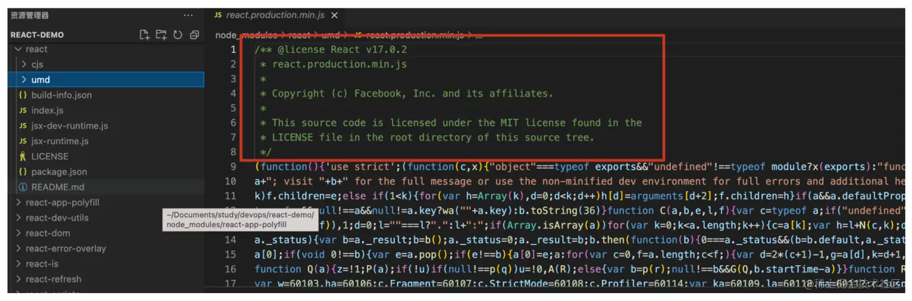
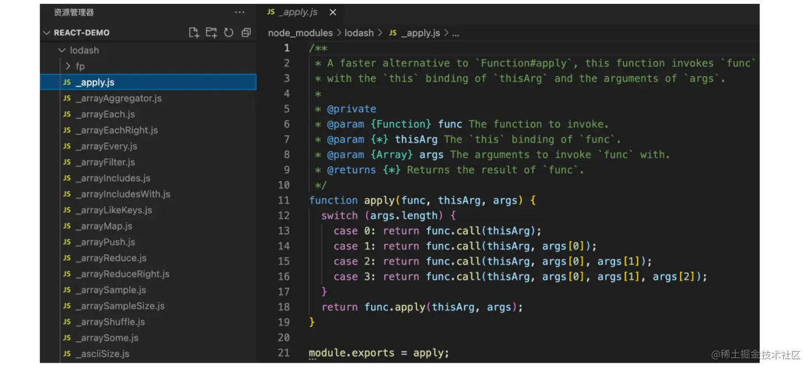
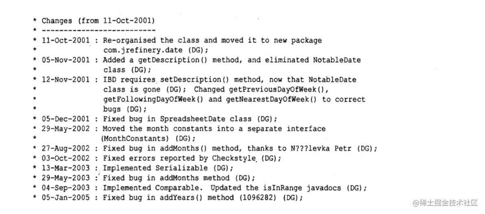
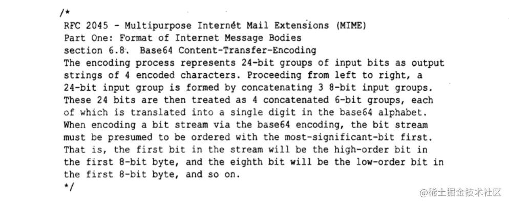
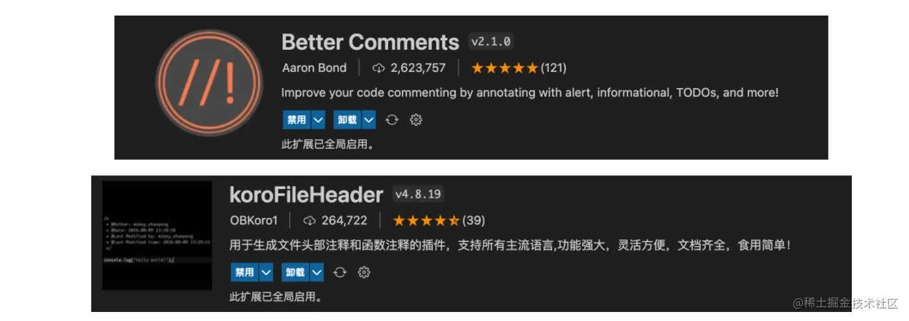

# JavaScript 代码整洁之道

参考：[代码整洁之道 - 理论与实践 - 寻觅人间美好的专栏 - 掘金 (juejin.cn)](https://juejin.cn/column/7055643524095541261)

# 命名篇

## 命名的重要性

命名的重要性，我们这里就不过多叙述啦，总而言之，**命名真的非常的重要，直接关系到整个代码的可读性以及后期的可维护性**

因此，要想让自己的代码更加优雅和整洁，要从命名，函数，注释，格式等多个方面去养成良好习惯。

还要强调两句话：

1. **我们写代码是给人的，是给我们程序猿自己看的，不是给机器看的**，因此，当我们写代码的时候，要经常思考，我们写下的这段代码，别人如果此时看了是否可以比较清晰的理解代码的含义，如果觉得不太好理解，是否意味着我们的代码可以进一步优化呢，是否意味着我们需要加一些注释呢。 总之，都是为了 代码能够让别人也看得懂。
2. **代码写的好不好，和技术能力本身不是成正相关的**，也就是说代码要写好，更多的还是要养成良好的习惯，并且从态度层面去重视这个事情，和技术能力本身没有强相关的关系，当然技术能力本身也很重要，它可以加成让我们的代码可以使用更好的设计模式等去组织代码。

本节内容主要分为三块：

- 理论篇： 主要结合了【代码整洁之道】这本书里所讲到的命名思想（推荐大家可以完整的看一下）
- 命名规范：主要是结合了目前市场常见的第三方代码规范库，以及公司的代码规范。
- 命名实战：主要是根据实际开发经验，以及各种不同场景下的命名分别进行了总结。

## 理论篇

### 一. 使用具有明确含义的单词

这是命名的最重要规则啦，其实就是`我们使用的名称要有其实际含义，其他程序员看了能够大概知道这个变量表示的是什么意思，而不是看了一脸懵逼。`

说到这儿，就不得不说我们刚开始写代码的时候啦，很容易写出如下代码：

```javascript
let a = 1;
let b = 2;
let num1 = 1;
let num2 = 2;
```

很显然，上面这些都是 bad case，我们再来体会一个例子：

例如：后端返回一个用户列表，刚开始写代码的时候，很容易写出：

```javascript
let arr = ["user1", "user2", "user3", "user4"];
```

此时，其他程序员看了 arr，虽然知道它可能是一个数组，但是却不知道它到底存储的是什么数据，也是一个 bad case，我们可以优化一下：

```javascript
let users = ["user1", "user2", "user3", "user4"];
let userList = ["user1", "user2", "user3", "user4"]; // List在其他语言中可能是一个关键字，不推荐使用，而在JS中其不是关键字，可以使用。
```

### 二. 做有意义的区分

通过第一条规则，相信我们在项目中可以基本保证不同的模块可以使用不同的单词去命名啦，例如：用户模块我们可以用 user 去命名，权限模块我们可以使用 permission 去命名，但是还远远不够。

因为在实际项目中，有很多相似的场景，例如：一个用户模块就可以细分为：获取用户基本信息，获取用户列表等，相信我们在不同的项目下经常会看到下面这些命名：

```javascript
getUser();
getUserData();
getUserInfo();
getUserList();
getUsers();
```

其他程序员一看用户模块代码，有这么多个方法，但是能分辨清楚各个函数有什么区别吗？很显然不能，比如：getUser()和 getUserData()，光从命名上看其实并没有区别，但是我们却用它们写了不同的逻辑，这样就很容造成歧义， 这就是 我们要说的：`要做有意义的区分：即需要我们去区分两个子模块或者场景的时候，我们一定要采用两个有明确不同含义的命名去区分它们，而不是使用意思相近，很容易混淆在一起的`。

类似的常见错误还有：account 与 accountData, customer 与 customerInfo, money 与 moneyAmount 等，都其实没有什么区别，在实际项目开发中，我们使用其中一种命名方式即可，不过这里要注意：一定要在整个项目中一以贯之，比如：获取用户信息，我们决定使用 ge tUserInfo()，那么其他地方统一用以 info 结尾的，比如，获取其他详情：getPermissionInfo, getAccountInfo 等，我们后面还会讲到！

### 三. 使用可以读得出来的单词

造成代码不可读，很大的原因是使用了单词缩写，而且还是那些不经常见的缩写，如果多个缩写驼峰拼接在一起，那就更难读了，其他程序员看了也更是一脸懵逼，例如：添加文章

```javascript
addArt(); // bad case
addArticle(); // 推荐
```

很明显，addArt 即不好读，也很容易引起歧义，`我们在实际开发中尽量少使用缩写，如果使用，也是那些经常常见的一些缩写`，例如：value 可以缩写为 val, document 可以缩写为 doc.

### 四. 避免使用编码

这里的编码是指：`我们要不要把一些关键字，类型 加到变量的命名中`，例如：

```javascript
const phoneString = "123"; // 后面的String没必要
const phoneNumber = 123132; // 这个还可以，因为电话号码本身就是phoneNumber
```

因为在 js 中，类型之间可以随意赋值，即使我们定义了 phoneString，依然可能被赋值一个 number，所以也很容易一起歧义。

### 五. 使用常见的单词命名

```javascript
尽可能用大家都熟知的一些单词或者语法去命名，不要去用那些不常见的，或者俗语，俚语的写法。 宁可明确，不搞特殊，不扮可爱。
kill(); // 别用 whack()，不知道什么意思的，可以理解为另外一种不常见的写法
abort(); // 别用 eatMyShorts(), 它是一种俚语的写法。
```

### 六. 每个场景对应一个词

这里是指我们在平时开发中，可能固定也就那几种场景，获取数据，更新数据，删除数据等，每个场景我们要给其约定一个固定的词，从而在整个项目中一以贯之，例如：get/set/update/delete 等

```javascript
getUser(); // 获取
updateUser(); // 更新
deleteUser(); // 删除
addUser(); // 添加
```

而不是在项目中，此处添加用的是 add, 其他地方用的又是 create 等其他单词，此处删除用的 delete，其他地方用的又是 drop， 这些都是 bad case 啦。

但是也要注意：用词一定要适合，例如：添加，别什么地方都用 add, 很可能其他场景用的 insert，append 等，我们也要随机应变，不能为了保持一致，而忽略其并不适合当前场景。

### 七. 使用解决领域方案名词

程序员本身这个职业，可能会有其自身的一些专有名词，比如：队列用 queue, 栈用 stack， 我们在实际项目中，要尽可能多使用这些名词。

```javascript
jobQueue; // 任务队列
observer; // 观察者模式
```

这里要强调一点，`设计模式中有很多特有的名词，我们如果实际开发中有相关的场景，我们要尽可能去使用这些设计模式定义的名词`。例如：访问者模式中的 visitor， 发布订阅模式中的：publisher, subscriber 等。

## 命名规范

上面讲到的都是我们平时命名的一些理论知识，总结起来就是：`命名一定要明确的意义，其他程序员看了能看懂！` ，接下来，我们看一下具体有哪些明确的命名规范。

命名规范也很不同的等级，这里我们分为：【必须】【推荐】【可选】三个等级。

在实际开发中，我们一般需要 ESLint 等校验工具，去对代码进行校验，但是我们平时写的时候也一定要按照这些规范去写。

这里，我们列出了：**四必须，五推荐**。

### 【必须】使用小驼峰命名

说明：`实际开发中，所有的变量命名，函数命名等全部遵循小驼峰的写法。`对应 eslint 规则是：camelcase

```javascript
// bad case
const user_list = [];
const userlist = [];

// good
const userList = [];
```

### 【必须】 只有命名类或者构造器函数时，才使用大驼峰命名

```javascript
// bad case
function user(name) {
	this.name = name;
}
const u = new user("kobe");

// good case
function User(name) {
	this.name = name;
}
const u = new User("kobe");
```

### 【必须】当导出类/构造器/函数库/对象时，使用大驼峰

```javascript
首先，类和构造器函数，不管是单独命名还是导出的时候，都统一大驼峰即可，这里要注意的是当导出一个对象的时候，我们也要使用大驼峰。
const User = {
  name: 'kobe',
  age: 41
};
export default User;
```

### 【必须】当导出默认函数时，必须使用驼峰命名法。

```javascript
function formatNumber() {}
export default formatNumber;
```

**注意：推荐文件名尽量和默认导出的名称保持一致，当然文件名建议是 kebab-case**，例如：上面这个 case，文件名应该为 format-number.js 。

### 【推荐】不要以下划线开头或者结尾命名变量

```javascript
// bad case
const _username = "kobe";
const user_name = "kobe";
const username_ = "kobe";
```

注意：这里，有一个细节要强调一下，**大家可能在其他地方看到过，在 js 中，可能会以下划线开头来命名私有属性，但其实只是这样命名只是为了说明该属性是一个私有属性，但其实依然是公开的，调用方依然可以调用到，所以，反而可能会引起歧义，换句话说，如果需要声明私有属性，就需要明确做到其私有，外部无法访问。**

### 【推荐】不要保存 this 的引用，推荐使用箭头函数

```javascript
// bad case
function foo() {
	const self = this;
	return function () {
		console.log(self);
	};
}

// bad case
function foo() {
	const that = this;
	return function () {
		console.log(that);
	};
}

// good case
function foo() {
	return () => {
		console.log(this);
	};
}
```

### 【推荐】文件名推荐使用 kebab-case，即用-隔开

命名文件的时候，推荐大家使用 短横线 隔开来命名。

```javascript
// good case
task - list.vue;
task - detail.vue;
```

当然，实际项目开发中，也经常会遇到小驼峰命名，这个大家随时切换，尽量可以保证一个项目中所有文件的命名规范是统一的。

### 【推荐】缩略词和缩写都必须全部大写或者全部小写

```javascript
// bad case
const HttpRequests = [];

// good case
const httpRequests = [];
const HTTPRequests = [];
```

### 【推荐】export 导出的常量，统一全部大写命名，多个单词用\_隔开。

这块，有几点要注意：

1. export 导出的常量，推荐用大写命名，但是模块内部的常量不需要全大写，正常按照小驼峰即可。
2. export 导出的常量，推荐大写命名，但是其内部属性不必大写。

```javascript
// bad case
const NAME = "kobe";
export const userConfig = {};
// good case
const name = "kobe";
export const USER_CONFIG = {};

// bad case
export const MAPPING = {
	KEY: "value",
};
// good case
export const MAPPING = {
	key: "value",
};
```

## 命名实战

上面讲到了我们推荐使用的一些代码规范，但是在实际开发中，除了遵循这些规范，我们更需要在实际业务中，更复杂的是，面对各种不同的业务场景的命名，如何去使用准确的单词，并且如何把这些单词组合起来，以及单词谁前谁后等问题，都需要我们有一个比较清晰的认知和命名习惯。

### 多个单词如何组合？

在实际的业务场景中，如果是单个单词的模块，那我们直接使用该单词即可，但是很多时候，在命名的时候，很可能是需要多个词组合起来，此时，我们都知道是使用驼峰命名法进行命名，但是多个单词之间的顺序是什么样呢？如何去组合呢？这里面其实也有很多细节的。

1. 我们首先想到是根据文件去拆分不同的子模块

   ```javascript
   | - user
     | - list.js
     | - detail.js
   ```

2. 如果在实际项目中，目录嵌套结构已经比较深，不想再嵌套一层，这是可以直接根据文件名进行区分。

   ```javascript
   userList; // 用户列表
   userDetail; // 用户详情
   ```

3. 以上这些都是比较简单的，除此之外，我们主要是想说一下，同一个模块下，不同的子模块，或者类似的模块在一起的时候，如何去更好的命名，从而区分它们。

   例如：任务模块，可能包含以下内容：

   - 任务 A 列表
   - 任务 B 列表
   - 任务详情
   - 添加任务 A - 弹框
   - 天际任务 B - 弹框

此时，我们很可能会写出下面这样的命名:

```javascript
taskListA;
taskBList;
taskModalA;
taskBModal;
taskDetail;
```

尤其是当我们没有明确自己的习惯的时候，可能这个模块 形容词（如这里的 A,B）放在了中间，另外一个模块又放到了结尾， 导致整个项目的代码看着很乱，因此，我们需要尽量整个项目都保持一致的命名习惯。

这里，**我个人推荐使用：前缀 + 形容词或名词 + 后缀 的模式**。当然，这里只是我个人的命名习惯，不是标准。

我们来具体解释一下：

- 前缀：一般是公共的模块名称：例如：上面讲到的 task
- 形容词或名词：一般模块的两个不同的子模块，或者子内容。例如：上面讲到的 A，B
- 后缀：一般是表示这个模块具体是哪种类型，例如：List 一般表示一个列表或者表格。Detail 表示详情，Modal 表示弹框等。

我们来实际用一个例子体会一下，例如：一个任务模块，包含：任务列表，任务列表筛选栏目，创建单任务，创建多任务，任务详情等模块，我们使用 vue 或者 react 开发的时候，一般都会把它们拆分成独立的文件。

```javascript
taskFilter.vue;
taskList.vue;
taskDetail.vue;
taskSingleModal.vue;
taskMultipleModal.vue;
```

说明：这里说这一点，主要看到很多代码，其实是因为开发者并没有一个自己的一套习惯，导致不同模块之间的命名都不一致。很随机。因此，我们要培养属于自己的一套命名习惯。

### 项目命名

`推荐：统一采用小写，多个单词之间用短斜杠-隔开即可。` 例如：

```javascript
shop - demo;
cms - platform;
```

### 模块命名

不同的模块主要体现在两方面：

1. 根据实际业务场景拆分的模块
2. 项目架构本身拆分的模块

根据实际业务场景拆分的模块，命名很简单，直接根据其实际业务含义翻译一下即可，实在不知道用啥单词，直接用词典翻译一下。

这里，我们主要说一下前端项目架构本身拆分的模块，其实也就是项目目录结构的划分：

这里把常见的一些功能模块的命名罗列一下：

```javascript
views // 存放所有页面，子目录按具体业务模块划分即可
assets // 存放所有资源，例如：图片等
components // 公共组件
router // 路由
store // 状态
utils // 各种自定义工具函数
services // 存放ajax请求相关
注意：模块命名，本质上也是文件命名，其实推荐的是统一小写，多个单词之间使用短斜杠隔开。
```

### 变量命名

`推荐：采用小驼峰去命名变量`， 实际开发过程中，根据具体变量的含义，采用有明确意义的单词去命名即可，多个单词组合时，采用我们第一点提到的技巧即可。

### 常量命名

常量命名主要分为两种：

1. **需要导出的常量：统一全部采用大写，多个词之间用下划线隔开。**
2. **不需要导出，只在文件模块内部使用的常量： 统一小驼峰命名**

### 方法命名

#### 返回布尔类型的方法

| 前缀-prefix | 含义                     | 例如                 |
| ----------- | ------------------------ | -------------------- |
| is          | 表示是否符合某种状态     | isValid() isLoaded() |
| can         | 表示是否可以执行某种操作 | canRemove()          |
| has         | 表示是否持有某种特性     | hasOwnProperty()     |
| needs       | 表示是否需要进行某种操作 | needsUpdate()        |

#### 回调方法

| 前缀-prefix  | 含义             | 例如                         |
| ------------ | ---------------- | ---------------------------- |
| on           | 表示当事件发生时 | onCompleted() onFinished()   |
| before/after | 表示事件发生前后 | beforeUpdate() afterUpdate() |
| pre/post     | 同上             | preUpdate() postUpdate()     |
| Did/will     | 同上             | didUpdate() willUpdate()     |

#### 与操作相关，即增删改查

| 单词                               | 意义                                                                                   | 例如                                            |
| ---------------------------------- | -------------------------------------------------------------------------------------- | ----------------------------------------------- |
| 初始化：init/reset/clear           | Init: 初始化数据 reset: 重置数据，恢复到初始化状态 clear: 清除数据，恢复到初始化状态   | initData() resetData(); clearData();            |
| 读取：get/fetch/load               | get: 获取某数据，可以是本地数据，也可以是远程数据 fetch: 获取远程数据 load: 加载某数据 | getUserList(); fetchUserList(); loadUserList(); |
| 添加：add/append/insert/create     | add/create: 在一个 list 添加一个子项 append/insert: 常见于 dom 操作                    | addUser() appendChild() removeChild()           |
| 删除：delete/remove/destory        | delete: 在一个 list 删除某个子项 remove: 常见于 dom 操作                               | deleteUser()                                    |
| 更新：update                       | update: 更新数据                                                                       | updateUser()                                    |
| 保存：save/apply/commit            | save: 保存数据 apply: 应用 commit: 提交                                                | saveData() applyChange() commitData();          |
| 队列相关：enqueue/dequeue          | enqueue: 对尾添加一个元素 dequeue: 对首移除一个元素                                    |                                                 |
| 栈/数组相关：push/pop/peek/find 等 | 即数组的常见操作                                                                       |                                                 |

#### 成对出现的动词

| 单词           | 与之对应的        |
| -------------- | ----------------- |
| get ：获取     | set ：设置        |
| add: 添加      | delete：删除      |
| create: 创建   | destroy：销毁     |
| start 启动     | stop 停止         |
| open 打开      | close 关闭        |
| read 读取      | write 写入        |
| load 载入      | save 保存         |
| backup 备份    | restore 恢复      |
| import 导入    | export 导出       |
| split 分割     | merge 合并        |
| inject 注入    | extract 提取      |
| attach 附着    | detach 脱离       |
| bind 绑定      | separate 分离     |
| view 查看      | browse 浏览       |
| edit 编辑      | modify 修改       |
| select 选取    | mark 标记         |
| copy 复制      | paste 粘贴        |
| undo 撤销      | redo 重做         |
| insert 插入    | delete 移除       |
| add 加入       | append 添加       |
| clean 清理     | clear 清除        |
| index 索引     | sort 排序         |
| find 查找      | search 搜索       |
| increase 增加  | decrease 减少     |
| play 播放      | pause 暂停        |
| launch 启动    | run 运行          |
| compile 编译   | execute 执行      |
| debug 调试     | trace 跟踪        |
| observe 观察   | listen 监听       |
| build 构建     | publish 发布      |
| input 输入     | output 输出       |
| encode 编码    | decode 解码       |
| encrypt 加密   | decrypt 解密      |
| compress 压缩  | decompress 解压缩 |
| pack 打包      | unpack 解包       |
| parse 解析     | emit 生成         |
| connect 连接   | disconnect 断开   |
| send 发送      | receive 接收      |
| download 下载  | upload 上传       |
| refresh 刷新   | synchronize 同步  |
| update 更新    | revert 复原       |
| lock 锁定      | unlock 解锁       |
| check out 签出 | check in 签入     |
| submit 提交    | commit 交付       |
| push 推        | pull 拉           |
| expand 展开    | collapse 折叠     |
| begin 起始     | end 结束          |
| start 开始     | finish 完成       |
| enter 进入     | exit 退出         |
| abort 放弃     | quit 离开         |
| obsolete 废弃  | depreciate 废旧   |
| collect 收集   | aggregate 聚集    |

### 路由相关

| 前缀     | 后缀 | 例如                          |
| -------- | ---- | ----------------------------- |
| to       | page | toUserPage()                  |
| go       | page | goUserPage()                  |
| redirect | page | redirectUserPage()            |
| Back     | page | backHomePage() backUserPage() |

```
推荐：toXxxPage 或者 goXxxPage 或者backXxxPage 格式。
```

- 跳转到指定页面：toXxxPage()
- 重定向到指定页面：redirectXxxPage()
- 返回上一页： backPrePage();
- 返回首页：backHomePage();

## 总结

本节内容，主要就是从理论到实践，围绕一个问题：如何更好的命名？命名确实是我们写代码的第一步，不管是文件还是模块，还是单个模块中的变量，方法等都需要命名，那我们要做的就是结合命名规范，总结出属于我们自己一套命名习惯，并且保证整个项目或者自己所写的所有代码都可以围绕这套规范展开。

# 注释篇

## 理论篇

相信我们平时的开发中，多多少少都会加一些代码注释，用于去说明对应的代码片段的含义，优雅的注释一定是会有助于代码理解的，但是这里想强调两点：

1. **注释本质上是为了弥补我们直接用代码来表达意图的不明确性，其目的还是服务于代码，因此，我们关注的核心依然是代码，如果能用优雅的代码清晰的表达含义的时候，就没必要再使用注释，同时，我们在写代码的时候，也要尽可能做到用简洁清晰的代码逻辑，而不是用大量的注释来弥补那些糟糕的代码。**
2. **注释也是需要专门去维护的，随着需求的不断迭代，注释很可能也是需要不断去更新的，如果不去维护，时间越久，注释的含义与最新代码的含义差的越远，反而引起歧义**

总结下来就是：`注释，不能美化糟糕的代码`，接下来，我们就看看平时开发中可能多多少少会遇到一些好注释和坏注释。

### 好注释

到底哪些是好注释呢？或者哪些地方需要我们去写注释呢？

#### 法律信息

有时候，公司代码规范要求必须编写与法律相关的注释，例如：版权，著作权等，一般都需要在文件的头部去添加相关法律信息的注释。或者我们平时相关去开源自己相关的一些工具或者库的时候，都可以在文件头部加这样的注释，这也是推荐的。

例如：看一下 react 的源代码文件中：



#### 公共 API 的注释

有时候，比如一个方法可能会出现一些晦涩难懂的参数以及返回值等，这时，我们也可以添加注释，去说明各个参数的含义，以及返回值的含义等。例如：lodash 源代码中的各个方法：



注意：`一般在编写一些工具库或者公共方法的时候，我们一定要把相应的注释都加上，这样其他人在调用你写的这个工具的时候，才能够去更好的理解去怎么使用， 或者我们在项目中，要抽象一个公共的组件的时候，也需要去把各个prop，event的含义去通过注释的方式去阐述清楚。`

当然，不止公共方法，如果我们平时业务开发中，如果有些方法逻辑比较复杂，这时，我们要首先想能不能尽可能去优化代码的逻辑，其次再去考虑是否有必要添加一些注释。

#### TODO 注释

通过 TODO 注释，可以在项目中，把一些暂未实现的功能列表等通过 TODO 注释的形式来记录一下。

#### 警示作用

开发中，可能有些代码逻辑可能会导致某种后果，这时，我们也需要去添加注释去说明一下，从而对看到这段代码的程序员起到一个警示作用。

其实，不仅仅是警示作用，代码中，任何情况下，如果确认在代码逻辑已经足够好，但是依然需要去说明一下的情况下，我们都可以去通过添加注释的形式，去说明或者强调一下。

### 坏注释

#### 注释不认真对待

```javascript
// bad case
// 获取列表
function getTastList() {
	//...
}
```

相信我们平时开发中，大多数都会写过上面这种注释，但其实上面的代码犯了两个错误：

1. 多余的注释：上面这个方法 getTaskList 已经能够通过方法名比较清晰的明白该方法的作用啦，就是获取任务列表。没必要再加注释，注释的作用是为了弥补代码表达的不足，不是每段代码都要加注释，反而是能用代码表达清晰的，就不必再加注释。
2. 误导性注释：既然你选择加注释，那就认真对待注释，加了可以起到效果，不要把注释写的模棱两可，或者可有可无，假如文件中还有一个获取其他列表的方法，那是不是就有歧义啦。

这里只是想强调一下，我们一定要认真对待注释，同时尽可能写的完整和清晰。否则很可能起到反作用。

#### 哪里都加注释

可能团队要求加注释了，于是乎就尽可能的能加注释就全部加了，不管有没有必要，哪里都加，这更是不推荐的，注释的维护也是有成本的，我们反而是应该能用代码表达的就只用代码，尽可能不用注释。

#### 日志式注释

有时候，有些文件可能修改比较频繁，于是会就把所有的修改记录全部添加到注释中，其实也是没有必要的，时间长了，只会越来越冗余。



#### 注释掉的代码

这个大家肯定都做过，某些功能或者代码可能暂时需要隐藏，于是直接把对应的代码注释掉，对于自己来说，可能是更方便啦，但是对于别人啦，当别人看到一段代码注释掉啦，肯定有产生疑问？这段代码是否还有作用，能不能删等？而且注释的代码越多，整体代码质量就会越差。  因此，如果有需要暂时隐藏的功能，我们直接把对应的功能删除即可，其实重新找回来也是很容易的，从 git 历史版本等可以很轻易的找出来。

#### 非本地注释

也就是说 我们写注释时，一定要确保描述了离它最近的代码，而不是在当前地方描述另外一个地方的代码。

#### 注释信息过多

注释的信息过多，也没人愿意看，不仅代码，注释也要简洁，能够说明问题即可。



总结：以上不管是好注释还是坏注释，都可能是我们平时开发中，可能遇到的，也可能就是自己写的，我们通过这节的学习，至少知道了哪些注释是好的，哪些是坏的，以后，我们要可能避免写出这些还注释。总结起来一句话；`能用优雅的代码表达，就不要用注释，如果必须加注释，一定要认真去维护和书写注释。`

## 规范篇

### 【必须】使用/_ ... _/进行多行注释

```typescript
// bad case
// getNumber() return a new number
// @param {Number} number
// @return {Number} number
function getNumber(number) {
	return number;
}

// good case
/*
 * getNumber() return a new number
 */
function getNumber(number) {
	return number;
}
```

### 【必须】 `/** ... */` 风格（首行有两个 \*）的块级多行注释仅能被用于 JSDoc。

也就是说：我们上面第一点提到的多行注释，首行是使用单* 的，这种方式相当我们可以自定义的格式自由组织注释的内容，但是如果使用首行双*的话，仅能被用于 Jsdoc， Jsdoc 是什么呢？官网链接如下：[JSDoc 官网](https://jsdoc.app/)， 简单理解为它就是一个根据 javascript 文件中注释信息，生成 JavaScript 应用程序或库、模块的 API 文档 的工具。后面还会详细讲一下其使用。

```javascript
// good case
/**
 * getNumber()
 * @description: 描述
 * @params {类型} 参数名 Must
 * @params {类型} 参数名 Optional
 * @returns {类型}
 */
function getNumber(number) {
	return number;
}
```

**拓展：当我们写一些公共工具库或者函数的时候，可以推荐使用该 JSDoc，可以帮助我们更规范的生成注释内容。**

### 【推荐】使用//进行单行注释

除此之外，还有两点要注意：

1. 一般将单行注释放在需要被注释的行的上面新行。
2. 建议在注释之前放一个空行，除非它在块的第一行。

注意：通过前面的理论篇的学习，大家再看下面这些代码的时候，很可能产生这样一个疑问：下面好多代码的注释都是无用注释呀，本身命名已经很好的说明其含义啦，没必要再加注释，哈哈哈，是的，你说的非常对，也说明你掌握了对理论篇的内容哈，而下面的 case 只是从代码规范的角度，看注释放到哪里比较合适，以及注释的格式怎么样比较规范，而注释的具体内容，以及是否需要注释不是本节的关注点。

```javascript
// bad case
const username = "kobe"; // username: 用户名

// good case
// username: 用户名
const username = "kobe";

// bad case
function getNumber(number) {
	console.log("get number...");
	// 把参数赋值给变量
	const num = number;
	return num;
}

// good case
function getNumber(number) {
	console.log("get number...");

	// 把参数赋值给变量
	const num = number;
	return num;
}

// good case
function getNumber(number) {
	// 获取number
	console.log("get number...");
	const num = number;
	return num;
}
```

### 【必须】使用一个空格开始所有的注释，不管是单行还是多行。

```javascript
// bad case
//username: 用户名
const username = "kobe";

// good case
// username: 用户名
const username = "kobe";

// bad case
/*
 *getNumber() return a new number
 *@params {Number} number
 *@return {Number} number
 */
function getNumber(number) {
	return number;
}

// good case
/*
 * getNumber() return a new number
 * @params {Number} number
 * @return {Number} number
 */
function getNumber(number) {
	return number;
}
```

### 【推荐】使用 // FIXME: 注释当前存在的问题

即如果发现代码中有一些可能存在的问题，或者需要重新讨论的问题，可以使用// FIXME: xxx 来注释。

```javascript
// good case
function getNumber(number) {
	// FIXME: 这里不应该使用全局变量num
	num = 0;
	return number;
}
```

### 【推荐】 使用// TODO: 注释暂未实现或者待解决的问题

```javascript
// good case
function getNumber(number) {
	// TODO: 这里的状态需要单独维护起来，不应该使用魔术数字。
	const status = 0;
	return number;
}
```

## 实战篇

怎么添加注释，以及注释的基本格式等内容，我们在规范篇已经清楚啦，实战篇，我们主要围绕实际项目开发中，有哪些地方需要加注释展开。

### 公共 API 添加注释

不管是 vue 还是 react，项目中肯定会有一个专门 utils 文件夹去维护自定义的一些工具方法，这些方法我们要尽可能把注释加上，推荐使用 j sdoc 去添加注释。其次就是一定会有一个 components 目录去维护项目中的公共组件，那组件中定义的 props，事件等也需要添加注释。

### 每个模块文件头部都添加注释

这里指的是，平时业务项目开发中，一定会拆分成很多不同的模块，同时，由于项目的类型不同，例如电商，医疗等不同类型，就会涉及到很多专业名词，因此，建议`在每个模块的文件头部都使用多行注释，去说明当前模块是什么模块，以及包含哪些子模块等` 。当然，这一点是我个人的开发习惯，大家根据实际情况决定即可。

```javascript
/*
 *  权限管理模块：
 *  1. 权限列表
 *  2. 添加权限
 *  3. 权限详情
 */

// 代码部分
// ...
```

同时，在单个文件中，可能存在多个模块的变量，我们尽可能把相同模块的变量组织到一起，然后加一个统一的注释等。

### 逻辑复杂的代码块需要添加注释

在项目中，肯定会遇到那种逻辑比较复杂的场景，比如后端返回一个比较差的数据格式，自己需要做比较多的数据转换的操作，而且还要针对不同情况去做适配处理等，总之，就是很复杂，这时，我们也可以通过添加注释的方法，进一步说明一下。

还有一些代码逻辑比较重要，或者自己想强调一下，这个时候，也可以通过添加注释的形式去强调。

### vscode 注释插件推荐

这里，推荐两款：

- Better Comments：特点是可以改变注释的颜色，通过不同颜色来表示不同情况
- koroFileHeader：特点是可以在文件头部快捷添加注释和函数注释。



插件具体使用细节，可以参考官网即可。

## 总结

通过本节的介绍，相信大家已经对注释，以及如何去进行注释有了进一步的了解，总计下来

1. 核心还是代码质量，代码能表达清楚的，就不需要注释
2. 即然要加注释，就要把注释加的准确清晰完整。
3. 同时了解到了常见的需要加注释的场景。
4. 介绍了常用 vscode 注释插件。

接下来，就是大家在项目中，逐步去根据上面说到的这些点去应用到实际项目开发中，逐渐养成自己的习惯。

# 如何写一个优雅的函数

## 前言

我们平时项目开发的过程中，一定会写各种各样的函数，说到函数，可能第一时间想到的就是：函数名，函数参数，函数体，函数返回值。确实函数基本就包含以上四部分，但是，每一部分其实又包含了不少细节需要我们去注意，这就是本节需要去讨论的事情。

在此之前，自己首先想一下自己在平时写函数的时候，有没有想过以下这些问题：

1. 函数名如何去定义才比较规范？
2. 函数参数传几个最合适，参数的前后顺序有要求吗？还是说就随便写啦，哪个在前哪个在后无所谓？
3. 函数体写多少行代码最合适？自己最多写过多长的函数？
4. 返回值该什么时候加呢？到底什么样的函数需要返回数据？什么样的函数不需要返回数据？

之所以问这些问题，主要就是想强调一下，要真正写出一个优雅的函数，其实有很多细节需要去注意，而且很多细节是我们平时写的时候可能就从来没有思考过的注意点，至少我刚开始写代码的时候，是这样的，哈哈哈。

那老规矩，继续从以下三方面去阐述：

- 理论篇
- 规范篇
- 实战篇

## 理论篇

### 只做一件事儿

顾名思义，我们要保证我们的函数功能是拆分非常清晰的，`每个函数都只做一件事儿`，当发现该函数越来越大时，我们就需要考虑是否可以再进一步拆分出多个子函数，从而保证我们每个函数实现的功能都是只做了一件事儿，这样函数也会更加简洁和纯粹。

### 无副作用

说到函数副作用，大家可能会想到函数式编程中的纯函数，即保证同样的输入每次都有相同的输出，不能有任何的副作用，纯函数固然是美好的，我们也不用担心有其他意想不到的结果出现。

但是在我们平时采用 vue，react 等框架开发时，完全使用纯函数那是不可能的，也做不到。不过这种思想我们是可以延续到我们平时的代码中的，即我们要尽可能保证一个函数是纯粹的，这里的纯粹不是指纯函数，而是只做一件事儿，尽可能去减少副作用。

例如：我们写一个读取文件的函数，正常思路也就是三步：读取-数据格式转换-输出。 但是我们却在该方法中又读取了数据库，很显然该函数的功能就不是只做一件事儿啦。

### 明确函数场景

什么是函数的场景？其实说白了就是用函数去做什么事情？从我们平时开发来说无外乎下面两种情况：

1. 去执行某种操作：可能是是连续的几个动作的执行。
2. 去获取数据：典型的就是从后端发送请求获取数据。

如果还不是特别理解，我们换个角度，从参数和返回值的角度来分析：

1. 无参数，无返回值
2. 无参数，有返回值
3. 有参数，无返回值
4. 有参数，有返回值

我们最后再两者结合起来看：

1. 如果是执行某种操作，一般都是没有返回值的，参数可能有，也可能没有，要看该操作是否依赖其他数据。
2. 如果是去获取数据：一般都是有返回值的，参数可能有，也可能没有.

为什么要说这些呢？其实就是**我们写一个函数时，要明确去到底是属于哪种场景，不要混用**，例如：下面的函数

```javascript
function set(attr, val) {
	this[attr] = val;
	if (this["age"] > 30) {
		console.log("true");
		return true;
	} else {
		console.log("false");
		return false;
	}
}
```

上面的代码有什么问题呢？ 我们一看到 set 函数，就会觉得该函数的大概功能是要为某个数据设置新的属性和值，正常是没有返回值的，结果我们却发现该函数体中，还有一部分代码是校验年龄，有返回值。很显然，这段代码犯了一下两个错误：

1. 没有只做一件事儿
2. 没有明确函数的场景，正常逻辑 set 函数一般是不会有返回值的，而这里却还返回 true/false，这是很迷惑的。

那如何修改呢？

1. 按照 函数只做一件事儿的思想，我们需要把校验年龄的逻辑单独抽成一个函数。
2. 修改函数名，保证其名与其内部实现的功能是一致的。

```javascript
function setAndCheckAge(attr, val) {
	this[attr] = val;
	return checkAge();
}
function checkAge(age) {
	if (age > 30) {
		console.log("true");
		return true;
	} else {
		console.log("false");
		return false;
	}
}
```

注意：上面的代码大家可以不用过多在意其实际逻辑是否合理哈，例如：怎么在 set 方法里校验年龄呀，是的，实际开发中，很可能不会有这样的业务逻辑，这里只是借助说明其思想。

### 函数参数

```
最理想的情况是参数是零（零参数函数），其次是一（一参数函数），再次是二（二参数函数），应该尽量避免三（三参数函数），必须有足够的理由才可以使用三或者三个以上的参数。
```

因为参数越多，各种组合情况也就越多，那么也就意味着函数内部的逻辑会越复杂。

对于函数参数，总结了一下以下思想：

1. 尽可能的减少函数参数的个数。 如果有多个参数，那就涉及到参数的顺序，我们就需要考虑哪些参数应该放在前面，哪些参数应该放在后面。

**如果参数确实特别多，就要考虑是否可以把同类型的参数封装到一个参数对象中。**

### 别重复自己

即我们一定要保证代码的可复用性，函数更是重中之重，如果有一些公共的函数，我们一定要单独抽象出来。千万别重复定义相同功能的函数。

## 规范篇

规范篇，我们分别从以下几个方面去说明：

- 函数声明
- 函数参数
- 函数调用
- 箭头函数

### 函数声明

#### 【可选】 使用命名的函数表达式代替函数声明 eslint: [`func-style`](https://eslint.org/docs/rules/func-style)

原因：使用函数声明的方式会存在生命提升，也就是说在函数声明之前调用也不会报错。虽然从语法层面是可以运行成功，但是从代码可读性以及可维护性等角度来考虑的话，这样的逻辑显然不符合正常思维，即先声明后调用的逻辑。

```javascript
// bad case
function foo() {
	// ...
}

// good case
const foo = () => {
	// ...
};
```

#### **【必须】** 把立即执行函数包裹在圆括号里。

原因：主要也是从代码可读性的角度来考虑，函数立即调用属于一个相对独立的单元，外面统一用一层小括号包裹，更清晰。

```javascript
// bad case
(function () {
	// ...
})();

// good case
(function () {
	// ...
})();
```

#### **【必须】** 切记不要在非功能块中声明函数 (`if`, `while`, 等)。

```javascript
// bad case
if (flag) {
	function foo() {
		console.log("foo");
	}
}

// good case
let foo;
if (flag) {
	foo = () => {
		console.log("foo");
	};
}
```

#### **【推荐】** 永远不要使用函数构造器来创建一个新函数。

```javascript
// bad case
let foo = new Function("a", "b", "return a + b");
```

#### **【必须】** 函数声明语句中需要空格

```javascript
// bad case
const a = function () {};
const b = function () {};
const c = function () {};
function d() {
	// ...
}

// good
const a = function () {};
const b = function a() {};
function c() {
	// ...
}
```

### 函数参数

#### **【必须】** 永远不要给一个参数命名为 `arguments`。 这将会覆盖函数默认的 `arguments` 对象。

```javascript
// bad case
function(arguments) {
  // ...
}

// good case
function(args) {
  // ...
}
```

#### **【推荐】** 使用 rest 语法 `...` 代替 `arguments`

这里，主要是说明，如何获取 arguments 的参数。

1. Array.prototype.slice.call(arguments)
2. ...arguments 【推荐】

```javascript
// bad case
function foo() {
	const args = Array.prototype.slice.call(arguments);
	return args.join("");
}

// good case
function foo(...args) {
	return args.join("");
}
```

#### **【推荐】** 使用默认的参数语法，而不是改变函数参数。

这里主要是想说明，如何给参数设置默认值，方法其实有很多种：

1. 判断参数是否为空，然后手动赋值一个默认值
2. 使用默认值语法【推荐】

```javascript
// bad case
function foo(options) {
	if (!options) {
		options = {};
	}
}
// bad case
function foo(options) {
	options = options || {};
	// ...
}

// good case
function foo(options = {}) {
	// ...
}
```

但是要注意：设置默认值的时候，一定要避免副作用。例如：

```javascript
let opts = {};
function foo(options = opts) {
	// ...
}
opts.name = "kobe";
opts.age = 41;
```

说明：上面这个 case 就是说，虽然使用了参数默认值，但是该默认值引用的是外部的一个引用对象，很显然，这是存在副作用的，因为外部的对象随时可能会变化。一旦变化，就会导致我们的默认值也会改变。因此这些写法是有问题的，避免使用！

#### **【推荐】** 总是把默认参数放在最后。

```javascript
// bad case
function foo(options = {}, name) {
	// ...
}

// good case
function foo(name, options = {}) {
	// ...
}
```

#### **【推荐】** 不要改变入参，也不对参数进行重新赋值. eslint: [`no-param-reassign`](https://eslint.org/docs/rules/no-param-reassign.html)

原因：当我们把一个变量当作参数传入函数以后，如果在函数内部对该变量又重新赋值或者修改，会直接导致该变量发生变化，那其他地方如果引用了该变量，很可能造成意想不到的问题。（注意：这里的变量主要是指的是引用数据类型，因为基础数据类型当作函数参数时会直接 copy 一份）

```javascript
// bad case
function foo(a) {
	a = 1;
}

// good case
function foo(a) {
	let b = a || 1;
}
```

**说明：因为我们在调用的时候，不确定传入的 a 是引用数据类型，还是基本数据类型，所以一律要求不对入参进行修改，** 但是此时可能会有一个疑问？因为在 js 修改入参的场景还是挺多的，典型的就是：遍历一个列表，手动添加索引或者标识位等。例如：下面的代码：

```javascript
const list = [];
list.forEach((item, index) => {
	item.index = index;
	item.isShow = index > 2;
});
```

以上代码其实还是比较常见的，如果遇到这种情况，eslint 会提示 no-param-reassign。怎么解决呢？

1. 在当前代码出关闭该规则校验，注意：不是全局关闭，因为大多数场景下，还是不建议对入参进行修改的。
2. 使用深克隆，先拷贝一份 item 出来，再对其进行修改，然后再 return 新的 item。

### 函数调用

#### **【推荐】** 优先使用扩展运算符 `...` 来调用可变参数函数

```javascript
// good case
console.log(...[1, 2, 3, 4]);
```

### 箭头函数

#### **【推荐】** 当你必须使用匿名函数时 (当传递内联函数时)， 使用箭头函数。

```javascript
// bad case
[1, 2, 3].map(function (x) {
	const y = x + 1;
	return x * y;
});

// good case
[1, 2, 3].map((x) => {
	const y = x + 1;
	return x * y;
});
```

#### 【推荐】只有一个参数是可以不使用括号，超过一个参数使用括号

```javascript
// bad case
[1, 2, 3].map((item) => item + 1);

// good case
[1, 2, 3].map((item) => item + 1);
```

#### 【推荐】当函数体是一个没有副作用的表达式组成时，删除大括号 和 return，否则保留。

```javascript
// bad case
[1, 2, 3]
	.map((item) => {
		return item + 1;
	})

	[
		// good case
		(1, 2, 3)
	].map((item) => item + 1);
```

同时，也要注意，如果表达式中包含`>=`,`<=`等比较运算符时，推荐使用圆括号隔离一下，因为他们和箭头函数符号`=>`容易混淆。

```javascript
// bad case
[1, 2, 3]
	.map((item) => (item >= 1 ? 1 : 0))

	[
		// good case
		(1, 2, 3)
	].map((item) => (item >= 1 ? 1 : 0));
```

## 实战篇

通过理论篇和规范篇，我们基本已经了解到了，写好一个函数，有哪些需要注意的地方，其中有一个点十分重要：`明确函数场景`，换句话说，明确函数什么时候该有参数，什么时候该有返回值？

针对这一点，这里再多强调一下，因为平时写代码的时候，确实会写很多函数，也遇到很多看起来不是特别整洁，清晰的函数，这里我们从一个实际例子出发再进一步说明一下：

例如：我们要从后端获取表格数据，渲染出来，但是，后端返回的数据不符合表格的格式，需要我们手动转换一下，于是，我们很容易写出下面这样的代码：

```javascript
let rawData = [];
let tableData = [];
const transformRawData = () => {
    tableData = rawData.map(item => {
        // 经过一系列处理...
    });
}
const render = () => {
  rawData = await fetchRawData();
  transformRawData();
}
```

以上代码，有什么问题呢？问题还是出在 transformRawData 方法上，顾名思义，该方法的主要作用就是转换数据，那么也就意味着应该有一个入参，同时转换之后的结果，也应该体现在返回值上，所以也应该有返回值。而我们现在没有这样处理，而是直接依赖全局变量，直接进行转换。

虽然功能上没有什么问题，但是从代码层面是可以进一步优化的。

```javascript
let rawData = [];
let tableData = [];
const transformRawData = (data) => {
	return data.map((item) => {
		// 经过一系列处理...
	});
};
const render = async () => {
	rawData = await fetchRawData();
	tableData = transformRawData(rawData);
};
```

改成这样以后，transformRawData 就变成了一个更加纯粹的函数。不依赖全局变量，它的作用就是对传入的参数进行数据格式转换，转换之后，返回新的数据。

## 总结

相信通过本节的学习，大家对函数如何去写有了进一步的认识，最后，我们在强调两点：

**保证函数只做一件事儿，减少其副作用 明确函数的使用场景【注意：这一点其实是平时写代码时常犯的错误】**

同时，结合 aslant，prettier 等格式化工具，对函数定义的格式进行进一步的校验，希望大家一起在 2022 年，能够把函数写的越来越好呀，一起加油！
