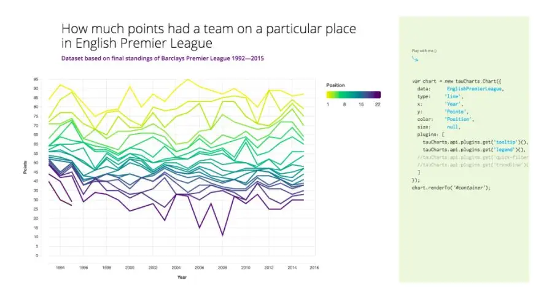

# JavaScript学习工具网站

## JavaScript 秘密花园

https://bonsaiden.github.io/JavaScript-Garden/zh/

一个一直更新的JavaScript 的语法文档，主要会写如何去避免一些常见的错误，以及找到很难发现的 bug ，比较深入 JavaScript 的语言特性。

## JS Tips - JS 技巧

https://www.jstips.co

每天一个 Javascript 小知识。

## JSweekly - 技术周刊*

https://javascriptweekly.com

专门讲解 Javascript 的技术周刊。 

## CDNJS - JavaScript 资料库

https://cdnjs.com/libraries

CDNJS 为开发者提供最新的前端 Web 开发资源，免费使用，无使用限制。你可以直接在自己的网页上引用这些 JS 文件。进入 CDNJS 网站后，搜索你想要的资源库，找到后点击项目后方的[ Copy Script Tag] ，然后贴上就可以用了。目前 CDNJS 在 Web 前端的 CDN 服务中排名第二（第一名是 Google），性能出色。

## Beautiful Open - 开源 JS 库集合

https://beautifulopen.com

收集各类卓越设计的开源项目，大到CMS内容管理系统，小到常用的Javascript库，适合网站开发的用户使用。

## JavaScript Fun - 代码库集合

https://www.javascript.fun

一个集合当下最流行的 JavaScript 代码库，显示流行排行，开发者可以轻松的找到想要最新的代码插件、工具和博客。

# 社区和博客

## Stack Overflow - 编程人员问答网

https://stackoverflow.com

全球IT界最受欢迎的技术问答网站之一，一个解决 bug 的社区，称为“ 编程界的十万个为什么 ”。

## 掘金 - 高质量技术社区

https://juejin.cn

掘金技术社区是质量很高的技术分享社区，技术大牛和极客们共同编辑筛选的优质干货，这些技术文章包括Android、iOS、前端、后端资源。

## Codrops - 网页设计开发博客

https://tympanus.net

发表技术文章和网页教程，提供经验，少踩坑，资源丰富很丰富，很多优秀的技术都是从这里来的。

# 在线 IDE

## CodePen

https://codepen.io

一个网站前端设计开发平台，针对网站前端代码的一个工具，上面有各种效果的案例特效（炫技），可以在他们的 demo 基础上开发自己的前端设计。

## CodeSandBox

https://codesandbox.io

站如其名，CodeSandBox 网站提供一个在线开发环境的“沙盒”，主流的框架如 React、Vue、Angular 等，都可即开即用、实时编译预览，非常方便。

## JS Bin

https://jsbin.com

另一个轻量级在线编辑器网站，界面简洁干净，临时想调试简单的 HTML 或 JS 代码可以考虑去这里试一试。

## tableconvert **- 在线表格编辑器**

https://tableconvert.com

一个功能强大的在线表格编辑器，支持Excel、Markdown、JSON、CSV、HTML等格式的相互转换。当需要转换表格，又不能让它变形，不妨试试这款工具。

## HTML5 + CSS 3 免费模版

https://html5up.net/

提供大量的HTML5模版，用户可以自己分享和修改模版。

# 推荐的网站汇总

1. CSS battle : https://cssbattle.dev
2. Learn CSS layout：http://learnlayout.com
3. Flexbox Froggy：http://flexboxfroggy.com
4. EnjoyCSS：https://enjoycss.com
5. CSS-Tricks ：https://css-tricks.com
6. Neumorphism：https://neumorphism.io
7. uiGradients：https://uigradients.com
8. JavaScript：https://bonsaiden.github.io/JavaScript-Garden/zh/
9. JS Tips：https://www.jstips.co
10. JSweekly：https://javascriptweekly.com
11. CDNJS：https://cdnjs.com/libraries
12. Beautiful Open ：https://beautifulopen.com
13. JavaScript Fun：https://www.javascript.fun
14. Stack Overflow：https://stackoverflow.com
15. 掘金：https://juejin.im
16. Codrops：https://tympanus.net
17. CodePen：https://codepen.io
18. CodeSandBox：https://codesandbox.io
19.  JS Bin：https://jsbin.com
20. ICONSVG：https://iconsvg.xyz
21. OpenMoji：https://www.openmoji.org
22. Share Icon ：https://www.shareicon.net
23. tableconvert ：https://tableconvert.com
24. Feathericons：https://feathericons.com
25. HTML5UP ：https://html5up.net/

## 七、tidy.js

> tidy.js：https://pbeshai.github.io/tidy/

tidy.js 是一个用于处理数据相关的 JavaScript 库，它包括70多个不同类别的函数(整理、分组、数学、排序等等)

## 八、party.js

> party.js：https://party.js.org/

party.js 还蛮有意思的，你们应该见过很多博客网站，鼠标点击或拖动时会有很多炫酷的动效，这个库就是做这个的，你可以轻松地实现那些效果

## 九、AI去背景

> baseline：https://baseline.is/tools/background-remover/

baseline 是一款免费的通过AI来去除图片背景的工具网站，支持JPEG、PNG，最终会返回一个透明背景的PNG图片给你

## 十、Layout patterns

> Layout patterns：https://web.dev/patterns/layout/

Layout patterns 是 Google Developers 旗下开发者资源中新增的版块，里面列举了使用CSS构建布局UI，现在列举了11种布局~ 后续应该还会持续增加，探索更多可能，建议收藏

## 十一、Lowdefy

> Lowdefy：https://lowdefy.com/

Lowdefy 是一个开源的低代码框架，通过 YAML 来轻松构建 web 应用、管理面板、 BI 仪表板、工作流和 CRUD 应用

## 十二、uncut

> uncut：https://uncut.wtf/

uncut 是一个现代字体目录网站，重点是开源，可免费用于个人和商用，看了一下总共收录了90种字体，任君挑选~

# JavaScript 动画库

## **1.Three.js** 

超过46K的星星，这个流行的库提供了非常多的3D显示功能，以一种直观的方式使用 WebGL。这个库提供了`<canvas>`、 `<svg>`、CSS3D 和 WebGL渲染器，让我们在设备和浏览器之间创建丰富的交互体验。该库于2010年4月首次推出，目前仍有近1000名贡献者在开发中。

## 2. Anime.js

超过20K的星星，Anime是一个JavaScript动画库，可以处理CSS属性，单个CSS转换，SVG或任何DOM属性以及JavaScript对象。此库允许您链接多个动画属性，将多个实例同步，创建时间轴等。

## 3.Mo.js

超过 14K 星星，是一个用于 Web 的动态图形工具带，具有简单的声明 API，跨设备兼容性和超过1500个单元测试。您可以在DOME或SVG DOME周围移动东西或创建唯一的 mo.js 对象。虽然文档有些稀缺，但是示例很丰富，这里有CSS技巧的介绍。

## 4. Velocity

超过 15k 星星,Velocity是一个快速的 Javascript 动画引擎，拥有与jQuery的 $.animate() 相同的API。它具有彩色动画、转换、循环、画架、SVG支持和滚动。这里是Velocity的高性能引擎的分解，这里是使用该库的 SVG 动画的介绍。

## 5. Popmotion

超过 14K 星星，这个动画库大小只有 11 kb。它允许开发人员从动作创建动画和交互，这些动作是可以启动和停止，可以使用CSS、SVG、React、three创建，js和任何接受数字作为输入的API。

## 6. Vivus

超过 10k 星星，Vivus是一个零依赖的JavaScript类，可以让你为SVG制作动画，让它们具有被绘制的外观。您可以使用许多可用动画之一，或创建自定义脚本来绘制SVG。查看Vivus-instant获取实际示例，亲自动动手练习一下。

## 7. GreenSock JS

GSAP 是一个JavaScript库，用于创建高性能、零依赖、跨浏览器动画，据称在超过400万个网站上使用。GSAP是灵活的，可以与React、Vue、Angular和vanilla JS协同工作。GSDevtools 还可以帮助使用GSAP构建dubug动画。

## 8. Scroll Reveal

拥有15K颗星星和零依赖，这个库为 web 和移动浏览器提供了简单的滚动动画，以动画的方式显示滚动中的内容。它支持多种简洁的效果类型，甚至允许你使用自然语言定义动画。这里有一个简短的 SitePoint教程。

## 9. Hover (CSS)

超过 20k 星星，Hover提供了CSS3支持的悬停效果集合，可应用于链接、按钮、徽标、SVG、特色图像等，在CSS、Sass和LESS中可用。您=可以复制和粘贴希望在自己的样式表中使用的效果，或者引用样式。

## 10. Kute.js

一个完全成熟的原生JavaScript动画引擎，具有跨浏览器动画的基本功能。重点是代码质量，灵活性，性能和大小（核心引擎17k 和 gzipped 5.5k） - 这是一个演示。该库也是可扩展的，因此你可以添加自己的功能。

## 11. Typed.js

超过 7k 星星，这个库基允许你以选定的速度为字符串创建打字动画。你还可以在页面上放置 HTML div 并从中读取以允许搜索引擎和禁用JavaScript的用户访问，由Slack和其他人使用，这个库既流行又非常有用。

# Javascript数据可视化库

例如：https://bit.dev，截图如下：

提示：使用Bit可以在应用之间快速重用UI组件。使用云库为你的团队提供支持，以加快您的应用开发速度。这些都是免费的。

# **1、D3js**

D3.js获得了80Kstars，可能是其中最受欢迎和最广泛的Javascript数据可视化库。D3用于处理基于数据的文档，并使用HTML，SVG和CSS使数据栩栩如生。D3对网络标准的重视使你无需结合专有框架即可将现代浏览器的功能与之结合，而是结合了可视化组件和数据驱动的DOM操作方法。它允许你将任意数据绑定到文档对象模型（DOM），然后将数据驱动的转换应用于文档。这是一个很棒的示例画廊。

但也有人说D3根本不是数据可视化库。

# **2、ChartJS**

一个非常流行的（40k stars）开源HTML 5图表库，用于使用canvas元素的响应式Web应用程序。V.2提供了混合的图表类型，新增了图表轴类型和动画。界面设计简单优雅，具有8种基本图表类型，你可以将库与moment.js组合为时间轴。你也可以在cdnjs上签出库。

# **3、ThreeJS**

这个是非常受欢迎的库（45K stars；1K贡献者）内置用于使用WebGL创建3D动画。该项目灵活而抽象的性质意味着它对于可视化2维或3维数据也很有用。例如，你也可以使用指定的模块通过WebGL进行3D图形可视化。

# **4、Echarts & Highcharts**

百度的Echarts项目（30K stars）是用于浏览器的交互式图表和可视化库。它是用纯JavaScript编写的，基于zrender canvas库。它支持Canvas，SVG（4.0+）和VML形式的渲染图。除了PC和移动浏览器之外，ECharts还可以与节点上的节点画布一起使用，以实现高效的服务器端渲染（SSR）。这是指向完整示例的场景链接，每个示例都可以在交互式场景上播放。

Highcharts JS是一个8Kstars，是基于SVG的广受欢迎的JavaScript图表库，具有旧浏览器的VML和canvas的后备功能。它声称eb被全球100家最大的公司中的72家使用，这使其（可能）成为世界上最受欢迎的JS图表API（Facebook，Twitter）。

# **5、 Metric-Graphics**

MetricsGraphics.js（7k stars）是一个优化的库，用于可视化和布局时间序列数据。它相对较小（最小80kb），并且提供折线图，散点图，直方图，条形图和数据表的狭窄而优雅的选择，以及地毯图和基本线性回归等功能。这是一个交互式示例库的链接。

# **6、Recharts**

Recharts是使用React和D3构建的图表库，可让你将其部署为声明性的React组件。该库提供了本机SVG支持，可通过组件属性高度自定义轻量级依赖关系树（D3子模块）。你可以在docs网站上找到实时示例。

# **7. Raphael**

一个10k stars的Javascript“矢量库”，用于处理网络中的矢量图形。该库使用SVG W3C Recommendation和VML作为创建图形的基础，因此每个图形对象也是DOM对象，您可以附加JavaScript事件处理程序。Raphaël当前支持Firefox 3.0 +，Safari 3.0 +，Chrome 5.0 +，Opera 9.5+和Internet Explorer 6.0+。

# **8、C3js**

C3是8k stars，是一个用于Web应用程序的基于D3的可重用图表库。该库为每个元素提供类，因此您可以通过该类定义自定义样式，并通过D3直接扩展结构。它还提供了各种API和回调来访问图表状态。通过使用它们，你甚至可以在绘制图表后对其进行更新。看一下这些例子：https://c3js.org/examples.html

# **9、 React Virtualized + React Vis + Victory**

React-vis（4k stars ）是Uber的一组React组件，用于以一致的方式可视化数据，包括折线图/面积图/条形图，热图，散点图，轮廓图，六边形热图等。该库不需要具备D3或其他任何数据可见库的知识，并且提供了诸如X / Y轴之类的低级模块化构建块组件。与Bit一起工作的绝佳选择，并且是一个非常有用的库。

React virtualized （12k stars ）是一组React组件，用于有效地渲染大型列表和表格数据。每个发行版均提供ES6，CommonJS和UMD构建，并且该项目支持Webpack 4工作流程。请注意，必须将react，react-dom指定为对等依赖项，以避免版本冲突。赶紧去试试看。

Victory是由Formidable Labs构建的具有超过6k stars 的React可组合React组件的集合，用于构建交互式数据可视化。Victory对Web和React Native应用程序使用相同的API，以实现轻松的跨平台图表绘制。一种优雅而灵活的方法，可以利用React组件来支持实际数据可视化。我个人非常喜欢。

当使用单个组件时，这些库与Bit完美结合，可以在应用程序之间共享并同步它们。

# **10、 CartoDB**

Carto是2k stars，是一种位置情报和数据可视化工具库，用于发现基础位置数据的信息。你可以使用Web表单上传地理空间数据（Shapefiles，GeoJSON等），并在数据集或地图中将其可视化，使用SQL进行搜索，以及使用CartoCSS应用地图样式。这里有很多视频演示（https://vimeo.com/channels/carto），可帮助您理解和入门。

# **11. Raw graphs**

Raw超过5K stars，是电子表格和数据可视化之间的链接，旨在d3.js库的顶部创建基于矢量的自定义可视化。它适用于表格数据（扩展名和逗号分隔的值），以及来自其他应用程序的数据复制粘贴文本后生成可视化数据表。基于SVG格式，可使用矢量图形应用程序进行编辑以进一步完善，也可以直接嵌入到网页中。

# **12. Metabase**

Metabase的运行时间超过11k stars，是一种无需了解SQL即可创建数据仪表盘的快速简便的方法（但对于分析人员和数据专家而言，却具有SQL模式）。你可以创建规范的细分指标，将数据发送到Slack（并使用MetaBot在Slack中查看数据）等等。尽管可能需要维护，但它可能是一个很好用的工具，可以为你的团队内部可视化数据。

# **补充： tauCharts**

tauCharts是一个基于D3且以数据为中心的图表库，有2K左右 stars。该库提供了一个声明性接口，用于将数据字段快速映射到可视界面中，并且其体系结构允许你使用可重用的插件构建并扩展图表。是不是看起也还不错吧？