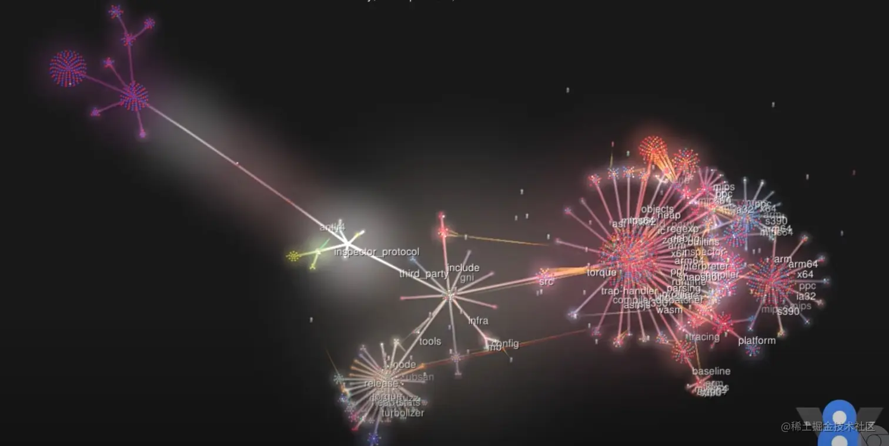
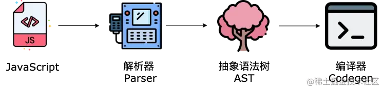
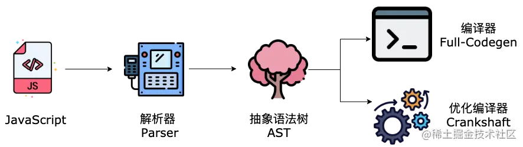
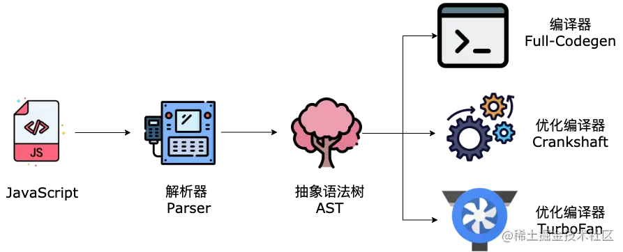
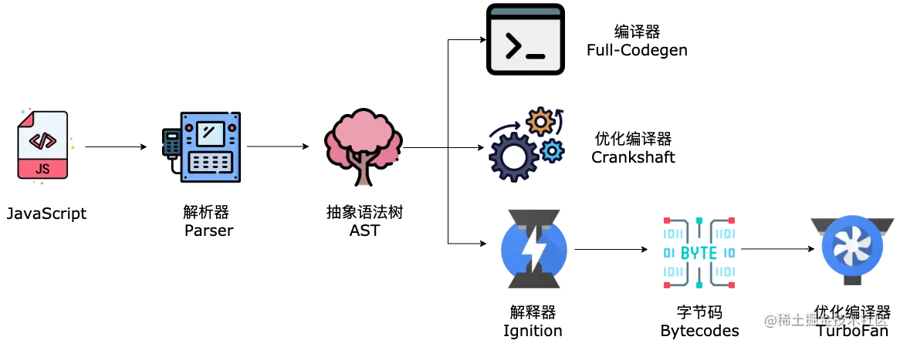
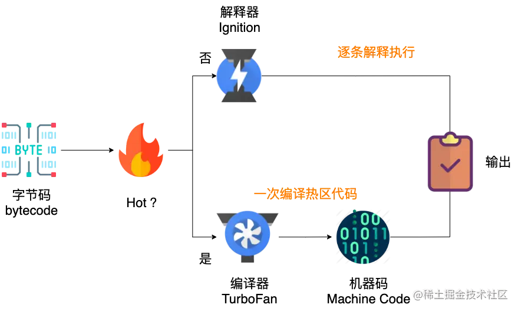
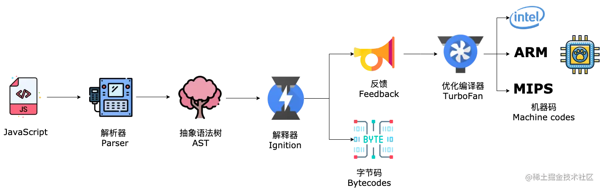
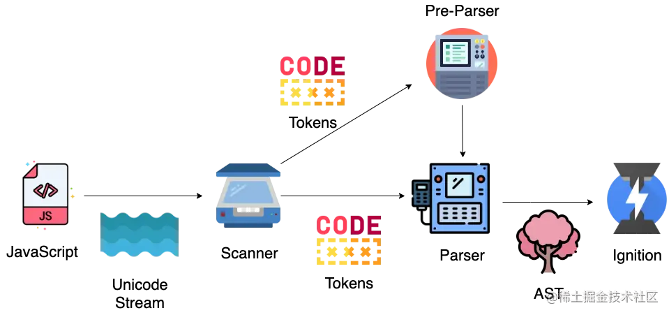
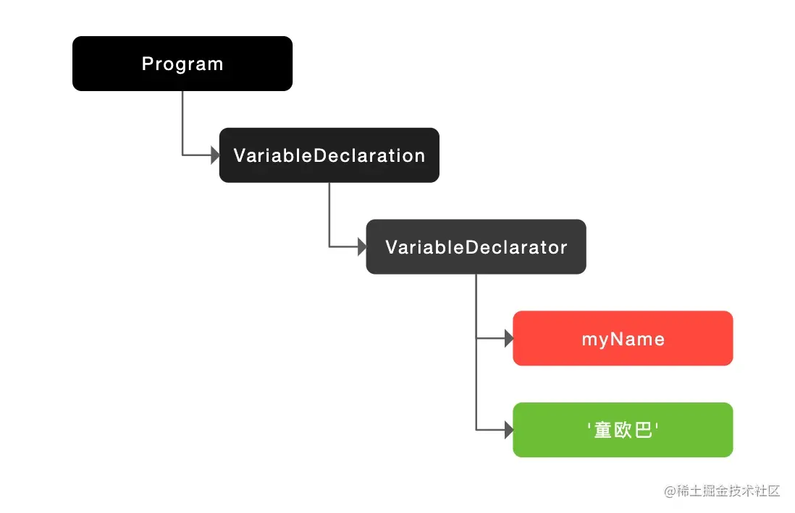
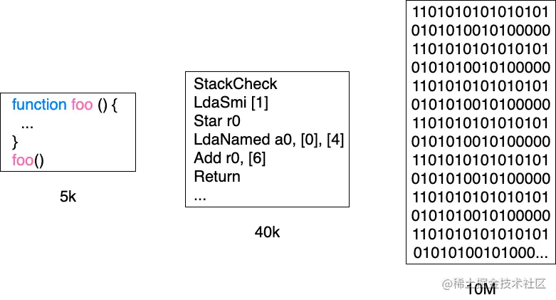

# JavaScript 引擎

学会了 JS 引擎的工作原理，可以更好的理解 JavaScript、更好的理解前端生态中 Babel 的词法分析和语法分析，ESLint 的语法检查原理以及 React、Vue 等前端框架的实现原理。总之，学习引擎原理可谓是一举多得。

## 宏观视角看 V8

V8 是我们前端届的网红，它用 C++ 编写，是谷歌开源的高性能 JavaScript 和 WebAssembly 引擎，主要用在 Chrome、Node.js、Electron...中。

在开始讲我们的主角 V8 引擎之前，先来从宏观视角展开谈谈 V8 所处的位置，建立一个世界观。

在信息科技高速发展的今天，这个疯狂的大世界充斥着各种电子设备，我们每天都用的手机、电脑、电子手表、智能音箱以及现在马路上跑的越来越多的电动汽车。

作为软件工程师，我们可以将它们统一理解为“电脑”，它们都是由`中央处理器(CPU)、存储以及输入、输出设备构成`。CPU 就像厨师，负责按照菜谱执行命令烧菜。存储如同冰箱，负责保存数据以及要执行的命令(食材)。

当电脑接通电源，CPU 便开始从存储的某个位置读取指令，按照指令一条一条的执行命令，开始工作。电脑还可以接入各种外部设备，比如：鼠标、键盘、屏幕、发动机等等。CPU 不需要全部搞清楚这些设备的能力，它只负责和这些设备的端口进行数据交换就好。设备厂商也会在提供设备时，附带与硬件匹配的软件，来配合 CPU 一起工作。说到这里，我们便得到了最基础的计算机，也是计算机之父冯·诺伊曼在 1945 年提出的体系结构。

不过由于机器指令人类读起来非常不友好，难以阅读和记忆，所以人们发明了编程语言和编译器。编译器可以把人类更容易理解的语言转换为机器指令。除此之外，我们还需要操作系统，来帮我们解决软件治理的问题。我们知道操作系统有很多，如 Windows、Mac、Linux、Android、iOS、鸿蒙等，使用这些操作系统的设备更是数不胜数。为了消除客户端的多样性，实现跨平台并提供统一的编程接口，浏览器便诞生了。

所以，我们可以将浏览器看作操作系统之上的操作系统，而对于我们前端工程师最熟悉的 JavaScript 代码来说，浏览器引擎(如：V8)就是它的整个世界。

## 星球最强 JavaScript 引擎

毫无疑问，V8 是最流行、最强的 JavaScript 引擎，V8 这个名字的灵感来源于 50 年代经典的“肌肉车”的引擎。

### Programming Languages Software Award

V8 也曾获得了学术界的肯定，拿到了 ACM SIGPLAN 的 [Programming Languages Software Award](https://www.sigplan.org/Awards/Software/)。

### 主流 JS 引擎

JavaScript 的主流引擎如下所示：

- [V8 (Google) ](https://v8.dev/)
- [SpiderMonkey (Mozilla) ](https://spidermonkey.dev/)
- [JavaScriptCore (Apple) ](https://developer.apple.com/documentation/javascriptcore/)
- [Chakra (Microsoft) ](https://github.com/microsoft/ChakraCore/)
- [duktape(IOT)](https://github.com/svaarala/duktape/)
- [JerryScript(IOT)](https://github.com/jerryscript-project/jerryscript/)
- [QuickJS](https://github.com/bellard/quickjs/)
- [Hermes(Facebook-React Native)](https://github.com/facebook/hermes/)

### V8 发布周期

V8 团队使用 4 种 Chrome 发布渠道向用户推送新版本。

- Canary releases 金丝雀版 (每天)
- Dev releases 开发版 (每周)
- Beta releases 测试版 (每 6 周)
- Stable releases 稳定版 (每 6 周)

想要了解更多，请戳 [V8 引擎版本发布流程](https://zhuanlan.zhihu.com/p/35038142)。

## V8 架构演进史

2008 年 9 月 2 日，V8 与 Chrome 在同一天开源，最初的代码提交日期可追溯到 2008 年 6 月 30 日，你可以通过下面的链接查看 V8 代码库的可视化演化进程。

- [使用 gource 创建的 V8 代码库可视化演化进程](https://www.youtube.com/watch%3Fv%3DG0vnrPTuxZA)



当时的 V8 架构简单粗暴，只有一个 `Codegen` 编译器。



2010 年，V8 中加入了 `Crankshaft` 优化编译器，大大提升了运行时性能。Crankshaft 生成的机器代码比之前的 Codegen 编译器快两倍，而体积减少了 30％。



2015 年，为了进一步提升性能，V8 引入了 `TurboFan` 优化编译器。



接下来到了分水岭，在此之前，V8 都是选择将源码直接编译为机器码的架构。不过随着 Chrome 在移动设备的普及，V8 团队发现了这种架构下存在的致命问题：编译时间过长、机器码的内存占用很大。

所以，V8 团队对引擎架构进行了重构，在 2016 年引入了 `Ignition 解释器和字节码`。



2017 年，V8 默认开启全新的编译 `pipeline(Ignition + TurboFan)`，并移除了 `Full-codegen 和 Crankshaft`。


高性能的 JS 引擎不仅需要 TurboFan 这样高度优化的编译器，在编译器有机会开始工作之前的性能，也存在着大量的优化空间。

于是在 2021 年，V8 引入新的编译管道 `Sparkplug`。

对于 Sparkplug 想要了解更多，请戳[Sparkplug](https://v8.dev/blog/sparkplug)


- 关于 V8 架构演进史，想要了解更多请戳[庆祝 V8 诞生 10 周年](https://v8.dev/blog/10-years)

> 食堂老板娘：原来 V8 架构经历了这么多的变化

食堂老板：是的，V8 团队为了不断的优化引擎的性能，做了很多努力。

## V8 工作机制

```
敲黑板，进入本文的重点。
```

> 食堂老板娘：拿出小本本记好

V8 执行 JavaScript 代码的核心流程分为以下两个阶段：

- 编译
- 执行

```
编译阶段指 V8 将 JavaScript 转换为字节码或者二进制机器码，执行阶段指解释器解释执行字节码，或者 CPU 直接执行二进制机器码。
```

为了对 V8 整体的工作机制有更好的理解，我们先来搞懂下面几个概念。

### 机器语言、汇编语言、高级语言

CPU 的指令集就是机器语言，CPU 只能识别二进制的指令。但是对人类来说，二进制难以阅读和记忆，所以人们将二进制转换为可以识别、记忆的语言，也就是汇编语言，通过汇编编译器可以将汇编指令转换为机器指令。

不同的 CPU 有不同的指令集，使用汇编语言编程需要兼容不同的 CPU 架构，如 ARM、MIPS 等，学习成本比较高。汇编语言这层抽象还远远不够，所以高级语言应运而生，高级语言屏蔽了计算机架构的细节，兼容多种不同的 CPU 架构。

CPU 同样不认识高级语言，一般有两种方式执行高级语言的代码，也就是：

- 解释执行
- 编译执行

### 解释执行、编译执行

解释执行会先将输入的源码通过解析器编译成中间代码，再直接使用解释器解释执行中间代码，输出结果。

编译执行也会将源码转换为中间代码，然后编译器会将中间代码编译成机器码，通常编译成的机器码以二进制文件形式存储，执行二进制文件输出结果。编译后的机器码还可以保存在内存中，可以直接执行内存中的二进制代码。

### JIT (Just In Time)

```
解释执行启动速度快，执行速度慢，而编译执行启动速度慢，执行速度快。
```

V8 权衡利弊后同时采用了解释执行和编译执行这两种方式，这种混合使用的方式称为 `JIT (即时编译)`。

V8 在执行 JavaScript 源码时，首先解析器会将源码解析为 AST 抽象语法树，解释器 (Ignition) 会将 AST 转换为字节码，一边解释一边执行。



解释器同时会记录某一代码片段的执行次数，如果执行次数超过了某个阈值，这段代码便会被标记为热代码(Hot Code)，同时将运行信息反馈给优化编译器 TurboFan，TurboFan 根据反馈信息，会优化并编译字节码，最后生成优化的机器码。

> 食堂老板娘：也就是说，当这段代码再次执行时，解释器就可以直接运行优化后的机器码，不需要再次解释，这样会提升很多性能吧？

食堂老板：对的！

V8 的解释器和编译器的名字寓意非常有趣，解释器 Ignition 代表点火器，编译器 TurboFan 代表涡轮增压，代码启动时通过点火器发动，TurboFan 一旦介入，执行效率会越来越高。

了解了 V8 的大体工作机制，接下来我们继续深入，看一下 V8 核心模块的工作原理。

## V8 核心模块工作原理



V8 的核心模块包括：

- [Parser](https://v8.dev/blog/scanner/)：解析器负责将 JavaScript 代码转换成 AST 抽象语法树。
- [Ignition](https://v8.dev/docs/ignition/)：解释器负责将 AST 转换为字节码，并收集 TurboFan 需要的优化编译信息。
- [TurboFan](https://v8.dev/docs/turbofan)：利用解释器收集到的信息，将字节码转换为优化的机器码。

V8 需要等编译完成后才可以运行代码，所以解析和编译过程中的性能十分重要。

### 解析器 Parser



解析器的解析过程分为两个阶段：

- 词法分析 (Scanner 词法分析器)
- 语法分析 (Pre-Parser、Parser 语法分析器)

#### 词法分析

`Scanner` 负责接收 `Unicode Stream` 字符流，将其解析为 `tokens`，提供给解析器 `Parser`。

比如下面这段代码：

```js
let myName = "童欧巴";
```

会被解析成 `let`，`myName`，`=`，`'童欧巴'`，它们分别是关键字、标识符、赋值运算符以及字符串。

#### 语法分析

接下来，语法分析会将上一步生成的 tokens，根据语法规则转换为 AST，如果源码存在语法错误，在这一阶段就会终止并抛出语法错误。

可以通过这个网站查看 AST 的结构：[astexplorer.net/](https://astexplorer.net/)

也可以通过这个链接[resources.jointjs.com/demos/javas…](https://resources.jointjs.com/demos/javascript-ast)直接生成图片，如下所示：



得到了 AST，V8 便会生成该段代码的`执行上下文`。

#### 惰性解析

主流的 JavaScript 引擎都采用了`惰性解析(Lazy Parsing)`，因为源码在执行前如果全部完全解析的话，不仅会造成执行时间过长，而且会消耗更多的内存以及磁盘空间。

惰性解析就是指如果遇到并不是立即执行的函数，只会对其进行`预解析(Pre-Parser)`，当函数被调用时，才会对其完全解析。

预解析时，只会验证函数的语法是否有效、解析函数声明以及确定函数作用域，并不会生成 AST，这项工作由 `Pre-Parser` 预解析器完成。

### 解释器 Ignition

得到了 AST 和执行上下文，接下来解释器会将 AST 转换为字节码并执行。



> 食堂老板娘：为什么要引入字节码呢？

引入字节码是一种工程上的权衡，从图中可以看出，仅仅是一个几 KB 的文件，生成的机器码就已经占用了大量的内存空间。

相比机器码，`字节码不仅占用内存少，而且生成字节码的时间很快，提升了启动速度`。虽然字节码没有机器码执行速度快，但是牺牲了一点执行效率，换来的收益还是很值得的。

况且，字节码与特定类型的机器码无关，通过解释器将字节码转换为机器码后才可以执行，这样也使得 V8 更加方便的移植到不同的 CPU 架构。

你可以通过如下命令，查看 JavaScript 代码生成的字节码。

```shell
node --print-bytecode index.js
```

也可以通过如下链接进行查看：

- [V8 解释器的头文件，包括所有字节码](https://github.com/v8/v8/blob/master/src/interpreter/bytecodes.h/)

我们来看一段代码：

```js
// index.js
function add(a, b) {
	return a + b;
}

add(2, 4);
```

上面的代码在执行命令后，会生成如下的字节码：

```shell
[generated bytecode for function: add (0x1d3fb97c7da1 <SharedFunctionInfo add>)]
Parameter count 3
Register count 0
Frame size 0
   25 S> 0x1d3fb97c8686 @    0 : 25 02             Ldar a1
   34 E> 0x1d3fb97c8688 @    2 : 34 03 00          Add a0, [0]
   37 S> 0x1d3fb97c868b @    5 : aa                Return
Constant pool (size = 0)
Handler Table (size = 0)
Source Position Table (size = 8)
0x1d3fb97c8691 <ByteArray[8]>
```

其中，Parameter count 3 表示三个参数，包括传入的 a，b 以及 this。字节码的详细信息如下：

```js
Ldar a1 // 表示将寄存器中的值加载到累加器中
Add a0, [0] // 从 a0 寄存器加载值并且将其与累加器中的值相加，然后将结果再次放入累加器
Return // 结束当前函数的执行，并把控制权传给调用方，将累加器中的值作为返回值
```

每行字节码都对应着特定的功能，一行行字节码就如同搭乐高积木一样，组装到一起就构成了完整的程序。


解释器通常有两种类型，`基于栈`和`基于寄存器的解释器`，早期的 V8 解释器也是基于栈的，现在的 V8 解释器采用了基于寄存器的设计，支持寄存器的指令操作，使用寄存器来保存参数和中间计算结果。

Ignition 解释器在执行字节码时，主要使用了`通用寄存器`和`累加寄存器`，相关的函数参数和局部变量会保存在通用寄存器中，累加寄存器会保存中间结果。

在执行指令的过程中，CPU 需要对数据进行读写，如果直接在内存中读写的话，会严重影响程序的执行性能。所以 CPU 就引入了寄存器，将一些中间数据存放到寄存器中，提升 CPU 的执行速度。

### 编译器 TurboFan

在编译方面，V8 团队同样做了很多优化，我们来看下内联和逃逸分析。

#### 内联 inlining

关于内联，我们先来看一段代码：

```js
function add(a, b) {
	return a + b;
}
function foo() {
	return add(2, 4);
}
```

如上代码所示，我们在 foo 函数中调用了函数 add，add 函数接收 a，b 两个参数，返回他们的和。如果不经过编译器优化，则会分别生成这两个函数所对应的机器码。

为了提升性能，TurboFan 优化编译器会将上面两个函数进行内联，然后再进行编译。内联后的函数如下所示：

```js
function fooAddInlined() {
	var a = 2;
	var b = 4;
	var addReturnValue = a + b;
	return addReturnValue;
}

// 因为 fooAddInlined 中 a 和 b 的值都是确定的，所以可以进一步优化
function fooAddInlined() {
	return 6;
}
```

内联优化后，编译生成的机器码会精简很多，执行效率也有很大的提升。

#### 逃逸分析 Escape Analysis

逃逸分析也不难理解，它的意思就是`分析对象的生命周期是否仅限于当前函数`，我们来看一段代码：

```js
function add(a, b) {
	const obj = { x: a, y: b };
	return obj.x + obj.y;
}
```

`如果对象只在函数内部定义，并且对象只作用于函数内部的话，就会被认为是“未逃逸”的`，我们可以将上面代码进行优化：

```js
function add(a, b) {
	const obj_x = a;
	const obj_y = b;
	return obj_x + obj_y;
}
```

优化后，无需再有对象定义，而且我们可以直接将变量加载到寄存器上，不再需要从内存中访问对象属性。不仅减少了内存消耗，而且提升了执行效率。

关于逃逸分析，Chrome 曾经也爆出过安全漏洞，使整个互联网变慢，感兴趣请戳[V8 团队的一个错误，使得整个互联网变慢](https://segmentfault.com/a/1190000011413430)

除了上述提到的各种优化方案和模块，V8 还有很多优化手段和核心模块，如：使用隐藏类快速获取对象属性、使用内联缓存提升函数执行效率、[Orinoco](https://v8.dev/blog/trash-talk/) 垃圾回收器、[Liftoff](https://v8.dev/blog/liftoff/) WebAssembly 编译器等等，本文不再过多介绍，大家感兴趣可以自行学习。

## 小结

本文从宏观视角看 V8、V8 架构演进史、V8 的工作机制以及 V8 核心模块的工作原理几个方面进行了介绍和总结，我们可以发现，无论是 Chrome 还是 Node.js，它们只是一个桥梁，负责把我们前端工程师编写的 JavaScript 代码运输到最终的目的地，转换成对应机器的机器码并执行。在这段旅程中，V8 团队做了很大的努力，给他们最大的 respect。

虽然 CPU 的指令集是有限的，但是我们软件工程师编写的程序不是固定的，正是这些程序最终被 CPU 执行，才有了改变世界的可能。

你们是最棒的，改变世界的程序们！

> 食堂老板娘：童童，你是最胖的！^\_^

## 站在巨人的肩膀上

- V8 是如何执行 JavaScript 代码的？-老蒋
- 图解 Google V8 -李兵
- 许式伟的架构课
- [v8.dev/blog](https://v8.dev/blog)

作者：童欧巴
链接：https://juejin.cn/post/6996825009280778253
来源：稀土掘金
