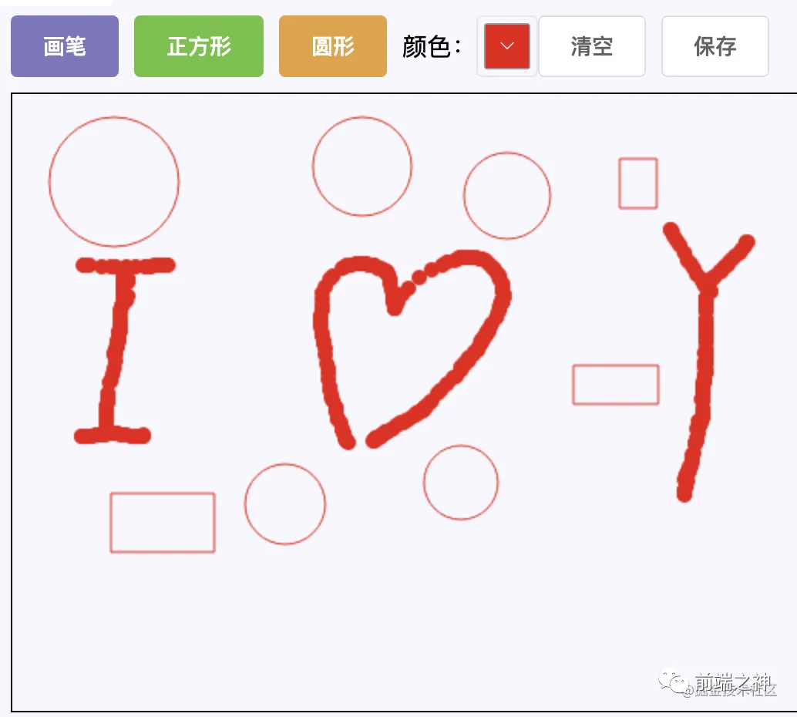

# HTML5_Canvas 笔记

本文章参考文章：[学习 HTML5 Canvas 这一篇文章就够了 | 菜鸟教程 (runoob.com)](https://www.runoob.com/w3cnote/html5-canvas-intro.html)

编程之家 Canvas 教程：<https://www.jb51.cc/canvas-tutorial/>

**canvas 练习项目**：[muyaCode/canvas_study: canvas 学习 (github.com)](https://github.com/muyaCode/canvas_study)

## 相关文档工具

**MDN 的 Canvas 文档**：

- HTML 的 canvas 标签的使用：[HTMLCanvasElement - Web API 接口参考 | MDN (mozilla.org)](https://developer.mozilla.org/zh-CN/docs/Web/API/HTMLCanvasElement)

- CanvasAPI：[Canvas - Web API 接口参考 | MDN (mozilla.org)](https://developer.mozilla.org/zh-CN/docs/Web/API/Canvas_API)

**菜鸟教程的 Canvas 文档工具**：

- HTML 的 canvas 标签支持的 HTML 的`全局属性`和`事件属性`文档：[HTML canvas 标签 | 菜鸟教程 (runoob.com)](https://www.runoob.com/tags/tag-canvas.html)

- HTML5 Canvas 使用例子文档：[HTML5 Canvas | 菜鸟教程 (runoob.com)](https://m.runoob.com/html/html5-canvas.html)

- HTML canvas 画布 API 属性和方法文档：[HTML 画布 | 菜鸟教程 (runoob.com)](https://www.runoob.com/tags/ref-canvas.html)

- **菜鸟工具**：[Canvas 使用 JavaScript 来绘制图形 | 菜鸟工具 (runoob.com)](https://c.runoob.com/codedemo/102/)

**w3cshool 的 Canvas 文档**：

- HTML 的 canvas 标签：[HTML canvas 标签元素 (w3school.com.cn)](https://www.w3school.com.cn/tags/tag_canvas.asp)

- HTML Canvas 参考手册：[HTML Canvas 参考手册 (w3school.com.cn)](https://www.w3school.com.cn/tags/html_ref_canvas.asp)

**教程文档**：

- 语雀书籍教程：<https://www.yuque.com/airing/canvas>

- caibaojian 网站收集的 W3school 教程：

  - [Canvas 教程 · W3school 教程 (caibaojian.com)](http://caibaojian.com/w3c/sitemap/canvas.html)

  - <http://caibaojian.com/w3c/html5/html5_ref_canvas.html>

**所有图形线条的练习教程**：[Canvas 练习教程 - 简单教程，简单编程 (twle.cn)](https://www.twle.cn/l/yufei/canvas/canvas-basic-index.html)

## 什么是 Canvas

### 1.什么是 Canvas

> canvas 最早由 Apple 苹果公司引入 WebKit 开源的浏览器引擎，用于 Mac OS X 的 Dashboard 功能工具，后来又在 Safari 浏览器和 Google Chrome 浏览器被实现。
> 基于 Gecko 1.8 的浏览器，比如 Firefox 1.5，同样支持 canvas 元素。  
> `<canvas>` 标签元素是 WhatWG Web applications 1.0 规范的一部分，也包含于 HTML 5 中。

### 2.HTML 5 的 Canvas

canvas 是 HTML5 新增标签

> Canvas API（画布）是在[HTML5](https://baike.baidu.com/item/HTML5/4234903?fromModule=lemma_inlink)中新增的标签用于在网页实时生成图像，并且可以操作图像内容，基本上它是一个可以用 JavaScript 操作的位图（bitmap）。
> Canvas 对象表示一个 HTML 画布元素 `<canvas>`。它没有自己的行为，但是定义了一个  WebAPI 支持脚本化客户端绘图操作。
> —— 百度百科

HTML5 的 canvas 元素使用 JavaScript 在网页上绘制图像。

画布是一个矩形区域，您可以控制其每一像素。

canvas 拥有多种绘制路径、矩形、圆形、字符以及添加图像的方法。

::: danger HTML5 的 canvas 元素的兼容性
Internet Explorer 9、Firefox、Opera、Chrome 和 Safari 支持 `<canvas>` 标签的属性及方法。
**注意**：Internet Explorer 8 及更早的 IE 版本不支持 `<canvas>` 元素。
:::

::: warning canvas 的标准

- 最新标准：[HTML Standard (whatwg.org)](https://html.spec.whatwg.org/multipage/)
- 稳定版本的标准：[HTML Canvas 2D Context](https://www.w3.org/TR/2013/CR-2dcontext-20130806/)

:::

## Canvas 的应用领域

- **游戏开发**：canvas 在基于 Web 的图像显示方面比 Flash 更加立体、更加精巧，canvas 游戏在流畅度和跨平台方面更牛。

  - [25 超棒的 HTML5 Canvas 游戏](http://www.oschina.net/news/20143/top-25-best-html5-canvas-games-you-love-to-play)

- **可视化数据**：数据图表，比如百度的 ECharts：[Apache ECharts](https://echarts.apache.org/zh/index.html)

- **banner 广告**：Flash 曾经辉煌的时代，智能手机还未曾出现。现在以及未来的智能机时代，HTML5 技术能够在 banner 广告上发挥巨大作用，用 Canvas 实现动态的广告效果再合适不过。

- **未来 => 模拟器**：无论从视觉效果还是核心功能方面来说，模拟器产品可以完全由 JavaScript 来实现。

- **未来 => 远程计算机控制**：Canvas 可以让开发者更好地实现基于 Web 的数据传输，构建一个完美的可视化控制界面。

- **未来 => 图形编辑器**：Photoshop 图形编辑器将能够 100%基于 Web 实现。

- **其他可嵌入网站的内容(多用于活动页面、特效)**：类似图表、音频、视频，还有许多元素能够更好地与 Web 融合，并且不需要任何插件。

- **完整的 canvas 移动化应用**

## Canvas 入门

### 1.创建 Canvas 元素

向 HTML5 页面创建添加 canvas 元素。

规定元素的 id、宽度和高度：

```html
<canvas id="myCanvas" width="200" height="100"></canvas>
```

### 2.Canvas 坐标系

原点（0, 0）

x 轴

y 轴


### 3.通过 JavaScript 来绘制

```javascript
/*获取元素*/
var myCanvas = document.querySelector("#myCanvas");
/*获取绘图工具*/
var context = myCanvas.getContext("2d");
/*设置绘图的起始位置*/
context.moveTo(100, 100);
/*绘制路径*/
context.lineTo(200, 200);
/*描边*/
context.stroke();
```

### 4.完整代码

- `display: block`可以把`<canvas></canvas>`变成块级元素，从而可以通过`margin: 0 auto;`设置为水平居中

- canvas 有显示的大小，还有内里分辨率的大小，所以不能在 css 中设置 canvas 元素的大小

```html
<!DOCTYPE html>
<html lang="en">
	<head>
		<meta charset="UTF-8" />
		<title>Title</title>
		<style>
			canvas {
				border: 1px solid #ccc;
				/*不建议在 样式设置尺寸*/
				/*width: 600px;
            height: 400px;*/
				display: block;
				margin: 0 auto;
			}
		</style>
	</head>
	<body>
		<!--1.准备画布-->
		<!--1.1 画布是白色的 而且默认300*150-->
		<!--1.2 设置画布的大小  width="600" height="400" -->
		<canvas id="myCanvas" width="600" height="400"></canvas>
		<!--2.准备绘制工具-->
		<!--3.利用工具绘图-->
		<script>
			/*1.获取元素*/
			// var myCanvas = document.querySelector('canvas');
			var myCanvas = document.querySelector("#myCanvas");
			// js方法设置宽高属性
			// myCanvas.width = "600";
			// myCanvas.height = "400";
			/*2.获取上下文 绘制工具箱 */
			var ctx = myCanvas.getContext("2d"); /*web gl 绘制3d效果的网页技术*/
			/*3.移动画笔*/
			ctx.moveTo(100, 100);
			/*4.绘制直线 (轨迹，绘制路径)*/
			ctx.lineTo(200, 100);
			/*5.描边*/
			ctx.stroke();
		</script>
	</body>
</html>
```

## Canvas 的概念详解和基本使用

### 1.图形绘制

需要理解些概念：

- 路径的概念

- 路径的绘制

  - 描边 stroke()
  - 填充 fill()
  - 

  闭合路径

  - 手动闭合
  - 程序闭合 closePath()

- 填充规则(非零环绕)

  - 

  - 

- 开启新的路径 beginPath()

### 2.canvas.getContext("2d");的属性和方法

- canvas 标签 getContext 的使用文档：[HTMLCanvasElement.getContext() - Web API 接口参考 | MDN (mozilla.org)](https://developer.mozilla.org/zh-CN/docs/Web/API/HTMLCanvasElement/getContext)

- getContext("2d")的属性和方法参考文档(下列属性和方法参考的文档 1)：[HTML 画布 | 菜鸟教程 (runoob.com)](https://www.runoob.com/tags/ref-canvas.html)

- **canvas.getContext("2d")的使用文档(下列属性和方法参考的文档 2)**：[CanvasRenderingContext2D - Web API 接口参考 | MDN (mozilla.org)](https://developer.mozilla.org/zh-CN/docs/Web/API/CanvasRenderingContext2D)

#### 颜色、样式和阴影

| 属性                                                                   | 描述                                       |
| ---------------------------------------------------------------------- | ------------------------------------------ |
| [fillStyle](https://www.runoob.com/tags/canvas-fillstyle.html)         | 设置或返回用于填充绘画的颜色、渐变或模式。 |
| [strokeStyle](https://www.runoob.com/tags/canvas-strokestyle.html)     | 设置或返回用于笔触的颜色、渐变或模式。     |
| [shadowColor](https://www.runoob.com/tags/canvas-shadowcolor.html)     | 设置或返回用于阴影的颜色。                 |
| [shadowBlur](https://www.runoob.com/tags/canvas-shadowblur.html)       | 设置或返回用于阴影的模糊级别。             |
| [shadowOffsetX](https://www.runoob.com/tags/canvas-shadowoffsetx.html) | 设置或返回阴影与形状的水平距离。           |
| [shadowOffsetY](https://www.runoob.com/tags/canvas-shadowoffsety.html) | 设置或返回阴影与形状的垂直距离。           |

| 方法                                                                                   | 描述                                      |
| -------------------------------------------------------------------------------------- | ----------------------------------------- |
| [createLinearGradient()](https://www.runoob.com/tags/canvas-createlineargradient.html) | 创建线性渐变（用在画布内容上）。          |
| [createPattern()](https://www.runoob.com/tags/canvas-createpattern.html)               | 在指定的方向上重复指定的元素。            |
| [createRadialGradient()](https://www.runoob.com/tags/canvas-createradialgradient.html) | 创建放射状/环形的渐变（用在画布内容上）。 |
| [addColorStop()](https://www.runoob.com/tags/canvas-addcolorstop.html)                 | 规定渐变对象中的颜色和停止位置。          |

#### 虚线

| 方法                                                                                                           | 描述                   |
| -------------------------------------------------------------------------------------------------------------- | ---------------------- |
| [setLineDash(segments)](https://developer.mozilla.org/zh-CN/docs/Web/API/CanvasRenderingContext2D/setLineDash) | 填充线时使用虚线模式   |
| [getLineDash()](https://developer.mozilla.org/zh-CN/docs/Web/API/CanvasRenderingContext2D/getLineDash)         | 获取当前虚线样式的方法 |

偏移

| 属性                                                                                                       | 说明                                                                       |
| ---------------------------------------------------------------------------------------------------------- | -------------------------------------------------------------------------- |
| [lineDashOffset](https://developer.mozilla.org/zh-CN/docs/Web/API/CanvasRenderingContext2D/lineDashOffset) | ctx.lineDashOffset = -20;<br/>如果是正的值 往后偏移，如果是负的值 往前偏移 |

#### 线条样式

| 属性                                                             | 描述                                       |
| ---------------------------------------------------------------- | ------------------------------------------ |
| [lineCap](https://www.runoob.com/tags/canvas-linecap.html)       | 设置或返回线条的结束端点样式。             |
| [lineJoin](https://www.runoob.com/tags/canvas-linejoin.html)     | 设置或返回两条线相交时，所创建的拐角类型。 |
| [lineWidth](https://www.runoob.com/tags/canvas-linewidth.html)   | 设置或返回当前的线条宽度。                 |
| [miterLimit](https://www.runoob.com/tags/canvas-miterlimit.html) | 设置或返回最大斜接长度。                   |

#### 矩形

| 方法                                                               | 描述                           |
| ------------------------------------------------------------------ | ------------------------------ |
| [rect()](https://www.runoob.com/tags/canvas-rect.html)             | 创建矩形。                     |
| [fillRect()](https://www.runoob.com/tags/canvas-fillrect.html)     | 绘制"被填充"的矩形。           |
| [strokeRect()](https://www.runoob.com/tags/canvas-strokerect.html) | 绘制矩形（无填充）。           |
| [clearRect()](https://www.runoob.com/tags/canvas-clearrect.html)   | 在给定的矩形内清除指定的像素。 |

#### 路径

| 方法                                                                           | 描述                                                      |
| ------------------------------------------------------------------------------ | --------------------------------------------------------- |
| [fill()](https://www.runoob.com/tags/canvas-fill.html)                         | 填充当前绘图（路径）。                                    |
| [stroke()](https://www.runoob.com/tags/canvas-stroke.html)                     | 绘制已定义的路径。                                        |
| [beginPath()](https://www.runoob.com/tags/canvas-beginpath.html)               | 起始一条路径，或重置当前路径。                            |
| [moveTo()](https://www.runoob.com/tags/canvas-moveto.html)                     | 把路径移动到画布中的指定点，不创建线条。                  |
| [closePath()](https://www.runoob.com/tags/canvas-closepath.html)               | 创建从当前点回到起始点的路径。                            |
| [lineTo()](https://www.runoob.com/tags/canvas-lineto.html)                     | 添加一个新点，然后在画布中创建从该点到最后指定点的线条。  |
| [clip()](https://www.runoob.com/tags/canvas-clip.html)                         | 从原始画布剪切任意形状和尺寸的区域。                      |
| [quadraticCurveTo()](https://www.runoob.com/tags/canvas-quadraticcurveto.html) | 创建二次贝塞尔曲线。                                      |
| [bezierCurveTo()](https://www.runoob.com/tags/canvas-beziercurveto.html)       | 创建三次贝塞尔曲线。                                      |
| [arc()](https://www.runoob.com/tags/canvas-arc.html)                           | 创建弧/曲线（用于创建圆形或部分圆）。                     |
| [arcTo()](https://www.runoob.com/tags/canvas-arcto.html)                       | 创建两切线之间的弧/曲线。                                 |
| [isPointInPath()](https://www.runoob.com/tags/canvas-ispointinpath.html)       | 如果指定的点位于当前路径中，则返回 true，否则返回 false。 |

#### 转换

| 方法                                                                   | 描述                                             |
| ---------------------------------------------------------------------- | ------------------------------------------------ |
| [scale()](https://www.runoob.com/tags/canvas-scale.html)               | 缩放当前绘图至更大或更小。                       |
| [rotate()](https://www.runoob.com/tags/canvas-rotate.html)             | 旋转当前绘图。                                   |
| [translate()](https://www.runoob.com/tags/canvas-translate.html)       | 重新映射画布上的 (0,0) 位置。                    |
| [transform()](https://www.runoob.com/tags/canvas-transform.html)       | 替换绘图的当前转换矩阵。                         |
| [setTransform()](https://www.runoob.com/tags/canvas-settransform.html) | 将当前转换重置为单位矩阵。然后运行 transform()。 |

#### 文本

| 属性                                                                 | 描述                                       |
| -------------------------------------------------------------------- | ------------------------------------------ |
| [font](https://www.runoob.com/tags/canvas-font.html)                 | 设置或返回文本内容的当前字体属性。         |
| [textAlign](https://www.runoob.com/tags/canvas-textalign.html)       | 设置或返回文本内容的当前对齐方式。         |
| [textBaseline](https://www.runoob.com/tags/canvas-textbaseline.html) | 设置或返回在绘制文本时使用的当前文本基线。 |

| 方法                                                                 | 描述                         |
| -------------------------------------------------------------------- | ---------------------------- |
| [fillText()](https://www.runoob.com/tags/canvas-filltext.html)       | 在画布上绘制"被填充的"文本。 |
| [strokeText()](https://www.runoob.com/tags/canvas-stroketext.html)   | 在画布上绘制文本（无填充）。 |
| [measureText()](https://www.runoob.com/tags/canvas-measuretext.html) | 返回包含指定文本宽度的对象。 |

#### 图像绘制

| 方法                                                             | 描述                           |
| ---------------------------------------------------------------- | ------------------------------ |
| [drawImage()](https://www.runoob.com/tags/canvas-drawimage.html) | 向画布上绘制图像、画布或视频。 |

#### 像素操作

| 属性                                                               | 描述                                                  |
| ------------------------------------------------------------------ | ----------------------------------------------------- |
| [width](https://www.runoob.com/tags/canvas-imagedata-width.html)   | 返回 ImageData 对象的宽度。                           |
| [height](https://www.runoob.com/tags/canvas-imagedata-height.html) | 返回 ImageData 对象的高度。                           |
| [data](https://www.runoob.com/tags/canvas-imagedata-data.html)     | 返回一个对象，其包含指定的 ImageData 对象的图像数据。 |

| 方法                                                                         | 描述                                                        |
| ---------------------------------------------------------------------------- | ----------------------------------------------------------- |
| [createImageData()](https://www.runoob.com/tags/canvas-createimagedata.html) | 创建新的、空白的 ImageData 对象。                           |
| [getImageData()](https://www.runoob.com/tags/canvas-getimagedata.html)       | 返回 ImageData 对象，该对象为画布上指定的矩形复制像素数据。 |
| [putImageData()](https://www.runoob.com/tags/canvas-putimagedata.html)       | 把图像数据（从指定的 ImageData 对象）放回画布上。           |

#### 合成

| 属性                                                                                         | 描述                                     |
| -------------------------------------------------------------------------------------------- | ---------------------------------------- |
| [globalAlpha](https://www.runoob.com/tags/canvas-globalalpha.html)                           | 设置或返回绘图的当前 alpha 或透明值。    |
| [globalCompositeOperation](https://www.runoob.com/tags/canvas-globalcompositeoperation.html) | 设置或返回新图像如何绘制到已有的图像上。 |

#### 其他

| 方法          | 描述                             |
| ------------- | -------------------------------- |
| save()        | 保存当前环境的状态。             |
| restore()     | 返回之前保存过的路径状态和属性。 |
| createEvent() |                                  |
| getContext()  |                                  |
| toDataURL()   |                                  |

### 3.练习例子

#### 两条平行线，线条的不饱和样式问题 的解决

- 对齐的点是线的中心位置   会把线分成两个 0.5px 显示的是会不饱和增加宽度

- 解决方案：前后移动 0.5px

```html
<!DOCTYPE html>
<html lang="en">
	<head>
		<meta charset="UTF-8" />
		<title>两条平行线，线条的不饱和样式问题 的解决</title>
		<style>
			canvas {
				border: 1px solid #ccc;
				            display: block;
				margin: 0 auto;
			}
		</style>
	</head>
	<body>
		<canvas width="600" height="400"></canvas>
		<script>
			var myCanvas = document.querySelector("canvas");
			var ctx = myCanvas.getContext("2d");

			/*画平行线*/
			// 饱和样式：前后移动0.5px
			ctx.moveTo(100, 100.5);
			ctx.lineTo(300, 100.5);
			// 不饱和样式
			ctx.moveTo(100, 200);
			ctx.lineTo(300, 200);

			/*绘制上面已定义的路径：把通过 moveTo() 和 lineTo() 方法定义的路径绘制在画布上*/
			ctx.stroke();

			/*关于线条的问题*/
			/*1.默认的宽度是多少   1px*/
			/*2.默认的颜色是什么   黑色*/
			/*产生原因  对齐的点是线的中心位置  会把线分成两个0.5px 显示的是会不饱和增加宽度*/
			/*解决方案  前后移动0.5px */
		</script>
	</body>
</html>
```

#### 绘制三个不一样的路径

想绘制多个路径而不被覆盖，使用 beginPath()方法开启新路径，继续绘制

```html
<!DOCTYPE html>
<html lang="en">
	<head>
		<meta charset="UTF-8" />
		<title>绘制三个不一样的路径</title>
		<style>
			canvas {
				border: 1px solid #ccc;
				            display: block;
				margin: 0 auto;
			}
		</style>
	</head>
	<body>
		<canvas width="600" height="400"></canvas>
		<script>
			var myCanvas = document.querySelector("canvas");
			var ctx = myCanvas.getContext("2d");

			/*画平行线*/

			ctx.beginPath(); /*开启新路径*/
			/*蓝色  10px*/
			ctx.moveTo(100, 100);
			ctx.lineTo(300, 100);
			ctx.strokeStyle = "blue";
			ctx.lineWidth = 10;
			/*绘制上面已定义的路径：把通过 moveTo() 和 lineTo() 方法定义的路径绘制在画布上*/
			ctx.stroke();

			ctx.beginPath(); /*开启新路径*/
			/*红色 20px*/
			ctx.moveTo(100, 200);
			ctx.lineTo(300, 200);
			ctx.strokeStyle = "red";
			ctx.lineWidth = 20;
			/*绘制上面已定义的路径：把通过 moveTo() 和 lineTo() 方法定义的路径绘制在画布上*/
			ctx.stroke();

			ctx.beginPath(); /*开启新路径*/
			/*绿色 30px*/
			ctx.moveTo(100, 300);
			ctx.lineTo(300, 300);
			ctx.strokeStyle = "green";
			ctx.lineWidth = 30;
			/*绘制上面已定义的路径：把通过 moveTo() 和 lineTo() 方法定义的路径绘制在画布上*/
			ctx.stroke();

			// 想绘制多个路径而不被覆盖，使用beginPath()方法开启新路径，继续绘制
		</script>
	</body>
</html>
```

#### 绘制三角形-填充和不填充

问题：三角形的闭合路径，路径的宽度，会造成第三条线的闭合会出现缺口

解决：使用 canvas 的自动闭合`closePath()`方法，替代第三条路径自动闭合

```html
<!DOCTYPE html>
<html lang="en">
<head>
    <meta charset="UTF-8">
    <title>绘制三角形-填充和不填充</title>
    <style>
        canvas {
            border: 1px solid #ccc;
            display: block;
            margin: 0 auto;
        }
    </style>
</head>
<body>
<canvas width="600" height="400"></canvas>
<script>
    var myCanvas = document.querySelector('canvas');
    var ctx = myCanvas.getContext('2d');

    /*1.绘制一个三角形*/
    ctx.moveTo(100,100);
    ctx.lineTo(200,100);
    ctx.lineTo(200,200);
    /*起始点和lineTo的结束点无法完全闭合缺角，所以使用下面的关闭路径方法*/
    // ctx.lineTo(100,100);
    /*使用canvas的自动闭合：关闭路径*/
    ctx.closePath();

    // 路径宽度
    ctx.lineWidth = 10;
    /*2.绘制路径(描边)*/
    ctx.stroke();
    /*3.绘制形状并填充*/
    // ctx.fill();
</script>
</body>
</html>l();
</script>
</body>
</html>
```

#### 绘制镂空的正方形：非零环绕规则 ☝️

```html
<!DOCTYPE html>
<html lang="en">
	<head>
		<meta charset="UTF-8" />
		<title>绘制镂空的正方形</title>
		<style>
			canvas {
				border: 1px solid #ccc;
				display: block;
				margin: 0 auto;
			}
		</style>
	</head>
	<body>
		<canvas width="600" height="400"></canvas>
		<script>
			var myCanvas = document.querySelector("canvas");
			var ctx = myCanvas.getContext("2d");

			/*1.绘制两个正方形 一大200一小100 套在一起*/
			ctx.moveTo(100, 100);
			ctx.lineTo(300, 100);
			ctx.lineTo(300, 300);
			ctx.lineTo(100, 300);
			ctx.closePath(); // 创建从当前点回到起始点的路径

			ctx.moveTo(150, 150);
			ctx.lineTo(150, 250);
			ctx.lineTo(250, 250);
			ctx.lineTo(250, 150);
			ctx.closePath(); // 创建从当前点回到起始点的路径

			// 绘制描边路径
			// ctx.stroke();
			// 填充样式
			ctx.fillStyle = "red";
			/*2.绘制填充*/
			ctx.fill();

			/*在填充的时候回遵循非零环绕规则*/
			// 顺时针和逆时针来绘制外图形和内图形
		</script>
	</body>
</html>
```

---

画笔的状态

- lineWidth：线宽，默认 1px
- lineCap：线末端类型：(butt 默认)、round、square
- lineJoin：相交线的拐点 miter(默认)、round、bevel
- strokeStyle：线的颜色
- fillStyle：填充颜色
- setLineDash()：设置虚线
- getLineDash()：获取虚线宽度集合
- lineDashOffset：设置虚线偏移量（负值向右偏移）

#### 绘制三个不同颜色|线的两端样式|拐点形状的箭头

```html
<!DOCTYPE html>
<html lang="en">
	<head>
		<meta charset="UTF-8" />
		<title>绘制三个不同颜色|线的两端样式|拐点形状的箭头</title>
		<style>
			canvas {
				border: 1px solid #ccc;
				display: block;
				margin: 0 auto;
			}
		</style>
	</head>
	<body>
		<canvas width="600" height="400"></canvas>
		<script>
			var myCanvas = document.querySelector("canvas");
			var ctx = myCanvas.getContext("2d");

			/*画平行线*/
			// 第一个蓝色箭头
			ctx.beginPath();
			ctx.moveTo(100, 100);
			ctx.lineTo(200, 20);
			ctx.lineTo(300, 100);
			ctx.strokeStyle = "blue"; // 路径笔触颜色、渐变或模式：蓝色
			ctx.lineWidth = 10;
			ctx.lineCap = "butt"; // 线条的结束端点样式：平直的边缘(默认)
			ctx.lineJoin = "miter"; // 拐角类型：尖角(默认)
			ctx.stroke();

			// 第二个红色箭头
			ctx.beginPath();
			ctx.moveTo(100, 200);
			ctx.lineTo(200, 120);
			ctx.lineTo(300, 200);
			ctx.strokeStyle = "red"; // 路径笔触颜色、渐变或模式：红色
			ctx.lineWidth = 20;
			ctx.lineCap = "square"; // 线条的结束端点样式：正方形
			ctx.lineJoin = "bevel"; // 拐角类型：斜角
			ctx.stroke();

			// 第三个绿色箭头
			ctx.beginPath();
			ctx.moveTo(100, 300);
			ctx.lineTo(200, 220);
			ctx.lineTo(300, 300);
			ctx.strokeStyle = "green"; // 路径笔触颜色、渐变或模式：绿色
			ctx.lineWidth = 30;
			ctx.lineCap = "round"; // 线条的结束端点样式：圆形
			ctx.lineJoin = "round"; // 拐角类型：圆形
			ctx.stroke();
		</script>
	</body>
</html>
```

#### 绘制虚线

getLineDash()方法绘制虚线

```html
<!DOCTYPE html>
<html lang="en">
	<head>
		<meta charset="UTF-8" />
		<title>Title</title>
		<style>
			canvas {
				border: 1px solid #ccc;
				display: block;
				margin: 0 auto;
			}
		</style>
	</head>
	<body>
		<canvas width="600" height="400"></canvas>
		<script>
			var myCanvas = document.querySelector("canvas");
			var ctx = myCanvas.getContext("2d");

			/*画线*/
			ctx.moveTo(100, 100.5);
			ctx.lineTo(300, 100.5);
			/*[5,10] 数组是用来描述你的排列方式的*/
			ctx.setLineDash([20]);
			/*获取虚线的排列方式 获取的是不重复的那一段的排列方式*/
			console.log(ctx.getLineDash());

			/*如果是正的值 往后偏移*/
			/*如果是负的值 往前偏移*/
			// ctx.lineDashOffset = -20;

			ctx.stroke();
		</script>
	</body>
</html>
```

#### 绘制渐变的矩形

```html
<!DOCTYPE html>
<html lang="en">
	<head>
		<meta charset="UTF-8" />
		<title>08-绘制一个从黑到白的渐变矩形</title>
		<style>
			canvas {
				border: 1px solid #ccc;
				display: block;
				margin: 0 auto;
			}
		</style>
	</head>
	<body>
		<canvas width="600" height="400"></canvas>
		<script>
			var myCanvas = document.querySelector("canvas");
			var ctx = myCanvas.getContext("2d");

			/*绘制一个矩形*/

			/*线是由点构成的：用线绘制矩形*/
			ctx.lineWidth = 30;
			for (var i = 0; i < 255; i++) {
				ctx.beginPath();
				ctx.moveTo(100 + i - 1, 100);
				ctx.lineTo(100 + i, 100);
				ctx.strokeStyle = "rgb(" + i + ",0,0)"; // 渐变
				ctx.stroke();
			}
		</script>
	</body>
</html>
```

#### 绘制网格

```html
<!DOCTYPE html>
<html lang="en">
	<head>
		<meta charset="UTF-8" />
		<title>09-绘制网格</title>
		<style>
			canvas {
				border: 1px solid #ccc;
				display: block;
				margin: 0 auto;
			}
		</style>
	</head>
	<body>
		<canvas width="600" height="400"></canvas>
		<script>
			var myCanvas = document.querySelector("canvas");
			var ctx = myCanvas.getContext("2d");

			/*1.绘制网格*/
			/*2.网格的大小*/
			var gridSize = 10;
			var canvasHeight = ctx.canvas.height;
			var canvasWidth = ctx.canvas.width;

			// 打印数据
			// var canvasHeight = myCanvas.height;
			// var canvasWidth = myCanvas.width;
			// console.log(canvasHeight);
			// console.log(canvasWidth);
			// console.log(ctx.canvas.width);
			// console.log(ctx.canvas.height);

			/*3.画多少条X轴方向的线-横线的条数、画布高度*/
			var xLineTotal = Math.floor(canvasHeight / gridSize);
			// 画横线
			for (var i = 0; i <= xLineTotal; i++) {
				ctx.beginPath();
				ctx.moveTo(0, i * gridSize - 0.5);
				ctx.lineTo(canvasWidth, i * gridSize - 0.5);
				ctx.strokeStyle = "#eee";
				ctx.stroke();
			}

			/*4.画多少条Y轴方向的线*/
			var yLineTotal = Math.floor(canvasWidth / gridSize);
			// 画竖线
			for (var i = 0; i <= yLineTotal; i++) {
				ctx.beginPath();
				ctx.moveTo(i * gridSize - 0.5, 0);
				ctx.lineTo(i * gridSize - 0.5, canvasHeight);
				ctx.strokeStyle = "#eee";
				ctx.stroke();
			}
			/*5.遍历的形式去画*/
		</script>
	</body>
</html>
```

#### 绘制坐标系

```html
<!DOCTYPE html>
<html lang="en">
	<head>
		<meta charset="UTF-8" />
		<title>10-绘制坐标系</title>
		<style>
			canvas {
				border: 1px solid #ccc;
				display: block;
				margin: 0 auto;
			}
		</style>
	</head>
	<body>
		<canvas width="600" height="400"></canvas>
		<script>
			var myCanvas = document.querySelector("canvas");
			var ctx = myCanvas.getContext("2d");

			/*1.绘制坐标系*/
			/*2.确定原点*/
			/*3.确定距离画布旁边的距离*/
			/*4.确定坐标轴的长度*/
			/*5.确定箭头的大小  是个等腰三角形  10 */
			/*6.绘制箭头填充*/

			var space = 20; // 间距
			var arrowSize = 10; // 箭头尺寸大小

			/*计算原点*/
			var canvasWidth = ctx.canvas.width;
			var canvasHeight = ctx.canvas.height;

			var x0 = space;
			var y0 = canvasHeight - space;

			/*绘制x轴*/
			ctx.beginPath();
			ctx.moveTo(x0, y0);
			ctx.lineTo(canvasWidth - space, y0);
			/*x轴箭头绘制*/
			ctx.lineTo(canvasWidth - space - arrowSize, y0 + arrowSize / 2);
			ctx.lineTo(canvasWidth - space - arrowSize, y0 - arrowSize / 2);
			ctx.lineTo(canvasWidth - space, y0);
			ctx.fill();
			ctx.stroke();

			/*绘制y轴*/
			ctx.beginPath();
			ctx.moveTo(x0, y0);
			ctx.lineTo(space, space);
			/*y轴箭头绘制*/
			ctx.lineTo(space + arrowSize / 2, space + arrowSize);
			ctx.lineTo(space - arrowSize / 2, space + arrowSize);
			ctx.lineTo(space, space);
			ctx.fill();
			ctx.stroke();
		</script>
	</body>
</html>
```

#### 绘制正方形的点

```html
<!DOCTYPE html>
<html lang="en">
	<head>
		<meta charset="UTF-8" />
		<title>11-绘制正方形的点</title>
		<style>
			canvas {
				border: 1px solid #ccc;
				display: block;
				margin: 0 auto;
			}
		</style>
	</head>
	<body>
		<canvas width="600" height="400"></canvas>
		<script>
			var myCanvas = document.querySelector("canvas");
			var ctx = myCanvas.getContext("2d");

			/*1.绘制点*/
			/*2.点的尺寸*/
			/*3.以坐标中心绘制点*/

			// 点的坐标
			var coordinate = {
				x: 100,
				y: 100,
			};
			// 点的尺寸
			var dottedSize = 10;
			// 以坐标中心绘制点
			ctx.moveTo(coordinate.x - dottedSize / 2, coordinate.y - dottedSize / 2);
			ctx.lineTo(coordinate.x + dottedSize / 2, coordinate.y - dottedSize / 2);
			ctx.lineTo(coordinate.x + dottedSize / 2, coordinate.y + dottedSize / 2);
			ctx.lineTo(coordinate.x - dottedSize / 2, coordinate.y + dottedSize / 2);
			ctx.closePath();
			ctx.fill();
		</script>
	</body>
</html>
```

#### 结合 - 网格、坐标系、点的绘制案例：绘制折线图

```html
<!DOCTYPE html>
<html lang="en">
	<head>
		<meta charset="UTF-8" />
		<title>12-绘制折线图</title>
		<style>
			canvas {
				border: 1px solid #ccc;
				display: block;
				margin: 0 auto;
			}
		</style>
	</head>
	<body>
		<canvas width="600" height="400"></canvas>
		<script>
			/*1.构造函数*/
			var LineChart = function (ctx) {
				// 获取绘图工具
				this.ctx = ctx || document.querySelector("canvas").getContext("2d");
				// 画布的大小
				this.canvasWidth = this.ctx.canvas.width;
				this.canvasHeight = this.ctx.canvas.height;
				// 网格的大小
				this.gridSize = 10;
				// 坐标系的间距
				this.space = 20;
				// 坐标原点
				this.x0 = this.space;
				this.y0 = this.canvasHeight - this.space;
				// 箭头的大小
				this.arrowSize = 10;
				// 绘制点
				this.dottedSize = 6;
				/*点的坐标 和数据有关系  数据可视化*/
			};
			/*2.行为方法*/
			LineChart.prototype.init = function (data) {
				this.drawGrid();
				this.drawAxis();
				this.drawDotted(data);
			};
			/*绘制网格*/
			LineChart.prototype.drawGrid = function () {
				// x方向的线
				var xLineTotal = Math.floor(this.canvasHeight / this.gridSize);
				this.ctx.strokeStyle = "#eee";
				for (var i = 0; i <= xLineTotal; i++) {
					this.ctx.beginPath();
					this.ctx.moveTo(0, i * this.gridSize - 0.5);
					this.ctx.lineTo(this.canvasWidth, i * this.gridSize - 0.5);
					this.ctx.stroke();
				}
				// y方向的线
				var yLineTotal = Math.floor(this.canvasWidth / this.gridSize);
				for (var i = 0; i <= yLineTotal; i++) {
					this.ctx.beginPath();
					this.ctx.moveTo(i * this.gridSize - 0.5, 0);
					this.ctx.lineTo(i * this.gridSize - 0.5, this.canvasHeight);
					this.ctx.stroke();
				}
			};
			/*绘制坐标系*/
			LineChart.prototype.drawAxis = function () {
				// X轴
				this.ctx.beginPath();
				this.ctx.strokeStyle = "#000";
				this.ctx.moveTo(this.x0, this.y0);
				this.ctx.lineTo(this.canvasWidth - this.space, this.y0);
				this.ctx.lineTo(
					this.canvasWidth - this.space - this.arrowSize,
					this.y0 + this.arrowSize / 2
				);
				this.ctx.lineTo(
					this.canvasWidth - this.space - this.arrowSize,
					this.y0 - this.arrowSize / 2
				);
				this.ctx.lineTo(this.canvasWidth - this.space, this.y0);
				this.ctx.stroke();
				this.ctx.fill();
				// Y轴
				this.ctx.beginPath();
				this.ctx.strokeStyle = "#000";
				this.ctx.moveTo(this.x0, this.y0);
				this.ctx.lineTo(this.space, this.space);
				this.ctx.lineTo(
					this.space + this.arrowSize / 2,
					this.space + this.arrowSize
				);
				this.ctx.lineTo(
					this.space - this.arrowSize / 2,
					this.space + this.arrowSize
				);
				this.ctx.lineTo(this.space, this.space);
				this.ctx.stroke();
				this.ctx.fill();
			};
			/*绘制所有点*/
			LineChart.prototype.drawDotted = function (data) {
				/*1.数据的坐标 需要转换 canvas坐标*/
				/*2.再进行点的绘制*/
				/*3.把线连起来*/
				var that = this;
				// 记录当前坐标
				var prevCanvasX = 0;
				var prevCanvasY = 0;
				data.forEach(function (item, i) {
					// x = 原点的坐标 + 数据的坐标
					// y = 原点的坐标 - 数据的坐标
					var canvasX = that.x0 + item.x;
					var canvasY = that.y0 - item.y;
					// 绘制点
					that.ctx.beginPath();
					that.ctx.moveTo(
						canvasX - that.dottedSize / 2,
						canvasY - that.dottedSize / 2
					);
					that.ctx.lineTo(
						canvasX + that.dottedSize / 2,
						canvasY - that.dottedSize / 2
					);
					that.ctx.lineTo(
						canvasX + that.dottedSize / 2,
						canvasY + that.dottedSize / 2
					);
					that.ctx.lineTo(
						canvasX - that.dottedSize / 2,
						canvasY + that.dottedSize / 2
					);
					that.ctx.closePath();
					that.ctx.fill();
					/*点的连线*/
					/*当时第一个点的时候 起点是 x0 y0*/
					/*当时不是第一个点的时候 起点是 上一个点*/
					if (i == 0) {
						that.ctx.beginPath();
						that.ctx.moveTo(that.x0, that.y0);
						that.ctx.lineTo(canvasX, canvasY);
						that.ctx.stroke();
					} else {
						/*上一个点*/
						that.ctx.beginPath();
						that.ctx.moveTo(prevCanvasX, prevCanvasY);
						that.ctx.lineTo(canvasX, canvasY);
						that.ctx.stroke();
					}
					// 记录当前的坐标，下一次要用
					prevCanvasX = canvasX;
					prevCanvasY = canvasY;
				});
			};
			/*3.初始化*/
			var data = [
				{
					x: 100,
					y: 120,
				},
				{
					x: 200,
					y: 160,
				},
				{
					x: 300,
					y: 240,
				},
				{
					x: 400,
					y: 120,
				},
				{
					x: 500,
					y: 80,
				},
			];
			var lineChart = new LineChart();
			lineChart.init(data);
		</script>
	</body>
</html>
```

其他练习请看：**canvas 练习项目**：[muyaCode/canvas_study: canvas 学习 (github.com)](https://github.com/muyaCode/canvas_study)

## Canvas 图形绘制

### 1.矩形绘制

- rect(x,y,w,h)：没有独立路径
- strokeRect(x,y,w,h)：有独立路径，不影响别的绘制
- fillRect(x,y,w,h)：有独立路径，不影响别的绘制
- clearRect(x,y,w,h)：擦除矩形区域

#### 绘制矩形

```html
<!DOCTYPE html>
<html lang="en">
	<head>
		<meta charset="UTF-8" />
		<title>绘制矩形</title>
		<style>
			canvas {
				border: 1px solid #ccc;
				display: block;
				margin: 0 auto;
			}
		</style>
	</head>
	<body>
		<canvas width="600" height="400"></canvas>
		<script>
			var myCanvas = document.querySelector("canvas");
			var ctx = myCanvas.getContext("2d");

			/*方法1：绘制矩形路径 不是独立路径*/
			// ctx.rect(100,100,200,100);
			// ctx.fillStyle = 'green';
			// ctx.stroke();
			// ctx.fill();

			/*方法2：绘制矩形  有自己的独立路径*/
			// ctx.strokeRect(100,100,200,100); // 描边矩形
			ctx.fillRect(100, 100, 200, 100); // 填充矩形

			/*清除矩形的内容*/
			// ctx.clearRect(0, 0, ctx.canvas.width, ctx.canvas.height);
		</script>
	</body>
</html>
```

#### 绘制渐变颜色的矩形

3 中方法渐变：

- 方法 1：填充颜色属性：fillStyle = 'pink'|'#000'|'rgb()'|'rgba()'

- 方法 2：使用一个渐变的 createLinearGradient()方法填充矩形

- 方法 3：css 渐变

```html
<!DOCTYPE html>
<html lang="en">
	<head>
		<meta charset="UTF-8" />
		<title>14-绘制一个渐变颜色的矩形</title>
		<style>
			canvas {
				border: 1px solid #ccc;
				display: block;
				margin: 0 auto;
			}
			/* 方法3：css渐变 */
			/* .linearGradient {
    width: 400px;
    height: 100px;
    background-image: linear-gradient(to right, pink, blue);
   } */
		</style>
	</head>
	<body>
		<div class="linearGradient"></div>
		<canvas width="600" height="400"></canvas>
		<script>
			var myCanvas = document.querySelector("canvas");
			var ctx = myCanvas.getContext("2d");

			// pink---->blue
			// 回想线性渐变---->要素 方向  起始颜色 结束颜色
			// 通过两个点的坐标可以控制 渐变方向

			/*方法1：填充颜色属性：fillStyle = 'pink'|'#000'|'rgb()'|'rgba()' */

			/*方法2：使用一个渐变的createLinearGradient()方法填充矩形*/
			/*x0y0 起始点 x1y1 结束点  确定长度和方向*/
			var linearGradient = ctx.createLinearGradient(100, 100, 500, 400); // 创建一个渐变的方案
			// 添加渐变：渐变是有长度的
			linearGradient.addColorStop(0, "pink");
			//linearGradient.addColorStop(0.5,'red');
			linearGradient.addColorStop(1, "blue");

			ctx.fillStyle = linearGradient;
			// 填充矩形
			ctx.fillRect(100, 100, 400, 100);
		</script>
	</body>
</html>
```

### 2.圆弧绘制

arc() 方法文档：[HTML canvas arc() 方法 | 菜鸟教程 (runoob.com)](https://www.runoob.com/tags/canvas-arc.html)

arcTo() 方法文档：[HTML canvas arcTo() 方法 | 菜鸟教程 (runoob.com)](https://www.runoob.com/tags/canvas-arcto.html)

- 弧度概念

  - 1.什么是弧度   是一种长度的描述单位
  - 2.一个弧度怎么去描述   一个圆有多少个弧度  2 \* π
  - 3.一弧度有多长   一个弧度一个半径的长度

- 弧度计算

  - 角度：一个圆是 360 度
  - 半径：已一个点为中心多长为放射半径
  - 周长：2 _π_ r

- `arc()` 圆弧绘制方法

  - 语法：`context.arc(x,y,r,sAngle,eAngle,counterclockwise*);`

  - 参数值：

    | 参数             | 描述                                                                      |
    | ---------------- | ------------------------------------------------------------------------- |
    | x                | 圆的中心的 x 坐标（横坐标）。                                             |
    | y                | 圆的中心的 y 坐标（纵坐标）。                                             |
    | r                | 圆的半径。                                                                |
    | sAngle           | 起始角（开始角度），以弧度计（弧的圆形的三点钟位置是 0 度）。             |
    | eAngle           | 结束角（结束角度），以弧度计。                                            |
    | counterclockwise | 可选。应该逆时针还是顺时针绘图。false = 顺时针，true = 逆时针。默认 false |

#### 理解曲线的绘制：三种线的绘制公式

```html
<!DOCTYPE html>
<html lang="en">
	<head>
		<meta charset="UTF-8" />
		<title>理解曲线的绘制</title>
		<style>
			canvas {
				border: 1px solid #ccc;
				display: block;
				margin: 0 auto;
			}
		</style>
	</head>
	<body>
		<!--
    1.什么是弧度  是一种长度的描述单位
    2.一个弧度怎么去描述  一个圆有多少个弧度  2 * π
    3.一弧度有多长  一个弧度一个半径的长度

    角度：一个圆是360度
    半径：已一个点为中心多长为放射半径
    周长：2 * π * r

    最终的结论：一个角度等于多少弧度  π/180
    -->
		<canvas width="600" height="400"></canvas>
		<script>
			var myCanvas = document.querySelector("canvas");
			var ctx = myCanvas.getContext("2d");

			/*1.体验曲线的绘制*/
			/*2.线是由点构成的*/
			/*3.曲线可以由数学公式得来*/

			for (var i = 1; i < 600; i++) {
				var x = i;
				// var y = x / 2; // 斜线公式1：y = x / 2
				// var y = Math.pow(x / 10-30, 2); // 抛物线公式2：y = (x + 2) ^2
				var y = 50 * Math.sin(x / 10) + 100; // 曲线公式3：y = sin(x)
				ctx.lineTo(x, y);
			}
			ctx.stroke();
		</script>
	</body>
</html>
```

#### 绘制四分之一个圆弧：arc()方法绘制圆弧

```html
<!DOCTYPE html>
<html lang="en">
	<head>
		<meta charset="UTF-8" />
		<title>绘制四分之一个圆弧</title>
		<style>
			canvas {
				border: 1px solid #ccc;
				display: block;
				margin: 0 auto;
			}
		</style>
	</head>
	<body>
		<canvas width="600" height="400"></canvas>
		<script>
			var myCanvas = document.querySelector("canvas");
			var ctx = myCanvas.getContext("2d");

			/*绘制圆弧*/
			// 1.确定圆心：坐标 x, y
			// 2.确定圆半径：r
			// 3.确定起始绘制的位置和结束绘制的位置：确定弧的长度和位置：startAngle, endAngle   弧度
			// 4.取得绘制的方向 direction 默认是顺时针 false 逆时针 true

			/*在中心位置画一个半径150px的圆弧左下角*/
			var w = ctx.canvas.width;
			var h = ctx.canvas.height;
			// arc()方法绘制圆弧：四分之一个圆计算
			ctx.arc(w / 2, h / 2, 150, Math.PI / 2, Math.PI, true);
			ctx.stroke();
		</script>
	</body>
</html>
```

#### 绘制一个右上角的四分之一的扇形：计算弧度绘制再填充

```html
<!DOCTYPE html>
<html lang="en">
	<head>
		<meta charset="UTF-8" />
		<title>绘制一个右上角的四分之一的扇形</title>
		<style>
			canvas {
				border: 1px solid #ccc;
				display: block;
				margin: 0 auto;
			}
		</style>
	</head>
	<body>
		<canvas width="600" height="400"></canvas>
		<script>
			var myCanvas = document.querySelector("canvas");
			var ctx = myCanvas.getContext("2d");

			/*原理：在中心位置画一个半径150px的圆弧右上角， 1.扇形  2.计算边  3.填充 */
			var w = ctx.canvas.width;
			var h = ctx.canvas.height;

			// 把起点放到圆心位置
			ctx.moveTo(w / 2, h / 2);
			// 计算扇形弧度
			ctx.arc(w / 2, h / 2, 150, 0, -Math.PI / 2, true);

			// 闭合路径
			// ctx.closePath();

			// 填充模式
			ctx.fill();
		</script>
	</body>
</html>
```

#### 绘制一个圆分成六等分颜色随机

```html
<!DOCTYPE html>
<html lang="en">
	<head>
		<meta charset="UTF-8" />
		<title>绘制一个圆分成六等分颜色随机</title>
		<style>
			canvas {
				border: 1px solid #ccc;
				display: block;
				margin: 0 auto;
			}
		</style>
	</head>
	<body>
		<canvas width="600" height="400"></canvas>
		<script>
			var myCanvas = document.querySelector("canvas");
			var ctx = myCanvas.getContext("2d");

			var w = ctx.canvas.width;
			var h = ctx.canvas.height;

			// 分成几等分
			var num = 6;
			// 一份多少弧度
			var angle = (Math.PI * 2) / num;

			// 原点坐标
			var x0 = w / 2;
			var y0 = h / 2;

			// 随机颜色方法
			var getRandomColor = function () {
				var r = Math.floor(Math.random() * 256);
				var g = Math.floor(Math.random() * 256);
				var b = Math.floor(Math.random() * 256);
				return "rgb(" + r + "," + g + "," + b + ")";
			};

			// 上一次绘制的结束弧度等于当前次的起始弧度
			for (var i = 0; i < num; i++) {
				// 起始和结束
				var startAngle = i * angle;
				var endAngle = (i + 1) * angle;

				// 开始绘制
				ctx.beginPath();
				ctx.moveTo(x0, y0);
				ctx.arc(x0, y0, 150, startAngle, endAngle);

				ctx.fillStyle = getRandomColor(); // 随机颜色
				ctx.fill(); // 填充模式
			}
		</script>
	</body>
</html>
```

#### 结合上面例子：根据年龄分布绘制饼图

```html
<!DOCTYPE html>
<html lang="en">
	<head>
		<meta charset="UTF-8" />
		<title>根据年龄分布绘制饼图</title>
		<style>
			canvas {
				border: 1px solid #ccc;
				display: block;
				margin: 0 auto;
			}
		</style>
	</head>
	<body>
		<canvas width="600" height="400"></canvas>
		<script>
			var myCanvas = document.querySelector("canvas");
			var ctx = myCanvas.getContext("2d");

			/*根据年龄分布绘制饼图*/

			/*1.准备统计的数据*/
			// 15-20岁 6个
			// 20-25岁 30个
			// 25-30岁 10个
			// 30-35岁 8个
			var data = [6, 30, 10, 8];

			/*2.在饼图表示出来*/
			// 各个年龄段人的总数
			var total = 0;
			data.forEach(function (item, i) {
				total += item;
			});
			console.log(total);

			// 存放-数据转成弧度
			var angleList = [];
			data.forEach(function (item, i) {
				var angle = Math.PI * 2 * (item / total);
				angleList.push(angle);
			});
			console.log(angleList);

			/*3.根据弧度绘制扇形*/
			var w = ctx.canvas.width;
			var h = ctx.canvas.height;
			var x0 = w / 2;
			var y0 = h / 2;

			// 获取随机颜色方法
			var getRandomColor = function () {
				var r = Math.floor(Math.random() * 256);
				var g = Math.floor(Math.random() * 256);
				var b = Math.floor(Math.random() * 256);
				return "rgb(" + r + "," + g + "," + b + ")";
			};

			var startAngle = 0;
			angleList.forEach(function (item, i) {
				// 上一次绘制的结束弧度等于当前次的起始弧度
				var endAngle = startAngle + item;
				ctx.beginPath();
				ctx.moveTo(x0, y0);
				ctx.arc(x0, y0, 150, startAngle, endAngle);
				ctx.fillStyle = getRandomColor();
				ctx.fill();
				// 记录当前的结束位置作为下一次的起始位置
				startAngle = endAngle;
			});
		</script>
	</body>
</html>
```

### 3.绘制文本

文本的方法和属性：打开[HTML 画布 | 菜鸟教程 (runoob.com)](https://www.runoob.com/tags/ref-canvas.html)，搜索 [`文本`] 两字

- ctx.font = '微软雅黑'; - 设置字体

- `strokeText()`：在画布上绘制文本（无填充）

- `fillText(text,x,y,maxWidth)` ：在画布上绘制"被填充的"文本

  - text 要绘制的文本
  - x,y 文本绘制的坐标（文本左下角）
  - maxWidth 设置文本最大宽度，可选参数

- `ctx.textAlign`：文本水平对齐方式，相对绘制坐标来说的

  - left
  - center
  - right
  - start（默认）
  - end

- `ctx.direction`属性 css(rtl、ltr) start 和 end 与此相关

  direction 属性文档(前面表格没有的属性)：[CanvasRenderingContext2D.direction - Web API 接口参考 | MDN (mozilla.org)](https://developer.mozilla.org/zh-CN/docs/Web/API/CanvasRenderingContext2D/direction)

  - 如果是 ltr，文本方向从左向右，start 和 left 表现一致
  - 如果是 rtl，文本方向从右向左，start 和 right 表现一致
  - 如果是 inherit(默认值)，根据情况继承  `canvas`元素或者  `Document`

- `ctx.textBaseline`：设置基线（垂直对齐方式 ）

  - top 文本的基线处于文本的正上方，并且有一段距离
  - middle 文本的基线处于文本的正中间
  - bottom 文本的基线处于文本的证下方，并且有一段距离
  - hanging 文本的基线处于文本的正上方，并且和文本粘合
  - alphabetic 默认值，基线处于文本的下方，并且穿过文字
  - ideographic 和 bottom 相似，但是不一样

- `measureText()`：获取文本宽度 obj.width

#### 绘制在画布中心的一段文字

```html
<!DOCTYPE html>
<html lang="en">
	<head>
		<meta charset="UTF-8" />
		<title>绘制在画布中心的一段文字</title>
		<style>
			canvas {
				border: 1px solid #ccc;
				display: block;
				margin: 100px auto;
			}
		</style>
	</head>
	<body>
		<canvas width="600" height="400"></canvas>
		<script>
			var myCanvas = document.querySelector("canvas");
			var ctx = myCanvas.getContext("2d");

			// 在画布的中心绘制一段文字
			/*1.声明一段文字*/
			var str = "您吃-,了吗";
			/*2.确定画布的中心*/
			var w = ctx.canvas.width;
			var h = ctx.canvas.height;

			/*3.画一个十字架在画布的中心*/
			ctx.beginPath();
			// 横线
			ctx.moveTo(0, h / 2 - 0.5);
			ctx.lineTo(w, h / 2 - 0.5);
			// 竖线
			ctx.moveTo(w / 2 - 0.5, 0);
			ctx.lineTo(w / 2 - 0.5, h);
			ctx.strokeStyle = "#eee";
			ctx.stroke();

			/*4.绘制文本*/
			ctx.beginPath();
			ctx.strokeStyle = "#000";
			var x0 = w / 2;
			var y0 = h / 2;

			// 注意：起点位置在文字的左下角
			// 有文本的属性  尺寸 字体  左右对齐方式  垂直对齐的方式
			ctx.font = "40px Microsoft YaHei";

			// 左右对齐方式：(center left right start end) 基准起始坐标
			ctx.textAlign = "center";
			// 垂直对齐的方式：基线 baseline(top,bottom,middle) 基准起始坐标
			ctx.textBaseline = "middle";
			// 文本方向的属性：ltr，从左向右；rtl，从右向左；inherit(默认值)，根据情况继承 `canvas`元素或者 `Document`
			// ctx.direction = 'rtl';

			// 绘制文本
			// ctx.strokeText(str, x0, y0); // 绘制无填充的文本
			ctx.fillText(str, x0, y0); // 绘制填充文本

			/*5.画一个下划线和文字一样长*/
			ctx.beginPath();

			// 获取文本的宽度
			console.log(ctx.measureText(str));
			// 返回包含指定文本宽度的对象
			var width = ctx.measureText(str).width;

			// 文本的下划线绘制
			ctx.moveTo(x0 - width / 2, y0 + 20);
			ctx.lineTo(x0 + width / 2, y0 + 20);
			ctx.stroke();
		</script>
	</body>
</html>
```

#### 结合上面饼图绘制和文字绘制：绘制完整的带文本数据显示的饼状图

```html
<!DOCTYPE html>
<html lang="en">
	<head>
		<meta charset="UTF-8" />
		<title>绘制完整的带文本数据显示的饼状图</title>
		<style>
			canvas {
				border: 1px solid #ccc;
				display: block;
				margin: 100px auto;
			}
		</style>
	</head>
	<body>
		<canvas width="600" height="400"></canvas>
		<script>
			/***** 绘制饼状态图 *****/
			/*1.1 根据数据绘制一个饼图*/
			/*1.2 绘制标题 从扇形的弧中心伸出一条线在画一条横线在横线的上面写上文字标题*/
			/*1.3 在画布的左上角 绘制说明 一个和扇形一样颜色的矩形 旁边就是文字说明*/
			var PieChart = function (ctx) {
				// 绘制工具
				this.ctx = ctx || document.querySelector("canvas").getContext("2d");
				// 绘制饼图的中心
				this.w = this.ctx.canvas.width;
				this.h = this.ctx.canvas.height;
				// 圆心
				this.x0 = this.w / 2 + 60;
				this.y0 = this.h / 2;
				// 半径
				this.radius = 150;
				// 伸出去的线的长度
				this.outLine = 20;
				// 说明的矩形大小
				this.rectW = 30;
				this.rectH = 16;
				this.space = 20; // 间距
			};

			// 初始化方法里-准备绘制饼图的数据+方法
			PieChart.prototype.init = function (data) {
				this.drawPie(data);
			};

			// 绘制饼图的-结合下面的数据+方法
			PieChart.prototype.drawPie = function (data) {
				var that = this;
				// 1.转化弧度
				var angleList = this.transformAngle(data);
				// 2.绘制饼图
				var startAngle = 0;
				angleList.forEach(function (item, i) {
					// 当前的结束弧度要等于下一次的起始弧度
					var endAngle = startAngle + item.angle;
					that.ctx.beginPath();
					that.ctx.moveTo(that.x0, that.y0);
					that.ctx.arc(that.x0, that.y0, that.radius, startAngle, endAngle);
					var color = (that.ctx.fillStyle = that.getRandomColor());
					that.ctx.fill();

					/*下一次要使用当前的这一次的结束角度*/
					// 绘制伸出去的线的文本说明
					that.drawTitle(startAngle, item.angle, color, item.title);
					// 绘制说明
					that.drawDesc(i, item.title);
					startAngle = endAngle;
				});
			};

			// 绘制饼图的 延申的线 和 线上面的 文本数据说明
			PieChart.prototype.drawTitle = function (
				startAngle,
				angle,
				color,
				title
			) {
				/***** 饼图上伸出去的线计算（比较重点和难点的，计算的看说明-有点抽象） *****/
				/*1.确定伸出去的线 通过圆心点和伸出去的线的点，确定这个线*/
				/*2.确定伸出去的点，需要确定伸出去的线的长度*/
				/*3.固定伸出去的线的长度*/
				/*4.计算这个点的坐标*/
				/*5.需要根据角度和斜边的长度*/
				/*5.1 使用弧度：当前扇形的起始弧度 + 对应的弧度的一半 */
				/*5.2 半径 + 伸出去的长度 */
				/*5.2.1 outX = x0 + cos(angle) * (r + outLine)*/
				/*5.2.2 outY = y0 + sin(angle) * (r + outLine)*/

				// 斜边
				var edge = this.radius + this.outLine;
				// x轴方向的直角边
				var edgeX = Math.cos(startAngle + angle / 2) * edge;
				// y轴方向的直角边
				var edgeY = Math.sin(startAngle + angle / 2) * edge;
				// 计算伸出去的点坐标
				var outX = this.x0 + edgeX;
				var outY = this.y0 + edgeY;
				// 画伸出去的线
				this.ctx.beginPath();
				this.ctx.moveTo(this.x0, this.y0);
				this.ctx.lineTo(outX, outY);
				this.ctx.strokeStyle = color;

				/***** 画饼图上的文本说明和下划线 *****/
				// 线的方向怎么判断 伸出去的点在X0的左边 线的方向就是左边
				// 线的方向怎么判断 伸出去的点在X0的右边 线的方向就是右边
				// 结束的点坐标  和文字大小
				this.ctx.font = "14px Microsoft YaHei";
				var textWidth = this.ctx.measureText(title).width;
				// 右
				if (outX > this.x0) {
					this.ctx.lineTo(outX + textWidth, outY);
					this.ctx.textAlign = "left";
				} else {
					// 左
					this.ctx.lineTo(outX - textWidth, outY);
					this.ctx.textAlign = "right";
				}
				this.ctx.stroke();
				this.ctx.textBaseline = "bottom";
				this.ctx.fillText(title, outX, outY);
			};

			// 绘制左上角矩形和文字说明
			PieChart.prototype.drawDesc = function (index, title) {
				/***** 左上角矩形绘制说明 *****/
				// 矩形的大小
				// 距离上和左边的间距
				// 矩形之间的间距
				this.ctx.fillRect(
					this.space,
					this.space + index * (this.rectH + 10),
					this.rectW,
					this.rectH
				);

				// 绘制矩形右边文字
				this.ctx.beginPath();
				this.ctx.textAlign = "left";
				this.ctx.textBaseline = "top";
				this.ctx.font = "12px Microsoft YaHei";
				this.ctx.fillText(
					title,
					this.space + this.rectW + 10,
					this.space + index * (this.rectH + 10)
				);
			};

			// 饼图弧度计算方法
			PieChart.prototype.transformAngle = function (data) {
				// 返回的数据内容包含弧度的
				var total = 0;
				data.forEach(function (item, i) {
					total += item.num;
				});
				// 计算弧度 并且追加到当前的对象内容
				data.forEach(function (item, i) {
					var angle = (item.num / total) * Math.PI * 2;
					item.angle = angle;
				});
				return data;
			};

			// 随机颜色方法
			PieChart.prototype.getRandomColor = function () {
				var r = Math.floor(Math.random() * 256);
				var g = Math.floor(Math.random() * 256);
				var b = Math.floor(Math.random() * 256);
				return "rgb(" + r + "," + g + "," + b + ")";
			};

			// 准备的数据
			var data = [
				{
					title: "15-20岁",
					num: 6,
				},
				{
					title: "20-25岁",
					num: 30,
				},
				{
					title: "25-30岁",
					num: 10,
				},
				{
					title: "30以上",
					num: 8,
				},
			];

			// 实例化构造函数和执行实例方法
			var pieChart = new PieChart();
			pieChart.init(data);
		</script>
	</body>
</html>
```

## 做动画

### 1.绘制图片

图像方法`drawImage()`文档：[HTML canvas drawImage() 方法 | 菜鸟教程 (runoob.com)](https://www.runoob.com/tags/canvas-drawimage.html)

- `drawImage()` 方法的三种不同参数绘制图片
  - 三个参数：`drawImage(img,x,y)`：**在画布上定位图像**
    - img 图片对象、canvas 对象、video 对象
    - x,y 图片绘制的左上角
  - 五个参数：`drawImage(img,x,y,w,h)`：**在画布上定位图像，并规定图像的宽度和高度**
    - img 图片对象、canvas 对象、video 对象
    - x,y 图片绘制的左上角
    - w,h 图片绘制尺寸设置(图片缩放，不是截取)
  - 九个参数：`drawImage(img,x,y,w,h,x1,y1,w1,h1)`：**剪切图像，并在画布上定位被剪切的部分**
    - img 图片对象、canvas 对象、video 对象
    - x,y,w,h 图片中的一个矩形区域
    - x1,y1,w1,h1 画布中的一个矩形区域

#### 绘制图片的三种方式+三种图片加载方法示例

```html
<!DOCTYPE html>
<html lang="en">
	<head>
		<meta charset="UTF-8" />
		<title>绘制图片</title>
		<style>
			canvas {
				border: 1px solid #ccc;
				display: block;
				margin: 0 auto;
			}
		</style>
	</head>
	<body>
		<!-- 方法3：标签引用图片 -->
		<!---->
		<canvas width="600" height="400"></canvas>
		<script>
			var myCanvas = document.querySelector("canvas");
			var ctx = myCanvas.getContext("2d");

			/*方法1.创建img元素，加载图片到内存即可*/
			// var img = document.createElement("img");
			// img.src = "image/01.jpg";

			/*方法2：2.1 创建Image对象*/
			var image = new Image();
			/*2.2 要使用图片必须等图片加载完毕：先绑定加载完成事件*/
			image.onload = function () {
				/*实现图片绘制*/
				console.log(image);
				/*绘制图片的三种方式*/

				/*3参数*/
				// ctx.drawImage(image,100,100);

				/*5个参数*/
				// ctx.drawImage(image,100,100,100,100);

				/*9个参数*/
				ctx.drawImage(image, 400, 400, 400, 400, 200, 200, 100, 100);
			};
			/*2.3 再设置图片路径*/
			image.src = "image/02.jpg";
		</script>
	</body>
</html>
```

### 2.序列帧动画

- 绘制精灵图
- 帧动画-动起来
- 控制边界
- 键盘控制

#### 结合上面绘制图像方法-进行帧动画绘制：通过`drawImage()`方法的 9 个参数的使用来截取图片位置，实现帧动画

精灵图：


```html
<!DOCTYPE html>
<html lang="en">
	<head>
		<meta charset="UTF-8" />
		<title>帧动画</title>
		<style>
			canvas {
				border: 1px solid #ccc;
				display: block;
				margin: 0 auto;
			}
		</style>
	</head>
	<body>
		<canvas width="600" height="400"></canvas>
		<script>
			var myCanvas = document.querySelector("canvas");
			var ctx = myCanvas.getContext("2d");

			var image = new Image();
			/*图片加载完成*/
			image.onload = function () {
				// 动态的去获取当前图片的尺寸
				var imageWidth = image.width;
				var imageHeight = image.height;
				// 计算出每一个小人物的尺寸
				var personWidth = imageWidth / 4;
				var personHeight = imageHeight / 4;

				/***** 位截取图片 *****/
				// 帧动画：在固定的时间间隔，根据图片的索引更换显示的图片
				var index = 0;
				/*绘制在画布的中心*/
				// 图片绘制的起始点
				var x0 = ctx.canvas.width / 2 - personWidth / 2;
				var y0 = ctx.canvas.height / 2 - personHeight / 2;
				// 绘制图片截取第一个精灵图
				ctx.drawImage(
					image,
					0,
					0,
					personWidth,
					personHeight,
					x0,
					y0,
					personWidth,
					personHeight
				);
				// 定时按顺序绘制其他精灵图
				setInterval(function () {
					index++; // 裁剪的索引位置
					// 绘制之前清除已经绘制的精灵图，避免重复绘制
					ctx.clearRect(0, 0, ctx.canvas.width, ctx.canvas.height);
					// 通过`drawImage()`方法的9个参数的使用来截取图片位置，实现帧动画
					ctx.drawImage(
						image,
						index * personWidth,
						0,
						personWidth,
						personHeight,
						x0,
						y0,
						personWidth,
						personHeight
					);
					// 只绘制前3帧
					if (index >= 3) {
						index = 0;
					}
				}, 1000);
			};
			image.src = "image/04.png";
		</script>
	</body>
</html>
```

#### 方向键控制精灵图-行走的帧动画

```html
<!DOCTYPE html>
<html lang="en">
	<head>
		<meta charset="UTF-8" />
		<title>方向键控制的行走的小人</title>
		<style>
			canvas {
				border: 1px solid #ccc;
				display: block;
				margin: 0 auto;
			}
		</style>
	</head>
	<body>
		<canvas width="600" height="400"></canvas>
		<script>
			var Person = function (ctx) {
				// 绘制工具
				this.ctx = ctx || document.querySelector("canvas").getContext("2d");
				// 图片路径
				this.src = "image/04.png";
				// 画布的大小
				this.canvasWidth = this.ctx.canvas.width;
				this.canvasHeight = this.ctx.canvas.height;

				/*行走相关参数*/
				this.stepSzie = 10;
				// 0：前，1：左，2：右，3：后  和图片的行数包含的图片对应上
				this.direction = 0;
				// x轴方向的偏移步数
				this.stepX = 0;
				// y轴方向的偏移步数
				this.stepY = 0;

				// 初始化方法
				this.init();
			};

			Person.prototype.init = function () {
				var that = this;
				/*1.加载图片和绘制出默认的精灵图帧*/
				this.loadImage(function (image) {
					// 图片的大小
					that.imageWidth = image.width;
					that.imageHeight = image.height;
					// 人物的大小
					that.personWidth = that.imageWidth / 4;
					that.personHeight = that.imageHeight / 4;
					// 绘制图片的起点
					that.x0 = that.canvasWidth / 2 - that.personWidth / 2;
					that.y0 = that.canvasHeight / 2 - that.personHeight / 2;

					// 默认绘制在中心位置正面朝外的精灵图帧
					that.ctx.drawImage(
						image,
						0,
						0,
						that.personWidth,
						that.personHeight,
						that.x0,
						that.y0,
						that.personWidth,
						that.personHeight
					);

					/*2.能通过方向键去控制人物行走*/
					that.index = 0;
					// 监听键盘按键，分别截取不同的帧数
					document.onkeydown = function (e) {
						if (e.keyCode == 40) {
							// 0：前
							that.direction = 0;
							that.stepY++;
							that.drawImage(image);
						} else if (e.keyCode == 37) {
							// 1：左
							that.direction = 1;
							that.stepX--;
							that.drawImage(image);
						} else if (e.keyCode == 39) {
							// 2：右
							that.direction = 2;
							that.stepX++;
							that.drawImage(image);
						} else if (e.keyCode == 38) {
							// 3：后
							that.direction = 3;
							that.stepY--;
							that.drawImage(image);
						}
					};
				});
			};

			// 加载图片方法
			Person.prototype.loadImage = function (callback) {
				var image = new Image();
				image.onload = function () {
					callback && callback(image);
				};
				image.src = this.src;
			};

			// 绘制图片方法
			Person.prototype.drawImage = function (image) {
				this.index++;
				// 清除画布，避免重复绘制
				this.ctx.clearRect(0, 0, this.canvasWidth, this.canvasHeight);
				/***** 绘图 *****/
				// 在精灵图上的定位 x  索引
				// 在精灵图上的定位 y  方向
				this.ctx.drawImage(
					image,
					this.index * this.personWidth,
					this.direction * this.personHeight,
					this.personWidth,
					this.personHeight,
					this.x0 + this.stepX * this.stepSzie,
					this.y0 + this.stepY * this.stepSzie,
					this.personWidth,
					this.personHeight
				);
				// 如果索引超出了 变成0
				if (this.index >= 3) {
					this.index = 0;
				}
			};

			new Person();
		</script>
	</body>
</html>
```

### 3.坐标变换

打开文档搜索【转换】：[HTML 画布 | 菜鸟教程 (runoob.com)](https://www.runoob.com/tags/ref-canvas.html)

- 平移 移动画布的原点
  - translate(x,y) 参数表示移动目标点的坐标：x,y 的坐标位置
- 缩放
  - scale(x,y) 参数表示宽高的缩放比例：宽, 高的缩放
- 旋转
  - rotate(angle) 参数表示旋转角度：旋转角度，以弧度计

#### 坐标转换示例

```html
<!DOCTYPE html>
<html lang="en">
	<head>
		<meta charset="UTF-8" />
		<title>认识canvas的转换</title>
		<style>
			canvas {
				border: 1px solid #ccc;
				display: block;
				margin: 0 auto;
			}
		</style>
	</head>
	<body>
		<canvas width="600" height="400"></canvas>
		<script>
			var myCanvas = document.querySelector("canvas");
			var ctx = myCanvas.getContext("2d");
			// ctx.translate(100, 100); // x,y的坐标位置
			// ctx.scale(0.5, 1); // 缩放：宽, 高
			// ctx.rotate(Math.PI / 6); // 旋转：旋转角度，以弧度计
			var startAngle = 0;
			ctx.translate(150, 150);
			setInterval(function () {
				startAngle += Math.PI / 180;
				ctx.rotate(startAngle); // 旋转
				ctx.strokeRect(-50, -50, 100, 100); // 矩形填充
			}, 500);
		</script>
	</body>
</html>
```

### ✨Canvas 动画 🌟

#### 1.运动&三角函数

#### 2.边界&摩擦力

#### 3.鼠标&绘制对象交互

#### 4.缓动&弹动

#### 5.碰撞检测

#### 6.高级坐标旋转&斜面反弹

#### 7.撞球物理

#### 8.粒子&万有引力

#### 9.从 2D 到 3D

#### 10.常见的案例&补充

## 绘制绚丽的倒计时

绘制绚丽的倒计时代码：[Gorgeous Countdown (codepen.io)](https://codepen.io/ickedesign/pen/peRvwO)

### Creat Canvas - 创建画布

- canvas 是行内元素，有默认的高宽（300px\*150px）

  ```html
  <!--直接在标签头设置-->
  <canvas width="1024" height="500"></canvas>
  ```

  ```js
  // 获取元素，创建绘图的2D上下文环境
  var canvas = document.getElementById("canvas");
  var context = canvas.getContext("2d");
  ```

---

### Draw Arc - 绘制弧线（画圆）

- `context.arc(300,300,0,1.5*Math.PI,false)`  的含义是沿顺时针的方向来绘制一个圆心为（300，300），角度为 1.5π

  ```js
  context.arc(
  	centerx,
  	centery,
  	radius,
  	startingAngle,
  	endingAngle,
  	(anticlockwise = false)
  );
  // 默认clockwise=false，即在逆时针的方向上以角度为 0,0.5*PI,1*PI,1.5*PI,2*PI这种形式绘图
  ```

---

### Draw Digit - 绘制静止的时钟

- 先编写一个三维数组，来显示数字和冒号（数字点阵）。这里以 0 和：来举例
- 不完全，完全请看代码，digit 变量部分：[Gorgeous Countdown (codepen.io)](https://codepen.io/ickedesign/pen/peRvwO)

```js
// 数字有7列10行组成，冒号由4列10行组成，数组中有1的地方就是代表有小球
digit = [
	// 10 * 7 的二维数组
	[
		[0, 0, 1, 1, 1, 0, 0],
		[0, 1, 1, 0, 1, 1, 0],
		[1, 1, 0, 0, 0, 1, 1],
		[1, 1, 0, 0, 0, 1, 1],
		[1, 1, 0, 0, 0, 1, 1],
		[1, 1, 0, 0, 0, 1, 1],
		[1, 1, 0, 0, 0, 1, 1],
		[1, 1, 0, 0, 0, 1, 1],
		[0, 1, 1, 0, 1, 1, 0],
		[0, 0, 1, 1, 1, 0, 0],
	], // 0
	// 10 * 4 的二维数组
	[
		[0, 0, 0, 0],
		[0, 0, 0, 0],
		[0, 1, 1, 0],
		[0, 1, 1, 0],
		[0, 0, 0, 0],
		[0, 0, 0, 0],
		[0, 1, 1, 0],
		[0, 1, 1, 0],
		[0, 0, 0, 0],
		[0, 0, 0, 0],
	], // :
];
```

通过循环数组，定义好小球之间的距离，即可画出小球

### renderDigit 方法-绘制圆心计算


#### 由圆组成的数字绘制，圆形生成的计算

```js
// 绘制时钟的数字和冒号
function renderDigit(x, y, num, cxt) {
	cxt.fillStyle = "rgb(0, 102, 153)";
	// 先绘制出1
	for (var i = 0; i < digit[num].length; i++) {
		for (var j = 0; j < digit[num][i].length; j++) {
			if (digit[num][i][j] == 1) {
				cxt.beginPath();
				// 弧形的绘制方法：需要计算
				cxt.arc(
					// 圆心的绘制计算
					x + j * 2 * (radius + 1) + (radius + 1),
					y + i * 2 * (radius + 1) + (radius + 1),
					radius,
					0,
					2 * Math.PI
				);
				cxt.closePath();
				// cxt.stroke();

				cxt.fill();
			}
		}
	}
}
```

---

### Countdown Effect - 设置倒计时效果

- 获取倒计时的时间使用设置好的时间减去现在的时间，这个设置好的时间可以使用`new Date()`生成，比如`const endTime=new Date(2017,2,7,20,14,12)`。其中月份是从 0 开始的，所以这个时间的含义是 2017-03-07，20：14：12
- 也可以使用以下的方法来设置固定的时间，比如倒计时时间固定从 1 小时开始

```js
var endTime = new Date();
// 获取当前时间，并设置倒计时1个小时（因为是毫秒所以计算：3600 * 1000 = 60分钟）
endTime.setTime(endTime.getTime() + 3600 * 1000);
```

使用倒计时时间的方法

```js
// 倒计时的时间计算
function getCurrentShowTimeSeconds() {
	var currentTime = new Date();
	// getTime() 方法可返回距 1970 年 1 月 1 日之间的毫秒数。
	var ret = endTime.getTime() - currentTime.getTime();
	// 将毫秒化成秒,ret要加上
	ret = Math.round(ret / 1000);
	return ret >= 0 ? ret : 0;
}
```

---

### Moving Clock - 让倒计时动起来

- 在页面加载的时候，使用`setInterval()`方法更新，从而数字可以变化而更新生成新的小球的位置
- 为什么定时器是 50 毫秒，这就设计到帧数的概念

```js
// 添加时钟的动画效果
setInterval(
	function () {
		render(context); // 初始化时间
		update(); // 对时间进行更新
	},
	50 // 一秒有1000毫秒，即20分之1，
	// 所以帧率为20，即动画1秒钟更新20次。但事实上，因为里面的函数执行效率不同，所以帧数不一定为20
);
```

- `context.clearRect(x,y,canvasWidth,canvasHeight);`其中 x,y 指的是清除矩形画布的左上角位置
- canvasWidth,canvasHeight 指的是清除矩形画布的宽度和长度。使用该函数可以让 canvas 中后来生成的图形不会和原来的图形叠加在一起
- `context.fillRect()`，其作用是填充矩形。

```js
context.clearRect(0, 0, context.canvas.width, context.canvas.height);
// 从右上角开始，范围是整个画布
// 使用context.canvas.width来获取canvas的宽度是context的属性之一
```

---

### 小球的物理抛物线运动

根据物理公式：幂运算

最后组成的 balls 数组数据，后面的操作和生成彩色小球的方法都需要用到

```js
// 倒计时变化生成的彩色小球集合，并push到balls[]中
function addBalls(x, y, num) {
	for (var i = 0; i < digit[num].length; i++) {
		for (var j = 0; j < digit[num][i].length; j++) {
			if (digit[num][i][j] == 1) {
				// 定义aBall
				var aBall = {
					// 这个圆心的计算和数字时间生成的圆心一样
					x: x + j * 2 * (radius + 1) + (radius + 1),
					y: y + i * 2 * (radius + 1) + (radius + 1),
					// 幂运算
					vx: Math.pow(-1, Math.floor(Math.random() * 1000)) * 5,
					vy: -5, // 下落的速度
					g: 1.5 + Math.random(),
					color: colors[Math.floor(Math.random() * colors.length)],
				};
				// 将小球push进集合中，后面的操作和生成彩色小球的方法都需要用到
				balls.push(aBall);
			}
		}
	}
}
```

---

### Ball Motion - 彩色小球的运动物理现象

#### 下一次倒计时变化，对生成的彩色小球进行运动更新

- 小球的物理抛物线运动和物理碰撞原理

```js
// 对生成的彩色小球进行运动更新
function updateBalls() {
	for (var i = 0; i < balls.length; i++) {
		balls[i].x += balls[i].vx;
		balls[i].y += balls[i].vy;
		balls[i].vy += balls[i].g;

		// 当小球碰地后会反弹
		if (canvasHeight - balls[i].y <= radius) {
			balls[i].y = canvasHeight - radius;
			// 添加阻力系数：物理碰撞现象（每次碰撞的反弹是上一次的倍数系数）
			balls[i].vy = -balls[i].vy * 0.75;
		}
	}

	// 及时清空跳出画布的小球，优化页面的内存
	var cnt = 0;
	for (var i = 0; i < balls.length; i++) {
		if (balls[i].x + radius > 0 && balls[i].x - radius < canvasWidth) {
			// 小球数组中的第0个到cnt-1个是在canvas画布中
			balls[cnt++] = balls[i];
		}
	}
	// Math.min();两个数取最小值
	while (balls.length > Math.min(250, cnt)) {
		balls.pop(); // 删除第cnt个到balls.length-1个数组
		// 删除前面的数组使用balls.shift();
	}
	// while(balls.length>cnt){
	//   balls.pop(); // 删除第cnt个到balls.length-1个数组
	// }
}
```

- 小球的运动的物理碰撞原理：初中物理课上的抛物线一样，有初始速度，重力加速度，摩擦系数。
- 小球的运动也需要借助`setInterval()`方法来更新，类似时钟的动画效果
- 小球触底后反弹使用`if`语句来判断

```js
// 当小球触底后会反弹
if (canvasHeight - ball.y <= ball.r) {
	ball.y = canvasHeight - ball.r;
	ball.vy = -ball.vy * 0.5; // 添加阻力系数
}
```

#### Performance Optimization - 及时清空 Canvas 画布外面的小球

- 核心是`balls[cnt++]=balls[i]`这个表达式

```js
// 及时清空跳出画布的小球，优化页面的内存
var cnt = 0;
for (var i = 0; i < balls.length; i++) {
	if (balls[i].x + radius > 0 && balls[i].x - radius < canvasWidth) {
		// 小球数组中的第0个到cnt-1个是在canvas画布中
		balls[cnt++] = balls[i];
	}
}
// Math.min();两个数取最小值
while (balls.length > Math.min(250, cnt)) {
	balls.pop(); // 删除第cnt个到balls.length-1个数组
	// 删除前面的数组使用balls.shift();
}
```

---

### Clock Effect - 将倒计时的效果换成正常时钟效果

```js
// 当前的时间计算
function getCurrentShowTimeSeconds() {
	var currentTime = new Date();
	// getTime() 方法可返回距 1970 年 1 月 1 日之间的毫秒数。
	var ret = endTime.getTime() - currentTime.getTime();
	// 将毫秒化成秒,ret要加上
	ret = Math.round(ret / 1000);
	return ret >= 0 ? ret : 0;
}
```

## 案例

### 1. canvas实现时钟转动

实现以下效果，分为几步：

- 1、找到canvas的`中心`，画出`表心`，以及`表框`
- 2、获取`当前时间`，并根据时间画出`时针，分针，秒针`，还有`刻度`
- 3、使用定时器，每过一秒`获取新的时间`，并重新绘图，达到时钟`转动的效果`


#### 1.1 表心，表框

画表心，表框有两个知识点：

- 1、找到canvas的`中心位置`
- 2、绘制`圆形`

```
//html

<canvas id="canvas" width="600" height="600"></canvas>

// js

// 设置中心点，此时300，300变成了坐标的0，0
ctx.translate(300, 300)
// 画圆线使用arc(中心点X,中心点Y,半径,起始角度,结束角度)
ctx.arc(0, 0, 100, 0, 2 * Math.PI)
ctx.arc(0, 0, 5, 0, 2 * Math.PI)
// 执行画线段的操作stroke
ctx.stroke() 
```

让我们来看看效果，发现了，好像不对啊，我们是想画`两个独立的圆线`，怎么画出来的两个圆`连到一起了`：

原因是：上面代码画连个圆时，是连着画的，所以画完大圆后，线还没斩断，就接着画小圆，那肯定会大圆小圆连一起，解决办法就是：`beginPath，closePath`

```
ctx.translate(300, 300) // 设置中心点，此时300，300变成了坐标的0，0

// 画大圆
+ ctx.beginPath()
// 画圆线使用arc(中心点X,中心点Y,半径,起始角度,结束角度)
  ctx.arc(0, 0, 100, 0, 2 * Math.PI)
  ctx.stroke() // 执行画线段的操作
+ ctx.closePath()

// 画小圆
+ ctx.beginPath()
  ctx.arc(0, 0, 5, 0, 2 * Math.PI)
  ctx.stroke()
+ ctx.closePath()
```

#### 1.2 时针，分针，秒针

画这三个指针，有两个知识点：

- 1、根据当前`时，分，秒`去`计算角度`
- 2、在计算好的角度上去画出`时针，分针，秒针` 如何根据算好的角度去画线呢，比如算出当前是`3点`，那么时针就应该以`12点`为起始点，`顺时针`旋转`2 * Math.PI / 12 * 3 = 90°`，分针和秒针也是同样的道理，只不过跟时针不同的是`比例问题`而已，因为`时在表上有12份`，而`分针和秒针都是60份`

截屏2021-07-19 下午10.07.19.png

这时候又有一个新问题，还是以上面的例子为例，我算出了`90°`，那我们怎么画出时针呢？我们可以使用`moveTo和lineTo`去画线段。至于90°，我们只需要将`x轴`顺时针旋转`90°`，然后再画出这条线段，那就得到了指定角度的指针了。但是上面说了，是要以`12点为起始点`，我们的`默认x轴确是水平`的，所以我们时分秒针算出角度后，每次都要`减去90°`。可能这有点绕，我们通过下面的图演示一下，还是以上面`3点`的例子：

截屏2021-07-19 下午10.30.23.png

这样就得出了3点指针的画线角度了。

又又又有新问题了，比如现在我画完了时针，然后我想画分针，x轴已经在我画时针的时候偏转了，这时候肯定要让x轴恢复到原来的模样，我们才能继续画分针，否则画出来的分针是不准的。这时候`save和restore`就派上用场了，`save是把ctx当前的状态打包压入栈中，restore是取出栈顶的状态并赋值给ctx`，`save可多次，但是restore取状态的次数必须等于save次数`

截屏2021-07-19 下午10.42.06.png

懂得了上面所说，剩下画`刻度`了，起始刻度的道理跟时分秒针道理一样，只不过刻度是死的，不需要计算，只需要规则画出`60个小刻度`，和`12个大刻度`就行

```
const canvas = document.getElementById('canvas')
const ctx = canvas.getContext('2d')

ctx.translate(300, 300) // 设置中心点，此时300，300变成了坐标的0，0
// 把状态保存起来
+ ctx.save()

// 画大圆
ctx.beginPath()
// 画圆线使用arc(中心点X,中心点Y,半径,起始角度,结束角度)
ctx.arc(0, 0, 100, 0, 2 * Math.PI)
ctx.stroke() // 执行画线段的操作
ctx.closePath()

// 画小圆
ctx.beginPath()
ctx.arc(0, 0, 5, 0, 2 * Math.PI)
ctx.stroke()
ctx.closePath()

----- 新加代码  ------

// 获取当前 时，分，秒
let time = new Date()
let hour = time.getHours() % 12
let min = time.getMinutes()
let sec = time.getSeconds()

// 时针
ctx.rotate(2 * Math.PI / 12 * hour + 2 * Math.PI / 12 * (min / 60) - Math.PI / 2)
ctx.beginPath()
// moveTo设置画线起点
ctx.moveTo(-10, 0)
// lineTo设置画线经过点
ctx.lineTo(40, 0)
// 设置线宽
ctx.lineWidth = 10
ctx.stroke()
ctx.closePath()
// 恢复成上一次save的状态
ctx.restore()
// 恢复完再保存一次
ctx.save()

// 分针
ctx.rotate(2 * Math.PI / 60 * min + 2 * Math.PI / 60 * (sec / 60) - Math.PI / 2)
ctx.beginPath()
ctx.moveTo(-10, 0)
ctx.lineTo(60, 0)
ctx.lineWidth = 5
ctx.strokeStyle = 'blue'
ctx.stroke()
ctx.closePath()
ctx.restore()
ctx.save()

//秒针
ctx.rotate(2 * Math.PI / 60 * sec -  - Math.PI / 2)
ctx.beginPath()
ctx.moveTo(-10, 0)
ctx.lineTo(80, 0)
ctx.strokeStyle = 'red'
ctx.stroke()
ctx.closePath()
ctx.restore()
ctx.save()

// 绘制刻度，也是跟绘制时分秒针一样，只不过刻度是死的
ctx.lineWidth = 1
for (let i = 0; i < 60; i++) {
    ctx.rotate(2 * Math.PI / 60)
    ctx.beginPath()
    ctx.moveTo(90, 0)
    ctx.lineTo(100, 0)
    // ctx.strokeStyle = 'red'
    ctx.stroke()
    ctx.closePath()
}
ctx.restore()
ctx.save()
ctx.lineWidth = 5
for (let i = 0; i < 12; i++) {
    ctx.rotate(2 * Math.PI / 12)
    ctx.beginPath()
    ctx.moveTo(85, 0)
    ctx.lineTo(100, 0)
    ctx.stroke()
    ctx.closePath()
}

ctx.restore()
```

截屏2021-07-19 下午10.53.53.png

最后一步就是更新视图，使时钟转动起来，第一想到的肯定是定时器`setInterval`，但是注意一个问题：每次更新视图的时候都要把上一次的画布清除，再开始画新的视图，不然就会出现`千手观音`的景象

截屏2021-07-19 下午10.57.05.png

附上最终代码：

```
const canvas = document.getElementById('canvas')
const ctx = canvas.getContext('2d')

setInterval(() => {
    ctx.save()
    ctx.clearRect(0, 0, 600, 600)
    ctx.translate(300, 300) // 设置中心点，此时300，300变成了坐标的0，0
    ctx.save()

    // 画大圆
    ctx.beginPath()
    // 画圆线使用arc(中心点X,中心点Y,半径,起始角度,结束角度)
    ctx.arc(0, 0, 100, 0, 2 * Math.PI)
    ctx.stroke() // 执行画线段的操作
    ctx.closePath()

    // 画小圆
    ctx.beginPath()
    ctx.arc(0, 0, 5, 0, 2 * Math.PI)
    ctx.stroke()
    ctx.closePath()

    // 获取当前 时，分，秒
    let time = new Date()
    let hour = time.getHours() % 12
    let min = time.getMinutes()
    let sec = time.getSeconds()

    // 时针
    ctx.rotate(2 * Math.PI / 12 * hour + 2 * Math.PI / 12 * (min / 60) - Math.PI / 2)
    ctx.beginPath()
    // moveTo设置画线起点
    ctx.moveTo(-10, 0)
    // lineTo设置画线经过点
    ctx.lineTo(40, 0)
    // 设置线宽
    ctx.lineWidth = 10
    ctx.stroke()
    ctx.closePath()
    ctx.restore()
    ctx.save()

    // 分针
    ctx.rotate(2 * Math.PI / 60 * min + 2 * Math.PI / 60 * (sec / 60) - Math.PI / 2)
    ctx.beginPath()
    ctx.moveTo(-10, 0)
    ctx.lineTo(60, 0)
    ctx.lineWidth = 5
    ctx.strokeStyle = 'blue'
    ctx.stroke()
    ctx.closePath()
    ctx.restore()
    ctx.save()

    //秒针
    ctx.rotate(2 * Math.PI / 60 * sec - Math.PI / 2)
    ctx.beginPath()
    ctx.moveTo(-10, 0)
    ctx.lineTo(80, 0)
    ctx.strokeStyle = 'red'
    ctx.stroke()
    ctx.closePath()
    ctx.restore()
    ctx.save()

    // 绘制刻度，也是跟绘制时分秒针一样，只不过刻度是死的
    ctx.lineWidth = 1
    for (let i = 0; i < 60; i++) {
        ctx.rotate(2 * Math.PI / 60)
        ctx.beginPath()
        ctx.moveTo(90, 0)
        ctx.lineTo(100, 0)
        // ctx.strokeStyle = 'red'
        ctx.stroke()
        ctx.closePath()
    }
    ctx.restore()
    ctx.save()
    ctx.lineWidth = 5
    for (let i = 0; i < 12; i++) {
        ctx.rotate(2 * Math.PI / 12)
        ctx.beginPath()
        ctx.moveTo(85, 0)
        ctx.lineTo(100, 0)
        // ctx.strokeStyle = 'red'
        ctx.stroke()
        ctx.closePath()
    }

    ctx.restore()
    ctx.restore()
}, 1000)
```

效果 `very good`啊：

clock的副本.gif

### 2. canvas实现刮刮卡

小时候很多人都买过充值卡把，懂的都懂啊哈，用指甲刮开这层灰皮，就能看底下的答案了。

思路是这样的：

- 1、底下答案是一个`div`，顶部灰皮是一个`canvas`，`canvas`一开始盖住`div`
- 2、鼠标事件，点击时并移动时，鼠标经过的路径都`画圆形`开路，并且设置`globalCompositeOperation`为`destination-out`，使鼠标经过的路径都`变成透明`，一透明，自然就显示出下方的答案信息。

关于`fill`这个方法，其实是对标`stroke`的，`fill`是把图形填充，`stroke`只是画出边框线

```
// html
<canvas id="canvas" width="400" height="100"></canvas>
<div class="text">恭喜您获得100w</div>
<style>
        * {
            margin: 0;
            padding: 0;
        }
        .text {
            position: absolute;
            left: 130px;
            top: 35px;
            z-index: -1;
        }
</style>


// js
const canvas = document.getElementById('canvas')
const ctx = canvas.getContext('2d')

// 填充的颜色
ctx.fillStyle = 'darkgray'
// 填充矩形 fillRect(起始X,起始Y,终点X,终点Y)
ctx.fillRect(0, 0, 400, 100)
ctx.fillStyle = '#fff'
// 绘制填充文字
ctx.fillText('刮刮卡', 180, 50)

let isDraw = false
canvas.onmousedown = function () {
    isDraw = true
}
canvas.onmousemove = function (e) {
    if (!isDraw) return
    // 计算鼠标在canvas里的位置
    const x = e.pageX - canvas.offsetLeft
    const y = e.pageY - canvas.offsetTop
    // 设置globalCompositeOperation
    ctx.globalCompositeOperation = 'destination-out'
    // 画圆
    ctx.arc(x, y, 10, 0, 2 * Math.PI)
    // 填充圆形
    ctx.fill()
}
canvas.onmouseup = function () {
    isDraw = false
}
```

效果如下：

guaguaka.gif

### 3. canvas实现画板和保存

框架：使用`vue + elementUI`

其实很简单，难点有以下几点：

- 1、鼠标拖拽画正方形和圆形
- 2、画完一个保存画布，下次再画的时候叠加
- 3、保存图片

第一点，只需要计算出鼠标点击的点坐标，以及鼠标的当前坐标，就可以计算了，矩形长宽计算：`x - beginX, y - beginY`，圆形则要利用勾股定理：`Math.sqrt((x - beginX) * (x - beginX) + (y - beginY) * (y - beginY))`

第二点，则要利用canvas的`getImageData`和`putImageData`方法

第三点，思路是将`canvas`生成图片链接，并赋值给具有下载功能的`a标签`，并主动点击`a标签`进行`图片下载`

看看效果吧：

截屏2021-07-19 下午11.16.24.png

截屏2021-07-19 下午11.17.41.png

具体代码我就不过多讲解了，说难也不难，只要前面两个项目理解了，这个项目很容易就懂了：

```html
<template>
  <div>
    <div style="margin-bottom: 10px; display: flex; align-items: center">
      <el-button @click="changeType('huabi')" type="primary">画笔</el-button>
      <el-button @click="changeType('rect')" type="success">正方形</el-button>
      <el-button
        @click="changeType('arc')"
        type="warning"
        style="margin-right: 10px"
        >圆形</el-button
      >
      <div>颜色：</div>
      <el-color-picker v-model="color"></el-color-picker>
      <el-button @click="clear">清空</el-button>
      <el-button @click="saveImg">保存</el-button>
    </div>
    <canvas
      id="canvas"
      width="800"
      height="400"
      @mousedown="canvasDown"
      @mousemove="canvasMove"
      @mouseout="canvasUp"
      @mouseup="canvasUp"
    >
    </canvas>
  </div>
</template>

<script>
export default {
  data() {
    return {
      type: "huabi",
      isDraw: false,
      canvasDom: null,
      ctx: null,
      beginX: 0,
      beginY: 0,
      color: "#000",
      imageData: null,
    };
  },
  mounted() {
    this.canvasDom = document.getElementById("canvas");
    this.ctx = this.canvasDom.getContext("2d");
  },
  methods: {
    changeType(type) {
      this.type = type;
    },
    canvasDown(e) {
      this.isDraw = true;
      const canvas = this.canvasDom;
      this.beginX = e.pageX - canvas.offsetLeft;
      this.beginY = e.pageY - canvas.offsetTop;
    },
    canvasMove(e) {
      if (!this.isDraw) return;
      const canvas = this.canvasDom;
      const ctx = this.ctx;
      const x = e.pageX - canvas.offsetLeft;
      const y = e.pageY - canvas.offsetTop;
      this[`${this.type}Fn`](ctx, x, y);
    },
    canvasUp() {
      this.imageData = this.ctx.getImageData(0, 0, 800, 400);
      this.isDraw = false;
    },
    huabiFn(ctx, x, y) {
      ctx.beginPath();
      ctx.arc(x, y, 5, 0, 2 * Math.PI);
      ctx.fillStyle = this.color;
      ctx.fill();
      ctx.closePath();
    },
    rectFn(ctx, x, y) {
      const beginX = this.beginX;
      const beginY = this.beginY;
      ctx.clearRect(0, 0, 800, 400);
      this.imageData && ctx.putImageData(this.imageData, 0, 0, 0, 0, 800, 400);
      ctx.beginPath();
      ctx.strokeStyle = this.color;
      ctx.rect(beginX, beginY, x - beginX, y - beginY);
      ctx.stroke();
      ctx.closePath();
    },
    arcFn(ctx, x, y) {
      const beginX = this.beginX;
      const beginY = this.beginY;
      this.isDraw && ctx.clearRect(0, 0, 800, 400);
      this.imageData && ctx.putImageData(this.imageData, 0, 0, 0, 0, 800, 400);
      ctx.beginPath();
      ctx.strokeStyle = this.color;
      ctx.arc(
        beginX,
        beginY,
        Math.round(
          Math.sqrt((x - beginX) * (x - beginX) + (y - beginY) * (y - beginY))
        ),
        0,
        2 * Math.PI
      );
      ctx.stroke();
      ctx.closePath();
    },
    saveImg() {
      const url = this.canvasDom.toDataURL();
      const a = document.createElement("a");
      a.download = "sunshine";
      a.href = url;
      document.body.appendChild(a);
      a.click();
      document.body.removeChild(a);
    },
    clear() {
        this.imageData = null
        this.ctx.clearRect(0, 0, 800, 400)
    }
  },
};
</script>

<style lang="scss" scoped>
#canvas {
  border: 1px solid black;
}
</style>
```

## canvas 在 web 游戏开发的应用

MDN 的 HTML5 游戏开发教程：<https://developer.mozilla.org/zh-CN/docs/Games/Introduction_to_HTML5_Game_Development>

Canvas 游戏开发教程：

- 1.白鹭游戏引擎：egret 引擎

  Egret 引擎是一个开源免费的游戏框架，用于构建二维游戏、演示程序和其他图形界面交互应用等。Egret 使用**TypeScript**脚本语言开发。当游戏完成最终的打包后，可以将程序转换为 HTML5 游戏。实现跨平台特性。

  Egret 不仅仅是一个基于 HTML5 技术的游戏引擎，我们的产品线中除了 Egret 引擎还提供了很多辅助游戏开发的工具。**准确的来说，Egret 是一套游戏开发的解决方案**。你可以使用 Egret 引擎来帮助你开发 HTML5 游戏，并运行在手机和 PC 端的浏览器中，同时也你可以使用 Egret 提供的相关工具搭建你自己的游戏开发工作流。

  - Egret 官网：[白鹭科技-Egret](https://www.egret.com/products)
  - 开源地址：[egret-labs/egret-core](https://github.com/egret-labs/egret-core)
  - cocos 官网：[Cocos - 全球领先的 2D&3D 引擎，游戏/智能座舱/AR/VR/角色/教育](https://www.cocos.com/)

## Canvas 库

- **konva**：Konva.js 是一个 HTML5 Canvas JavaScript 框架，它通过为桌面和移动应用程序启用画布交互性来扩展 2D 上下文

  - GitHub：[konvajs/konva](https://github.com/konvajs/konva)

  - npm：[konva - npm (npmjs.com)](https://www.npmjs.com/package/konva)

  - 官网：[Konva - JavaScript 2d canvas library (konvajs.org)](https://konvajs.org/)

  - 特点：

    - 小巧、使用方便、支持移动端和 pc 端
    - 支持丰富的事件处理操作
    - 支持类似 JQuery 的操作方式
    - 开源，可以随意更改
    - 社区更新比较活跃，github 托管源码
    - 性能也不错

## WebGL

- WebGL 是一种 Javascript 的 3D 图形接口，把 JavaScript 和 OpenGL ES 2.0 结合在一起。

- Canvas 是 HTML5 的画布元素，在使用 Canvas 时，需要用到 Canvas 的上下文，可以用 2D 上下文绘制二维的图像，也可以使用 3D 上下文绘制三维的图像，其中 3D 上下文就是指 WebGL。

  - getContext()方法的四个参数("webgl"就是其中之一)：[HTMLCanvasElement.getContext() - Web API 接口参考 | MDN (mozilla.org)](https://developer.mozilla.org/zh-CN/docs/Web/API/HTMLCanvasElement/getContext#%E5%8F%82%E6%95%B0)

- OpenGL 是开放式图形标准，跨编程语言、跨平台，Javascript、Java 、C、C++ 、 python 等都能支持 OpenGL ，OpenGL 的 Javascript 实现就是 WebGL。OpenGL ES 2.0 是 OpenGL 的子集，针对手机、游戏主机等嵌入式设备而设计。

---

OpenGL、WebGL、Canvas、Three.js 四者关系

OpenGL：3D 绘图标准

WebGL：OpenGL + JavaScript

Canvas：WebGL + Canvas 2D

Three.js：一个基于 WebGL 封装的库

类似于：

ECMAscript：脚本语言规范

JavaScript：脚本语言

jQuery: 一个基于 JavaScript 封装的库

简单一句话概括：WebGL 和 Three.js 的关系，相当于 JavaScript 和 jQuery 的关系。

---

MDN 的 WebGL 文档：[WebGL - Web API 接口参考 | MDN (mozilla.org)](https://developer.mozilla.org/zh-CN/docs/Web/API/WebGL_API)

WebGL 库：

- three.js：Three.js 是基于 webGL 的封装的一个易于使用且轻量级的 3D 库，Three.js 对 WebGL 提供的接口进行了非常好的封装，简化了很多细节，大大降低了学习成本，极大地提高了性能，功能也非常强大。

  Three.js 应用场景有哪些？

  Web 3D 游戏、3D 物体模型展示、数据可视化、Web VR、其它特殊效果展示。

  - 官网：[Three.js – JavaScript 3D Library (threejs.org)](https://threejs.org/)

  - GitHub：[mrdoob/three.js: JavaScript 3D Library. (github.com)](https://github.com/mrdoob/three.js)

  - 中文网：

    - [Three.js 中文网 (webgl3d.cn)](http://www.webgl3d.cn/)

    - [Three.js 中文教程 | 参考手册 | 使用指南 | 动画特效实例 | 踏得网 (techbrood.com)](https://techbrood.com/threejs/docs/)

    - [three.js 中文 - Javascript 3D 库 (threejs.online)](https://www.threejs.online/)

    - [入门 · Three.js 入门 (sogrey.top)](https://sogrey.top/Three.js-start/start/#top)

    - [Three.js 教程 (webgl3d.cn)](http://www.webgl3d.cn/Three.js/)

- d3.js：图表库

  - 官网：[D3.js - Data-Driven Documents (d3js.org)](https://d3js.org/)

  - GitHub：[d3/d3: Bring data to life with SVG, Canvas and HTML. (github.com)](https://github.com/d3/d3)

  - 中文网：

    - [D3js: Data-Driven Documents](https://www.d3js.org.cn/)

    - [xswei/d3js_doc: D3js 中文文档 D3 中文 (github.com)](https://github.com/xswei/d3js_doc)

- PlayCanvas：

  - 官网：[PlayCanvas 开发者资源 | Learn PlayCanvas](https://developer.playcanvas.com/zh/)

  - GitHub：[playcanvas/engine: Fast and lightweight JavaScript game engine built on WebGL and glTF (github.com)](https://github.com/playcanvas/engine)

- Babylon.js：

  - GitHub：[BabylonJS/Babylon.js：Babylon.js 是一个强大、美观、简单、开放的游戏和渲染引擎，它被打包在一个友好的 JavaScript 框架中。 (github.com)](https://github.com/BabylonJS/Babylon.js)

- filament：

  - GitHub：[google/filament：Filament 是一个基于物理的实时渲染引擎，适用于 Android，iOS，Windows，Linux，macOS 和 WebGL2。 (github.com)](https://github.com/google/filament)

- ClayGL：

  - GitHub：[pissang/claygl: A WebGL graphic library for building scalable Web3D applications (github.com)](https://github.com/pissang/claygl)

# Three.js

## Three.js 个人站点

“ 优秀的 Three.js 项目层出不穷，今天我带领大家探索 Web3D 前沿，揭秘那些运用 Three.js 打造的惊艳个人网站。一起来领略这些站点的魅力，感受它们如何打破传统网页的二维边界，开启一场视觉与交互的盛宴。 ”

### 01 CARSTEN MELL

最酷、最可爱的 Three.js 个人网站。

该网站主要展示插画师 Carsten Mell 的个人作品与服务，包括插图、漫画和相关艺术项目。内容专业且专注于插画领域，提供了丰富的插画实例，展现了作者独特的艺术风格和扎实的绘画技艺。作品类别多样，覆盖不同的主题和媒介，显示出 Carsten Mell 在插画创作上的广泛涉猎和深厚功底。从呈现的专业作品来看，网站体现了较高的艺术水准和行业针对性。

网站设计简洁明快，色彩搭配与插画师的作品风格保持一致，营造出和谐统一的艺术氛围。页面布局清晰，导航栏直观，用户能够轻松访问作品集、服务介绍、联系方式等重要板块。作品展示采用网格布局，每幅作品配有简短的文字说明，便于快速浏览和理解。滚动浏览过程中加载流畅，没有明显的技术故障或加载延迟，整体用户体验较好。


在线演示：[www.carstenmell.com](https://www.carstenmell.com)

### 02 Yanne Sidibe

交互式 3D 作品集 - 滚动体验。

这是一个 GSAP 滚动体验，带你穿过作者的房间，预览作者的一些作品。所有的建模和动画都是在 Blender 中完成的，然后我应用了压缩和优化技术，以减小整个场景的大小。


在线演示：[www.yannesidibe.com](https://www.yannesidibe.com)

### 03 Victor Marin

这是一份交互式简历。

作者受到布鲁诺·西蒙（Bruno Simon）的出色网站（https://bruno-simon.com的启发，并决定使用相同的技术 Three.js 构建自己的网站。


在线演示：[victor-marin.dev](https://victor-marin.dev)

### 04 Rahul Vuppala

简约干净的作品集网站。

作者使用 react-three-fiber、blender 构建的个人网站。网站的设计风格简洁明了，没有过多的装饰元素，使得页面看起来清晰、整洁。


在线演示：[rahulvuppala.in](https://rahulvuppala.in)

### 05 Toby

作者是一名创意开发人员，专注工作了几个月制作的个人网站，它主要使用了 react-three-fiber 和 framer-motion 构建的动画。


在线演示：[nhtoby.com](https://nhtoby.com)

### 06 Neon City

个人作品集 – 霓虹城。

作者用 Three.js 和 Blender 制作的 3D 交互式作品集。灯红酒绿的霓虹城，鲜艳夺目的色彩、动态变幻的图案和文字装点着建筑物的轮廓、招牌、广告牌以及街头巷尾，在夜晚展现出独特的魅力。创意十足。


在线演示：[neon-city.netlify.app](https://neon-city.netlify.app)

### 07 Ivan Kapunac

作者是一位充满激情的高级前端开发人员和全栈开发人员。凭借多年创造令人惊叹的用户体验的经验，渴望继续创作革命性的项目。

露营小屋为主题的个人网站，采用Three.js作为核心技术，将呈现出一个沉浸式、交互式的3D虚拟环境，让用户仿佛置身于宁静而充满自然气息的露营场景之中。


在线演示：[ivankapunac.com](https://ivankapunac.com)

### 08 thesigner

一个具有 Three.js 背景的简单个人展示页面。在滚动中过渡两个简单的元素，加上光影效果，科技感十足。


在线演示：[thesigner.pl](https://thesigner.pl)

### 09 Yapac

作者从使用纯 HTML + JS + Three.js 更新为使用 React.js + Three.js。一个非常年轻的软件工程师，02年出生在摩洛哥。


在线演示：[yapacdev.com](https://yapacdev.com)

### 10 PavelBoytchev

作者一看就是一位充满故事的男人。


在线演示：[www.pranavaa.com](https://www.pranavaa.com)
