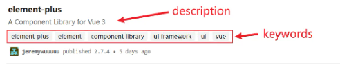
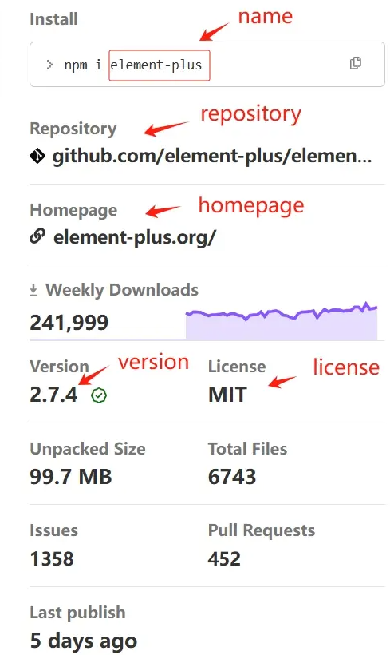

# 项目 packagejson 文件配置

## 前言

package.json 是一个用于描述和管理项目的配置文件，其中包含了许多字段和选项，可以影响项目的构建、依赖管理、脚本执行等方面。了解这些字段可以帮助开发者更好地理解和控制项目的行为。

它包含了项目的元数据信息，例如项目名称、版本号、作者、许可证等。同时，它还包含了项目的依赖项信息，包括项目所依赖的第三方库、框架以及工具等。通过 `package.json` 文件，我们可以方便地管理项目的依赖关系，使得项目的构建、发布和维护更加简单和可靠。

package.json 对于大部分前端开发者来说，知道 dependencies 与 devDependencies 就够了。但对于库开发者或有更高级需求的开发者来说，了解 package.json 的其他字段是非常有必要的。

本文介绍的字段分为官方字段与非官方字段。非官方字段是被主流打包工具（webpack，Rollup）所支持， 旨在提供更高级的配置和功能，以满足特定的构建需求，可能不具备通用性。

目前版本：v7.24.2

## 一、必须属性

### 1. name

定义项目的名称，不能以"."和"\_"开头，不能包含大写字母

### 2. version

定义项目的版本号，格式为：大版本号.次版本号.修订号

## 二、描述信息

### 1. description

项目描述

### 2. keywords

项目关键词

### 3. author

项目作者

```js
"author": "name (http://barnyrubble.tumblr.com/)"
```

### 4. contributors

项目贡献者

```js
"contributors": [
    "name <b@rubble.com> (http://barnyrubble.tumblr.com/)"
  ]
```

### 5. homepage

项目主页地址

### 6. repository

项目代码仓库地址

### 7. bugs

项目提交问题的地址

```js
 //提交问题的地址和反馈的邮箱,url通常是Github中的issues页面
"bugs": {
  "url" : "https://github.com/facebook/react/issues",
  "email" : "xxxxx@xx.com"
}
```

### 8. funding

指定项目的资金支持方式和链接

```js
"funding": {
    "type": "patreon",
    "url": "https://www.patreon.com/my-module"
  }
```

## 三、依赖配置

### 1. dependencies

生产环境的依赖包

如果不使用脱字符（^），安装的版本号固定；如果使用，则能安装当前大版本的最新版本，在 package-lock.json 中可查看当前实际安装的版本。

### 2. devDependencies

开发环境的依赖包，例如 webpack、vite、babel、ESLint 等，不会被安装到生产环境中

### 3. peerDependencies

对等依赖的作用：

1. 减小打包体积：例如使用 react 开发的组件库，安装 react 是必不可少的，而使用组件库的开发者，本地项目肯定安装了 react，因此开发的组件库中不必把 react 打包进去（期望项目的使用者来提供这些模块的实现）。
2. 版本一致性：使用你的组件库的开发者需要确保他们项目中安装了与你声明的对等依赖版本兼容的包，以确保组件库正常运行。

示例：声明要使用组件库，需在项目中安装大于 17.0.1 版本的 react

```js
"peerDependencies": {
    "react": ">17.0.1"
  }
```

### 4. peerDependenciesMeta

将对等依赖标记为可选，如果用户没有安装对等依赖，npm 不会发出警告

```js
"peerDependenciesMeta": {
    "react": {
      "optional": true //标记为可选
    }
  }
```

### 5. bundledDependencies

声明捆绑依赖项（使用情景较少）

### 6. optionalDependencies

声明可选依赖项（使用情景较少）

### 7. engines

声明对 npm 或 node 的版本要求

```js
"engines": {
    "node": ">=8.10.3 <12.13.0",
    "npm": ">=6.9.0"
  }
```

engines 只是起一个说明的作用，即使用户安装的版本不符合要求，也不影响依赖包的安装。

### 8. workspaces

单个代码库中统一管理多个包（monorepo），在 workspaces 声明目录下的 package 会软链到根目录的 node_modules 中。

#### 1. 初始化项目

```js
npm init -y
```

#### 2. 声明本项目是 workspaces 模式

```js
"private":"true",
  "workspaces": [
    "packages/*"
  ],
```

表示所有子包都在 packages 文件夹下

#### 3. 创建子包 p1

```js
npm init -w packages/p1 -y
```

在 node_modules/.package-lock.json 中可以看到 "link": true 链接符号信息

#### 4. 新建 packages/p1/index.js

```js
module.exports = "p1包";
```

#### 5. 创建子包 p2

```js
npm init -w packages/p2 -y
```

#### 6. 将子包 p1 添加到 p2 中

```js
npm i p1 -w p2
```

安装，卸载等命令都是一样的，只是多了"--workspace="参数（简写-w），用来指定在哪个包中执行命令

#### 7. 子包 p2 使用 p1

```js
const p1 = require("p1");

console.log("使用", p1);

module.exports = "p2包";
```

workspaces 功能与 lerna 类似，如果只需简单地管理多个包，workspaces 足够了。lerna 具有版本管理，发包提示，简化多包项目发布流程等更多功能。

## 四、脚本配置

### 1. scripts

脚本入口

### 2. config

用于定义项目的配置项，例如设置环境变量

1.config 配置

```js
"config": {
    "baseUrl": "https://example.com"
  }
```

2.scripts 配置

```js
"scripts": {
    "start": "node index.js",
},
```

### 3. 新建 index.js

```js
//使用process.env.npm_package_config_XXX取值
console.log(process.env.npm_package_config_baseUrl);
```

运行 npm run start，终端打印出 [example.com](https://example.com)

## 五、文件&目录

### 1. module（非官方字段）

指定 ES 模块入口文件

示例：当其他开发者在他们的项目中导入你的包时，会加载并执行包中的 dist/index.esm.js

```js
"main": "dist/index.esm.js"
```

### 2. main

指定 CommonJS 模块或 ES 模块入口文件。如果不指定该字段，默认是根目录下的 index.js

提示：从 Node.js 12.20.0 版本开始，"main" 字段也可以指定 ES 模块的入口文件

### 3. browser

指定浏览器使用的入口文件，例如 umd 模块。

### 4. types（非官方字段）

指定 TypeScript 类型声明文件（.d.ts 文件）的路径

### 5. exports（非官方字段）

当打包工具支持 exports 字段时（webpack、Rollup 等），以上 main，browser，module，types 四个字段都被忽略

"." 表示默认导出

"import": 指定了 ES module (ESM) 规范下的导出文件路径

"require": 指定了 CommonJS 规范下的导出文件路径

"browser": 指定了用于浏览器环境的导出文件路径

"types": 指定了类型声明文件的路径

```js
"exports": {
    ".": {
      "import": "./dist/index.esm.js",
      "require": "./dist/index.cjs.js",
      "browser": "./dist/index.umd.js",
      "types": "./dist/index.d.ts"
    }
  }
```

导出其他文件，例如除了导出默认路径，导出源文件

```js
"exports":{
    ...
  "./main" : "./src/main.js"
},
```

其他项目中使用

```js
import main from "packageName"; // . 方式定义的
import main from "packageName/main"; // ./main 方式定义的
```

### 6. type（非官方字段）

指定模块系统的使用方式，"commonjs"，"module"，"umd"，"json"

示例：指定模块系统为 ES module 模式，使用 CommonJS 文件时，需显式的定义为 .cjs 文件扩展名，来明确指定这些文件为 CommonJS 模块

```js
"type":"module"
```

### 7. files

指定哪些包被推送到 npm 服务器中

示例：只推送 index.js 和 dist 包到 npm 服务器

```js
"files": [
    "index.js",
    "dist"
  ],
```

可以在项目根目录新建一个.npmignore 文件，说明不需要提交到 npm 服务器的文件，类似.gitignore。写在这个文件中的文件即便被写在 files 属性里也会被排除在外

### 8. bin

定义在全局安装时可执行的命令（使用情景较少）

### 9. man

Linux 中的帮助指令（使用情景较少）

### 10. directories

定义项目目录结构的字段（使用情景较少）

## 六、发布配置

### 1. private

防止私有包发布到 npm 服务器，要发布到 npm 上设为 false

### 2. preferGlobal（非官方字段）

当设置 "preferGlobal" 字段为 true 时，它表示你的包更适合以全局方式安装，而不是作为项目的依赖项进行本地安装。

这个字段的设置是为了向用户传达关于你的包的最佳使用方式的建议。它并不会直接影响包的安装方式或包管理器的行为。

### 3. publishConfig

在发布包时指定特定的配置

示例：指定包发布的注册表 URL，指定所有用户都可以访问（私有的会收费）

```js
"publishConfig": {
    "registry": "https://registry.npmjs.org/",
    "access": "public"
  }
```

### 4. os

指定你的包适用的操作系统

示例：包只适用于 darwin（macOS）和 linux

```js
"os": ["darwin", "linux"]
```

示例：禁用 win32

```js
"os"["!win32"]; //禁用的操作系统
```

### 5. cpu

该配置和 OS 配置类似，用 CPU 可以更准确的限制用户的安装环境

### 6. license

指定软件的开源协议：

ISC：在所有副本中保留版权声明和许可证声明，使用者就可以拿你的代码做任何想做的事情，你也无需承担任何责任

MIT：在所有副本或主要部分中保留版权声明和许可证声明，使用者就可以拿你的代码做任何想做的事情，你也无需承担任何责任

开源协议查询地址：[opensource.org/licenses/](https://opensource.org/licenses/)

## 七、第三方配置（非官方字段）

### 1. eslintConfig

eslint 的配置，更推荐新建 .eslintrc 进行配置

使用参考：[新建 .eslintrc](https://juejin.cn/post/7228978346502946874#heading-16)

### 2. babel

babel 的配置，更推荐新建 .babelrc 进行配置

### 3. unpkg

unpkg 是一个基于 CDN 的前端包托管服务，用于在浏览器中直接引用和加载 npm 上发布的包。

无需下载，直接通过 `<script>` 标签引用

```js
<script src="https://unpkg.com/package-name@version"></script>
```

### 4. lint-staged

lint-staged 是一个在 Git 暂存文件上运行 linters 的工具，通常配合 gitHooks 一起使用。

使用参考：[配置 husky、lint-staged、@commitlint/cli](https://juejin.cn/post/7228978346502946874#heading-22)

### 5. browserslist

告知支持哪些浏览器及版本，Autoprefixer 常用到它

```js
"browserslist": [
    "defaults",
    "not ie < 8",
    "last 2 versions",
    "> 1%",
    "iOS 7",
    "last 3 iOS versions"
  ]
```

### 6. sideEffects

指示包是否具有副作用，协助 Webpack，Rollup 等进行 tree shaking

多数情况下可以直接设置为 false，这样打包工具就会自动删除未被 import 的代码

但是有些情况例外

1. 有一些特定的模块文件，它们执行一些副作用操作，如注册全局事件监听器、修改全局状态等。
2. 告诉构建工具不要将样式文件排除在无用代码消除的优化范围之外

```js
"sideEffects": ["./path/to/module.js", "*.css"]
```

## element-plus 包的 package.json

```json
{
  "name": "element-plus",
  "version": "2.3.12",
  "description": "A Component Library for Vue 3",
  "keywords": [
    "element-plus",
    "element",
    "component library",
    "ui framework",
    "ui",
    "vue"
  ],
  "homepage": "https://element-plus.org/",
  "bugs": {
    "url": "https://github.com/element-plus/element-plus/issues"
  },
  "license": "MIT",
  "main": "lib/index.js",
  "module": "es/index.mjs",
  "types": "es/index.d.ts",
  "exports": {
    ".": {
      "types": "./es/index.d.ts",
      "import": "./es/index.mjs",
      "require": "./lib/index.js"
    },
    "./es": {
      "types": "./es/index.d.ts",
      "import": "./es/index.mjs"
    },
    "./lib": {
      "types": "./lib/index.d.ts",
      "require": "./lib/index.js"
    },
    "./es/*.mjs": {
      "types": "./es/*.d.ts",
      "import": "./es/*.mjs"
    },
    "./es/*": {
      "types": ["./es/*.d.ts", "./es/*/index.d.ts"],
      "import": "./es/*.mjs"
    },
    "./lib/*.js": {
      "types": "./lib/*.d.ts",
      "require": "./lib/*.js"
    },
    "./lib/*": {
      "types": ["./lib/*.d.ts", "./lib/*/index.d.ts"],
      "require": "./lib/*.js"
    },
    "./*": "./*"
  },
  "unpkg": "dist/index.full.js",
  "jsdelivr": "dist/index.full.js",
  "repository": {
    "type": "git",
    "url": "git+https://github.com/element-plus/element-plus.git"
  },
  "publishConfig": {
    "access": "public"
  },
  "style": "dist/index.css",
  "sideEffects": [
    "dist/*",
    "theme-chalk/**/*.css",
    "theme-chalk/src/**/*.scss",
    "es/components/*/style/*",
    "lib/components/*/style/*"
  ],
  "peerDependencies": {
    "vue": "^3.2.0"
  },
  "dependencies": {
    "@ctrl/tinycolor": "^3.4.1",
    "@element-plus/icons-vue": "^2.0.6",
    "@floating-ui/dom": "^1.0.1",
    "@popperjs/core": "npm:@sxzz/popperjs-es@^2.11.7",
    "@types/lodash": "^4.14.182",
    "@types/lodash-es": "^4.17.6",
    "@vueuse/core": "^9.1.0",
    "async-validator": "^4.2.5",
    "dayjs": "^1.11.3",
    "escape-html": "^1.0.3",
    "lodash": "^4.17.21",
    "lodash-es": "^4.17.21",
    "lodash-unified": "^1.0.2",
    "memoize-one": "^6.0.0",
    "normalize-wheel-es": "^1.2.0"
  },
  "devDependencies": {
    "@types/node": "*",
    "csstype": "^2.6.20",
    "vue": "^3.2.37",
    "vue-router": "^4.0.16"
  },
  "vetur": {
    "tags": "tags.json",
    "attributes": "attributes.json"
  },
  "web-types": "web-types.json",
  "browserslist": ["> 1%", "not ie 11", "not op_mini all"],
  "gitHead": "89d4ec863ce55fc3de2f0513631e76f695f8e791"
}
```

### 基本字段

- **name**

  项目名称。该字段不能设置为空，它和版本号组成唯一的标识来代表整个项目，字母不能大写，可以使用`-`，`_`符号，如果需要在 [npm](https://link.juejin.cn?target=https%3A%2F%2Fwww.npmjs.com%2F) 平台发布，需要保证你的 `name` 在平台是唯一的。

- **version**

  项目的版本号。需要发布 npm 平台的时候该字段为必输。

- **description**

  项目描述。该字段可以在 npm 平台搜索该包的时候起到作用。
  

- **keywords**

  关键词。在 npm 平台搜索的关键词，该字段为数组，可设置多个关键词。

- **homepage**

  项目的主页 URL。

- **bugs**

  项目提交问题的地址。

- **license**

  项目的许可证（软件的开源协议）。
  

- **main**

  npm 包的 `CommonJS` 入口文件。如果不设置则默认查找这个包根目录下的 `index.js` 文件。当我们使用 `require` 引入包的时候则会查找 `main` 对应路径的文件进行引入。这个文件应该遵循 `CommonJS` 模块规范，并且基于 `ES5` 规范编写。

  

- **module**
  npm 包的 `ESM` 规范的入口文件。这样的文件可以使用 `ES6` 的 `import/export` 语法，并支持 `Tree Shaking` 等特性。`main` 和 `module` 字段在 package.json 中共同存在时，分别用于指定不同模块规范下的入口文件，以满足不同环境和工具的需求。

> 平时我们引入三方包的时候例如 `import ElementPlus from "element-plus";`，他会先找到这个包，然后在包里面的`package.json`文件中找到 `module`对应的入口文件，等于你引入的就是这个 es 下的 `index.mjs` 文件


- **types**

  `TypeScript` 类型定义文件的路径。

  

  **exports**

  定义包的子路径导出映射。

  ```json
  "exports": {
    ".": {
      "import": "./index.esm.js", // 当使用 ESM 语法导入包时，解析到这个文件
      "require": "./index.cjs" // 当使用 require() 导入包时，解析到这个文件
    },
    "./feature": {
      "import": "./feature/esm/index.js", // 当导入特定的特性时，为 ESM 提供不同的入口点
      "require": "./feature/cjs/index.js" // 当导入特定的特性时，为 CommonJS 提供不同的入口点
    }
  },
  ```

- **unpkg**

  CDN 服务地址。

  > "unpkg": "dist/index.full.js" 相当于映射 "[unpkg.com/element-plu…](https://element-plus@2.3.12%2Fdist/index.full.js)"

- **repository**

  包代码存放仓库地址。可以为字符串（仓库地址），可以为对象如上面的`element-plus`中的`repository`

- **publishConfig**

  npm 包的发布指定特定的配置。该配置将覆盖全局或用户级别的 npm 配置。这对于需要将包发布到私有 npm 仓库或具有特殊发布需求的场景特别有用。

  > publishConfig 是一个对象包含以下属性:
  >
  > `registry`：指定 npm 包的发布仓库地址。（私有 npm 仓库可以在这指定 url）
  >
  > `access`：包的访问级别（默认 `public` 公开，`restricted` 私有）
  >
  > `tag`：为发布的 npm 包指定一个标签。默认情况下 npm 包会使用 `latest` 标签发布，你可以手动指定为 `beta`

- **style**

  该字段不是标准的 npm 字段，代表包中的样式文件路径。当 style 字段被设置时，某些工具（如 Webpack 的某些 loader 或构建脚本）可能会自动处理或包含这个样式文件。这通常用于那些希望将样式文件直接包含在其包中的前端库或组件。

- **sideEffects**

  用于告知打包工具（如 Webpack）哪些文件或模块在引入时具有副作用，从而影响 tree shaking 的行为。

  > 在 package.json 中，sideEffects 字段是 Webpack v4 及更高版本引入的一个特性，用于标记项目中的某些文件或模块是否包含副作用（side effects）。这个字段对于 Webpack 的 tree shaking（树摇）优化至关重要。 通过正确配置 sideEffects，打包工具可以更有效地移除未使用的代码，减小最终打包文件的大小。

- **peerDependencies**

  对等依赖。 `peerDependencies` 字段用于声明一个 package 与依赖它的宿主应用程序所使用的其他 package 之间的兼容性限制。例如上面的`element-plus`中的`peerDependencies`是依赖的`vue@3.2.0`的版本，也就是你当前项目的 vue 版本不能低于`vue@3.2.0`，否则会出现兼容性报错。

- **dependencies**

  项目的生产环境中所必须的依赖包。

- **devDependencies**

  开发阶段需要的依赖包。比如 less、scss、eslint 等。

  > npm 安装包时常见的基本参数以及作用：
  >
  > 1. 无参数 （npm install <包名>） 默认会添加到 package.json 文件中的 `dependencies` 中。
  > 2. --save 或者 -S 同上。
  > 3. --save-dev 或者 -D 添加到 package.json 文件中的 `dependencies` 中，通常用于开发环境依赖的包。
  > 4. --global 或 -g 将包安装到全局环境，而不是当前项目的本地环境，这可以让这个包在任何项目使用，一般用于工具包。
  > 5. --production 仅安装到生产环境
  > 6. --no-save 安装的包但不会添加到 package.json 中的依赖项中。
  > 7. --no-package-lock 安装包时不生成 package-lock.json 文件。

- **browserslist**

  > "> 1%"：表示支持全球使用率超过 1% 的浏览器。 "not ie 11"：不支持 ie11。 "not op_mini all"：不支持所有版本的 Opera Mini 浏览器。

### 重要字段补充

除了 `element plus` 的 `package.json`中的字段外，还有一些常见以及重要的，下面做一补充：

- **scripts**

  项目的脚本命令，这些命令可以通过 `npm run <script-name>` 来执行。

- **bin**

  指定命令以及对应执行文件路径。这些文件通常会有可执行权限，并且包含一些可以在命令行中运行的代码。例如：

  ```json
  {
    "name": "my-tool",
    "version": "1.0.1",
    "bin": {
      "my-tool": "./bin/index.js"
    },
    "scripts": {
      "start": "node index.js"
    }
    //...
  }
  ```

- **files**

  发布 npm 时指定需要上传的文件或者目录。如果你有少数不上传的文件，那可以创建一个.npmignore 文件（类似于.gitignore，但该文件不会上传 npm），去掉你不需要上传的文件，其余都上传。例如：

  ```
  node_modules
  packages
  ```

- **engines**

  当前包或者项目依赖的环境。有些项目所以来的包跟 npm 的版本或者 node 版本有要求，不符合版本的时候项目经常启动不起来，该文件只是说明该项目所需要的 node 版本，并非起到限制作用。

### package-lock.json（npm）、pnpm-lock.yaml（pnpm）

这些文件会在首次使用 `npm`/`pnpm` 安装依赖的时候生成，用于锁定项目依赖的确切版本，包含主模块和所有依赖的子模块。主要用于避免由于依赖版本更新导致的不一致问题，保证是相同的依赖树。当我们更新某个包的版本的时候，同时也会修改 `package-lock.json`。 依赖项的存储方式有所不同，`pnpm` 使用“硬链接”来存储依赖项，而 `npm` 和 `yarn` 则复制依赖项到每个项目的 `node_modules` 目录中。

### 依赖版本的管理

一般版本号遵循 [semver](https://semver.org/lang/zh-CN/) 版本规范，版本通常由三位构成：x.y.z。分别对应主版本号、次版本号、修订号。

1. 主版本号：该版本一般变化较大，可能不会兼容上个主版本的功能。
2. 次版本号：在主版本的功能上进行更新，兼容同主版本的功能。
3. 修订号：当修正了版本的 bug 之类

- `x.y.z`：安装指定的版本
- `^x.y.z`：安装最新的次版本或者修订版本，只要次版本号或者修订号更新，就会安装最新的包
- `~x.y.z`：安装最新的修订版本，只要修订号发生了变化，就会安装最新的包
