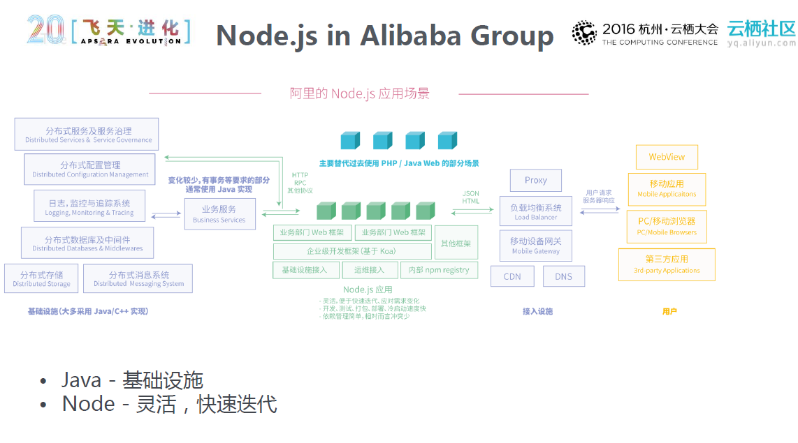

# EggJs 框架

## EggJs 介绍

EggJs 是阿里为使用 Node.js & Koa 构建更好的企业框架和应用程序而诞生

Egg 选择了 Koa 作为其基础框架，在它的模型基础上，进一步对它进行了一些增强

### Egg 在阿里


### Node 在阿里



### Egg 特性

- 提供基于 Egg [定制上层框架](https://www.eggjs.org/zh-CN/advanced/framework)的能力
- 高度可扩展的[插件机制](https://www.eggjs.org/zh-CN/basics/plugin)
- 内置[多进程管理](https://www.eggjs.org/zh-CN/advanced/cluster-client)
- **基于  [Koa](http://koajs.com/)  开发，性能优异**
- 框架稳定，测试覆盖率高
- [渐进式开发](https://www.eggjs.org/zh-CN/intro/progressive)

### Egg 优势

- 1.Express 和 Koa 没有约束和规范, 会导致团队的沟通成本和项目的维护成本变高，EggJS 有约束和规范, 会大大降低团队的沟通成本和项目的维护成本

  - 什么是有约束和规范?

    和 ESLint 检查 JS 代码一样, 有一套标准, 必须严格遵守这套标准 ,否则就会报错

    <https://eggjs.org/zh-cn/basics/structure.html>

- 2.阿里内部大量企业级项目使用 egg 开发, 实践出真知

- 3.Node 社区 5 位国人核心贡献者 4 人在阿里, 技术有保障

- 4.阿里前端安全专家，负责 egg-security 等类库, 安全有保障

### Egg 开发遵循 MVC 规范，什么是 MVC？

M(Model)：处理应用程序'数据逻辑'的部分(service)

V(View)：处理数据显示的部分(静态/动态网页)

C(Controller)：处理应用程序业务逻辑, 数据和页面的桥梁(controller)

推荐阅读: <https://github.com/atian25/blog/issues/18>

## EggJS 相关网址文档

EggJs 官网：<https://www.eggjs.org/zh-CN>

EggJs 中文文档：<https://www.eggjs.org/zh-CN/intro/quickstart>

EggJs 开源 GitHub 地址：<https://github.com/eggjs/egg>

## EggJS 实战 😁

实战写完的 demo：[muyaCode/egg-demo: egg 项目练习 (github.com)](https://github.com/muyaCode/egg-demo)

---

看快速入门文档，脚手架初始化项目：[快速入门 - Egg (eggjs.org)](https://www.eggjs.org/zh-CN/intro/quickstart)

### 1.eggjs 的项目结构

文档：[目录结构 - Egg (eggjs.org)](https://www.eggjs.org/zh-CN/basics/structure)

项目需要根据官方目录结构规范开发，否则不能正常运行

---

### 2.项目运行环境配置

文档：[运行环境 - Egg (eggjs.org)](https://www.eggjs.org/zh-CN/basics/env)

---

### 3.项目的安全策略配置-config 目录

config 配置-文档：[Config 配置 - Egg (eggjs.org)](https://www.eggjs.org/zh-CN/basics/config)

EggJS 给我们提供了多种配置文件, 方便我们在不同的阶段中使用

- config.prod.js     // 只有线上环境会加载

- config.test.js     // 只有测试环境会加载

- config.local.js     // 只有开发环境会加载

- config.default.js   // 所有环境都会加载

如果出现同名的配置,，后面三个配置文件中的配置会覆盖 default 中的配置

---

#### 如何设置当前环境?

```js
EGG_SERVER_ENV = xxx;
```

运行环境-配置文档：[运行环境 - Egg (eggjs.org)](https://www.eggjs.org/zh-CN/basics/env)

##### 需要配合`cross-env`环境变量库使用

package.json 文件内配置：

`egg-scripts start --daemon` 此命令可以查看应用部署文档：[应用部署 - Egg (eggjs.org)](https://www.eggjs.org/zh-CN/core/deployment)

```json
"scripts": {
    "dev": "cross-env EGG_SERVER_ENV=dev egg-bin dev",
    "prod": "cross-env EGG_SERVER_ENV=prod egg-scripts start --daemon",
    "stop": "egg-scripts stop"
  },
```

配合上面的 config 的各个配置文件，达到环境变量配置的作用

---

安全配置-文档：[安全 - Egg (eggjs.org)](https://www.eggjs.org/zh-CN/core/security)

---

### 4.内置基础对象

文档：[框架内置基础对象 - Egg (eggjs.org)](https://www.eggjs.org/zh-CN/basics/objects)

### 5.静态资源目录-app/public

把静态资源放在`app/public`目录下，会自动解析

浏览器访问：`localhost:7001/public/login.html`

项目内访问：

### 6.动态资源处理-模板渲染

模板渲染文档：[View 模板渲染 - Egg (eggjs.org)](https://www.eggjs.org/zh-CN/core/view)

我们这里选择用 ejs 渲染模板插件

#### 1.安装`egg-view-ejs`插件

```bash
npm i egg-view-ejs --save --legacy-peer-deps

# --legacy-peer-deps：解决安装报错↓，插件不兼容
# npm ERR! code ERESOLVE
# npm ERR! ERESOLVE could not resolve
```

#### 2.在 config 目录下新建 plugin.js-写入配置

```js
exports.ejs = { enable: true, package: "egg-view-ejs" };
```

#### 3.在 config.default.js 中新增如下配置

```js
view: { mapping: { '.html': 'ejs' } },
```

#### 4.在 app 目录中新建 view 目录, 将动态网页放到这个目录中

文件：app/view/index.html

```html
<!DOCTYPE html>
<html lang="en">
	<head>
		<meta charset="UTF-8" />
		<title>动态网页</title>
	</head>
	<body>
		<h1>我是动态网页</h1>
		<h2><%=msg%></h2>
	</body>
</html>
```

#### 5.在控制器中通过上下文 render 方法渲染

控制器中添加新方法：app/controller/home.js

```js
// 模板渲染
async getHome() {
  await this.ctx.render('index', { msg: 'ejs模板渲染' });
}
```

在路由中使用控制器方法渲染页面

```js
// ejs模板渲染引擎页面
router.get("/home", controller.home.getHome);
```

---

### 7.数据库操作和网络数据处理-服务（Service）

Service 文档：[服务（Service） - Egg (eggjs.org)](https://www.eggjs.org/zh-CN/basics/service)

#### 1.项目新建 app/service 目录

目录下新建与控制器同名的服务方法模块 js

`app/service/home.js`

```js
// app/service/home.js
const Service = require("egg").Service;

class HomeService extends Service {
	async findNews() {
		// 发送get不带参数的请求
		// let response = await this.ctx.curl('http://127.0.0.1:3000/getUser');
		// 发送get带参数的请求
		// let response = await this.ctx.curl('http://127.0.0.1:3000/getUser2?name=it666&age=66');
		// 发送post不带参数的请求
		// let response = await this.ctx.curl('http://127.0.0.1:3000/getNews', {
		//     method: 'post'
		// });
		// 发送post带参数的请求
		const response = await this.ctx.curl("http://localhost:3000/getNews2", {
			method: "post",
			data: {
				name: "lnj",
				age: 33,
			},
		});
		const data = JSON.parse(response.data);
		console.log("HomeService", data);
		return data;
	}
}

module.exports = HomeService;
```

#### 2.使用 service 的数据请求处理的服务方法

控制器中新添加方法：app/controller/home.js

```js
async getNews(){
  let data = await this.ctx.service.home.findNews();
  this.ctx.body = data;
}
```

在路由中使用方法：app/router.js

```js
// 数据处理
router.get("/news", controller.home.getNews);
```

#### service 注意点

1. service 目录必须放在 app 目录中

2. service 目录支持多级目录, 如果是多级目录, 那么在调用的时候可以使用链式调用

   1. `this.ctx.service.abc.def.text.xxx();`

3. service 中的 js 文件, 如果是以\_或者首字母都是大写, 那么在调用的时候必须转换成驼峰命名

   1. `get_user.js --- getUser`

   2. `GetUser.js --- getUser`

---

### 8.处理 Cookie 和 Session

文档：[Cookie 与 Session - Egg (eggjs.org)](https://www.eggjs.org/zh-CN/core/cookie-and-session)

---

### 9.处理日志

文档：[日志 - Egg (eggjs.org)](https://www.eggjs.org/zh-CN/core/logger)

---

### 10.定时任务

文档：[定时任务 - Egg (eggjs.org)](https://www.eggjs.org/zh-CN/basics/schedule)

#### EggJS 定时任务(计划任务)?

虽然我们通过框架开发的 Web 服务器是请求响应模型的，但是仍然还会有许多场景需要执行一些定时任务，例如：

- 定时进行文件切割、临时文件删除。

- 定时上报应用状态。(例如监控系统, 时时监控系统有没有问题, 典型例子 MongoDB/Redis 集群选举)

- 定时从远程接口更新本地缓存。

Egg 框架提供了一套机制来让定时任务的编写和维护更加优雅

##### 1.定义定时任务

新建文件：`app/schedule/updateMessage.js`

```js
const Subscription = require("egg").Subscription;

class UpdateCache extends Subscription {
	// 通过 schedule 属性来设置定时任务的执行间隔等配置
	static get schedule() {
		return {
			interval: "3s", // 间隔3秒执行一次
			type: "all", //  all表示当前服务器上所有相同的Node进程都执行
		};
	}

	// subscribe 是真正定时任务执行时被运行的函数
	async subscribe() {
		let response = await this.ctx.curl("http://127.0.0.1:3000/getMsg");
		let data = new Buffer(response.data).toString();
		console.log(data);
	}
}

module.exports = UpdateCache;
```

接下来`npm run dev`运行当前 egg 项目，定时任务便会定时执行定时任务`subscribe`方法

##### 2.定时任务渲染到当前项目的模板引擎

控制器中添加方法：

```js
// 定时任务渲染方法
async test() {
  await this.ctx.render('index', { msg: this.ctx.app.msg });
}
```

添加路由：

```js
// 定时任务路由
router.get("/test", controller.home.test);
```

##### 3.启动自定义

文档：[启动自定义 - Egg (eggjs.org)](https://www.eggjs.org/zh-CN/basics/app-start)

###### 1.项目根目录新建文件：app.js

```js
// app.js
class AppBootHook {
	constructor(app) {
		this.app = app;
	}
	// 这个方法会在EggJS程序启动完毕之后执行
	async serverDidReady() {
		// 注意点: 这里传递的不是方法名称, 而是需要被执行的那个定时任务文件的名称
		await this.app.runSchedule("updateMessage");
	}
}

module.exports = AppBootHook;
```

然后`npm run dev`运行当前 egg 项目

---

### 11.Egg 框架扩展

在开发中，我们既可以使用已有的扩展 API 来方便开发，也可以对以上对象进行自定义扩展，进一步加强框架的功能

文档：[框架扩展 - Egg (eggjs.org)](https://www.eggjs.org/zh-CN/basics/extend)

---

### 12.Egg 中间件

文档：[中间件（Middleware） - Egg (eggjs.org)](https://www.eggjs.org/zh-CN/basics/middleware)

app/middleware 目录

---

### 13.Egg 操作数据库

MySQL：[MySQL - Egg (eggjs.org)](https://www.eggjs.org/zh-CN/tutorials/mysql)

Sequelize：[Sequelize - Egg (eggjs.org)](https://www.eggjs.org/zh-CN/tutorials/sequelize)

---

### 14.CSRF 安全防范

文档：[安全 - Egg (eggjs.org)](https://www.eggjs.org/zh-CN/core/security#%E5%AE%89%E5%85%A8%E5%A8%81%E8%83%81-csrf-%E7%9A%84%E9%98%B2%E8%8C%83)

跨站请求伪造攻击

---

### 15.数据校验

使用`egg-validate`库，npm 文档：[egg-validate - npm (npmjs.com)](https://www.npmjs.com/package/egg-validate)

在`controller`控制器层校验前端传过来的表单数据：[控制器（Controller） - Egg (eggjs.org)](https://www.eggjs.org/zh-CN/basics/controller)

---

### 16.统一接口返回相应格式配置

框架扩展文档：[框架扩展 - Egg (eggjs.org)](https://www.eggjs.org/zh-CN/basics/extend)

对 context 进行扩展：[框架扩展#context - Egg (eggjs.org)](https://www.eggjs.org/zh-CN/basics/extend#context)

#### 1.新建`app/extend`目录下的文件：app/extend/context.js

```js
module.exports = {
	// 请求成功返回
	success(data, code = 200, msg = "成功") {
		// this 就是 ctx 对象，在其中可以调用 ctx 上的其他方法，或访问属性
		this.body = {
			code: code,
			msg: msg,
			data: data,
		};
	},
	// 请求错误
	error(code = 500, msg = "错误") {
		// this 就是 ctx 对象，在其中可以调用 ctx 上的其他方法，或访问属性
		this.body = {
			code: code,
			msg: msg,
		};
	},
};
```

#### 2.定义请求成功和错误的状态码：app\extend\helper.js

```js
module.exports = {
	errorCode: {
		// 成功状态码
		200: "请求成功。客户端向服务器请求数据，服务器返回相关数据",
		201: "资源创建成功。客户端向服务器提供数据，服务器创建资源",
		202: "请求被接收。但处理尚未完成",
		204: "客户端告知服务器删除一个资源，服务器移除它",
		206: "请求成功。但是只有部分回应",
		// 错误状态码
		400: "请求无效。数据不正确，请重试",
		401: "请求没有权限。缺少API token，无效或者超时",
		403: "用户得到授权，但是访问是被禁止的。",
		404: "发出的请求针对的是不存在的记录，服务器没有进行操作。",
		406: "请求失败。请求头部不一致，请重试",
		410: "请求的资源被永久删除，且不会再得到的。",
		422: "请求失败。请验证参数",
		// 服务器错误状态码
		500: "服务器发生错误，请检查服务器。",
		502: "网关错误",
		503: "服务不可用，服务器暂时过载或维护。",
		504: "网关超时",
	},
};
```

#### 3.返回请求状态

控制器方法中返回错误状态码信息示例：

```js
ctx.success(res);
```

```js
// 抛出的错误会在cath内捕获
try{}cath(e){ctx.error(400, ctx.helper.errorCode[400]);}
```

---

### 17.用户密码加密工具方法

使用`crypto`库，写 md5 加密方法：app\extend\helper.js

```js
const crypto = require("crypto");
module.exports = {
	errorCode: {
		// 成功状态码
		200: "请求成功。客户端向服务器请求数据，服务器返回相关数据",
		201: "资源创建成功。客户端向服务器提供数据，服务器创建资源",
		202: "请求被接收。但处理尚未完成",
		204: "客户端告知服务器删除一个资源，服务器移除它",
		206: "请求成功。但是只有部分回应",
		// 错误状态码
		400: "请求无效。数据不正确，请重试",
		401: "请求没有权限。缺少API token，无效或者超时",
		403: "用户得到授权，但是访问是被禁止的。",
		404: "发出的请求针对的是不存在的记录，服务器没有进行操作。",
		406: "请求失败。请求头部不一致，请重试",
		410: "请求的资源被永久删除，且不会再得到的。",
		422: "请求失败。请验证参数",
		// 服务器错误状态码
		500: "服务器发生错误，请检查服务器。",
		502: "网关错误",
		503: "服务不可用，服务器暂时过载或维护。",
		504: "网关超时",
	},
	// md5加密方法
	_md5(password) {
		// 1.指定加密方式
		const md5 = crypto.createHash("md5");
		// 2.指定需要加密的内容和加密之后输出的格式
		const hash = md5
			.update(password) // 指定需要加密的内容
			.digest("hex"); // 指定加密之后输出的格式
		return hash;
	},
	// 用户密码加密工具方法
	generatePwd(password) {
		password = password + this.config.keys;
		let hash = this._md5(password);
		return hash;
	},
};
```

service 中调用方法：

```js
// 调用用户密码加密方法
this.ctx.helper.generatePwd(password);
```

---

### 18.防止重复注册

方式 1：数据库插入语句使用：UNIQUE

方式 2：插入数据前先查询是否已经有这个用户或者相同数据

抛出异常：throw new Error('当前用户已存在')

ctx 这边会捕获异常：ctx.error(400, e.message);

---

### 19.实现登录

#### 1.前端登录后，后端需要返回数据

#### 2.实现登录保存状态：使用`egg-redis`库+`egg-session-redis`库，连接 redis，保存登录的 session

egg-redis 的 npm 文档：[egg-redis - npm (npmjs.com)](https://www.npmjs.com/package/egg-redis)

egg-session-redis 的 npm 文档：[egg-session-redis - npm (npmjs.com)](https://www.npmjs.com/package/egg-session-redis)

#### 3.配置插件

`config\plugin.js`中使用：

```js{17-20}
'use strict';

/** @type Egg.EggPlugin */
module.exports = {
    ajv : {
        enable: true,
        package: 'egg-ajv',
    },
    sequelize : {
        enable: true,
        package: 'egg-sequelize',
    },
    sessionRedis : {
        enable: true,
        package: 'egg-session-redis',
    },
    redis : {
        enable: true,
        package: 'egg-redis',
    }
};
```

#### 4.数据库的连接配置，都是在`config\config.default.js`文件内

```js{32-39}
'use strict';

/**
 * @param {Egg.EggAppInfo} appInfo app info
 */
module.exports = appInfo => {
  /**
   * built-in config
   * @type {Egg.EggAppConfig}
   **/
  const config = exports = {};

  // use for cookie sign key, should change to your own and keep security
  config.keys = appInfo.name + '_1592213709118_461';

  // add your middleware config here
  config.middleware = [];

  config.ajv = {
    keyword: 'schema',  // to indicate the namespace and path of schemas, default as 'schema'
    allErrors: true,    // required for custom error message
    jsonPointers: true,  // required for custom error message
  };
  config.sequelize = {
      dialect: 'mysql',
      host: '127.0.0.1',
      port: 3306,
      user: 'root',
      password: 'root',
      database: 'demo',
  };
  config.redis = {
      client: {
          port: 6379,          // Redis port
          host: '127.0.0.1',   // Redis host
          password: '',
          db: 0,
      },
  };
  // add your user config here
  const userConfig = {
    // myAppName: 'egg',
  };

  return {
    ...config,
    ...userConfig,
  };
};
```

#### 5.前端登录后传递过来参数，`egg-session-redis`库会注入上下文属性：ctx.session.user

把 ctx.session.user 保存登录的用户

```js
ctx.session.user = 前端登录后，后端查询到的登录的用户信息
```

---

### 20.Egg 项目测试：单元测试

#### 单元测试

文档：[单元测试 - Egg (eggjs.org)](https://www.eggjs.org/zh-CN/core/unittest)

##### 1.什么是单元测试?

单元测试是指对软件中的最小可测试单元进行检查和验证

##### 2.什么是最小可测试单元?

一个函数, 一个类, 一个文件, 这些都可以称之为最小可测试单元

具体需要根据实际情况去判定其具体含义, 一般情况下我们以函数作为最小单元即可

##### 3.单元测试有什么用?

- 保证代码的正确性

- 保存程序的稳定性

- 增强自信心

- 公司领导要求(红绿灯)

##### 4.在 EggJS 中如何进行单元测试

###### 4.1 EggJS 使用 Mocha 测试框架和 power-assert 断言库来进行单元测试

- Mocha：<https://mochajs.org/>

- 作用 : 提供了编写测试代码的方法

- power-assert: <https://github.com/power-assert-js/power-assert>

- 作用 : 判断测试结果是否正确

###### 4.2 EggJS 还抽取了一个叫做 egg-mock 的辅助模块, 配合 Mocha 和 power-assert 进行测试

- egg-mock:     <https://www.npmjs.com/package/egg-mock>

- 作用 : 帮助我们能够在单元测试中模拟 app, context, cookie, session, 网络请求等

###### 4.3 EggJS 规定了测试文件的存放路径和文件名称

```bash
# 测试文件的目录结构和文件名称 和 被测试文件的目录结构和名称必须一样
# 测试文件的文件名称增加.test后缀
test
    app
    ├────
       ├── controller
       │   └── home.test.js
       ├── hello.test.js
       └── service
           └── user.test.js
```

###### 4.4 egg 项目运行测试文件

EggJS 规定我们使用 egg-bin test 来运行我们编写的测试文件

```bash
egg-bin test
```

---

#### 测试库模板和测试的生命周期

```js
"use strict";
/*
app   :服务端实例对象
mock  :egg提供给我们的辅助模块对象
assert:断言库对象
* */
const { app, mock, assert } = require("egg-mock/bootstrap");
/*
在测试文件中一个describe函数就是一组相关的测试
也就是说我们需要把一组相关的测试写到一个describe函数中
第一个参数: 这组测试的名称
第二个参数: 编写这组测试具体代码的地方
* */
describe("test/app/controller/user.test.js", () => {
	/*
  在一个describe方法中的一个it就是一个测试用例
  一个it可以用来测试一个方法(函数)
  第一个参数: 给当前的这个测试取的名称
  第二个参数: 编写具体测试代码的函数
  * */
	// it('should assert', () => {
	//
	// });
	/*
  Mocha测试库的生命周期钩子
  单个测试用例的
  before -> beforeEach -> it -> afterEach -> after
  多个测试用例
  before -> beforeEach -> it -> afterEach -> beforeEach -> it -> afterEach -> after
  before ->
  beforeEach -> it -> afterEach
  beforeEach -> it -> afterEach
  beforeEach -> it -> afterEach
  -> after

  生命周期钩子的作用:
  我们可以在测试用例执行之前去申请一些资源
  我们可以在测试用例执行之后去释放申请的资源
  例如: 我们需要测试数据库, 那么我们可以在测试之前往数据库中添加一些测试数据
        然后在测试完成之后删除这些测试数据
  * */
	before(() => {
		console.log("before");
	});
	beforeEach(() => {
		console.log("beforeEach");
	});
	it("具体的测试用例", () => {
		console.log("it");
	});
	it("具体的测试用例", () => {
		console.log("it");
	});
	it("具体的测试用例", () => {
		console.log("it");
	});
	afterEach(() => {
		console.log("afterEach");
	});
	after(() => {
		console.log("after");
	});
});
```

---

#### 同步测试和异步测试

```js
"use strict";
const { app, mock, assert } = require("egg-mock/bootstrap");

describe("test/app/controller/user.test.js", () => {
	/*
  Mocha: 同步测试和异步测试
  * */
	it("同步测试", () => {
		// console.log('it');
		// 模拟了一个上下文
		let ctx = app.mockContext({
			session: { name: "lnj" },
		});
		// 希望上下文中有session, 并且保存了name, 并且name是lnj
		// 以下代码的含义: 断定上下文中有session, session中有name,name取值是lnj
		assert(ctx.session.name === "lnj");
	});
	it("异步测试-promise", () => {
		return app.httpRequest().get("/public/login.html").expect(200);
	});
	it("异步测试-callback", (done) => {
		app.httpRequest().get("/public/login.html").expect(200, done);
	});
	it("异步测试-async+await", async () => {
		await app.httpRequest().get("/public/login.html").expect(200);
	});
});
```

---

#### 测试控制器

```js
"use strict";
const { app, mock, assert } = require("egg-mock/bootstrap");

describe("test/app/controller/user.test.js", () => {
	it("测试注册-成功", async () => {
		app.mockCsrf();
		let user = { username: "123@qq.com", password: "abc123", gender: "男" };
		let response = await app
			.httpRequest()
			.post("/api/user/register")
			.send(user);
		assert(response.body.code === 200);
	});
	it("测试注册-用户名不符合预期", async () => {
		app.mockCsrf();
		let user = { username: "jonathan", password: "abc123", gender: "男" };
		let response = await app
			.httpRequest()
			.post("/api/user/register")
			.send(user);
		assert(response.body.code === 400);
	});
	it("测试注册-密码不符合预期", async () => {
		app.mockCsrf();
		let user = { username: "234@qq.com", password: "123", gender: "男" };
		let response = await app
			.httpRequest()
			.post("/api/user/register")
			.send(user);
		assert(response.body.code === 400);
	});
	// 测试完成执行
	after(async () => {
		await app.model.User.destroy({ truncate: true, force: true });
	});
});
```

---

#### 测试 Service

```js
"use strict";
const { app, mock, assert } = require("egg-mock/bootstrap");

describe("test/app/service/user.test.js", () => {
	it("测试创建用户-成功", async () => {
		// 测试创建成功
		let ctx = app.mockContext();
		let user = { username: "123@qq.com", password: "abc123", gender: "男" };
		let res = await ctx.service.user.createUser(user);
		assert(res.username === "123@qq.com");

		// 测试用户名重复情况
		try {
			await ctx.service.user.createUser(user);
		} catch (e) {
			assert(e);
		}
	});
	after(async () => {
		await app.model.User.destroy({ truncate: true, force: true });
	});
});
```

---

#### 测试 Application

被测试文件：app/extend/application.js

```js
let cache = {};
module.exports = {
	set(key, value) {
		cache[key] = value;
	},
	get(key) {
		return cache[key];
	},
};
```

测试文件：test\app\extend\application.test.js

```js
"use strict";
const { app, mock, assert } = require("egg-mock/bootstrap");

describe("test/app/extend/application.test.js", () => {
	it("测试application", async () => {
		app.set("name", "it666.com");
		assert(app.get("name") === "it666.com");
	});
});
```

---

#### 测试 Context

被测试文件：app\extend\context.js

```js
module.exports = {
	success(data, code = 200, msg = "成功") {
		// this 就是 ctx 对象，在其中可以调用 ctx 上的其他方法，或访问属性
		this.body = {
			code: code,
			msg: msg,
			data: data,
		};
	},
	error(code = 500, msg = "错误") {
		// this 就是 ctx 对象，在其中可以调用 ctx 上的其他方法，或访问属性
		this.body = {
			code: code,
			msg: msg,
		};
	},
};
```

测试文件：test\app\extend\context.test.js

```js
"use strict";
const { app, mock, assert } = require("egg-mock/bootstrap");

describe("test/app/extend/context.test.js", () => {
	it("测试context", async () => {
		let ctx = app.mockContext();
		ctx.error();
		assert(ctx.body.code === 500);
		assert(ctx.body.msg === "错误");
	});
});
```

---

#### 测试 Request

被测试文件：app\extend\request.js

```js
module.exports = {
	isChrome() {
		let userAgent = this.get("user-agent").toLowerCase();
		return userAgent.includes("chrome");
	},
};
```

被测试文件：test\app\extend\request.test.js

```js
"use strict";
const { app, mock, assert } = require("egg-mock/bootstrap");

describe("test/app/extend/request.test.js", () => {
	it("测试request", async () => {
		let ctx = app.mockContext({
			headers: {
				// 'user-agent':'Chrome'
				"user-agent": "Mozilla",
			},
		});
		// assert(ctx.request.isChrome() === true);
		assert(ctx.request.isChrome() === false);
	});
});
```

---

#### 测试 Response

被测试文件：app\extend\response.js

```js
module.exports = {
	isSuccess() {
		return this.status === 200;
	},
};
```

被测试文件：test\app\extend\response.test.js

```js
"use strict";
const { app, mock, assert } = require("egg-mock/bootstrap");

describe("test/app/extend/request.test.js", () => {
	it("测试response", async () => {
		let ctx = app.mockContext();
		assert(ctx.response.isSuccess() === true);
	});
});
```

---

#### 测试 Helper

被测试文件：app\extend\helper.js

```js
const crypto = require("crypto");
module.exports = {
	errorCode: {
		// 成功状态码
		200: "请求成功。客户端向服务器请求数据，服务器返回相关数据",
		201: "资源创建成功。客户端向服务器提供数据，服务器创建资源",
		202: "请求被接收。但处理尚未完成",
		204: "客户端告知服务器删除一个资源，服务器移除它",
		206: "请求成功。但是只有部分回应",
		// 错误状态码
		400: "请求无效。数据不正确，请重试",
		401: "请求没有权限。缺少API token，无效或者超时",
		403: "用户得到授权，但是访问是被禁止的。",
		404: "发出的请求针对的是不存在的记录，服务器没有进行操作。",
		406: "请求失败。请求头部不一致，请重试",
		410: "请求的资源被永久删除，且不会再得到的。",
		422: "请求失败。请验证参数",
		// 服务器错误状态码
		500: "服务器发生错误，请检查服务器。",
		502: "网关错误",
		503: "服务不可用，服务器暂时过载或维护。",
		504: "网关超时",
	},
	_md5(password) {
		// 1.指定加密方式
		const md5 = crypto.createHash("md5");
		// 2.指定需要加密的内容和加密之后输出的格式
		const hash = md5
			.update(password) // 指定需要加密的内容
			.digest("hex"); // 指定加密之后输出的格式
		return hash;
	},
	generatePwd(password) {
		password = password + this.config.keys;
		let hash = this._md5(password);
		return hash;
	},
};
```

被测试文件：test\app\extend\helper.test.js

```js
"use strict";
const { app, mock, assert } = require("egg-mock/bootstrap");

describe("test/app/extend/helper.test.js", () => {
	it("测试helper", async () => {
		let ctx = app.mockContext();
		assert(ctx.helper.generatePwd("123") !== "123");
	});
});
```

---

#### 测试 schedule

被测试文件，定时任务：app\schedule\updateMessage.js

```js
// 定时任务
const Subscription = require("egg").Subscription;

let count = 1;
class UpdateCache extends Subscription {
	// 通过 schedule 属性来设置定时任务的执行间隔等配置
	static get schedule() {
		return {
			interval: "10s", // 间隔3秒执行一次
			type: "all", //  all表示当前服务器上所有相同的Node进程都执行
		};
	}

	// subscribe 是真正定时任务执行时被运行的函数
	async subscribe() {
		this.ctx.app.msg = `lnj+${count++}`; // lnj+1 lnj+2
	}
}

module.exports = UpdateCache;
```

被测试文件：test\app\schedule\updateMessage.test.js

```js
"use strict";
const { app, mock, assert } = require("egg-mock/bootstrap");

describe("test/app/schedule/updateMessage.test.js", () => {
	it("测试updateMessage", async () => {
		await app.runSchedule("updateMessage");
		assert(app.msg === "lnj+1");
		await app.runSchedule("updateMessage");
		assert(app.msg === "lnj+2");
	});
});
```

---

#### 测试报告生成

1.测试报告生成命令：package.json 的"script"内的命令："cov": "egg-bin cov",

2.运行命令：`npm run cov`

3.等待生成，会在项目生成`coverage`目录，把`coverage`目录下的`lcov-report`目录内的 index.html 打开

4.打开后就是看见各种测试报告

## egg-bag-framework

[都做前端开发了，接口自己还不会写嘛？💘 - 掘金 (juejin.cn)](https://juejin.cn/post/7321943946308976680)
