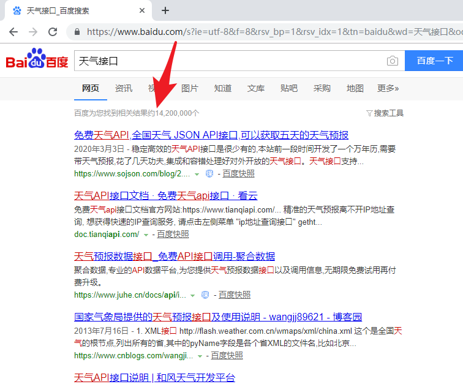

# Koa-实战开发

例子：[koajs/examples：Koa 应用示例 (github.com)](https://github.com/koajs/examples)

## 项目前置

### 接口概念

随着移动互联网的发展，客户端层出不穷，微信端、WEB/PC、APP 等等，而后端业务逻辑基本是一致的，如何做到业务逻辑“一次编写，随时接入”呢？


答案：就是调用接口、定义接口

#### 什么是

就是一个文件(js\json\php 等，主要**响应 JSON 数据（操作方便，体积小）**或 XML 数据

```bash
{
  status: 1/0,
  msg: '提示信息'
}
-----
<xml>
  <status>1/0</status>
  <msg>提示信息</msg>
  ...
</xml>
```

- 多学一招：只要响应 json 数据所有语言都可以操作，例如 ios/Android 等

- 推荐

```js
{
    meta: {
        msg: 提示信息,
        status: 状态码（200/201/301/302/400/401/403/404/500）
    },
    data: 数据
}
```

#### 能干吗

数据角度：让我们的项目静态/固定数据动态（也就是让项目数据来源于数据库

功能角度：短信接口、幽默笑话接口、天气接口、股票接口等

#### 去哪下（找）

- 方案 1：通过 node/go/java/php/asp 等语言去开发
- 方法 2：使用第三方接口

> 

#### 小总结

为什么要有接口：一次编写，多次/随时接入（好处：减少后端工作量方便后期维护

什么是接口：就是一个文件，但是你必须返回 json 或 xml 数据

接口能干吗：1-数据角度：页面数据动态，2-功能角度：短信接口、人脸识别接口

去哪下：1-自己写，2-去第三方网站找

### 接口开发规范（Restful API）

思考：接口可能是一个人开发，也可能多人开发，如何保证大家的编写规范一样

> 商品模块 /goods/getIndex get
> 订单模块 /order/index post
> 用户模块 /user

发现：上述这种 case 项目没有统一开发规则
问题：后期维护麻烦
回答：通过目前比较火的 Restful API 思想/架构

#### 是什么&好处

- 说明：RESTful 是目前最流行的一种互联网软件架构（思想）
- 作用：声明/提供了接口设计原则和约束条件（一个规范）
- 相关：

> 后端将资源发布到 URL 上->前端通过 URL 访问资源->并通过 HTTP 动词表示要对资源进行的操作
> 后端定义接口->前端请求接口->HTTP 动词表名操作目的（get 获取 post 新建 put 更新等）

- 举栗

> 列表页：访问 - /模块名 （get）
> 详情页：访问 - /模块名/编号 （get）
> 添加页：访问 - /模块名/create （get）
> 处 理：访问 - /模块名 （post）
> 修改页：访问 - /模块名/编号/edit（get）
> 处 理：访问 - /模块名/编号 （put）
> 删 除：访问 - /模块名/编号 （delete）
>
> HTTP 动词：get、post、put、delete

- 好处：统一开发规范，便与团队协作开发

#### 标准的 RESTful 架构/思想/规则需要做到

```bash
订单模块
/order      get
/order      post
/order/编号  put
/order/编号  delete
```

- 项目所有模块有统一的标准
- 看 Url 就知道要操作的资源是什么（也就是哪个模块）
- 看 Http Method 就知道操作动作是什么，是添加（post）还是删除（delete）
- 看 Http Status Code 就知道操作结果如何，是成功（200）还是内部错误（500）

#### 接口开发规范小总结

什么是 restful api：是一个架构或思想

作用：声明了接口设计原则和约束条件

好处：统一开发规范，便于团队协作开发

## Koa 路由配置

### 原生路由

- ctx.request.path ：获取用户请求的路径，由此实现简单路由

```js
const main = (ctx) => {
	if (ctx.request.path) {
		ctx.response.type = "html";
		ctx.response.body = "<h1>无此路径</h1>";
	} else {
		ctx.response.body = "<h1>这是首页</h1>";
	}
};
app.use(main);
// 访问localhost:3000/hello
// 显示 '无此路径'
```

第二种写法

```js
app.use(async ctx => {
    switch(ctx.URL) {
        case '/user':
          break;
          ...
    }
})
```

### koa-router 路由

#### 1.安装 koa2 路由

koa-router 文档：[router/API.md koajs/router (github.com)](https://github.com/koajs/router/blob/HEAD/API.md)

安装命令

```bash
npm install koa-router --save
```

##### 2.自动加载

安装 koa 路由自动加载：require-directory

```bash
npm i require-directory --save
```

创建工具类 js：core/init.js

```js
const requireDirectory = require("require-directory");
const Router = require("koa-router");
class InitManager {
	// 入口方法
	static initCore(app) {
		InitManager.app = app; // 静态属性
		InitManager.initLoadRouter(); // 路由加载
	}
	// 初始化路由
	static initLoadRouter() {
		// 参数：第一个参数固定参数module，第二个参数要加载的模块的文件路径
		// 第三个参数：每次加载一个参数执行的函数
		// 在node.js中process.cwd()方法可以获取项目的根路径
		const apiDirectory = `${process.cwd()}/app/api`;
		requireDirectory(module, apiDirectory, { visit: loadModule });
		function loadModule(obj) {
			// 判断当前模块是否是Router的实例对象
			if (obj instanceof Router) {
				// 注册理由
				InitManager.app.use(obj.routes());
			}
		}
	}
}
module.exports = InitManager;
```

> app.js 入口文件

```js
const Koa = require("koa");
// 引入初始化类
const InitManager = require("./core/init");
const app = new Koa();
// 初始化类
InitManager.initCore(app);
app.listen(9000);
```

**1.koa-router 基本使用**：

```js
const Koa = require("koa");
const Router = require("koa-router");
const app = new Koa();
const router = new Router();

router.get("/users/:id", (ctx) => {
	ctx.body = "这是用户列表" + ctx.params.id;
});
app.use(router.routes());
```

**1.1 动态路由**：

```js
//请求方式 http://域名/product/123
router.get("/product/:aid", async (ctx) => {
	console.log(ctx.params); // { aid: '123' }
	// 获取动态路由的数据
	ctx.body = "这是商品页面";
});
```

> 其他路由用法，请看 API 文档：[github.com](https://github.com/koajs/router/blob/HEAD/API.md)

**2.路由前缀**：

```js
// new Router({ prefix: '/posts' })：'/xxx' 路由前缀
const usersRouter = new Router({ prefix: "/users" });

usersRouter.get("/", (ctx) => {
	ctx.body = {
		title: "用户首页",
	};
});
usersRouter.get("/:id", (ctx) => {
	ctx.body = "这是用户列表" + ctx.params.id;
});
app.use(usersRouter.routes());
```

**3.koa-router 的路由中间件**：

```js
// 定义鉴权中间件
const auth = async (ctx, next) => {
	if (ctx.url !== "/users") {
		ctx.throw(401);
		ctx.throw("没有权限访问!");
		await next(); // 继续运行后面的方法
	}
};

usersRouter.get("/:id", auth, (ctx) => {
	ctx.body = "这是用户列表" + ctx.params.id;
});
```

## 静态资源加载

> 如果网站提供静态资源（图片、字体、样式表、脚本......），为它们一个个写路由就很麻烦，也没必要。**koa-static**模块封装了这部分的请求。

```js
# 目录结构
|_ static
    |_ 01.jpg
|_ 01.js

# 01.js服务文件
const serve = require('koa-static')
const Koa = require('koa')
const app = new Koa()

// const main = serve('static')  // 相对路径
const main = serve(__diraname + '/static')  // 绝对路径
app.use(main)
app.listen(3000)

# 浏览器访问
localhost:3000/01.jpg
```

## Http Response 的类型

> koa 默认返回的类型为 text/plain，如果想返回其他类型的内容，可以先用**request.accepts**判断一下，客户端希望接受什么数据(根据 HTTP Request 的 Accept 字段），然后使用 ctx.response.type 指定返回类型。

```js
const Koa =  require('koa')
const app = new Koa()

const main = ctx => {
    if(ctx.request.accepts('xml')){
        ctx.response.type='xml'
        ctx.response.body='<data>这是一个xml</data>'
    }else if(ctx.request.accepts('json')){
         ctx.response.type = 'json'
        ctx.response.body={data:'123'}
    } else if (ctx.request.accepts('html')) {
        ctx.response.type = 'html'
        ctx.response.body='<p>了不起？？？</p>'
    } else {
        ctx.response.type = 'text'
        ctx.response.body='hehe'
    }
}

app.use(main)
app.listen(3000)

# 启动后访问，可以看到响应了xml
```

### 1.4 路由重定向

> 服务器需要重定向（redirect）访问请求。比如，用户登陆以后，将他重定向到登陆前的页面。**ctx.response.redirect()**方法可以发出一个 302 跳转，将用户导向另一个路由。

- 关键字： ctx.response.redirect(path)

```js
const Koa = require("koa");
const app = new Koa();
const route = require("koa-route");

const about = (ctx) => {
	ctx.response.redirect("/");
};
const main = (ctx) => {
	ctx.response.body = "<h1>这是首页</h1>";
};
app.use(route.get("/", main));
app.use(route.get("/about", about));
app.listen(3000);
```

## Koa 中间件(应用级别中间件)

```js
const Koa = require(''koa);
const app = new Koa()
// Koa的中间件(应用级别中间件)，可以匹配任何路由：任何路由执行时都会执行这个方法
app.use(async (ctx, next)= > {
    // ctx.body = 'Koa的中间件'
    console.log(new Date())
    await next() // 继续匹配下一个路由
})
```

### koa 中间件和 kou-router 路由中间件执行顺序

> 多个中间件会形成一个栈结构（middle stack），以"先进后出"（first-in-last-out）的顺序执行。

```js
    1. 最外层的中间件首先执行。
    2. 调用next函数，把执行权交给下一个中间件。
    3. ...
    4. 最内层的中间件最后执行。
    5. 执行结束后，把执行权交回上一层的中间件。
    6. ...
    7. 最外层的中间件收回执行权之后，执行next函数后面的代码。
```

```js
const one = (ctx,next) => {
    console.log('one->')
    next()
    console.log('<-one')
}

const two = (ctx, next) => {
    console.log('2->')
    next()
    console.log('<-2')
}

# 执行结果
one->
2->
<-2
<-one
```

- 如果不调用 next()，则不会移交执行权

---

### koa 中间件和 kou-router 路由中间件共同使用的执行顺序

Koa 的中间件和 Express 不同，Koa 选择了洋葱圈模型

> (请求到响应)：从外向内，再从内向外


```js
const Koa = require("koa");
const router = require("koa-router")(); /*引入是实例化路由** 推荐*/
const app = new Koa();

//Koa中间件
//匹配任何路由  ，如果不写next，这个路由被匹配到了就不会继续向下匹配
//www.域名.com/news
app.use(async (ctx, next) => {
	console.log("1、这是第一个中间件01");
	await next();

	console.log("5、匹配路由完成以后又会返回来执行中间件");
});

app.use(async (ctx, next) => {
	console.log("2、这是第二个中间件02");
	await next();

	console.log("4、匹配路由完成以后又会返回来执行中间件");
});

router.get("/", async (ctx) => {
	ctx.body = "首页";
});
router.get("/news", async (ctx) => {
	console.log("3、匹配到了news这个路由");
	ctx.body = "这是一个新闻";
});

app.use(router.routes()); /*启动路由*/
app.use(router.allowedMethods());
app.listen(3002);
```

---

### 异步中间件

> 如果有异步操作（比如读取数据库），中间件就必须写成 async 函数。

```js
//fs.promised模块是对fs模块的扩展，需单独这安装后使用
const fs = require("fs.promised");
const Koa = require("koa");
const app = new Koa();

const main = async function (ctx, next) {
	ctx.response.type = "html";
	ctx.response.body = await fs.readFile("./template.html", "utf8");
};
app.use(main);
app.listen(3000);
```

> **fs.promised 模块**：  
> 原 fs 模块读取文件后都要用回调函数来处理结果，而 fs.promised 可以用**promised**来代替回调函数。

```js
# 安装
npm i fs.promised -S
# 使用
const fs = require('fs.promised')
fs.readFile('./test.json').then(v=>console.log(v),error=>console.log(error))
```

### 中间件的合成

> koa-compose 模块可以将多个中间件合成为一个

```js
const Koa = require("koa");
const compose = require("koa-compose");
const app = new Koa();

const logger = function (ctx, next) {
	console.log(`${Date.now()} ${ctx.request.method} ${ctx.request.url}`);
	next();
};
const main = function (ctx, next) {
	ctx.response.body = "这是首页";
};
const middleWare = compose([logger, main]);
app.use(middleWare);
app.listen(3000);
```

### 错误处理中间件

#### 1. 500 错误

> 如果代码运行过程中发生错误，我们需要把错误信息返回给用户。HTTP 协定约定这时要返回 500 状态码。Koa 提供了 ctx.throw()方法，用来抛出错误，ctx.throw(500)就是抛出 500 错误

- 关键词：ctx.throw(500)

```js
const Koa = require('koa')
const compose = require('koa-compose')
const app = new Koa()

const main = (ctx, next) => {
    ctx.throw(500)
}

app.use(main)
app.listen(3000)
# 访问
internal server error
```

#### 2. 404 错误

> 如果将 ctx.response.status 设置成 404，就相当于 ctx.throw(404)，返回 404 错误。

- 关键词：ctx.response.status=404

```js
const Koa = require("koa");
const compose = require("koa-compose");
const app = new Koa();

const main = (ctx, next) => {
	ctx.response.status = 404;
	ctx.response.body = "Page not Found";
};

app.use(main);
app.listen(3000);
```

#### 3. 处理错误的中间件

> 为了方便处理错误，最好使用 try...catch 将其捕获。但是，为每个中间件都写 try...catch 太麻烦，我们可以让最外层的中间件，负责所有中间件的错误处理。

```js
const Koa = require("koa");
const compose = require("koa-compose");
const app = new Koa();

const errorHandler = async (ctx, next) => {
	try {
		await next();
	} catch (err) {
		ctx.response.status = err.statusCode || err.status || 500;
		ctx.response.body = {
			msg: err.message,
		};
	}
};

const main = (ctx) => {
	ctx.response.status = 200;
};

app.use(errorHandler);
app.use(main);
app.listen(3000);
```

#### 4. error 事件的监听

> 运行过程中一旦出错，Koa 会触发一个 error 事件。监听这个事件，也可以处理错误。

```js
const Koa = require("koa");
const compose = require("koa-compose");
const app = new Koa();

app.on("error", (err, next) => {
	console.error("server error", err);
});
const main = (ctx) => {
	ctx.throw(500);
};

app.use(main);
app.listen(3000);
```

#### 5. 释放 error 事件

> 需要注意的是，如果错误被 try...catch 捕获，就不会触发 error 事件。这时，必须调用 ctx.app.emit()，手动释放 error 事件，才能让监听函数生效。

- 关键字：ctx.app.emit('error')触发事件

```js
const Koa = require("koa");
const compose = require("koa-compose");
const app = new Koa();

const handler = async (ctx) => {
	try {
		await next();
	} catch (err) {
		ctx.response.status = err.statusCode || err.status || 500;
		ctx.response.type = "html";
		ctx.response.body = "<h1>发生了一个错误</h1>";
		//  当不写这行时，发生错误时，命令行里看不到错误消息
		ctx.app.emit("error", err, ctx);
	}
};
const main = (ctx) => {
	ctx.throw(500);
};
app.on("error", (err) => {
	console.error("server error", err.message);
	console.log(err);
});
app.use(handler);
app.use(main);
app.listen(3000);
```

### logger 日志打印功能中间件

> Koa 的最大特色，也是最重要的一个设计，就是中间件（middleware）。  
> Logger：打印日志

```js
const Koa = require("koa");
const app = new Koa();

const logger = (ctx, next) => {
	// 打印日志
	console.log(`${Date.now()} ${ctx.request.method} ${ctx.request.url}`);
	next();
};
const main = (ctx) => {
	ctx.response.body = "呵呵";
};
app.use(logger);
app.use(main);
app.listen(3000);
```

- 以上的 logger 函数，main 函数就是一个中间件 middleware，因为它处在 http request 和 response 之间，用来实现某种中间功能
- app.use(middleWare) 来使用中间件
- 参数：默认接受 2 个参数 (ctx,next),ctx 为 context 对象,当执行完中间件的功能后，调用 next()将执行权交移给下一个中间件

## WebApp 应用功能

### Cookies

- **ctx.cookies**：用来读写 Cookie。
- **ctx.cookies.set(key,value,[options])**：设置 cookie
  - options 参数：可以查看文档：`koa-上下文(Context)`
- **ctx.cookies.get(key)**：获取 cookie

> 无法设置中文 cookies，可以使用 Buffer 库转换成 base64 字符串，再存储

```js
const Koa = require('koa')
const compose = require('koa-compose')
const app = new Koa()

const main = ctx => {
    const n = Number(ctx.cookies.get('view') || 0) + 1;
    ctx.cookies.set('view',n)
    ctx.response.body = n + 'views';
}

app.use(main)
app.listen(3000)
# 结果
    每刷新一次，页面显示的views会 +1
```

### Session

session 是另一种记录客户状态的机制，不同的是 Cookie 保存在客户端浏览器中，而 session 保存在服务器上。

当浏览器访问服务器并发送第一次请求时，服务器端会创建一个 session 对象，生成一个类似于 key,value 的键值对， 然后将 key(cookie)返回到浏览器(客户)端，浏览器下次再访问时，携带 key(cookie)，找到对应的 session(value)。 客户的信息都保存在 session 中

#### Koa 中 Cookie 和 Session 区别

1、cookie 数据存放在客户的浏览器上，session 数据放在服务器上。

2、cookie 不是很安全，别人可以分析存放在本地的 COOKIE 并进行 COOKIE 欺骗  
考虑到安全应当使用 session。

3、session 会在一定时间内保存在服务器上。当访问增多，会比较占用你服务器的性能  
考虑到减轻服务器性能方面，应当使用 COOKIE。

4、单个 cookie 保存的数据不能超过 4K，很多浏览器都限制一个站点最多保存 20 个 cookie。

#### koa-session 的使用

1.安装 koa-session

`npm install koa-session --save`

2.引入 express-session

`const session = require('koa-session');`

3.设置官方文档提供的中间件

```csharp
const Koa=require('koa'),
    router = require('koa-router')(),
    render = require('koa-art-template'),
    path = require('path'),
    session = require('koa-session');

const app=new Koa();

//配置 koa-art-template模板引擎
render(app, {
    root: path.join(__dirname, 'views'),   // 视图的位置
    extname: '.html',  // 后缀名
    debug: process.env.NODE_ENV !== 'production'  //是否开启调试模式
});

// 配置session的中间件
const session_signed_key = ["some secret hurr"];  // 这个是配合signed属性的签名key-cookie的签名
const session_config = {
    key: 'koa:sess', /**  cookie的key。 (默认是 koa:sess) */
    maxAge: 4000,   /**  session 过期时间，以毫秒ms为单位计算 。*/
    autoCommit: true, /** 自动提交到响应头。(默认是 true) */
    overwrite: true, /** 是否允许重写 。(默认是 true) */
    httpOnly: true, /** 是否设置HttpOnly，如果在Cookie中设置了"HttpOnly"属性，那么通过程序(JS脚本、Applet等)将无法读取到Cookie信息，这样能有效的防止XSS攻击。  (默认 true) */
    signed: true, /** 是否签名。(默认是 true) */
    rolling: true, /** 是否每次响应时刷新Session的有效期。(默认是 false) */
    renew: false, /** 是否在Session快过期时刷新Session的有效期。(默认是 false) */
};
// 应用中间件
app.use(session(CONFIG, app));

// 路由中使用
router.get('/',async (ctx)=>{
    //获取session
    console.log(ctx.session.userinfo);
    await ctx.render('index',{
        list:{
            name:'张三'
        }
    });
})

router.get('/news',async (ctx)=>{
    //获取session
    console.log(ctx.session.userinfo);
    ctx.body="登录成功";
})


router.get('/login',async (ctx)=>{
    //设置session
    ctx.session.userinfo='张三';
    ctx.body="登录成功";
})

app.use(router.routes());   /*启动路由*/
app.use(router.allowedMethods());
app.listen(3000);
```

我们需要关注这几个配置：

- renew rolling：这两个都可以在用户访问的过程中刷新有效期，不至于让用户访问过程中 Session 过期成为未登录状态

- signed：这个是对客户端 Cookie 的签名，也就是用一个特点的字符加密，保证客户端 Cookie 不会被伪造出来

- httpOnly：打开这个使得通过程序(JS 脚本、Applet 等)无法读取 Cookie，大大提高了安全性

- maxAge：以 ms 为单位的过期时间

### 表单数据处理-koa-body 库

> Web 应用离不开处理表单。本质上，表单就是 POST 方法发送到服务器的键值对。**koa-body**模块可以用来从 POST 请求的数据体里面提取键值对。

```js
// 前端访问
function submitHandler() {
	let xhr = new XMLHttpRequest();
	xhr.open("POST", "http://localhost:3000/test", true);
	xhr.onreadystatechange = function () {
		if (xhr.readyState == 4 && xhr.status == 200) {
			console.log(xhr.responseText);
		}
	};
	const data = {
		name: formName.inputKey.value,
	};
	xhr.send(JSON.stringify(data));
}
```

```js
// 后端服务
const Koa = require("koa");
const koaBody = require("koa-body");
const route = require("koa-route");
const fs = require("fs.promised");
const app = new Koa();

const indexHtml = async (ctx) => {
	ctx.response.type = "html";
	ctx.response.body = await fs.readFile("./index.html", "utf8");
};
const main = (ctx) => {
	// ctx.response.header=''
	const body = JSON.parse(ctx.request.body);
	console.log(body);

	if (!body.name) ctx.throw(400, ".name required");
	ctx.body = { name: body.name };
};

app.use(koaBody());
app.use(route.get("/", indexHtml));
app.use(route.post("/test", main));
app.listen(3000);
```

### 文件上传

> koa-body 模块还可以用来处理文件上传

前端

```html
<form name="testname">
	<input type="file" name="fileInput" id="fileUpload" />
	<button type="button" onclick="test()">提交</button>
</form>
<script>
	function test() {
		let xhr = new XMLHttpRequest();
		const file = document.getElementById("fileUpload");
		console.log(file.files);
		const formData = new FormData();
		formData.append("upfile", file.files[0]);
		xhr.open("POST", "http://localhost:3000/test", true);
		xhr.onreadystatechange = function () {
			if (xhr.readyState == 4 && xhr.status == 200) {
				console.log(xhr.responseText);
			}
		};
		xhr.send(formData);
		xhr.timeout = 100000;
	}
</script>
```

服务端

```js
// 服务端
const Koa = require("koa");
const koaBody = require("koa-body");
const route = require("koa-route");
const fs = require("fs.promised");
const os = require("os");
const path = require("path");
const app = new Koa();

const indexHtml = async (ctx) => {
	ctx.response.type = "html";
	ctx.response.body = await fs.readFile("./index.html", "utf8");
};
const main = async (ctx) => {
	const tmpdir = os.tmpdir();
	const filePaths = [];
	const files = ctx.request.body.files || {};
	console.log(ctx.request.body.files);
	const file = files.upfile;
	const filePath = path.join(tmpdir, file.name); //创建写入目录
	const reader = fs.createReadStream(file.path); //读取上传文件
	const writer = fs.createWriteStream(filePath);
	reader.pipe(writer); //写入文件
	filePaths.push(filePath);
	ctx.body = filePaths;
};
app.use(koaBody({ multipart: true }));
app.use(route.get("/", indexHtml));
app.use(route.post("/test", main));
app.listen(3000);
```

- os 模块：os 模块为 node 的内置模块，用于操作系统。
- os.tmpdir :返回一个字符串, 表明操作系统的 默认临时文件目录.
- path.join(tmpdir,[file.name](http://file.name/)) 实现将文件存放到系统默认临时文件目录下
- ctx.request.body.files 为文件上传的内容对象

## Koa 使用数据库

### MySQL

---

### MongoDB

除了文档`数据库的使用/MongoDB数据库的使用`的连接方法外，可以自己封装操作 MongoDB 数据库功能：自己封装的优点：根据自己的项目需求：体积更小、更灵活、运行速度可能更快

#### ES6 语法封装操作 MongoDB 数据库功能

官方 Node 操作库 mongodb 文档：[快速入门 — Node.js (mongodb.com)](https://www.mongodb.com/docs/drivers/node/current/quick-start/)

##### 1.安装官方文档的库`mongodb`

```bash
npm install mongodb --save
```

##### 2.新建 MongoDB 数据库 koa

基于 koa 数据库新建 collection：user --> user 包括字段：\_id、username、password

##### 3.mongodb 连接到 koa 项目应用程序

```js
const { MongoClient } = require("mongodb");

const uri = "mongodb://localhost:27017/";

const client = new MongoClient(uri);

async function run() {
	try {
		// 连接的数据库名字
		const database = client.db("koa");
		// 连接表
		const user = database.collection("user");
		// 往表里添加数据
		user.insertOne({ username: "ooo", password: "11111" });
	} finally {
		// 确保客户端当完成/错误时候，关闭连接
		await client.close();
	}
}
//
run().catch(console.dir);
```

##### 4.具体封装方法 module/db.js

```js
const { MongoClient, ObjectID } = require("mongodb");
const Config = require("./config.js");

const client = new MongoClient(Config.dbUri);

class Db {
	// 单例：多次实例化不共享的问题(只实例化一次，其他实例化便共享那个实例)
	static getInstance() {
		if (!Db.instance) {
			Db.instance = new Db();
		}
		return Db.instance;
	}

	constructor() {
		/*属性 放db对象*/
		this.dbClient = "";
		/*实例化的时候就连接数据库*/
		this.client();
	}

	// 连接数据库
	connect() {
		let _that = this;
		return new Promise((resolve, reject) => {
			if (!_that.dbClient) {
				client.connect(Config.dbUri, (err, client) => {
					if (err) {
						reject(err);
					} else {
						_that.dbClient = client.db(Config.dbName);
						resolve(_that.dbClient);
					}
				});
			} else {
				resolve(_that.dbClient);
			}
		});
	}

	/**
	 * 封装增删改查方法
	 */
	find(collectionName, json) {
		return new Promise((resolve, reject) => {
			this.connect().then((db) => {
				var result = db.collection(collectionName).find(json);

				result.toArray(function (err, docs) {
					if (err) {
						reject(err);
						return;
					}
					resolve(docs);
				});
			});
		});
	}
	update(collectionName, json1, json2) {
		return new Promise((resolve, reject) => {
			this.connect().then((db) => {
				//db.user.update({},{$set:{}})
				db.collection(collectionName).updateOne(
					json1,
					{
						$set: json2,
					},
					(err, result) => {
						if (err) {
							reject(err);
						} else {
							resolve(result);
						}
					}
				);
			});
		});
	}
	insert(collectionName, json) {
		return new Promise((resolve, reject) => {
			this.connect().then((db) => {
				db.collection(collectionName).insertOne(json, function (err, result) {
					if (err) {
						reject(err);
					} else {
						resolve(result);
					}
				});
			});
		});
	}

	remove(collectionName, json) {
		return new Promise((resolve, reject) => {
			this.connect().then((db) => {
				db.collection(collectionName).removeOne(json, function (err, result) {
					if (err) {
						reject(err);
					} else {
						resolve(result);
					}
				});
			});
		});
	}
	// mongodb里面查询 _id 把字符串转换成对象
	getObjectId(id) {
		return new ObjectID(id);
	}
}

module.exports = Db.getInstance();
```

##### 5.在路由使用封装好的方法：routes\user\users.js

```js
const router = require("koa-router")();

// 路由文档：https://github.com/koajs/router/blob/HEAD/API.md

// 定义路由的前缀：/users
router.prefix("/users");

// 显示用户信息
router.get("/", async (ctx) => {
	var result = await DB.find("user", {});

	console.log(result);
	await ctx.render("index", {
		list: result,
	});
});

// 增加用户
router.get("/add", async (ctx) => {
	await ctx.render("add");
});

// 执行增加用户的操作
router.post("/doAdd", async (ctx) => {
	// 获取表单提交的数据

	// console.log(ctx.request.body);  //{ username: '王麻子', age: '12', sex: '1' }

	let data = await DB.insert("user", ctx.request.body);
	//console.log(data);
	try {
		if (data.result.ok) {
			ctx.redirect("/");
		}
	} catch (err) {
		console.log(err);
		return;
		ctx.redirect("/add");
	}
});

// 编辑用户
router.get("/edit", async (ctx) => {
	// 通过get传过来的id来获取用户信息
	let id = ctx.query.id;

	let data = await DB.find("user", { _id: DB.getObjectId(id) });

	// 获取用户信息
	await ctx.render("edit", {
		list: data[0],
	});
});

router.post("/doEdit", async (ctx) => {
	// 通过get传过来的id来获取用户信息
	// console.log(ctx.request.body);

	var id = ctx.request.body.id;
	var username = ctx.request.body.username;
	var age = ctx.request.body.age;
	var sex = ctx.request.body.sex;

	let data = await DB.update(
		"user",
		{ _id: DB.getObjectId(id) },
		{
			username,
			age,
			sex,
		}
	);

	try {
		if (data.result.ok) {
			ctx.redirect("/");
		}
	} catch (err) {
		console.log(err);
		return;
		ctx.redirect("/");
	}
});

// 删除用户
router.get("/delete", async (ctx) => {
	let id = ctx.query.id;

	var data = await DB.remove("user", { _id: DB.getObjectId(id) });
	console.log(data);
	if (data) {
		ctx.redirect("/");
	}
});

module.exports = router;
```

##### 6

## 数据库

1. knexjs：[https://knexjs.org/](https://knexjs.org/)
2. knexjs 中文文档：https://www.songxingguo.com/2018/06/30/knex.js-query/
3. [PostgreSQL 新手入门](http://www.ruanyifeng.com/blog/2013/12/getting_started_with_postgresql.html)
   1. 阿里云 postgresql：[云数据库 RDS PostgreSQL*pg 数据库*混合数据类型复杂查询\_数据库-阿里云](https://cn.aliyun.com/product/rds/postgresql)
4. 管理工具 pgadmin：[https://www.pgadmin.org/](https://www.pgadmin.org/)

## Koa2 开发例子

### koa2 实现上传图片，并且同步上传到七牛云存储

```js
const Koa = require("koa");
const route = require("koa-route");
const serve = require("koa-static");
const inspect = require("util").inspect;
const path = require("path");
const os = require("os");
const fs = require("fs");
const Busboy = require("busboy");
const qiniu = require("qiniu");
const qiniuConfig = require("./qiniuconfig");

const app = new Koa();

app.use(serve(__dirname + "/public/"));

// 写入目录
const mkdirsSync = (dirname) => {
	if (fs.existsSync(dirname)) {
		return true;
	} else {
		if (mkdirsSync(path.dirname(dirname))) {
			fs.mkdirSync(dirname);
			return true;
		}
	}
	return false;
};

function getSuffix(fileName) {
	return fileName.split(".").pop();
}

// 重命名
function Rename(fileName) {
	return Math.random().toString(16).substr(2) + "." + getSuffix(fileName);
}
// 删除文件
function removeTemImage(path) {
	fs.unlink(path, (err) => {
		if (err) {
			throw err;
		}
	});
}
// 上传到七牛
function upToQiniu(filePath, key) {
	const accessKey = qiniuConfig.accessKey; // 你的七牛的accessKey
	const secretKey = qiniuConfig.secretKey; // 你的七牛的secretKey
	const mac = new qiniu.auth.digest.Mac(accessKey, secretKey);

	const options = {
		scope: qiniuConfig.scope, // 你的七牛存储对象
	};
	const putPolicy = new qiniu.rs.PutPolicy(options);
	const uploadToken = putPolicy.uploadToken(mac);

	const config = new qiniu.conf.Config();
	// 空间对应的机房
	config.zone = qiniu.zone.Zone_z2;
	const localFile = filePath;
	const formUploader = new qiniu.form_up.FormUploader(config);
	const putExtra = new qiniu.form_up.PutExtra();
	// 文件上传
	return new Promise((resolved, reject) => {
		formUploader.putFile(
			uploadToken,
			key,
			localFile,
			putExtra,
			function (respErr, respBody, respInfo) {
				if (respErr) {
					reject(respErr);
				}
				if (respInfo.statusCode == 200) {
					resolved(respBody);
				} else {
					resolved(respBody);
				}
			}
		);
	});
}

// 上传到本地服务器
function uploadFile(ctx, options) {
	const _emmiter = new Busboy({ headers: ctx.req.headers });
	const fileType = options.fileType;
	const filePath = path.join(options.path, fileType);
	const confirm = mkdirsSync(filePath);
	if (!confirm) {
		return;
	}
	console.log("start uploading...");
	return new Promise((resolve, reject) => {
		_emmiter.on(
			"file",
			function (fieldname, file, filename, encoding, mimetype) {
				const fileName = Rename(filename);
				const saveTo = path.join(path.join(filePath, fileName));
				file.pipe(fs.createWriteStream(saveTo));
				file.on("end", function () {
					resolve({
						imgPath: `/${fileType}/${fileName}`,
						imgKey: fileName,
					});
				});
			}
		);

		_emmiter.on("finish", function () {
			console.log("finished...");
		});

		_emmiter.on("error", function (err) {
			console.log("err...");
			reject(err);
		});

		ctx.req.pipe(_emmiter);
	});
}

app.use(
	route.post("/upload", async function (ctx, next) {
		const serverPath = path.join(__dirname, "./uploads/");
		// 获取上存图片
		const result = await uploadFile(ctx, {
			fileType: "album",
			path: serverPath,
		});
		const imgPath = path.join(serverPath, result.imgPath);
		// 上传到七牛
		const qiniu = await upToQiniu(imgPath, result.imgKey);
		// 上存到七牛之后 删除原来的缓存图片
		removeTemImage(imgPath);
		ctx.body = {
			imgUrl: `http://xxxxx(你的外链或者解析后七牛的路径)/${qiniu.key}`,
		};
	})
);

app.listen(3001);

console.log("listening on port 3001");
```

然后在同一级目录下，创建一个 public 文件夹，然后在下面新建一个 index.html，因为我们上面已经把这个文件夹设置为静态访问文件夹了， public/index.html 的代码为

```html
<!DOCTYPE html>
<html lang="en">
	<head>
		<meta charset="UTF-8" />
		<title>Document</title>
	</head>
	<body>
		<input id="btn1" type="file" name="file" />
		<input id="btn2" type="submit" value="提交" />
	</body>
	<script>
		var btn1 = document.querySelector("#btn1");
		var btn2 = document.querySelector("#btn2");
		var file = null;
		btn1.addEventListener("change", function (e) {
			file = e.target.files[0];
		});

		btn2.onclick = function () {
			var _data = new FormData();
			_data.append("file", file);
			xhr(_data);
		};

		var xhr = function (formdata) {
			var xmlHttp = new XMLHttpRequest();

			xmlHttp.open("post", "http://127.0.0.1:3001/upload", true);

			xmlHttp.send(formdata);

			xmlHttp.onreadystatechange = function () {
				if (xmlHttp.readyState == 4) {
					if (xmlHttp.status == 200) {
						var data = xmlHttp.responseText;
						console.log(data);
					}
				}
			};
		};
	</script>
</html>
```

### 注册和验证码、登录功能实现
