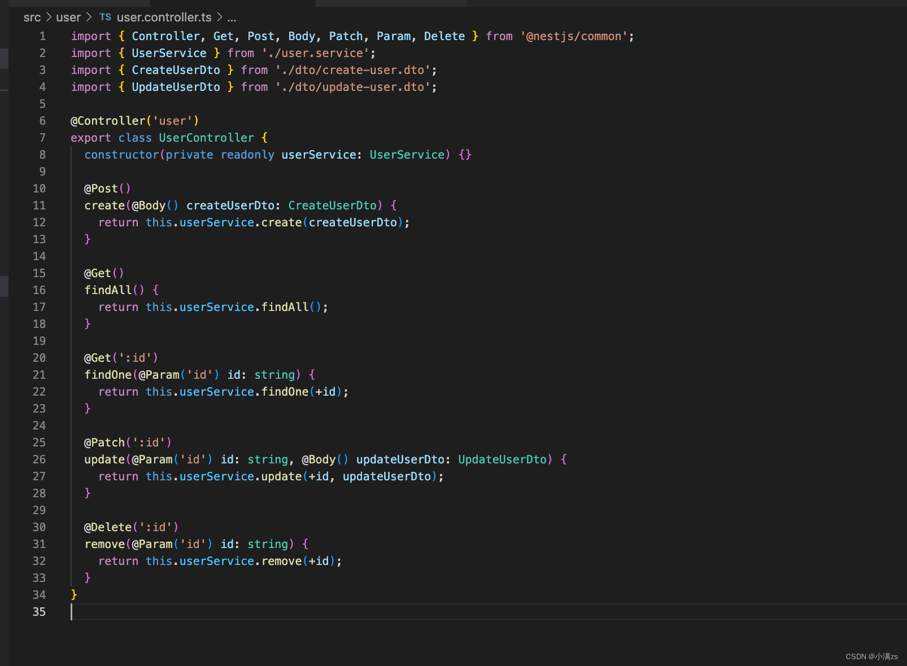

# Nest 框架入门

参考文档：[NestJS 简介 | NestJS 中文文档 | NestJS 中文网](https://www.nestjs.com.cn/)

## 环境安装和项目创建运行

### 1.Node 环境下安装(>= 10.13.0, v13 版本除外)

```bash
npm i -g @nestjs/cli
```

### 2.创建项目

#### 2.1 命令行创建

```js
nest new [project-name]
```

#### 2.2 其他三种项目安装创建方式

##### 1.使用 Git 安装

采用 TypeScript 开发的 starter 项目：

```bash
git clone https://github.com/nestjs/typescript-starter.git project

cd project

npm install
```

##### 2.安装基于 JavaScript 的 starter project

```bash
git clone javascript-starter.git project

cd project

npm install
```

##### 3.还可以通过 npm （或 yarn）来安装的核心和支撑文件，从头开始手动创建一个新项目

当然，在这种情况下，你将自己担负起创建项目样板文件的工作。

```bash
npm i --save @nestjs/core @nestjs/common rxjs reflect-metadata
```

### 3.运行项目

```bash
npm run start
# 或
npm run start:dev
```

启动的时候应该以 dev 模式启动，这样 Nest 会「自动检测我们的文件变化」，然后「自动重启服务」

#### 4.浏览器打开地址

<http://localhost:3000/>

### 4.目录介绍

1.main.ts 入口文件主文件 类似于 vue 的 main.ts

通过 NestFactory.create(AppModule) 创建一个 app 就是类似于绑定一个根组件 App.vue

app.listen(3000); 监听一个端口

```typescript
import { NestFactory } from "@nestjs/core";
import { AppModule } from "./app.module";

async function bootstrap() {
	const app = await NestFactory.create(AppModule);
	await app.listen(3000);
}
bootstrap();
```

2.Controller.ts 控制器

你可以理解成 vue 的路由

private readonly appService: AppService 这一行代码就是依赖注入不需要实例化 appService 它内部会自己实例化的我们主需要放上去就可以了

```typescript
import { Controller, Get } from "@nestjs/common";
import { AppService } from "./app.service";

@Controller()
export class AppController {
	constructor(private readonly appService: AppService) {}

	@Get()
	getHello(): string {
		return this.appService.getHello();
	}
}

//-----------------------------------------------------
//修改地址之后

import { Controller, Get } from "@nestjs/common";
import { AppService } from "./app.service";

@Controller("/get")
export class AppController {
	constructor(private readonly appService: AppService) {}

	@Get("/hello")
	getHello(): string {
		return this.appService.getHello();
	}
}
```

打开地址：http://localhost:3000/hello

3.app.service.ts

这个文件主要实现业务逻辑的 当然 Controller 可以实现逻辑，但是就是单一的无法复用，放到 app.service 有别的模块也需要就可以实现复用

```typescript
import { Injectable } from "@nestjs/common";

@Injectable()
export class AppService {
	getHello(): string {
		return "Hello World!";
	}
}
```

## :a:Nest CLI 使用(使用命令 生成文件)

文档：[Overview - CLI | NestJS - A progressive Node.js framework](https://docs.nestjs.com/cli/overview)

### 帮助生成文件命令详解

```js
nest - h;
```

图例


#### 命令详解和简写

- class (简写: cl) 类
- controller (简写: co) 控制器
- decorator (简写: d) 装饰器
- exception (简写: e) 异常捕获
- filter (简写: f) 过滤器
- gateway (简写: ga) 网关
- guard (简写: gu) 守卫
- interceptor (简写: i) 拦截器
- middleware (简写: mi) 中间件
- module (简写: mo) 模块
- pipe (简写: pi) 管道
- provider (简写: pr) 供应商
- service (简写: s) 服务

### 生成命令的使用

#### 1.构建 module 服务模块

```bash
nest g module video server
# 简写
nest g mo video server
```

#### 2.创建 Controller

controller 就类似前端的「路由」，负责处理「客户端传入的请求」和「服务端返回的响应」

```bash
nest g controller video server
# 简写
nest g co video server
```

#### 3.创建 Provider：服务的提供者

```bash
nest g service video server
# 简写
nest g s video server
```

#### 4.可以直接使用一个命令生成上面的 CURD

```bash
 nest g resource video
```

生成了一套标准的 CURD 模板


第一次使用这个命令的时候，除了生成文件之外还会自动使用 `npm` 帮我们更新资源，安装一些额外的插件，后续再次使用就不会更新了。

## RESTful 风格设计

RESTful 是一种风格，在 RESTful 中，一切都被认为是资源，每个资源有对应的 URL 标识。

不是标准也不是协议，只是一种风格。当然你也可以不按照他的风格去写。

### 1.接口 url

#### 传统接口

http://localhost:8080/api/get_list?id=1

http://localhost:8080/api/delete_list?id=1

http://localhost:8080/api/update_list?id=1

#### RESTful 接口

增加/查询/删除/更新：http://localhost:8080/api/get_list/1

RESTful 风格一个接口就会完成 增删改差 他是通过不同的请求方式来区分的

- 查询 GET

- 提交 POST

- 更新 PUT PATCH

- 删除 DELETE



### 2.RESTful 版本控制

一共有三种我们一般用第一种 更加语义化

|                       |                                   |
| --------------------- | --------------------------------- |
| URI Versioning        | 版本将在请求的 URI 中传递（默认） |
| Header Versioning     | 自定义请求标头将指定版本          |
| Media Type Versioning | 请求的 Accept 标头将指定版本      |

```typescript
import { NestFactory } from "@nestjs/core";
import { VersioningType } from "@nestjs/common";
import { AppModule } from "./app.module";

async function bootstrap() {
	const app = await NestFactory.create(AppModule);
	// 版本控制
	app.enableVersioning({
		type: VersioningType.URI,
	});
	await app.listen(3000);
}
bootstrap();
```

然后在 user.controller 配置版本

Controller 变成一个对象 通过 version 配置版本

```typescript
import { Controller, Get, Post, Body, Patch, Param, Delete, Version } from '@nestjs/common';
import { UserService } from './user.service';
import { CreateUserDto } from './dto/create-user.dto';
import { UpdateUserDto } from './dto/update-user.dto';

@Controller({
  path:"user",
  version:'1'
})
export class UserController {
  constructor(private readonly userService: UserService) {}

  @Post()
  create(@Body() createUserDto: CreateUserDto) {
    return this.userService.create(createUserDto);
  }

  @Get()
  // @Version('1')
  findAll() {
    return this.userService.findAll();
  }

  @Get(':id')
  findOne(@Param('id') id: string) {
    return this.userService.findOne(+id);
  }

  @Patch(':id')
  update(@Param('id') id: string, @Body() updateUserDto: UpdateUserDto) {
    return this.userService.update(+id, updateUserDto);
  }
```

打开地址：http://localhost:3000/v1/user

### 3.Code 码规范

- 200 OK
- 304 Not Modified 协商缓存了

- 400 Bad Request 参数错误

- 401 Unauthorized token 错误

- 403 Forbidden referer origin 验证失败

- 404 Not Found 接口不存在

- 500 Internal Server Error 服务端错误
- 502 Bad Gateway 上游接口有问题或者服务器问题

## 项目工作空间两种模式

### 1.标准模式

用于构建具有自己的依赖项和设置、不需要优化共享模块或优化复杂，构建以项目为中心的应用程序。这是默认模式。

### 2.monorepo 模式

该模式将代码工件作为轻量级 monorepo 的一部分，可能更适合开发团队或多项目环境。它自动化了构建过程的各个部分，使创建和组合模块化组件变得容易，促进了代码重用，使集成测试变得更容易，使共享项目范围内的工件(如 tslint 规则和其他配置策略)变得容易，并且比 github 子模块之类的替代方法更容易使用。Monorepo 模式采用了在 nest-cli.json 中表示工作区的概念，以协调 monorepo 组件之间的关系。

#### 1.创建子项目 admin

```bash
nest g app admin
```

#### 2.启动子项目 admin，并实时监听

```bash
nest start -w admin
```

#### 3.创建数据库模块--赋予名称@libs

```bash
nest g lib db
```

#### 4.安装数据库模块(二选一)

##### typegoose

官网：<https://typegoose.github.io/typegoose/>

- 更适合 typescript 开发
- 使用 TypeScript 类定义 Mongoose 模型

  1.nest 框架专用安装命令

```bash
yarn add nestjs-typegoose @typegoose/typegoose
```

2.安装 mongoose @types/mongoose

```bash
yarn add mongoose @types/mongoose
```

##### mongoose

官网：<http://www.mongoosejs.net/>

1.nest 框架专用安装命令

```bash
yarn add @nestjs/mongoose mongoose
```

2.配置使用：<https://blog.csdn.net/webtext/article/details/122910230>

## :b:概述语法详情（具体看官网文档—概述）

文档：[Controllers | NestJS - A progressive Node.js framework](https://docs.nestjs.com/controllers)

### 控制器 Controller

控制器负责处理传入的请求和向客户端返回响应。

**文档**：<https://docs.nestjs.cn/8/controllers>

### 提供者 Providers(Service)

许多基本的 Nest 类可能被视为 provider - service, repository, factory, helper 等等。 他们都可以通过 constructor 注入依赖关系。

Providers 是 Nest 的一个基本概念：是一个用 @Injectable() 装饰器注释的类。

相关文件

- cat.service.ts
- cat/interfaces/cat.interface.ts
  - interface：接口约束
- cat/dto/create-cat.dto
  - dot：前端传来的数据校验

### 模块 Modules

模块是具有 @Module() 装饰器的类

#### @Module({}) 装饰器提供了元数据，Nest 用它来组织应用程序结构

- providers
  - 由 Nest 注入器实例化的提供者，并且可以至少在整个模块中共享
- controllers
  - 必须创建的一组控制器
- imports
  - 导入模块的列表，这些模块导出了此模块中所需提供者
- exports
  - 由本模块提供并应在其他模块中可用的提供者的子集。

#### 模块章节

##### 功能模块

CatsController 和 CatsService

属于同一个应用程序域

###### 1.nest g module cats 命令创建模块

cats/cats.module.ts

```typescript
import { Module } from "@nestjs/common";
import { CatsController } from "./cats.controller";
import { CatsService } from "./cats.service";

@Module({
	controllers: [CatsController],
	providers: [CatsService],
})
export class CatsModule {}
```

###### 2.将这个模块导入根模块 (ApplicationModule)

```typescript
import { Module } from "@nestjs/common";
import { CatsModule } from "./cats/cats.module";

@Module({
	imports: [CatsModule],
})
export class ApplicationModule {}
```

###### 3.功能模块的目录结构

```bash
src
├──cats
│    ├──dto
│    │   └──create-cat.dto.ts
│    ├──interfaces
│    │     └──cat.interface.ts
│    ├─cats.service.ts
│    ├─cats.controller.ts
│    └──cats.module.ts
├──app.module.ts
└──main.ts
```

##### 共享模块

在几个模块之间共享 CatsService 实例 需要把 CatsService 放到 exports 数组中

cats.module.ts

```typescript
import { Module } from "@nestjs/common";
import { CatsController } from "./cats.controller";
import { CatsService } from "./cats.service";

@Module({
	controllers: [CatsController],
	providers: [CatsService],
	// 共享模块
	exports: [CatsService],
})
export class CatsModule {}
```

每个导入 CatsModule 的模块都可以访问 CatsService ，并且它们将共享相同的 CatsService 实例。

##### 模块导出

模块可以导出他们的内部提供者。 而且，他们可以再导出自己导入的模块。

```typescript
@Module({
	imports: [CommonModule],
	exports: [CommonModule],
})
export class CoreModule {}
```

##### 依赖注入

提供者也可以注入到模块(类)中（例如，用于配置目的）：

注入 cats.module.ts 模块

```typescript
import { Module } from "@nestjs/common";
import { CatsController } from "./cats.controller";
import { CatsService } from "./cats.service";

@Module({
	controllers: [CatsController],
	providers: [CatsService],
})
export class CatsModule {
	constructor(private readonly catsService: CatsService) {}
}
```

但是，由于循环依赖性，模块类不能注入到提供者中。

##### 全局模块

```typescript
import { Module, Global } from "@nestjs/common";
import { CatsController } from "./cats.controller";
import { CatsService } from "./cats.service";
//  @Global 装饰器使模块成为全局作用域
@Global()
@Module({
	controllers: [CatsController],
	providers: [CatsService],
	exports: [CatsService],
})
export class CatsModule {}
```

全局模块应该只注册一次，最好由根或核心模块注册。

CatsService 组件将无处不在，而想要使用 CatsService 的模块则不需要在 imports 数组中导入 CatsModule。

使一切全局化并不是一个好的解决方案。 全局模块可用于减少必要模板文件的数量。 imports 数组仍然是使模块 API 透明的最佳方式。

##### 动态模块

Nest 模块系统包括一个称为动态模块的强大功能

###### 1.动态模块定义的示例 DatabaseModule

```typescript
import { Module, DynamicModule } from "@nestjs/common";
import { createDatabaseProviders } from "./database.providers";
import { Connection } from "./connection.provider";

@Module({
	providers: [Connection],
})
export class DatabaseModule {
	//  forRoot() 可以同步或异步（Promise）返回动态模块。
	static forRoot(entities = [], options?): DynamicModule {
		const providers = createDatabaseProviders(options, entities);
		return {
			global: true, // 全局范围内注册动态模块
			module: DatabaseModule, //  模块名字
			providers: providers,
			exports: providers,
		};
	}
}
```

###### 2.使用 DatabaseModule 动态模块

```typescript
import { Module } from "@nestjs/common";
import { DatabaseModule } from "./database/database.module";
import { User } from "./users/entities/user.entity";

@Module({
	imports: [DatabaseModule.forRoot([User])],
	//  依次重新导出动态模块
	exports: [DatabaseModule],
})
export class AppModule {}
```

### 中间件 Middleware

#### 简介

- 中间件是在 路由处理程序 之前 调用的函数
- 中间件函数可以访问请求和响应对象，以及应用程序请求响应周期中的 next() 中间件函数
- next() 中间件函数通常由名为 next 的变量表示

#### 中间件函数可以执行以下任务

- 执行任何代码。
- 对请求和响应对象进行更改。
- 结束请求-响应周期。
- 调用堆栈中的下一个中间件函数。
- 如果当前的中间件函数没有结束请求-响应周期, 它必须调用 next() 将控制传递给下一个中间件函数。否则, 请求将被挂起。

#### 中间件使用

##### 依赖注入中间件

```typescript
import { Injectable, NestMiddleware } from "@nestjs/common";

@Injectable()
export class LoggerMiddleware implements NestMiddleware {
	use(req: any, res: any, next: () => void) {
		console.log(`Request...`);
		next();
	}
}
```

##### 应用中间件

应用例子

```typescript
import { Module, NestModule, MiddlewareConsumer } from "@nestjs/common";
import { LoggerMiddleware } from "./common/middleware/logger.middleware";
import { CatsModule } from "./cats/cats.module";

@Module({
	imports: [CatsModule],
})
export class AppModule implements NestModule {
	configure(consumer: MiddlewareConsumer) {
		consumer.apply(LoggerMiddleware).forRoutes("cats");
	}
}
```

给路由添加

```typescript
consumer.apply(LoggerMiddleware).forRoutes("cats");
```

给路由指定 id 参数添加

```typescript
consumer
	.apply(LoggerMiddleware)
	.forRoutes({ path: "cats:id", method: RequestMethod.GET });
```

给路由指定 url 地址方法添加

```typescript
consumer
	.apply(LoggerMiddleware)
	.forRoutes({ path: "cats/say", method: RequestMethod.GET });
```

##### 路由通配符

```typescript
forRoutes({ path: "ab*cd", method: RequestMethod.ALL });
```

##### 中间件消费者

给控制器添加中间件

```typescript
consumer.apply(LoggerMiddleware).forRoutes(CatsController);
```

.exclude() 方法排除路由

```typescript
consumer
	.apply(LoggerMiddleware)
	.exclude(
		{ path: "cats", method: RequestMethod.GET },
		{ path: "cats", method: RequestMethod.POST },
		"cats/(.*)"
	)
	.forRoutes(CatsController);
```

可以采用一个字符串，多个字符串或一个 RouteInfo 对象来标识要排除的路由

path-to-regexp 包支持通配符参数。

##### 函数式中间件

logger.middleware.ts 文件

```typescript
//  logger.middleware.ts 文件

export function logger(req, res, next) {
	console.log(`Request...`);
	next();
}
```

在 AppModule (app.module.ts)中使用它

```typescript
consumer.apply(logger).forRoutes(CatsController);
```

##### 多个中间件

在 apply() 方法内用逗号分隔多个中间件

```typescript
consumer.apply(cors(), helmet(), logger).forRoutes(CatsController);
```

##### 全局使用中间件

一次性将中间件绑定到每个注册路由

main.ts 里使用 INestApplication 实例提供的 use()方法

```typescript
const app = await NestFactory.create(AppModule);
app.use(logger);
await app.listen(3000);
```

### 异常过滤器 Exception filters

#### 概念

- 内置的异常层负责处理整个应用程序中的所有抛出的异常
- 当捕获到未处理的异常时，最终用户将收到友好的响应

#### 异常 JSON 响应例子

```typescript
{
    "statusCode": 500,
    "message": "Internal server error"
}
```

#### 异常

##### 基础异常类

Nest 提供了一个内置的 HttpException 类，它从 @nestjs/common 包中导入

控制器抛出异常

```typescript
@Get()
async findAll() {
  throw new HttpException('Forbidden', HttpStatus.FORBIDDEN);
}
```

我们在这里使用了 HttpStatus 。它是从 @nestjs/common 包导入的辅助枚举器。

当客户端调用这个端点时

```typescript
{
    "statusCode": 403,
    "message": "Forbidden"
}
```

**HttpException 构造函数**：

参数

- **response 参数**：定义 JSON 响应体。它可以是 string 或 object
- **status 参数**：定义 HTTP 状态代码。

JSON 响应主体包含两个属性

- **statusCode**：默认为 status 参数中提供的 HTTP 状态代码
- **message**：基于状态的 HTTP 错误的简短描述

覆盖 JSON 响应主体的消息部分

在 response 参数中提供一个 string

```typescript
@Get()
async findAll() {
  throw new HttpException('我是异常消息',HttpStatus.FORBIDDEN)
}
```

覆盖整个 JSON 响应主体

- 在 response 参数中传递一个 object，Nest 将序列化对象，并将其作为 JSON 响应返回。
- 第二个构造函数参数-status-是有效的 HTTP 状态代码。 最佳实践是使用从@nestjs/common 导入的 HttpStatus 枚举

例子

```typescript
@Get()
async findAll() {
  throw new HttpException({
    status: HttpStatus.FORBIDDEN,
    error: 'This is a custom message',
  }, HttpStatus.FORBIDDEN);
}
```

客户端响应

```json
{
	"status": 403,
	"error": "This is a custom message"
}
```

##### 自定义异常

创建自己的异常层次结构

其中自定义异常继承自 HttpException 基类，使用这种方法，Nest 可以识别您的异常，并自动处理错误响应。

自定义异常例子

forbidden.exception.ts

```typescript
//  forbidden.exception.ts
export class ForbiddenException extends HttpException {
	constructor() {
		super("Forbidden", HttpStatus.FORBIDDEN);
	}
}
```

使用

cats.controller.ts

```typescript
// cats.controller.ts
@Get()
async findAll() {
  throw new ForbiddenException();
}
```

##### 内置 HTTP 异常

@nestjs/common 包中

- BadRequestException
- UnauthorizedException
- NotFoundException
- ForbiddenException
- NotAcceptableException
- RequestTimeoutException
- ConflictException
- GoneException
- PayloadTooLargeException
- UnsupportedMediaTypeException
- UnprocessableException
- InternalServerErrorException
- NotImplementedException
- BadGatewayException
- ServiceUnavailableException
- GatewayTimeoutException

##### 异常过滤器

###### 用处

- 基于某些动态因素添加日志记录或使用不同的 JSON 模式
- 控制精确的控制流以及将响应的内容发送回客户端

###### 创建过滤异常处理器

http-exception.filter.ts

```bash
nest g f http-exception
```

异常过滤器创建步骤

创建一个异常过滤器，它负责捕获作为 HttpException 类实例的异常，并为它们设置自定义响应逻辑。

步骤和用法

- 1.我们需要访问底层平台 Request 和 Response。
- 2.我们将访问 Request 对象，以便提取原始 url 并将其包含在日志信息中。
- 3.我们将使用 Response.json()方法，使用 Response 对象直接控制发送的响应。

异常过滤器例子

http-exception.filter.ts

```typescript
import {
	ExceptionFilter,
	Catch,
	ArgumentsHost,
	HttpException,
} from "@nestjs/common";
import { Request, Response } from "express";

@Catch(HttpException)
export class HttpExceptionFilter implements ExceptionFilter {
	catch(exception: HttpException, host: ArgumentsHost) {
		const ctx = host.switchToHttp();
		const response = ctx.getResponse<Response>();
		const request = ctx.getRequest<Request>();
		const status = exception.getStatus();

		response.status(status).json({
			statusCode: status,
			timestamp: new Date().toISOString(),
			path: request.url,
		});
	}
}
```

所有异常过滤器都应该实现通用的 `ExceptionFilter<T>` 接口。

它需要你使用有效签名提供 catch(exception: T, host: ArgumentsHost)方法。T 表示异常的类型。

@Catch() 装饰器绑定所需的元数据到异常过滤器上。它告诉 Nest 这个特定的过滤器正在寻找 HttpException 而不是其他的。

在实践中，@Catch() 可以传递多个参数，所以你可以通过逗号分隔来为多个类型的异常设置过滤器。

##### 参数主机

文档：<https://docs.nestjs.cn/8/exceptionfilters?id=%e5%8f%82%e6%95%b0%e4%b8%bb%e6%9c%ba>

catch(exception: T, host: ArgumentsHost) 方法

- **exception 参数**：是当前正在处理的异常对象
- **host 参数**
  - 是一个 ArgumentsHost 对象
    - ArgumentsHost 是一个功能强大的实用程序对象
    - 在上下文章节中进一步进行研究
    - 文档：<https://docs.nestjs.cn/8/fundamentals?id=%e5%ba%94%e7%94%a8%e4%b8%8a%e4%b8%8b%e6%96%87>
  - 在异常过滤的例子中
    - 使用它来获取对 Request 和 Response 对象的引用，这些对象被传递给原始请求处理程序（在异常发生的控制器中）
    - 使用了一些辅助方法 ArgumentsHost 来获取所需的 Request 和 Response 对象。

##### 绑定过滤器

###### 1.将 HttpExceptionFilter 绑定到 CatsController 的 create() 方法上

cats.controller.ts

```typescript
//  cats.controller.ts

@Post()
@UseFilters(new HttpExceptionFilter())
async create(@Body() createCatDto: CreateCatDto) {
  throw new ForbiddenException();
}
```

创建了 HttpExceptionFilter 的实例

- @UseFilters() 装饰器：需要从 @nestjs/common 包导入
- @UseFilters() 装饰器：和 @Catch()装饰器类似，它可以使用单个过滤器实例，也可以使用逗号分隔的过滤器实例列表

###### 2.传递类:让框架承担实例化责任并启用依赖注入

cats.controller.ts

```typescript
//  cats.controller.ts
@Post()
@UseFilters(HttpExceptionFilter)
async create(@Body() createCatDto: CreateCatDto) {
  throw new ForbiddenException();
}
```

尽可能使用类而不是实例。由于 Nest 可以轻松地在整个模块中重复使用同一类的实例，因此可以减少内存使用。

HttpExceptionFilter 仅应用于单个 create() 路由处理程序，使其成为方法范围的

###### 异常过滤器的作用域可以划分为不同的级别

- 方法范围
- 控制器范围或全局范围

###### 3.将过滤器设置为控制器作用域

cats.controller.ts

```typescript
//  cats.controller.ts

@UseFilters(new HttpExceptionFilter())
export class CatsController {}
```

此结构为 CatsController 中的每个路由处理程序设置 HttpExceptionFilter。

###### 4.创建一个全局范围的过滤器

main.ts

```typescript
//  main.ts

async function bootstrap() {
	const app = await NestFactory.create(AppModule);
	app.useGlobalFilters(new HttpExceptionFilter());
	await app.listen(3000);
}
bootstrap();
```

该 useGlobalFilters() 方法不会为网关和混合应用程序设置过滤器。

全局过滤器用于整个应用程序、每个控制器和每个路由处理程序

任何模块外部注册的全局过滤器（使用上面示例中的 useGlobalFilters()）不能注入依赖

**解决方法**：

可以注册一个全局范围的过滤器直接为任何模块设置过滤器

app.module.ts

```typescript
//  app.module.ts

import { Module } from "@nestjs/common";
import { APP_FILTER } from "@nestjs/core";

@Module({
	providers: [
		{
			provide: APP_FILTER,
			useClass: HttpExceptionFilter,
		},
	],
})
export class AppModule {}
```

当使用此方法对过滤器执行依赖注入时，请注意，无论采用哪种结构的模块，过滤器实际上都是全局的

**应该在哪里做？**

选择定义了过滤器（以上示例中为 HttpExceptionFilter）的模块。 同样，useClass 不是处理自定义提供程序注册的唯一方法。

了解更多：自定义提供者：<https://docs.nestjs.cn/8/fundamentals?id=%e8%87%aa%e5%ae%9a%e4%b9%89%e6%8f%90%e4%be%9b%e8%80%85>

您可以根据需要添加任意数量的过滤器;只需将每个组件添加到 providers（提供者）数组。

##### 捕获异常

捕获每一个未处理的异常

any-exception.filter.ts

将 @Catch() 装饰器的参数列表设为空

```typescript
import {
	ExceptionFilter,
	Catch,
	ArgumentsHost,
	HttpException,
	HttpStatus,
} from "@nestjs/common";

@Catch()
export class AllExceptionsFilter implements ExceptionFilter {
	catch(exception: unknown, host: ArgumentsHost) {
		const ctx = host.switchToHttp();
		const response = ctx.getResponse();
		const request = ctx.getRequest();

		const status =
			exception instanceof HttpException
				? exception.getStatus()
				: HttpStatus.INTERNAL_SERVER_ERROR;

		response.status(status).json({
			statusCode: status,
			timestamp: new Date().toISOString(),
			path: request.url,
		});
	}
}
```

在上面的示例中，过滤器将捕获抛出的每个异常，而不管其类型(类)如何。

##### 继承

重用已经实现的核心异常过滤器，并基于某些因素重写行为

###### 继承例子

为了将异常处理委托给基础过滤器，需要继承 BaseExceptionFilter 并调用继承的 catch() 方法。

all-exceptions.filter.ts

```typescript
// all-exceptions.filter.ts

import { Catch, ArgumentsHost } from "@nestjs/common";
import { BaseExceptionFilter } from "@nestjs/core";

@Catch()
export class AllExceptionsFilter extends BaseExceptionFilter {
	catch(exception: unknown, host: ArgumentsHost) {
		super.catch(exception, host);
	}
}
```

> 继承自基础类的过滤器必须由框架本身实例化（不要使用 new 关键字手动创建实例）

###### 全局过滤器

全局过滤器可以扩展基本过滤器：2 种方法

**1.通过注入 HttpServer 来使用继承自基础类**：

main.ts

```typescript
// main.ts
async function bootstrap() {
	const app = await NestFactory.create(AppModule);

	const { httpAdapter } = app.get(HttpAdapterHost);
	app.useGlobalFilters(new AllExceptionsFilter(httpAdapter));

	await app.listen(3000);
}
bootstrap();
```

**2.使用 APP_FILTER token 绑定过滤器的方法**：

文档：<https://docs.nestjs.cn/8/exceptionfilters?id=%e7%bb%91%e5%ae%9a%e8%bf%87%e6%bb%a4%e5%99%a8>

app.module.ts

```typescript
// app.module.ts
import { Module } from "@nestjs/common";
import { APP_FILTER } from "@nestjs/core";

@Module({
	providers: [
		{
			provide: APP_FILTER,
			useClass: HttpExceptionFilter,
		},
	],
})
export class AppModule {}
```

#### 过滤器的使用

##### `common/filters` 异常过滤器目录

http-exception.filter.ts

```typescript
import {
	ArgumentsHost,
	Catch,
	ExceptionFilter,
	HttpException,
} from "@nestjs/common";

@Catch(HttpException)
export class HttpExceptionFilter implements ExceptionFilter<HttpException> {
	catch(exception: HttpException, host: ArgumentsHost) {
		const ctx = host.switchToHttp();
		const response = ctx.getResponse();
		const request = ctx.getRequest();
		const status = exception.getStatus();
		console.log(exception);
		const exceptionRes: any = exception.getResponse();
		const { error, message } = exceptionRes;

		response.status(status).json({
			status,
			timestamp: new Date().toISOString(),
			path: request.url,
			error,
			message,
		});
	}
}
```

##### 模块使用例子-局部过滤器

exception/exception.controller.ts

```typescript
import {
	Controller,
	Get,
	Post,
	Patch,
	Query,
	Delete,
	Body,
	Param,
	Headers,
	UseFilters,
	HttpException,
	HttpStatus,
	ParseIntPipe,
} from "@nestjs/common";
import { ApiTags, ApiBearerAuth, ApiBody, ApiParam } from "@nestjs/swagger";
import { ExceptionService } from "./exception.service";
import { HttpExceptionFilter } from "../../common/filters/http-exception.filter";

@ApiBearerAuth()
@ApiTags("exception")
// @UseFilters(new HttpExceptionFilter())
@Controller("/exception")
export class ExceptionController {
	constructor(private readonly exceptionService: ExceptionService) {}

	// 查询
	@Get()
	fetch(@Query() { id }, @Headers("token") token): string {
		if (!id) {
			throw new HttpException(
				{
					status: HttpStatus.BAD_REQUEST,
					message: "请求参数id 必传",
					error: "id is required",
				},
				HttpStatus.BAD_REQUEST
			);
		}
		return this.exceptionService.fetch(id);
	}

	// 创建
	@Post()
	@ApiBody({ description: "填写更新内容" })
	save(@Body() { message, id }): string {
		return this.exceptionService.save(message);
	}

	// 更新
	@Patch(":id")
	@ApiParam({ name: "id" })
	@ApiBody({ description: "请输入message" })
	// 有时，我们希望参数的类型为数字，则可以通过管道进行转换
	// !现nest自带部分管道
	update(@Param("id", new ParseIntPipe()) id, @Body() { message }): string {
		console.log(typeof id);
		return this.exceptionService.update(id, message);
	}

	// 删除
	@Delete()
	remove(@Query() { id }): string {
		return this.exceptionService.remove(id);
	}
}

// 判断抛出异常
if (!id) {
	throw new HttpException(
		{
			status: HttpStatus.BAD_REQUEST,
			message: "请求参数id 必传",
			error: "id is required",
		},
		HttpStatus.BAD_REQUEST
	);
}
```

控制器上方使用

```typescript
import { HttpExceptionFilter } from '../../common/filters/http-exception.filter';

@UseFilters(new HttpExceptionFilter())
@Controller('/exception')
```

全局过滤器
man.ts：端口监听代码上方

```typescript
app.useGlobalFilters(new HttpExceptionFilter());

await app.listen(PORTS, "0.0.0.0");
```

### 管道 Pipes

#### 介绍

- 管道是具有 @Injectable() 装饰器的类。
- 管道应实现 PipeTransform 接口

#### 两个类型

##### 两个作用

- 转换：管道将输入数据转换为所需的数据输出
- 验证：对输入数据进行验证，如果验证成功继续传递; 验证失败则抛出异常;

##### 解释

在这两种情况下, 管道 参数(arguments) 会由 控制器(controllers)的路由处理程序 进行处理。

Nest 会在调用这个方法之前插入一个管道，管道会先拦截方法的调用参数,进行转换或是验证处理，然后用转换好或是验证好的参数调用原方法。

> 管道在异常区域内运行。这意味着当抛出异常时，它们由核心异常处理程序和应用于当前上下文的 异常过滤器 处理。当在 Pipe 中发生异常，controller 不会继续执行任何方法。

#### 管道

##### 内置管道--@nestjs/common 包中导出

###### ValidationPipe

只接受一个值并立即返回相同的值，其行为类似于一个标识函数

validate.pipe.ts

```typescript
//  validate.pipe.ts

import { PipeTransform, Injectable, ArgumentMetadata } from "@nestjs/common";

@Injectable()
export class ValidationPipe implements PipeTransform {
	transform(value: any, metadata: ArgumentMetadata) {
		return value;
	}
}
```

**`PipeTransform<T, R>`**：

- 是一个通用接口
- T 表示 value 的类型
- R 表示 transform() 方法的返回类型。

**每个管道必须提供 transform() 方法**：

这个方法有两个参数：

- value：当前处理的参数

- metadata：元数据。元数据对象包含一些属性：

  - ```typescript
    export interface ArgumentMetadata {
    	type: "body" | "query" | "param" | "custom";
    	metatype?: Type<unknown>;
    	data?: string;
    }
    ```

  - 属性参数和描述：

    - type：告诉我们该属性是一个 body @Body()，query @Query()，param @Param()
      还是自定义参数。阅读更多：<https://docs.nestjs.cn/customdecorators>
    - metatype：属性的元类型，例如 String。 如果在函数签名中省略类型声明，或者使用原生 JavaScript，则为 undefined。
    - data：传递给装饰器的字符串，例如 @Body('string')。 如果您将括号留空，则为 undefined。

ValidationPipe 需要同时安装 class-validator 和 class-transformer 包

###### ParseIntPipe

###### ParseBoolPipe

###### ParseArrayPipe

###### ParseUUIDPipe：分析验证字符串是否是 UUID

###### DefaultValuePipe

###### ParseEnumPipe

###### ParseFloatPipe

##### 测试用例

CatsController 的 create() 方法：

cats.controller.ts

```typescript
//  cats.controller.ts

@Post()
async create(@Body() createCatDto: CreateCatDto) {
  this.catsService.create(createCatDto);
}
```

CreateCatDto 参数. 类型为 CreateCatDto:

create-cat.dto.ts

```typescript
//  create-cat.dto.ts
export class CreateCatDto {
	name: string;
	age: number;
	breed: string;
}
```

要确保 create 方法能正确执行，所以必须验证 CreateCatDto 里的三个属性

##### 对象结构验证

使用基于结构的验证 Joi：<https://github.com/sideway/joi>

Joi 库是允许您使用一个可读的 API 以非常简单的方式创建 schema

###### 1.安装依赖

```bash
npm install --save @hapi/joi
npm install --save-dev @types/hapi__joi
```

###### 2.使用

创建一个 class，在构造函数中传递 schema 参数. 然后我们使用 schema.validate() 方法验证

例子

```typescript
import {
	PipeTransform,
	Injectable,
	ArgumentMetadata,
	BadRequestException,
} from "@nestjs/common";
import { ObjectSchema } from "@hapi/joi";

@Injectable()
export class JoiValidationPipe implements PipeTransform {
	constructor(private schema: ObjectSchema) {}

	transform(value: any, metadata: ArgumentMetadata) {
		const { error } = this.schema.validate(value);
		if (error) {
			throw new BadRequestException("Validation failed");
		}
		return value;
	}
}
```

##### 绑定管道

使用 @UsePipes() 装饰器并创建一个管道实例，并将其传递给 Joi 验证

```typescript
@Post()
@UsePipes(new JoiValidationPipe(createCatSchema))
async create(@Body() createCatDto: CreateCatDto) {
  this.catsService.create(createCatDto);
}
```

##### 类验证器

**class-transformerTypeScript 类验证器**：

Nest 与 class-validator 配合：<https://github.com/typestack/class-validator>

Nest 的 Pipe 功能相结合使用时，可以通过访问 metatype 信息做很多事情

###### 1.安装依赖 class-transformer

```bash
npm i --save class-validator class-transformer
```

###### 2.向 CreateCatDto 类添加一些装饰器

create-cat.dto.ts

```typescript
//  create-cat.dto.ts

import { IsString, IsInt } from "class-validator";

export class CreateCatDto {
	@IsString()
	name: string;

	@IsInt()
	age: number;

	@IsString()
	breed: string;
}
```

装饰器使用信息：<https://github.com/typestack/class-validator#usage>

###### 3.创建一个 ValidationPipe 类

validate.pipe.ts

```typescript
import {
	PipeTransform,
	Injectable,
	ArgumentMetadata,
	BadRequestException,
} from "@nestjs/common";
import { validate } from "class-validator";
import { plainToClass } from "class-transformer";

@Injectable()
export class ValidationPipe implements PipeTransform<any> {
	//  transform() 函数是 异步  Nest 支持同步和异步管道
	//  用解构赋值（从 ArgumentMetadata 中提取参数）
	async transform(value: any, { metatype }: ArgumentMetadata) {
		//  toValidate() 方法: 当验证类型不是 JavaScript 的数据类型时
		//  跳过验证
		if (!metatype || !this.toValidate(metatype)) {
			return value;
		}
		//  一个请求中的 body 数据是不包含类型信息的，Class-validator 需要使用前面定义过的 DTO，就需要做一个类型转换。
		//  plainToClass() 方法转换 JavaScript 的参数为可验证的类型对象
		const object = plainToClass(metatype, value);
		//  要么返回值不变，要么抛出异常
		const errors = await validate(object);
		if (errors.length > 0) {
			throw new BadRequestException("Validation failed");
		}
		return value;
	}

	private toValidate(metatype: Function): boolean {
		const types: Function[] = [String, Boolean, Number, Array, Object];
		return !types.includes(metatype);
	}
}
```

###### 4.设置 ValidationPipe

管道，与异常过滤器相同，它们可以是方法范围的、控制器范围的和全局范围的。

1.管道可以是参数范围的。我们可以直接将管道实例绑定到路由参数装饰器，例如@Body()。当验证逻辑仅涉及一个指定的参数时，参数范围的管道非常有用

cats.controller.ts

```typescript
//  cats.controller.ts

@Post()
async create(@Body(new ValidationPipe()) createCatDto: CreateCatDto) {
  this.catsService.create(createCatDto);
}
```

2.要在方法级别设置管道，您需要使用 UsePipes() 装饰器。

cats.controller.ts

```typescript
//  cats.controller.ts

@Post()
@UsePipes(new ValidationPipe())
async create(@Body() createCatDto: CreateCatDto) {
  this.catsService.create(createCatDto);
}
```

@UsePipes() 修饰器是从 @nestjs/common 包中导入的

3.直接传入类（而不是实例），让框架承担实例化责任，并启用依赖注入。

cats.controller.ts

```typescript
//  cats.controller.ts

@Post()
@UsePipes(ValidationPipe)
async create(@Body() createCatDto: CreateCatDto) {
  this.catsService.create(createCatDto);
}
```

4.将 ValidationPipe 设置为一个全局作用域的管道，用于整个应用程序中的每个路由处理器。

main.ts

```typescript
//  main.ts

async function bootstrap() {
	const app = await NestFactory.create(AppModule);
	app.useGlobalPipes(new ValidationPipe());
	await app.listen(3000);
}
bootstrap();
```

在 混合应用中 useGlobalPipes() 方法不会为网关和微服务设置管道, 对于标准(非混合) 微服务应用使用 useGlobalPipes() 全局设置管道。

混合应用：<https://docs.nestjs.cn/8/faq?id=%e6%b7%b7%e5%90%88%e5%ba%94%e7%94%a8>

###### 5.构造直接为任何模块设置管道

app.module.ts

```typescript
//  app.module.ts

import { Module } from "@nestjs/common";
import { APP_PIPE } from "@nestjs/core";

@Module({
	providers: [
		{
			provide: APP_PIPE,
			useClass: ValidationPipe,
		},
	],
})
export class AppModule {}
```

请注意使用上述方式依赖注入时，请牢记无论你采用那种结构模块管道都是全局的.

使用 ValidationPipe 定义管道 另外，useClass 并不是处理自定义提供者注册的唯一方法

- 其他方法：<https://docs.nestjs.cn/8/fundamentals?id=custom-providers>

###### class-transformer 库，它和 class-validator 库由同一个作者开发，所以他们配合的很好

- class-transformer：<https://github.com/typestack/class-transformer>
- class-validator：<https://github.com/typestack/class-validator>

##### 转换管道

###### 作用

- 转换管道被插入在客户端请求和请求处理程序之间用来处理客户端请求。
- 将输入数据转换为所需的输出

###### 在什么时候使用？

- 从客户端传来的数据需要经过一些修改（例如字符串转化为整数），然后处理函数才能正确的处理
- 有些数据具有默认值，用户不必传递带默认值参数，一旦用户不传就使用默认值。

###### 例子

parse-int.pipe.ts

```typescript
import {
	PipeTransform,
	Injectable,
	ArgumentMetadata,
	BadRequestException,
} from "@nestjs/common";

@Injectable()
export class ParseIntPipe implements PipeTransform<string, number> {
	transform(value: string, metadata: ArgumentMetadata): number {
		const val = parseInt(value, 10);
		if (isNaN(val)) {
			throw new BadRequestException("Validation failed");
		}
		return val;
	}
}
```

使用配置管道来处理所参数 id:

new ParseIntPipe()

```typescript
@Get(':id')
async findOne(@Param('id', new ParseIntPipe()) id) {
  return await this.catsService.findOne(id);
}
```

按 ID 从数据库中选择一个现有的用户实体：UserByIdPipe

```typescript
@Get(':id')
findOne(@Param('id', UserByIdPipe) userEntity: UserEntity) {
  return userEntity;
}
```

ParseUUIDPipe 管道：

分析验证字符串是否是 UUID

```typescript
@Get(':id')
async findOne(@Param('id', new ParseUUIDPipe()) id) {
  return await this.catsService.findOne(id);
}
```

ParseUUIDPipe 会使用 UUID 3,4,5 版本 来解析字符串, 你也可以单独设置需要的版本.

### 守卫 Guards

根据运行时出现的某些条件（例如权限，角色，访问控制列表等）来确定给定的请求是否由路由处理程序处理。这通常称为授权。

#### 守卫 Guards 介绍

- 守卫是一个使用 @Injectable() 装饰器的类。
- 守卫应该实现 CanActivate 接口。
- 守卫在每个中间件之后执行，但在任何拦截器或管道之前执行。

#### 章节

##### 授权守卫

现在要构建的 AuthGuard 假设用户是经过身份验证的(因此，请求头附加了一个 token)。它将提取和验证 token，并使用提取的信息来确定请求是否可以继续。

例子

```typescript
import { Injectable, CanActivate, ExecutionContext } from "@nestjs/common";
import { Observable } from "rxjs";
//  保护如何适应请求/响应周期。
@Injectable()
export class AuthGuard implements CanActivate {
	canActivate(
		context: ExecutionContext
	): boolean | Promise<boolean> | Observable<boolean> {
		const request = context.switchToHttp().getRequest();
		return validateRequest(request);
	}
}
```

每个守卫必须实现一个 canActivate()函数。此函数应该返回一个布尔值，指示是否允许当前请求。它可以同步或异步地返回响应(通过 Promise 或 Observable)。Nest 使用返回值来控制下一个行为:

- 如果返回 true, 将处理用户调用。
- 如果返回 false, 则 Nest 将忽略当前处理的请求。

##### 执行上下文

ExecutionContext 执行上下文 继承自 ArgumentsHost 。

ArgumentsHost 是传递给原始处理程序的参数的包装器

```typescript
export interface ExecutionContext extends ArgumentsHost {
	getClass<T = any>(): Type<T>;
	getHandler(): Function;
}
```

getHandler()方法返回对将要调用的处理程序的引用

etClass()方法返回这个特定处理程序所属的 Controller 类的类型

如果当前处理的请求是 POST 请求，目标是 CatsController 上的 create() 方法，那么 getHandler() 将返回对 create() 方法的引用，而 getClass()将返回一个 CatsControllertype(而不是实例)

##### 基于角色认证

只允许具有特定角色的用户访问

roles.guard.ts

```typescript
import { Injectable, CanActivate, ExecutionContext } from "@nestjs/common";
import { Observable } from "rxjs";

@Injectable()
export class RolesGuard implements CanActivate {
	canActivate(
		context: ExecutionContext
	): boolean | Promise<boolean> | Observable<boolean> {
		return true;
	}
}
```

##### 绑定守卫

守卫可以是控制范围的：方法范围或全局范围的

###### 1.使用 @UseGuards()装饰器设置一个控制器范围的守卫

```typescript
// 111
@Controller("cats")
//  传递了 RolesGuard 类型
@UseGuards(RolesGuard)
export class CatsController {}

// 222
@UseGuards() // 装饰器需要从 @nestjs/common 包导入。
// 333
@Controller("cats")
//  传递了 RolesGuard 实例
@UseGuards(new RolesGuard())
export class CatsController {}
```

###### 2.方法级别设置全局守卫

为了绑定全局守卫, 我们使用 Nest 应用程序实例的 useGlobalGuards() 方法:

main.ts

```typescript
//  main.ts

const app = await NestFactory.create(AppModule);
app.useGlobalGuards(new RolesGuard());
```

对于混合应用程序，useGlobalGuards() 方法不会为网关和微服务设置守卫。对于“标准”(非混合)微服务应用程序，useGlobalGuards()在全局安装守卫。

###### 3.从任何模块设置一个守卫

app.module.ts

```typescript
//  app.module.ts

import { Module } from "@nestjs/common";
import { APP_GUARD } from "@nestjs/core";

@Module({
	providers: [
		{
			provide: APP_GUARD,
			useClass: RolesGuard,
		},
	],
})
export class AppModule {}
```

当使用此方法为守卫程序执行依赖项注入时，请注意，无论使用此构造的模块是什么，守卫程序实际上是全局的。
选择定义守卫的模块在“基于角色认证”的章节 RolesGuard 模块的定义。

useClass 不是处理自定义 providers 注册的唯一方法。了解更多：<https://docs.nestjs.cn/8/fundamentals?id=%e8%87%aa%e5%ae%9a%e4%b9%89providercustomer-provider>

##### 反射器(装饰器)

###### 自定义元数据

- 灵活和可重用的方式将角色与路由匹配
- 1.Nest 提供了通过 @SetMetadata() 装饰器将定制元数据附加到路由处理程序的能力。
- 2.这些元数据提供了我们所缺少的角色数据，而守卫需要这些数据来做出决策

###### 1.控制器自定义元数据@SetMetadata()

@SetMetadata() 装饰器需要从 @nestjs/common 包导入。

cats.controller.ts

```typescript
//  cats.controller.ts

@Post()
@SetMetadata('roles', ['admin'])
async create(@Body() createCatDto: CreateCatDto) {
  this.catsService.create(createCatDto);
}
```

将 roles 元数据(roles 是一个键，而 ['admin'] 是一个特定的值)附加到 create() 方法

###### 2.创建自己的装饰器

roles.decorator.ts

```typescript
//  roles.decorator.ts

import { SetMetadata } from "@nestjs/common";

export const Roles = (...roles: string[]) => SetMetadata("roles", roles);
```

###### 3.控制器内使用装饰器

```typescript
@Post()
@Roles('admin')
async create(@Body() createCatDto: CreateCatDto) {
  this.catsService.create(createCatDto);
}
```

###### 4.RolesGuard 守卫

roles.guard.ts

```typescript
import { Injectable, CanActivate, ExecutionContext } from "@nestjs/common";
import { Reflector } from "@nestjs/core";

@Injectable()
export class RolesGuard implements CanActivate {
	constructor(private reflector: Reflector) {}

	canActivate(context: ExecutionContext): boolean {
		const roles = this.reflector.get<string[]>("roles", context.getHandler());
		if (!roles) {
			return true;
		}
		const request = context.switchToHttp().getRequest();
		//  request.user 包含用户实例和允许的角色
		const user = request.user;
		return matchRoles(roles, user.roles);
	}
}
```

当用户尝试在没有足够权限的情况下调用 /cats POST 端点时，Nest 会自动返回以下响应：

当特权不足的用户请求端点时，Nest 自动返回以下响应：

```json
{
	"statusCode": 403,
	"message": "Forbidden resource"
}
```

返回 false 的守卫会抛出一个 HttpException 异常。如果您想要向最终用户返回不同的错误响应，你应该抛出一个异常。

```typescript
throw new UnauthorizedException();
```

由守卫引发的任何异常都将由异常层(全局异常过滤器和应用于当前上下文的任何异常过滤器)处理。

### 拦截器 Interceptors

#### 功能

- 在函数执行之前/之后绑定额外的逻辑
- 转换从函数返回的结果
- 转换从函数抛出的异常
- 扩展基本函数行为
- 根据所选条件完全重写函数 (例如, 缓存目的)

### 自定义装饰器 Custom route decorators

#### 概念

- Nest 是基于装饰器这种语言特性而创建的
- ES2016 装饰器是一个表达式，它返回一个可以将目标、名称和属性描述符作为参数的函数
- 通过在装饰器前面添加一个 @ 字符并将其放置在你要装饰的内容的最顶部来应用它。可以为类、方法或属性定义装饰器。

#### 1.自定义装饰器

创建一个 @User() 装饰器并在所有控制器中使用它

##### 1.创建装饰器

user.decorator.ts

```typescript
//  user.decorator.ts

import { createParamDecorator, ExecutionContext } from "@nestjs/common";

export const User = createParamDecorator(
	(data: unknown, ctx: ExecutionContext) => {
		const request = ctx.switchToHttp().getRequest();
		return request.user;
	}
);
```

##### 2.控制器内使用

```typescript
@Get()
async findOne(@User() user: UserEntity) {
  console.log(user);
}
```

#### 2.传递数据

##### 类似数据

使用 data 参数将参数传递给装饰器的工厂函数

身份验证的请求的用户实体可能类似于

```json
{
	"id": 101,
	"firstName": "Alan",
	"lastName": "Turing",
	"email": "alan@email.com",
	"roles": ["admin"]
}
```

##### 1.定义一个将属性名作为键的装饰器

user.decorator.ts

```typescript
import { createParamDecorator, ExecutionContext } from "@nestjs/common";

export const User = createParamDecorator(
	(data: string, ctx: ExecutionContext) => {
		const request = ctx.switchToHttp().getRequest();
		const user = request.user;

		return data ? user && user[data] : user;
	}
);
```

##### 2.通过控制器中的 @User() 装饰器访问特定属性

```typescript
@Get()
async findOne(@User('firstName') firstName: string) {
  console.log(`Hello ${firstName}`);
}
```

您可以使用具有不同键的相同装饰器来访问不同的属性。如果用户对象复杂，使用此方法可以使请求处理程序编写更容易、并且可读性更高。

#### 3.将管道应用到自定义装饰器上

```typescript
@Get()
async findOne(@User(new ValidationPipe()) user: UserEntity) {
  console.log(user);
}
```

validateCustomDecorators 选项必须设置为 true

默认情况下，ValidationPipe 不验证使用自定义装饰器注释的参数。

#### 4.装饰器聚合

##### 1.applyDecorators 聚合多个装饰器

```typescript
import { applyDecorators } from "@nestjs/common";

export function Auth(...roles: Role[]) {
	return applyDecorators(
		SetMetadata("roles", roles),
		UseGuards(AuthGuard, RolesGuard),
		ApiBearerAuth(),
		ApiUnauthorizedResponse({ description: 'Unauthorized"' })
	);
}
```

##### 2.使用 @Auth() 自定义装饰器

```typescript
@Get('users')
@Auth('admin')
findAllUsers() {}
```

这具有通过一个声明应用所有四个装饰器的效果。

> 来自 @nestjs/swagger 依赖中的 @ApiHideProperty() 装饰器无法聚合，因此此装饰器无法正常使用 applyDecorators 方法

### 参数装饰器

Nest 装饰器和原生 Express（或 Fastify）中相应对象的映射

- @Request()
  - @Req()req
- @Response()
  - @Res()res
- @Next()
  - next
- @Session()
  - req.session
- @Param(param?: string)
  - req.params / req.params[param]
- @Body(param?: string)
  - req.body / req.body[param]
- @Query(param?: string)
  - req.query / req.query[param]
- @Headers(param?: string)
  - req.headers / req.headers[param]
- @Ip()
  - req.ip
- @HostParam()
  - req.hosts

## 项目开发流程

### 执行顺序

- 客户端请求 ---> 中间件 ---> 守卫 ---> 拦截器之前 ---> 管道 ---> 控制器处理并响应 ---> 拦截器之后 ---> 过滤器

### nest装饰器

nest装饰器	express 对象：

- @Request()	req

- @Response()	res

- @Next()	next

- @Session()	req.session

- @Param(param?: string)	req.params / req.params[param]

- @Body(param?: string)	req.body / req.body[param]

- @Query(param?: string)	req.query / req.query[param]

- @Headers(param?: string)	req.headers / req.headers[param]

### 数据库操作

```bash
npm install mongoose @nestjs/mongoose --save

npm install --save @nestjs/typeorm typeorm mysql
```

### 配置Fastify

集成步骤

1.安装依赖@nestjs/platform-fastify

```bash
npm i --save @nestjs/platform-fastify
```

2.配置适配器

- 安装 fastify 后，我们可以使用 FastifyAdapter，修改src/main.ts文件

```js
import { NestFactory } from '@nestjs/core';
import { FastifyAdapter, NestFastifyApplication } from '@nestjs/platform-fastify';
import { ApplicationModule } from './app.module';

async function bootstrap() {
  const app = await NestFactory.create<nestfastifyapplication>(ApplicationModule, new FastifyAdapter());
  // 默认情况下，`Fastify`仅在 `localhost 127.0.0.1` 接口上监听
  // 改成 0.0.0.0 接受其他主机上的连接
  await app.listen(3000, '0.0.0.0');
}
bootstrap();
```


### 配置路径别名tsconfig.json

```js
    // 配置路径别名
    "paths": {
      "@/*": [
        "src/*"
      ],
    },
```

## 快速启动 Web 应用：create-t3-app

create-t3-app 让你以最快的方式启动一个独立、全栈、类型安全 NextJS 应用。

网址

- https://github.com/t3-oss/create-t3-app

- https://create.t3.gg/

## 数据库连接

### 数据库相关

- Nest 与数据库无关，允许您轻松地与任何 SQL 或 NoSQL 数据库集成。

- 可以直接使用任何通用的 Node.js 数据库集成库或 ORM ，例如 Sequelize (recipe)、knexjs (tutorial)`和 TypeORM ，以在更高的抽象级别上进行操作。

### 数据库

- 1.sequelize

  - https://sequelize.org/

  - https://www.npmjs.com/package/sequelize

  - https://github.com/sequelize/sequelize

- 2.knexjs
  - https://knexjs.org/

- 3.MongoDB

  - Nest支持两种与 MongoDB 数据库集成的方式

    - 1.使用内置的TypeORM 提供的 MongoDB 连接器
      - https://github.com/typeorm/typeorm

    - 2.使用最流行的 MongoDB 对象建模工具 Mongoose
      - https://mongoosejs.com/

### TypeORM

#### typeorm

- https://github.com/typeorm/typeorm

#### 介绍

- Nest 还提供了与现成的 TypeORM 与 @nestjs/typeorm 的紧密集成

- 为了与 SQL和 NoSQL 数据库集成，Nest 提供了 @nestjs/typeorm 包。Nest 使用TypeORM是因为它是 TypeScript 中最成熟的对象关系映射器( ORM )。因为它是用 TypeScript 编写的，所以可以很好地与 Nest 框架集成。

- TypeORM 提供了对许多关系数据库的支持
  - PostgreSQL 、Oracle、Microsoft SQL Server、SQLite，甚至像 MongoDB这样的 NoSQL 数据库

#### 基本使用

- 1.为所选数据库安装相关的客户端 API 库 mysql为例

  ```bash
  npm install --save @nestjs/typeorm typeorm mysql2
  ```

- 2.将 TypeOrmModule 导入AppModule app.module.ts

  - ```js
    //  app.module.ts
    
    import { Module } from '@nestjs/common';
    import { TypeOrmModule } from '@nestjs/typeorm';
    
    @Module({
      imports: [
        TypeOrmModule.forRoot({
          type: 'mysql',
          host: 'localhost',
          port: 3306,
          username: 'root',
          password: 'root',
          database: 'test',
          entities: [],
          synchronize: true,
        }),
      ],
    })
    export class AppModule {}
    ```

  - forRoot() 方法说明

    - forRoot() 方法支持所有TypeORM包中createConnection()函数暴露出的配置属性

    - 额外对象属性配置

      - retryAttempts:
        - 重试连接数据库的次数（默认：10）

      - retryDelay:
        - 两次重试连接的间隔(ms)（默认：3000）

      - autoLoadEntities:
        - 如果为true,将自动加载实体(默认：false)

      - keepConnectionAlive:
        - 如果为true，在应用程序关闭后连接不会关闭 (默认：false)

    - 更多连接选项
      - https://typeorm.io/#/connection-options

- 3.可以创建 ormconfig.json (选项模块化：2和3任选一项配置)

  - ```json
    {
      "type": "mysql",
      "host": "localhost",
      "port": 3306,
      "username": "root",
      "password": "root",
      "database": "test",
      "entities": ["dist/**/*.entity{.ts,.js}"],
      "synchronize": true
    }
    ```

  - 然后，可以不带任何选项地调用 forRoot() app.module.ts

    - ```js
      //  app.module.ts
      
      import { Module } from '@nestjs/common';
      import { TypeOrmModule } from '@nestjs/typeorm';
      
      @Module({
        imports: [TypeOrmModule.forRoot()],
      })
      export class AppModule {}
      ```

  - 静态全局路径(例如 dist/**/*.entity{ .ts,.js} )不适用于 Webpack 热重载。

  - 注意，ormconfig.json 文件由typeorm库载入，因此，任何上述参数之外的属性都不会被应用（例如由forRoot()方法内部支持的属性–例如autoLoadEntities和retryDelay())

- 4.完成2或3，TypeORM 的Connection和 EntityManager 对象 就可以在整个项目中注入(不需要导入任何模块)

  - ```js
    //  app.module.ts
    
    import { Connection } from 'typeorm';
    
    @Module({
      imports: [TypeOrmModule.forRoot(), PhotoModule],
    })
    export class AppModule {
      constructor(private readonly connection: Connection) {}
    }
    ```

#### TypeORM模式介绍和使用

##### 存储库模式

TypeORM 支持存储库设计模式，因此每个实体都有自己的存储库

从数据库连接获得这些存储库

1.定义User 实体 user.entity.ts

```ts
//  user.entity.ts

import { Entity, Column, PrimaryGeneratedColumn } from 'typeorm';

@Entity()
export class User {
  @PrimaryGeneratedColumn()
  id: number;

  @Column()
  firstName: string;

  @Column()
  lastName: string;

  @Column({ default: true })
  isActive: boolean;
}
```

- 该 User 实体在 users 目录下。这个目录包含了和 UsersModule模块有关的所有文件。你可以决定在哪里保存模型文件，但我们推荐在他们的域中就近创建，即在相应的模块目录中。

- 实体的更多内容：https://typeorm.io/#/entities

2.使用 user 实体 app.module.ts

需要在模块的forRoot()方法的选项中（除非你使用一个静态的全局路径）将它插入entities数组中来让 TypeORM知道它的存在

```ts
import { Module } from '@nestjs/common';
import { TypeOrmModule } from '@nestjs/typeorm';
import { User } from './users/user.entity';

@Module({
  imports: [
    TypeOrmModule.forRoot({
      type: 'mysql',
      host: 'localhost',
      port: 3306,
      username: 'root',
      password: 'root',
      database: 'test',
      //  存储库
      entities: [User],
      synchronize: true,
    }),
  ],
})
export class AppModule {}
```


3.user.module.ts 使用 forFeature() 方法 定义注册存储库

```ts
import { Module } from '@nestjs/common';
import { TypeOrmModule } from '@nestjs/typeorm';
import { UsersService } from './users.service';
import { UsersController } from './users.controller';
import { User } from './user.entity';

@Module({
  imports: [TypeOrmModule.forFeature([User])],
  providers: [UsersService],
  controllers: [UsersController],
})
export class UsersModule {}
```

- 此模块使用 forFeature() 方法定义在当前范围中注册哪些存储库。

4.注入到 UsersService服务提供者中 users.service.ts

- 使用 @InjectRepository()装饰器将 UsersRepository 注入到 UsersService 中:

```ts
//  users.service.ts

import { Injectable } from '@nestjs/common';
import { InjectRepository } from '@nestjs/typeorm';
import { Repository } from 'typeorm';
import { User } from './user.entity';

@Injectable()
export class UsersService {
  constructor(
    @InjectRepository(User)
    private usersRepository: Repository<user>
  ) {}

  findAll(): Promise<user[]> {
    return this.usersRepository.find();
  }

  findOne(id: string): Promise<user> {
    return this.usersRepository.findOne(id);
  }

  async remove(id: string): Promise<void> {
    await this.usersRepository.delete(id);
  }
}
```


5.将 UsersModule 导入根 AppModule app.module.ts

```js
import { Module } from '@nestjs/common';
import { TypeOrmModule } from '@nestjs/typeorm';
import { User } from './users/user.entity';

@Module({
  imports: [
    TypeOrmModule.forRoot({
      type: 'mysql',
      host: 'localhost',
      port: 3306,
      username: 'root',
      password: 'root',
      database: 'test',
      //  存储库
      entities: [User],
      synchronize: true,
    }),
    //  导入
    UserModule,
  ],
})
export class AppModule {}
```


6.要在导入TypeOrmModule.forFeature 的模块之外使用存储库（users.module.ts）

如果要在导入TypeOrmModule.forFeature 的模块之外使用存储库，则需要重新导出由其生成的提供程序。 可以通过导出整个模块来做到这一点

6.1.导出模块 users.module.ts

```ts
import { Module } from '@nestjs/common';
import { TypeOrmModule } from '@nestjs/typeorm';
import { User } from './user.entity';

@Module({
  imports: [TypeOrmModule.forFeature([User])],
  exports: [TypeOrmModule],
})
export class UsersModule {}
```


6.2.其他地方导入使用 users-http.module.ts

在 UserHttpModule 中导入 UsersModule ，我们可以在后一个模块的提供者中使用 @InjectRepository(User)

```ts
//  users-http.module.ts

import { Module } from '@nestjs/common';
import { UsersModule } from './user.module';
import { UsersService } from './users.service';
import { UsersController } from './users.controller';

@Module({
  imports: [UsersModule],
  providers: [UsersService],
  controllers: [UsersController],
})
export class UserHttpModule {}
```


##### 关系

###### 介绍

- 关系是指两个或多个表之间的联系

- 关系基于每个表中的常规字段，通常包含主键和外键。

###### 三种关系 和装饰器

- 一对一

  - 主表中的每一行在外部表中有且仅有一个对应行

  - 使用 @OneToOne() 装饰器来定义这种类型的关系

- 一对多/多对一

  - 主表中的每一行在外部表中有一个或多的对应行

  - 使用 @OneToMany() 和 @ManyToOne()装饰器 来定义这种类型的关系

- 多对多

  - 主表中的每一行在外部表中有多个对应行，外部表中的每个记录在主表中也有多个行

  - 使用 @ManyToMany()装饰器 来定义这种类型的关系

###### 使用装饰器例子

@OneToMany()装饰器 定义每个User可以有多个Photo （user.entity.ts）

```ts
//  user.entity.ts

import { Entity, Column, PrimaryGeneratedColumn, OneToMany } from 'typeorm';
import { Photo } from '../photos/photo.entity';

@Entity()
export class User {
  @PrimaryGeneratedColumn()
  id: number;

  @Column()
  firstName: string;

  @Column()
  lastName: string;

  @Column({ default: true })
  isActive: boolean;

  @OneToMany((type) => Photo, (photo) => photo.user)
  photos: Photo[];
}
```

要了解 TypeORM 中关系的内容 可以查看TypeORM 文档：https://typeorm.io/#/relations

##### 自动载入实体

使用静态全局路径来自动载入实体

- 例如, dist/*/.entity{.ts,.js}

webpack不支持全局路径，因此如果你要在单一仓库(Monorepo)中构建应用，可能不能使用全局路径。

- 解决方案

  - 在配置对象的属性中(传递给forRoot()方法的)设置autoLoadEntities属性为true来自动载入实体 app.module.ts

  - ```ts
    // app.module.ts
    import { Module } from '@nestjs/common';
    import { TypeOrmModule } from '@nestjs/typeorm';
    
    @Module({
      imports: [
        TypeOrmModule.forRoot({
          ...
          autoLoadEntities: true,
        }),
      ],
    })
    export class AppModule {}
    ```

  - 通过配置这一选项，每个通过forFeature()注册的实体都会自动添加到配置对象的entities数组中

  - 注意，那些没有通过forFeature()方法注册，而仅仅是在实体中被引用（通过关系）的实体不能通过autoLoadEntities配置被包含。

##### 事务

###### 简介

数据库事务代表在数据库管理系统（DBMS）中针对数据库的一组操作，这组操作是有关的、可靠的并且和其他事务相互独立的。

一个事务通常可以代表数据库中的任何变更：https://zh.wikipedia.org/wiki/%E6%95%B0%E6%8D%AE%E5%BA%93%E4%BA%8B%E5%8A%A1

###### TypeORM 事务

- https://typeorm.io/#/transactions

###### TypeORM 事务使用QueryRunner类

1.将Connection对象在服务提供者注入

- @Injectable() export class UsersService {  constructor(private connection: Connection) {} }

- Connection类需要从typeorm包中导入

2.使用这个对象来创建一个事务

```js
async createMany(users: User[]) {
  const queryRunner = this.connection.createQueryRunner();

  await queryRunner.connect();
  await queryRunner.startTransaction();
  try {
    await queryRunner.manager.save(users[0]);
    await queryRunner.manager.save(users[1]);

    await queryRunner.commitTransaction();
  } catch (err) {
    //如果遇到错误，可以回滚事务
    await queryRunner.rollbackTransaction();
  } finally {
    //你需要手动实例化并部署一个queryRunner
    await queryRunner.release();
  }
}
```

- 注意connection仅用于创建QueryRunner。 然而，要测试这个类，就需要模拟整个Connection对象（它暴露出来的几个方法），因此，我们推荐采用一个帮助工厂类（也就是QueryRunnerFactory)并且定义一个包含仅限于维持事务需要的方法的接口。 这一技术让模拟这些方法变得非常直接。

3.可选地，你可以使用一个Connection对象的回调函数风格的transaction方法

- 更多方法：https://typeorm.io/#/transactions/creating-and-using-transactions

```ts
async createMany(users: User[]) {
  await this.connection.transaction(async manager => {
    await manager.save(users[0]);
    await manager.save(users[1]);
  });
}
```

不推荐使用装饰器来控制事务(@Transaction()和@TransactionManager())。

##### 订阅者

- 使用 TypeORM订阅者，你可以监听特定的实体事件：https://typeorm.io/#/listeners-and-subscribers/what-is-a-subscriber

###### 使用例子

1.订阅例子

```ts
import { Connection, EntitySubscriberInterface, EventSubscriber, InsertEvent } from 'typeorm';
import { User } from './user.entity';

@EventSubscriber()
export class UserSubscriber implements EntitySubscriberInterface<user> {
  constructor(connection: Connection) {
    connection.subscribers.push(this);
  }

  listenTo() {
    return User;
  }

  beforeInsert(event: InsertEvent<user>) {
    console.log(`BEFORE USER INSERTED: `, event.entity);
  }
}
```


事件订阅者不能是请求范围的

- https://docs.nestjs.com/fundamentals/injection-scopes

2.将UserSubscriber类添加到providers数组

```js
import { Module } from '@nestjs/common';
import { TypeOrmModule } from '@nestjs/typeorm';
import { User } from './user.entity';
import { UsersController } from './users.controller';
import { UsersService } from './users.service';
import { UserSubscriber } from './user.subscriber';

@Module({
  imports: [TypeOrmModule.forFeature([User])],
  providers: [UsersService, UserSubscriber],
  controllers: [UsersController],
})
export class UsersModule {}
```


更多实体订阅者内容：https://typeorm.io/#/listeners-and-subscribers/what-is-a-subscriber

##### 迁移

- 迁移提供了一个在保存数据库中现有数据的同时增量升级数据库使其与应用中的数据模型保持同步的方法。

- TypeORM 提供了一个专用CLI 命令行工具用于生成、运行以及回滚迁移。

- 迁移类和Nest应用源码是分开的。他们的生命周期由TypeORM CLI管理，因此，你不能在迁移中使用依赖注入和其他Nest专有特性

- 详情查看TypeORM 文档：https://typeorm.io/migrations

##### 多个数据库

1.创建多个数据库连接

假设有一个Album 实体存储在数据库中

```ts
const defaultOptions = {
  type: 'postgres',
  port: 5432,
  username: 'user',
  password: 'password',
  database: 'db',
  synchronize: true,
};

@Module({
  imports: [
    TypeOrmModule.forRoot({
      ...defaultOptions,
      host: 'user_db_host',
      entities: [User],
    }),
    TypeOrmModule.forRoot({
      ...defaultOptions,
      name: 'albumsConnection',
      host: 'album_db_host',
      entities: [Album],
    }),
  ],
})
export class AppModule {}
```


如果未为连接设置任何 name ，则该连接的名称将设置为 default。 请注意，不应该有多个没有名称或同名的连接，否则它们会被覆盖。

2.告诉 TypeOrmModule.forFeature() 方法和 @InjectRepository() 装饰器应该使用哪种连接

```ts
@Module({
  imports: [TypeOrmModule.forFeature([User]), TypeOrmModule.forFeature([Album], 'albumsConnection')],
})
export class AppModule {}
```

- 如果不传递任何连接名称，则使用 default 连接

3.为给定的连接注入 Connection 或 EntityManager

```ts
@Injectable()
export class AlbumsService {
  constructor(
    @InjectConnection('albumsConnection')
    private connection: Connection,
    @InjectEntityManager('albumsConnection')
    private entityManager: EntityManager
  ) {}
}
```


##### 测试

在单元测试我们的应用程序时，我们通常希望避免任何数据库连接，从而使我们的测试适合于独立，并使它们的执行过程尽可能快。但是我们的类可能依赖于从连接实例中提取的存储库。那是什么？

- 解决方案

  - 创建假存储库。为了实现这一点，我们设置了[自定义提供者]

  - 事实上，每个注册的存储库都由 entitynamereposition 标记表示，其中 EntityName 是实体类的名称。

getRepositoryToken() 函数

@nestjs/typeorm 包提供了基于给定实体返回准备好 token 的 getRepositoryToken() 函数

1.使用

```ts
@Module({
  providers: [
    UsersService,
    {
      provide: getRepositoryToken(User),
      // 使用mockRepository 作为 UsersRepository
      useValue: mockRepository,
    },
  ],
})
export class UsersModule {}
```

- 使用mockRepository 作为 UsersRepository 每当任何提供程序使用 @InjectRepository() 装饰器请求 UsersRepository 时, Nest 会使用注册的 mockRepository 对象。

##### 定制存储库

TypeORM 提供称为自定义存储库的功能：https://typeorm.io/custom-repository

自定义存储库允许您扩展基本存储库类，并使用几种特殊方法对其进行丰富

1.使用 @EntityRepository() 装饰器和扩展 Repository 类  创建自定义存储库

- @EntityRepository(Author) export class AuthorRepository extends Repository {}

- @EntityRepository() 和 Repository 来自 typeorm 包

2.将实例化责任移交给 Nest 将 AuthorRepository 类传递给 TypeOrm.forFeature() 函数

```ts
@Module({
  imports: [TypeOrmModule.forFeature([AuthorRepository])],
  controller: [AuthorController],
  providers: [AuthorService],
})
export class AuthorModule {}
```

3.注入存储库

```ts
@Injectable()
export class AuthorService {
  constructor(private readonly authorRepository: AuthorRepository) {}
}
```


##### 异步配置

异步传递模块选项：forRootAsync() 函数， 提供了几种处理异步数据的方法

###### 1.使用工厂函数

```ts
TypeOrmModule.forRootAsync({
  useFactory: () => ({
    type: 'mysql',
    host: 'localhost',
    port: 3306,
    username: 'root',
    password: 'root',
    database: 'test',
    entities: [__dirname + '/**/*.entity{.ts,.js}'],
    synchronize: true,
  }),
});
```


- 工厂的行为与任何其他异步提供者一样(例如，它可以是异步的，并且它能够通过inject注入依赖)。如下

```ts
TypeOrmModule.forRootAsync({
  imports: [ConfigModule],
  useFactory: (configService: ConfigService) => ({
    type: 'mysql',
    host: configService.get<string>('HOST'),
    port: configService.get<string>('PORT'),
    username: configService.get<string>('USERNAME'),
    password: configService.get<string>('PASSWORD'),
    database: configService.get<string>('DATABASE'),
    entities: [__dirname + '/**/*.entity{.ts,.js}'],
    synchronize: true,
  }),
  inject: [ConfigService],
});
```


###### 2.使用useClass语法

1.在 TypeOrmConfigService 实现 TypeOrmOptionsFactory 的接口

在TypeOrmModule内部实例化TypeOrmConfigService，并通过调用createTypeOrmOptions()

```ts
@Injectable()
class TypeOrmConfigService implements TypeOrmOptionsFactory {
  createTypeOrmOptions(): TypeOrmModuleOptions {
    return {
      type: 'mysql',
      host: 'localhost',
      port: 3306,
      username: 'root',
      password: 'root',
      database: 'test',
      entities: [__dirname + '/**/*.entity{.ts,.js}'],
      synchronize: true,
    };
  }
}
```


2.useClass语法调用

```ts
TypeOrmModule.forRootAsync({
  useClass: TypeOrmConfigService,
});
```

- 将 TypeOrmConfigService 在内部进行实例化 TypeOrmModule，并将利用它来创建选项对象。

3.使用 useExisting 语法调用

- 防止在 TypeOrmModule 中创建 TypeOrmConfigService 并使用从不同模块导入的提供程序，可以使用 useExisting 语法

- TypeOrmModule.forRootAsync({  imports: [ConfigModule],  useExisting: ConfigService, });

- 这个构造与 useClass 的工作原理相同，但有一个关键的区别 — TypeOrmModule 将查找导入的模块来重用现有的 ConfigService，而不是实例化一个新的 ConfigService

集成例子：https://github.com/nestjs/nest/tree/master/sample/05-sql-typeorm

### Sequelize集成

- Sequelize 集成
  - https://docs.nestjs.cn/8/techniques?id=sequelize-%e9%9b%86%e6%88%90

- 介绍

  - 另一个使用TypeORM的选择是使用@nestjs/sequelize包中的Sequelize ROM

  - 我们使用sequelize-typescript包来提供一系列额外的装饰器以声明实体。

  - Sequelize支持很多种关系数据库，例如PostgreSQL,MySQL,Microsoft SQL Server,SQLite以及MariaDB

- 基本使用

  - 1.安装需要的依赖 MySQL关系数据库为例

    - 也适合其他任何Sequelize支持的数据库， 按需安装所选数据库相应的客户端 API 库就可以

    - 安装

      - npm install --save @nestjs/sequelize sequelize sequelize-typescript mysql2

      - npm install --save-dev @types/sequelize

  - 2.将SequelizeModule导入到根AppModule中

    - //  app.module.ts import { Module } from '@nestjs/common'; import { SequelizeModule } from '@nestjs/sequelize'; @Module({  imports: [    SequelizeModule.forRoot({      dialect: 'mysql',      host: 'localhost',      port: 3306,      username: 'root',      password: 'root',      database: 'test',      models: [],    }),  ], }) export class AppModule {}

    - forRoot()方法支持所有Sequelize构造器暴露的配置属性

      - (了解更多)

      - https://sequelize.org/v5/manual/getting-started.html#setting-up-a-connection

    - 额外的配置属性

      - retryAttempts
        - 尝试连接数据库的次数（默认：10）

      - retryDelay
        - 两次连接之间间隔时间(ms)(默认：3000)

      - autoLoadModels
        - 如果为true，模型将自动载入（默认:false)

      - keepConnectionAlive
        - 如果为true，在应用关闭后连接将不会关闭（默认:false)

      - synchronize
        - 如果为true，自动载入的模型将同步（默认：false）

  - 3.Sequelize对象注入到整个项目中 app.service.ts
    - import { Injectable } from '@nestjs/common'; import { Sequelize } from 'sequelize-typescript'; @Injectable() export class AppService {  constructor(private sequelize: Sequelize) {} }

- Sequelize模式介绍和使用

  - 模型

  - 关系

  - 自动载入模型

  - 事务

  - 迁移

  - 多个数据库

  - 测试

  - 异步配置

### Mongo

- Mongo
  - https://docs.nestjs.cn/8/techniques?id=mongo

- 介绍

- 基本使用

- Mongo模式的介绍和使用

  - 模型注入

  - 连接

  - 钩子（中间件）

  - 插件

  - 测试

  - 异步配置

  - 例子
    - https://github.com/nestjs/nest/tree/master/sample/06-mongoose

## swagger生成API文档 （OpenAPI）

### 文档

https://docs.nestjs.cn/8/openapi

### 1.安装依赖

express

```bash
npm install --save @nestjs/swagger swagger-ui-express
```

fastify

```bash
npm install --save @nestjs/swagger fastify-swagger
```

### 2.使用

1).main.ts里面添加

```js
import { NestFactory } from '@nestjs/core';
import { DocumentBuilder, SwaggerModule } from '@nestjs/swagger';
import { AppModule } from './app.module';
import { logger } from './logger.middleware';

async function bootstrap() {
  const app = await NestFactory.create(AppModule);
  // 生成swagger文档
  const config = new DocumentBuilder()
    .setTitle('博客文档')
    .setDescription('博客文档API示例')
    .setVersion('1.0')
    .addTag('cats')
    .build();
  const document = SwaggerModule.createDocument(app, config);
  SwaggerModule.setup('api', app, document);

  // 使用全局中间件：只能使用函数形式
  app.use(logger);
  // 监听端口
  await app.listen(3000);
}
bootstrap();
```

2).创建文档目录模板

- 1.执行：nest g res products 命令

- 2.选择生成选项

- 3.输入y确定

3).OpenAPI装饰器

- class Product {  @ApiProperty({    description: '产品名称',  })  name: string; }
  - 请求说明：和@ApiResponse 的 type 属性配合使用

- @ApiTags("'产品-product'")
  - 装饰类的名字

- @ApiResponse( {    status: 200,    type: [Product],  } )
  - 请求方法返回

- @ApiQuery( {    name: 'page',    description: '页码',    type: Number,  } )
  - 接口请求参数Parameters栏

- @ApiOperation({ summary: '查询所有产品' })
  - 接口说明

- ...
