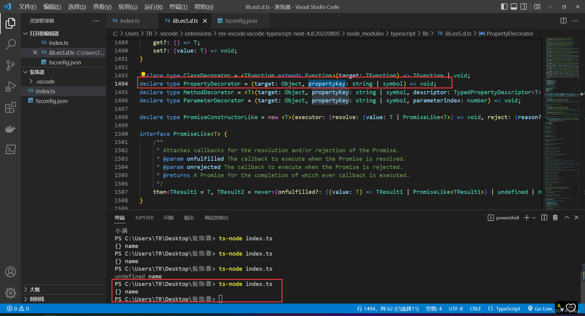
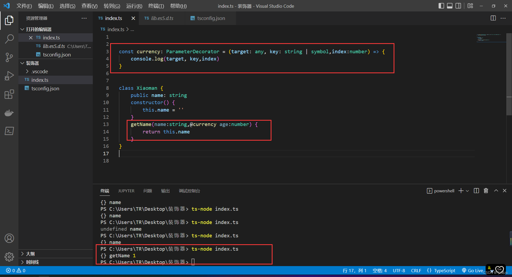
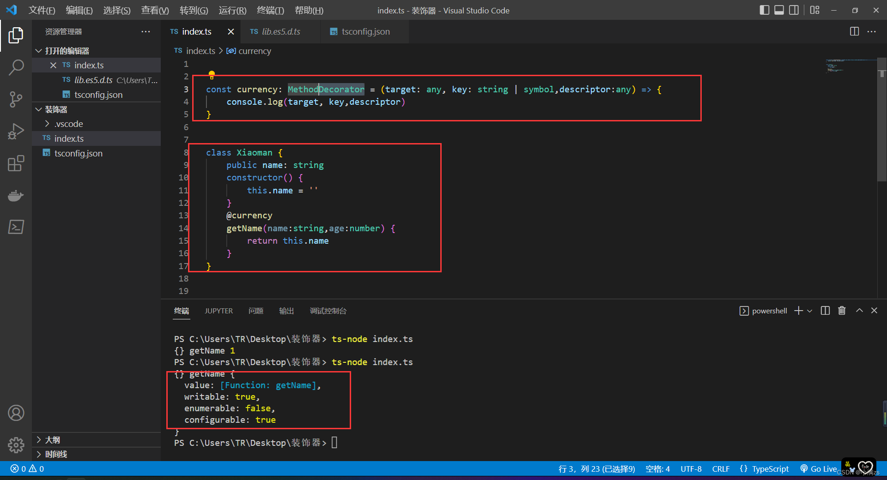
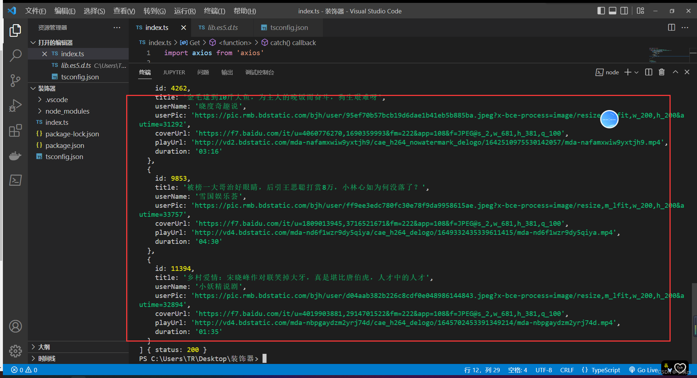

# Nest框架前置知识

## IOC反转和依赖注入

在学习nestjs 之前需要先了解其设计模式

### IOC

Inversion of Control字面意思是控制反转，具体定义是高层模块不应该依赖低层模块，二者都应该依赖其抽象；抽象不应该依赖细节；细节应该依赖抽象。

### DI

依赖注入（Dependency Injection）其实和IoC是同根生，这两个原本就是一个东西，只不过由于控制反转概念比较含糊（可能只是理解为容器控制对象这一个层面，很难让人想到谁来维护对象关系），所以2004年大师级人物Martin Fowler又给出了一个新的名字：“依赖注入”。 类A依赖类B的常规表现是在A中使用B的instance。

案例未使用控制反转和依赖注入之前的代码

```typescript
class A {
    name: string
    constructor(name: string) {
        this.name = name
    }
}
 
 
class B {
    age:number
    entity:A
    constructor (age:number) {
        this.age = age;
        this.entity = new A('用户111')
    }
}
 
const c = new B(18)
 
c.entity.name
```

我们可以看到，**B** 中代码的实现是需要依赖 **A** 的，**两者的代码耦合度非常高。当两者之间的业务逻辑复杂程度增加的情况下，维护成本与代码可读性都会随着增加，并且很难再多引入额外的模块进行功能拓展**。

为了解决这个问题可以使用IOC容器

```typescript
class A {
    name: string
    constructor(name: string) {
        this.name = name
    }
}
 
 
class C {
    name: string
    constructor(name: string) {
        this.name = name
    }
}
// 中间件用于解耦
class Container {
    modeuls: any
    constructor() {
        this.modeuls = {}
    }
    provide(key: string, modeuls: any) {
        this.modeuls[key] = modeuls
    }
    get(key) {
        return this.modeuls[key]
    }
}
 
const mo = new Container()
mo.provide('a', new A('用户1'))
mo.provide('c', new C('用户2'))
 
class B {
    a: any
    c: any
    constructor(container: Container) {
        this.a = container.get('a')
        this.c = container.get('c')
    }
}

new B(mo)
```

其实就是写了一个中间件，来收集依赖，主要是为了解耦，减少维护成本

## 装饰器

### 1、什么是装饰器

装饰器是一种特殊的类型声明，他可以附加在类，方法，属性，参数上面

装饰器写法 **tips（需要开启tsconfig.json的一项配置）**

```json
"experimentalDecorators": true,
```

### 类装饰器 

**主要是通过@符号添加装饰器**

他会自动把class的构造函数传入到装饰器的第一个参数 target

然后通过prototype可以自定义添加属性和方法

```typescript
function decotators (target:any) {
    target.prototype.name = '大壮'
}
 
@decotators
// 相当于：decotators(Dog)
class Dog {
 
    constructor () {
 
    }
 
}
 
const dog:any = new Dog()
 
console.log(dog.name)
```

### 属性装饰器

同样使用@符号给属性添加装饰器

他会返回两个参数

1.原形对象

2.属性的名称

```typescript
const currency: PropertyDecorator = (target: any, key: string | symbol) => {
    console.log(target, key)
}
 
 
class Dog {
    @currency
    public name: string
    constructor() {
        this.name = ''
    }
    getName() {
        return this.name
    }
}
```



### 参数装饰器

同样使用@符号给属性添加装饰器

他会返回两个参数

1.原形对象

2.方法的名称

3.参数的位置从0开始

```typescript
const currency: ParameterDecorator = (target: any, key: string | symbol,index:number) => {
    console.log(target, key,index)
}
 
 
class Dog {
    public name: string
    constructor() {
        this.name = ''
    }
    getName(name:string, @currency age:number) {
        return this.name
    }
}
```



### 方法装饰器 

同样使用@符号给属性添加装饰器

他会返回两个参数

1.原形对象

2.方法的名称

3.属性描述符 可写对应writable，可枚举对应enumerable，可配置对应configurable



```typescript
const currency: MethodDecorator = (target: any, key: string | symbol,descriptor:any) => {
    console.log(target, key,descriptor)
}
 
 
class Dog {
    public name: string
    constructor() {
        this.name = ''
    }
    @currency
    getName(name:string, age:number) {
        return this.name
    }
}
```

## 装饰器-实现一个GET请求

**1.安装依赖**

```bash
npm install axios -S
```

**2.定义控制器 Controller**

```typescript
class Controller {
    constructor() {
 
    }
    getList () {
 
    }
  
}
```

**3.定义装饰器**

这时候需要使用装饰器工厂

应为装饰器默认会塞入一些参数

定义 descriptor 的类型 通过 descriptor描述符里面的value 把axios的结果返回给当前使用装饰器的函数

```typescript
const Get = (url: string): MethodDecorator => {
    return (target, key, descriptor: PropertyDescriptor) => {
        const fnc = descriptor.value;
        axios.get(url).then(res => {
            fnc(res, {
                status: 200,
                success: true,
            })
        }).catch(e => {
            fnc(e, {
                status: 500,
                success: false,
            })
        })
    }
}
```

完整代码 接口可以直接用允许跨越的

```typescript
import axios from 'axios'
 
const Get = (url: string): MethodDecorator => {
    return (target, key, descriptor: PropertyDescriptor) => {
        const fnc = descriptor.value;
        axios.get(url).then(res => {
            fnc(res, {
                status: 200,
                success: true,
            })
        }).catch(e => {
            fnc(e, {
                status: 500,
                success: false,
            })
        })
    }
}
 
// 定义控制器
class Controller {
    constructor() {
 
    }
    @Get('https://api.apiopen.top/api/getHaoKanVideo?page=0&size=10')
    getList (res: any, status: any) {
        console.log(res.data.result.list, status)
    }
  
}
```

