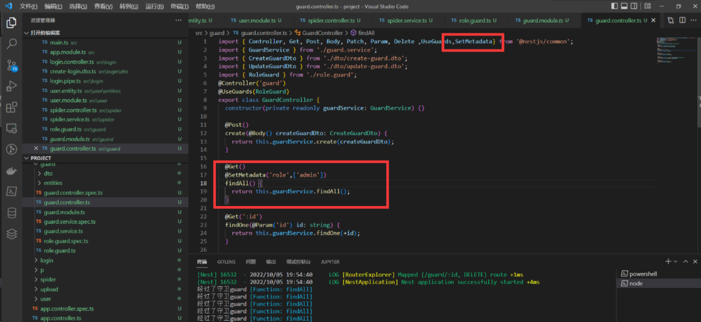

# Nest 框架实战开发

教程：

- [NestJS 小技巧 - 雪隐\_上班了的专栏 - 掘金 (juejin.cn)](https://juejin.cn/column/7203911920637345852)
- [Nestjs - water 的专栏 - 掘金 (juejin.cn)](https://juejin.cn/column/7197034140486254652)
- [nestjs开发小技巧——任务调度 - 掘金 (juejin.cn)](https://juejin.cn/post/7309329004497584180)
- [我总结了1w字的Nest.js入门最佳实践 - 掘金 (juejin.cn)](https://juejin.cn/post/7270464435297189900)
- [保姆级教你用nest集成minio - 掘金 (juejin.cn)](https://juejin.cn/post/7264921613552189474)
- [nestjs-实现双token无感刷新 - 掘金 (juejin.cn)](https://juejin.cn/post/7275211391102451772)

## nestjs 上传图片-静态目录

### 1.主要会用到两个依赖包

这两个依赖包：multer @nestjs/platform-express(nestJs 自带了这个包)

所以这两个需要安装：multer @types/multer

在 `upload.module.ts` 使用 MulterModule register 注册存放图片的目录

需要用到 multer 的 diskStorage 设置存放目录 extname 用来读取文件后缀 filename 给文件重新命名


upload.module.ts

```typescript
import { Module } from "@nestjs/common";
import { UploadService } from "./upload.service";
import { UploadController } from "./upload.controller";
import { MulterModule } from "@nestjs/platform-express";
import { diskStorage } from "multer";
import { extname, join } from "path";

@Module({
	imports: [
		MulterModule.register({
			storage: diskStorage({
				destination: join(__dirname, "../images"),
				filename: (_, file, callback) => {
					const fileName = `${
						new Date().getTime() + extname(file.originalname)
					}`;
					return callback(null, fileName);
				},
			}),
		}),
	],
	controllers: [UploadController],
	providers: [UploadService],
})
export class UploadModule {}
```

### 2.controller 使用

使用 UseInterceptors 装饰器 FileInterceptor 是单个 读取字段名称 FilesInterceptor 是多个

参数 使用 UploadedFile 装饰器接受 file 文件


upload.controller.ts

```typescript
import {
	Controller,
	Get,
	Post,
	Body,
	Patch,
	Param,
	Delete,
	UseInterceptors,
	UploadedFile,
} from "@nestjs/common";
import { UploadService } from "./upload.service";
import { FileInterceptor } from "@nestjs/platform-express";
@Controller("upload")
export class UploadController {
	constructor(private readonly uploadService: UploadService) {}
	@Post("album")
	@UseInterceptors(FileInterceptor("file"))
	upload(@UploadedFile() file) {
		console.log(file);
		return true;
	}
}
```

### 3.生成静态目录访问上传之后的图片

useStaticAssets prefix 是虚拟前缀

main.ts 配置

```typescript
import { NestFactory } from "@nestjs/core";
import { AppModule } from "./app.module";
import { NestExpressApplication } from "@nestjs/platform-express";
import { join } from "path";
async function bootstrap() {
	const app = await NestFactory.create<NestExpressApplication>(AppModule);
	// 配置静态资源访问目录
	app.useStaticAssets(join(__dirname, "images"), {
		prefix: "/img",
	});
	await app.listen(3000);
}
bootstrap();
```

访问：http://localhost:3000/img/jk2.jpg


## nestjs 下载图片

下载文件的方式有好多种

#### 1.download 直接下载

这个文件信息应该存数据库 我们这儿演示就写死 了

upload.controller.ts

```typescript
import {
	Controller,
	Post,
	UseInterceptors,
	UploadedFile,
	Get,
	Res,
} from "@nestjs/common";
import { UploadService } from "./upload.service";
import { FileInterceptor, FilesInterceptor } from "@nestjs/platform-express";
import type { Response } from "express";
import { join } from "path";
@Controller("upload")
export class UploadController {
	constructor(private readonly uploadService: UploadService) {}
	@Post("album")
	@UseInterceptors(FileInterceptor("file"))
	upload(@UploadedFile() file) {
		console.log(file, "file");
		return "峰峰35岁憋不住了";
	}
	@Get("export")
	downLoad(@Res() res: Response) {
		const url = join(__dirname, "../images/1662894316133.png");
		// res
		// console.log(url)
		res.download(url);
		// return  true
	}
}
```


#### 2.使用文件流的方式下载

可以使用 compressing 把他压缩成一个 zip 包

```bash
import {zip} from 'compressing'
```

接受流：upload.controller.ts

```typescript
  @Get('stream')
  async down (@Res() res:Response) {
    const url = join(__dirname,'../images/1662894316133.png')
    const tarStream  = new zip.Stream()
    await tarStream.addEntry(url)

    res.setHeader('Content-Type', 'application/octet-stream');

    res.setHeader(
      'Content-Disposition',
      `attachment; filename=xiaoman`,
    );

    tarStream.pipe(res)

  }
```

前端接受流下载文件：前端请求下载接口的代码

```typescript
const useFetch = async (url: string) => {
	const res = await fetch(url).then((res) => res.arrayBuffer());
	console.log(res);
	const a = document.createElement("a");
	a.href = URL.createObjectURL(
		new Blob([res], {
			// type:"image/png"
		})
	);
	a.download = "img.zip";
	a.click();
};

const download = () => {
	useFetch("http://localhost:3000/upload/stream");
};
```

## nestjs 和 RxJs

**在 Nestjs 已经内置了 RxJs 无需安装 并且 Nestjs 也会有一些基于 Rxjs 提供的 API**

Rxjs 中文文档：[Observable | RxJS 中文文档](https://cn.rx.js.org/class/es6/Observable.js~Observable.html)

### 概念

RxJs 使用的是观察者模式，用来编写异步队列和事件处理。

- Observable 可观察的物件

- Subscription 监听 Observable

- Operators 纯函数可以处理管道的数据 如 map filter concat reduce 等

### 案例

类似于迭代器 next 发出通知 complete 通知完成

subscribe 订阅 observable 发出的通知 也就是一个观察者

```typescript
import { Observable } from "rxjs";

// 类似于迭代器 next 发出通知  complete通知完成
const observable = new Observable((subscriber) => {
	subscriber.next(1);
	subscriber.next(2);
	subscriber.next(3);

	setTimeout(() => {
		subscriber.next(4);
		subscriber.complete();
	}, 1000);
});

observable.subscribe({
	next: (value) => {
		console.log(value);
	},
});
```

#### 案例 2

interval 五百毫秒执行一次 pipe 就是管道的意思 管道里面也是可以去掉接口的支持处理异步数据 去处理数据 这儿展示 了 map 和 filter 跟数组的方法是一样的 最后 通过观察者 subscribe 接受回调

```typescript
import { Observable, interval, take } from "rxjs";
import { map, filter, reduce, find, findIndex } from "rxjs/operators";

const subs = interval(500)
	.pipe(
		map((v) => ({ num: v })),
		filter((v) => v.num % 2 == 0)
	)
	.subscribe((e) => {
		console.log(e);
		if (e.num == 10) {
			subs.unsubscribe();
		}
	});
```

运行：ts-node index.ts

#### 案例 3

Rxjs 也可以处理事件 不过我们在 Nestjs 里面就不用操作 DOM 了 你如果 Angular 或则 Vue 框架看可以使用 fromEvent

```typescript
import { Observable, interval, take, of, retry, fromEvent } from "rxjs";
import { map, filter, reduce, find, findIndex } from "rxjs/operators";

const dom = fromEvent(document, "click").pipe(map((e) => e.target));
dom.subscribe((e) => {});
```

运行：ts-node index.ts

## 响应拦截器(Rxjs 格式化数据)

### 拦截器

拦截器具有一系列有用的功能，这些功能受面向切面编程（AOP）技术的启发。它们可以：

- 在函数执行之前/之后绑定**额外的逻辑**
- 转换从函数返回的结果
- **转换**从函数抛出的异常
- 扩展基本函数行为
- 根据所选条件完全重写函数 (例如, 缓存目的)

想给接口返回一个标准的 json 格式 就要给我们的数据做一个全局 format

```json
{
  data, //数据
  status:0,
  message:"成功",
  success:true
}
```

新建 common 文件夹 创建 common/response.ts， Nest Js 配合 Rxjs 格式化数据

```typescript
import { Injectable, NestInterceptor, CallHandler } from "@nestjs/common";
import { map } from "rxjs/operators";
import { Observable } from "rxjs";

interface data<T> {
	data: T;
}

@Injectable()
export class Response<T = any> implements NestInterceptor {
	intercept(context, next: CallHandler): Observable<data<T>> {
		return next.handle().pipe(
			map((data) => {
				return {
					data,
					status: 0,
					success: true,
					message: "牛逼",
				};
			})
		);
	}
}
```

在 main.ts 注册

```typescript
app.useGlobalInterceptors(new Response());
```

浏览器打开看返回的数据：http://localhost3000/user

## 全局异常拦截器

common 下面新建 common/filter.ts

创建一个异常过滤器，它负责捕获作为 HttpException 类实例的异常，并为它们设置自定义响应逻辑。为此，我们需要访问底层平台 Request 和 Response。我们将访问 Request 对象，以便提取原始 url 并将其包含在日志信息中。我们将使用 Response.json()方法，使用 Response 对象直接控制发送的响应。

```typescript
import {
	ExceptionFilter,
	Catch,
	ArgumentsHost,
	HttpException,
} from "@nestjs/common";

import { Request, Response } from "express";

@Catch(HttpException)
export class HttpFilter implements ExceptionFilter {
	catch(exception: HttpException, host: ArgumentsHost) {
		const ctx = host.switchToHttp();
		const request = ctx.getRequest<Request>();
		const response = ctx.getResponse<Response>();

		const status = exception.getStatus();

		response.status(status).json({
			data: exception.message,
			time: new Date().getTime(),
			success: false,
			path: request.url,
			status,
		});
	}
}
```

main.ts 注册全局异常过滤器

```typescript
import HttpFilter from "common/filter";

app.useGlobalFilters(new HttpFilter());
```

浏览器打开一个不存在的接口：http://localhost3000/haha

## 管道转换和验证

管道 可以做两件事

- 1.**转换**：可以将前端传入的数据转成成我们需要的数据
- 2.**验证**：类似于前端的 rules 配置验证规则

转换 Nestjs 提供了八个内置转换 API

- ValidationPipe
- ParseIntPipe
- ParseFloatPipe
- ParseBoolPipe
- ParseArrayPipe
- ParseUUIDPipe
- ParseEnumPipe
- DefaultValuePipe

### 案例 1：转换参数

接受的动态参数希望是一个 number 类型，现在是 string

这时候就可以通过内置的管道 去做转换

```typescript

```

### 案例 2：验证 UUID

安装 uuid

```bash
npm install uuid -S

npm install @types/uuid -D
```

生成一个 uuid

```typescript

```

## 管道验证 DTO

### 1.先创建一个 pipe 验证管道

```bash
nest g pi 文件名字
```

### 2.安装验证器

```bash
npm i --save class-validator class-transformer
```

代码

```typescript
import { IsNotEmpty, IsString } from "class-validator";
export class CreatePDto {
	@IsNotEmpty() // 验证是否为空
	@IsString() // 是否为字符串
	name: string;

	@IsNotEmpty()
	age: number;
}
```

### 3.controller 使用管道 和定义类型


### 4.实现验证 transform

value 就是 前端传过来的数据 metaData 就是元数据 通过 metatype 可以去实例化这个类

```typescript

```

实例化 DTO

```typescript

```

通过 validate 验证 DTO 返回一个 promise 的错误信息 如果有错误抛出

```typescript

```

### 5.注册全局 DTO 验证管道

跟自己写的效果基本类似

```typescript

```

## 守卫

### 守卫（guard）

守卫有一个单独的责任。它们根据运行时出现的某些条件（例如权限，角色，访问控制列表等）来确定给定的请求是否由路由处理程序处理。这通常称为授权。在传统的 Express 应用程序中，通常由中间件处理授权(以及认证)。中间件是身份验证的良好选择，因为诸如 token 验证或添加属性到 request 对象上与特定路由(及其元数据)没有强关联。

tips 守卫在每个中间件之后执行，但在任何拦截器或管道之前执行。

创建一个守卫

```bash
nest g gu [name]
```

守卫要求实现函数 给定参数 context**执行上下文** 要求返回布尔值


```typescript

```

### Controller 使用守卫

使用 UseGuards 控制守卫


```typescript

import { Controller, Get, Post, Body, Patch, Param, Delete ,UseGuards} from '@nestjs/common';

@Controller('guard')
@UseGuards(RoleGuard)
xxxxx
```

### 全局守卫

main.ts

```typescript
app.useGlobalGuards(new RoleGuard());
```


### 针对角色控制守卫

SetMetadata 装饰器

第一个参数为 key，第二个参数自定义我们的例子是数组存放的权限



guard 使用 Reflector 反射读取 setMetaData 的值，去做判断这边例子是从 url 判断有没有 admin 权限

role.guard.ts

```typescript
import { CanActivate, ExecutionContext, Injectable } from "@nestjs/common";
import { Observable } from "rxjs";
import { Reflector } from "@nestjs/core";
import type { Request } from "express";
@Injectable()
export class RoleGuard implements CanActivate {
	constructor(private Reflector: Reflector) {}
	canActivate(
		context: ExecutionContext
	): boolean | Promise<boolean> | Observable<boolean> {
		const admin = this.Reflector.get<string[]>("role", context.getHandler());
		const request = context.switchToHttp().getRequest<Request>();
		if (admin.includes(request.query.role as string)) {
			return true;
		} else {
			return false;
		}
	}
}
```

浏览器打开：http://localhost:3000/guard?role=admin

## 自定义装饰器

Nestjs 允许我们去自定义装饰器。

文章参考：[Nest.js 系列——常用的装饰器以及自定义装饰器 - 掘金 (juejin.cn)](https://juejin.cn/post/7263283712225607737)

### 案例 1：自定义权限装饰器

生成装饰器

```bash
nest g d [name]
```

代码

```typescript
import { SetMetadata } from "@nestjs/common";

export const Role = (role: string[]) => {
	console.log(role, 1);
	return SetMetadata("role", role);
};
```


### 案例 2：自定义参数装饰器，返回一个 url

```typescript
import {
	SetMetadata,
	createParamDecorator,
	ExecutionContext,
	applyDecorators,
} from "@nestjs/common";
import type { Request } from "express";

export const ReqUrl = createParamDecorator(
	(data: string, ctx: ExecutionContext) => {
		const req = ctx.switchToHttp().getRequest<Request>();
		return req.url;
	}
);
```


### 聚合装饰器

## nestjs 爬虫

其实爬虫是一个对计算机综合能力要求比较高的技术活。

首先是要对网络协议尤其是 http 协议有基本的了解, 能够分析网站的数据请求响应。学会使用一些工具，简单的情况使用 chrome devtools 的 network 面板就够了

**cheerio**：是 jquery 核心功能的一个快速灵活而又简洁的实现，主要是为了用在服务器端需要对 DOM 进行操作的地方，让你在服务器端和 html 愉快的玩耍。

**axios**：网络请求库可以发送 http 请求

### 第一步分析该网页

发现图片是在 article-content 下面的 p 标签


请求获取该图片


```typescript

```

拼接 url 拿到了第一页的数据


```typescript

```

### 第二步递归读取所有图片

```typescript
const baseUrl = "xxxxxxxxxxxxxxxxxxxxxxx";
const next = "下一页";
let index = 0;
const urls: string[] = [];
const getCosPlay = async () => {
	console.log(index);
	await axios
		.get(`xxxxxxxxxxxxxx/Cosplay/Cosplay10772${index ? "_" + index : ""}.html`)
		.then(async (res) => {
			//console.log(res.data)
			const $ = cheerio.load(res.data);
			const page = $(".article-content .pagination a")
				.map(function () {
					return $(this).text();
				})
				.toArray();
			if (page.includes(next)) {
				$(".article-content p img").each(function () {
					console.log($(this).attr("src"));
					urls.push(baseUrl + $(this).attr("src"));
				});
				index++;
				await getCosPlay();
			}
		});
};
await getCosPlay();
console.log(urls);
```


### 第三步写入本地

```typescript
  writeFile(urls: string[]) {
    urls.forEach(async url => {
      const buffer = await axios.get(url, { responseType: "arraybuffer" }).then(res=>res.data)
      const ws = fs.createWriteStream(path.join(__dirname, '../cos' + new Date().getTime() + '.jpg'))
      ws.write(buffer)
    })
  }
```


## nestjs 连接数据库

文档：[Database | NestJS - A progressive Node.js framework](https://docs.nestjs.com/techniques/database)

### 数据库相关

Nest 与数据库无关，允许您轻松地与任何 SQL 或 NoSQL 数据库集成。

可以直接使用任何通用的 Node.js 数据库集成库或 ORM ，例如 Sequelize (recipe)、knexjs (tutorial)`和 TypeORM ，以在更高的抽象级别上进行操作。

### 数据库

#### 1.sequelize

- <https://sequelize.org/>
- <https://www.npmjs.com/package/sequelize>
- <https://github.com/sequelize/sequelize>

#### 2.knexjs

<https://knexjs.org/>

#### 3.MongoDB

Nest 支持两种与 MongoDB 数据库集成的方式

1.使用内置的 TypeORM 提供的 MongoDB 连接器

<https://github.com/typeorm/typeorm>

2.使用最流行的 MongoDB 对象建模工具 Mongoose

<https://mongoosejs.com/>

### TypeORM

typeorm 开发 GitHub 地址：<https://github.com/typeorm/typeorm>

#### TypeORM 介绍

Nest 还提供了与现成的 TypeORM 与 @nestjs/typeorm 的紧密集成

为了与 SQL 和 NoSQL 数据库集成，Nest 提供了 @nestjs/typeorm 包。Nest 使用 TypeORM 是因为它是 TypeScript 中最成熟的对象关系映射器( ORM )。因为它是用 TypeScript 编写的，所以可以很好地与 Nest 框架集成。

TypeORM 提供了对许多关系数据库的支持：PostgreSQL 、Oracle、Microsoft SQL Server、SQLite，甚至像 MongoDB 这样的 NoSQL 数据库

#### 基本使用

##### 1.为所选数据库安装相关的客户端 API 库

mysql 为例

```bash
npm install --save @nestjs/typeorm typeorm mysql2
```

##### 2.将 TypeOrmModule 导入 AppModule

app.module.ts

```typescript
//  app.module.ts
import { Module } from "@nestjs/common";
import { TypeOrmModule } from "@nestjs/typeorm";

@Module({
	imports: [
		TypeOrmModule.forRoot({
			type: "mysql",
			host: "localhost",
			port: 3306,
			username: "root",
			password: "root",
			database: "test",
			entities: [],
			synchronize: true,
		}),
	],
})
export class AppModule {}
```

forRoot() 方法说明

- forRoot() 方法支持所有 TypeORM 包中 createConnection()函数暴露出的配置属性
- 额外对象属性配置
  - retryAttempts:
    - 重试连接数据库的次数（默认：10）
  - retryDelay:
    - 两次重试连接的间隔(ms)（默认：3000）
  - autoLoadEntities:
    - 如果为 true,将自动加载实体 (默认：false)
  - keepConnectionAlive:
    - 如果为 true，在应用程序关闭后连接不会关闭 (默认：false)
- 更多连接选项，请查阅文档：<https://typeorm.io/#/connection-options>

##### 3.可以创建 ormconfig.json(选项模块化：2 和 3 任选一项配置)

```json
{
	"type": "mysql",
	"host": "localhost",
	"port": 3306,
	"username": "root",
	"password": "root",
	"database": "test",
	"entities": ["dist/**/*.entity{.ts,.js}"],
	"synchronize": true
}
```

然后，可以不带任何选项地调用 forRoot()

app.module.ts

```typescript
//  app.module.ts
import { Module } from "@nestjs/common";
import { TypeOrmModule } from "@nestjs/typeorm";

@Module({
	imports: [TypeOrmModule.forRoot()],
})
export class AppModule {}
```

静态全局路径(例如 dist/\*_/_.entity{ .ts,.js} )不适用于 Webpack 热重载。

> 注意，ormconfig.json 文件由 typeorm 库载入，因此，任何上述参数之外的属性都不会被应用（例如由 forRoot()方法内部支持的属性–例如 autoLoadEntities 和 retryDelay())

##### 4.完成 2 或 3，TypeORM 的 Connection 和 EntityManager 对象

就可以在整个项目中注入(不需要导入任何模块)

app.module.ts

```typescript
//  app.module.ts

import { Connection } from "typeorm";

@Module({
	imports: [TypeOrmModule.forRoot(), PhotoModule],
})
export class AppModule {
	constructor(private readonly connection: Connection) {}
}
```

#### TypeORM 模式介绍和使用

##### 存储库模式

TypeORM 支持存储库设计模式，因此每个实体都有自己的存储库
从数据库连接获得这些存储库

###### 1.定义 User 实体

entity/user.entity.ts

```typescript
import { Entity, Column, PrimaryGeneratedColumn } from "typeorm";

@Entity()
export class User {
	@PrimaryGeneratedColumn()
	id: number;

	@Column()
	firstName: string;

	@Column()
	lastName: string;

	@Column({ default: true })
	isActive: boolean;
}
```

该 User 实体在 users 目录下。这个目录包含了和 UsersModule 模块有关的所有文件。你可以决定在哪里保存模型文件，但我们推荐在他们的域中就近创建，即在相应的模块目录中。

实体的更多内容：<https://typeorm.io/#/entities>

###### 2.使用 user 实体

app.module.ts

1.需要在模块的 forRoot()方法的选项中（除非你使用一个静态的全局路径）将它插入 entities 数组中来让 TypeORM 知道它的存在

```typescript
import { Module } from "@nestjs/common";
import { TypeOrmModule } from "@nestjs/typeorm";
import { User } from "./users/user.entity";

@Module({
	imports: [
		TypeOrmModule.forRoot({
			type: "mysql",
			host: "localhost",
			port: 3306,
			username: "root",
			password: "root",
			database: "test",
			//  存储库
			entities: [User],
			synchronize: true,
		}),
	],
})
export class AppModule {}
```

###### 3.user.module.ts 使用 forFeature() 方法 定义注册存储库

```typescript
import { Module } from "@nestjs/common";
import { TypeOrmModule } from "@nestjs/typeorm";
import { UsersService } from "./users.service";
import { UsersController } from "./users.controller";
import { User } from "./user.entity";

@Module({
	imports: [TypeOrmModule.forFeature([User])],
	providers: [UsersService],
	controllers: [UsersController],
})
export class UsersModule {}
```

此模块使用 forFeature() 方法定义在当前范围中注册哪些存储库。

###### 4.注入到 UsersService 服务提供者中

users.service.ts

使用 @InjectRepository()装饰器将 UsersRepository 注入到 UsersService 中:

```typescript
//  users.service.ts

import { Injectable } from "@nestjs/common";
import { InjectRepository } from "@nestjs/typeorm";
import { Repository } from "typeorm";
import { User } from "./user.entity";

@Injectable()
export class UsersService {
	constructor(
		@InjectRepository(User)
		private usersRepository: Repository<User>
	) {}

	findAll(): Promise<User[]> {
		return this.usersRepository.find();
	}

	findOne(id: string): Promise<User> {
		return this.usersRepository.findOne(id);
	}

	async remove(id: string): Promise<void> {
		await this.usersRepository.delete(id);
	}
}
```

###### 5.将 UsersModule 导入根 AppModule

app.module.ts

```typescript
import { Module } from "@nestjs/common";
import { TypeOrmModule } from "@nestjs/typeorm";
import { User } from "./users/user.entity";

@Module({
	imports: [
		TypeOrmModule.forRoot({
			type: "mysql",
			host: "localhost",
			port: 3306,
			username: "root",
			password: "root",
			database: "test",
			//  存储库
			entities: [User],
			synchronize: true,
		}),
		//  导入
		UserModule,
	],
})
export class AppModule {}
```

###### 6.要在导入 TypeOrmModule.forFeature 的模块之外使用存储库（users.module.ts）

如果要在导入 TypeOrmModule.forFeature 的模块之外使用存储库，则需要重新导出由其生成的提供程序。 可以通过导出整个模块来做到这一点

**6.1.导出模块**

users.module.ts

```typescript
import { Module } from "@nestjs/common";
import { TypeOrmModule } from "@nestjs/typeorm";
import { User } from "./user.entity";

@Module({
	imports: [TypeOrmModule.forFeature([User])],
	exports: [TypeOrmModule],
})
export class UsersModule {}
```

**6.2.其他地方导入使用**

users-http.module.ts

在 UserHttpModule 中导入 UsersModule ，我们可以在后一个模块的提供者中使用 @InjectRepository(User)

```typescript
//  users-http.module.ts

import { Module } from "@nestjs/common";
import { UsersModule } from "./user.module";
import { UsersService } from "./users.service";
import { UsersController } from "./users.controller";

@Module({
	imports: [UsersModule],
	providers: [UsersService],
	controllers: [UsersController],
})
export class UserHttpModule {}
```

##### 关系

###### 关系概念

- 关系是指两个或多个表之间的联系
- 关系基于每个表中的常规字段，通常包含主键和外键。

###### 三种关系和装饰器

- 一对一
  - 主表中的每一行在外部表中有且仅有一个对应行
  - 使用 @OneToOne() 装饰器来定义这种类型的关系
- 一对多/多对一
  - 主表中的每一行在外部表中有一个或多的对应行
  - 使用 @OneToMany() 和 @ManyToOne()装饰器 来定义这种类型的关系
- 多对多
  - 主表中的每一行在外部表中有多个对应行，外部表中的每个记录在主表中也有多个行
  - 使用 @ManyToMany()装饰器 来定义这种类型的关系

###### 使用装饰器例子

@OneToMany()装饰器 定义每个 User 可以有多个 Photo

user.entity.ts

```typescript
//  user.entity.ts
import { Entity, Column, PrimaryGeneratedColumn, OneToMany } from "typeorm";
import { Photo } from "../photos/photo.entity";

@Entity()
export class User {
	@PrimaryGeneratedColumn()
	id: number;

	@Column()
	firstName: string;

	@Column()
	lastName: string;

	@Column({ default: true })
	isActive: boolean;

	@OneToMany((type) => Photo, (photo) => photo.user)
	photos: Photo[];
}
```

要了解更多 TypeORM 中关系的内容

可以查看 TypeORM 文档：<https://typeorm.io/#/relations>

##### 自动载入实体

使用静态全局路径来自动载入实体，例如

```bash
dist/*/.entity{.ts,.js}
```

webpack 不支持全局路径，因此如果你要在单一仓库(Monorepo)中构建应用，可能不能使用全局路径。

###### 解决方案

在配置对象的属性中(传递给 forRoot()方法的)设置 autoLoadEntities 属性为 true 来自动载入实体

app.module.ts

```typescript
// app.module.ts
import { Module } from '@nestjs/common';
import { TypeOrmModule } from '@nestjs/typeorm';

@Module({
  imports: [
    TypeOrmModule.forRoot({
      ...
      autoLoadEntities: true,
    }),
  ],
})
export class AppModule {}
```

通过配置这一选项，每个通过 forFeature()注册的实体都会自动添加到配置对象的 entities 数组中

> 注意，那些没有通过 forFeature()方法注册，而仅仅是在实体中被引用（通过关系）的实体不能通过 autoLoadEntities 配置被包含。

##### 事务

###### 事务简介

- 数据库事务代表在数据库管理系统（DBMS）中针对数据库的一组操作，这组操作是有关的、可靠的并且和其他事务相互独立的。
- 一个事务通常可以代表数据库中的任何变更：<https://zh.wikipedia.org/wiki/%E6%95%B0%E6%8D%AE%E5%BA%93%E4%BA%8B%E5%8A%A1>

TypeORM 事务：<https://typeorm.io/#/transactions>

###### TypeORM 事务使用 QueryRunner 类

1.将 Connection 对象在服务提供者注入

Connection 类需要从 typeorm 包中导入

```typescript
@Injectable()
export class UsersService {
	constructor(private connection: Connection) {}
}
```

2.使用这个对象来创建一个事务

```typescript
async createMany(users: User[]) {
  const queryRunner = this.connection.createQueryRunner();

  await queryRunner.connect();
  await queryRunner.startTransaction();
  try {
    await queryRunner.manager.save(users[0]);
    await queryRunner.manager.save(users[1]);

    await queryRunner.commitTransaction();
  } catch (err) {
    //如果遇到错误，可以回滚事务
    await queryRunner.rollbackTransaction();
  } finally {
    //你需要手动实例化并部署一个queryRunner
    await queryRunner.release();
  }
}
```

> 注意 connection 仅用于创建 QueryRunner。然而，要测试这个类，就需要模拟整个 Connection 对象（它暴露出来的几个方法），因此，我们推荐采用一个帮助工厂类（也就是 QueryRunnerFactory)并且定义一个包含仅限于维持事务需要的方法的接口。
> 这一技术让模拟这些方法变得非常直接。

3.可选地，你可以使用一个 Connection 对象的回调函数风格的 transaction 方法

更多方法：<https://typeorm.io/#/transactions/creating-and-using-transactions>

```typescript
async createMany(users: User[]) {
  await this.connection.transaction(async manager => {
    await manager.save(users[0]);
    await manager.save(users[1]);
  });
}
```

不推荐使用装饰器来控制事务(@Transaction()和@TransactionManager())。

##### 订阅者

使用 TypeORM 订阅者，你可以监听特定的实体事件：<https://typeorm.io/#/listeners-and-subscribers/what-is-a-subscriber>

###### 使用例子

1.订阅例子

```typescript
import {
	Connection,
	EntitySubscriberInterface,
	EventSubscriber,
	InsertEvent,
} from "typeorm";
import { User } from "./user.entity";

@EventSubscriber()
export class UserSubscriber implements EntitySubscriberInterface<User> {
	constructor(connection: Connection) {
		connection.subscribers.push(this);
	}

	listenTo() {
		return User;
	}

	beforeInsert(event: InsertEvent<User>) {
		console.log(`BEFORE USER INSERTED: `, event.entity);
	}
}
```

事件订阅者不能是请求范围的：<https://docs.nestjs.com/fundamentals/injection-scopes>

2.将 UserSubscriber 类添加到 providers 数组

```typescript
import { Module } from "@nestjs/common";
import { TypeOrmModule } from "@nestjs/typeorm";
import { User } from "./user.entity";
import { UsersController } from "./users.controller";
import { UsersService } from "./users.service";
import { UserSubscriber } from "./user.subscriber";

@Module({
	imports: [TypeOrmModule.forFeature([User])],
	providers: [UsersService, UserSubscriber],
	controllers: [UsersController],
})
export class UsersModule {}
```

更多实体订阅者内容：<https://typeorm.io/#/listeners-and-subscribers/what-is-a-subscriber>

##### 迁移

迁移提供了一个在保存数据库中现有数据的同时增量升级数据库使其与应用中的数据模型保持同步的方法。
TypeORM 提供了一个专用 CLI 命令行工具用于生成、运行以及回滚迁移。

迁移类和 Nest 应用源码是分开的。他们的生命周期由 TypeORM CLI 管理，因此，你不能在迁移中使用依赖注入和其他 Nest 专有特性

详情查看 TypeORM 文档：<https://typeorm.io/migrations>

##### 多个数据库

1.创建多个数据库连接

假设有一个 Album 实体存储在数据库中

```typescript
const defaultOptions = {
	type: "postgres",
	port: 5432,
	username: "user",
	password: "password",
	database: "db",
	synchronize: true,
};

@Module({
	imports: [
		TypeOrmModule.forRoot({
			...defaultOptions,
			host: "user_db_host",
			entities: [User],
		}),
		TypeOrmModule.forRoot({
			...defaultOptions,
			name: "albumsConnection",
			host: "album_db_host",
			entities: [Album],
		}),
	],
})
export class AppModule {}
```

如果未为连接设置任何 name ，则该连接的名称将设置为 default。

请注意，不应该有多个没有名称或同名的连接，否则它们会被覆盖。

2.告诉 TypeOrmModule.forFeature() 方法和 @InjectRepository() 装饰器应该使用哪种连接

```typescript
@Module({
	imports: [
		TypeOrmModule.forFeature([User]),
		TypeOrmModule.forFeature([Album], "albumsConnection"),
	],
})
export class AppModule {}
```

如果不传递任何连接名称，则使用 default 连接

3.为给定的连接注入 Connection 或 EntityManager

```typescript
@Injectable()
export class AlbumsService {
	constructor(
		@InjectConnection("albumsConnection")
		private connection: Connection,
		@InjectEntityManager("albumsConnection")
		private entityManager: EntityManager
	) {}
}
```

##### 测试

在单元测试我们的应用程序时，我们通常希望避免任何数据库连接，从而使我们的测试适合于独立，并使它们的执行过程尽可能快。但是我们的类可能依赖于从连接实例中提取的存储库。那是什么？

###### 测试解决方案

创建假存储库。为了实现这一点，我们设置了[自定义提供者]

事实上，每个注册的存储库都由 entitynamereposition 标记表示，其中 EntityName 是实体类的名称。

###### getRepositoryToken() 函数

@nestjs/typeorm 包提供了基于给定实体返回准备好 token 的 getRepositoryToken() 函数

1.使用

```typescript
@Module({
	providers: [
		UsersService,
		{
			provide: getRepositoryToken(User),
			// 使用mockRepository 作为 UsersRepository
			useValue: mockRepository,
		},
	],
})
export class UsersModule {}
```

使用 mockRepository 作为 UsersRepository

每当任何提供程序使用 @InjectRepository() 装饰器请求 UsersRepository 时, Nest 会使用注册的 mockRepository 对象。

##### 定制存储库

TypeORM 提供称为自定义存储库的功能：<https://typeorm.io/custom-repository>

自定义存储库允许您扩展基本存储库类，并使用几种特殊方法对其进行丰富

1.使用 @EntityRepository() 装饰器和扩展 Repository 类 创建自定义存储库

```typescript
@EntityRepository(Author)
export class AuthorRepository extends Repository<Author> {}
@EntityRepository() 和 Repository 来自 typeorm 包
```

2.将实例化责任移交给 Nest

将 AuthorRepository 类传递给 TypeOrm.forFeature() 函数

```typescript
@Module({
	imports: [TypeOrmModule.forFeature([AuthorRepository])],
	controller: [AuthorController],
	providers: [AuthorService],
})
export class AuthorModule {}
```

3.注入存储库

```typescript
@Injectable()
export class AuthorService {
	constructor(private readonly authorRepository: AuthorRepository) {}
}
```

##### 异步配置

异步传递模块选项：forRootAsync() 函数，提供了几种处理异步数据的方法

###### 1.使用工厂函数

```typescript
TypeOrmModule.forRootAsync({
	useFactory: () => ({
		type: "mysql",
		host: "localhost",
		port: 3306,
		username: "root",
		password: "root",
		database: "test",
		entities: [__dirname + "/**/*.entity{.ts,.js}"],
		synchronize: true,
	}),
});
```

工厂的行为与任何其他异步提供者一样(例如，它可以是异步的，并且它能够通过 inject 注入依赖)。如下

```typescript
TypeOrmModule.forRootAsync({
	imports: [ConfigModule],
	useFactory: (configService: ConfigService) => ({
		type: "mysql",
		host: configService.get<string>("HOST"),
		port: configService.get<string>("PORT"),
		username: configService.get<string>("USERNAME"),
		password: configService.get<string>("PASSWORD"),
		database: configService.get<string>("DATABASE"),
		entities: [__dirname + "/**/*.entity{.ts,.js}"],
		synchronize: true,
	}),
	inject: [ConfigService],
});
```

###### 2.使用 useClass 语法

1.在 TypeOrmConfigService 实现 TypeOrmOptionsFactory 的接口

在 TypeOrmModule 内部实例化 TypeOrmConfigService，并通过调用 createTypeOrmOptions()

```typescript
@Injectable()
class TypeOrmConfigService implements TypeOrmOptionsFactory {
  createTypeOrmOptions(): TypeOrmModuleOptions {
    return {
      type: 'mysql',
      host: 'localhost',
      port: 3306,
      username: 'root',
      password: 'root',
      database: 'test',
      entities: [__

dirname + '/**/*.entity{.ts,.js}'],
      synchronize: true,
    };
  }
}
```

2.useClass 语法调用

```typescript
TypeOrmModule.forRootAsync({
	useClass: TypeOrmConfigService,
});
```

将 TypeOrmConfigService 在内部进行实例化 TypeOrmModule，并将利用它来创建选项对象。

3.使用 useExisting 语法调用

防止在 TypeOrmModule 中创建 TypeOrmConfigService 并使用从不同模块导入的提供程序，可以使用 useExisting 语法

```typescript
TypeOrmModule.forRootAsync({
	imports: [ConfigModule],
	useExisting: ConfigService,
});
```

这个构造与 useClass 的工作原理相同，但有一个关键的区别 — TypeOrmModule 将查找导入的模块来重用现有的 ConfigService，而不是实例化一个新的 ConfigService

集成例子：<https://github.com/nestjs/nest/tree/master/sample/05-sql-typeorm>

### nestjs 实体（映射到数据库表的类）

什么是实体

实体是一个映射到数据库表的类。 你可以通过定义一个新类来创建一个实体，并用`@Entity()`来标记：

```typescript
import { Entity, Column, PrimaryGeneratedColumn } from "typeorm";

@Entity()
export class Test {
	@PrimaryGeneratedColumn()
	id: number;

	@Column()
	name: string;

	@Column()
	password: string;

	@Column()
	age: number;
}
```

#### 主列

##### 自动递增的主键

```typescript
@PrimaryGeneratedColumn()
id:number
```

##### 自动递增 uuid

```typescript
@PrimaryGeneratedColumn("uuid")
id:number
```

#### 列类型

```typescript
@Column({type:"varchar",length:200})
password: string

@Column({ type: "int"})
age: number

@CreateDateColumn({type:"timestamp"})
create_time:Date
```

##### mysql 所有类型

int, tinyint, smallint, mediumint, bigint, float, double, dec, decimal, numeric, date, datetime, timestamp, time, year, char, varchar, nvarchar, text, tinytext, mediumtext, blob, longtext, tinyblob, mediumblob, longblob, enum, json, binary, geometry, point, linestring, polygon, multipoint, multilinestring, multipolygon, geometrycollection

##### 自动生成列

```TypeScript
@Generated('uuid')

uuid:string
```

##### 枚举列

```typescript
  @Column({
    type:"enum",
    enum:['1','2','3','4'],
    default:'1'
  })
  xx:string
```


#### 列选项

```typescript
@Column({
    type:"varchar",
    name:"ipaaa", //数据库表中的列名
    nullable:true, //在数据库中使列NULL或NOT NULL。 默认情况下，列是nullable：false
    comment:"注释",
    select:true,  //定义在进行查询时是否默认隐藏此列。 设置为false时，列数据不会显示标准查询。 默认情况下，列是select：true
    default:"xxxx", //加数据库级列的DEFAULT值
    primary:false, //将列标记为主要列。 使用方式和@ PrimaryColumn相同。
    update:true, //指示"save"操作是否更新列值。如果为false，则只能在第一次插入对象时编写该值。 默认值为"true"
    collation:"", //定义列排序规则。
})
ip:string
```

ColumnOptions 中可用选项列表：

- type: ColumnType - 列类型。其中之一在上面.
- name: string - 数据库表中的列名。

默认情况下，列名称是从属性的名称生成的。 你也可以通过指定自己的名称来更改它。

- length: number - 列类型的长度。 例如，如果要创建 varchar（150）类型，请指定列类型和长度选项。
- width: number - 列类型的显示范围。 仅用于 MySQL integer types(opens new window)
- onUpdate: string - ON UPDATE 触发器。 仅用于 MySQL (opens new window).
- nullable: boolean - 在数据库中使列 NULL 或 NOT NULL。 默认情况下，列是 nullable：false。
- update: boolean - 指示"save"操作是否更新列值。如果为 false，则只能在第一次插入对象时编写该值。 默认值为"true"。
- select: boolean - 定义在进行查询时是否默认隐藏此列。 设置为 false 时，列数据不会显示标准查询。 默认情况下，列是 select：true
- default: string - 添加数据库级列的 DEFAULT 值。
- primary: boolean - 将列标记为主要列。 使用方式和@ PrimaryColumn 相同。
- unique: boolean - 将列标记为唯一列（创建唯一约束）。
- comment: string - 数据库列备注，并非所有数据库类型都支持。
- precision: number - 十进制（精确数字）列的精度（仅适用于十进制列），这是为值存储的最大位数。仅用于某些列类型。
- scale: number - 十进制（精确数字）列的比例（仅适用于十进制列），表示小数点右侧的位数，且不得大于精度。 仅用于某些列类型。
- zerofill: boolean - 将 ZEROFILL 属性设置为数字列。 仅在 MySQL 中使用。 如果是 true，MySQL 会自动将 UNSIGNED 属性添加到此列。
- unsigned: boolean - 将 UNSIGNED 属性设置为数字列。 仅在 MySQL 中使用。
- charset: string - 定义列字符集。 并非所有数据库类型都支持。
- collation: string - 定义列排序规则。
- enum: string[]|AnyEnum - 在 enum 列类型中使用，以指定允许的枚举值列表。 你也可以指定数组或指定枚举类。
- asExpression: string - 生成的列表达式。 仅在 MySQL (opens new window)中使用。
- generatedType: "VIRTUAL"|"STORED" - 生成的列类型。 仅在 MySQL (opens new window)中使用。
- hstoreType: "object"|"string" -返回 HSTORE 列类型。 以字符串或对象的形式返回值。 仅在 Postgres 中使用。
- array: boolean - 用于可以是数组的 postgres 列类型（例如 int []）
- transformer: { from(value: DatabaseType): EntityType, to(value: EntityType): DatabaseType } - 用于将任意类型 EntityType 的属性编组为数据库支持的类型 DatabaseType。

#### simple-array 列类型

有一种称为 simple-array 的特殊列类型，它可以将原始数组值存储在单个字符串列中。 所有值都以逗号分隔

```typescript
@Entity()
export class User {
	@PrimaryGeneratedColumn()
	id: number;

	@Column("simple-array")
	names: string[];
}
```

#### simple-json 列类型

还有一个名为 simple-json 的特殊列类型，它可以存储任何可以通过 JSON.stringify 存储在数据库中的值。 当你的数据库中没有 json 类型而你又想存储和加载对象，该类型就很有用了。 例如：

```typescript
@Entity()
export class User {
	@PrimaryGeneratedColumn()
	id: number;

	@Column("simple-json")
	profile: { name: string; nickname: string };
}
```

### Sequelize 集成(比较成熟，推荐使用)

Sequelize 集成文章：<https://docs.nestjs.cn/8/techniques?id=sequelize-%e9%9b%86%e6%88%90>

#### Sequelize 介绍

- 另一个使用 TypeORM 的选择是使用@nestjs/sequelize 包中的 Sequelize ROM
- 我们使用 sequelize-typescript 包来提供一系列额外的装饰器以声明实体。
- Sequelize 支持很多种关系数据库，例如 PostgreSQL,MySQL,Microsoft SQL Server，SQLite 以及 MariaDB

#### Sequelize 基本使用

##### 1.安装需要的依赖--MySQL 关系数据库为例

也适合其他任何 Sequelize 支持的数据库，按需安装所选数据库相应的客户端 API 库就可以。

安装

```bash
npm install --save @nestjs/sequelize sequelize sequelize-typescript mysql2
npm install --save-dev @types/sequelize
```

##### 2.将 SequelizeModule 导入到根 AppModule 中

app.module.ts

```typescript
//  app.module.ts

import { Module } from "@nestjs/common";
import { SequelizeModule } from "@nestjs/sequelize";

@Module({
	imports: [
		SequelizeModule.forRoot({
			dialect: "mysql",
			host: "localhost",
			port: 3306,
			username: "root",
			password: "root",
			database: "test",
			models: [],
		}),
	],
})
export class AppModule {}
```

forRoot()方法支持所有 Sequelize 构造器暴露的配置属性，[了解更多](https://sequelize.org/v5/manual/getting-started.html#setting-up-a-connection)

###### 额外的配置属性

- retryAttempts
  - 尝试连接数据库的次数（默认：10）
- retryDelay
  - 两次连接之间间隔时间(ms)(默认：3000)
- autoLoadModels
  - 如果为 true，模型将自动载入（默认:false)
- keepConnectionAlive
  - 如果为 true，在应用关闭后连接将不会关闭（默认:false)
- synchronize
  - 如果为 true，自动载入的模型将同步（默认：false）

##### 3.Sequelize 对象注入到整个项目中

app.service.ts

```typescript
import { Injectable } from "@nestjs/common";
import { Sequelize } from "sequelize-typescript";

@Injectable()
export class AppService {
	constructor(private sequelize: Sequelize) {}
}
```

#### Sequelize 模式介绍和使用

- 模型
- 关系
- 自动载入模型
- 事务
- 迁移
- 多个数据库
- 测试
- 异步配置

### Mongo

Mongo：<https://docs.nestjs.cn/8/techniques?id=mongo>

#### Mongo 介绍

待定

#### Mongo 基本使用

待定

#### Mongo 模式的介绍和使用

- 模型注入
- 连接
- 钩子（中间件）
- 插件
- 测试
- 异步配置
- 例子：<https://github.com/nestjs/nest/tree/master/sample/06-mongoose>

## swagger 生成 API 文档（OpenAPI）

### 文档

- 中文：<https://docs.nestjs.cn/8/openapi>
- 英文：[OpenAPI (Swagger) | NestJS - A progressive Node.js framework](https://docs.nestjs.com/openapi/introduction)

### 1.安装依赖

express

```bash
npm install --save @nestjs/swagger swagger-ui-express
```

fastify

```bash
npm install --save @nestjs/swagger fastify-swagger
```

### 2.使用

#### 1).main.ts 文件中定义并初始化 SwaggerModule 类

```js
import { NestFactory } from "@nestjs/core";
import { DocumentBuilder, SwaggerModule } from "@nestjs/swagger";
import { AppModule } from "./app.module";

async function bootstrap() {
	const app = await NestFactory.create(AppModule);
	// 生成swagger文档:
	// DocumentBuilder建立一个遵循OpenAPI 标准的基础文档
	const config = new DocumentBuilder()
		.setTitle("接口文档")
		.setDescription("描述信息")
		.setVersion("1.0")
		.build();

	const document = SwaggerModule.createDocument(app, config);
	// 文档接口路径
	SwaggerModule.setup("api-docs", app, document);

	// 监听端口
	await app.listen(3000);
}
bootstrap();
```

- **DocumentBuilder** 是 Swagger 模块中的一个类，用于构建 Swagger 文档的基本信息。

**createSwaggerDocument** 函数接收一个 Nest.js 应用实例 **app** 作为参数。

- **SwaggerModule.createDocument(app, swaggerConfig)**：根据传入的应用实例和之前构建的文档配置对象，创建 Swagger 文档。
- **SwaggerModule.setup('docs', app, document)**：将生成的 Swagger 文档设置在指定的路径上（这里是 '/docs'），以便 Swagger UI 可以通过该路径访问文档。

**浏览器打开文档**：http://localhost:3000/api-docs

文档(通过 SwaggerModule#createDocument()方法返回)是一个遵循 OpenAPI 文档的序列化对象。

**swagger 文档**：<https://swagger.io/specification/#openapi-document>

除了 HTTP，也可以以 JSON/YAML 文件格式保存和使用它

##### Swagger 配置模块化

为了好维护，也可以不在 main.ts 中直接创建，而是创建配置`./config/swagger.config.ts`

```typescript
import { DocumentBuilder, SwaggerModule } from "@nestjs/swagger";

const swaggerConfig = new DocumentBuilder()
	.setTitle("接口文档")
	.setDescription("描述信息")
	.setVersion("1.0")
	.build();

export const createSwaggerDocument = (app) => {
	const document = SwaggerModule.createDocument(app, swaggerConfig);
	SwaggerModule.setup("docs", app, document);
};
```

然后再 main.ts 中导入 `./config/swagger.config`

```typescript
import { NestFactory } from "@nestjs/core";
import { AppModule } from "./app.module";
import { createSwaggerDocument } from "./config/swagger.config";

async function bootstrap() {
	const app = await NestFactory.create(AppModule);
	createSwaggerDocument(app);
	await app.listen(3000);
}
bootstrap();
```

##### DocumentBuilder 常用的属性配置

| 方法                                                       | 描述                         |
| ---------------------------------------------------------- | ---------------------------- |
| setTitle(title: string)                                    | 设置文档标题。               |
| setDescription(description: string)                        | 设置文档描述。               |
| setVersion(version: string)                                | 设置文档版本。               |
| setTermsOfService(termsOfService: string)                  | 设置文档服务条款。           |
| setContact(name: string, url: string, email: string)       | 设置文档联系信息。           |
| setLicense(name: string, url: string)                      | 设置文档许可证信息。         |
| setExternalDoc(description: string, url: string)           | 设置外部文档链接。           |
| addBearerAuth(options: AddBearerAuthOptions, name: string) | 添加 Bearer Token 认证配置。 |
| addApiKey(options: AddApiKeyOptions, name: string)         | 添加 API Key 认证配置。      |
| addOAuth2(options: AddOAuth2Options, name: string)         | 添加 OAuth2 认证配置。       |

#### 2).创建文档目录 CURD 模板

- 1.生成目录和 CURD 文件，执行：`nest g res user` 命令
- 2.选择生成选项
- 3.输入 `y` 确定

#### 3).OpenAPI 装饰器（可以在 swagger 文档看）

##### 常用的 Swagger 装饰器

| 装饰器              | 描述                                                       | 使用场景                                                         |
| ------------------- | ---------------------------------------------------------- | ---------------------------------------------------------------- |
| @ApiTags            | 为控制器或方法添加标签，用于组织 Swagger UI 文档。         | 标明控制器或方法所属的领域，使文档更易于组织。                   |
| @ApiOperation       | 为控制器方法添加操作描述，包括摘要和详细描述。             | 提供关于 API 操作的清晰说明，方便开发者理解 API 的作用。         |
| @ApiParam           | 描述路径参数、请求参数或响应参数，包括名称、类型、描述等。 | 提供详细的参数信息，方便开发者正确使用和理解 API。               |
| @ApiBody            | 指定请求体的 DTO 类型，用于描述请求体的结构。              | 明确请求体的结构，帮助开发者正确发送请求。                       |
| @ApiResponse        | 描述 API 的响应，包括状态码、描述等。                      | 提供关于 API 响应的详细说明，方便开发者处理各种响应情况。        |
| @ApiBearerAuth      | 指定请求需要携带 Bearer Token，用于身份验证。              | 在需要身份验证的接口中使用，指定需要提供 Token 信息。            |
| @ApiProperty        | 为 DTO 类型的属性添加元数据，如描述、默认值等。            | 提供详细的属性信息，使开发者了解 DTO 对象的结构和约束。          |
| @ApiQuery           | 描述查询参数，包括名称、类型、描述等。                     | 用于标识查询参数，使开发者清晰了解 API 的可用查询选项。          |
| @ApiHeader          | 描述请求头信息，包括名称、类型、描述等。                   | 提供请求头的详细信息，使开发者正确设置请求头。                   |
| @ApiExcludeEndpoint | 标记一个控制器方法不在 Swagger UI 中显示。                 | 在一些特殊情况下，可以使用该装饰器排除不需要在文档中展示的接口。 |

##### @ApiTags()：用于给 controller 控制器添加分组标签，方便分类和过滤。

如在：app.controller.ts

```typescript
import { ApiTags } from '@nestjs/swagger';


@Controller()
@ApiTags('默认接口') // 分组
```


##### @ApiOperation()：用于给路由处理器（单个接口）添加操作描述，包括摘要和详细说明。

如在：user.controller.ts

```typescript
import { ApiOperation, ApiTags } from "@nestjs/swagger";

@Controller("user")
@ApiTags("用户")
export class UserController {
	constructor(private readonly userService: UserService) {}

	@Post("/add/tags")
	@ApiOperation({ summary: "用户角色的标签添加接口", description: "" })
	addTags(@Body() params: { tags: string[]; userId: number }) {
		return this.userService.addTags(params);
	}

	@Post()
	@ApiOperation({ summary: "用户角色创建接口", description: "角色" })
	create(@Body() createUserDto: CreateUserDto) {
		return this.userService.create(createUserDto);
	}

	@Get()
	@ApiOperation({ summary: "查询所有用户接口", description: "" })
	findAll(@Query() query: { keyWord: string; page: number; pageSize: number }) {
		return this.userService.findAll(query);
	}

	@Patch(":id")
	@ApiOperation({ summary: "根据id查询用户", description: "" })
	update(@Param("id") id: string, @Body() updateUserDto: UpdateUserDto) {
		return this.userService.update(+id, updateUserDto);
	}

	@Delete(":id")
	@ApiOperation({ summary: "根据id删除用户", description: "" })
	remove(@Param("id") id: string) {
		return this.userService.remove(+id);
	}
}
```


##### @ApiParam()：（接口 Param 参数描述）用于给路由参数添加描述，包括名称、类型、是否必填等。

```typescript
import { ApiParam } from '@nestjs/swagger';

  @Patch(':id')
  @ApiParam({
    name: 'id',
    description: '更新单个用户数据',
    required: true,
  })
  update(@Param('id') id: string, @Body() updateUserDto: UpdateUserDto) {
    return this.userService.update(+id, updateUserDto);
  }

```


##### @ApiQuery()：（接口 Query 参数描述）用于给查询参数添加描述，包括名称、类型、是否必填等。

```typescript
import { ApiQuery } from '@nestjs/swagger';

  @Get()
  @ApiQuery({
    name: 'keyWord',
    description: '字符',
    required: true,
    type: String,
  })
  @ApiQuery({
    name: 'page',
    description: '分页信息',
    required: true,
    type: Number,
  })
  @ApiQuery({
    name: 'pageSize',
    description: '分页长度',
    required: true,
    type: Number,
  })
  @ApiOperation({ summary: '查询所有用户接口', description: '' })
  findAll(@Query() query: { keyWord: string; page: number; pageSize: number }) {
    return this.userService.findAll(query);
  }

```


##### @ApiBody()：（接口 Body 参数描述）用于给请求体添加描述，包括类型、是否必填等。

```typescript
import { ApiBody } from '@nestjs/swagger';

  @Post()
  @ApiBody({
    type: CreateUserDto,
    required: true,
    description: '待创建用户的数据',
  })
  create(@Body() createUserDto: CreateUserDto) {
    return this.userService.create(createUserDto);
  }
```


##### @ApiResponse()：（自定义返回信息）用于给响应添加描述，包括状态码、类型、示例等。

```typescript
import { ApiResponse } from '@nestjs/swagger';

  @Post()
  @ApiResponse({ status: 201, type: User, description: '成功创建用户' })
  @ApiResponse({ status: 400, type: Error, description: '创建用户验证错误' })
  create(@Body() createUserDto: CreateUserDto) {
    return this.userService.create(createUserDto);
  }
```


也会在 **Schemas** 里面创建对应的 type 的字段值

##### @ApiBearerAuth()：用于给控制器或路由处理器添加认证信息，表示需要使用 Bearer Token 认证。

main.ts

```typescript
const options = new DocumentBuilder()
	.addBearerAuth() // Bearer Token 认证
	.setTitle("接口文档")
	.setDescription("描述信息")
	.setVersion("1.0.0")
	.build();
```

guard.controller.ts

```typescript
import { ApiBearerAuth } from "@nestjs/swagger";

@Controller("guard")
@ApiTags("守卫接口")
@ApiBearerAuth()
@UseGuards(RoleGuard)
export class GuardController {
	// ...
}
```

锁头图标按钮：在文档中，这个装饰器会在右上角显示一个锁的图标，点击后可以输入一个 Bearer Token，并将其添加到请求头中。锁头开了表示不用或没有 Bearer Token 验证


##### @ApiProperty()：用于给 DTO 类添加属性描述，包括类型、是否必填、示例等。

如在：user/dto/create-user.dto.ts

```typescript
import { ApiProperty } from "@nestjs/swagger";

export class CreateUserDto {
	@ApiProperty({ type: "string", required: true, example: "大壮" })
	name: string;
	@ApiProperty({ type: "string", required: true, example: "又高又壮" })
	desc: string;
}
```


##### 如果是继承的，这样添加

继承的代码：user/dto/update-user.dto.ts

```typescript
import { PartialType } from "@nestjs/mapped-types";
import { CreateUserDto } from "./create-user.dto";

export class UpdateUserDto extends PartialType(CreateUserDto) {}
```

添加后

```typescript
import { PartialType } from "@nestjs/mapped-types";
import { CreateUserDto } from "./create-user.dto";
import { ApiExtraModels, ApiProperty, getSchemaPath } from "@nestjs/swagger";

@ApiExtraModels(CreateUserDto)
export class UpdateUserDto extends PartialType(CreateUserDto) {
	@ApiProperty({ $ref: getSchemaPath(CreateUserDto) })
	user: CreateUserDto;
}
```

如果想要为 Schemas 和 Entity 添加文档，您可以使用 @ApiExtraModels() 装饰器来引入它们的类型定义，然后在 @ApiResponse() 或 @ApiBody() 等装饰器中，使用 getSchemaPath() 函数来引用它们的模式路径。

例如，假设有一个 UserSchema 和一个 UserEntity，可以这样写：

```typescript
import { ApiExtraModels, ApiResponse, getSchemaPath } from "@nestjs/swagger";

@ApiExtraModels(UserSchema, UserEntity)
@Controller("users")
export class UsersController {
	@Post()
	@ApiResponse({
		status: 201,
		schema: {
			type: "object",
			properties: {
				user: { $ref: getSchemaPath(UserSchema) },
				entity: { $ref: getSchemaPath(UserEntity) },
			},
		},
	})
	create(@Body() createUserDto: CreateUserDto) {
		// ...
	}
}
```

#### 4.swagger 数据传输示例

- dto：客户端传输数据到服务端，数据传输对象
- classes：swagger 数据传输示例文件夹
- 上列两个结合：在相关文件夹使用装饰器
