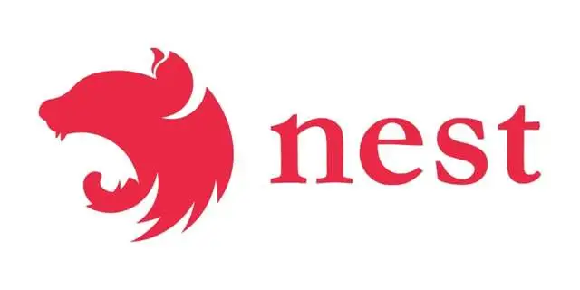

# Node后端框架

## Express.js

- Express.js 是一个灵活而简约的 Node.js 应用框架。这个插件并不是围绕着特定的组件构建的，因此它并不限制你使用什么技术。这就给了开发者尝试的自由。他们还可以获得闪电般的配置和纯 JavaScript 体验，这些特性使 Express.js 成为快速原型设计和敏捷开发市场的有力竞争者

- Express 是最受欢迎的、基于 MVC 的 Node.js 框架。它有许多与 Nodejs 同步的库和组件，以创建漂亮而强大的动态 Web 应用程序。Express 提供了所有 HTTP 实用方法、函数和中间件，可帮助开发人员编写健壮的 API。它适用于单页应用、多页应用、混合应用开发。

- 使用 Express.js 可以更快地开发 Web 应用程序，因为它具有几乎现成的 API 生成基础。由于其强大的路由、模板、安全功能和错误处理规定，可以将其用于任何企业级或基于浏览器的应用程序。


Express.js 的特点如下：

- 更好的内容协商，通过向 URL 提供 HTTP 标头来帮助客户端和服务器之间更好地通信，从而为用户/客户端获取准确的信息。

- 可以构建单页和多页 Web 应用程序；

- 遵循 MVC 架构，使应用程序的实现变得容易；

- 它支持 14+ 引擎模板和 HTTP 方法；

- 高性能，使用异步编程相互独立地执行多个操作；

- 超高的测试覆盖率有助于构建具有最大可测试性的应用程序；

- 能够编写强大的 API 并注入重载包以帮助扩展框架的功能；

Express.js 可以被用于：

- 混合应用

- 单页应用

- 多页应用

Express.js 主要特性：

- 开箱支持 NoSQL 数据库

- 更快的服务端开发

- 赋能开发者更快地构建 RESTful API

- Express 支持 MVC 架构，但需要开发者做一些额外工作

什么时候使用 Express.js：
- Express.js 是快速创建 Web 应用程序和服务的理想选择，因为它有现成的 API 生成工具。它是基于 JavaScript 的全栈方案 MEAN 的一部分。这意味着你可以使用 Express.js 来制作任何基于浏览器的企业级应用

谁在使用 Express.js：

- TheDoe

- FindHotel

- Omnipresent

- Okay

- SiHub

网站

- 中文网
  - https://www.expressjs.com.cn/starter/installing.html

- 官网
  - https://expressjs.com/

- github
  - https://github.com/expressjs/express
  - 

## koa.js

- Koa.js 是一个开源的 Node web 框架，由 Express.js 原班人马创建。通过 Koa，他们的目标是为 Web 应用和 API 创建一个更小、更有价值、更强大的平台。它提供了多种高效的方法，以让构建服务的过程更快速。

- Koa.js 被认为是对 Express 框架的扩展，它由 Express 团队设计和开发的基于 MVC 的框架。创建 Koa 的主要目的是提供一个比 Express 更轻量级并且能够更高效地开发 Web 应用程序和 API 的框架。

- Koa 与 Express 非常相似，在编写代码时，仍然可以享受 Express 的灵活性和更多的自由度和更少的复杂性。这最大限度地减少了整个应用程序堆栈中的错误范围。当性能是 Web 应用程序的关键需求时，Koa 可能是最好的选择之一。特别是对于大型项目，该框架可以与大型且经验丰富的开发团队一起构建广泛的应用程序。在某些情况下，Koa 已被证明是比 Express 更快的框架。

- Koa.js 的特点如下：

  - 它使用上下文对象，可以轻松地处理请求和响应对象。

  - 包括许多新的和独有的功能；

  - 通过 async/await 关键字使代码保持干净；

  - 具有内置的错误回调功能，可防止网站或web应用程序崩溃

- Koa.js 可以被用于：

  - 混合系统

  - 前台系统

  - 后台系统

- Koa.js 主要特性：

  - 使用 context 对象，该对象同时拥有请求和响应对象。

  - 代表现代和未来

  - 与所有 Node.js 框架相比，体积更小。

  - 有一个内置的错误捕捉器，防止网站崩溃。

- 什么时候使用 Koa.js：
  - Koa.js 最适合用于创建服务器、路由、处理响应和处理错误。

- 谁在使用 Koa.js：

  - Bulb

  - Paralect

  - LetzChange

  - BrainHub

- 网站

  - 中文网
    - https://www.koajs.com.cn/

  - 官网
    - https://koajs.com/

  - github
    - https://github.com/koajs/koa

## egg.js

-  Egg.js 是阿里开源的 node.js 框架，国内最热门的 node.js 框架之一，不同于 Exporess、Koa 等基础框架，Egg.js 在应用级的提炼封装，使其更贴近业务场景，更快上手。

- Egg.js 为企业级框架和应用而生，希望由 Egg.js 孕育出更多上层框架，帮助开发团队和开发人员降低开发和维护成本。它继承了Koajs的高性能优点，同时又加入了一些约束与开发规范，来规避Koajs框架本身的开发自由度太高的问题。Egg 提供了一个更加强大的插件机制，让这些独立领域的功能模块可以更加容易编写。

- Egg.js 的特点如下：

  - 渐进式开发。

  - 提供基于 Egg 定制上层框架的能力；

  - 高度可扩展的插件机制；

  - 内置多进程管理；

  - 基于 Koa 开发，性能优异；

  - 框架稳定，测试覆盖率高；

- 网站

  - 官网
    - https://eggjs.org/zh-cn/

  - github
    - https://github.com/eggjs/egg

## Nest.js

- Nest.js 是一个服务器端应用框架，它是为了解放开发者的生产力，让他们的生活变得更轻松而打造的。开发者通常为了更好地组织和管理代码而使用这个 Node.js 框架。

- Nest (NestJS) 是一个用于构建高效、可扩展的 Node.js 服务器端应用程序的开发框架。它利用 JavaScript 的渐进增强的能力，使用并完全支持 TypeScript （仍然允许开发者使用纯 JavaScript 进行开发），并结合了 OOP （面向对象编程）、FP （函数式编程）和 FRP （函数响应式编程）。

- Nest在常见的 Node.js 框架之上提高了一个抽象级别，但仍然向开发者直接暴露了底层框架的 API。这使得开发者可以自由地使用适用于底层平台的无数的第三方模块。可以将此框架用于编写更简洁且可重用的应用程序代码，编写可扩展、可测试的应用程序，编写具有更高级别结构的代码，例如过滤器、管道、拦截器等。

- Nest.js 的特点如下：

  - 其简单易懂的命令行界面可帮助开发人员将其与不同工具无缝集成。

  - 使用 TypeScript 作为其原生编程语言；

  - 利用了许多编程范式，例如 FP、OOP 和 FRP，使其更具可扩展性；

  - 提供了一种模块化方法，其中库被安排在适当的模块中；

  - 使用了一些 Express 功能来简化开发过程；

- Nest.js 可以被用于：

  - 编写更清晰和可重用的代码。

  - 编写具有更高层次结构的代码，如拦截器、过滤器、管道等；

  - 编写可扩展、可测试和松散型应用程序。

- Nest.js 主要特性

  - 易于扩展：可与其他库一起使用。

  - 允许开发人员完全使用纯 JavaScript 进行编码。

  - 结合了函数式编程、面向对象编程和响应式编程的特点。

  - 公开框架 API，帮助开发者使用各平台上的各种第三方模块。

  - 它有一个详细且维护良好的文档。

- 什么时候使用 Nest.js：
  - Nest.js 主要用于编写具有可扩展、可测试和松散耦合特点的应用。它将 Node.js 的扩展潜力提高到了一个全新的水平。它提供了结构和灵活性的适当平衡，可以高效地管理你的大型项目的代码，并且仍然有结构感可循。

- 谁在使用 Nest.js：

  - Roche

  - Adidas

  - Decathlon

  - Capgemini

- 网站

  - 中文网
    - https://docs.nestjs.cn/

  - 官网
    - https://nestjs.com/

  - github
    - https://github.com/nestjs/nest

## fastify

- Fastify 是一个快速并且低开销的 web 框架，专为 Node.js 平台量身打造。Fastify 的设计灵感来自 Hapi 和 Express，致力于以最少的开销和强大的插件结构提供最佳的开发体验。据我们所知，它是这个领域里速度最快的 web 框架之一。

- Fastify 的特点如下：

  - 支持 TypeScript：  维护一个 TypeScript 类型声明文件，以便支持不断成长的 TypeScript 社区。

  - 高性能：  Fastify 是这一领域中最快的 web 框架之一，另外，取决于代码的复杂性，Fastify 最多可以处理每秒 3 万次的请求；

  - 可扩展：  Fastify 通过其提供的钩子（hook）、插件和装饰器（decorator）提供完整的可扩展性；

  - 基于 Schema：  建议使用 JSON Schema 来做路由（route）验证及输出内容的序列化，Fastify 在内部将 schema 编译为高效的函数并执行；

  - 日志：  日志是非常重要且代价高昂的。使用最好的日志记录程序来尽量消除这一成本，这就是 Pino；

  - 对开发人员友好：  框架的使用很友好，帮助开发人员处理日常工作，并且不牺牲性能和安全性；

- 网站

  - 中文网

    - https://www.fastify.cn/

    - https://github.com/fastify/docs-chinese

  - 官网
    - https://www.fastify.io/

  - github
    - https://github.com/fastify/fastify

## Hapi.js

- Hapi.js 是众多开发者信赖的最简单、安全、可靠的框架之一。你可以使用 Hapi.js 来创建可扩展和健壮的应用程序，它具有最小的开销和开箱即用的功能。它是开发 JSON API 的顶级[Node.js](https://link.juejin.cn/?target=https%3A%2F%2Faglowiditsolutions.com%2Fblog%2Fhidden-cost-of-app-development%2F)框架。

- Hapi.js 可以被用于：

  - 网站

  - HTTP 代理应用

  - 应用程序接口服务

- Hapi.js 主要特性：

  - 输入验证

  - 日志

  - 错误处理

  - 代码可重用性

  - 缓存

  - 没有外部依赖

  - 基于配置的功能

  - 集成框架：在 Node 框架中提供全面的认证和授权 API 支持。

- 什么时候使用 Hapi.js：
  - Hapi.js 是开发安全、实时、可扩展和社交媒体应用的理想选择。大多数移动应用开发者都喜欢用 Hapi.js 来创建代理和 API 服务器。

- 谁在使用 Hapi.js：

  - Commercetools

  - Main Stack

  - Beam

  - Taggun

  - Artifakt

- 网址
  - github相关库
    - [hapi.js (github.com)](https://github.com/hapijs)

## Socket.io

- [Socket.io](http://Socket.io) 是用来在客户端和服务器端之间创建实时双向通信的框架。要做到这一点，客户端需要在浏览器中安装 [Socket.io](http://Socket.io)，服务器也要集成 [Socket.io](http://Socket.io) 包。这使得数据可以在数百万种形式中共享。然而，最受欢迎的方法仍然是 JSON。

- Socket.io 用于构建实时应用程序并在 Web 客户端和服务器之间建立双向通信。使用此库框架，可以开发具有 websocket 开发要求的应用程序。例如，聊天应用程序会持续运行以获取实时更新，并刷新后台进程以获取更新或消息。它还以更少的代码行提供实时分析。

- Socket.io 适合开发实时应用程序，如聊天室应用程序、视频会议应用程序、多人游戏等，这些应用程序需要服务器推送数据而无需客户端请求。

- Socket.io 的特点如下：

  - 使您能够开发即时消息传递和聊天应用程序，而无需处理复杂的编码。

  - 它支持自动重新连接；

  - 无缝地向 Web 应用程序添加实时功能；

  - 将消息编码为命名 JSON 或二进制事件；

  - 它确保无与伦比的编码速度和可靠性；

- Socket.io 由以下两个部分组成：

  - JavaScript 服务：Node.js

  - JavaScript 客户端库：Node.js

  - 注意： Socket.io 还兼容许多其他语言，如 Java、C+、Swift、Dart、.Net 和 Python。

- Socket.io 可以被用于：

  - 内部

  - 各种命名空间

  - 广播

  - 事件处理

  - 错误处理

  - 日志和调试

  - 聊天应用

- Socket.io 主要特性：

  - 即时通讯和聊天

  - 将信息编码为命名的 JSON 或二进制事件。

  - 在应用程序中添加“实时”能力。

  - 支持自动重新连接

  - 出色的速度和可靠性

- 什么时候使用 Socket.io：
  - [Socket.io](http://Socket.io) 是最好的基于事件的实时双向通信工具之一。任何想要在应用中添加实时分析功能的人都应该使用它。[Socket.io](http://Socket.io) 对于实时游戏应用也很有用。在实时游戏中使用基本的 HTTP 或 HTTPS 协议是不可行的，因为这些文件很大，建立通信需要时间。在这里，我们使用体积更小的 socket 包，几乎是实时地完成工作，以获得更流畅和更好的体验

- 谁在使用 Socket.io：

  - Plaid

  - Alibaba Travels

  - Patreon

  - Trello

  - Justmop

- 网址

  - github
    - https://github.com/socketio/socket.io

  - 官网文档
    - https://socket.io/

## Meteor.js

- Meteor.js 是一个开源的全栈 JavaScript 平台，JavaScript 根据意图不同运行在不同的地方。JavaScript 运行在 Web 浏览器内部；然后 JavaScript 运行在 Node.js 容器内的 Meteor 服务器上，支持 HTML 片段、静态资源和 CSS 规则

- Meteor.js 是一个高度简单且用户友好的全栈 Node.js 框架，高度兼容 iOS、Android 或桌面。通过 Meteor.js 开发应用程序非常简单易用，同时具备服务大型项目的能力。它可以与其他技术无缝集成，例如 React、Vue、Angular 和 MongoDB。此外，Meteor.js 在后端开发方面更接近 Node.js，开发人员可以更轻松地编写完整的网站，而无需使用多种编程语言。

- Meteor.js 具有快速原型设计和生成跨平台（Android、iOS、Web）代码的能力。它也是最直接的学习框架之一，因为它不遵循任何严格的结构规则。因此，任何希望以最少的学习曲线为多个平台创建应用程序的开发人员都可以选择使用 Meteor.js。

- 用于在Javascript中无缝构建和部署Web，移动和桌面应用程序

- Meteor.js 的特点如下：

  - 允许开发人员为任何平台（iOS、Android 和 Web）构建应用程序；

  - 它可以很容易地与 NoSQL 数据库集成，包括 MongoDB；

  - 轻量级且高度灵活的 Web 应用程序开发；

  - 可与 Angular、React 和 Vue 等前 3 大前端 Web 框架集成；

  - 拥有一个快速发展的社区，是全栈开发人员的理想选择；

  - 包含一组丰富的库，可帮助开发人员构建动态 Web 应用程序。

- Meteor.js 可以被用于：

  - web 应用程序全流程

  - 移动应用程序全流程

  - 桌面应用程序

- Meteor.js 主要特性：

  - 纯 JavaScript

  - 干净、稳健的数据同步

  - 互操作性

  - 智能套件

  - 代码热更新

- 什么时候使用 Meteor.js：
  - Meteor.js 具有快速原型设计的能力，并能生成跨平台（Android、iOS、Web）的代码。它也是最直接的学习框架之一，因为它不遵循任何严格的结构规则。因此，Meteor.js 应该被任何希望以最少的学习曲线为多个平台创建应用程序的初级或中级开发人员使用。

- 谁在使用 Meteor.js：

  - NordStorm

  - Accenture

  - NetApp

  - Rocket Chat

  - Esri

- 网址

  - github
    - https://github.com/meteor/meteor

  - 官网

    - [meteor.com](https://meteor.com/)

    - https://docs.meteor.com/

  - 中文网

    - https://www.wenjiangs.com/doc/kpnfbfj3

    - https://wizardforcel.gitbooks.io/meteor-doc/content/13.html

    - http://doc.yonyoucloud.com/doc/wiki/project/discover-meteor/overwise.html

    - https://www.w3xue.com/jsjq/meteor/

## Adonis.js

- Adonis.js 是一个 Node.js 的 MVC 框架，可以运行在所有的操作系统上。它为编写服务器端 Web 应用程序提供了一个稳定的生态系统，以让开发者专注于业务需求，如最终确定选择或排除哪个包。对于想要换个口味，正在尝试 Node.js 框架的 Laravel 开发者来说，它是理想的选择。Adonis.js为 Node.js 提供了与Laravel自然具有的相同的功能和能力

- Adonis.js 可以被用于：

  - 应用程序接口服务

  - 构建 web 应用

- Adonis.js 主要特性：

  - 可扩展的应用分层

  - 强大的 ORM，帮助进行安全的 SQL 查询。

  - API 和基于会话的认证系统

  - 验证和给每一个用户的输入做卫生处理。

  - 高度强调安全问题

- 什么时候使用 Adonis.js：
  - 如果你是一个正在寻找 MVC 工具的 [Node.js](https://link.juejin.cn?target=https%3A%2F%2Faglowiditsolutions.com%2Fblog%2Fhidden-cost-of-app-development%2F) 开发者，Adonis.js 是你的首选 Node.js 框架。然而，如果你是一个 Laravel 开发者或任何其他移动应用框架开发者，你仍然可以给 Adonis.js 一个机会，甚至从 PHP 迁移到 [Node.js](https://link.juejin.cn?target=https%3A%2F%2Faglowiditsolutions.com%2Fblog%2Fhidden-cost-of-app-development%2F) 也可以尝试一下 Adonis.js。

- 谁在使用 Adonis.js：

  - FindUp

  - Dotgroup

  - DORMshed

  - Nina

  - Zelo

- 网址

  - 官网
    - [AdonisJS - A fully featured web framework for Node.js](https://adonisjs.com/)

  - github
    - https://github.com/adonisjs/core

## Sails.js

- Sails.js 是又一个实时 [Node.js](https://link.juejin.cn?target=https%3A%2F%2Faglowiditsolutions.com%2Fblog%2Fhidden-cost-of-app-development%2F) MVC 框架。它基于 Express 构建，其 MVC 架构与 Ruby on Rails 相似。它与 Ruby on Rails 的不同之处在于，它提供了对更现代的、以数据为中心的 API 和 Web 应用开发风格的支持

- Sails.js 是一个Web 框架，可以轻松构建自定义的企业级 Node.js 应用程序。它的设计类似于 Ruby on Rails 等框架的 MVC 架构，但支持更现代、面向数据的 Web 应用程序和 API 开发风格。它特别适合构建聊天等实时功能。

- Sails 是一个比 Express 更快的轻量级 NodeJS 框架。它与各种流行的后端和前端工具的集成使其成为最好的 Nodejs 框架之一。它提供了 ORM，允许它与任何数据库系统集成，例如 MySQL、MongoDB、PostgreSQL、Redis等。

- Sails.js 的特点如下：

  - 可重用的安全策略。

  - 100% 使用 JavaScript 编写，这使得它易于学习；

  - 支持自动生成 REST API；

  - 可以轻松地与 WebSockets 集成；

  - 其 ORM（对象关系映射）功能可帮助开发人员将 Web 框架与任何数据库管理系统集成；

  - 可以与任何前端技术集成；

  - 可以处理任何类型的 HTTP 请求；

- Sails.js 可以被用于：

  - 构建处理 HTTP 请求的后端应用

  - 构建企业级 [Node.js](https://link.juejin.cn?target=https%3A%2F%2Faglowiditsolutions.com%2Fblog%2Fhidden-cost-of-app-development%2F) 应用

  - 构建前端应用

- Sails.js 主要特性：

  - 它还具有实时功能支持

  - 支持自动生成 REST APIs

  - 具有简单的 WebSocket 集成

  - 兼容任何流行的前端框架：Angular、Android、React、iOS、Windows 或任何自定义硬件。

- 什么时候使用 Sails.js：
  - 任何想要一个模拟 MVC 模式的 [Node.js](https://link.juejin.cn?target=https%3A%2F%2Faglowiditsolutions.com%2Fblog%2Fhidden-cost-of-app-development%2F) 框架（如 Laravel 和 Ruby on Rails）、想要实现现代应用架构，并构建以数据为中心的 API 和实时应用的开发者都应该在他们的下一个项目中使用 Sails.js。

- 谁在使用 Sails.js：

  - People Grove

  - Tutor Platform

  - Redox Engine

  - Brainhub

  - Created Informed

- 网址

  - 官网
    - https://sailsjs.com/

  - github
    - https://github.com/balderdashy/sails

## Next.js

- 实际上，Next.js 是一个全栈框架，它提供了生产环境所需的所有功能以及最佳的开发体验：包括静态及服务器端融合渲染、 支持 TypeScript、智能化打包、 路由预取 构建脚本、打包命令、开发工具、路由、状态管理、网络请求、SASS/LESS、服务端渲染 等功能 无需任何配置。

- Next.js 是一个用于生产环境的 React 应用框架，使用它可以快速上手开发 React 应用，而不需要花很多时间和精力去折腾各种开发工具。所谓的用于生产环境，是指功能和稳定性足够，有大量的实际应用案例。常用于 React 服务端渲染应用。

- Next.js 则是基于 React 的一款应用框架，基于 Next.js 你可以更便捷地上手开发 React 应用。

- Next.js 的特点如下：

  - 增量静态生成：  在构建之后以增量的方式添加并更新静态预渲染的页面。

  - 支持 TypeScript：  自动配置并编译 TypeScript；

  - API 路由：  创建 API 端点（可选）以提供后端功能；

  - 内置支持 CSS：  使用 CSS 模块创建组件级的样式。内置对 Sass 的支持；

  - 代码拆分和打包：  采用由 Google Chrome 小组创建的、并经过优化的打包和拆分算法；

  - 零配置：  自动编译并打包。从一开始就为生产环境而优化；

  - 混合模式：  SSG 和 SSR：在一个项目中同时支持构建时预渲染页面（SSG）和请求时渲染页面（SSR）；

- 网址

  - Github
    - https://github.com/vercel/next.js

  - 官网
    - [nextjs.org](https://nextjs.org/)

## Nuxt.js

- Nuxt.js 是一个基于 Vue.js 的轻量级应用框架，可用来创建服务端渲染 (SSR) 应用，也可充当静态站点引擎生成静态站点应用，具有优雅的代码结构分层和热加载等特性。Nuxt 作为一个构建健壮应用程序的全栈框架，旨在显着改善全栈 Vue 开发的体验。

- Nuxt.js 的特点如下：

  - 支持各种样式预处理器：SASS、LESS、 Stylus等。

  - 自动代码分层；

  - 服务端渲染；

  - 强大的路由功能，支持异步数据；

  - 静态文件服务；

  - ES6/ES7 语法支持；

  - 打包和压缩 JS 和 CSS；

  - HTML头部标签管理；

  - 本地开发支持热加载；

  - 集成ESLint；

  - 支持HTTP/2推送；

- 网址

  - github
    - https://github.com/nuxt/nuxt.js

  - 官网
    - [nuxtjs.org](https://nuxtjs.org/)

## pomelo

网易开源的游戏后端框架
- 太久不更新了

网站

- 官网
  - [pomelo.netease.com](http://pomelo.netease.com/)

- github
  - https://github.com/NetEase/pomelo

## TSRPC：专为 TypeScript 设计的 RPC 框架，经千万级用户验证。

GitHub：[k8w/tsrpc：一个 TypeScript RPC 框架，具有运行时类型检查和序列化功能，同时支持 HTTP 和 WebSocket。非常适合网站/APP/游戏，对于全栈TypeScript开发者来说绝对舒适。 (github.com)](https://github.com/k8w/tsrpc)

官网文档：[介绍 | TSRPC - 专为 TypeScript 设计的全栈 RPC 框架](https://tsrpc.cn/docs/introduction.html)


# 待定

## 一、Express.js——极简主义与强大功能的完美结合

在Node.js的众多框架中，Express.js无疑是最闪耀的明星。它是开源的，免费提供，无论是编程新手还是资深开发者都对它青睐有加。Express.js是构建Web应用和时髦RESTful API的完美选择。

**Express.js秀场时间**

1、高效路由管理：像大佬一样处理HTTP请求！

Express.js让HTTP请求处理变得轻而易举。就像为你的代码导航，高效地将请求指向特定任务。️ 来看一个简单示例：

```
// app.js
const express = require('express');
const app = express();
const port = 3000;

// 首页路由
app.get('/', (req, res) => {
  res.send('欢迎来到首页！');
});

// 用户个人资料页面路由
app.get('/user/:id', (req, res) => {
  const userId = req.params.id;
  res.send(`用户个人资料页 - ID: ${userId}`);
});
```

2、中间件支持 ‍

Express.js支持使用中间件处理HTTP请求。来看看如何简单创建一个记录HTTP请求详情的中间件：

```
const express = require('express');
const app = express();
const port = 3000;

app.use((req, res, next) => {
  console.log(`[${new Date().toLocaleString()}] ${req.method} ${req.url}`);
  next();
});
```

3、轻松的数据库集成：它是数据库的天作之合。

Express.js对所有数据库都表示欢迎！这得益于Express.js的模块化和适应性，让开发者自由选择喜爱的数据库系统。通过npm包丰富的生态系统，开发者可以轻松地将Express.js与各种数据库连接起来，确保开发旅程高效顺畅。

4、对初学者友好：

Express.js以其直观和极简的设计获得了最佳初学者友好框架的称号，尤其是对于熟悉JavaScript和Node.js的开发者来说，上手Express.js就像散步一样轻松。

## 二、NestJS：一种新鲜且结构化的开发方法



NestJS以其为构建可扩展和高效的服务器端应用程序而设计的框架而脱颖而出。它采用了渐进式JavaScript，并提供了使用TypeScript编码的灵活性。尽管NestJS完全支持TypeScript，它还兼容纯JavaScript，并采用了面向对象编程、函数式编程和响应式函数编程。

1、杰出的模块化

NestJS擅长将代码分解为可管理的模块，提高了可维护性。下面是一个模块示例：

```
import { Module } from '@nestjs/common';

@Module({
 imports: [CacheModule],
 controllers: [PaymentController],
 providers: [PaymentService],
})
export class PaymentModule {}
```

这个支付模块可以无缝导出到其他模块中。在这个例子中，通用的缓存模块被导出在支付模块内。NestJS的模块结构简化了维护工作，使其成为一个突出的特点。

2、可扩展性

NestJS通过将应用程序分解为可管理的模块，将可扩展性提升到一个新的水平。它支持灵活的组件替换，通过微服务无缝处理高流量，并在异步操作中表现出色。这确保了在增加工作负载时能够高效处理，同时保持最高的可靠性和性能。

3、依赖注入

在NestJS中，依赖注入涉及将外部依赖添加到类中，而不是在类本身内部创建它。让我们深入一个例子：

```
import { HttpException, Injectable, NotFoundException } from '@nestjs/common';

@Injectable()
export class PaymentService {
  constructor() {}

  getReceipt() {
    return 'Payment Receipt';
  }
}
```

在这个片段中，PaymentService被创建并标记为@Injectable()，使其可注入。现在，让我们看看如何使用这个服务：

```
import { Controller, Get, Post, Body } from '@nestjs/common';
import { PaymentService } from './payment.service';

@Controller('payment')
export class PaymentController {
  constructor(private readonly paymentService: PaymentService) {}

  @Get()
  getPaymentReceipt() {
    return this.paymentService.getReceipt();
  }
}
```

这个示例展示了PaymentService被注入到PaymentController中，允许无缝访问其功能。

4、TypeScript的保护 ️

NestJS利用TypeScript提供强大的类型安全性，充当开发过程中潜在错误的警惕守护者。这不仅提高了代码的整体可靠性，也有助于其可维护性。让我们探索一个例子：

```
export class PaymentDto {
  @IsNotEmpty()
  @IsEnum(SERVICE_PROVIDER_SLUG, {
    message: `Invalid serviceProvider. Valid options are: ${Object.values(SERVICE_PROVIDER_SLUG).join(', ')}`,
  })
  serviceProvider: string;

  @IsNotEmpty()
  @IsNumber()
  value: number;

  @IsNotEmpty()
  @IsString()
  validityPeriod: string;

  @IsNotEmpty()
  @IsArray()
  @ArrayNotEmpty()
  @ValidateNested()
  @Type(() => PaymentAttributesDto)
  paymentAttributes: PaymentAttributesDto[];
}
```

在这个例子中，我们创建了一个名为PaymentDto的数据传输对象(DTO)，装备了各种参数。注解，如@IsNumber()和@IsString()，充当守护者，确保每个参数都遵循指定的类型。例如，尝试将字符串值分配给"value"参数将触发错误，为你的应用程序添加了额外的保护层。

NestJS以其结构化和进阶的特性，为Node.js服务器端应用的开发提供了一种新鲜且高效的方法。无论你是构建小型项目还是大规模企业应用，NestJS都能提供强大的支持，让你的开发之旅更加顺利。

## 三、Koa.js——优雅轻巧的选择


Koa.js，由Express.js团队打造，作为一个紧凑且富有表达力的web框架而崭露头角。它选择了优雅的async函数来替代回调函数，使错误处理变得无缝。

**Koa.js的亮点特性**

1、上下文的力量 (ctx)

Koa.js引入了ctx（上下文）的概念，以捕获请求和响应的细节信息。这个上下文优雅地流经每一个中间件。看下面的示例：

```
const Koa = require('koa');
const app = new Koa();

app.use(async (ctx) => {
  const { method, url, request, response } = ctx;
  console.log('Method: ' + method + ' Request: ' + request);
});
app.listen(3000);
```

这里，ctx对象封装了HTTP方法、URL、请求和响应等重要信息，为开发者提供了一个关于正在进行的过程的全面视图。

2、中间件的组合

类似于Express.js，Koa.js采用中间件函数来处理HTTP请求和响应。看一个简单的中间件示例：

```
const Koa = require('koa');
const app = new Koa();

app.use(async (ctx, next) => {
  await next();
});

app.listen(3000);
```

在这个片段中，创建了一个基本的中间件，展示了Koa处理中间件的方式，这让人想起了它的前身Express.js。

3、对Async/Await的支持

Koa使用async/await语法编写异步代码，使其看起来更像是同步代码。下面的示例包括使用async/await关键字。

```
const Koa = require('koa');
const app = new Koa();

app.use(async (ctx) => {
  const data = await fetchData();
  ctx.body = `Data: ${data}`;
});

app.listen(3000);
```

4、错误处理

Koa.js支持多种错误处理方式。我们可以使用app.emit()或ctx.throw()来处理错误。下面的示例包括了提到的错误处理方法。

```
const koa = require('koa');
const app = new koa();

// 错误处理方法1
app.use(async (ctx, next) => {
  try {
    await Promise.reject('出了点问题');
  } catch (err) {
    ctx.status = err.status || 500;
    ctx.body = err.message;
    ctx.app.emit('error', err, ctx);
  }
});

// 错误处理方法2
app.use(async (ctx, next) => {
  ctx.throw(500, '错误');
});

app.on('error', (err, ctx) => {
  console.log(err);
});

app.listen(3000);
```

Koa.js以其简洁、优雅的特性和对现代JavaScript语法的全面支持，为构建快速且高效的web应用提供了一个理想的框架选择。它的设计哲学是提供足够的功能而又不臃肿，让开发者可以自由灵活地扩展。无论你是在构建API、web应用还是服务端渲染应用，Koa.js都是一个值得考虑的优雅方案。

## 四、Hapi.js——构建可扩展Web应用的强力工具


Hapi.js是一个开源框架，简称来自Http-API，作为开发可扩展Web应用的强大工具而矗立不倒。它擅长创建REST API，并在Walmart Labs经受了如黑色星期五这样的大型在线购物流量高峰的考验。

**Hapi.js的突出特性**

1、配置式设计

Hapi.js采用了配置驱动的设计，允许开发者通过配置对象轻松设置路由、定义设置和集成插件。看这个例子：

```
const Hapi = require('@hapi/hapi');

const server = Hapi.server({
  port: 3000,
  routes: {
    cors: true,
  },
});

server.route({
  method: 'GET',
  path: '/',
  handler: (request, h) => {
    return 'Hello, Hapi!';
  },
});

async function start() {
  await server.start();
  console.log(`Server running at ${server.info.uri}`);
}

start();
```

在这个代码片段中，配置的强大之处体现在服务器设置、路由定义和CORS支持的无缝配置上。

2、强大的插件系统

Hapi.js拥有一个强大的插件系统，使得集成变得轻而易举。看看这个例子：

```
const start = async function () {
    const server = Hapi.server();

    await server.register([{
        plugin: require('plugin1'),
        options: {}
    }, {
        plugin: require('plugin2'),
        options: {}
    }]);
};
```

这段代码演示了两个插件的轻松集成，并且可以通过options键向每个插件传递选项。

3、认证和授权

Hapi.js内置了对多种认证策略的支持，并简化了访问控制策略的定义方法。看这个认证的示例：

```
server.route({
  method: 'GET',
  path: '/private-data',
  handler: (request, h) => {
    // 只有经过认证的用户才能访问私人数据
    const user = request.auth.credentials;
    return `Welcome, ${user.username}!`;
  },
  options: {
    auth: 'jwt', // 使用JWT认证策略
  },
});
```

在这种情况下，认证策略优雅地定义为'jwt'，确保了对私人数据的安全访问。

4、输入验证

Hapi.js非常重视输入验证。在路由的options对象中，开发者可以定义哪些输入需要验证。默认的validate对象包括对headers、params、query、payload、state的检查，并有一个失败操作策略。

Hapi.js凭借其配置式设计、强大的插件系统、内置的认证支持和严格的输入验证，为开发者提供了一个坚实的基础来构建可扩展、安全且高效的Web应用和服务。无论是构建企业级应用还是快速原型设计，Hapi.js都是一个值得考虑的强大选项。

## 五、Adonis.js——全栈MVC框架的魅力

Adonis.js在路由定义上表现出色，为应用程序提供了一种无缝且直观的方式来定义路由。它的路由系统旨在表达性强且功能强大，使开发者能够轻松定义和管理应用的各种终端。

Adonis.js 是 Node.js 的全功能 MVC 框架。它具有构建可扩展且可维护的应用程序的能力。 Adonis.js 遵循与 Laravel 类似的结构，并包含 ORM、身份验证和开箱即用的路由等功能。

**Adonis.js的亮点特性**

1、全栈MVC框架

Adonis.js遵循MVC（模型-视图-控制器）架构模式。采用MVC框架有助于组织代码，并使其更容易维护和扩展。

2、集成ORM（Lucid）进行数据库交互

Adonis.js集成了自己的对象关系映射（ORM）系统Lucid。Lucid通过提供表达式查询构建器并支持多种数据库系统，简化了数据库交互。

看看你如何使用Lucid与数据库进行交互的一个小窥视：

```
const Model = use('Model');

class User extends Model {
}

module.exports = User;
```

在这个例子中，使用Lucid定义了User模型，它成为读写数据库的强大工具。下面的路由展示了如何轻松地从数据库中获取所有用户：

```
const Route = use('Route');
const User = use('App/Models/User');

Route.get('users', async () => {
  return await User.all();
});
```

通过使用User.all()，Adonis.js简化了从数据库获取用户的过程。

3、认证系统

Adonis.js不仅仅是一个MVC框架；它还提供了一个强大的认证系统。凭借对用户认证和授权的内置支持，Adonis.js使得处理用户会话、密码哈希和访问控制变得轻而易举。

看看这个展示获取用户简单性的例子：

```
const Route = use('Route');
const User = use('App/Models/User');

Route.get('users', async () => {
  return await User.all();
}).middleware(['auth']);
```

在这种情况下，中间件（['auth']）确保只有经过认证的用户可以访问获取用户的路由。Adonis.js简化了认证过程，使其成为应用程序安全的一个不可或缺的部分。️

Adonis.js以其全面的特性集成，为构建现代Web应用和API提供了一个强大的平台。它的全栈MVC架构、直观的路由系统、强大的数据库交互能力以及完备的认证机制，使得开发高效、安全的应用成为可能。无论是开发者还是企业，Adonis.js都是构建高质量应用的理想选择。

## 结束

随着技术的不断进步，Node.js作为后端开发的热门选择，其生态系统也在不断壮大，涌现出了许多优秀的框架。今天，我们一起探索了五个在2024年值得关注的Node.js框架：Express.js、NestJS、Koa.js、Hapi.js以及Adonis.js。每一个框架都有其独特之处，从轻量级到全栈MVC，从简洁高效到功能丰富，总有一个能满足你的开发需求。

选择合适的框架可以大大提升你的开发效率，帮助你更快地构建出强大、可靠的Web应用和API。无论你是刚刚踏入Node.js世界的新手，还是在后端开发领域摸爬滚打多年的老手，相信这些框架都能给你带来新的启发和灵感。