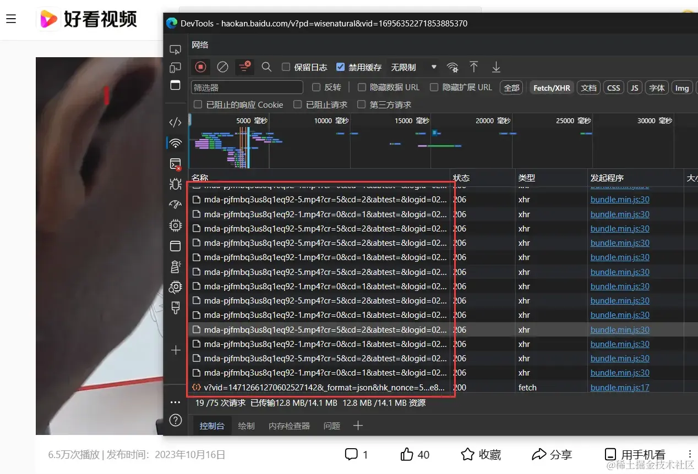
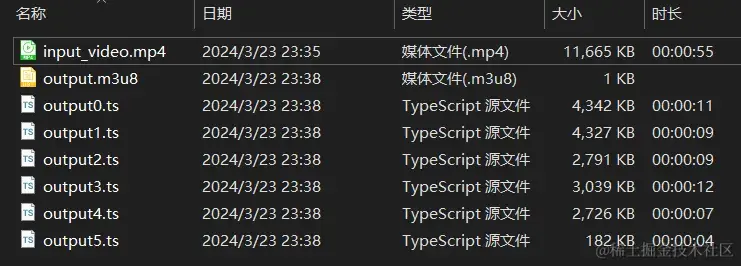
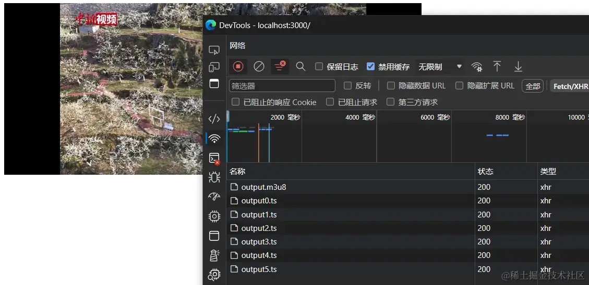

# Node+ffmpeg写一个视频服务器

Node.js 采用了事件驱动和非阻塞 I/O 模型，这使得它能够高效处理大量的 I/O 请求和并发连接，这在流媒体服务器中至关重要。同时，FFmpeg 作为一个功能强大的视频处理工具，为我们提供了丰富的视频处理功能。

结合 Node.js 强大的扩展能力，我们可以轻松地集成 FFmpeg，打造一个功能完备的视频流媒体服务器，满足各种流媒体应用的需求。

现在我们就从 0 开始，实现一个简单的视频服务器：实现上传视频和播放视频的功能。在学习的过程中逐步了解视频服务器是如何工作的。

在开始之前，你需要：

- 懂得 Node.js 的基本 API，如 fs 模块、process 模块等。
- 了解 Express.js 的用法和常见 API。
- 安装并了解 FFMPEG 的基本用途。

我们现在要实现一个流媒体服务器。现在市面上的流媒体协议、格式有很多（RTP/RTCP/RTSP/RTMP/MMS/HLS 等），都有不同的应用场合。但是，目前的市面上绝大多数网站使用的是 HLS/M3U8 格式的流媒体，并且也得到了现代浏览器的支持。

所以，本文不去赘述这些流媒体协议，而是实现一个简单的 HLS/M3U8 格式的流媒体服务器。

**本文实现的流媒体服务器在技术上并不难。**

## MP4 视频切片

随便打开一些主流视频网站，和 Chrome Devtools 切换到网络（network）选项卡，然后播放视频，可以看出，浏览器一直在不断地从一个地址中下载小文件。这些小文件就是视频切片。

一般来说，在网页视频不会直接下载整个视频文件，因为一个视频文件通常上 GB，全部下载完就太大了，而采用“边下边播”的模式。所以是将视频切成大量的小片段，然后不断把这些片段传递到浏览器。然后浏览器再把穿好的片段依次播放。



对于 HLS/M3U8 类型的流媒体，视频播放地址，就是一个下载 m3u8 文件的地址。m3u8 文件是一个文本类型的列表，里面储存了视频切片的名称、地址和顺序。所以，浏览器在播放这类流媒体时

所以，我们就可以直接使用 ffmpeg 对视频进行切片。在命令行执行命令。

```bash
ffmpeg -i input_video.mp4 \
-c:v libx264 \
-c:a aac \
-hls_time 10 \
-hls_segment_type mpegts \
-hls_list_size 0 \
-f hls \
-max_muxing_queue_size 1024 \
output.m3u8
```

在这个命令中：

- `-i input_video.mp4` 指定了输入视频文件。
- `-c:v libx264 -c:a aac` 指定了视频和音频的编解码器。
- `-hls_time 10` 指定了每个 M3U8 片段的时长，单位为秒。在这里，每个片段的时长设置为 10 秒。
- `-hls_segment_type mpegts` 指定了 M3U8 片段的类型为 MPEG-TS。
- `-hls_list_size 0` 设置 M3U8 文件中包含的最大片段数。这里设置为 0 表示没有限制。
- `-f hls` 指定了输出格式为 HLS。
- `-max_muxing_queue_size 1024` 设置了最大复用队列大小，以确保输出不会超过指定大小。
- 最后输出的文件为`output.m3u8`

当然，对于 ffmpeg 切割命令还有更高级的用法，比如限制所有的切片大小不超过 `500kb` 等。



我们打开 m3u8 列表文件，显示如下，它标注了每个片段的顺序、时长等。

```bash
#EXTM3U
#EXT-X-VERSION:3
#EXT-X-TARGETDURATION:11
#EXT-X-MEDIA-SEQUENCE:0
#EXTINF:11.386378,
output0.ts
#EXTINF:11.011000,
output1.ts
#EXTINF:9.050711,
output2.ts
#EXTINF:8.591911,
output3.ts
#EXTINF:6.506933,
output4.ts
#EXT-X-ENDLIST
```

## 前端播放

当浏览器拿到 m3u8 文件后，会顺序遍历这个列表，然后依次顺序加载列表中的片段，即 output0.ts → output1.ts ... → output4.ts。由于是边加载边播放，所以加载完第一个片段后就立即开始播放第一个片段，然后同时加载第二个片段，以此类推。

接下来，我们在同目录下新建一个 html 文件，使用 `video.js` 来播放刚才分好的 m3u8 列表。

```html
<html>
  <head>
    <title>Play the video</title>
    <link href="https://vjs.zencdn.net/8.10.0/video-js.css" rel="stylesheet" />
  </head>
  <body>
    <video class="video-js" controls preload="auto" width="640" height="264">
      <source src="./output.m3u8" type="application/x-mpegURL" />
    </video>
    <script src="https://vjs.zencdn.net/8.10.0/video.min.js"></script>
  </body>
</html>
```



可以看到，浏览器成功依次加载并播放了这些列表里的片段。

至此，流媒体的切片、播放处理过程已经大致清楚。所以，我们就不难得到流媒体服务器的基本功能实现了。

## 设计 API

在开始之前，我们需要设计上传、播放的 API。

- 视频上传：`/upload`，POST 请求，接受一个 `multipart/form-data` 表单内的文件。
- 视频播放：`/play/{videoId}/video.m3u8`，GET 请求，返回一个 m3u8 类型的文本数据。其中 videoId 为每个视频的唯一标识符。

## 实现上传功能

现在我们给服务器实现视频上传功能。视频上传要经历三个阶段：接受上传文件 → 视频切片处理 → 视频持久化储存。上传完毕后，再向用户端返回一个视频播放地址，用来播放视频。

前端上传视频一般是表单文件。服务端接受到文件后，将文件切片并储存到公有区域，然后返回生成的 m3u8 文件地址。

首先初始化 node 项目，安装如下包，express 是 node.js 的服务器框架，multer 是为 express 开发的表单文件处理中间件，nanoid 可以为上传的资源给出唯一的标识符，fluent-ffmpeg 是其中一个为 node.js 设置的 ffmpeg 扩展，serve 可以让你在本地目录搭建服务器访问环境。

```bash
npm i multer express nanoid fluent-ffmpeg cors
npm i serve --save-dev
```

为 package.json 添加如下字段

```json
{
  "main": "main.js",
  "type": "module"
}
```

然后创建 main.js 文件，编写如下代码，我们创建一个服务器

```js
import express from "express";
import fs from "fs";
import multer from "multer";
import { nanoid } from "nanoid";
import ffmpeg from "fluent-ffmpeg";
import path from "path";
import cors from "cors";

// 创建一个服务器，监听 3300 端口
const server = express();
server.listen(3300);
console.log("Server started.");
server.use(cors()); // 为了方便调试，允许跨域
```

根据设计好的 API，添加一个上传视频的 POST 路由。

```js
/*
 *  定义一个处理上传表单文件的中间件
 *  它接收表单中 video 字段的单文件
 *  上传到临时目录 uploads-temp 目录中
 *  为了防止重名冲突，每个被上传的临时文件名都加上唯一前缀
 */
const copeUpload = multer({
  dest: "uploads-temp/",
  filename: function (req, file, cb) {
    const uniqueSuffix = nanoid();
    cb(null, file.fieldname + "-" + uniqueSuffix);
  },
}).single("video");

// 定义上传的 API 路由，并且使用上面的中间件
server.post("/upload", copeUpload, function (req, res, next) {
  const tempFilePath = path.resolve(req.file.path); // 视频上传后的临时文件位置
  const videoId = nanoid(); // 为视频资源创建唯一 ID
  const storageDirectory = path.resolve("storage", videoId);
  //为视频创建储存位置，所有视频切片储存在 ./storage/{videoId} 目录下
  fs.mkdirSync(storageDirectory);

  ffmpeg(tempFilePath)
    .videoCodec("libx264")
    .audioCodec("aac")
    .addOption("-hls_time", 10)
    .addOption("-hls_segment_type", "mpegts")
    .addOption("-hls_list_size", 0)
    .format("hls")
    .addOption("-max_muxing_queue_size", 1024)
    .output(`${storageDirectory}/video.m3u8`)
    .on("start", function () {
      console.log("开始为视频切片");
    })
    .on("end", function () {
      fs.rmSync(tempFilePath); // 删除上传的临时文件
      console.log("切片完成");
    })
    .on("error", function (err) {
      fs.rmSync(tempFilePath); // 删除上传的临时文件
      console.error("切片失败：", err);
    })
    .run();

  res.json(`http://localhost:3300/play/${videoId}/video.m3u8`); //返回播放地址
});
```

## 实现播放功能

接下来就是给服务器设置播放的 API。

在上传视频后，服务端会给用户端返回一个播放地址，就是 m3u8 文件的下载地址。所以这部分就非常简单。

当播放器请求 id 为 `abcde` 的视频地址 `play/abcde/video.m3u8` 时，由于 m3u8 中写明切片文件和 m3u8 文件在同一目录下，所以请求切片时的地址也是

```bash
play/abcde/output01.ts
play/abcde/output02.ts
play/abcde/output03.ts
......
```

所以服务器要做的实际上就是从 `storage` 目录中取出 `/play/${videoId}/*` 路由中请求的文件返回给客户端。

```js
server.get("/play/:videoId/:filename", (req, res) => {
  const videoId = req.params["videoId"]; // 从 URL 中获取视频 ID
  const storageDirectory = path.resolve("storage", videoId); // 视频切片和清单的储存位置
  if (!existsSync(storageDirectory)) {
    // 若目标视频记录不存在则返回 404
    res.status(404).send();
  }
  const filename = req.params["filename"]; //请求的文件
  const filepath = path.join(storageDirectory, filename);
  if (!existsSync(filepath)) {
    // 若目标文件不存在则返回 404
    res.status(404).send();
  }
  const data = fs.readFileSync(filepath); // 读取目标文件
  res.send(data);
});
```

## 功能测试

在以上过程中，我们的视频服务器仅仅在不到 100 行的代码就完成了。接下来就是为用户端写代码，来测试一下服务器的上传、播放功能。

要求上传视频后返回视频的播放地址，以及播放指定的视频地址。

在同目录下创建 index.html，

```html
<html>
  <head>
    <title>Video Server</title>
    <link href="https://vjs.zencdn.net/8.10.0/video-js.css" rel="stylesheet" />
  </head>
  <body>
    <div>
      <h2>上传视频文件</h2>
      <!-- 利用表单上传文件 -->
      <form id="uploadForm" method="POST" enctype="multipart/form-data">
        <input type="file" name="video" accept="video/*" />
        <button type="submit">上传</button>
      </form>
      <div id="response"></div>
      <script>
        // 获取表单元素
        const form = document.getElementById("uploadForm");
        // 监听表单提交事件
        form.addEventListener("submit", function (event) {
          event.preventDefault(); // 阻止默认提交行为
          // 创建 FormData 对象，用于将表单数据发送到服务器
          const formData = new FormData(form);
          // 发送表单数据到服务器
          fetch("http://localhost:3300/upload", {
            method: "POST",
            body: formData,
          })
            .then((response) => response.text()) // 将响应转换为文本格式
            .then((data) => {
              // 将服务器返回的文本数据显示在页面上
              document.getElementById("response").innerText = "上传成功，视频地址是：" + data;
            })
            .catch((error) => {
              console.error("请求错误:", error);
            });
        });
      </script>
    </div>

    <hr />

    <div>
      <h2>播放视频</h2>
      <!-- 输入m3u8地址 -->
      <label for="m3u8-url">请输入视频的m3u8地址：</label>
      <input type="text" id="m3u8-url" name="m3u8-url" placeholder="例如：https://example.com/video.m3u8" />
      <button onclick="playVideo()">播放</button>

      <!-- 视频播放器 -->
      <video id="my-video" class="video-js" controls preload="auto" width="640" height="360" data-setup="{}">
        <source src="" type="application/x-mpegURL" />
      </video>
      <script src="https://vjs.zencdn.net/8.10.0/video.min.js"></script>
      <script>
        function playVideo() {
          // 获取输入的m3u8地址
          var m3u8Url = document.getElementById("m3u8-url").value;
          // 设置视频源为输入的m3u8地址
          var videoPlayer = videojs("my-video");
          videoPlayer.src({
            src: m3u8Url,
            type: "application/x-mpegURL",
          });
          // 播放视频
          videoPlayer.play();
        }
      </script>
    </div>
  </body>
</html>
```

然后启动服务器

```bash
node main.js
```

服务器在 `http://localhost:3300` 启动。

然后启动用户界面

```bash
npx serve
```

在浏览器输入 `http://localhost:3000` 即可。

测试效果如下：


## 结束

我们在本文中实现了一个简单的流媒体服务器，并成功实现了视频上传和视频播放两种核心功能。

当然，本项目也只是一个 demo，正式用于生产环境中的视频服务器仅仅有这两种功能是远远不够的，还需要其他更强大的功能，比如视频资源管理、资源健康监视、网络波动监视、加密和安全等。这些不再赘述，有兴趣可以自主实现。

## 源码下载

本项目中的 [Github 源码仓库在这里](https://github.com/PrinOrange/simple-node-media-server)。使用 CC 1.0 开源协议。