# Strapi无头内容管理系统

Strapi 是一个开源的 **Headless CMS**（无头内容管理系统）。它允许开发者通过自定义的方式快速构建、管理和分发内容。Strapi 提供了一个强大的后端 API，支持 `RESTful` 和 `GraphQL` 两种方式，使得开发者可以方便地将内容分发到任何设备或服务，无论是网站、移动应用还是 IoT 设备。

Strapi 的主要特点包括：

- **灵活性和可扩展性**：通过自定义模型、API、插件等，Strapi 提供了极高的灵活性，可以满足各种业务需求。
- **易于使用的 API**：Strapi 提供了一个简洁、直观的 API，使得开发者可以轻松地与数据库进行交互。
- **内容管理界面**：Strapi 提供了一个易于使用的管理界面，使得用户可以轻松地创建、编辑和发布内容。
- **多语言支持**：Strapi 支持多种语言，包括中文、英语、法语、德语等。
- **可扩展性**：Strapi 具有高度的可扩展性，可以通过插件和自定义模块、插件来扩展其功能。
- **社区支持**：Strapi 拥有一个活跃的社区，提供了大量的文档、示例和插件，使得开发人员可以轻松地解决问题和扩展功能。

主要适用场景：

- **多平台内容分发（** 将内容分发到不同web、h5等不同平台 **）**
- **定制化 CMS 需求（** 通过插件等扩展性高度定制 **）**
- **快速开发api（API**管理界面能够大大加快开发速度，尤其是MVP（最小可行产品）阶段）

## 相关地址

GitHub：https://github.com/strapi/strapi

官网：https://strapi.io/

## strapi实战

### 安装Strapi

（安装完后，自动执行了strapi start，其mysql、语言切换、权限配置等都内置到了`@strapi`包中）

```lua
yarn create strapi-app my-strapi --quickstart
```

浏览器访问：http://localhost:1337/admin/

访问的界面：


strapi原本就支持国际化，我们来切换成中文再继续操作。

### 语言切换

1.设置国际化

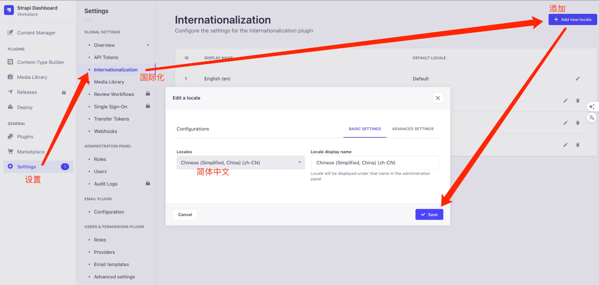

2.个人设置中配置语言即可：

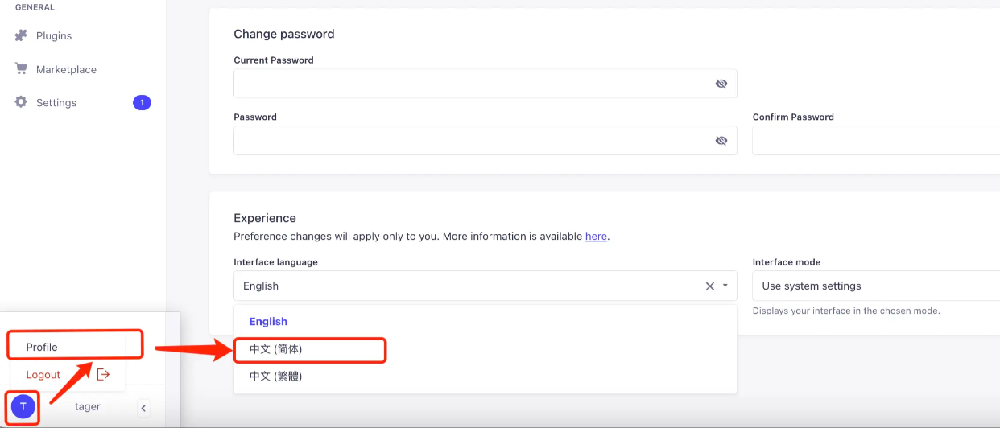

如果看不到"中文(简体)"选项，就在项目根目录下执行build并重启：`npm run build && npm start`，再刷新页面应该就能看到了。注意`npm start`默认是生产环境的启动(只能使用表，无法创建表)、开发环境启动用`"npm run develop"`

### strapi的基础使用

在第一步完成的时候，其实数据库就已经搭建好了，我们只管建表、增加curd的接口即可

#### 1. 建表

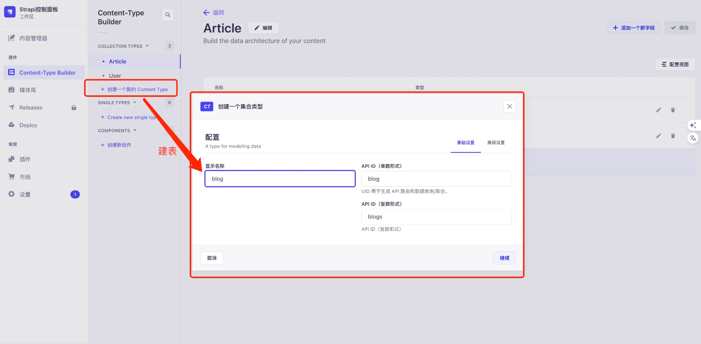

设置字段、可以选择需要的类型：

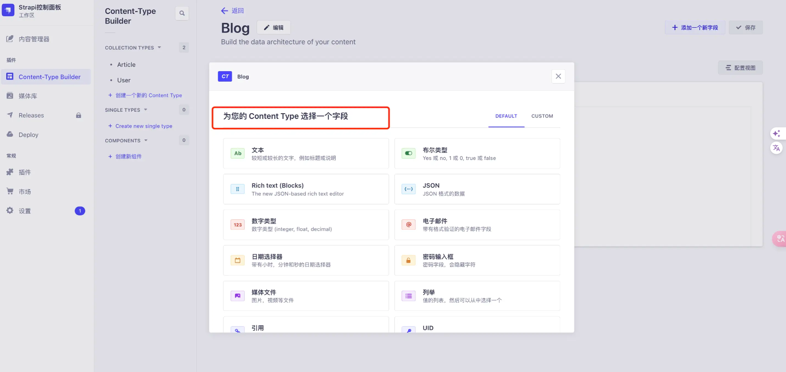

在保存左边的按钮可以继续添加字段

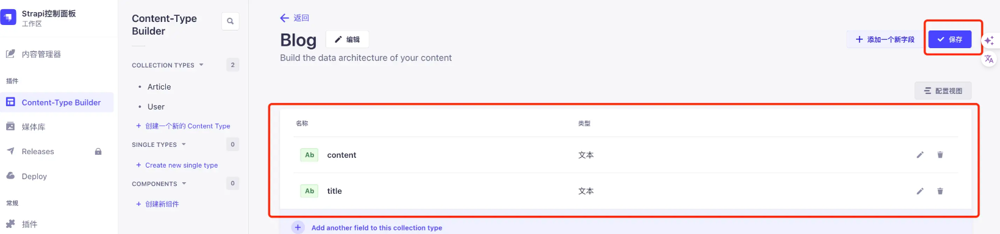

blog字段、建模完成后，进入内容管理器给表插入数据

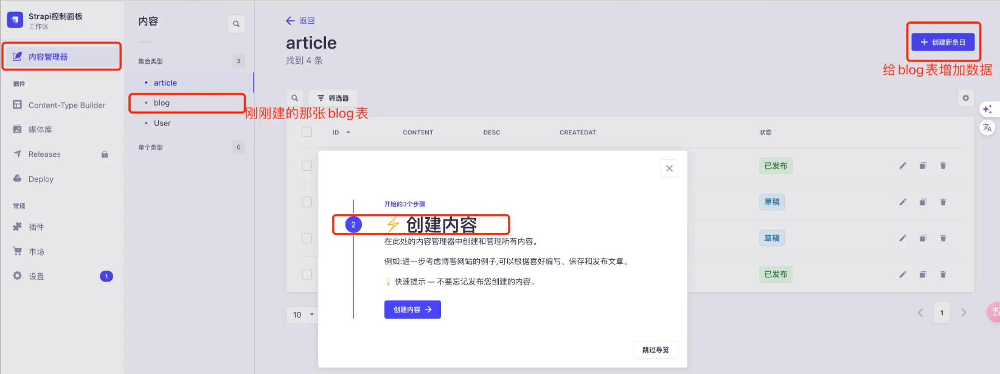

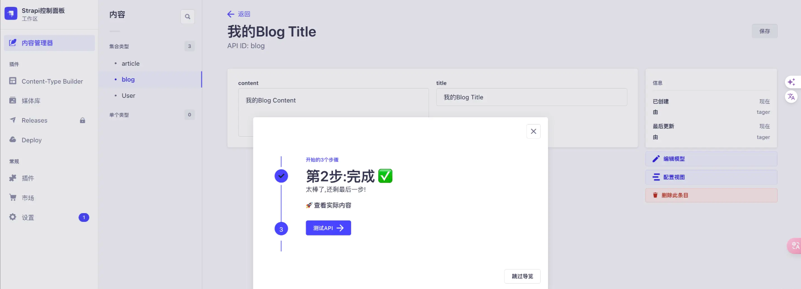

#### 2. curd

上面只是可视化的查看、插入数据，怎样才能变成api来进行curd了。

- 设置API令牌，跟进提示操作

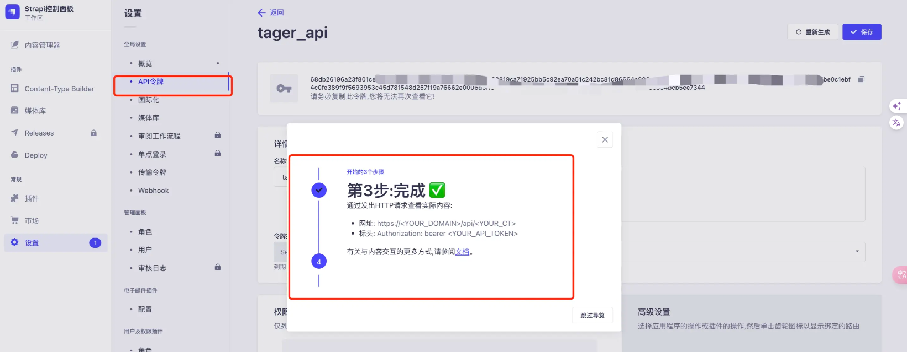

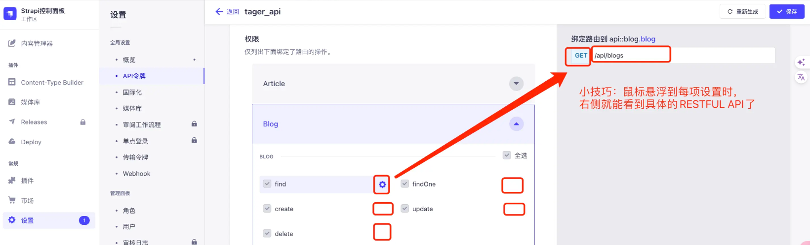

- 权限说明

find GET请求 /api/blogs 查找所有数据

findone GET请求 /api/blogs/:id 查找单条数据

create POST请求 /api/blogs 创建数据

update PUT请求 /api/blogs/:id 更新数据

delete DELETE请求 /api/blogs/:id 删除数据

- postman调试

先给blog公共权限，以便调试：

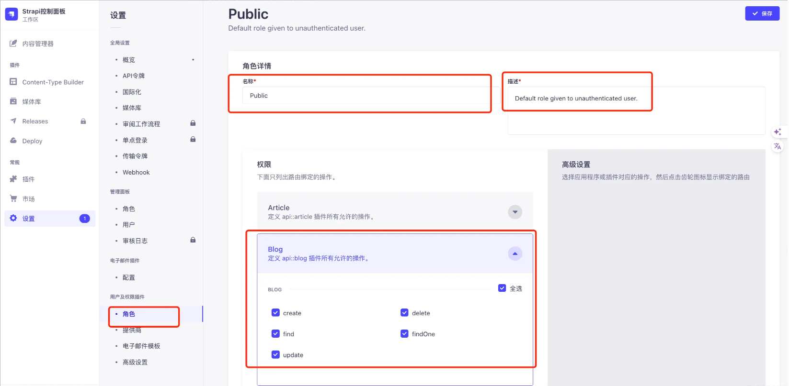

1.查找所有数据（find）

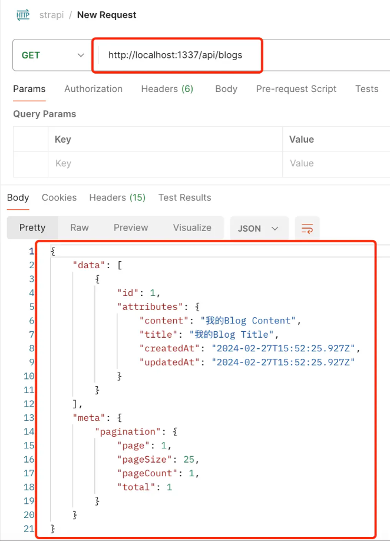

2.查找单条数据（findone）

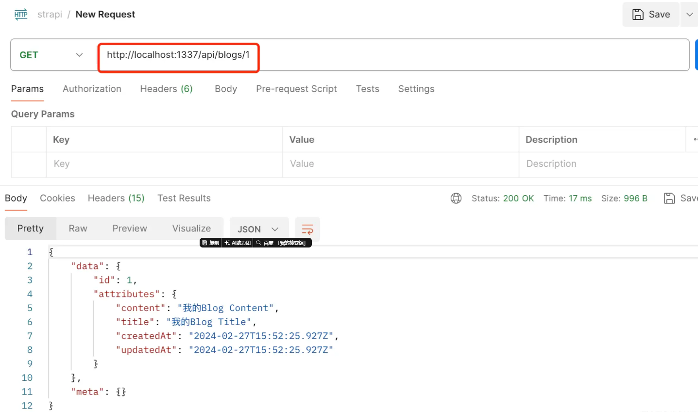

3.更新修改数据（update）

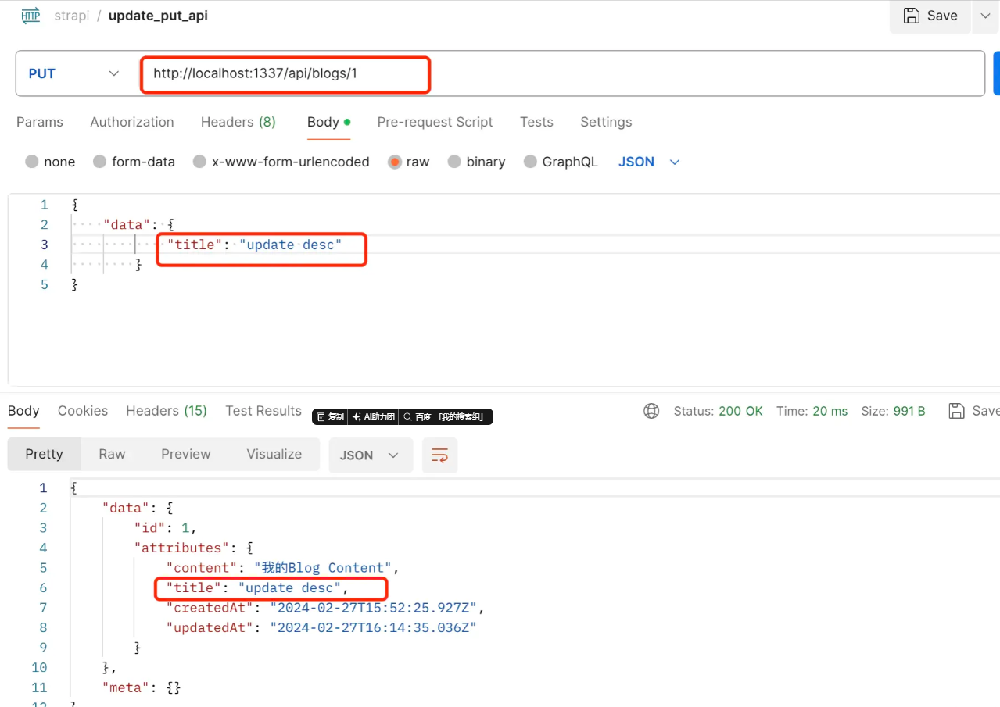

4.删除数据（delete），返回被删除的数据

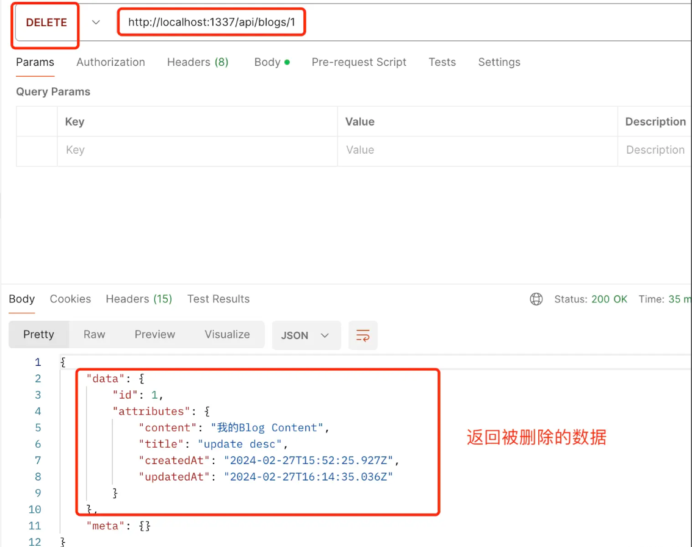

再次查看：

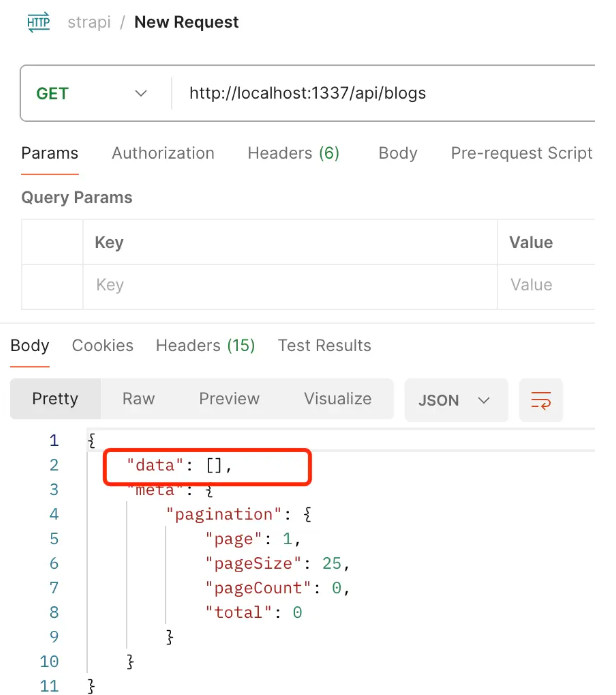

### strapi数据可视化、Navicat辅助数据处理

Strapi 支持多种数据库，包括 MySQL、PostgreSQL、MongoDB 和 SQLite，并且具有高度的可扩展性和自定义性，可以满足不同项目的需求。（默认使用的是SQLite数据库）

我们也可以借助Navicat等第三个工具来实现可视化数据操作：

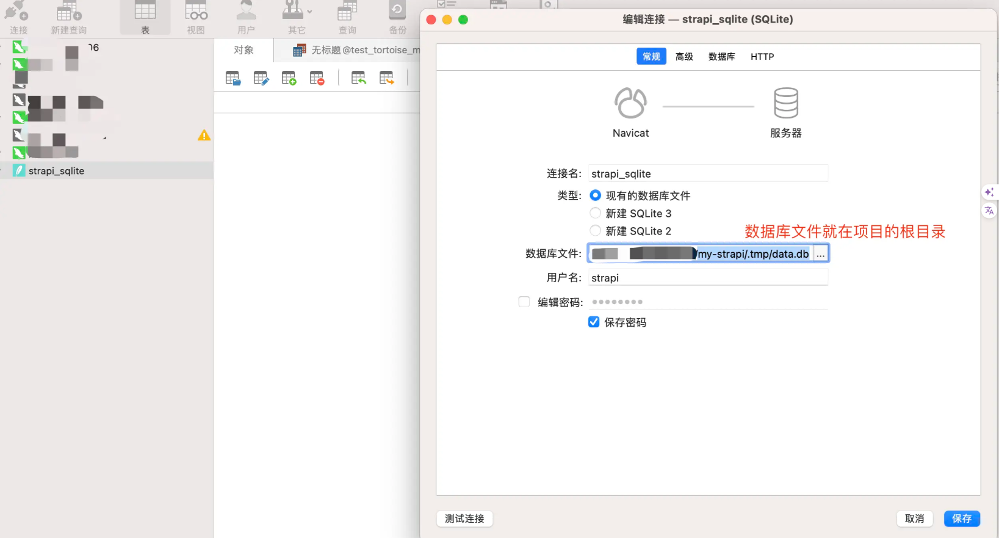

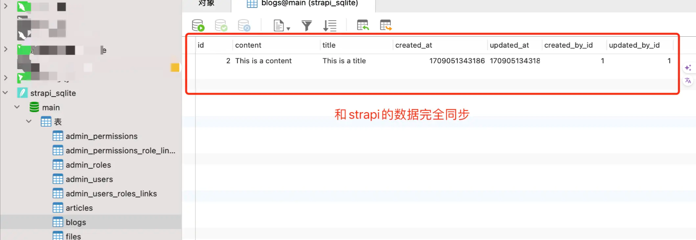

其用户名、密码默认都是strapi

### strapi数据迁移

#### SQLite数据库

如果你只是需要将SQLite数据库从一个环境迁移到另一个环境（比如从一个服务器迁移到另一个服务器），操作相对简单：

1. **备份SQLite数据库文件**：找到你的SQLite数据库文件（**默认位置是项目根目录下的** **.tmp/data.db**）并将其复制到安全的位置。
2. **迁移文件**：将备份的数据库文件移动到新环境的相同位置。
3. **更新配置（如有必要）** ：如果新环境中数据库文件的位置有变化，确保更新Strapi的数据库配置文件（./config/database.js）以反映新的文件路径。

#### SQLite到其他数据库系统

如果你需要将SQLite数据库迁移到其他类型的数据库系统，比如PostgreSQL或MySQL，流程会更复杂一些：

1. **导出SQLite数据**：首先，你需要导出SQLite数据库中的数据。这可以通过多种工具完成，例如使用sqlite3命令行工具或一个图形界面工具（如DB Browser for SQLite）来导出数据为SQL文件。
2. **准备目标数据库**：在目标数据库系统中创建一个新的数据库，为Strapi项目准备使用。
3. **修改Strapi的数据库配置**：根据目标数据库类型，修改Strapi的数据库配置文件（./config/database.js）。你需要根据目标数据库系统的要求配置连接参数。
4. **导入数据到目标数据库**：使用目标数据库系统的工具导入之前导出的数据。不同数据库系统的导入工具和命令会有所不同。例如，对于PostgreSQL，你可能会使用psql工具，对于MySQL，则可能使用mysql命令行工具。
5. **处理数据类型和结构差异**：不同的数据库系统在数据类型和结构上可能会有所差异。在导入过程中，你可能需要手动调整SQL文件或在导入后调整数据库结构，尤其是对于关系和外键约束。
6. **测试**：迁移完成后，彻底测试你的Strapi项目，确保数据正确无误，所有功能正常工作。

#### 注意事项

- **数据兼容性**：在不同数据库系统之间迁移时，可能会遇到数据类型不兼容的问题，需要仔细处理。
- **性能调优**：迁移到新的数据库系统后，可能需要根据新的数据库特性进行调优以确保性能。
- **备份**：在进行任何迁移操作之前，总是确保已经备份了所有数据和配置。

具体步骤可能会因你的具体需求和所使用的数据库系统而异。根据你的目标数据库系统，可能有特定的迁移工具和服务可以帮助简化迁移过程。

## 建一套博客系统的API

1. 安装启动（已安装可忽略）`yarn create strapi-app my-strapi --quickstart`
2. 在后台建表建模、设置字段
3. 设置表的API调用权限
4. 在需要用到的地方使用即可

## 总结

上面我们了解了strapi的后台使用、curd操作、数据迁移等。相信大家都能快速掌握使用。我们无需基于**ORM框架去搭建数据模型，也无需使用python、nestjs等后台框架去创建后台服务了。** 这势必能大大提升我们的开发效率。