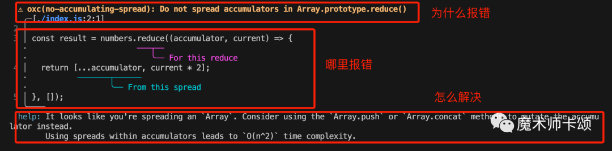
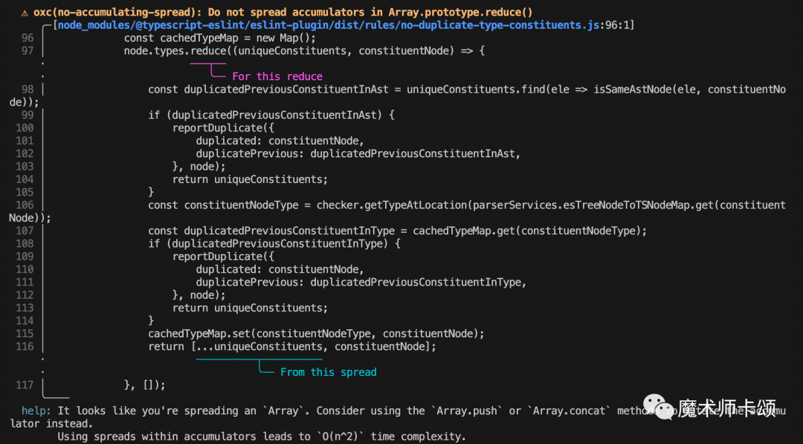

# OxcLint

## 代码检查器

ESLint 是目前前端工程中非常常用的一个工具，它可以帮助我们检查代码中的潜在问题，比如变量未使用、函数未使用、变量未定义等等。ESLint 本身是基于 JavaScript 开发的，但是它的性能一直是个问题，随着项目规模的扩大，ESLint 的性能问题也逐渐暴露出来。

因此近几年诞生了基于 Rust 的 Lint 工具 `OxcLint`。

`OxcLint` 就是基于 `Oxc` 开发的，而且 OxcLint 的性能比 ESLint 快了 50 倍以上。

`oxlint`是`Oxc`项目旗下的一款产品，`Oxc`作为一款`Rust`实现的前端工具链集合，包括：

- `linter`，即`oxlint`，对标`Eslint`，本文的主角
- `Parser`，即`oxc_parser`，用于解析`.js(x)`和`.ts(x)`，对标`swc`，**基准测试**[1]据称比`swc`快 2 倍。
- `Resolver`，解析`esm`、`cjs`文件路径，对标`webpack/enhanced-resolve`，**基准测试**[2]据称比`webpack`快 28 倍
- `formatter`，对标`Prettier`，还未公布
- `transpiler`，对标`babel`，用于将高级语法转译为低级语法，还未公布
- `minifier`，代码压缩工具，还未公布

与`Oxc`抱有同样设计理念（都是基于`Rust`开发的工具链工具）的还有`Biome`与`Ruff`，其中：

- `Biome`比较命途多舛。他的前身是`Rome`，由`Babel`作者**「Sebastian McKenzie」**开发，和`Oxc`一样目标语言是`JS`
- `Ruff`的目标语言是`Python`

### **Oxlint 的介绍**

`Oxlint`之所以引发热烈讨论，主要原因是**「他的性能太炸裂了」**。

尤大用`Oxlint`跑了`Vue3`仓库，～ 590 个文件跑～ 200 条规则，仅用时 50ms。

当然，除了**「性能优势」**，`Oxlint`与老大哥`Eslint`还有很多区别。接下来我们从 3 个角度对比`Oxlint`与`Eslint`：

1. 易用性
2. 诊断可读性
3. 参与成本

#### **易用性**

`Eslint`诞生于 2013 年，他相比于竞争对手（`JSHint`、`JSHint`）最大的优势是**「提供了大量可选的规则，并且一些场景下对于不符合规则的代码可以自动修复」**。

但是，随着时代的进步，他的优势逐渐变为劣势 —— 开发者不再需要大量自定义规则，而是需要**「开箱即用的规则集的最佳实践」**。在此理念下诞生了很多新产品，比如：

- 仅针对**「代码风格」**做出检查和格式化的`Prettier`
- antfu 定制版规则集**eslint-plugin-antfu**[3]

`Oxlint`吸取了上述产品的优点，默认提供了一套开箱即用的规则集。这套规则集主要关注**「代码的正确性」**（比如**「语法错误」**、**「冗余代码」**、**「容易造成误解的语法」**）而不是**「代码的细节优化」**（比如语法的性能、风格）。

所以，你只需要在项目执行如下命令，就能满足常规的校验：

```bash
npx oxlint@latest
```

从易用性上看，`Oxlint`比`Eslint`强很多。

#### **诊断可读性**

当`linter`诊断出问题后，会给开发者提供相关信息。`Eslint`给的信息通常比较简短，只告诉你**「为什么报错」**。比如对于如下代码：

```javascript
let a;
```

通过信息**「a is defined but never used」**可以知道报错原因是**「a 定义了但未使用」**。

但如果是更复杂的规则，简短的信息可能并不能直观表达**「具体哪里报错」**以及**「解决办法」**，很多时候我们还需要查下规则文档，看看这条规则的具体含义，再结合报错的[代码分析](https://cloud.tencent.com/product/tcap?from_column=20065&from=20065)。

相比于`Eslint`，`Oxlint`的信息更直观与准确。举个例子，下面的代码执行后会得到**「数字翻倍的数组」**：

```javascript
const numbers = [1, 2, 3, 4, 5];

const result = numbers.reduce((accumulator, current) => {
	return [...accumulator, current * 2];
}, []);

// [ 2, 4, 6, 8, 10 ]
console.log(result);
```

复制

这里每次执行`reduce`回调都会将数组展开，当数组比较长时会造成性能问题。

对此，`Oxlint`的信息包括三部分：

- 为什么报错
- 具体哪里报错
- 怎么解决



这段示例代码比较简短，可能体现不出`Oxlint`信息的价值，让我们看看下面这段报错信息：



一眼就能看出是哪个`reduce`（紫色字体）中的哪个展开操作（青色字体）引发的问题。

虽然有些同学会说：如果项目大了，`lint`信息这么详细看的人脑袋痛。

但我们要知道 —— **「你能提供，但我不用」**和**「你不能提供」**完全是两个概念。

从**「诊断可读性」**看，`Oxlint`比`Eslint`更优秀。

#### **参与成本**

**「参与成本」**是指开发者自定义规则的成本。`Oxlint`是`Rust`编写的，如果开发者自定义规则也得写`Rust`，那成本就太高了。相比之下，`Eslint`的规则都是`JS`编写的，成本低很多。

`Oxlint`从 2 个角度出发尝试解决这个问题：

1. 你别自己写了，官方将常用的规则都写好了

## 相关网址

官网：https://oxc-project.github.io/

开源地址：https://github.com/oxc-project/oxc

Oxc 提供了 VCode 插件供开发者使用：搜索 Oxc
