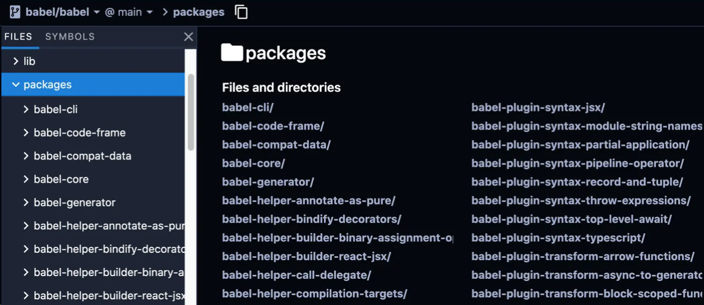

# 项目开发的 Monorepo 策略

参考：[All in one：项目级 monorepo 策略最佳实践 - 掘金 (juejin.cn)](https://juejin.cn/post/6924854598268108807)

[这些前端新技术你很难再忽视了 —— Monorepo - 掘金 (juejin.cn)](https://juejin.cn/post/7131709376921862158)

[手把手，教你搭建基于 lerna+pnpm 构建的 monorepo 项目 - 掘金 (juejin.cn)](https://juejin.cn/post/7290755652524048439)

[pnpm + workspace + changesets 构建你的 monorepo 工程 - 掘金 (juejin.cn)](https://juejin.cn/post/7098609682519949325)

[前端应该知道的 pnpm+monorepo 知识点 - 掘金 (juejin.cn)](https://juejin.cn/post/7267585231791341605)

[Monorepo 仓库代码质量提升实践 (qq.com)](https://mp.weixin.qq.com/s/qQEyFgDXVvwERte7vobsPQ)

[NestJS 小技巧 34-用 Monorepo 来开发 NestJS 微服务：手把手指导 - 掘金 (juejin.cn)](https://juejin.cn/post/7277084037070831651)

[突破项目瓶颈：2024 年 Monorepo 工具选择和实践 - 掘金 (juejin.cn)](https://juejin.cn/post/7342360674151858202)

[基于 PNPM Monorepo 的组件库研发方案调研 - 掘金 (juejin.cn)](https://juejin.cn/post/7288166472131231778)

[Monorepo与pnpm：前端项目管理的完美搭档 - 掘金 (juejin.cn)](https://juejin.cn/post/7357546247848198182)

## 一、前置问题

正在开发的项目 A，依赖了已经线上发布的项目 B，但是随着项目 A 的不断开发，又需要不时修改项目 B 的代码（这些修改暂时不必发布线上），**如何能够在修改项目 B 代码后及时将改动后在项目 A 中同步？** 在项目 A 发布上线后，**如何以一种优雅的方式解决项目 A，B 版本升级后的版本同步问题？**

解决这些问题的最佳方案便是 Monorepo 策略。

## 二、什么是 monorepo 策略？

monorepo 是一种**将多个项目代码存储在一个仓库里的软件开发策略**（"mono" 来源于希腊语 μόνος 意味**单个的**，而 "repo"，是 repository 的缩写）。

将不同的项目的代码放在同一个代码仓库中，这种「把鸡蛋放在同一个篮子里」的做法可能乍看之下有些奇怪，但实际上，这种代码管理方式有很多好处，无论是世界一流的互联网企业 Google，Facebook，还是社区知名的开源项目团队 Babel （如下图）都使用了 monorepo 策略管理他们的代码。

Monorepo 可以理解为一种基于仓库的代码管理策略，它提出将多个代码工程“独立”的放在一个仓库里的管理模式。每个代码工程在逻辑上是可以独立运行开发以及维护管理的。Monorepo 在实际场景中的运用可以非常宽泛，甚至有企业将它所有业务和不同方向语言的代码放在同一个仓库中管理。

### babel 使用 monorepo 策略管理代码



## 三、monorepo 策略的优劣

Monorepo：只有一个仓库，并且把项目拆分多个独立的代码工程进行管理，而代码工程之间可以通过相应的工具简单的进行代码共享。而传统仓库管理模式则是通过建立多个仓库，每个仓库包含拆分好的代码工程，而仓库间的调用共享则是通过 NPM 或者其他代码引用的方式进行。

通过 monorepo 策略组织代码，您代码仓库的目录结构看起来会是这样：

```bash
.
├── lerna.json
├── package.json
└── packages/ # 这里将存放所有子 repo 目录
    ├── project_1/
    │   ├── index.js
    │   ├── node_modules/
    │   └── package.json
    ├── project_2/
    │   ├── index.js
    │   ├── node_module/
    │   └── package.json
    ...
```

乍看起来，所谓的 monorepo 策略就只是将不同项目的目录汇集到一个目录之下，但实际上操作起来所要考虑的事情则远比看起来要复杂得多。通过分析使用 monorepo 策略的优劣，我们可以更直观的感受到这里面所隐晦涉及的知识点。

### 1 monorepo 方案的优势

1. **代码重用将变得非常容易**：由于所有的项目代码都集中于一个代码仓库，我们将很容易抽离出各个项目共用的业务组件或工具，并通过 TypeScript，Lerna 或其他工具进行代码内引用；
2. **依赖管理将变得非常简单**：同理，由于项目之间的引用路径内化在同一个仓库之中，我们很容易追踪当某个项目的代码修改后，会影响到其他哪些项目。通过使用一些工具，我们将很容易地做到版本依赖管理和版本号自动升级；
3. **代码重构将变得非常便捷**：想想究竟是什么在阻止您进行代码重构，很多时候，原因来自于「不确定性」，您不确定对某个项目的修改是否对于其他项目而言是「致命的」，出于对未知的恐惧，您会倾向于不重构代码，这将导致整个项目代码的腐烂度会以惊人的速度增长。而在 monorepo 策略的指导下，您能够明确知道您的代码的影响范围，并且能够对被影响的项目可以进行统一的测试，这会鼓励您不断优化代码；
4. **它倡导了一种开放，透明，共享的组织文化，这有利于开发者成长，代码质量的提升**：在 monorepo 策略下，每个开发者都被鼓励去查看，修改他人的代码（只要有必要），同时，也会激起开发者维护代码，和编写单元测试的责任心（毕竟朋友来访之前，我们从不介意自己的房子究竟有多乱），这将会形成一种良性的技术氛围，从而保障整个组织的代码质量。

### 2 monorepo 方案的劣势

1. **项目粒度的权限管理变得非常复杂**：无论是 Git 还是其他 VCS 系统，在支持 monorepo 策略中项目粒度的权限管理上都没有令人满意的方案，这意味着 A 部门的 a 项目若是不想被 B 部门的开发者看到就很难了。（好在我们可以将 monorepo 策略实践在「项目级」这个层次上，这才是我们这篇文章的主题，我们后面会再次明确它）；
2. **新员工的学习成本变高**：不同于一个项目一个代码仓库这种模式下，组织新人只要熟悉特定代码仓库下的代码逻辑，在 monorepo 策略下，新人可能不得不花更多精力来理清各个代码仓库之间的相互逻辑，当然这个成本可以通过新人文档的方式来解决，但维护文档的新鲜又需要消耗额外的人力；
3. **对于公司级别的 monorepo 策略而言，需要专门的 VFS 系统，自动重构工具的支持**：设想一下 Google 这样的企业是如何将十亿行的代码存储在一个仓库之中的？开发人员每次拉取代码需要等待多久？各个项目代码之间又如何实现权限管理，敏捷发布？任何简单的策略乘以足够的规模量级都会产生一个奇迹（不管是好是坏），对于中小企业而言，如果没有像 Google，Facebook 这样雄厚的人力资源，把所有项目代码放在同一个仓库里这个美好的愿望就只能是个空中楼阁。

### 3 小结：如何取舍？

没错，软件开发领域从来没有「银弹」。monorepo 策略也并不完美，并且，我在实践中发现，要想完美在组织中运用 monorepo 策略，所需要的不仅是出色的编程技巧和耐心。**团队日程**，**组织文化**和**个人影响力**相互碰撞的最终结果才决定了想法最终是否能被实现。

但是请别灰心的太早，因为虽然让组织作出改变，统一施行 monorepo 策略困难重重，但这却并不意味着我们需要彻底跟 monorepo 策略说再见（否则我这篇文章就该到此为止了）。我们还可以**把 monorepo 策略实践在「项目」这个级别**，即从逻辑上确定项目与项目之间的关联性，然后把相关联的项目整合在同一个仓库下，通常情况下，我们不会有太多相互关联的项目，这意味着我们能够免费得到 monorepo 策略的所有好处，并且可以拒绝支付大型 monorepo 架构的利息。

本文的剩余篇幅就是对「项目级别 monorepo 实践」的一些总结，即使您最终没有选择 monorepo 策略组织您的代码，相信文章中提供的一些工程化工具或思路也一样会对您产生帮助。

## 四、🧑🏻‍💻 monorepo 方案实践

### 3.1 锁定环境：Volta

[Volta](https://volta.sh/) 是一个 JavaScript 工具管理器，它可以让我们轻松地在项目中锁定 node，npm 和 yarn 的版本。你只需在安装完 Volta 后，在项目的根目录中执行 `volta pin` 命令，那么无论您当前使用的 node 或 npm（yarn）版本是什么，volta 都会自动切换为您指定的版本。

因此，除了使用 Docker 和显示在文档中声明 node 和 npm（yarn）的版本之外，您就有了另一个锁定环境的强力工具。

而且相较于 nvm，Volta 还具有一个诱人的特性：当您项目的 CLI 工具与全局 CLI 工具不一致时，Volta 可以做到在项目根目录下自动识别，切换到项目指定的版本，这一切都是由 Volta 默默做到的，开发者不必关心任何事情。

### 3.2 复用 packages：workspace

使用 monorepo 策略后，收益最大的两点是：

1. **避免重复安装包，因此减少了磁盘空间的占用，并降低了构建时间**；
2. **内部代码可以彼此相互引用**；

这两项好处全部都可以由一个成熟的包管理工具来完成，对前端开发而言，即是 `yarn`（1.0 以上）或 `npm`（7.0 以上）通过名为 `workspaces` 的特性实现的（⚠️ 注意，支持 workspaces 特性的 npm 目前依旧不是 LTS 版本）。

为了实现前面提到的两点收益，您需要在代码中做三件事：

1. 调整目录结构，将相互关联的项目放置在同一个目录，推荐命名为 `packages`；
2. 在项目根目录里的 `package.json` 文件中，设置 `workspaces` 属性，属性值为之前创建的目录；
3. 同样，在 `package.json` 文件中，设置 `private` 属性为 `true`（为了避免我们误操作将仓库发布）；

经过修改，您的项目目录看起来应该是这样：

```bash
├── package.json
└── packages/
    ├── @mono/project_1/ # 推荐使用 `@<项目名>/<子项目名>` 的方式命名
    │   ├── index.js
    │   └── package.json
    └── @mono/project_2/
        ├── index.js
        └── package.json
```

而当您在项目根目录中执行 `npm install` 或 `yarn install `后，您会发现在项目根目录中出现了 `node_modules` 目录，并且该目录不仅拥有所有子项目共用的 npm 包，还包含了我们的子项目。因此，我们可以在子项目中通过各种模块引入机制，像引入一般的 npm 模块一样引入其他子项目的代码。

请注意我们对子项目的命名，统一以 `@<repo_name>/` 开头，这是一种社区最佳实践，不仅可以让用户更容易了解整个应用的架构，也方便您在项目中更快捷的找到所需的子项目。

至此，我们已经完成了 monorepo 策略的核心部分，实在是很容易不是吗？但是老话说「行百里者半九十」，距离优雅的搭建一个 monorepo 项目，我们还有一些路要走。

### 3.3 统一配置：合并同类项 - Eslint，Typescript 与 Babel

您一定同意，编写代码要遵循 DRY 原则（Don't Repeat Yourself 的缩写）。那么，理所当然地，我们应该尽量避免在多个子项目中放置重复的 eslintrc，tsconfig 等配置文件。幸运的是，Babel，Eslint 和 Typescript 都提供了相应的功能让我们减少自我重复。

#### 3.3.1 TypeScript

我们可以在 `packages` 目录中放置 `tsconfig.settting.json` 文件，并在文件中定义通用的 ts 配置，然后，在每个子项目中，我们可以通过 `extends` 属性，引入通用配置，并设置 `compilerOptions.composite` 的值为 `true`，理想情况下，子项目中的 `tsconfig` 文件应该仅包含下述内容：

```json
{
	"extends": "../tsconfig.setting.json", // 继承 packages 目录下通用配置
	"compilerOptions": {
		"composite": true, // 用于帮助 TypeScript 快速确定引用工程的输出文件位置
		"outDir": "dist",
		"rootDir": "src"
	},
	"include": ["src"]
}
```

#### 3.3.2 Eslint

对于 Eslint 配置文件，我们也可以如法炮制，这样定义子项目的 `.eslintrc` 文件内容：

```json
{
	"extends": "../../.eslintrc", // 注意这里的不同
	"parserOptions": {
		"project": "tsconfig.json"
	}
}
```

注意到了吗，对于通用的 eslint 配置，我们并没有将其放置在 `packages` 目录中，而是放在整个项目的根目录下，这样做是因为一些编辑器插件只会在项目根目录寻找 `.eslintrc` 文件，因此为了我们的项目能够保持良好的「开发环境一致性」，请务必将通用配置文件放置在项目的根目录中。

#### 3.3.3 Babel

Babel 配置文件合并的方式与 TypeScript 如出一辙，甚至更加简单，我们只需在子项目中的 `.babelrc` 文件中这样声明即可：

```json
{
	"extends": "../.babelrc"
}
```

当一切准备就绪后，我们的项目目录应该大致呈如下所示的结构：

```bash
.
├── package.json
├── .eslintrc
└── packages/
    │   ├── tsconfig.settings.json
    │   ├── .babelrc
    ├── @mono/project_1/
    │   ├── index.js
    │   ├── .eslintrc
    │   ├── .babelrc
    │   ├── tsconfig.json
    │   └── package.json
    └───@mono/project_2/
        ├── index.js
        ├── .eslintrc
        ├── .babelrc
        ├── tsconfig.json
        └── package.json
```

### 3.4 统一命令脚本：scripty

在上一步中，我们尽可能的将所有配置文件进行抽象，从而精简了代码，并提高了整个项目的一致性。我们的整个仓库也因此有了「更浓郁的 monorepo 风味 ☕️」。但如果仔细审视我们的整个工程文件，还有一处存在着明显的瑕疵和一些恼人的坏味道，当您仔细审视您的众多 `package.json` 文件时，您就知道我在说什么了 -- scripts 脚本。

如果您的子项目足够多，您可能会发现，每个 `package.json` 文件中的 `scripts` 属性都大同小异，并且一些 `scripts` 充斥着各种 Linux 语法，例如管道操作符，重定向或目录生成。**重复带来低效，复杂则使人难以理解**，这都是需要我们解决的问题。

这里给出的解决方案是，使用 [scripty](https://www.npmjs.com/package/scripty) 管理您的脚本命令，简单来说，scripty 允许您将脚本命令定义在文件中，并在 `package.json` 文件中直接通过文件名来引用。这使我们可以实现如下目的：

1. **子项目间复用脚本命令**；
2. **像写代码一样编写脚本命令，无论它有多复杂，而在调用时，像调用函数一样调用**；

通过使用 scripty 管理我们的 monorepo 应用，目录结构看起来将会是这样：

```bash
.
├── package.json
├── .eslintrc
├── scirpts/ # 这里存放所有的脚本
│   │   ├── packages/ # 包级别脚本
│   │   │   ├── build.sh
│   │   │   └── test.sh
│   └───└── workspaces/ # 全局脚本
│           ├── build.sh
│           └── test.sh
└── packages/
    │   ├── tsconfig.settings.json
    │   ├── .babelrc
    ├── @mono/project_1/
    │   ├── index.js
    │   ├── .eslintrc
    │   ├── .babelrc
    │   ├── tsconfig.json
    │   └── package.json
    └── @mono/project_2/
        ├── index.js
        ├── .eslintrc
        ├── .babelrc
        ├── tsconfig.json
        └── package.json
```

注意，我们脚本分为两类「package 级别」与「workspace 级别」，并且分别放在两个文件夹内。这样做的好处在于，我们既可以在项目根目录执行全局脚本，也可以针对单个项目执行特定的脚本。

通过使用 scripty，子项目的 `package.json` 文件中的 `scripts` 属性将变得非常精简：

```json
{
  ...
  "scripts": {
    "test": "scripty",
    "lint": "scripty",
    "build": "scripty"
  },
  "scripty": {
    "path": "../../scripts/packages" // 注意这里我们指定了 scripty 的路径
  },
  ...
}
```

大功告成！🎉 至此，我们尽己所能地删除了整个项目中的重复代码，让整个项目变得干净，清爽并且有极强的复用性。

🧉 小贴士：

> 别忘了使用 chmod -R u+x scripts 命令使所有的 shell 脚本具备可执行权限，也千万别忘了把这条贴士写在您的 README.md 文件中！

### 3.5 统一包管理：Lerna

Lerna 开源地址：https://github.com/lerna/lerna

[几分钟了解前端 Monorepo - Lerna 的使用 - 掘金 (juejin.cn)](https://juejin.cn/post/7064118504982577160)

我有时会感慨自己的灵感匮乏，怎么就想不到 Lerna 这样既有神话色彩又能自我释义的好名字。您可以大胆想象，九头龙的每只龙头都在帮您管理着一个子项目，而您只需要骑在龙身上发号施令的场景，这基本上就是我们使用 Lerna 时的直观感受。

这也是为什么当我们提起 monorepo 策略，就几乎不得不提到 Lerna 的原因了，它的确提供了一种非常便捷的方式供我们管理 monorepo 项目。当子项目越多时，Lerna 就越能显示其威力。

当多个子项目放在一个代码仓库，并且子项目之间又相互依赖时，我们面临的棘手问题有两个：

1. **如果我们需要在多个子目录执行相同的命令，我们需要手动进入各个目录，并执行命令**；
2. **当一个子项目更新后，我们只能手动追踪依赖该项目的其他子项目，并升级其版本**。

通过使用 Lerna，这些棘手的问题都将不复存在。

当在项目根目录使用 `npx lerna init` 初始化后，我们的根目录会新增一个 `lerna.json` 文件，默认内容为：

```json
{
	"packages": ["packages/*"],
	"version": "0.0.0"
}
```

让我们稍稍改动这个文件，使其变为：

```json
{
	"packages": ["packages/*"],
	"npmClient": "yarn",
	"version": "independent",
	"useWorkspaces": true
}
```

可以注意到，我们显示声明了我们的包客户端（`npmClient`）为 `yarn`，并且让 Lerna 追踪我们 workspaces 设置的目录，这样我们就依旧保留了之前 `workspaces` 的所有特性（**子项目引用**和**通用包提升**）。

除此之外一个有趣的改动在于我们将 `version` 属性指定为一个关键字 `independent`，这将告诉 lerna 应该**将每个子项目的版本号看作是相互独立的**。当某个子项目代码更新后，运行 `lerna publish` 时，Lerna 将监听到代码变化的子项目并以交互式 CLI 方式让开发者决定需要升级的版本号，关联的子项目版本号不会自动升级，反之，当我们填入固定的版本号时，则任一子项目的代码变动，都会导致所有子项目的版本号基于当前指定的版本号升级。

Lerna 提供了很多 CLI 命令以满足我们的各种需求，但根据 2/8 法则，您应该首先关注以下这些命令：

- `lerna bootstrap`：等同于 `lerna link` + `yarn install`，用于创建符合链接并安装依赖包；
- `lerna run`：会像执行一个 for 循环一样，在所有子项目中执行 npm script 脚本，并且，它会非常智能的识别依赖关系，并从根依赖开始执行命令；
- `lerna exec`：像 `lerna run` 一样，会按照依赖顺序执行命令，不同的是，它可以执行任何命令，例如 shell 脚本；
- `lerna publish`：发布代码有变动的 package，因此首先您需要在使用 Lerna 前使用 `git commit` 命令提交代码，好让 Lerna 有一个 baseline；
- `lerna add`：将本地或远程的包作为依赖添加至当前的 monorepo 仓库中，该命令让 Lerna 可以识别并追踪包之间的依赖关系，因此非常重要；

```shell
# 向 @mono/project2 和 @mono/project3 中添加 @mono/project1
lerna add @mono/project1 '@mono/project{2,3}'
```

#### 3.5.1 Lerna 高级命令

除了上面介绍到的常用命令外，Lerna 还提供了一些参数满足我们更灵活的需求，例如：

- `--concurrency <number>`：参数可以使 Lerna 利用计算机上的多个核心，并发运行，从而提升构建速度；
- `--scope '@mono/{pkg1,pkg2}'`：`--scope` 参数可以指定 Lerna 命令的运行环境，通过使用该参数，Lerna 将不再是一把梭的在所有仓库中执行命令，而是可以精准地在我们所指定的仓库中执行命令，并且还支持示例中的模版语法；
- `--stream`：该参数可使我们查看 Lerna 运行时的命令执行信息；

#### 3.5.2 npm 包本地发布：Verdaccio

看到这里，您可能想要亲自体验一把使用 Lerna 管理/发布 monorepo 项目的感觉。可是很快您会发现，将示例代码发布到真实世界的 npm 仓库并非一个好主意，这多少有些令人沮丧，但是别担心，您可以使用 [Verdaccio](https://verdaccio.org/) 在本地创建一个 npm 仓库作为代理，然后尽情体验 Lerna 的种种强大之处。

安装运行 Verdaccio 非常简单，您只需运行：

```shell
npm install --global verdaccio
```

在全局安装 Verdaccio 应用，然后在 shell 中输入：

```shell
verdaccio
```

即可通过 `localhost:4837` 访问您的本地代理 npm 仓库，别忘了在您的项目根目录创建 `.npmrc` 文件，并在文件中将 npm 仓库地址改写为您的本地代理地址：

```bash
registry="http://localhost:4873/"
```

大功告成 🙌！每当您执行 `lerna publish` 时，子项目所构建成的 package 将会发布在本地 npm 仓库中，而当您执行 `lerna bootstrap` 时，Verdaccio 将会放行，让您成功从远程 npm 仓库中拉取相应的代码。

### 3.6 格式化 commit 信息

至此，我们已经掌握了组织一个项目级 monorepo 仓库的所有前沿技巧，最后，让我们看看最后一个可以优化的地方：**代码提交时，约束 commit 信息**。

一个 monorepo 仓库可能被**不同的开发者提交不同子项目**的代码，如果没有规范化的 commit 信息，在故障排查或版本回滚时毫无意外会遭遇灾难。因此，千万不要小看 commit 信息格式化的重要性（当然，同样重要的还有代码注释！）。

为了我们能够一目了然的追踪每次代码变更的信息，我们使用 [commitlint](https://github.com/conventional-changelog/commitlint/?tab=readme-ov-file#what-is-commitlint) 工具作为格式化 commit 信息的不二之选。

顾名思义，`commitlint` 可以帮助我们检查提交的 commit 信息，它强制约束我们的 commit 信息必须在开头附加指定类型，用于标示本次提交的大致意图，支持的类型关键字有：

- `feat`：表示添加一个新特性；
- `chore`：表示做了一些与特性和修复无关的「家务事」；
- `fix`：表示修复了一个 Bug；
- `refactor`：表示本次提交是因为重构了代码；
- `style`：表示代码美化或格式化；
- ...

我强烈建议您遵循该规范编写您的 commit 信息，不要偷懒，坚持下去，您的 git 日志将会显得整齐，有条理，富有表现力，同时，您也会收到同行的交口称赞，人人都会以和您这样优雅的工程师合作为荣。

除了限定 commit 信息类型外，commitlint 还支持（虽然不是必须的）显示指定我们本次提交所对应的子项目名称。假如我们有一个名为 `@mono/project1` 的子项目，我们针对该项目提交的 commit 信息可以写为：

```shell
git commit -m "feat(project1): add a attractive button" # 注意，我们省略了 @mono 的项目前缀
```

毫无疑问，这将会使我们的 commit 信息更具表现力。

我们可以通过下面的命令安装 `commitlint` 以及周边依赖：

```bash
npm i -D @commitlint/cli @commitlint/config-conventional @commitlint/config-lerna-scopes commitlint husky lerna-changelog
```

注意到了吗？我偷偷安装了 [husky](https://www.npmjs.com/package/husky)，它能够帮助我们在提交 commit 信息时自动运行 `commitlint` 进行检查，但在这之前，我们需要再在根目录下的 `package.json` 文件里加点料，像这样：

```json
{
 ...
 "husky": {
    "hooks": {
      "commit-msg": "commitlint -E HUSKY_GIT_PARAMS"
    }
  }
 ...
}
```

为了能够让 `commitlint` 感知我们的子项目名称，我们还需在项目根目录中增加 `commitlint.config.js` 文件，并设置文件内容为：

```javascript
module.exports = {
	extends: [
		"@commitlint/config-conventional",
		"@commitlint/config-lerna-scopes",
	],
};
```

至此，我们统一并规范化了 monorepo 项目的 commit 信息，终于整个 monorepo 工程化的最后一块拼图被我们拼上了！

（顺便一提，您可以通过在命令行执行 `echo "build(project1): change something" | npx commitlint` 命令即可验证您的 commit 信息是否通过 commitlint 的检查。）

## 4. 🚚 如何从 multirepo 迁移至使用 monorepo 策略？

至此，我们学会了如何采用 monorepo 策略组织项目代码的最佳实践，或许您已经开始跃跃欲试想要尝试前文提到的种种技巧。从 0 搭建一个 monorepo 项目，当然没问题！可是如果要基于已有的项目，将其转化为一个使用 monorepo 策略的项目呢？

还记得吗？成百里者半九十，您还有一些坑要踩。不过好在您在这里还能够得到我的帮助，不必客气！

或许您注意到了，Lerna 为我们提供了 `lerna import ` 命令，用来将我们已有的包导入到 monorepo 仓库，并且还会保留该仓库的所有 commit 信息。然而实际上，该命令仅支持**导入本地项目**，并且**不支持**导入项目的分支和标签 🙃。

那么如果我们想要导入远程仓库，或是要获取某个分支或标签该怎么做呢？答案是使用 [tomono](https://github.com/hraban/tomono)，其内容是一个 shell 脚本。

使用 tomono 导入远程仓库，您所需要做的只有两件事：

1. 创建一个包含所有需要导入 repo 地址的文本文件；
2. 执行 shell 命令：`cat repos.txt | ~/tomono/tomono.sh`（这里我们假定您的文本文件名为 `repos.txt`，且您将 tomono 下载在用户根目录；

repo 文件内容示例如下：

```bash
// 1. Git仓库地址  2. 子项目名称  3. 迁移后的路径
git@github.com/backend.git @mono/backend packages/backend
git@github.com/frontend.git @mono/frontend packages/frontend
git@github.com/mobile.git @mono/mobile packages/mobile
```

至此，我们也掌握了将现有项目迁移至 monorepo 项目的方法。到这时候，您已绝非再是 monorepo 界的门外汉！

恭喜您 ！！🎉

## 5. 🎓 小结

在本篇文章中，我们共同了解了「**什么是 monorepo 策略**」以及「**monorepo 策略的优劣**」，并且一起学习实践了 monorepo 策略的一些最佳实践。您一定也意识到，即使您的工作场景暂时无法实践 monorepo 策略，阅读本篇文章所学习到的种种方法，工具和思想也可以运用到您当下的工作之中。
