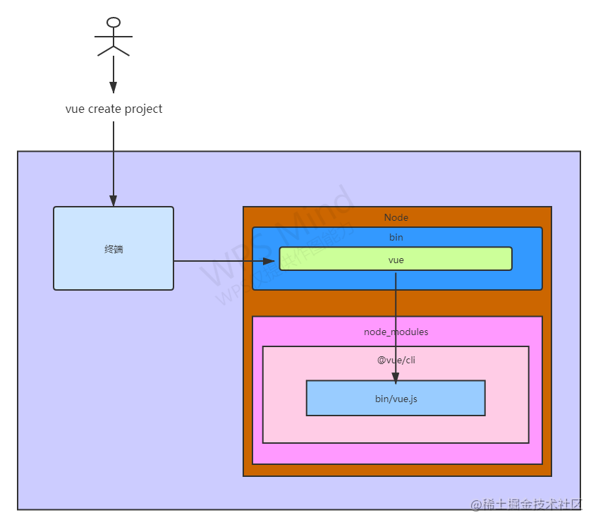
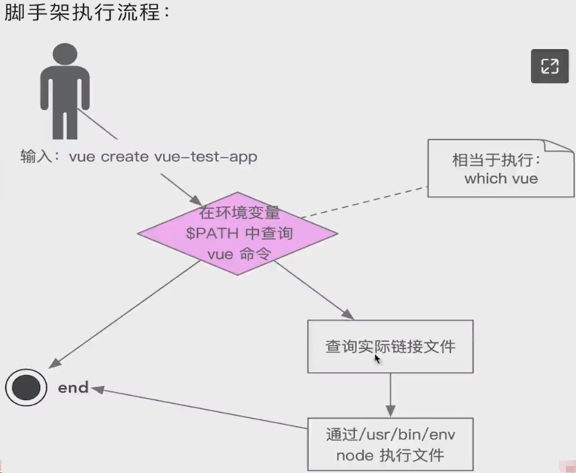
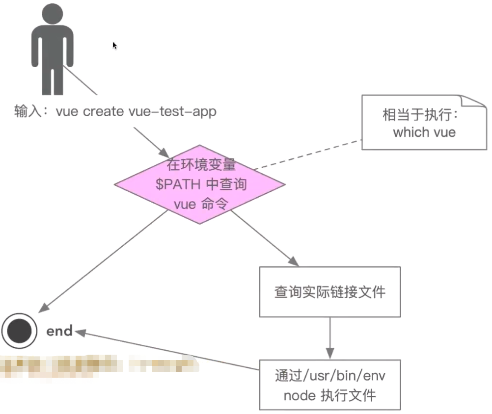

# 脚手架架构设计和框架搭建开发

项目源码：[imooc-lego/imooc-cli: 慕课网前端统一研发脚手架 (github.com)](https://github.com/imooc-lego/imooc-cli)

- 脚手架的实现原理
- Lerna 库的常见用法
- 架构设计技巧和架构图绘制方法

## 主要内容

- 学习如何以架构师的角度思考基础架构问题
- 专注多 Package 项目管理痛点和解决方案，基于 Lerna 脚手架框架搭建
- imooc-cli 脚手架需求分析和架构设计，架构设计图

### 附赠内容

- 脚手架调试技巧
- Lerna 源码分析
- Node 的 module 模块分析 yargs 使用方法
- 剖析 Lerna 架构设计

### 学习方法

架构三部曲：掌握原理-> 独立思考-> 总结反思

深度剖析优秀开源项目，由表及里，由浅入深

视角切换：多切换到架构师视角，从全局思考问题

优秀的程序员不止能够实现功能，更能读懂别人的代码，读懂别人的想法

从知名的开源项目中汲取养分，为我所用，助我成长

### 前端研发脚手架 imooc-cli 核心功能演示

- 安装 imooc-cli 脚手架： `npm i -g @imooc-cli/core`
- 查看脚手架相关内容：`imooc-cli`
- 通过脚手架新建项目：`imooc-cli init`
- 项目发布到测试环境： `imooc-cli publish`
- 项目发布到正式环境：`imooc-cli publish --prod`

## 站在前端研发的视角，分析开发脚手架的必要性

### 研发效能

开发项目脚手架的核心目标是：提升前端研发效能

大厂研发架构图：


**创建项目 + 通用代码**：埋点、HTTP 请求、工具方法、组件库

**git 操作**：创建仓库、代码冲突、远程代码同步、创建版本、发布打 tag

**构建 + 发布上线**：依赖安装和构建、资源上传 CDN、域名绑定、测试/正式服务器

### 脚手架核心价值

**将研发过程**

- 自动化：项目重复代码拷贝、`git` 操作、发布上线操作
- 标准化：项目创建、git flow、发布流程、回滚流程
- 数据化：研发过程系统化、数据化、使得研发过程可量化

### 脚手架和自动化构建工具的区别

问题：`jenkins`，`travis` 等自动化构建工具已经很成熟了，为什么还要自研脚手架？

- 不满足需求：`jenkins`，`travis` 通常在 `git hooks` 中触发，需要在服务端执行，无法覆盖研发人员本地的功能，如：创建项目自动化，本地 `git` 操作自动化等。
- 定制复杂： `jenkins`，`travis` 定制过程需要开发插件，其过程较为复杂，需要使用 `java` 语言，对前端同学不太友好。

## 从使用的角度理解什么是脚手架

脚手架本质是一个操作系统的客户端，他通过命令行执行，比如：

```bash
vue create vue-test-app
```

上面这条命令由 **3** 个部分组成：

- **主命令**：`vue`
- **command**：`create`
- **command 的 param**：`vue-test-app`

它表示创建一个 `vue` 项目，项目的名称为 `vue-test-app`，这是一个比较简单的脚手架命令，但实际场景往往更加复杂，比如：

当前目录已经有文件了，我们需要覆盖当前目录的文件，强制进行安装 `vue` 项目，此时我们就可以输入

```bash
vue create vue-test-app --force
```

这里的 `--force` 叫做 `option` ，用来辅助脚手架确认在特定场景下用户的选择（可以理解为配置）。还有一种场景：

通过 `vue create` 创建项目时，会自动执行 `npm install` 帮助用户安装依赖，如果我们希望使用淘宝源来安装，可以输入命令

```bash
vue create vue-test-app --force -r https://registry.npm.taobao.org
```

这里的 `-r` 也叫做 `option`，它与 `--force` 不同的是它使用 `-` ，并且使用简写，这里的 `-r` 也可以替换成 `--registry`，输入下面的命令就可以看到 `vue create` 支持的所有 `options`。

```bash
vue create --helps
```

`-r` 后面的 `https://registry.npm.taobao.org` 成为 `option` 的 `param` ，其实 `--force` 可以理解为：`--force true` ，简写为 `--force` 或 `-f` 。

### 脚手架的执行原理



**脚手架执行原理如下**

- 在终端输入`vue create project`
- 终端解析出 `vue`
- 在环境变量中通过 `which vue` 找到 `vue` 命令, 目录所在 `/node/bin/vue`，所以我们执行的 `vue`，实际上运行的是`/node/bin/vue` 的这个 `vue`
- 这个 `vue` 只是一个链接，终端根据 `vue` 命令链接到实际文件 `/node/lib/node_modules/@vue/cli/bin/vue.js`
- 终端利用 `node` 执行 `vue.js`
- `vue.js` 解析 `command/options` 以及 `param`
- `vue.js` 执行 `command`
- 执行完毕，退出执行

### 从应用角度，如何开发一个脚手架

**以 vue-cli 为例**

- 开发一个 `npm` 项目，该项目中应包含一个 `bin/vue.js` 文件，并将这个项目发布到 `npm`；
- 将这个项目发布到 `npm`
- 将 `npm` 项目上的项目全局安装到 `node` 的 `lib/node_modules`
- 在 `node` 的 `bin` 目录下配置 `vue` 软链接指向 `lib/node_modules/@vue/cli/bin/vue.js`

这样我们在执行 `vue` 命令的时候就可以找到 `vue.js` 进行相关操作。

## 脚手架的实现原理问题

可以使用(Node.js)、Python、Ruby 等各种语言编写。

执行流程原理图：



这里需要理解几个基本概念

- 环境变量(相当于操作系统级别的全局变量)
- 软链接(相当于 Windows 系统的快捷方式)
- 这里:vue、which、env、node 本质都是脚手架

脚手架的执行原理如下：

- 在终端输入：`vue create vue-test-app`
- 终端解析出 `vue`命令
- 终端在环境变量中找到 `vue` 命令终端
- 根据 `vue` 命令链接到实际文件 vue.js 终端利用 `node` 执行 `vue.js`
- `vue.js` 解析 command/options
- `vue.js` 执行 command
- 执行完毕，退出执行

### 三个问题

如果你能回答以下 3 个问题，就掌握了脚手架的实现原理：

**1.为什么全局安装 @vue/cli 后会添加一个 vue 的命令呢？**

```bash
npm install -g @vue/cli
```

运行 `vue` 命令时，实际走的是 `node/bin/vue` ，而这个文件只是一个软连接，指向`lib/node_modules/@vue/cli/bin/vue.js`。

回到上级目录 `lib/node_modules/@vue/cli`，打开 `package.json` 文件，里面的 `bin` 字段定义了这样的绑定关系。

```javascript
// lib/node_modules/@vue/cli/package.json
{
  "bin": {
    "vue": "bin/vue.js"
  },
}
```

总结：执行 `vue` 命令的时候，启动的是 `bin/vue` 这个文件，而这个文件指向`lib/node_modules/@vue/cli/bin/vue.js` ，所以最终启动的是 `lib/node_modules/@vue/cli/bin/vue.js`

答：这是因为通过 which vue 后我们会看到 vue 所在目录，而这个 vue 是一个软链接，指向的是@vue/cli。确定这个 vue 命令名称的是在`node/v12.16.1/lib/node_modules/@vue/cli`目录下 package.json 中的 bin 的键值。

**2.全局安装 @vue/cli 的时候发生了什么？**

- 1.把 `@vue/cli` 的包通过 `npm` 安装下载到 `node/lib/node_modules` 这个目录下。
- 2.解析 `package.json` 文件 ，根据文件中的 `bin` 字段，在 `/node/bin` 目录下创建软连接，软连接指向 `bin` 字段中规定的文件，也就是 `lib/node_modules/@vue/cli/bin/vue.js`。

答：

1.执行 npm install -g @vue/cli 的时候，首先 node 会把我们当前包下载到 node 下的 node_modules 中去。

2.下载完成后，会在下载好的包中查找 package.json 中是否有 bin，如果有，会通过 package.json 中的 bin 中的键去配置软链接。

上面两个问题其实问题二在前，问题一在后，两个问题说的是一个流程的双向解释，理解了问题二，问题一就清楚了。

**3.执行 `vue` 命令时发生了什么？**

- 根据 `which vue` 这条指令（在环境变量中查找），找到 `vue` 命令所在文件
- 运行这个文件，执行 `vue` 和执行 `node/bin/vue` 的结果是一样的
- 根据软连接，执行真实的 `lib/node_modules/@vue/cli/bin/vue.js` 文件

答：

1.首先执行 vue 命令，与执行 which vue 打印出来的地址 效果是等价的(即执行的是 which vue 的那个软连接：/Users/test-cli/.nvm/versions/node/v12.16.1/bin/vue)。

2.而软连接又指向它的实际文件存在路径：(…/lib/node_modules/@vue/cli/bin/vue.js)。

3.一个 test.js 文件可以通过 node 执行，但不能单独执行，这是因为它没有可执行权限。 ————我们在`/Users/test-cli/Desktop`目录下新建一个 test.js 文件，我们可以给这个 js 文件一个执行权限：

chmod 777 test.js ，然后在命令行直接输入：`./test.js`仍然不可以执行。

这是因为 js 文件需要一个解释器来进行执行，这个 node 就是一个解释器。(.py 文件需要 python 解释器执行，.java 文件需要 java 解释器进行执行)。

**4.为什么 `vue` 指向一个 `js` 文件，我们却可以直接通过 `vue` 命令去执行它？**

查看 `lib/node_modules/@vue/cli/bin/vue.js` 文件的源码，会发现第一行代码是这样的

```bash
#!/usr/bin/env node
```

告诉我们的操作系统，直接调用这个文件的时候，到环境变量中查找 node 命令执行。 (/usr/bin/env 是我们的环境变量)

使用`./test.js` 命令执行 js 文件：`test.js`文件中第一行加入这行代码 `#!/usr/bin/env node` ，然后命令行直接输入 ：`./test.js` 即可执行这个 js 文件。

```bash
# 因为这句命令等于直接执行node 命令
/usr/bin/env node
```

如果不想用 `./test.js` 这样的方式执行 js 文件，我们想通过一个像`vue`命令，创建个 `test` 命令来 指向执行这个`test.js`文件，该如何做呢？

- 第一种方式，我们去找环境变量，通过命令： `echo $PATH`，找到环境变量
  - 1.创建一个环境变量：
    - 1.找到 node 的 bin 目录：`cd /Users/admin/.nvm/versions/node/v12.16.1/bin`
    - 2.创建环境变量——软连接：`ln -s test /Users/admin/Desktop/test.js`，格式：`ln -s [目录文件] [变量名]`
  - 2.软连接创建完毕后，就可以看到一个 test 软连接，我们在任何目录的命令行执行 `test` 就可以执行`test.js`文件了。

扩展一下，有的同学可能会问下面两种写法的区别?

```bash
# 第一种是在环境变量中查找 node（可靠的）
#!/usr/bin/env node
# 第二种是直接执行/usr/bin/目录下的node
#!/usr/bin/node
```

### 脚手架原理进阶

掌握上节内容后，我们可以继续尝试回答以下 2 个问题：

**5.为什么说脚手架本质是操作系统的客户端？它和我们在 PC 上安装的应用/软件有什么区别？**

因为 `node` 本身是一个客户端，在 `windows` 系统下，可以看到 `node` 的安装目录中，`node` 是以 `node.exe` 的形式出现的。

而我们编写的脚手架文件，如 `vue.js` 只是 `node` 运行时的一个参数。

```bash
node vue.js
```

答：脚手架执行起来的本质是靠 node 这个命令，node 是一个操作系统客户端，而 test.js 这个文件仅仅是作为一个参数注入到 node 命令中。

node 本质上是一个可执行文件(在 window 操作系统中可以看到 node 的扩展名为.exe 的)。

node 和 PC 上安装的应用/软件 本质来说没有区别。区别仅仅是安装的应用软件会提供一个 GUI，而 node 并没有提供 GUI，Node 通过命令行参数执行

**6.如何为 node 脚手架创建别名？**

软连接是可以嵌套的，只需让别名指向原来的名字即可。

方法一：即为上文提到的创建一个软连接。 接着，我们希望继续为上文提到的 `test` 软连接继续添加一个别名，我们需要这么做 在上文的 bin 目录下，执行命令 `ln -s ./test test2` 即 软连接可以嵌套。

**描述脚手架命令执行的全过程**



过程：

# 脚手架框架搭建

## 1.脚手架开发入门

1.创建 `npm` 项目

2.创建脚手架入口文件，最上方添加

```bash
#!/usr/bin/env node
```

3.配置 `package.json` 文件，添加 `bin` 属性，指定脚手架名称和入口文件地址例如 vue 的

```json
"bin": {
    "vue": "bin/vue.js"
}
```

4.编写脚手架代码

5.将脚手架发布到 `npm`

6.就可以在 npm 安装脚手架了

## 2.脚手架使用流程

以 @vue/cli 脚手架为例

1.安装脚手架

```javascript
npm i -g @vue/cli
```

2.使用脚手架

```javascript
vue create project
```

## 3.脚手架开发难点

- 分包：将复杂的系统拆分成多个模块

- 命令注册：

- ```bash
  vue create
  vue add
  vue invoke
  ```

- 参数解析：

- ```bash
  vue command [options] <params>
  ```

  - options 全称：`--version`、 `--help`
  - options 简写：`-v`、`-h`
  - 带 params 的 options：`--path /Users/sam/Desktop/vue-test`

- 帮助文档

  - global help
    - Usage
    - Options
    - Commands

  示例：`vue`的帮助信息：

  ```bash
  ...
  ```

还有很多，比如：

- 命令行交互（提示和选择）

- 日志打印（打印信息）

- 命令行文字变色

- 网络通信：`HTTP/WebSocket`

- 文件处理

- 等等... ...

## 4.开发一个简单的脚手架

### test-cli 脚手架开发

1.新建项目文件夹 `test-cli`

```bash
mkdir test-cli
```

2.进入到 `test-cli` ，- 初始化 `npm` 包，通过 `code .` 可以快速使用 `vscode` 打开当前文件夹。

```bash
# 进入项目文件夹
cd test-cli
# 初始化项目package.json
npm init -y
# 使用VSCode打开当前项目
code .
```

3.添加 `bin/index.js` 文件，内容如下

```javascript
#!/usr/bin/env node

console.log("🚀🚀~ 脚手架开发 测试");
```

4.修改 `package.json` 文件，添加 `bin` 属性，指定脚手架名称和入口文件地址

```json
// package.json
{
	"name": "test-cli-0174",
	"version": "1.0.0",
	"description": "",
	"bin": {
		"test-cli": "bin/index.js"
	},
	"main": "index.js",
	"scripts": {
		"test": "echo \"Error: no test specified\" &amp;&amp; exit 1"
	},
	"keywords": [],
	"author": "",
	"license": "ISC"
}
```

5.发布脚手架包到 `npm`

发布 npm 包看教程：👉👉 [从 0 到 1 发布属于自己的库到 npm ](https://juejin.cn/post/6997182885769773063)

6.全局安装刚刚发布的脚手架

```bash
npm i -g test-cli
```

7.安装脚手架后，在命令行执行命令

```bash
test-cli
```

结果会在控制台输出： `🚀🚀~ 脚手架开发 测试`

8.看看 `test-cli` 命令的软链接指向

```bash
which test-cli
```

### 脚手架本地调试

**方式一**：如上文所说，直接在 Desktop 目录下执行以下命令，即调试本地包：

```bash
# 全局安装自己上传npm的脚手架
npm install -g test-cli
# 移除本地全局安装的脚手架包
npm remove -g test-cli
```

**方式二**：直接在 test-cli 项目文件目录下，执行以下命令，软链指向的 node_modules 源文件指向本地包：

```bash
npm link
```

进入到 `test-cli` 目录中

先全局移除之前通过 `npm` 安装的包，然后执行 `npm link`

```bash
npm remove test-cli -g
npm link
```

就会安装本地的脚手架了

随便修改本地代码后，然后再通过命令 `test-cli` 去启动脚手架

**方式三**：**分包调试**：如果工程很复杂需要分包

1.新建一个 `test-cli-lib` 项目目录，同样进行初始化。

```bash
# 初始化项目
npm init -y
```

2.然后新建 `lib/index.js` 文件，写上一个方法。

```javascript
module.exports = {
	sum(a, b) {
		return a + b;
	},
};
```

3.修改 `test-cli-lib` 根目录的 `package.json` 文件中的 `main` 属性，改成

```javascript
"main": "lib/index.js",
```

4.进入 `test-cli-lib` 目录 ， 执行 `npm link` ，把这个包也安装到本地。

5.进入 `test-cli` 项目目录，软链接 `test-cli-lib`项目

```bash
# 链接
npm link test-cli-lib
# 查看链接是否成功
which test-cli

# 拓展：解除链接
# npm unlink test-cli-lib
```

6.链接完后然后手动的修改 `package.json` 文件中的 `dependencies` 属性，手动指定`test-cli-lib`包的版本

```json
  "dependencies": {
    "test-cli-lib": "^1.0.0"
  }
```

7.就可以把这个包连接起来了，然后再修改 `test-cli` 项目代码：`test-cli/bin/index.js`

```javascript
// test-cli/bin/index.js
#!/usr/bin/env node

const lib = require("test-cli-lib")
console.log(lib);
console.log('🚀🚀~ 本地脚手架开发 测试!!!!');
```

8.运行 `test-cli` 命令

可以把函数正常的打印出来了

注意：当开发完成后需要发布到 `npm` 上，然后通过 `npm` 安装的时候，需要执行

```bash
npm unlink  test-cli
npm unlink  test-cli-lib
npm remove -g test-cli
npm remove -g test-cli-lib
```

然后再通过 `npm` 安装就行了

```bash
npm i -g test-cli
npm i -g test-cli-lib
```

### 脚手架本地调试标准流程总结

**链接本地脚手架**

```bash
cd your-cli-dir
npm link
```

**链接本地库文件**

```bash
cd your-lib-dir
# 链接本地库文件
npm link
cd your-cli-dir
npm link your-lib-dir
```

**取消链接本地库文件**

```bash
cd your-lib-dir
# 取消链接本地库文件
npm unlink

cd your-cli-dir
# link存在，取消链接
npm unlink your-lib-dir
# link不存在，删除node_modules
rm -rf node_modules
# 安装远程库文件
npm i -S your-lib-dir
```

**理解 npm link**

- `npm link`：将当前项目链接到 node 全局 node_modules 中作为一个库文件，并解析 bin 配置创建可执行文件。
- `npm link your-lib`：将当前项目中 node_modules 下指定的库文件链接到 node 全局 node_modules 下的库文件

**理解 npm unlink**

- `npm unlink`：将当前项目从 node 全局 node_modules 中移除
- `npm unlink your-lib`：将当前项目中的库文件依赖删除。

### 脚手架命令注册和参数解析

process 是 node 的内置库 我们在 index.js 中写代码： `console.log(require('process'))` 通过命令行执行 test-test init 会看到 process 有许许多多个属性，其中有一个 argv 属性。 通过分析这个 argv 属性，我们就看到了 init 这个属性。

因此我们可以通过 argv 来判断是否输入了 init 这个命令。

`test-cli` 项目，`/bin/index.js` 文件

```javascript
#!/usr/bin/env node

const lib = require("imooc-test-lib");
// 注册一个命令：imooc-test init
const argv = require("process").argv;
const command = argv[2];
// 截取命令参数
const options = argv.slice(3);

if (options.length > 1) {
	let [option, param] = options;

	option = option.replace("--", "");

	if (command) {
		if (lib[command]) {
			lib[command]({ option, param });
		} else {
			console.log("无效的命令");
		}
	} else {
		console.log("请输入命令");
	}
}

// 实现参数解析 --version 和 init --name
if (command.startswith("--") || command.startswith("-")) {
	const globalOption = command.replace(/--|-/g, "");
	console.log(globaloption);
	if (globalOption === "version" || globaloption === "V") {
		// 输出版本号
		console.log("1.0.0");
	}
}
```

`test-cli-lib` 项目，`/lib/index.js` 文件

```js
module.exports = {
	sum(a, b) {
		return a + b;
	},
	mul(a, b) {
		return a * b;
	},
	init({ option, param }) {
		console.log("执行init流程", option, param);
	},
};
```

### 脚手架项目发布

> npm publish 通过判断 argv 输入的参数，在 test-cli-lib 中与 test-cli 中加入相关逻辑 实现 test-cli init 与 test-cli -V 的输出显示 然后分别发布，remove 掉本地链接。

`test-cli-lib` 项目

```bash
# 解除软连接
npm unlink
# 发布（如果版本存在便需要在package.json中升级version版本）
npm publish
```

## 原生脚手架开发痛点(为什么需要 Lerna)

痛点一：重复操作

- 多 Package 本地 link
- 多 Package 依赖安装
- 多 Package 单元测试
- 多 Package 代码提交
- 多 Package 代码发布

痛点二：版本一致性

- 发布时版本一致性
- 发布后相互依赖版本升级

> package 越多，管理复杂度越高

## commander 包

**用来给自己的脚手架实现命令参数的选项解析**

Commander 负责将参数解析为选项和命令参数，为问题显示使用错误，并实现一个有帮助的系统。

完整的 [node.js](http://nodejs.org/) 命令行解决方案。

开源地址：https://github.com/tj/commander.js

npm：[commander - npm (npmjs.com)](https://www.npmjs.com/package/commander)

中文文档：[commander.js/Readme_zh-CN.md](https://github.com/tj/commander.js/blob/HEAD/Readme_zh-CN.md)

## Lerna 源码解析

Lerna 开源 GitHub 地址：[lerna/lerna: :dragon: Lerna is a fast, modern build system for managing and publishing multiple JavaScript/TypeScript packages from the same repository. (github.com)](https://github.com/lerna/lerna)

Lerna 官网：[Documentation | Lerna](https://lerna.js.org/)

Lerna 文档：[Getting Started | Lerna](https://lerna.js.org/docs/getting-started)

### Lerna 的基本概念简介

lerna 是一个优化基于 git+npm 的多 package 项目的管理工具。

可以让你在主项目下管理多个子项目，从而解决了多个包互相依赖，且发布时需要手动维护多个包的问题，每个 package 都有自己的依赖项（package.json），能够作为独立的 npm package 发布，只是源码放在一起维护，公共包可以放在根目录中的 package.json 中维护。

特性：

- 1、根据 Git 提交信息，自动生成 changelog
- 2、提交代码，代码检查 hook
- 3、遵循 semver 版本规范

优势：

- 大幅减少重复操作
- 提升操作的标准化

> Lerna 是架构优化的产物，它揭示了一个架构真理: 项目复杂度提升后，就需要对项目进行架构优化。架构优化的主要目标往往都是以效能为核心

```bash
目录结构
├── lerna.json
├── package.json
└── packages
    ├── package1
    │   └── package.json
    ├── package2
        └── package.json
```

### Lerna 能做什么？

Lerna 两个基本的的命令是：`lerna bootstrap` 和 `lerna publish`。

- `bootstrap` 会将库中的依赖联系起来。
- `publish` 将发布任何更新的包。

### Lerna 不能做什么？

Lerna 不是无服务器 [monorepos](https://github.com/babel/babel/blob/master/doc/design/monorepo.md) 的部署工具。[Hoisting](https://github.com/lerna/lerna/blob/main/doc/hoist.md) 可能与传统的无服务器 [monorepos](https://github.com/babel/babel/blob/master/doc/design/monorepo.md) 部署技术不兼容。

#### 使用 Lerna 管理的案例

使用 Lerna 管理的大型项目:

- babel：https://github.com/babel/babel
- vus-cli：https://github.com/vuejs/vue-cli
- create-react-app：https://github.com/facebook/create-react-app

### Lerna 实现原理

- 通过 import-local 优先调用本地 lerna 命令
- 用过 Yargs 生成脚手架，先注册全局属性，再注册命令，最后通过 parse 方法解析参数
- lerna 命令注册时需要传入 builder 和 handler 两个方法， builder 方法用于注册命令专属的 options，handler 用来处理命令的业务逻辑
- lerna 通过配置 npm 本地依赖的方式进行本地开发，具体写法是在 package.json 的依赖中写入：fill:your-kicak-module-path，在 lerna publish 时会自动将该路径替换

### 基于 Lerna 创建项目管理

#### 常用命令

```bash
# 初始化 Lerna 项目
lerna init
# 创建 Package
lerna create @diao-cli/core packages
# 安装依赖
lerna add mocha packages/core --dev
# 删除依赖
lerna clean
# 安装依赖
lerna boorstaap
# 执行单元测试
lerna run test
# 执行特定包单元测试
lerna run test @diao-cli/core
# link 项目
lerna link
# 发布项目
lerna publish
```

#### 1、安装/初始化 lerna

```bash
npm i lerna -g
lerna init
```

lerna.json 配置

```json
{
	"private": true,
	"packages": ["packages/*"],
	"command": {
		"publish": {
			// 忽略修改文件
			"ignoreChanges": ["ignored-file", "*.md"],
			"message": "chore(release): publish"
		},
		"bootstrap": {
			"ignore": "component-*"
		}
	},
	"version": "1.0.3"
}
```

#### 2、新增包

```bash
# 创建一个包，name包名，loc 位置可选
lerna create <name> [loc]
# 查看包
lerna list
```

#### 3、安装依赖 bootstrap

包之间可以建立链接，当修改 A 包的源代码时，B 的 node_modules 中引用的 A 包也会相应修改

```bash
lerna bootstrap
# 给A添加以依赖B
lerna add A --scope=B
# 这条命令会给所有的package安装依赖
lerna bootstarp
# 安装某个依赖包
lerna bootstrap --scope=package
# 提升公共包到根目录
lerna bootstrap --hoist axios
# 删除所有依赖
lerna clean
# 删除某个包的依赖
lerna clean --scope=package
```

#### 4、运行 package

```bash
# 所有包都会执行打包命令
lerna run build
# 运行某个包中的script命令
lerna run start --scope=package
```

#### 5、发布版本 publish

当执行 lerna publish 后会在项目根目录以及每个 packages 包下，生成 CHANGELOG.md

这个命令 识别出修改的包 --> 创建新的版本号 --> 修改 package.json --> 提交修改 打上版本的 tag --> 推送到 git 上。

```bash
lerna publish
# 忽略修改强制生成版本
lerna version --force-publish
```

创建 changelog

```bash
# 安装changlog插件
npm i conventional-changelog-cli --save
# 使用了这个选项， lerna 会收集日志， 自动生成 CHANGELOG
lerna version --conventional-commits
```

### Lerna 开发脚手架流程

#### 1、脚手架项目初始化

- 1.初始化 npm 项目
- 2.安装 lerna
- 3.lerna init 初始化项目

#### 2、创建 package

- 1.lerna create 创建 Pacakge
- 2.lerna add 安装依赖
- 3.lerna link 链接依赖

#### 3、脚手架开发和测试

- lerna exec 执行 shell 脚本
- lerna run 执行 npm 命令
- lerna clean 清空依赖
- lerna bootstrap 重装依赖

#### 4、脚手架发布上线

- lerna yersion || bump version
- lerna changed 查看上版本以来的所有变更
- lerna diff 查看 diff
- lerna publish 项目发布

### 【实战】基于 lerna 搭建脚手架框架

#### 1.项目目录搭建

**本节使用命令依次如下**

```bash
# 1.创建项目文件夹
mkdir test-cli-dev
# 2.进入创建好的项目文件夹
cd test-cli-dev
# 3.初始化项目的package.json
npm init -y
# 4.全局安装lerna
npm i -g lerna
# 5.项目中安装lerna
npm i -S lerna


# 6.在项目文件夹中：使用lerna命令初始化项目，生成lerna.json配置文件，和新建了一个packages目录
lerna init
# 7.在项目文件夹中：使用lerna命令，在packages目录下创建core核心文件夹，然后有选择配置选项
lerna create core
# 8.在项目文件夹中：使用lerna命令，在packages目录下创建utils创建工具文件夹，然后有选择配置选项
lerna create utils
```

#### 2.Lerna 核心操作

本节使用命令依次如下：

```bash
# 在packages目录下所有包中安装test-test包
lerna add test-cli
# 在指定包core中添加依赖
lerna add test-cli packages/core
# 指定包添加依赖
lerna add @test-cli/utils packages/core/
# 清除packages目录下的依赖
lerna clean
# 将刚清除的所有依赖，重新安装依赖，并完成软连接
lerna bootstrap
# 开发的版本互相存在依赖，可用此命令完成
lerna link

# 脚手架开发和测试
lerna exec – […args]

# 删除packages目录下utils的【上下文为packages目录】
lerna exec --scope @test-cli/utils–rm -rf node_modules
# 删除packages目录下的所有node_modules文件夹
lerna exec – rm -rf node_modules

# 脚手架测试
lerna run test
# 执行core包package.json中script标签的test属性
lerna run --scope @test-cli/core test
```

#### 3.Lerna 发布上线流程(lerna 使用总结)

- `lerna init `：会自动完成 git 初始化，但不会创建 .gitignore，这个必须要手动添加，否则会将 node_modules 目录都上传到 git

- `lerna add`：第一个参数：添加 npm 包名 第二个参数：本地 package 的路径（如果不加，则全部安装） 可选参数：–dev：将依赖安装到 devDependencies,不加时安装到 dependencies

- `lerna link`：如果未发布上线，需要手动添加到 package.json 中再执行。

- `lerna clean`：只会删除 node_modules,不会删除 package.json 中的依赖

- `lerna exec 和 lerna run`：–scope 属性后添加的是包名，不是 package 的路径，这点和 lerna add 不同

- `lerna changed`：查看哪些改变将会被发布

- `lerna diff`：查看变更的代码片段

- `lerna version`：选择当前项目的版本号

- `lerna publish`：

  - 发布时会自动执行 `git add package-lock.json`，所以该文件不能加入到 `.gitignore` 中去。

  - 发布时先创建远程仓库，且 push 代码。

  - 执行 `npm publish` ，之前完成 npm 官网的登录： `npm login`，否则会发布失败，需要登录后，重新修改再发布

  - 如果发布的包名为 @xxxx/yyy 的格式，需要在 npmjs.org 上注册 organization

  - 发布到 npm group 时默认为 private，`package.json`中需手动添加配置：

  - ```json
    "publishConfig": { "access": "public" }
    ```

建议所有操作完成闭环，才接着后续

### Lerna 源码解析

> 源码仓库：https://github.com/lerna/lerna

#### 为什么要做源码解析

- 自我成长、提升编码能力和技术深度的需要
- 为我所用，应用到实际开发，实际产生效益
- 学习借鉴，站在巨人的肩膀上，登高望远

#### 为什么要分析 Lerna 源码

- 3W+ star 的明星项目
- Lerna 是脚手架，对我们开发脚手架有借鉴意义
- Lerna 项目中蕴含大量的最佳实践，值得深入研究和学习

#### 学习目标

- Lerna 源码结构和执行流程分析
- `import-local` 源码深度精读

#### 学习收获

- 如何将源码分析写进简历
- 学习明星项目的架构设计
- 获得脚手架执行流程的一种实现思路
- 获得脚手架调试本地源码的另一种方式
- Node.js 加载 node_modules 模块的流程 ✨✨✨✨✨
- 各种文件操作算法和最佳实践

#### 1.lerna 源码结构分析和调试技巧

准备源码：

- 1.克隆或下载源码：https://github.com/lerna/lerna
- 2.安装源码依赖
- 3.VSCode 打开

源码阅读准备完成的标准(划重点)

- 找到入口文件
- 能够本地调试

##### 源码结构

入口文件：`lerna/packages/core/lerna/package.json`

```json
"bin": {
	"lerna": "dist/cli.js"
}
```

入口文件代码：`lerna\packages\lerna\src\cli.js`

```js
#!/usr/bin/env node

/* eslint-disable */

"use strict";

const importLocal = require("import-local");

if (importLocal(__filename)) {
	require("npmlog").info("cli", "using local version of lerna");
} else {
	require(".")(process.argv.slice(2));
}
```

**源码 debug 操作步骤**：

- 1.github 下载 lerna 源码到本地且安装依赖
- 2.使用 VSCode 编辑器打开源码，找到入口文件 `lerna/packages/core/lerna/package.json` 中的 bin 属性。
- 3.VSCode 添加调试：在要调试的代码打上断点，然后在 VSCode 的图标栏【运行和调试】上，选择 Node.js 调试，开始运行和调试。

#### 2.Node 源码调试过程中必会的小技巧

【运行和调试】的面板：

右上角三个点的图标，可以设置显示什么和不显示什么

#### 3.lerna 初始化过程源码详细分析

通过前面分析，我们知道，入口文件为：`lerna\packages\lerna\src\cli.js` 文件，从这里开始看源码：

```js
require(".")(process.argv.slice(2));
```

- `require('.')`：这里的 `.` 是相对路径,相当于是 `require('./index.ts')`
- 到这行代码后，先加载与该 `cli.js` 同级别目录下的 `index.ts` 文件。
- 等文件加载完毕后，将`process.argv.slice(2)`参数， 也就是我们写入的参数，传入到 `index.ts` 文件中 `module.exports` 出来的方法 `main`

#### 4.【高能知识点】npm 项目本地依赖引用方法

引用本地包的方式可以使用 `file:本地路径` 的方式，这是因为 `lerna publish` 的时候可以在线上环境把 `file:本地路径` 的方式改成引用线上包的方式。这种方式可以去除之前使用 `npm link` 的方式。

理解了这里本地依赖的 `file` 引用后，回到之前的 `lerna-publish` 发布流程项目，将本地引用的`@cloudscope-cli/utils` 改为 `file` 引用，这里需要注意：在 `@cloudscope-cli/core` 中使用 file 方式引用了本地的 utils 包后，需要 npm install 一下。

package.json 本地依赖引用

```bash
"dependencies": {
    "@test-cli-dev/utils": "file:../utils"
}
```

#### 5.使用脚手架框架 yargs 库 入门

yargs 的 npm 地址：[yargs - npm (npmjs.com)](https://www.npmjs.com/package/yargs)

具体操作如下：

```bash
# 1.创建项目文件夹
mkdir test-cli-yargs
# 2.初始化目录
npm init -y
# 3.新建lib/index.js文件
# 4.package.json文件添加:
"bin": { "lib/index.js" }
# 5.安装yarns
npm install -S yarns
# 6.安装dedent
npm install -S dedent
```

然后，开始编辑 `index.js` 文件，进行 yargs 相关用法的学习：

#### 6.yargs 库高级用法讲解

关于 yargs 的 command 用法，我们从 npm 的 yargs 官网：[yargs - npm (npmjs.com)](https://www.npmjs.com/package/yargs)，看到示例如下：

```js
#!/usr/bin/env node
const yargs = require("yargs/yargs");
const { hideBin } = require("yargs/helpers");

yargs(hideBin(process.argv))
	// 定义自己的命令
	.command(
		"serve [port]",
		"start the server",
		(yargs) => {
			return yargs.positional("port", {
				describe: "port to bind on",
				default: 5000,
			});
		},
		(argv) => {
			if (argv.verbose) console.info(`start server on :${argv.port}`);
			serve(argv.port);
		}
	)
	.option("verbose", {
		alias: "v",
		type: "boolean",
		description: "Run with verbose logging",
	})
	.parse();
```

通过以上代码，我们可以看到定义 command 的时候，传入了四个参数：

- `'serve [port]'`：command 的格式，port 为我们自定义的 option，相当于 `test-cli serve`
- `'start the serve'`：关于此 serve command 命令的补充描述
- 第三个参数为 builder 函数：在执行此 command 具体命令之前做的动作，比如上文为 serve 这个命令定义了一个参数 port，且给定 port 的默认值为 5000
- 第四个参数我们叫做 handler：是用来具体执行 command 的一个行为

**高级用法**：`bin/yargs.js`

```js
const yargs = require("yargs/yargs");
const dedent = require("dedent");
// 导入配置
const pkg = require("../package.json");

const cli = yargs();
const argv = process.argv.slice(2);

const context = {
	// 使用配置的版本
	imoocVersion: pkg.version,
};

cli
	.usage("Usage: $0 [command] <options>")
	.demandCommand(
		1,
		"A command is required. Pass --help to see all available commands and options."
	)
	.strict()
	.recommendCommands()
	.fail((err, msg) => {
		console.log(err);
	})
	.alias("h", "help")
	.alias("v", "version")
	.wrap(cli.terminalWidth())
	.epilogue(
		dedent`
      When a command fails, all logs are written to lerna-debug.log in the current working directory.

      For more information, find our manual at https://github.com/lerna/lerna
    `
	)
	.options({
		debug: {
			type: "boolean",
			describe: "Bootstrap debug mode",
			alias: "d",
		},
	})
	.option("registry", {
		type: "string",
		describe: "Define global registry",
		alias: "r",
	})
	.group(["debug"], "Dev Options:")
	.group(["registry"], "Extra Options:")
	.command(
		"init [name]",
		"Do init a project",
		(yargs) => {
			yargs.option("name", {
				type: "string",
				describe: "Name of a project",
				alias: "n",
			});
		},
		(argv) => {
			console.log(argv);
		}
	)
	.command({
		command: "list",
		aliases: ["ls", "la", "ll"],
		describe: "List local packages",
		builder: (yargs) => {},
		handler: (argv) => {
			const fs = require("fs"); // native module
			const dedent = require("dedent"); // cached local module
			const local = require("."); // relative path
			const utils = require("/Users/sam/Desktop/vue-test/imooc-test/bin/utils"); // absolute path
			const pkg = require("../../imooc-test-lib/package.json"); // load json
			const undefinedModule = require("./file"); // undefined module
		},
	})
	.parse(argv, context);
```

其他

```js
const yargs = require("yargs/yargs");
// 一个ES6字符串标签，从多行字符串中去除缩进。
const dedent = require("dedent");

const cli = yargs();
const argv = process.argv.slice(2);

// 注入额外参数
const context = {
	diaoVersion: "1.0.0",
};
cli
	// 开启严格模式，输入无效命令会报错无法识别命令
	.strict()
	// 在头部输出一段信息
	.usage("Usage: diao-cli [command] <options>")
	// 设置需要输入命令的最小值，这里设置最少输入一个命令，否则则抛出错误信息
	.demandCommand(
		1,
		"A command is required. Pass --help to see all available commands and options."
	)
	// 如果没有找到匹配的命令，yargs提供关于类似命令的建议
	.recommendCommands()
	// 在有错误的时候执行，可以在这里自定义错误信息
	.fail((err, msg) => {
		console.error("err:", err);
	})
	// 设置 command 的别名
	.alias("h", "help")
	.alias("v", "version")
	// 设置命令行输出时候的宽度
	.wrap(cli.terminalWidth())
	// 在命令行末尾打印的消息
	.epilogue(
		dedent`
    When a command fails, all logs are written to lerna-debug.log in the current working directory.

    For more information, find our manual at https://github.com/lerna/lerna
  `
	)
	// 配置额外选项
	.options({
		debug: {
			type: "boolean",
			describe: "Bootstrap debug mode",
			alias: "d",
		},
	})
	// 配置额外选项
	.option("registry", {
		type: "string",
		describe: "Define global registry",
		alias: "r",
	})
	// 对选项进行分组
	.group(["debug"], "Dev Options")
	.group(["registry"], "Extra Options")
	// 注册命令
	.command(
		"init [name]",
		"Do init a project",
		(yargs) => {
			yargs.option("name", {
				type: "string",
				describe: "Name of a project",
				alias: "n",
			});
		},
		(argv) => {
			console.log(argv);
		}
	)
	// 注册命令
	.command({
		command: "list",
		aliases: ["ls", "la", "ll"],
		describe: "List local packages",
		builder: (yargs) => {},
		handler: (argv) => {
			console.log(argv);
		},
	})
	// 解析命令输入参数
	.parse(argv, context);
```

#### 7.lerna 脚手架初始化过程超详细讲解

通过 yargs 使用方法，分析 lerna 脚手架的初始化过程讲解。

#### 8.lerna 脚手架 Command 执行过程详解

`class Command` 类方法和 `class ListCommand` 类方法

#### 9.【关键知识复习】javascript 事件循环–EventLoop

- EventLoop 中存在两种事件：**宏任务(MacroTask)** 和 **微任务(MicroTask)**
- JavaScript 脚本中加入到宏任务中去
- 当宏任务队列中任务执行完毕后，会将微任务队列中任务清空，清空之后再去执行宏任务队列。这种循环往复的执行流程就称为事件循环–EventLoop。
- 然后：我们在宏任务中加入一个 setTimeout。
- 接着，我们在宏任务队列中加入一个 Promise.then() , Promise.then()中的内容会被加入到微任务队列中去。

```js

```

题目描述：通过前面章节，我们了解到 Lema 源码中利用了 EventLoop 机制将脚手架初始化和命今执行逻辑解，这是 EventLoop 的一个典型应用，然而 Nodejs 的 EventLoop 和 Web 的 EventLoop 井不相同，你 D 道他们之间有些美景吗?你是否在实际项目中应用 Nodes 的 setmmediate 和 process.nextTick 法如果有，遗分享你在感些场景下使用了这些方法，并指出你为什么在这种场景使用，它会带来什么好处?

关键提炼:

1、Node.js 事件循环：http://nodejs.cn/learn/the-nodejs-event-loop

2、什么是 process.nextTick：http://nodejs.cn/learn/understanding-process-nexttick

3、什么是 setlmmediate：http://nodejs.cn/learn/understanding-setimmediate

4、Web 和 Nodejs 事件循环对比：http://www.ruanyifeng.com/blog/2014/10/event-oop.html

回答：

#### 10.import-local 执行流程深度分析

在`cli.ts` 中：`require("import-local");`

```js
#!/usr/bin/env node

"use strict";
/* eslint-disable import/no-dynamic-require, global-require */
const importLocal = require("import-local");
if (importLocal(__filename)) {
	require("npmlog").info("cli", "using local version of lerna");
} else {
	require(".")(process.argv.slice(2));
}
```

`import-local` 的作用是：当我们的项目当中本地存在一个脚手架命令，同时全局在 node 当中也存在一个脚手架命令的时候，优先选用本地的 node_modules 中的版本。

在执行一个 node 代码的时候，默认会向 node 代码当中注入一些变量：`__filename`、 `__dirname` 、 `require`、 `module`、`exports`

首先，执行 lerna 命令的时候，会执行 node 全局下的 lerna，即 `which lerna` 指向的：

软连接：/Users/test-cli/.nvm/versions/node/v12.16.1，

实际指向：/Users/test-cli/.nvm/versions/node/v12.16.1/lib/node_modules/lerna/cli.js`[PRATIC]`

通过上面分析我们知道了执行流程，现在的重点就是看代码中的 `require('import-local')` 中的源码。

我们进入到 `import-local`源码中：

```js
"use strict";
const path = require("path");
const resolveCwd = require("resolve-cwd");
const pkgDir = require("pkg-dir");
module.exports = (filename) => {
	const globalDir = pkgDir.sync(path.dirname(filename));
	const relativePath = path.relative(globalDir, filename);
	const pkg = require(path.join(globalDir, "package.json"));
	const localFile = resolveCwd.silent(path.join(pkg.name, relativePath));
	return localFile && path.relative(localFile, filename) !== ""
		? require(localFile)
		: null;
};
```

> `path.dirname(filename)`：这句代码的意思是获取到文件 filename 的上级目录。

#### 11.pkg-dir 源码解析（一大波优秀的文件操作库)

本节分析上面代码，对`import-local` 源码细节分析，本节分析代码流程为 globalDir 是如何获得的：

> `const pkgDir = require('pkg-dir')` pkg-dir：字面意思为，获得 package.json 文件的上级目录

进入 pkg-dir 源码：

```js
"use strict";
const path = require("path");
const findUp = require("find-up");
module.exports = (cwd) =>
	findUp("package.json", { cwd }).then((fp) => (fp ? path.dirname(fp) : null));
module.exports.sync = (cwd) => {
	const fp = findUp.sync("package.json", { cwd });
	return fp ? path.dirname(fp) : null;
};
```

> 分析 pkg-dir 代码可知：pkg-dir 这个库向我们暴露了两个方法：默认 cwd 和 sync 方法，其中 sync 方法会以同步的方式执行。 同时，这里又引用 find-up 这个库

```js
"use strict";
const path = require("path");
const locatePath = require("locate-path");
module.exports = (filename, opts = {}) => {
	const startDir = path.resolve(opts.cwd || "");
	const { root } = path.parse(startDir);
	const filenames = [].concat(filename);
	return new Promise((resolve) => {
		(function find(dir) {
			locatePath(filenames, { cwd: dir }).then((file) => {
				if (file) {
					resolve(path.join(dir, file));
				} else if (dir === root) {
					resolve(null);
				} else {
					find(path.dirname(dir));
				}
			});
		})(startDir);
	});
};
module.exports.sync = (filename, opts = {}) => {
	let dir = path.resolve(opts.cwd || "");
	const { root } = path.parse(dir);
	const filenames = [].concat(filename);
	// eslint-disable-next-line no-constant-condition
	while (true) {
		const file = locatePath.sync(filenames, { cwd: dir });
		if (file) {
			return path.join(dir, file);
		}
		if (dir === root) {
			return null;
		}
		dir = path.dirname(dir);
	}
};
```

> 同理，find-up 这个库也是默认的 module.exports 方法与同步返回的 sync 方法。 这里我们继续分析 find-up 这个库的 sync 方法，一行一行代码解析：

```js
let dir = path.resolve(opts.cwd || "");
```

> path.resolve 是我 node 当中经常使用的方法，它主要作用是把两个相对路径进行结合。 `path.resolve('/Users', '/test-cli')`，返回的路径为 /test-cli path.join('/Users','/test-cli'),返回的路径为 /Users/test-cli 这里有个注意点是 `path.resolve('.')` 返回的是当前路径，而`path.join('.')`，返回的就是. 不会帮我们判定当前的 . 与上级路径的关系。

```js
const { root } = path.parse(dir);
```

> `path.parse("/Users/test-cli/Documents/imoocCourse/Web前端架构师/lerna/core")` 返回的结果为：

```json
{
	"root": "/",
	"dir": "/Users/test-cli/Documents/imoocCourse/Web前端架构师/lerna/core",
	"base": "lerna",
	"ext": "",
	"name": "lerna"
}
```

例子

```js
const filenames = [].concat(filename);
```

> 通过分析上下文，我们知道这行代码的 filename 指的是 package.json,于是 filenames = ['package.json']

```js
while (true) {}
```

> 这里是个无限循环，需要注意的一点是退出条件

```js
const file = locatePath.sync(filenames, { cwd: dir });
```

> 这里又调用了这个 locatePath 这个库的 sync 方法，local-path 这个库的作用是磁盘中是否存在这个路径，如果存在会把第一个文件返回。

```js
...
module.exports.sync = (iterable, options) => {
 options = Object.assign({
  cwd: process.cwd()
 }, options);
 for (const el of iterable) {
  if (pathExists.sync(path.resolve(options.cwd, el))) {
   return el;
  }
 }
};
```

> 通过上面的代码，我们看到上面又用到了一个库：pathExists(通过名字我们显而易见的知道，这个库的作用是判断传入的一个路径是否存在的)，pathExists 这个库源码不贴了，主要的一行代码是：fs.accessSync(fp),这行代码就是判断是否能到达一个文件，如果报错就会被 try catch 捕获返回 false

```js
if (file) {
	return path.join(dir, file);
}
```

> 通过前面分析 `path.join(dir, file)` 返回的就是 /Users/test-cli/Documents/imoocCourse/Web 前端架构师/lerna/core/lerna/package.json

最终获得 `globalDir`

#### 12.resolve-from 源码解析（彻底搞懂 node_modules 模块加载逻辑）

我们回到 `import-local`源码，继续看：

```js
const relativePath = path.relative(globalDir, filename);
```

> `demo: const relativePath = path.relative("/a/b/c", '/a/b/c/d.js');` relativePath 返回值为 d.js

```js
const pkg = require(path.join(globalDir, "package.json"));
```

> 这里获得 package.json 这个文件

import-local 最关键的一部分来了：

```js
const localFile = resolveCwd.silent(path.join([pkg.name](http://pkg.name/), relativePath));
```

> resolveCwd 的含义是给出一个包名和主进入文件名，去本地文件中查找是否存在这样的路径

然后我们就进入 resolveCwd 这个引用库的源码，查看是如何实现的(传入的参数为 lerna/cli.js)

```js
"use strict";
const resolveFrom = require("resolve-from");

module.exports = (moduleId) => resolveFrom(process.cwd(), moduleId);
module.exports.silent = (moduleId) =>
	resolveFrom.silent(process.cwd(), moduleId);
```

这里又引用了 resolve-from 这个库的 silent 静默方法(源码见下)： 这里需要引起注意一点的是 resolve-from 这个库传入的两个参数分别是上面提到的 lerna/cli.js 以及 process.cwd()这个参数，这个 process.cwd 的传入参数为 Working directory：

```js
'use strict';
const path = require('path');
const Module = require('module');

const resolveFrom = (fromDir, moduleId, silent) => {
	if (typeof fromDir !== 'string') {
		throw new TypeError(`Expected `fromDir` to be of type `string`, got `${typeof fromDir}``);
	}

	if (typeof moduleId !== 'string') {
		throw new TypeError(`Expected `moduleId` to be of type `string`, got `${typeof moduleId}``);
	}

	fromDir = path.resolve(fromDir);
	const fromFile = path.join(fromDir, 'noop.js');

	const resolveFileName = () => Module._resolveFilename(moduleId, {
		id: fromFile,
		filename: fromFile,
		paths: Module._nodeModulePaths(fromDir)
	});

	if (silent) {
		try {
			return resolveFileName();
		} catch (err) {
			return null;
		}
	}

	return resolveFileName();
};

module.exports = (fromDir, moduleId) => resolveFrom(fromDir, moduleId);
module.exports.silent = (fromDir, moduleId) => resolveFrom(fromDir, moduleId, true);
```

分析上面代码，最关键的代码为：`Module._nodeModulePaths`是路径

```js
const resolveFileName = () =>
	Module._resolveFilename(moduleId, {
		id: fromFile,
		filename: fromFile,
		paths: Module._nodeModulePaths(fromDir),
	});
```

> Module：node 的内置模块，(通常开发过程中是不需要使用的)，Module 中的 下划线(\_)方法，都称为内置方法 `_resolveFilename` 方法，是我们 node 中 require 方法实现的核心方法之一，关于 require 方法的实现，参考阮一峰老师的这篇文章：[require()源码解读](http://www.ruanyifeng.com/blog/2015/05/require.html) 分析上面这段代码，`Module._resolveFilename` 的作用是解析模块的真实路径，这个方法传进去两个参数，其中第一个 options 我们发现了： `Module._nodeModulesPaths(fromDir)`这个方法，这个方法的作用是生成 node_modules 的可能路径。 在对这个方法源码进行学习前，我们预先从老师那了解到了这个方法的实现逻辑：

然后我们进入到 `Module._nodeModulesPaths` 方法中：

```js
Module._nodeModulePaths = function (from) {
	// Guarantee that 'from' is absolute.
	from = path.resolve(from);
	// Return early not only to avoid unnecessary work, but to *avoid* returning
	// an array of two items for a root: [ '//node_modules', '/node_modules' ]
	if (from === "/") return ["/node_modules"];

	// note: this approach *only* works when the path is guaranteed
	// to be absolute.  Doing a fully-edge-case-correct path.split
	// that works on both Windows and Posix is non-trivial.
	const paths = [];
	for (let i = from.length - 1, p = 0, last = from.length; i >= 0; --i) {
		const code = from.charCodeAt(i);
		if (code === CHAR_FORWARD_SLASH) {
			if (p !== nmLen) paths.push(from.slice(0, last) + "/node_modules");
			last = i;
			p = 0;
		} else if (p !== -1) {
			if (nmChars[p] === code) {
				++p;
			} else {
				p = -1;
			}
		}
	}

	// Append /node_modules to handle root paths.
	paths.push("/node_modules");

	return paths;
};
```

> 分析以上代码，这里我们的 from 是：/Users/test-cli/Documents/imoocCourse/Web 前端架构师/lerna 然后通过上面算法计算，
>
> 最后得到的结果是：
>
> [
>
> /Users/test-cli/Documents/imoocCourse/Web 前端架构师/lerna/node_modules,
>
> /Users/test-cli/Documents/imoocCourse/Web 前端架构师/node_modules,
>
> /Users/test-cli/Documents/imoocCourse/node_modules,
>
> /Users/test-cli/Documents/node_modules,
>
> /Users/test-cli/node_modules, /Users/node_modules, /node_modules
>
> ]

将这个数组返回后，我们继续分析 `Module._resolveFilename` 这个方法的源码： 同样在对这个方法源码进行学习前，我们也预先从老师那了解到了这个方法的实现逻辑：

#### 13.Node 模块加载核心方法\_resovleFileName 源码深入解析

首先，关于 `Module._resolveFileName` 的源码分析要更为复杂，这是因为算法部分较多。

`Module._resolveFilename` 这个方法的源码为如下(代码逻辑添加注释)：

```js
Module._resolveFilename = function(request, parent, isMain, options) {
  if (NativeModule.canBeRequiredByUsers(request)) {  // 判断是否为可加载的内置模块
    return request;
  }

  let paths;

  if (typeof options === 'object' && options !== null) {
      // 我们在这传入的options是 undefined，因此之间跳过到else中---即执行Module._resolveLookupPaths(request, parent);
    if (ArrayIsArray(options.paths)) {
      const isRelative = request.startsWith('./') ||
          request.startsWith('../') ||
          ((isWindows && request.startsWith('.\')) ||
          request.startsWith('..\'));

      if (isRelative) {
        paths = options.paths;
      } else {
        const fakeParent = new Module('', null);

        paths = [];

        for (let i = 0; i < options.paths.length; i++) {
          const path = options.paths[i];
          fakeParent.paths = Module._nodeModulePaths(path);
          const lookupPaths = Module._resolveLookupPaths(request, fakeParent);

          for (let j = 0; j < lookupPaths.length; j++) {
            if (!paths.includes(lookupPaths[j]))
              paths.push(lookupPaths[j]);
          }
        }
      }
    } else if (options.paths === undefined) {
      paths = Module._resolveLookupPaths(request, parent);
    } else {
      throw new ERR_INVALID_OPT_VALUE('options.paths', options.paths);
    }
  } else {
    paths = Module._resolveLookupPaths(request, parent);  // 然后就进入了_resolveLookPaths，进行了paths的一些合并，拿到合并的数组
  }

  if (parent && parent.filename) {      // 我们这里是有filename的
    const filename = trySelf(parent.filename, isMain, request);
    if (filename) {
      emitExperimentalWarning('Package name self resolution');
      const cacheKey = request + 'x00' +
          (paths.length === 1 ? paths[0] : paths.join('x00'));
      Module._pathCache[cacheKey] = filename;
      return filename;
    }
  }

  // Look up the filename first, since that's the cache key.
  // 重点
  const filename = Module._findPath(request, paths, isMain, false);  // 另一非常有难度的方法，源代码见下面的下面
  if (filename) return filename;
  const requireStack = [];
  for (let cursor = parent;
    cursor;
    cursor = cursor.parent) {
    requireStack.push(cursor.filename || cursor.id);
  }
  let message = `Cannot find module '${request}'`;
  if (requireStack.length > 0) {
    message = message + 'nRequire stack:n- ' + requireStack.join('n- ');
  }
  // eslint-disable-next-line no-restricted-syntax
  const err = new Error(message);
  err.code = 'MODULE_NOT_FOUND';
  err.requireStack = requireStack;
  throw err;
};
```

`Module._resolveLookupPaths` 这个方法的源码为如下(代码逻辑添加注释)： 主要功能就是将 paths 和环境变量`node_modules`合并

```js
Module._resolveLookupPaths = function(request, parent) {
  if (NativeModule.canBeRequiredByUsers(request)) {   // 先判断是否为内置模块
    debug('looking for %j in []', request);
    return null;
  }

  // Check for node modules paths.
  if (request.charAt(0) !== '.' ||
      (request.length > 1 &&
      request.charAt(1) !== '.' &&
      request.charAt(1) !== '/' &&
      (!isWindows || request.charAt(1) !== '\'))) {

    let paths = modulePaths;        // 环境变量中存储的一些node_modules目录
    if (parent != null && parent.paths && parent.paths.length) {
      paths = parent.paths.concat(paths);    // 与之前传进来的paths进行合并
    }

    debug('looking for %j in %j', request, paths);
    return paths.length > 0 ? paths : null;    // 将合并的paths返回
  }

  // In REPL, parent.filename is null.
  if (!parent || !parent.id || !parent.filename) {
    // Make require('./path/to/foo') work - normally the path is taken
    // from realpath(__filename) but in REPL there is no filename
    const mainPaths = ['.'];

    debug('looking for %j in %j', request, mainPaths);
    return mainPaths;
  }

  debug('RELATIVE: requested: %s from parent.id %s', request, parent.id);

  const parentDir = [path.dirname(parent.filename)];
  debug('looking for %j', parentDir);
  return parentDir;
};
```

`Module._findPath`要解决的问题是在 paths 中解析模块的真实路径， 同样在对这个方法源码进行学习前，我们也预先从老师那了解到了这个方法的实现逻辑：

源码如下：

```js
Module._findPath = function(request, paths, isMain) {
  const absoluteRequest = path.isAbsolute(request);  //判断是否为绝对路径
  if (absoluteRequest) {
    paths = [''];
  } else if (!paths || paths.length === 0) {
    return false;
  }

  // 通过 x00 生成一大段的cacheKey
  const cacheKey = request + 'x00' +
                (paths.length === 1 ? paths[0] : paths.join('x00'));
  const entry = Module._pathCache[cacheKey];
  if (entry)
    return entry;

  let exts;
  // trailingSlash判断request是否已 / 结尾的
  let trailingSlash = request.length > 0 &&
    request.charCodeAt(request.length - 1) === CHAR_FORWARD_SLASH;

  // 若不是以 / 结尾，
  if (!trailingSlash) {
  // 会以正则进行匹配，这里的正则在下下节专门学习，这里暂时略过，这里的结论：该正则表示的结果为  是否是以"/..、/.、.. 、 . "结尾
    trailingSlash = /(?:^|/).?.$/.test(request);
  }

  // For each path
  for (let i = 0; i < paths.length; i++) {
    // Don't search further if path doesn't exist
    // 一次拿出paths中存储的值
    const curPath = paths[i];

    //stat(curPath)返回结果 1是文件夹，0为文件，我们这里第一个返回的是文件夹 1，因此，不会跳出循环，继续向下执行
    if (curPath && stat(curPath) < 1) continue;

    // 这里的意思就是将我们的curPath与request做一个结合
    const basePath = resolveExports(curPath, request, absoluteRequest);
    let filename;

    // stat(basePath)看上面合成的文件是否存在，为0说明为文件且文件存在
    const rc = stat(basePath);

    // 判断结尾是不是一个 /
    if (!trailingSlash) {

     // 判断当前的basePath是否为一个文件
      if (rc === 0) {  // File.

     	// isMain是否传入
        if (!isMain) {

          // 是否阻止去做超链接，根据我们的分析，这里不是 preserveSymlinks为false
          if (preserveSymlinks) {
            filename = path.resolve(basePath);
          } else {

            // toRealPath：我们的分析 basePath在这里为软连接，然后通过此方法，找到真实的文件路径。然后，我们进入下一节，看看这个toRealPath是如何实现的
            filename = toRealPath(basePath);
          }
        } else if (preserveSymlinksMain) {
          // For the main module, we use the preserveSymlinksMain flag instead
          // mainly for backward compatibility, as the preserveSymlinks flag
          // historically has not applied to the main module.  Most likely this
          // was intended to keep .bin/ binaries working, as following those
          // symlinks is usually required for the imports in the corresponding
          // files to resolve; that said, in some use cases following symlinks
          // causes bigger problems which is why the preserveSymlinksMain option
          // is needed.
          filename = path.resolve(basePath);
        } else {
          filename = toRealPath(basePath);
        }
      }

      if (!filename) {
        // Try it with each of the extensions
        if (exts === undefined)
          exts = ObjectKeys(Module._extensions);
        filename = tryExtensions(basePath, exts, isMain);
      }
    }

    if (!filename && rc === 1) {  // Directory.
      // try it with each of the extensions at "index"
      if (exts === undefined)
        exts = ObjectKeys(Module._extensions);
      filename = tryPackage(basePath, exts, isMain, request);
    }

    if (filename) {
      Module._pathCache[cacheKey] = filename;
      return filename;
    }
  }

  return false;
};
```

#### 14.fs 模块 toRealPath 源码深入解析

我们到`toRealPath`方法后，使用 node 调试工具，点击继续 Step Into 到该方法中，代码如下：

```js
// 通过代码，我们知道toRealPath的方法实现，正如上面的逻辑图显示的，使用的是 fs.realpathSync这个模块。
function toRealPath(requestPath) {
	// 该方法传入两个参数，一个路径地址 requestPath，以及一个options
	// realpathCache为一个chche，表示的是当前已经做过路径判断的所有路径缓存
	// 绝大多数的key值与value值是一样的，并没有软链接，但是也存在少量的有软连接的：key与value值不同
	return fs.realpathSync(requestPath, {
		[internalFS.realpathCacheKey]: realpathCache,
	});
}
```

同样的，我们在进去 toRealPath 这个方法，看到 fs.realpathSync 实现之前，我们先从老师哪里有拿到逻辑图，并根据图进行分析学习该代码里面的逻辑：

然后我们继续 Step Into 到 `fs.realpathSync` 这个方法中，源码如下：

```js
// options 为Symbol
function realpathSync(p, options) {
	if (!options) options = emptyObj;
	else options = getOptions(options, emptyObj);
	p = toPathIfFileURL(p);

	// 如果不是string格式的，进行格式转换
	if (typeof p !== "string") {
		p += "";
	}

	// 判断该路径是否为有效路径
	validatePath(p);

	// pathModule 与我们直接引用的path模块没有区别：相对路径转为绝对路径
	p = pathModule.resolve(p);

	// cache为一个map对象
	const cache = options[realpathCacheKey];

	// 查找缓存
	const maybeCachedResult = cache && cache.get(p);

	// 是否查到了缓存，如果查到直接返回，如果没有查到，继续向后
	if (maybeCachedResult) {
		return maybeCachedResult;
	}

	// 定义所有软连接的缓存，ObjectCreate(null)创建的对象没有原型链，好处为它是一个纯粹的对象，节约内存空间
	const seenLinks = ObjectCreate(null);
	const knownHard = ObjectCreate(null);

	// 将传入的path保存下来，做了一个缓存，这里的p相当于缓存中的key(若是软连接，则为软连接路径)，original相当于value(实际路径)，这么做的原因为：这里的p我们后面可能会发生改变
	const original = p;

	// 然后下面代码，进入到上图流程图中的路径是否存在/这个流程

	// Current character position in p
	let pos;
	// The partial path so far, including a trailing slash if any
	let current;
	// The partial path without a trailing slash (except when pointing at a root)
	let base;
	// The partial path scanned in the previous round, with slash
	let previous;

	// Skip over roots
	// 找到p中的根路径
	current = base = splitRoot(p);
	pos = current.length;

	// On windows, check that the root exists. On unix there is no need.
	// 这里是windows系统的逻辑，我们是mac的，所以可以先跳过
	if (isWindows && !knownHard[base]) {
		const ctx = { path: base };
		binding.lstat(pathModule.toNamespacedPath(base), false, undefined, ctx);
		handleErrorFromBinding(ctx);
		knownHard[base] = true;
	}

	// Walk down the path, swapping out linked path parts for their real
	// values
	// NB: p.length changes.
	// 然后开始循环 由上文得知，我们的pos长度为1，p的长度为传入的path的长度
	while (pos < p.length) {
		// find the next part
		// nextPart这里调用的就是p.indexOf('/',pos),这个方法举例如下：
		// "/xxx/yyy".indexOf('/')  => 0  这里我们找到的是第一个"/"的位置，如果我们想找第二个"/"位置
		// "/xxx/yyy".indexOf('/',1) => 4,这里的1指的是跳过第一个元素，从第二个元素开始寻找
		const result = nextPart(p, pos);
		previous = current;
		if (result === -1) {
			const last = p.slice(pos);
			current += last;
			base = previous + last;
			pos = p.length;
		} else {
			current += p.slice(pos, result + 1);
			base = previous + p.slice(pos, result);
			pos = result + 1;
		}

		// 判断一下在cahe中是否存在
		// Continue if not a symlink, break if a pipe/socket
		if (knownHard[base] || (cache && cache.get(base) === base)) {
			// 判断是否为一个file
			if (isFileType(statValues, S_IFIFO) || isFileType(statValues, S_IFSOCK)) {
				break;
			}
			continue;
		}

		let resolvedLink;

		// 判断是不是软链接，从缓存中去拿
		const maybeCachedResolved = cache && cache.get(base);
		if (maybeCachedResolved) {
			resolvedLink = maybeCachedResolved;
		} else {
			// Use stats array directly to avoid creating an fs.Stats instance just
			// for our internal use.

			// 没有拿到，然后做处理
			const baseLong = pathModule.toNamespacedPath(base);
			const ctx = { path: base };

			// stats可以打印出 文件在操作系统下的各种信息/ dev_t:文件的设备编号 ino_t:文件在此设备的唯一标识
			const stats = binding.lstat(baseLong, false, undefined, ctx);
			handleErrorFromBinding(ctx);

			// 判断是否为一个软连接
			if (!isFileType(stats, S_IFLNK)) {
				// 如果不是软连接，将判断过的路径放入到 knowHard当中
				knownHard[base] = true;
				if (cache) cache.set(base, base);
				continue;
			}
			// 判断到该路径是一个软连接，然后继续执行下面的代码
			// Read the link if it wasn't read before
			// dev/ino always return 0 on windows, so skip the check.
			// linkTarget 软连接实际的路径地址
			let linkTarget = null;
			let id;

			// 判断是否为window操作系统
			if (!isWindows) {
				// 拿到stat的0号元素，即我们上面注释提到的文件设备编号
				const dev = stats[0].toString(32);
				// 拿到stat的7号元素，即我们上面注释提到的文件唯一标识

				// 拿到这两个是想生成一个唯一键：这个文件在当下PC系统下的唯一键
				const ino = stats[7].toString(32);
				id = `${dev}:${ino}`;

				// 通过这两个唯一键生成的唯一键作为 seenLinks的唯一键
				// 下面代码为在seenLinks中查找是否有这个id，如果有就直接拿出来
				if (seenLinks[id]) {
					linkTarget = seenLinks[id];
				}
			}

			// 没有这个软连接的实际路径地址
			if (linkTarget === null) {
				const ctx = { path: base };
				binding.stat(baseLong, false, undefined, ctx);
				handleErrorFromBinding(ctx);
				// 拿到软连接的实际路径
				linkTarget = binding.readlink(baseLong, undefined, undefined, ctx);
				handleErrorFromBinding(ctx);
			}
			resolvedLink = pathModule.resolve(previous, linkTarget);

			if (cache) cache.set(base, resolvedLink);
			if (!isWindows) seenLinks[id] = linkTarget;
		}

		// Resolve the link, then start over
		// 将path真实路径重新生成
		p = pathModule.resolve(resolvedLink, p.slice(pos));

		// Skip over roots
		current = base = splitRoot(p);
		pos = current.length;

		// On windows, check that the root exists. On unix there is no need.
		if (isWindows && !knownHard[base]) {
			const ctx = { path: base };
			binding.lstat(pathModule.toNamespacedPath(base), false, undefined, ctx);
			handleErrorFromBinding(ctx);
			knownHard[base] = true;
		}
	}

	if (cache) cache.set(original, p);
	return encodeRealpathResult(p, options);
}
```

#### 15.高难度的正则表达式

```js
trailingSlash = /(?:^|/).?.$/.test(request);

console.log(/(?:^|/).?.$/.test('a')) --> false
console.log(/(?:^|/).?.$/.test('…')) --> true
console.log(/(?:^|/).?.$/.test('/…')) --> true console.log(/(?:^|/).?.$/.test('/Users')) --> false
```

#### 16.大招：如何快速拿到面试 "一血"（面试简历如何增加修改）

##### 简历简介

> 简历中简介部分至关重要，因为它位于简历的第一屏，是面试官最容易关注的部分，所以我们应该在简介部分充分突出我们的个人特长和优势

##### 认真学完本章内容后应该怎么修改简历？

- 熟悉 yargs 脚手架开发框架
- 熟悉多 Package 管理工具 lerna 的使用方法和使用原理
- 深入理解 Node.js 模块路径解析流程

**面试官问起细节后如何回答？**

- 如何通过 yargs 开发一个脚手架？

答：比如 vue-cli 的脚手架创建为：`vue create myProjectName`

###### 脚手架的构成一般由三个部分构成：

> bin：主命令，它是在 packag.json 中配置的，通过 npm link 进行本地安装
>
> command：命令
>
> options：参数(boolean/string/number)，然后需要的一点是主命令 bin 的配置指向的主文件中，需要在文件顶部加上 `#!/usr/bin/env node`，就是说在环境变量中找到 node 命令来执行。

###### 脚手架的初始化流程

- 第一步：首先是直接调用 Yargs 的构造函数，直接去生成一个脚手架：`Yargs();`
- 第二步：会调用一系列的 Yargs 提供的常用方法，对脚手架功能进行一个增强。 比如
  - yargs.usage：用法
  - yargs.options：注册一些脚手架参数熟悉
  - yargs.group：来对脚手架参数熟悉进行分组
  - yargs.fail：对脚手架异常进行监听
  - yargs.elipogue()：包括`yargs`尾部结语的设置
  - yargs.wrap()：脚手架窗口设置
  - yargs.decomandrecommed：至少输入一个参数
  - yargs.recommedCommands()：推荐命令的提示等
  - Yargs.options
  - Yargs.option
  - Yargs.group
  - Yargs.demandCommand
  - Yargs.recommendCommands
  - Yargs.strict
  - Yargs.fail
  - Yargs.alias
  - Yargs.wrap
  - Yargs.epilogue
- 第三步：脚手架参数解析方法：需要对脚手架的参数进行一些解析：
  - `hideBin(process.argv)`：其实也就是直接取出从第三个开始的参数，调用的时候直接 yargs.argv；
  - `yargs.parse(argv,options)`：
- 第四步：命令注册方法：当脚手架的参数解析完成之后，我们要进行命令注册：
  - `yargs.command()`：
  - command 的注册方式有两种：第一种是一次传参(command, describe, builder, handler)，还有一种方式就是传入一个对象，对象属性与第一种方式传入的相同。
    - Yargs.command(command, describe, builder, handler)
    - Yargs.command({ command, describe, builder, handler })

**lerna：熟悉多 Package 管理工具 lerna 的使用方法和使用原理**

> 答：首先 lerna 是基于一个 git + npm 的多 package，也就是多包的项目管理工具，像一些开源的大型库：`vue-vcli/create-react-app/babel` 等都是基于 lerna 进行多包管理的。

lerna 的作用：降低包的管理操作成本，提高开发效率。

- 像包的安装、依赖的添加、依赖的解除以及包的发布、打标签等功能。

lerna 的实现原理：

- 1.首先就是通过 `import-local` 这个库优先调用 lerna 的本地命令
- 2.然后通过 yargs 生成一个脚手架、生成脚手架后生成一些全局参数、然后注册命令，通过 yargs.parse 方法进行参数解析。
- 3.需要注意的是 lerna 的命令注册过程中，需要传入 builder 以及 handler 两个方法，builder 命令用于注册命令专属的 options，而 handelr 用来处理命令的业务逻辑。
- 4.有一点非常值得学习的内容就是 lerna 它是通过配置本地依赖的方式进行开发的，具体写法就是在 package.json 的依赖当中通过 `file:你的本地包的名字`的格式书写，在 lerna publish 的时候再将该路径替换。

**对 Node.js 模块路径解析流程的一个理解**

- 第一：首先 Node.js 模块的路径解析是通过 `require.resolve()` 方法来实现的
- 第二：`require.resolve()` 方法就是`Module._resolveFileName()`方法 它的作用就是我们给定一个模块名称的时候，查找处这个模块的真实路径。
- 然后，他的核心实现原理的流程有 3 点：
  - 1.在执行流程中判断当前路径是否为内置模块，若是内置模块直接返回
  - 2.若不是内置模块，它会继续调用自身的 `Module._resolveLookupPaths()`方法生成 node_modules 的所有可能路径
  - 3.最后再通过 `Module._findPath()`去查询模块的真实路径。
- 这里关于 `Module._findPaths()`方法的核心实现流程有 4 步：
  - 1.查询缓存（将 `request[模块名称]` 和 `paths[上面返回的所有可生成的node_modules路径]` 通过 `x00` 合并成 `cacheKey`）
  - 2.缓存查不到，就会遍历 paths，将每一个 path 与 request 结合组成文件路径 basePath
  - 3.然后判断这个 basePath 路径是否存在，如果存在会调用 `fs.realPathSync()` 方法获取文件的真实路径，不存在就会继续遍历。
  - 4.同时，将文件的真实路径缓存到 `Module._pathcache()` 中。
- 这里关于 `fs.realPathsync()` 方法的核心流程有 3 点：
  - 1.仍然是查询缓存，缓存的 key 就是我们的 path，即 basePath，
  - 2.如果这个 key 没有找到，就会将这个 key 从左到右开始遍历，通过 `/` 进行循环遍历，拆分路径，然后判断这个路径是否为软链接，如果是软链接，就去查询它的真实路径，并生成新的 path 路径，这个新的 path 路径继续传入这个遍历函数，继续往后遍历，(这里有一个细节需要注意的是：遍历过程中生成的子路径 base 会缓存在 knowHard 和 ache 中，避免重复查询)。
  - 3.遍历完成后，就会得到模块的真实路径，并且将原始路径，也就是我们说的软连接路径作为 key 值，将真实值作为 value 值，保存在缓存中

在 require 中还有一个方法是 `require.resolve.paths()` 方法，这个方法的作用是用于获取所有 node_modules 可能存在的路径，他的核心内容就是`Module._resolveLookupPaths()`

`Module._resolveLookupPaths()` 的实现原理有 2 点：

- 第一点，如果是 / 路径，就在后面加入 node_modules
- 第二点，将路径从后往前遍历，如果查询到 `/` ，就拆分路径，在后面加上 node_modules，一直遍历到查找不到 `/` 路径，就会返回这个 paths 数组。

## 脚手架的核心流程开发

### 将收获什么

- 架构设计和技术方案设计全过程
- 脚手架执行核心流程和 commander 框架
- 如何让 Node 项目支持 ES Module

### 主要内容

- 脚手架需求分析和架构设计
- 脚手架模块拆分策略和 core 模块技术方案
- 脚手架执行准备过程实现
- 脚手架命令注册实现(基于 commander)

### 附赠内容

Node 项目如何支持 ES Module

### 关键词

- 脚手架-掌握脚手架需求分析和架构设计
- 架构设计-图解架构设计图+绘图技巧
- commander-脚手架开发框架

### 学习方法

- 学以致用：将上一章中学到的知识进行实际应用 (import-local/local dependencies /Promise chain 等)
- 动手实践：听完课程讲解后一定要动手画图、跟着老师把代码敲一遍，有很多技术细节需要在自己开发过程中去感悟和理解

### 注意事项

- 本章前半部分偏架构设计，这部分内容很重要，是架构师的工作日常
- 大厂架构师很多时候不是边写边想，而是把整体和局部都想清楚了再开始
- 做注意培养自己的思考能力，将代码实现细节的内容抽象，通过系统论的思想构建复杂系统

### 谈一谈大厂怎么做项目的

项目设计阶段：

- 业务痛点 —— 需求——原型——目标——技术方案的设计：
  - 技术的选型
  - 技术的架构
  - API 的定义
  - 技术调研
  - 评估技术的风险
- 项目立项
- 项目排期计划
- 项目实施：交互设计交付——>开发阶段

项目开发阶段：

项目测试阶段：

项目验收阶段：

项目发布上线


### 脚手架需求分析

#### 痛点分析

从这张图看起，分析研发过程的痛点：


痛点分析:

- 创建项目/组件时，存在大量重复代码拷贝：快速复用已有沉淀
- 协同开发时，由于 git 操作不规范，导致分支混乱，操作耗时：制定标准的 gt 操作规范并集成到脚手架。
- 发布上线耗时，而且容易出现各种错误：制定标准的上线流程和规范并集成到脚手架

### 脚手架需求分析

- 通用的研发脚手架
- 通用的项目/组件创建能力
  - 模板支持定制，定制后能够快速生效
  - 模板支持快速接入，极低的接入成本
- 通用的项目/组件发布能力
  - 发布过程自动完成标准的 git 操作
  - 发布成功后自动删除开发分支并创建 tag
  - 发布后自动完成云构建、OSS 上传、CDN 上传、域名绑定
  - 发布过程支持测试/正式两种模式

### 大厂的 git 操作规范

开发的时候在 dev 分支开发，上线新创建一个 release 分支，分支格式如下：

- dev/0.01（上线之后再删除这个分支，然后再基于上个分支创建新分支，创建一个 tag，并基于此分支继续开发：dev/0.02）
- release/0.0.1

### 脚手架架构设计 + 架构图

#### 架构设计

- 脚手架核心框架
  - 执行准备
  - 命令注册
  - 命令执行
- 标准 git 操作体系
  - 仓库创建
  - 开发模式
    - 代码仓库
      - GithHub
      - Gitee
  - 发布模式
- 初始化体系
  - 项目初始化
  - 组件初始化
  - 初始化模式
- 发布体系
  - 项目发布
  - 组件发布
  - 发布模式
- OPEN API
  - 项目/组件模板
  - 静态资源查询
  - 配置信息
- WebSocket 服务
  - 云构建
  - 云发布
  - 发布模式

#### 自己画的架构图

#### 视觉架构图


### 脚手架拆包策略

- 核心流程：core
- 命令：commander
  - 初始化
  - 发布
  - 清除缓存
  - ...
- 模型层：models
  - Command 命令
  - Project 项目
  - Component 组件
  - Npm 模块
  - Git 仓库
- 支撑模块：utils
  - Git 操作
  - 云构建 0
  - 工具方法
  - API 请求
  - Git API

#### 拆分原则

根据模块的功能拆分:

- 核心模块: core
- 命令模块: commands
- 模型模块: modeis
- 工具模块: utils

### core 模块的技术方案

#### 命令执行流程

- 准备阶段 prepare：
  - 检查版本号
  - 检查 node 版本
  - 检查 root 启动
  - 检查用户主目录
  - 检查入参
  - 检查环境变量
  - 检查是否为最新版本
  - 提示更新
- 命令注册 registerCommand：
  - 注册 init 命令
  - 注册 publish 命令
  - 注册 clean 命令
  - 支持 debug
- 命令执行 execCommand：

#### 涉及技术点

##### 核心库

- import-loca
- commander

##### 工具库

- npmlog：[npmlog - npm (npmjs.com)](https://www.npmjs.com/package/npmlog)
- fs-extra：[fs-extra - npm (npmjs.com)](https://www.npmjs.com/package/fs-extra)
- semver：[semver - npm (npmjs.com)](https://www.npmjs.com/package/semver)
- colors：https://www.npmjs.com/package/colors
- userhome| untildify：
  - [userhome - npm (npmjs.com)](https://www.npmjs.com/package/userhome)
  - [untildify - npm (npmjs.com)](https://www.npmjs.com/package/untildify)
- dotenv：[dotenv - npm (npmjs.com)](https://www.npmjs.com/package/dotenv)
- root-check | is-root：
  - [root-check - npm (npmjs.com)](https://www.npmjs.com/package/root-check)
  - [is-root - npm (npmjs.com)](https://www.npmjs.com/package/is-root)

### 代码

github：
