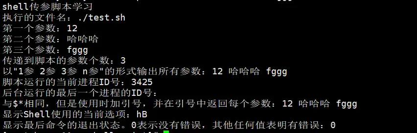

# Shell 脚本编程

阮一峰的教程：<https://wangdoc.com/bash/intro.html>

菜鸟教程|Shell 教程：[Shell 教程 | 菜鸟教程 (runoob.com)](https://www.runoob.com/linux/linux-shell.html)

[💯 前端要学会自己写shell脚本，让你的项目看起来非常牛逼！💯 - 掘金 (juejin.cn)](https://juejin.cn/post/7350571075547938866)

健壮 Shell 脚本编写指南：https://liujiacai.net/blog/2024/04/05/robust-shell-scripting/

bash教程：[Bash 脚本教程 - 网道 (wangdoc.com)](https://wangdoc.com/bash/)

## 第一个 shell 脚本

shell 常用的有 sh、bash，它的二进制文件路径通常是`/bin/sh`、`/bin/bash`，Unix 下两者一样。

如**Bourne Shell（/usr/bin/sh 或/bin/sh）**，又如**Bourne Again Shell（/bin/bash）**
由于**Bourne Again Shell（/bin/bash）**免费且易用，故使用较多。

对应的脚本文件后缀名为**.sh**。

**注：**

- #! 告诉系统其后路径所指定的程序即是解释此脚本文件的 Shell 程序。如**#!/bin/sh**，**#!/bin/bash**，通常放于脚本文件首行。

————————————————————————————————————————

step1: 创建 shell 脚本：打开文本编辑器，新建一个文件，扩展名为 sh（sh 代表 shell），扩展名并不影响脚本执行，见名知意就好。

step2: 编写：输入一些代码，第一行一般是这样：

```bash
#!/bin/bash
echo "Hello World !"
```

"#!"是一个约定的标记，它告诉系统这个脚本需要什么解释器来执行。
echo 命令用于向窗口输出文本。

step3: 运行：

1、作为可执行程序

```bash
chmod + x  test.sh
./test.sh
```

注意，一定要写成./test.sh，而不是 test.sh，要用./test.sh 告诉系统说，就在当前目录找。通过这种方式运行 bash 脚本，第一行一定要写对，好让系统查找到正确的解释器。

2、作为解释器参数

```bash
>>> sh test.sh
>>> bash test.sh
>>> php test.php
```

这种方式运行的脚本，不需要在第一行指定解释器信息，写了也没用。

运行的时候是一行一行运行的。

## shell 语法

shell 变量

定义变量时，变量名不加美元符号（$，PHP 语言中变量需要），变量名和等号之间不能有空格，如：

```bash
your_name="runoob.com"
```

使用变量：使用一个定义过的变量，只要在变量名前面加美元符号即可，如：

```bash
echo $your_name
echo ${your_name}  # 两种都行
```

### g++编译

g++是 c++的编译器，将源代码（.cpp）转为机器语言，这样 CPU 可以按给定指令执行程序。链接时 g++自动使用 C++ 标准库而不用 C 标准库。

g++参数：

- <https://www.runoob.com/cplusplus/cpp-environment-setup.html>
- <https://www.runoob.com/w3cnote/gcc-parameter-detail.html>

-o：指定可执行程序的文件名（例，生成一个 runoob 可执行文件。）

```bash
g++ runoob1.cpp runoob2.cpp -o runoob
```

g++ 有些系统默认是使用 C++98，我们可以指定使用 C++11 来编译 main.cpp 文件：

```bash
g++ -g -Wall -std=c++11 main.cpp
```

创建动态链接库（.so）

首先，生成目标文件，此时要加编译器选项-fpic

```bash
g++ -fPIC -c DynamicMath.cpp
```

fPIC 创建与地址无关的编译程序（pic，position independent code），是为了能够在多个应用程序间共享。

-fPIC ：表示编译为位置独立的代码，用于编译共享库。目标文件需要创建成位置无关码， 念上就是在可执行程序装载它们的时候，它们可以放在可执行程序的内存里的任何地方。

然后，生成动态库，此时要加链接器选项-shared

```bash
g++ -shared -o libdynmath.so DynamicMath.o
```

-shared 指定生成动态链接库。

其实上面两个步骤可以合并为一个命令：

```bash
g++ -fPIC -shared -o libdynmath.so DynamicMath.cpp
```

## shell 命令

1.shell 变量

```bash
#!/bin/bash
# 定义变量如下，变量名和等号之间不能有空格
name="变量定义"
# 变量使用，使用一个定义过的变量，只要在变量名前面加美元符号即可
echo $name
# 变量外面的花括号是为了区分边界，加不加都可以
echo ${name}  # $只在使用变量的时候加，再次赋值不加

#使用 readonly 命令可以将变量定义为只读变量，只读变量的值不能被改变。
name="哈哈哈"
readonly name
name="修改只读变量"  # 报错/bin/sh: NAME: This variable is read only.

# 使用 unset 命令可以删除变量，变量被删除后不能再次使用，unset 命令不能删除只读变量。
name="旺旺旺"
unset name  # 删除name变量
echo ${name} # 无输出

# 字符串可以使用单引号''，也可以使用双引号""，也可以不用引号
# 单引号里的任何字符都会原样输出，单引号字符串中的变量是无效的，可以用作字符串拼接使用
# 双引号里可以有变量，也可以出现转义字符
name_one='单引号'
name_one_p='单引号拼接，'${name_one}'拼接结束'
echo ${name_one_p}    # 输出：单引号拼接，单引号拼接结束
name_two="双引号"
name_two_p1="双引号拼接1，${name_two}拼接结束"
name_two_p2="双引号拼接2，"${name_two}"拼接结束"
echo ${name_two_p1} ${name_two_p2}  #输出：双引号拼接1，双引号拼接结束 双引号拼接2，双引号拼接结束

# 获取字符串长度，变量为数组时，${#arr} 等价于 ${#arr[0]}
name="哈哈哈"
echo ${#name}    # 输出：3

# 提取子字符串，从第4个字符开始提取2个字符（第一个字符的索引值为 0）
name="小不点最爱喝兽奶"
echo ${name:3:2}  # 输出：最爱

# 查找子字符串，查找字符'奶'或'爱'的位置(哪个字母先出现就计算哪个)。这个查找中文有点瑕渍，应该是字符编码问题。
name="wafenhicfsr"
echo `expr index "${name}" cf`  # 输出：3

# 数组：bash支持一维数组（不支持多维数组），并且没有限定数组的大小。
# 定义数组：用括号来表示数组，数组元素用"空格"符号分割开
arr=(v1 v2 v3 ... vn)
arr=(
  lily
  汤姆
  123
)
arr[0]=哈哈哈  # 单独定义数组的各个分量
arr[2]="123"
arr[n]="nnn"    # 可以不使用连续的下标，而且下标的范围没有限制。
# 读取数组格式 ${数组名[下标]}
arr=(lily 汤姆 123)
echo ${arr[1]}  # 输出：汤姆
# 使用 @ 符号可以获取数组中的所有元素
echo ${arr[@]} # 输出：lily 汤姆 123
# 获取数组的长度
echo ${#arr[@]}    # 取得数组元素的个数
echo ${#arr[*]}    # 取得数组元素的个数
echo ${#arr[1]}    # 取得数组单个元素的长度

# 注释，常用的都是以#为注释
:<<EOF 注释... EOF
或
:<<z 注释 z
或
:<<! 注释... !
```

2.为 shell 脚本传递参数

**脚本中以$n 获取参数, $0 为执行的文件名（包含文件路径）,$1 接受第一个参数，$2 第二个参数...，以此类推**

```bash
# 文件名./test.sh
#!/bin/bash
echo "shell传参脚本学习"
echo "执行的文件名：$0"
echo "第一个参数：$1"
echo "第二个参数：$2"
echo "第三个参数：$3"
echo "传递到脚本的参数个数：$#"
echo "以\"1参 2参 3参 n参\"的形式输出所有参数：$*"
echo "脚本运行的当前进程ID号：$$"
echo "后台运行的最后一个进程的ID号：$!"
echo "与\$*相同，但是使用时加引号，并在引号中返回每个参数：$@"
echo "显示Shell使用的当前选项：$-"
echo "显示最后命令的退出状态。0表示没有错误，其他任何值表明有错误：$?"
```

修改 test.sh 文件为可执行：chmod -x test.sh

执行 test.sh 文件：./test.sh 12 哈哈哈 fggg

执行结果如图：



3.shell 数组

Bash Shell 只支持一维数组（不支持多维数组），且各值以空格分开

```bash
# 1.普通数组
arr_ordinary=("lily" 123 "哈哈哈")  # 定义
echo ${arr_ordinary[1]}    # 访问
# 2.关联数组（与Map类似）：可以使用任意的字符串、或者整数作为下标来访问数组元素。
# 语法：declare -A array_name, -A 选项就是用于声明一个关联数组。
declare -A arr_correlation=(["name"]="lily" ["age"]=18 ["sex"]="男")
# 也可以先声明一个关联数组，然后再设置键和值
declare -A arr_declare
arr_declare["name"]="lily"
arr_declare["age"]=18
arr_declare["sex"]="男"
# 使用键来访问数组
echo ${arr_declare["name"]}
# 获取数组中所有元素，使用 @ 或 * 可以获取数组中的所有元素
echo "数组的值为: ${arr_declare[*]}"
echo "数组的值为: ${arr_declare[@]}"    # 相当于map中获取所有值value
echo "数组的键为: ${!arr_declare[*]}"
echo "数组的键为: ${!arr_declare[@]}"  # 相当于map中获取所有键
echo "数组元素个数为: ${#my_array[*]}"
echo "数组元素个数为: ${#my_array[@]}"
```

4.shell 运算符

**1.算术运算符**

```bash
a1=6
a2=2
# 1.加，+
echo `expr $a1 + $a2`  # 输出8
# 2.减，-
echo `expr $a1 - $a2`  # 输出4
# 3.乘，*
echo `expr $a1 \* $a2`  # 输出12，乘法的*前面必须加\
# 4.除，/
echo `expr $a1 / $a2`  # 输出3
# 5.取余，%
echo `expr $a1 % $a2`  # 输出0
# 6.赋值，=
a1=$a2  # 将变量a2的值赋给a1
# 7.相等，==，比较两个数字相等返回true
[ $a1 == $a2 ]  # 不能echo，不能直接使用，必须配合if或者test使用
# 8.不相等，!=，比较两个数字不相等返回true
[ $a1 != $a2 ]
```

**2.关系运算符**

关系运算符只支持数字，不支持字符串，除非字符串的值是数字。

且不能直接使用，只能配合 if 或者 test 使用

```bash
a1=2
a2=4
# 检测两个数是否相等，相等返回 true
[ $a1 -eq $a2 ]   # 返回false
# 检测两个数是否不相等，不相等返回 true
[ $a1 -ne $a2 ]   # 返回 true
# 检测左边的数是否大于右边的，如果是，则返回 true
[ $a1 -gt $a2 ]  # 返回false
# 检测左边的数是否小于右边的，如果是，则返回 true
[ $a1 -lt $a2 ]  #返回 true
# 检测左边的数是否大于等于右边的，如果是，则返回 true
[ $a1 -ge $a2 ]  #返回 false
# 检测左边的数是否小于等于右边的，如果是，则返回 true
[ $a1 -le $a2 ]  #返回 true
```

**3.布尔运算符**

```bash
a1=2
a2=4
# 非运算(!)，表达式为 true 则返回 false，否则返回 true
[ ! false ]  # 返回 true
# 或运算(-o)，有一个表达式为 true 则返回 true
[ $a1 -lt 2 -o $a2 -gt 4 ] 返回 false
# 与运算(-a)，两个表达式都为 true 才返回 true
[ $a1 -lt 2 -a $a2 -gt 4] 返回 false
```

**4.逻辑运算符**

```ruby
a1=2
a2=4
# 逻辑的 AND(&&)
[[ $a -lt 4 && $b -gt 5]]  # 返回 false
# 逻辑的 OR(||)
[[ $a -lt 4 || $b -gt 5]]  # 返回 true
```

**5.字符串运算符**

```bash
a1="hhh"
a2="ggg"
# (=)检测两个字符串是否相等，相等返回 true
[ $a1 = $a2 ]  # 返回 false
# (!=)检测两个字符串是否不相等，不相等返回 true
[ $a1 != $a2 ]  # 返回 true
# (-z)检测字符串长度是否为0，为0返回 true
[ -z $a ]  # 返回 false
# (-n)检测字符串长度是否不为 0，不为 0 返回 true
[ -n "$a" ]  # 返回 true
# ($)检测字符串是否不为空，不为空返回 true
[ $a ]  # 返回 true
```

5.shell 输出语句

- 1.echo：输出字符串，一般使用情况
- 2.printf：格式化输出字符串，功能更强，类似于 c 语言的输出
  语法为：`printf format-string [arguments...]`
  如：`printf "%-10s %-8s %-5d\n" 姓名 性别 年龄`

  6.test 命令

```bash
# 代码中的 [] 执行基本的算数运算
num1=100
num2=100
if test $[num1] -eq $[num2]  # 测出test后面的语句看shell相关运算符
then
    echo '两个数相等！'
else
    echo '两个数不相等！'
fi
```

7.流程控制语句

**1.if 语句**

```bash
# 语法如下
if condition
then
    command1
    command2
    ...
    commandN
fi
# 写成一行
if [ $(ps -ef | grep -c "ssh") -gt 1 ]; then echo "true"; fi
```

**2.if-else 语句**

```bash
# 语法如下
if condition
then
    command1
    command2
    ...
    commandN
else
    command
fi
```

**3.if-else-if-else 语句**

注：如果使用 ((...)) 作为判断语句，大于和小于可以直接使用 > 和 <

```bash
# 语法如下
if condition1
then
    command1
elif condition2
then
    command2
else
    commandN
fi
```

**4.循环语句**

```bash
# 1.for循环语法如下
for var in item1 item2 ... itemN
do
    command1
    command2
    ...
    commandN
done
# for循环示例，打印1，2，3，4，5
for item in 1 2 3 4 5
do
    echo "$item"
done

# 2.while循环语句语法
while condition
do
    command
done
# while循环示例，其中let 命令，它用于执行一个或多个表达式，变量计算中不需要加上 $ 来表示变量
value=1
while(( $value<=5 ))
do
    echo $value
    let "value++"
done

# 3.无限循环语句语法
while :
do
    command
done
# 或者
while true
do
    command
done
# 或者
for (( ; ; ))

# 4.until 循环
# 注：until 循环执行一系列命令直至条件为 true 时停止
until condition
do
    command
done
# 示例，输出 0 ~ 5 的数字
a=0
until [ ! $a -lt 5 ]
do
   echo $a
   a=`expr $a + 1`
done
```

**5.多分枝选择语句**

`注：case ... esac 为多选择语句，每个 case 分支用右圆括号开始，用两个分号 ;; 表示 break，即执行结束，跳出整个 case ... esac 语句，esac（就是 case 反过来）作为结束标记`

```bash
# 语法如下
case 值 in
模式1)
    command1
    command2
    ...
    commandN
    ;;
模式2)
    command1
    command2
    ...
    commandN
    ;;
esac
# 示例
read number  # 阻塞并读取用户输入
case $number in
  1)
  echo "用户输入了$number" ;;
  2)
  echo "用户输入了$number" ;;
  *)
  echo "相当于default执行";;
esac
```

**6.break 和 continue**

在 shell 中也是使用 break 和 continue 跳出循环，含义与其它编程语言类似

8.shell 函数

语法与 js 类似，调用方式稍有不同

```bash
# 语法如下
[ function ] funname [()]
{
    action;
    [return int;]
}
```

注：

1.可以带 function fun() 定义，也可以直接 fun() 定义,不带任何参数。

2.参数返回，可以显示加 return 返回，如果不加，将以最后一条命令运行结果，作为返回值。 return 后跟数值 n(0-255）

**\*示例及使用如下\***

```bash
# 在shell脚本中函数必须先定义后使用
# 函数定义如下
usemyshellfun(){
    echo "第一个参数为 $1 !"
    echo "第二个参数为 $2 !"
    echo "第十个参数为 $10 !"
    echo "第十个参数为 ${10} !"
    echo "第十一个参数为 ${11} !"
    echo "参数总数有 $# 个!"
    echo "作为一个字符串输出所有参数 $* !"
    return $((2+3))
}
# 调用函数并传参
usemyshellfun 1 2 3 4 5 6 7 8 9 34 73
# 注意，$10 不能获取第十个参数，获取第十个参数需要${10}。当n>=10时，需要使用${n}来获取参数。
```

9.shell 输入输出重定向

```bash
# 将输出重定向到 file
command > file
# 将输入重定向到 file
command < file
# 将输出以追加的方式重定向到 file
command >> file
# 将文件描述符为 n 的文件重定向到 file
n > file
# 将文件描述符为 n 的文件以追加的方式重定向到 file
n >> file
# 将输出文件 m 和 n 合并
n >& m
# 将输入文件 m 和 n 合并
n <& m
# 将开始标记 tag 和结束标记 tag 之间的内容作为输入
<< tag
```

一般情况下，每个 Unix/Linux 命令运行时都会打开三个文件：

- 1.标准输入文件(stdin)：stdin 的文件描述符为 0，Unix 程序默认从 stdin 读取数据。
- 2.标准输出文件(stdout)：stdout 的文件描述符为 1，Unix 程序默认向 stdout 输出数据。
- 3.标准错误文件(stderr)：stderr 的文件描述符为 2，Unix 程序会向 stderr 流中写入错误信息。

```bash
# 将错误流stderr 重定向到 file
command 2>file
# 将错误流stderr 重定向并追加到 file
command 2>>file
# 将输出流stdout 和错误流 stderr 合并后重定向到 file
command > file 2>&1
# 追加方式
command >> file 2>&1
```

另：/dev/null 文件

```bash
# /dev/null 是一个特殊的文件，写入到它的内容都会被丢弃；如果尝试从该文件读取内容，那么什么也读不到
# 将命令的输出重定向到它，会起到"禁止输出"的效果

# 如果希望执行某个命令，但又不希望在屏幕上显示输出结果
command > /dev/null
# 如果希望屏蔽 stdout 和 stderr
command > /dev/null 2>&1
```
