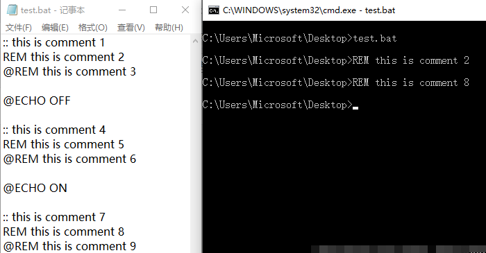
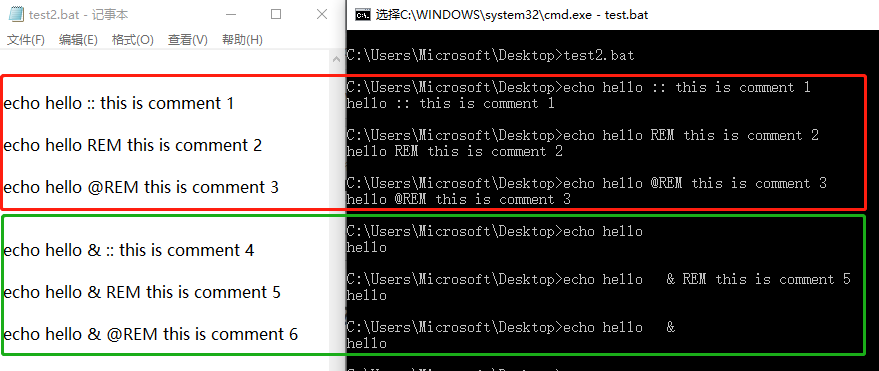
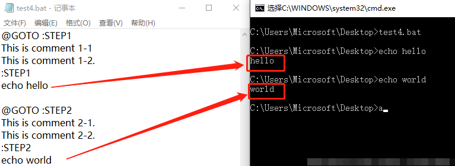

# Windows 批处理脚本教程

批处理文件是将一系列命令按一定的顺序集合为一个可执行的文本文件，其扩展名为`.bat`或者`.cmd`。这些命令统称批处理命令。

- 批处理(Batch)，也称为批处理脚本。顾名思义，批处理就是对某对象进行批量的处理，通常被认为是一种简化的脚本语言，它应用于 DOS 和 Windows 系统中。批处理文件的扩展名为 bat（或 cmd）。通常我们指定的批处理指 DOS 批处理脚本。
- DOS 批处理则是基于 DOS 命令的，用来自动地批量地执行 DOS 命令以实现特定操作的脚本。更复杂的情况，需要使用 if、for、goto 等命令控制程式的运行过程，如同 C、Python 等高级语言一样。如果需要实现更复杂的应用，利用外部程式是必要的，这包括系统本身提供的外部命令和第三方提供的工具或者软件。批处理程序虽然是在命令行环境中运行，但不仅仅能使用命令行软件，任何当前系统下可运行的程序都可以放在批处理文件中运行。

bat 会比 shell 使用简单点

小知识：可以在键盘上按下 Ctrl+C 组合键来强行终止一个批处理的执行过程。

了解了大概意思后,我们正式开始学习.先看一个简单的例子!

```bash
@echo off

echo "欢迎来到非常BAT!"

pause
```

把上面的 3 条命令保存为文件`test.bat`或者`test.cmd`然后执行

## bat 批处理的常见命令

注意，bat 脚本不区分大小写。也就是说，以下命令大写和小写都是对的。

```bash
1、REM 和 ::
2、ECHO 和 @
3、PAUSE
4、ERRORLEVEL
5、TITLE
6、COLOR
7、mode 配置系统设备
8、GOTO 和 :
9、FIND
10、START
11、assoc 和 ftype
12、pushd 和 popd
13、CALL
14、shift
15、IF
16、setlocal 与 变量延迟
17、ATTRIB  显示或更改文件属性

# 文件夹管理
cd 显示当前目录名或改变当前目录。
md 创建目录。
rd 删除一个目录。
dir 显示目录中的文件和子目录列表。
tree 以图形显示驱动器或路径的文件夹结构。
path 为可执行文件显示或设置一个搜索路径。
xcopy 复制文件和目录树。

# 文件管理
type 显示文本文件的内容。
copy 将一份或多份文件复制到另一个位置。
del 删除一个或数个文件。
move 移动文件并重命名文件和目录。(Windows XP Home Edition中没有)
ren 重命名文件。
replace 替换文件。
attrib 显示或更改文件属性。
find 搜索字符串。
fc 比较两个文件或两个文件集并显示它们之间的不同

# 网络命令
ping 进行网络连接测试、名称解析
ftp 文件传输
net 网络命令集及用户管理
telnet 远程登陆
ipconfig显示、修改TCP/IP设置
msg 给用户发送消息
arp 显示、修改局域网的IP地址-物理地址映射列表

# 系统管理
at 安排在特定日期和时间运行命令和程序
shutdown立即或定时关机或重启
tskill 结束进程
taskkill结束进程(比tskill高级，但WinXPHome版中无该命令)
tasklist显示进程列表(Windows XP Home Edition中没有)
sc 系统服务设置与控制
reg 注册表控制台工具
powercfg控制系统上的电源设置
```

======================================================

## 介绍命令

### 注释：@rem、rem 和

#### 1.添加一行注释

REM, @REM 和::的异同：

- :: 不输出注释内容
- REM 输出注释内容
- @REM 不输出注释内容

```bash
:: this is comment 1
REM this is comment 2
@REM this is comment 3
```

另外：@ECHO OFF 会关闭注释输出；@ECHO ON 则打开注释输出。

```bash
@ECHO OFF
:: this is comment 4
REM this is comment 5
@REM this is comment 6
@ECHO ON

:: this is comment 7
REM this is comment 8
@REM this is comment 9
```

执行结果：



#### 2.行尾添加注释

如何在命令后面添加注释？

错误示范：

```bash
echo hello :: this is comment 1
echo hello REM this is comment 2
echo hello @REM this is comment 3
```

正确示范：

```bash
echo hello & :: this is comment 4
echo hello & REM this is comment 5
echo hello & @REM this is comment 6
```



#### 3.行间添加注释

其实，% 注释 %放在任何地方都可以。注意：为了避免错误，%和注释之间要留有空格。

```bash
echo hello % this is a comment % world

% this is a comment %
echo hello world

% cd %
echo hello world
```

#### 4.添加多行注释

注意：@GOTO :STEP1 中冒号后面的“STEP1”是标签名，可以随便取。不过建议全部使用大写字母。

```bash
@GOTO :STEP1
This is comment 1-1
This is comment 1-2.
:STEP1
echo hello

@GOTO :STEP2
This is comment 2-1.
This is comment 2-2.
:STEP2
echo world
```



#### 5.总结

建议尽量使用下面两种符号来为.bat 批处理文件添加注释：

（1）:: 注释

（2）% 注释 %，注意：为了避免错误，%和注释之间要留有空格。

————————————————————————————————————————

当 echo 处于打开状态，也就是（echo on）时，使用 rem 注释的语言会在 BAT 运行时被打印出来，而使用@rem 注释的语言则不会打印出来。

当 echo 处于关闭状态，也就是（echo off）时，不论是 rem 还是@rem 注释的语句都不会打印出来。

当 echo 处于打开状态，而使用::注释的语言也不会打印出来。

综上，我们可以知道，当 echo 处于关闭状态，rem、@rem 和::注释的语句都不会被打印出来；而 echo 处于打开状态时，三者才有不同。

一般情况下，你可以随意使用三种注释方法。不过有时候，你也可以利用三者的不同，这时 debug 开关，使注释按照自己的意愿在需要打印时就打印出来，不需要打印时便不打印，就像下图中的代码所示（注意使用红线标记的语句）。

### 1、REM 和

REM 为注释命令，一般用来给程序加上注解，该命令后的内容不被执行，但能回显。

其次, :: 也可以起到 rem 的注释作用, 而且更简洁有效; 但有两点需要注意：

- 第一：任何以冒号:开头的字符行, 在批处理中都被视作标号, 而直接忽略其后的所有内容。
  - 有效标号：冒号后紧跟一个以字母数字开头的字符串，goto 语句可以识别。
  - 无效标号：冒号后紧跟一个非字母数字的一个特殊符号，goto 无法识别的标号，可以起到注释作用，所以 :: 常被用作注释符号，其实 :+ 也可起注释作用。
- 第 二：与 rem 不同的是, ::后的字符行在执行时不会回显, 无论是否用 echo on 打开命令行回显状态, 因为命令解释器不认为他是一个有效的命令行, 就此点来看, rem 在某些场合下将比 :: 更为适用; 另外, rem 可以用于 config.sys 文件中。

行内注释格式：%注释内容% (不常用，慎用）

### 2、ECHO 和 @

> @字符放在命令前将关闭该命令回显，无论此时 echo 是否为打开状态。

```bash
打开回显功能：echo on
关闭回显功能：echo off
输出空行：echo. 或 echo, 或 echo: 或 echo/ 等
显示当前echo状态：echo
输出提示信息：echo 信息内容
答复提问：echo 答复语|执行的操作
新建文件：echo 文件内容>文件名
新增内容：echo 文件内容>>文件名
喇叭鸣响：echo ^g
```

echo 命令的作用列举如下：

(1）打开回显或关闭回显功能

格式:echo [{ on|off }]

如果想关闭“ECHO OFF”命令行自身的显示，则需要在该命令行前加上“@”。

(2）显示当前 ECHO 设置状态

格式:echo

(3）输出提示信息

格式：ECHO 信息内容

上述是 ECHO 命令常见的三种用法，也是大家熟悉和会用的，但作为 DOS 命令淘金者你还应该知道下面的技巧：

(4）关闭 DOS 命令提示符

在 DOS 提示符状态下键入 ECHO OFF，能够关闭 DOS 提示符的显示使屏幕只留下光标，直至键入 ECHO ON，提示符才会重新出现。

(5）输出空行，即相当于输入一个回车

格式：ECHO．

值得注意的是命令行中的“．”要紧跟在 ECHO 后面中间不能有空格，否则“．”将被当作提示信息输出到屏幕。另外“．”可以用，：；”／[]＋等任一符号替代。

命令 ECHO．输出的回车，经 DOS 管道转向可以作为其它命令的输入，比如 echo.|time 即相当于在 TIME 命令执行后给出一个回车。所以执行时系统会在显示当前时间后，自动返回到 DOS 提示符状态

(6）答复命令中的提问

格式：ECHO 答复语|命令文件名

上述格式可以用于简化一些需要人机对话的命令(如：CHKDSK／F；FORMAT Drive:；del .）的操作，它是通过 DOS 管道命令把 ECHO 命令输出的预置答复语作为人机对话命令的输入。

下面的例子就相当于在调用的命令出现人机对话时输入“Y”回车：

C:>ECHO Y|CHKDSK/F
C:>ECHO Y|DEL A :.

(7）建立新文件或增加文件内容

格式：ECHO 文件内容>文件名

```bash
ECHO 文件内容>>文件名
```

例如：

```bash
C:>ECHO @ECHO OFF>AUTOEXEC.BAT建立自动批处理文件

C:>ECHO C:\CPAV\BOOTSAFE>>AUTOEXEC.BAT向自动批处理文件中追加内容

C:>TYPE AUTOEXEC.BAT显示该自动批处理文件

@ECHO OFF

C:\CPAV\BOOTSAFE
```

(8）向打印机输出打印内容或打印控制码

格式：ECHO 打印机控制码>;PRN

ECHO 打印内容>;PRN

下面的例子是向 M－1724 打印机输入打印控制码。＜ Alt ＞ 156 是按住 Alt 键在小键盘键入 156，类似情况依此类推：

```bash
C:>ECHO +156+42+116>;PRN(输入下划线命令FS＊t）

C:>ECHO [email=+155@]+155@>;PRN[/email](输入初始化命令ESC@）

C:>ECHO.>;PRN(换行）
```

(9）使喇叭鸣响

C:>ECHO ^G

“G”是在 dos 窗口中用 Ctrl ＋ G 或 Alt ＋ 007 输入，输入多个 G 可以产生多声鸣响。使用方法是直接将其加入批处理文件中或做成批处理文件调用。

这里的“^G”属于特殊符号的使用，请看本文后面的章节

### 3、PAUSE

> 使当前程序暂停，并输出以下内容，作用是为了让我们知道程序运行到哪步了。
> 显示其他提示语：`echo 其他提示语 & pause > nul`

在这里就是停止系统命令的执行并显示下面的内容。

例：

```bash
PAUSE
```

运行显示：

请按任意键继续. . .

要显示其他提示语，可以这样用：

```bash
Echo 其他提示语 & pause > nul
```

### 4、errorlevel

获取程序返回码：

```bash
echo %errorlevel%
```

每个命令运行结束，可以用这个命令行格式查看返回码

用于判断刚才的命令是否执行成功

默认值为 0，一般命令执行出错会设 errorlevel 为 1

### 5、title

设置 cmd 窗口的标题

```bash
title 专用窗口       # 可以看到cmd窗口的标题栏变了
```

### 6、color

设置默认的控制台前景和背景颜色。

```bash
COLOR [attr]
color 前景色 背景色
```

attr 指定控制台输出的颜色属性

颜色属性由两个十六进制数字指定 – 第一个为背景，第二个则为前景。每个数字可以为以下任何值之一:

```bash
0 = 黑色 8 = 灰色
1 = 蓝色 9 = 淡蓝色
2 = 绿色 A = 淡绿色
3 = 湖蓝色 B = 淡浅绿色
4 = 红色 C = 淡红色
5 = 紫色 D = 淡紫色
6 = 黄色 E = 淡黄色
7 = 白色 F = 亮白色
```

颜色数字值表格展示

| 数值 | 颜色   | 数值 | 颜色   |
| ---- | ------ | ---- | ------ |
| 0    | ⿊⾊   | 8    | 灰⾊   |
| 1    | 蓝⾊   | 9    | 淡蓝⾊ |
| 2    | 绿⾊   | A    | 淡绿⾊ |
| 3    | 湖蓝⾊ | B    | 浅绿⾊ |
| 4    | 红⾊   | C    | 淡红⾊ |
| 5    | 紫⾊   | D    | 淡紫⾊ |
| 6    | 黄⾊   | E    | 淡黄⾊ |
| 7    | 白⾊   | F    | 亮白⾊ |

如果没有给定任何参数，该命令会将颜色还原到 CMD.EXE 启动时的颜色。这个值来自当前控制台窗口、/T 开关或 DefaultColor 注册表值。

如果用相同的前景和背景颜色来执行 COLOR 命令，COLOR 命令会将 ERRORLEVEL 设置为 1。

例如: “COLOR fc” 在亮白色上产生亮红色

### 7、mode 配置系统设备

配置系统设备。

```bash
串行口:　　　 MODE COMm[:] [BAUD=b] [PARITY=p] [DATA=d] [STOP=s]
[to=on|off] [xon=on|off] [odsr=on|off]
[octs=on|off] [dtr=on|off|hs]
[rts=on|off|hs|tg] [idsr=on|off]
设备状态: MODE [device] [/STATUS]
打印重定向:　　 MODE LPTn[:]=COMm[:]
选定代码页:　　 MODE CON[:] CP SELECT=yyy
代码页状态:　　 MODE CON[:] CP [/STATUS]
显示模式:　　 MODE CON[:] [COLS=c] [LINES=n]
击键率:　 MODE CON[:] [RATE=r DELAY=d]
```

例子：

```bash
mode con cols=113 lines=15 & color 9f
```

此命令设置 DOS 窗口大小：15 行，113 列

### 8、GOTO 和

通过`goto`和`:标号`可以实现跳转执行命令。

在批处理中允许以“:XXX”来构建一个标号，然后用 GOTO XXX 跳转到标号:XXX 处，然后执行标号后的命令。

例：

```bash
if {%1}=={} goto noparms
if "%2"=="" goto noparms
```

标签的名字可以随便起，但是最好是有意义的字符串啦，前加个冒号用来表示这个字符串是标签，goto 命令就是根据这个冒号(:）来寻找下一步跳到到那里。最好有一些说明这样你别人看起来才会理解你的意图啊。

例：

```bash
@echo off
:start
set /a var+=1
echo %var%
if %var% leq 3 GOTO start
pause
```

运行显示：

```bash
1
2
3
4
```

### 9、find

在文件中搜索字符串。

```bash
FIND [/V] [/C] [/N] [/I] [/OFF[LINE]] “string” [[drive:][path]filename[ …]]
```

- /V 显示所有未包含指定字符串的行。
- /C 仅显示包含字符串的行数。
- /N 显示行号。
- /I 搜索字符串时忽略大小写。
- /OFF[LINE] 不要跳过具有脱机属性集的文件。
- “string” 指定要搜索的文字串，
- `[drive:][path]filename`：指定要搜索的文件。如果没有指定路径，FIND 将搜索键入的或者由另一命令产生的文字。
-

Find 常和 type 命令结合使用

```bash
Type [drive:][path]filename | find “string” [>tmpfile] #挑选包含string的行
Type [drive:][path]filename | find /v “string” #剔除文件中包含string的行
Type [drive:][path]filename | find /c #显示文件行数
```

以上用法将去除 find 命令自带的提示语(文件名提示）

例：

```bash
@echo off
echo 111 >test.txt
echo 222 >>test.txt
find "111" test.txt
del test.txt
pause
```

运行显示如下：

---------- TEST.TXT
111

请按任意键继续. . .

例：

```bash
@echo off
echo 111 >test.txt
echo 222 >>test.txt
type test.txt|find "111"
del test.txt
pause
```

运行显示如下：

111

请按任意键继续. . .

### 10、start 命令

批处理中调用外部程序的命令(该外部程序在新窗口中运行，批处理程序继续往下执行，不理会外部程序的运行状况），如果直接运行外部程序则必须等外部程序完成后才继续执行剩下的指令

例：

```bash
start explorer d:\
```

调用图形界面打开 D 盘

### 11、assoc 和 ftype

文件关联

- assoc 设置’文件扩展名’关联，关联到’文件类型’
- ftype 设置’文件类型’关联，关联到’执行程序和参数’

当你双击一个.txt 文件时，windows 并不是根据.txt 直接判断用 notepad.exe 打开，而是先判断.txt 属于 txtfile ‘文件类型’

再调用 txtfile 关联的命令行 txtfile=%SystemRoot%\system32\NOTEPAD.EXE %1

可以在"文件夹选项"→"文件类型"里修改这 2 种关联

```bash
assoc #显示所有’文件扩展名’关联
assoc .txt #显示.txt代表的’文件类型’，结果显示 .txt=txtfile
assoc .doc #显示.doc代表的’文件类型’，结果显示 .doc=Word.Document.8
assoc .exe #显示.exe代表的’文件类型’，结果显示 .exe=exefile
ftype #显示所有’文件类型’关联
ftype exefile #显示exefile类型关联的命令行，结果显示 exefile=“%1” %*
assoc .txt=Word.Document.8
```

设置.txt 为 word 类型的文档，可以看到.txt 文件的图标都变了

assoc .txt=txtfile

恢复.txt 的正确关联

ftype exefile=“%1” %\*

恢复 exefile 的正确关联

如果该关联已经被破坏，可以运行 command.com ，再输入这条命令

### 12、pushd 和 popd

切换当前目录

```bash
@echo off
c: & cd\ & md mp3       #在 C:\ 建立 mp3 文件夹
md d:\mp4               #在 D:\ 建立 mp4 文件夹
cd /d d:\mp4            #更改当前目录为 d:\mp4
pushd c:\mp3            #保存当前目录，并切换当前目录为 c:\mp3
popd                    #恢复当前目录为刚才保存的 d:\mp4
```

一般用处不大，在当前目录名不确定时，会有点帮助。(dos 编程中很有用）

### 13、CALL

CALL 命令可以在批处理执行过程中调用另一个批处理，当另一个批处理执行完后，再继续执行原来的批处理

```bash
CALL command
```

调用一条批处理命令，和直接执行命令效果一样，特殊情况下很有用，比如变量的多级嵌套，见教程后面。

在批处理编程中，可以根据一定条件生成命令字符串，用 call 可以执行该字符串，见例子。

```bash
CALL [drive:][path]filename [batch-parameters]
```

调用的其它批处理程序。filename 参数必须具有 .bat 或 .cmd 扩展名。`

```bash
CALL :label arguments
```

调用本文件内命令段，相当于子程序。被调用的命令段以标签:label 开头

以命令 goto :eof 结尾。

另外，批脚本文本参数参照(%0、%1、等等)已如下改变:

批脚本里的 %\* 指出所有的参数(如 %1 %2 %3 %4 %5 …)

批参数(%n)的替代已被增强。您可以使用以下语法:(看不明白的直接运行后面的例子）

```bash
%~1 - 删除引号(")，扩充 %1
%~f1 - 将 %1 扩充到一个完全合格的路径名
%~d1 - 仅将 %1 扩充到一个驱动器号
%~p1 - 仅将 %1 扩充到一个路径
%~n1 - 仅将 %1 扩充到一个文件名
%~x1 - 仅将 %1 扩充到一个文件扩展名
%~s1 - 扩充的路径指含有短名
%~a1 - 将 %1 扩充到文件属性
%~t1 - 将 %1 扩充到文件的日期/时间
%~z1 - 将 %1 扩充到文件的大小
%~PATH:1−查找列在PATH环境变量的目录，并将PATH:1 - 在列在 PATH 环境变量中的目录里查找 %1，并扩展到找到的第一个文件的驱动器号和路径。
%~ftza1 - 将 %1 扩展到类似 DIR 的输出行。
```

在上面的例子中，%1 和 PATH 可以被其他有效数值替换。

%~ 语法被一个有效参数号码终止。%~ 修定符不能跟 %\*使用

注意：参数扩充时不理会参数所代表的文件是否真实存在，均以当前目录进行扩展。

要理解上面的知识，下面的例子很关键。

例：

```bash
@echo off
Echo 产生一个临时文件 > tmp.txt
Rem 下行先保存当前目录，再将c:\windows设为当前目录
pushd c:\windows
Call :sub tmp.txt
Rem 下行恢复前次的当前目录
Popd
Call :sub tmp.txt
pause
Del tmp.txt
exit
:sub
Echo 删除引号： %~1
Echo 扩充到路径： %~f1
Echo 扩充到一个驱动器号： %~d1
Echo 扩充到一个路径： %~p1
Echo 扩充到一个文件名： %~n1
Echo 扩充到一个文件扩展名： %~x1
Echo 扩充的路径指含有短名： %~s1
Echo 扩充到文件属性： %~a1
Echo 扩充到文件的日期/时间： %~t1
Echo 扩充到文件的大小： %~z1
Echo 扩展到驱动器号和路径：%~dp1
Echo 扩展到文件名和扩展名：%~nx1
Echo 扩展到类似 DIR 的输出行：%~ftza1
Echo.
Goto :eof
例：
set aa=123456
set cmdstr=echo %aa%
call %cmdstr%
pause
```

本例中如果不用 call，而直接运行%cmdstr%，将显示结果%aa%，而不是 123456

### 14、shift

更改批处理文件中可替换参数的位置。

SHIFT [/n]

如果命令扩展名被启用，SHIFT 命令支持/n 命令行开关；该命令行开关告诉命令从第 n 个参数开始移位；n 介于零和八之间。

例如:

SHIFT /2

会将 %3 移位到 %2，将 %4 移位到 %3，等等；并且不影响 %0 和 %1。

15、IF

IF 条件判断语句，语法格式如下：

IF [NOT] ERRORLEVEL number command
IF [NOT] string1==string2 command
IF [NOT] EXIST filename command

下面逐一介绍，更详细的分析请看后面章节。

(1) IF [NOT] ERRORLEVEL number command

IF ERRORLEVEL 这个句子必须放在某一个命令的后面，执行命令后由 IF ERRORLEVEL 来判断命令的返回值。

Number 的数字取值范围 0~255，判断时值的排列顺序应该由大到小。返回的值大于等于指定的值时，条件成立

例：

```bash
@echo off
dir c:
rem退出代码为>=1就跳至标题1处执行，>=0就跳至标题0处执行
IF ERRORLEVEL 1 goto 1
IF ERRORLEVEL 0 goto 0
Rem 上面的两行不可交换位置，否则失败了也显示成功。
:0
echo 命令执行成功！
Rem 程序执行完毕跳至标题exit处退出
goto exit
:1
echo 命令执行失败！
Rem 程序执行完毕跳至标题exit处退出
goto exit
:exit
pause
```

运行显示：命令执行成功！

(2) IF [NOT] string1string2 command

string1 和 string2 都为字符的数据，英文内字符的大小写将看作不同，这个条件中的等于号必须是两个(绝对相等的意思）

条件相等后即执行后面的 command

检测当前变量的值做出判断，为了防止字符串中含有空格，可用以下格式

```bash
if [NOT] {string1}{string2} command
if [NOT] [string1][string2] command
if [NOT] "string1"“string2” command
```

这种写法实际上将括号或引号当成字符串的一部分了，只要等号左右两边一致就行了，比如下面的写法就不行：

if {string1}==[string2] command

(3) IF [NOT] EXIST filename command

EXIST filename 为文件或目录存在的意思

```bash
echo off
IF EXIST autoexec.bat echo 文件存在！
IF not EXIST autoexec.bat echo 文件不存在！
```

这个批处理大家可以放在 C 盘和 D 盘分别执行，看看效果

16、setlocal 与 变量延迟

本条内容引用[英雄出品]的批处理教程：

要想进阶，变量延迟是必过的一关！所以这一部分希望你能认真看。

为了更好的说明问题，我们先引入一个例子。

例 1:

@echo off
set a=4
set a=5 & echo %a%
pause
1
2
3
4

结果：4

解说：为什么是 4 而不是 5 呢？在 echo 之前明明已经把变量 a 的值改成 5 了？

让我们先了解一下批处理运行命令的机制：

批 处理读取命令时是按行读取的(另外例如 for 命令等，其后用一对圆括号闭合的所有语句也当作一行），在处理之前要完成必要的预处理工作，这其中就包括对该 行命令中的变量赋值。我们现在分析一下例 1，批处理在运行到这句“set a=5 & echo %a%”之前，先把这一句整句读取并做了预处理——对变量 a 赋了值，那么%a%当然就是 4 了！(没有为什么，批处理就是这样做的。）

而为了能够感知环境变量的动态变化，批处理设计了变量延迟。简单来说，在读取了一条完整的语句之后，不立即对该行的变量赋值，而会在某个单条语句执行之前再进行赋值，也就是说“延迟”了对变量的赋值。

那么如何开启变量延迟呢？变量延迟又需要注意什么呢？举个例子说明一下：

例 2:

@echo off
setlocal enabledelayedexpansion
set a=4
set a=5 & echo !a!
pause
1
2
3
4
5

结果：5

解说：启动了变量延迟，得到了正确答案。变量延迟的启动语句是“setlocal

enabledelayedexpansion”，并且变量要用一对叹号“!!”括起来(注意要用英文的叹号），否则就没有变量延迟的效果。

分析一下例 2，首先“setlocal enabledelayedexpansion”开启变量延迟，然后“set a=4”先给变量 a 赋值为

4，“set a=5 & echo !a!”这句是给变量 a 赋值为 5 并输出(由于启动了变量延迟，所以批处理能够感知到动态变化，即不是先给该行变量赋值，而是在运行过程中给变量赋值，因此此时 a 的值就是 5 了）。

再举一个例子巩固一下。

例 3:

@echo off
setlocal enabledelayedexpansion
for /l %%i in (1,1,5) do (
set a=%%i
echo !a!
)
pause
1
2
3
4
5
6
7
结果：
1
2
3
4
5

解说：本例开启了变量延迟并用“!!”将变量扩起来，因此得到我们预期的结果。如果不用变量延迟会出现什么结果呢？结果是这样的：

ECHO 处于关闭状态。
ECHO 处于关闭状态。
ECHO 处于关闭状态。
ECHO 处于关闭状态。
ECHO 处于关闭状态。

即没有感知到 for 语句中的动态变化。

提示：在没有开启变量延迟的情况下，某条命令行中的变量改变，必须到下一条命令才能体现。这一点也可以加以利用，看例子。

例：交换两个变量的值，且不用中间变量

```bash
@echo off
::目的：交换两个变量的值，但是不使用临时变量
::Code by JM 2007-1-24 [email=CMD@XP]CMD@XP[/email]
::出处：<http://www.cn-dos.net/forum/viewthread.php?tid=27078>
set var1=abc
set var2=123
echo 交换前： var1=%var1% var2=%var2%
set var1=%var2%& set var2=%var1%
echo 交换后： var1=%var1% var2=%var2%
pause
```

17、ATTRIB 显示或更改文件属性

ATTRIB [+R|-R] [+A|-A] [+S|-S] [+H|-H] [[drive:] [path] filename] [/S [/D]]

设置属性。
清除属性。
R 只读文件属性。
A 存档文件属性。
S 系统文件属性。
H 隐藏文件属性。

`[drive:][path][filename]`：指定要处理的文件属性。

/S 处理当前文件夹及其子文件夹中的匹配文件。

/D 也处理文件夹。

例：

```bash
md autorun
attrib +a +s +h autorun
```

上面的命令将建立文件夹 autorun，然后将其设为存档、系统、隐藏属性

＝＝＝＝＝＝＝＝＝＝＝＝＝＝＝＝＝＝＝＝＝＝＝＝＝＝＝＝＝＝＝＝＝＝＝＝＝＝＝＝＝＝＝＝＝＝＝＝＝＝

## 第二节 常用特殊符号

```bash
1、@ 命令行回显屏蔽符
2、% 批处理变量引导符
3、> 重定向符
4、>> 重定向符
5、<、>&、<& 重定向符
6、| 命令管道符
7、^ 转义字符
8、& 组合命令
9、&& 组合命令
10、|| 组合命令
11、“” 字符串界定符
12、, 逗号
13、; 分号
14、() 括号
15、! 感叹号
16、批处理中可能会见到的其它特殊标记符: (略）
```

CR(0D) 命令行结束符

Escape(1B) ANSI 转义字符引导符

Space(20) 常用的参数界定符

Tab(09) ; = 不常用的参数界定符

- COPY 命令文件连接符

```bash
* ? 文件通配符
- / 参数开关引导符
- : 批处理标签引导符
```

废话少说，开讲了

### 1、@ 命令行回显屏蔽符

这个字符在批处理中的意思是关闭当前行的回显。我们从前几课知道

ECHO OFF 可以关闭掉整个批处理命令的回显，但不能关掉 ECHO OFF 这个命令，现在我们在 ECHO OFF 这个命令前加个@，就可以达到所有命令均不回显的要求

### 2、% 批处理变量引导符

这个百分号严格来说是算不上命令的，它只是批处理中的参数而已(多个%一起使用的情况除外，以后还将详细介绍）。

引用变量用%var%，调用程序外部参数用%1 至%9 等等

%0 %1 %2 %3 %4 %5 %6 %7 %8 %9 %为命令行传递给批处理的参数

%0 批处理文件本身，包括完整的路径和扩展名

%1 第一个参数

%9 第九个参数

% 从第一个参数开始的所有参数

参数%0 具有特殊的功能，可以调用批处理自身，以达到批处理本身循环的目的，也可以复制文件自身等等。

例：最简单的复制文件自身的方法

copy %0 d:\wind.bat

小技巧：添加行内注释

%注释内容%(可以用作行内注释，不能出现重定向符号和管道符号）

为什么这样呢？此时“注释内容”其实被当作变量，其值是空的，故只起注释作用，不过这种用法容易出现语法错误，一般不用。

### 3、> 重定向符

输出重定向命令

DOS 的标准输入输出通常是在标准设备键盘和显示器上进行的，利用重定向,可以方便地将输入输出改向磁盘文件或其它设备。其中:

1.大于号“>”将命令发送到文件或设备，例如打印机>prn。使用大于号“>”时，有些命令输出(例如错误消息)不能重定向。

2.双大于号“>>”将命令输出添加到文件结尾而不删除文件中已有的信息。

3.小于号“<”从文件而不是键盘上获取命令所需的输入。

4.>&符号将输出从一个默认 I/O 流(stdout,stdin,stderr)重新定向到另一个默认 I/O 流。

例如，command >output_file 2>&1 将处理 command 过程中的所有错误信息从屏幕重定向到标准文件输出中。标准输出的数值如下所示：

命令重定向的标准句柄

句柄名称 值 说明

STDIN 0 标准输入，发送自键盘

STDUOT 1 标准输出，发送到命令 Shell 窗口

STDERR 2 标准错误输出，发送到命令 Shell 窗口

UNDEFINED 3~9 特定于应用程序的句柄

这个字符的意思是传递并且覆盖，他所起的作用是将运行的结果传递到后面的范围(后边可以是文件，也可以是默认的系统控制台）

在 NT 系列命令行中，重定向的作用范围由整个命令行转变为单个命令语句，受到了命令分隔符&,&&,||和语句块的制约限制。

比如：

使用命令：echo hello >1.txt 将建立文件 1.txt，内容为”hello “(注意行尾有一空格）

使用命令：echo hello>1.txt 将建立文件 1.txt，内容为”hello“(注意行尾没有空格）：

具体重定向实例请看我的另外一篇文章：DOS 的重定向命令及在安全方面的应用

### 4、>> 重定向符

输出重定向命令

这个符号的作用和>有点类似，但他们的区别是>>是传递并在文件的末尾追加，而>是覆盖
用法同上

同样拿 1.txt 做例子

使用命令：

echo hello > 1.txt
echo world >>1.txt

这时候 1.txt 内容如下:

hello
world

### 5、<、>&、<& 重定向符

这三个命令也是管道命令，但它们一般不常用，你只需要知道一下就 ok 了，当然如果想仔细研究的话，可以自己查一下资料。(本人已查过，网上也查不到相关资料)

<，输入重定向命令，从文件中读入命令输入，而不是从键盘中读入。

@echo off
echo 2005-05-01>temp.txt
date <temp.txt
del temp.txt

这样就可以不等待输入直接修改当前日期

&，将一个句柄的输出写入到另一个句柄的输入中。

<&，刚好和>&相反，从一个句柄读取输入并将其写入到另一个句柄输出中。

常用句柄：0、1、2，未定义句柄：3—9

1>nul 表示禁止输出正确的信息

2>nul 表示禁止输出错误信息。

其中的 1 与 2 都是代表某个数据流输入输出的地址(NT CMD 称之为句柄，MSDOS 称之为设备）。

句柄 0：标准输入 stdin，键盘输入

句柄 1：标准输出 stdout，输出到命令提示符窗口(console，代码为 CON）

句柄 2：标准错误 stderr，输出到命令提示符窗口(console，代码为 CON）

其中的 stdin 可被<重定向，stdout 可被>、>>重定向。

我们已经知道读取文本中的内容可以用 for 命令，但如果只需要读取第一行用 for 命令就有点麻烦。简单的办法如下:

@echo off
set /p str=<%0
echo %str%
pause

运行显示批处理文件自身的第一行：@echo off

### 6、| 命令管道符

格式：第一条命令 | 第二条命令 [| 第三条命令…]

将第一条命令的结果作为第二条命令的参数来使用，记得在 unix 中这种方式很常见。
例如：

dir c:|find “txt”

以上命令是：查找 C：\所有，并发现 TXT 字符串。

FIND 的功能请用 FIND /? 自行查看

在不使 format 的自动格式化参数时，我是这样来自动格式化 A 盘的

echo y|format a: /s /q /v:system

用过 format 的都知道，再格盘时要输入 y 来确认是否格盘，这个命令前加上 echo y 并用|字符来将 echo y 的结果传给 format 命令

从而达到自动输入 y 的目的

(这条命令有危害性，测试时请慎重）

### 7、^ 转义字符

^是对特殊符号<,>,&的前导字符，在命令中他将以上 3 个符号的特殊功能去掉，仅仅只把他们当成符号而不使用他们的特殊意义。

比如

echo test ^>1.txt

结果则是：test > 1.txt

他没有追加在 1.txt 里，呵呵。只是显示了出来

另外，此转义字符还可以用作续行符号。

举个简单的例子：

@echo off
echo 英雄^
是^
好^
男人
pause

不用多说，自己试一下就明白了。

为什么转义字符放在行尾可以起到续行符的作用呢？原因很简单，因为每行末尾还有一个看不见的符号，即回车符，转义字符位于行尾时就让回车符失效了，从而起到了续行的作用。

### 8、& 组合命令

语法：第一条命令 & 第二条命令 [& 第三条命令…]

&、&&、||为组合命令，顾名思义，就是可以把多个命令组合起来当一个命令来执行。这在批处理脚本里是允许的，而且用的非常广泛。因为批处理认行不认命令数目。

这个符号允许在一行中使用 2 个以上不同的命令，当第一个命令执行失败了，也不影响后边的命令执行。

这里&两边的命令是顺序执行的，从前往后执行。

比如：

dir z:\ & dir y:\ & dir c:\

以上命令会连续显示 z,y,c 盘的内容，不理会该盘是否存在

### 9、&& 组合命令

语法：第一条命令 && 第二条命令 [&& 第三条命令…]

用这种方法可以同时执行多条命令，当碰到执行出错的命令后将不执行后面的命令，如果一直没有出错则一直执行完所有命令

这个命令和上边的类似，但区别是，第一个命令失败时，后边的命令也不会执行

dir z:\ && dir y:\ && dir c:\

### 10、|| 组合命令

语法：第一条命令 || 第二条命令 [|| 第三条命令…]

用这种方法可以同时执行多条命令，当一条命令失败后才执行第二条命令，当碰到执行正确的命令后将不执行后面的命令，如果没有出现正确的命令则一直执行完所有命令；

提示：组合命令和重定向命令一起使用必须注意优先级

管道命令的优先级高于重定向命令，重定向命令的优先级高于组合命令

问题：把 C 盘和 D 盘的文件和文件夹列出到 a.txt 文件中。看例：

dir c:\ && dir d:\ > a.txt

这 样执行后 a.txt 里只有 D 盘的信息！为什么？因为组合命令的优先级没有重定向命令的优先级高！所以这句在执行时将本行分成这两部分：dir c:\和 dir d:\ > a.txt，而并不是如你想的这两部分：dir c:\ && dir d:\和> a.txt。要使用组合命令&&达到题目的要求，必须得这么写：

dir c:\ > a.txt && dir d:\ >> a.txt

这样，依据优先级高低，DOS 将把这句话分成以下两部分：dir c:\ > a.txt 和 dir d:\ >> a.txt。例十八中的几句的差别比较特殊，值得好好研究体会一下。

当然这里还可以利用&命令(自己想一下道理哦）：

dir c:\ > a.txt & dir d:\ >> a.txt

[这个也可以用 dir c:;d:\ >>a.txt 来实现]

### 11、“” 字符串界定符

双引号允许在字符串中包含空格，进入一个特殊目录可以用如下方法

cd "program files"
cd progra~1
cd pro\*

以上三种方法都可以进入 program files 这个目录

### 12、, 逗号

逗号相当于空格，在某些情况下“,”可以用来当做空格使

比如

dir,c:\

### 13、; 分号

分号，当命令相同时，可以将不同目标用；来隔离，但执行效果不变，如执行过程中发生错误，则只返回错误报告，但程序仍会执行。(有人说不会继续执行，其实测试一下就知道了，只不过它的执行有个规则，请看下面的规则）

比如：

dir c:;d:;e:;z:

以上命令相当于

dir c:
dir d:
dir e:
dir f:

如果其中 z 盘不存在，运行显示：系统找不到指定的路径。然后终止命令的执行。
例：dir c:;d:;e:\1.txt

以上命令相当于
dir c:
dir d:
dir e:\1.txt
其中文件 e:\1.txt 不存在，但 e 盘存在，有错误提示，但命令仍会执行。

规则：(我是在操作系统是 XP SP3,英文版下测试的) 1.如果目标路径不存在，则整个语句都不执行，例如 dir c:;c:\dfdfdf\a.txt，则根本不会执行，因为我没有 c:\dfdfdf\这个目录； 2.如果路径存在，仅文件不存在，则会继续执行，并且提示文件不存在的错误，例如：dir c:;c:\temp\a.txt，我的目录中有 c:\temp\文件夹，但这个目录下面没有 1.txt 这个文件。
就说这些了!各位有什么意见请回贴!有什么疑问请到 BAT 交流区发贴!下一节改进!

### 14、() 括号

小括号在批处理编程中有特殊的作用，左右括号必须成对使用，括号中可以包括多行命令，这些命令将被看成一个整体，视为一条命令行。
括号在 for 语句和 if 语句中常见，用来嵌套使用循环或条件语句，其实括号()也可以单独使用，请看例子。
例：
命令：echo 1 & echo 2 & echo 3
可以写成：
(
echo 1
echo 2
echo 3
)
上面两种写法效果一样，这两种写法都被视为是一条命令行。
注意：这种多条命令被视为一条命令行时，如果其中有变量，就涉及到变量延迟的问题。

### 15、! 感叹号

没啥说的，在变量延迟问题中，用来表示变量，即%var%应该表示为!var!，请看前面的 setlocal 命令介绍。

＝＝＝＝＝＝＝＝＝＝＝＝＝＝＝＝＝＝＝＝＝＝＝＝＝＝＝＝＝＝＝＝＝＝＝＝＝＝＝＝＝＝＝＝＝＝＝＝＝＝

## 第二章 DOS 循环：for 命令详解

讲 FOR 之前呢,咋先告诉各位新手朋友,如果你有什么命令不懂,直接在 CMD 下面输入:

name /? 这样的格式来看系统给出的帮助文件,比如 for /? 就会把 FOR 命令的帮助全部显示出来!当然许多菜鸟都看不懂…所以才会有那么多批处理文章!!!俺也照顾菜鸟,把 FOR 命令用我自己的方式说明下!

正式开始:

### 一、基本格式

FOR %%variable IN (set) DO command [command-parameters]

%%variable 指定一个单一字母表示可替换的参数。
(set) 指定一个或一组文件。可以使用通配符。
command 指定对每个文件执行的命令。
command-parameters
为特定命令指定参数或命令行开关。

参数:FOR 有 4 个参数 /d /l /r /f 他们的作用我在下面用例子解释

现在开始讲每个参数的意思

### 二、参数 /d

FOR /D %%variable IN (set) DO command [command-parameters]

如果集中包含通配符，则指定与目录名匹配，而不与文件名匹配。

如果 Set (也就是我上面写的 “相关文件或命令”) 包含通配符(\* 和 ?），将对与 Set 相匹配的每个目录(而不是指定目录中的文件组）执行指定的 Command。

这个参数主要用于目录搜索,不会搜索文件,看这样的例子

@echo off
for /d %%i in (c:\*) do echo %%i
pause

运行会把 C 盘根目录下的全部目录名字打印出来,而文件名字一个也不显示!

在来一个,比如我们要把当前路径下文件夹的名字只有 1-3 个字母的打出来

@echo off
for /d %%i in (???) do echo %%i
pause

这样的话如果你当前目录下有目录名字只有 1-3 个字母的,就会显示出来,没有就不显示了
这里解释下*号和?号的作用,*号表示任意 N 个字符,而?号只表示任意一个字符

知道作用了,给大家个思考题目!

@echo off
for /d %%i in (window?) do echo %%i
pause

保存到 C 盘下执行,会显示什么呢?自己看吧! 显示：windows

/D 参数只能显示当前目录下的目录名字,这个大家要注意!

### 三、参数 /R

FOR /R [[drive:]path] %%variable IN (set) DO command [command-parameters]

检查以 [drive:]path 为根的目录树，指向每个目录中的 FOR 语句。如果在 /R 后没有指定目录，则使用当前

目录。如果集仅为一个单点(.)字符，则枚举该目录树。

#### 递归

上面我们知道,/D 只能显示当前路径下的目录名字,那么现在这个/R 也是和目录有关,他能干嘛呢?放心他比/D 强大多了!

他可以把当前或者你指定路径下的文件名字全部读取,注意是文件名字,有什么用看例子!

请注意 2 点：

1、set 中的文件名如果含有通配符(？或\*)，则列举/R 参数指定的目录及其下面的所用子目录中与 set 相符合的所有文件，无相符文件的目录则不列举。

2、相反，如果 set 中为具体文件名，不含通配符，则枚举该目录树(即列举该目录及其下面的所有子目录），而不管 set 中的指定文件是否存在。这与前面所说的单点(.）枚举目录树是一个道理，单点代表当前目录，也可视为一个文件。

例：

@echo off
for /r c:\ %%i in (\*.exe) do echo %%i
pause

咱们把这个 BAT 保存到 D 盘随便哪里然后执行,我会就会看到,他把 C 盘根目录,和每个目录的子目录下面全部的 EXE 文件都列出来了!!!

例：

@echo off
for /r %%i in (\*.exe) do @echo %%i
pause

参数不一样了吧!这个命令前面没加那个 C:\也就是搜索路径,这样他就会以当前目录为搜索路径,比如你这个 BAT 你把他放在 d:\test 目录下执行,那么他就会把 D:\test 目录和他下面的子目录的全部 EXE 文件列出来!!!

例：

@echo off
for /r c:\ %%i in (boot.ini) do echo %%i
pause

运行本例发现枚举了 c 盘所有目录，为了只列举 boot.ini 存在的目录，可改成下面这样：

@echo off
for /r c:\ %%i in (boot.ini) do if exist %%i echo %%i
pause

用这条命令搜索文件真不错。。。。。。

这个参数大家应该理解了吧!还是满好玩的命令!

### 四、参数 /L

FOR /L %%variable IN (start,step,end) DO command [command-parameters]
该集表示以增量形式从开始到结束的一个数字序列。

因此，(1,1,5) 将产生序列 1 2 3 4 5，(5,-1,1) 将产生序列 (5 4 3 2 1)。

使 用迭代变量设置起始值 (Start#)，然后逐步执行一组范围的值，直到该值超过所设置的终止值 (End#)。/L 将通过对 Start# 与 End# 进行比较来执行迭代变量。如果 Start# 小于 End#，就会执行该命令。如果迭代变量超过 End#，则命令解释程序退出此循环。还可以使用负的 Step# 以递减数值的方式逐步执行此范围内的值。例如，(1,1,5) 生成序列 1 2 3 4 5，而 (5,-1,1) 则生成序列 (5 4 3 2 1)。语法是：

看着这说明有点晕吧!咱们看例子就不晕了!

@echo off
for /l %%i in (1,1,5) do @echo %%i
pause

保存执行看效果,他会打印从 1 2 3 4 5 这样 5 个数字

(1,1,5)这个参数也就是表示从 1 开始每次加 1 直到 5 终止!

等会晕,就打印个数字有 P 用…好的满足大家,看这个例子

@echo off
for /l %%i in (1,1,5) do start cmd
pause

执行后是不是吓了一跳,怎么多了 5 个 CMD 窗口,呵呵!如果把那个 (1,1,5)改成 (1,1,65535)会有什么结果,我先告诉大家,会打开 65535 个 CMD 窗口…这么多你不死机算你强!

当然我们也可以把那个 start cmd 改成 md %%i 这样就会建立指定个目录了!!!名字为 1-65535
看完这个被我赋予破坏性质的参数后,我们来看最后一个参数

### 五、参数 /F

\迭代及文件解析

使用文件解析来处理命令输出、字符串及文件内容。使用迭代变量定义要检查的内容或字符串，并使用各种 options 选项进一步修改解析方式。使用 options 令牌选项指定哪些令牌应该作为迭代变量传递。请注意：在没有使用令牌选项时，/F 将只检查第一个令牌。

文件解析过程包括读取输出、字符串或文件内容，将其分成独立的文本行以及再将每行解析成零个或更多个令牌。然后通过设置为令牌的迭代变量值，调用 for 循环。默认情况下，/F 传递每个文件每一行的第一个空白分隔符号。跳过空行。

详细的帮助格式为：

FOR /F [“options”] %%variable IN (file-set) DO command [command-parameters]
FOR /F [“options”] %%variable IN (“string”) DO command [command-parameters]
FOR /F [“options”] %%variable IN (‘command’) DO command [command-parameters]

带引号的字符串"options"包括一个或多个

指定不同解析选项的关键字。这些关键字为:

eol=c - 指一个行注释字符的结尾(就一个)(备注：默认以使用；号为行首字符的为注释行)
skip=n - 指在文件开始时忽略的行数，(备注：最小为 1，n 可以大于文件的总行数，默认为 1。)

delims=xxx - 指分隔符集。这个替换了空格和跳格键的默认分隔符集。

tokens=x,y,m-n - 指每行的哪一个符号被传递到每个迭代的 for 本身。这会导致额外变量名称的分配。m-n 格式为一个范围。通过 nth 符号指定 mth。如果符号字符串中的最后一个字符星号，那么额外的变量将在最后一个符号解析之后分配并接受行的保留文本。经测试，该参数最多只能区分 31 个字段。(备注：默认为 1，则表示只显示分割后的第一列的内容，最大是 31，超过最大则无法表示)

usebackq - 使用后引号(键盘上数字 1 左面的那个键）。 未使用参数 usebackq 时：file-set 表示文件，但不能含有空格 双引号表示字符串，即"string" 单引号表示执行命令，'command' 使用参数 usebackq 时：file-set 和"file-set"都表示文件 当文件路径或名称中有空格时，就可以用双引号括起来 单引号表示字符串，即'string' 后引号表示命令执行，即 command`

以上是用 for /?命令获得的帮助信息，直接复制过来的，括号中的备注为我添加的说明。
晕惨了!我这就举个例子帮助大家来理解这些参数!

For 命令例 1：

@echo off
rem 首先建立临时文件 test.txt
echo ;注释行,这是临时文件,用完删除 >test.txt
echo 11 段 12 段 13 段 14 段 15 段 16 段 >>test.txt
echo 21 段,22 段,23 段,24 段,25 段,26 段 >>test.txt
echo 31 段-32 段-33 段-34 段-35 段-36 段 >>test.txt
FOR /F "eol=; tokens=1,3\* delims=,- " %%i in (test.txt) do echo %%i %%j %%k
Pause
Del test.txt

运行显示结果：

11 段 13 段 14 段 15 段 16 段
21 段 23 段 24 段,25 段,26 段
31 段 33 段 34 段-35 段-36 段
请按任意键继续. . .
为什么会这样?我来解释：
eol=; 分号开头的行为注释行
tokens=1,3\* 将每行第 1 段,第 3 段和剩余字段分别赋予变量%%i，%%j，%%k
delims=,- (减号后有一空格）以逗号减号和空格为分隔符，空格必须放在最后

For 命令例 2：

@echo off
FOR /F “eol= delims=” %%i in (test.txt) do echo %%i
Pause

运行将显示 test.txt 全部内容，包括注释行，不解释了哈。

For 命令例 3：

另外/F 参数还可以以输出命令的结果看这个例子

@echo off
FOR /F "delims=" %%i in ('net user') do @echo %%i
pause

这样你本机全部帐号名字就出来了把扩号内的内容用两个单引号引起来就表示那个当命令执行,FOR 会返回命令的每行结果,加那个"delims=" 是为了让我空格的行能整行显示出来,不加就只显示空格左边一列!

基本上讲完了 FOR 的基本用法了…如果你看过 FOR 的系统帮助,你会发现他下面还有一些特定义的变量,这些我先不讲.大家因该都累了吧!你不累我累啊…

所谓文武之道，一张一弛，现休息一下。

＝＝＝＝＝＝＝＝＝＝＝＝＝＝＝＝＝＝＝＝＝＝＝＝＝＝＝＝＝＝＝＝＝＝＝＝＝＝＝＝＝＝＝＝＝＝＝＝＝＝

## 第三章 FOR 命令中的变量

FOR 命令中有一些变量,他们的用法许多新手朋友还不太了解,今天给大家讲解他们的用法!

先把 FOR 的变量全部列出来:

~I - 删除任何引号(")，扩展 %I
%~fI - 将 %I 扩展到一个完全合格的路径名
%~dI - 仅将 %I 扩展到一个驱动器号
%~pI - 仅将 %I 扩展到一个路径
%~nI - 仅将 %I 扩展到一个文件名
%~xI - 仅将 %I 扩展到一个文件扩展名
%~sI - 扩展的路径只含有短名
%~aI - 将 %I 扩展到文件的文件属性
%~tI - 将 %I 扩展到文件的日期/时间
%~zI - 将 %I 扩展到文件的大小
%~$PATH:I - 查找列在路径环境变量的目录，并将 %I 扩展

到找到的第一个完全合格的名称。如果环境变量名未被定义，或者没有找到文件，此组合键会扩展到空字符串

我们可以看到每行都有一个大写字母"I",这个 I 其实就是我们在 FOR 带入的变量,我们 FOR 语句代入的变量名是什么,这里就写什么.

比如:FOR /F %%z IN (‘set’) DO @echo %%z

这里我们代入的变量名是 z 那么我们就要把那个 I 改成 z,例如%fI 改为%fz

至于前面的%~p 这样的内容就是语法了!

好开始讲解:

### 一、 ~I - 删除任何引号(")，扩展 %I

这个变量的作用就如他的说明,删除引号!

我们来看这个例子:

首先建立临时文件 temp.txt，内容如下

“1111
“2222”
3333”
"4444"44
"55"55"55

可建立个 BAT 文件代码如下:

@echo off
echo ^"1111>temp.txt
echo "2222">>temp.txt
echo 3333^">>temp.txt
echo "4444"44>>temp.txt
echo ^"55"55"55>>temp.txt

rem 上面建立临时文件，注意不成对的引号要加转义字符^，重定向符号前不要留空格

FOR /F "delims=" %%i IN (temp.txt) DO echo %%~i
pause
del temp.txt

执行后,我们看 CMD 的回显如下:

1111 #字符串前的引号被删除了
2222 #字符串首尾的引号都被删除了
3333" #字符串前无引号，后面的引号保留
4444"44 #字符串前面的引号删除了，而中间的引号保留
55"55"55 #字符串前面的引号删除了，而中间的引号保留
请按任意键继续. . .

和之前 temp.txt 中的内容对比一下,我们会发现第 1、2、5 行的引号都消失了,这就是删除引号~i 的作用了!

删除引号规则如下(BAT 兄补充!)

1、若字符串首尾同时存在引号，则删除首尾的引号；
2、若字符串尾不存在引号，则删除字符串首的引号；
3、如果字符串中间存在引号，或者只在尾部存在引号，则不删除。

龙卷风补充：无头不删，有头连尾删。

### 二、 %~fI - 将 %I 扩展到一个完全合格的路径名

看例子:

把代码保存放在随便哪个地方,我这里就放桌面吧.

FOR /F "delims==" %%i IN ('dir /b') DO @echo %%~fi
pause

执行后显示内容如下

C:\Documents and Settings\Administrator\桌面\test.bat
C:\Documents and Settings\Administrator\桌面\test.vbs

当我把代码中的 %%~fi 直接改成%%i

FOR /F "delims==" %%i IN ('dir /b') DO @echo %%i
pause

执行后就会显示以下内容：

test.bat
test.vbs

通过对比,我们很容易就看出没有路径了,这就是"将 %I 扩展到一个完全合格的路径名"的作用
也就是如果%i 变量的内容是一个文件名的话,他就会把这个文件所在的绝对路径打印出来,而不只单单打印一个文件名,自己动手动实验下就知道了!

### 三、 %~dI - 仅将 %I 扩展到一个驱动器号

看例子:

代码如下,我还是放到桌面执行!

FOR /F "delims==" %%i IN ('dir /b') DO @echo %%~di
pause

执行后我 CMD 里显示如下

C:
C:

我桌面就两个文件 test.bat,test.vbs,%%~di 作用是,如果变量%%i 的内容是一个文件或者目录名,他就会把他这文件

或者目录所在的盘符号打印出来!

### 四、 %~pI - 仅将 %I 扩展到一个路径

这个用法和上面一样,他只打印路径不打印文件名字

FOR /F "delims==" %%i IN ('dir /b') DO @echo %%~pi
pause

我就不打结果了,大家自己复制代码看结果吧,下面几个都是这么个用法,代码给出来,大家自己看结果吧!

### 五、 %~nI - 仅将 %I 扩展到一个文件名

只打印文件名字

FOR /F "delims==" %%i IN ('dir /b') DO @echo %%~ni
pause

### 六、 %~xI - 仅将 %I 扩展到一个文件扩展名

只打印文件的扩展名

FOR /F "delims==" %%i IN ('dir /b') DO @echo %%~xi
pause

### 七、 %~sI - 扩展的路径只含有短名

打印绝对短文件名

FOR /F "delims==" %%i IN ('dir /b') DO @echo %%~si
pause

### 八、 %~aI - 将 %I 扩展到文件的文件属性

打印文件的属性

FOR /F "delims==" %%i IN ('dir /b') DO @echo %%~ai
pause

### 九、 %~tI - 将 %I 扩展到文件的日期/时间

打印文件建立的日期

FOR /F "delims==" %%i IN ('dir /b') DO @echo %%~ti
pause

### 十、 %~zI - 将 %I 扩展到文件的大小

打印文件的大小

FOR /F "delims==" %%i IN ('dir /b') DO @echo %%~zi
pause

上面例子中的"delims==“可以改为"delims=”，即不要分隔符

### 十一、 %~$PATH:I - 查找列在路径环境变量的目录

并将 %I 扩展到找到的第一个完全合格的名称。如果环境变量名未被定义，或者没有找到文件，此组合键会扩展到空字符串

这是最后一个,和上面那些都不一样,我单独说说!

然后在把这些代码保存为批处理,放在桌面。

@echo off
FOR /F "delims=" %%i IN (“notepad.exe”) DO echo %%~$PATH:i
pause

龙卷风补充：上面代码显示结果为 C:\WINDOWS\system32\notepad.exe

他的意思就在 PATH 变量里指定的路径里搜索 notepad.exe 文件，如果有 notepad.exe 则会把他所在绝对路径打印出来，没有就打印一个错误！

好了,FOR 的的变量就介绍到这了!

＝＝＝＝＝＝＝＝＝＝＝＝＝＝＝＝＝＝＝＝＝＝＝＝＝＝＝＝＝＝＝＝＝＝＝＝＝＝＝＝＝＝＝＝＝＝＝＝＝＝

## 第四章 批处理中的变量

批处理中的变量,我把他分为两类,分别为"系统变量"和"自定义变量"

我们现在来详解这两个变量!

### 一、系统变量

他们的值由系统将其根据事先定义的条件自动赋值,也就是这些变量系统已经给他们定义了值,
不需要我们来给他赋值,我们只需要调用而以! 我把他们全部列出来!

- %ALLUSERSPROFILE% 本地 返回“所有用户”配置文件的位置。

- %APPDATA% 本地 返回默认情况下应用程序存储数据的位置。
- %CD% 本地 返回当前目录字符串。
- %CMDCMDLINE% 本地 返回用来启动当前的 Cmd.exe 的准确命令行。
- %CMDEXTVERSION% 系统 返回当前的“命令处理程序扩展”的版本号。
- %COMPUTERNAME% 系统 返回计算机的名称。
- %COMSPEC% 系统 返回命令行解释器可执行程序的准确路径。
- %DATE% 系统 返回当前日期。使用与 date /t 命令相同的格式。由 Cmd.exe 生成。有关
- date 命令的详细信息，请参阅 Date。
- %ERRORLEVEL% 系统 返回上一条命令的错误代码。通常用非零值表示错误。
- %HOMEDRIVE% 系统 返回连接到用户主目录的本地工作站驱动器号。基于主目录值而置。用户主目录是在“本地用户和组”中指定的。
- %HOMEPATH% 系统 返回用户主目录的完整路径。基于主目录值而设置。用户主目录在“本地用户和组”中指定的。
- %HOMESHARE% 系统 返回用户的共享主目录的网络路径。基于主目录值而设置。用户主目录是在“本地用户和组”中指定的。
- %LOGONSERVER% 本地 返回验证当前登录会话的域控制器的名称。
- %NUMBER_OF_PROCESSORS% 系统 指定安装在计算机上的处理器的数目。
- %OS% 系统 返回操作系统名称。Windows 2000 显示其操作系统为 Windows_NT。
- %PATH% 系统 指定可执行文件的搜索路径。
- %PATHEXT% 系统 返回操作系统认为可执行的文件扩展名的列表。
- %PROCESSOR_ARCHITECTURE% 系统 返回处理器的芯片体系结构。值：x86 或 IA64 基于
- Itanium
- %PROCESSOR_IDENTFIER% 系统 返回处理器说明。
- %PROCESSOR_LEVEL% 系统 返回计算机上安装的处理器的型号。
- %PROCESSOR_REVISION% 系统 返回处理器的版本号。
- %PROMPT% 本地 返回当前解释程序的命令提示符设置。由 Cmd.exe 生成。
- %RANDOM% 系统 返回 0 到 32767 之间的任意十进制数字。由 Cmd.exe 生成。
- %SYSTEMDRIVE% 系统 返回包含 Windows server operating system 根目录(即系统根目录）的驱动器。
- %SYSTEMROOT% 系统 返回 Windows server operating system 根目录的位置。
- %TEMP% 和 %TMP% 系统和用户 返回对当前登录用户可用的应用程序所使用的默认临时目录。有些应用程序需要 TEMP，而其他应用程序则需要 TMP。
- %TIME% 系统 返回当前时间。使用与 time /t 命令相同的格式。由 Cmd.exe 生成。有关
- time 命令的详细信息，请参阅 Time。
- %USERDOMAIN% 本地 返回包含用户帐户的域的名称。
- %USERNAME% 本地 返回当前登录的用户的名称。
- %USERPROFILE% 本地 返回当前用户的配置文件的位置。
- %WINDIR% 系统 返回操作系统目录的位置。

这么多系统变量,我们如何知道他的值是什么呢?

在 CMD 里输入 echo %WINDIR%

这样就能显示一个变量的值了!

举个实际例子,比如我们要复制文件到当前帐号的启动目录里就可以这样

```bash
copy d:\1.bat "%USERPROFILE%\「开始」菜单\程序\启动\"
```

%USERNAME% 本地 返回当前登录的用户的名称。 注意有空格的目录要用引号引起来

另外还有一些系统变量,他们是代表一个意思,或者一个操作!

他们分别是%0 %1 %2 %3 %4 %5 …一直到%9 还有一个%\*

%0 这个有点特殊,有几层意思,先讲%1-%9 的意思.

%1 返回批处理的第一个参数
%2 返回批处理的第二个参数
%3-%9 依此推类

反回批处理参数?到底怎么个返回法?

我们看这个例子,把下面的代码保存为 test.BAT 然后放到 C 盘下

```bash
@echo off
echo %1 %2 %3 %4
echo %1
echo %2
echo %3
echo %4
```

进入 CMD,输入 cd c:
然后输入 test.bat 我是第一个参数 我是第二个参数 我是第三个参数 我是第四个参数

注意中间的空格,我们会看到这样的结果:

我是第一个参数 我是第二个参数 我是第三个参数 我是第四个参数

我是第一个参数
我是第二个参数
我是第三个参数
我是第四个参数

对比下代码,%1 就是”我是第一个参数” %2 就是”我是第二个参数”

怎么样理解了吧!

这些%1 和%9 可以让批处理也能带参数运行,大大提高批处理功能!

还有一个%\* 他是什么呢?他的作用不是很大,只是返回参数而已,不过他是一次返回全部参数的值,不用在输入%1 %2 来确定一个个的

例子

@echo off
echo %\*

同样保存为 test.bat 放到 C 盘

进入 CMD,输入 cd c:

然后输入 test.bat 我是第一个参数 我是第二个参数 我是第三个参数 我是第四个参数

可以看到他一次把全部参数都显示出来了

好现在开始讲那个比较特殊的%0

%0 这个不是返回参数的值了,他有两层意思!

第一层意思:返回批处理所在绝对路径

例子:

@echo off
echo %0
pause

保存为 test.BAT 放在桌面运行,会显示如下结果

“C:\Documents and Settings\Administrator\桌面\test.bat”

他把当前批处理执行的所在路经打印出来了,这就是返回批处理所在绝对路径的意思

第二层意思:无限循环执行 BAT

例子:

@echo off
net user
%0

保存为 BAT 执行,他就会无限循环执行 net user 这条命令,直到你手动停止.

龙卷风补充：其实%0 就是第一参数%1 前面那个参数，当然就是批处理文件名(包括路径）。

以上就是批处理中的一些系统变量,另外还有一些变量,他们也表示一些功能,

FOR 命令中的那些就是,FOR 变量已经说过,就不讲了.

### 二、自定义变量

故名思意,自定义变量就是由我们来给他赋予值的变量

要使用自定义变量就得使用 set 命令了,看例子.

@echo off
set var=我是值
echo %var%
pause

保存为 BAT 执行,我们会看到 CMD 里返回一个 “我是值”

var 为变量名,=号右变的是要给变量的值

这就是最简单的一种设置变量的方法了

如果我们想让用户手工输入变量的值,而不是在代码里指定,可以用用 set 命令的/p 参数

例子:

@echo off
set /p var=请输入变量的值
echo %var%
pause

var 变量名 =号右边的是提示语,不是变量的值

变量的值由我们运行后自己用键盘输入!

#### 一、交互界面设计

没啥说的，看看高手设计的菜单界面吧：

```bash
@echo off
cls
title 终极多功能修复
:menu
cls
color 0A
echo.
echo                 ==============================
echo                 请选择要进行的操作，然后按回车
echo                 ==============================
echo.
echo              1.网络修复及上网相关设置,修复IE,自定义屏蔽网站
echo.
echo              2.病毒专杀工具，端口关闭工具,关闭自动播放
echo.
echo              3.清除所有多余的自启动项目，修复系统错误
echo.
echo              4.清理系统垃圾,提高启动速度
echo.
echo              Q.退出
echo.
echo.
:cho
set choice=
set /p choice=          请选择:
IF NOT "%choice%"=="" SET choice=%choice:~0,1%
if /i "%choice%"=="1" goto ip
if /i "%choice%"=="2" goto setsave
if /i "%choice%"=="3" goto kaiji
if /i "%choice%"=="4" goto clean
if /i "%choice%"=="Q" goto endd
echo 选择无效，请重新输入
echo.
goto cho
```

只要学完本教程前面的章节，上面的程序应该能看懂了。

#### 二、if…else…条件语句

前面已经谈到，DOS 条件语句主要有以下形式

```bash
IF [NOT] ERRORLEVEL number command
IF [NOT] string1==string2 command
IF [NOT] EXIST filename command
```

增强用法：IF [/I] string1 compare-op string2 command

增强用法中加上/I 就不区分大小写了!

增强用法中还有一些用来判断数字的符号：

EQU - 等于
NEQ - 不等于
LSS - 小于
LEQ - 小于或等于
GTR - 大于
GEQ - 大于或等于

上面的 command 命令都可以用小括号来使用多条命令的组合，包括 else 子句，组合命令中可以嵌套使用条件或循环命令。

例如:

IF EXIST filename (
del filename
) ELSE (
echo filename missing
)

也可写成：

if exist filename (del filename) else (echo filename missing)

但这种写法不适合命令太多或嵌套命令的使用。注意：else 必须和 if 在同一行，或者和 if 最后的括号在同一行，如： …) ELSE (…。在括号那换行程序认为是一条语句。

#### 三、循环语句

##### 1、指定次数循环

FOR /L %variable IN (start,step,end) DO command [command-parameters]

组合命令：

FOR /L %variable IN (start,step,end) DO (
Command1
Command2
……
)

##### 2、对某集合执行循环语句

FOR %%variable IN (set) DO command [command-parameters]

%%variable 指定一个单一字母可替换的参数。

(set) 指定一个或一组文件。可以使用通配符。

command 对每个文件执行的命令，可用小括号使用多条命令组合。

FOR /R [[drive:]path] %variable IN (set) DO command [command-parameters]

检查以 [drive:]path 为根的目录树，指向每个目录中的 FOR 语句。如果在 /R 后没有指定目录，则使用当前

1
2

目录。如果集仅为一个单点(.)字符，则枚举该目录树。

同前面一样，command 可以用括号来组合：

FOR /R [[drive:]path] %variable IN (set) DO (
Command1
Command2
……
commandn
)

##### 3、条件循环

上面的循环结构是用 for 命令来实现的，for 命令循环有一个缺点，就是整个循环被当作一条命令语句，涉及到变量延迟的问题。

利用 goto 语句和条件判断，dos 可以实现条件循环，很简单啦，看例子：

例：

@echo off
set var=0
rem \***\*\*\*\*\*\*\***循环开始了
:continue
set /a var+=1
echo 第%var%次循环
if %var% lss 100 goto continue
rem \***\*\*\*\*\*\*\***循环结束了
echo 循环执行完毕
pause

例：

@echo off
set var=100
rem \***\*\*\*\*\*\*\***循环开始了
:continue
echo 第%var%次循环
set /a var-=1
if %var% gtr 0 goto continue
rem \***\*\*\*\*\*\*\***循环结束了
echo 循环执行完毕
pause

##### 四、子程序

在批处理程序中可以调用外部可运行程序，比如 exe 程序，也可调用其他批处理程序，这些也可以看作子程序，但是不够方便，如果被调用的程序很多，就显得不够简明了，很繁琐。

在 windowsXP 中，批处理可以调用本程序中的一个程序段，相当于子程序，这些子程序一般放在主程序后面。

子程序调用格式：

CALL :label arguments

子程序语法：
:label
command1
command2
…
commandn
goto :eof

在子程序段中，参数%0 指标签:label

子过程一般放在最后，并且注意在主程序最后要加上 exit 或跳转语句，避免错误的进入子过程。

子程序和主程序中的变量都是全局变量，其作用范围都是整个批处理程序。

传至子程序的参数在 call 语句中指定，在子程序中用%1、%2 至%9 的形式调用，而子程序返回主程序的数据只需在调用结束后直接引用就可以了，当然也可以指定返回变量，请看下面的例子。

子程序例 1：

@echo off
call :sub return
echo 子程序返回值：%return%
pause
goto :eof

:sub
set %1=你好
goto :eof

运行结果：你好

子程序例 2：设计一个求多个整数相加的子程序

@echo off
set sum=0
call :sub 10 20 35 40 50
echo 数据求和结果：%sum%
pause
goto :eof

:sub
rem 参数 1 为返回变量名称
set /a sum+=%1
shift /1
if not "%1"=="" goto sub
goto :eof

运行结果：155

#### 五、用 ftp 命令实现自动下载

ftp 是常用的下载工具，ftp 界面中有 40 多个常用命令，自己学习了，不介绍了。这里介绍如何用 dos 命令行调用 ftp 命令，实现 ftp 自动登录，并上传下载，并自动退出 ftp 程序。

其实可以将 ftp 命令组合保存为一个文本文件，然后用以下命令调用即可。

ftp -n -s:[[drive:]path]filename

上面的 filename 为 ftp 命令文件，包括登录 IP 地址，用户名、密码、操作命令等

例：

open 90.52.8.3 ＃打开 ip
user iware ＃用户为 iware
password8848 ＃密码
bin ＃二进制传输模式
prompt
cd tmp1 ＃切换至 iware 用户下的 tmp1 目录
pwd
lcd d:\download ＃本地目录
mget \* ＃下载 tmp1 目录下的所有文件
bye ＃退出 ftp

#### 六、用 7-ZIP 实现命令行压缩和解压功能

语法格式：(详细情况见 7-zip 帮助文件，看得头晕可以跳过，用到再学）

7z [ …] <base_archive_name> […]

7z.exe 的每个命令都有不同的参数 ,请看帮助文件

<base_archive_name>为压缩包名称

为文件名称，支持通配符或文件列表

其中，7z 是至命令行压缩解压程序 7z.exe，是 7z.exe 包含的命令，列举如下：

a： Adds files to archive. 添加至压缩包
a 命令可用参数：
-i (Include)
-m (Method)
-p (Set Password)
-r (Recurse)
-sfx (create SFX)
-si (use StdIn)
-so (use StdOut)
-ssw (Compress shared files)
-t (Type of archive)
-u (Update)
-v (Volumes)
-w (Working Dir)
-x (Exclude)

b： Benchmark
d： Deletes files from archive. 从压缩包中删除文件
d 命令可用参数：
-i (Include)
-m (Method)
-p (Set Password)
-r (Recurse)
-u (Update)
-w (Working Dir)
-x (Exclude)

e： Extract 解压文件至当前目录或指定目录
e 命令可用参数：
-ai (Include archives)
-an (Disable parsing of archive_name)
-ao (Overwrite mode)
-ax (Exclude archives)
-i (Include)
-o (Set Output Directory)
-p (Set Password)
-r (Recurse)
-so (use StdOut)
-x (Exclude)
-y (Assume Yes on all queries)

l： Lists contents of archive.
t： Test
u： Update

x： eXtract with full paths 用文件的完整路径解压至当前目录或指定目录
x 命令可用参数：
-ai (Include archives)
-an (Disable parsing of archive_name)
-ao (Overwrite mode)
-ax (Exclude archives)
-i (Include)
-o (Set Output Directory)
-p (Set Password)
-r (Recurse)
-so (use StdOut)
-x (Exclude)
-y (Assume Yes on all queries)

#### 七、调用 VBScript 程序

使用 Windows 脚本宿主，可以在命令提示符下运行脚本。CScript.exe 提供了用于设置脚本属性的命令行开关。

用法：CScript 脚本名称 [脚本选项…] [脚本参数…]

选项：

//B 批模式：不显示脚本错误及提示信息
//D 启用 Active Debugging
//E:engine 使用执行脚本的引擎
//H:CScript 将默认的脚本宿主改为 CScript.exe
//H:WScript 将默认的脚本宿主改为 WScript.exe (默认）
//I 交互模式(默认，与 //B 相对)
//Job:xxxx 执行一个 WSF 工作
//Logo 显示徽标(默认）
//Nologo 不显示徽标：执行时不显示标志
//S 为该用户保存当前命令行选项
//T:nn 超时设定秒：允许脚本运行的最长时间
//X 在调试器中执行脚本
//U 用 Unicode 表示来自控制台的重定向 I/O

“脚本名称”是带有扩展名和必需的路径信息的脚本文件名称，如

d:/admin/vbscripts/chart.vbs。

“脚本选项和参数”将传递给脚本。脚本参数前面有一个斜杠 (/)。每个参数都是可选的；但不能在未指定脚本名称的情况下指定脚本选项。如果未指定参数，则 CScript 将显示 CScript 语法和有效的宿主参数。

#### 八、将批处理转化为可执行文件

由于批处理文件是一种文本文件，任何人都可以对其进行随便编辑，不小心就会把里面的命令破坏掉，所以如果将其转换成.com 格式的可执行文件，不仅执行效率会大大提高，而且不会破坏原来的功能，更能将优先级提到最高。Bat2Com 就可以完成这个转换工作。

小 知识：在 DOS 环境下，可执行文件的优先级由高到低依次为.com>.exe>.bat>.cmd，即如果在同一目录下存在文件名相同 的这四类文件，当只键入文件名时，DOS 执行的是 name.com，如果需要执行其他三个文件，则必须指定文件的全名，如 name.bat。

这是一个只有 5.43K 大小的免费绿色工具，可以运行在纯 DOS 或 DOS 窗口的命令行中，用法：Bat2Com

FileName，这样就会在同一目录下生成一个名为 FileNme.com 的可执行文件，执行的效果和原来的.bat 文件一样。

#### 九、时间延迟

本条参考引用[英雄]教程

什么是时间延迟？顾名思义，就是执行一条命令后延迟一段时间再进行下一条命令。

延迟的应用见下节：“模拟进度条”。

##### 1、利用 ping 命令延时

例：

@echo off
echo 延时前：%time%
ping /n 3 127.0.0.1 >nul
echo 延时后：%time%
pause

解说：用到了 ping 命令的“/n”参数，表示要发送多少次请求到指定的 ip。本例中要发送 3 次请求到本机的 ip(127.0.0.1）。127.0.0.1 可简写为 127.1。“>nul”就是屏蔽掉 ping 命令所显示的内容。

##### 2、利用 for 命令延时

例：

@echo off
echo 延时前：%time%
for /l %%i in (1,1,5000) do echo %%i>nul
echo 延时后：%time%
pause

解说：原理很简单，就是利用一个计次循环并屏蔽它所显示的内容来达到延时的目的。

##### 3、利用 vbs 延迟函数，精确度毫秒，误差 1000 毫秒内

例：

@echo off
echo %time%
call :delay 5000
echo %time%
pause

exit
:delay
echo WScript.Sleep %1>delay.vbs
CScript //B delay.vbs
del delay.vbs
goto :eof

运行显示：

10:44:06.45
10:44:11.95
请按任意键继续. . .

上面的运行结果显示实际延时了 5500 毫秒，多出来的 500 毫秒时建立和删除临时文件所耗费的时间。误差在一秒之内。

##### 4、仅用批处理命令实现任意时间延迟，精确度 10 毫秒，误差 50 毫秒内

仅用批处理命令就可以实现延迟操作。

例：

@echo off
set /p delay=请输入需延迟的毫秒数：
set TotalTime=0
set NowTime=%time%
::读取起始时间，时间格式为：13:01:05.95
echo 程序开始时间：%NowTime%
:delay_continue
set /a minute1=1%NowTime:~3,2%-100
::读取起始时间的分钟数
set /a second1=1%NowTime:~-5,2%%NowTime:~-2%0-100000
::将起始时间的秒数转为毫秒
set NowTime=%time%
set /a minute2=1%NowTime:~3,2%-100
:: 读取现在时间的分钟数
set /a second2=1%NowTime:~-5,2%%NowTime:~-2%0-100000
::将现在时间的秒数转为毫秒
set /a TotalTime+=(%minute2%-%minute1%+60)%%60\*60000+%second2%-%second1%
if %TotalTime% lss %delay% goto delay_continue
echo 程序结束时间：%time%
echo 设定延迟时间：%delay%毫秒
echo 实际延迟时间：%TotalTime%毫秒
pause

运行显示：

请输入需延迟的毫秒数：6000
程序开始时间：15:32:16.37
程序结束时间：15:32:22.37
设定延迟时间：6000 毫秒
实际延迟时间：6000 毫秒
请按任意键继续. . .

实现原理：首先设定要延迟的毫秒数，然后用循环累加时间，直到累加时间大于等于延迟时间。

误差：windows 系统时间只能精确到 10 毫秒，所以理论上有可能存在 10 毫秒误差。

经测试，当延迟时间大于 500 毫秒时，上面的延迟程序一般不存在误差。当延迟时间小于 500 毫秒时，可能有几十毫秒误差，为什么？因为延迟程序本身也是有运行时间的，同时系统时间只能精确到 10 毫秒。

为了方便引用，可将上面的例子改为子程序调用形式：

@echo off
echo 程序开始时间：%Time%
call :delay 10
echo 实际延迟时间：%totaltime%毫秒
echo 程序结束时间：%time%
pause
exit

::-----------以下为延时子程序--------------------
:delay
@echo off
if "%1"=="" goto :eof
set DelayTime=%1
set TotalTime=0
set NowTime=%time%
::读取起始时间，时间格式为：13:01:05.95
:delay_continue
set /a minute1=1%NowTime:~3,2%-100
set /a second1=1%NowTime:~-5,2%%NowTime:~-2%0-100000
set NowTime=%time%
set /a minute2=1%NowTime:~3,2%-100
set /a second2=1%NowTime:~-5,2%%NowTime:~-2%0-100000
set /a TotalTime+=(%minute2%-%minute1%+60)%%60\*60000+%second2%-%second1%
if %TotalTime% lss %DelayTime% goto delay_continue
goto :eof

#### 十、模拟进度条

下面给出一个模拟进度条的程序。如果将它运用在你自己的程序中，可以使你的程序更漂亮。

@echo off
mode con cols=113 lines=15 &color 9f
cls
echo.
echo 程序正在初始化. . .
echo.
echo ┌──────────────────────────────────────┐
set/p= ■<nul
for /L %%i in (1 1 38) do set /p a=■<nul&ping /n 1 127.0.0.1>nul
echo 100%%
echo └──────────────────────────────────────┘
pause

解说：“set /p a=■<nul”的意思是：只显示提示信息“■”且不换行，也不需手工输入任何信息，这样可以使每个“■”在同一行逐个输出。“ping /n 0 127.1>nul”是输出每个“■”的时间间隔，ping /n 0 表示不执行这个命令，所以会比 ping 出去的时间更短，也就是即每隔多少时间最短输出一个“■”。当然你也可以改为 1 或 2 或 3 等使时间延长

PS:上面的代码执行太快了，并且第一个出现的节奏和后面的不协调，我稍微修改了点，如下：

echo.
echo ┌──────────────────────────────────────┐
ping 127.0.0.1 >nul /n 1 & set /p=<nul
for /L %%i in (1 1 39) do set /p a=■<nul & ping /n 1 127.0.0.1>nul
echo 100%%
echo └──────────────────────────────────────┘
pause

#### 十一、特殊字符的输入及应用

开始 -> 运行 -> 输入 cmd -> edit -> ctrl+p(意思是允许输入特殊字符）-> 按 ctrl+a 将会显示笑脸图案。

(如果要继续输入特殊字符请再次按 ctrl+p，然后 ctrl+某个字母）

以上是特殊字符的输入方法，选自[英雄]教程，很管用的。也就是用编辑程序 edit 输入特殊字符，然后保存为一文本文件，再在 windows 下打开此文件，复制其中的特殊符号即可。

一些简单的特殊符号可以在 dos 命令窗口直接输入，并用重定向保存为文本文件。
例：

C:>ECHO ^G>temp.txt

“G”是用 Ctrl ＋ G 或 Alt ＋ 007 输入(按住 Alt 后，只能按小键盘的数字)，输入多个 G 可以产生多声鸣响。

特殊字符的应用也很有意思，这里仅举一例：退格键(输入方法：开始 -> 运行 -> 输入 cmd -> edit -> ctrl+p ->退格键)

退格键表示删除左边的字符，此键不能在文档中正常输入，但可以通过 edit 编辑程序录入并复制出来。即“”。

利用退格键，配合空格覆盖，可以设计闪烁文字效果

例：文字闪烁，可以使用 Ctrl+C 组合键来强行终运行

@echo off
:start
set/p=床前明月光<nul
::显示文字，光标停于行尾
ping -n 0 127.0.0.1>nul
::设置延迟时间

set /p a=<nul
:: 输出一些退格符将光标置于该行的最左端(退格符的数量可以自己调整）。

ping -n 0 127.0.0.1>nul
::设置延迟时间

set /p a= <nul
::输出空格将之前输出的文字覆盖掉。

set /p a=<nul
::再次输出退格符将光标置于该行的最左端，这里的退格符数量一定不能比前面的

空格数少，否则光标不能退到最左端。

ping -n 0 127.0.0.1>nul
::设置延迟时间

goto start

解说：主要是利用 set 命令的/p，表示后等号面的字符都是提示字符，然后在用退格键，让光标置于该行的最左端，但是原来的文字还在，然后使用空格作为输入提示符，所以就会覆盖前面的文字，然后再次输出退格符将光标置于该行的最左端，循环执行。如果你把 ping 命令的次数改为 4，使延迟增长，就能看到光标的位置变化了。

例：输出唐诗一首，每行闪动多次

@echo off
setlocal enabledelayedexpansion

set str=床前明月光 疑是地上霜 举头望明月 低头思故乡
::定义字符串 str
for %%i in (%str%) do (
rem 由于 str 中含有空格，则以空格为分隔符将 str 中的每一个部分依次赋给变量%%i。
set char=%%i
echo.
echo.
for /l %%j in (0,1,5) do (
set/p=!char:~%%j,1!<nul
rem 依次取出变量 char 中的每一个字符，并显示。
ping -n 0 127.0.0.1>nul
rem 设置输出每个字符的时间延迟。
)
call :hero %%i
)
pause>nul
exit

:hero
for /l %%k in (1,1,10) do (
ping /n 0 127.0.0.1>nul
set /p a=<nul
set /p a= <nul
set /p a=<nul
ping /n 0 127.0.0.1>nul
set /p a=%1<nul
)
::文字闪动
goto :eof

#### 十二、随机数(%random%）的应用技巧

%RANDOM% 系统变量 返回 0 到 32767 之间的任意十进制数字。由 Cmd.exe 生成。

2 的 15 次方等于 32768，上面的 0 ～ 32767 实际就是 15 位二进制数的范围。

那么，如何获取 100 以内的随机数呢？很简单，将%RANDOM%按 100 进行求余运算即可，见例子。

例：生成 5 个 100 以内的随机数

@echo off
setlocal enabledelayedexpansion
for /L %%i in (1 1 5) do (
set /a randomNum=!random!%%100
echo 随机数：!randomNum!
)
pause

运行结果：(每次运行不一样）
随机数：91
随机数：67
随机数：58
随机数：26
随机数：20
请按任意键继续. . .

求余数运算 set /a randomNum=!random!%%100 中的 100 可以是 1 ～ 32768 之间的任意整数。

总结：利用系统变量%random%，求余数运算%%，字符串处理等，可以实现很多随机处理。

如何生成一定范围内的随机数？

通过上面的学习，我们知道，%random%可以产生 0 到 32767 之间的随机数，但是，如何才能得到一定范围内的随机数呢？

我们可以使用通用的算法公式如下：

通用的公式%random%%%(max-min+1)+min 来产生[min,max]区间里的随机数，
注：批处理中求模得用两个%%符号。

比如，我们想获得 4 到 12 之间的随机数，就可以这样来使用，代码如下：

@REM 产生 10 个[4,12]间的随机数

@echo off
REM 启用延迟环境变量扩展
setlocal enabledelayedexpansion
REM 设置随机数的最小和最大值以及求模用的变量
set min=4
set max=12
set /a mod=!max!-!min!+1

for /l %%i in (1,1,10) do (
REM 产生[min,max]之间的随机数
set /a r=!random!%%!mod!+!min!
echo.
echo 随机数%%i：!r!)

详细出处参考：<http://www.jb51.net/article/36489.htm>

思考题目：生成给定位数的随机密码

解答思路：将 26 个英文字母或 10 数字以及其它特殊字符组成一个字符串，随机抽取其中的若干字符。

参考答案 1：(简单）

@echo off
call :randomPassword 5 pass1 pass2
echo %pass1% %pass2%
pause
exit

:randomPassword
::---------生成随机密码
::---------%1 为密码长度，%2 及以后为返回变量名称
::---------for 命令最多只能区分 31 个字段
@echo off
set password_len=%1
if not defined password_len goto :eof
if %password_len% lss 1 goto :eof
set wordset=a b c d e f g h i j k l m n o p q r s t u v w x y z
set return=
set num=0
:randomPassword1
set /a num+=1
set /a numof=%random%%%26+1
for /f "tokens=%numof% delims= " %%i in ("%wordset%") do set return=%return%%%i
if %num% lss %password_len% goto randomPassword1
if not "%2"=="" set %2=%return%
shift /2
if not "%2"=="" goto randomPassword
goto :eof

参考答案 2：(最优）

@echo off
call :randomPassword 6 pass1 pass2 pass3
echo %pass1% %pass2% %pass3%
pause
exit

:randomPassword
::---------生成随机密码
::---------%1 为密码长度，%2 及以后为返回变量名称
::---------goto 循环、变量嵌套、命令嵌套
@echo off
if "%1"=="" goto :eof
if %1 lss 1 goto :eof
set password*len=%1
set return=
set wordset=abcdefghijklmnopqrstuvwxyz023456789*
::---------------------------循环
:randomPassword1
set /a numof=%random%%%36 ::---生成 0-35 之间的随即数
call set return=%return%%%wordset:~%numof%,1%% ::---在 wordset 变量中，从的随即生成的 0-35 的下一个取出一个字符
set /a password_len-=1
if %password_len% gtr 0 goto randomPassword1
::---------------------------循环
if not "%2"=="" set %2=%return%
shift /2
if not "%2"=="" goto randomPassword
goto :eof

说明：本例涉及到变量嵌套和命令嵌套的应用，见后。

#### 十三、变量嵌套 与 命令嵌套

和其它编程语言相比，dos 功能显得相对简单，要实现比较复杂的功能，需要充分运用各种技巧，变量嵌套与命令嵌套就是此类技巧之一。

先复习一下前面的“字符串截取”的关键内容：

截取功能统一语法格式为：%a:~[m[,n]]%

方括号表示可选，%为变量标识符，a 为变量名，不可少，冒号用于分隔变量名和说明部分，符号～可以简单理解为“偏移”即可，m 为偏移量(缺省为 0），n 为截取长度(缺省为全部）。

百分号如果需要当成单一字符，必须写成%%

以上是 dos 变量处理的通用格式，如果其中的 m、n 为变量，那么这种情况就是变量嵌套了。

比如设变量 word 为“abcdefghij”，变量 num 为“123456789”

%word:4,1%为 e，其中 4 可以从变量 num 中取值，即%num:3,1%，写成组合形式如下：

%word:%num:3,1%,1% 经测试这种写法不能正确执行，写成%word:(%num:3,1%),1%同样不行，那么，怎么实现这种变量嵌套呢？这就必须结合命令嵌套。

什么是命令嵌套呢？简单的说，首先用一条 dos 命令生成一个字符串，而这个字符串是另一条 dos 命令，用 call 语句调用字符串将其执行，从而得到最终结果。

例：用 call 语句实现命令嵌套

@echo off
set str1=aaa echo ok bbb
echo 初始字符串：%str1%
echo 生成命令字符串如下：
echo %str1:~4,7%
echo 运行命令字符串生成最终结果为：
call %str1:~4,7%
pause

运行显示：

初始字符串：aaa echo ok bbb

生成命令字符串如下：

echo ok

运行命令字符串生成最终结果为：

ok

请按任意键继续. . .

## 常见用法

### 1. 设置临时环境变量

> 在命令行模式下设置的环境变量，属于临时环境变量，只针对当前的 CMD 命令窗口有效，并不影响其他窗口中的环境变量，更不会影响到永久性的环境变量，要设置永久的环境变量，需要通过图形操作修改。

CMD

```bash
set path=%path%;C:\test  ::在原有环境变量的基础上追加环境变量
```

PowerShell

```bash
$env:path+="C:\test"
```

### 2. 启动 CMD 执行命令

```bash
start cmd /k    ::启动一个CMD且不关闭CMD
start cmd /c    ::启动一个CMD且关闭CMD
start cmd /k  "命令1 & 命令2 & 命令3"     ::无论前面命令是否成功, 后面都会执行
start cmd /k "命令1 && 命令2 && 命令3 "   ::仅当前面命令成功时, 才执行后面,一般用这个
start cmd /k "命令1 || 命令2 || 命令3"    ::仅当前面命令失败时. 才执行后面
```

### 3. 打开环境变量窗口

```bash
rundll32 sysdm.cpl,EditEnvironmentVariables
```
