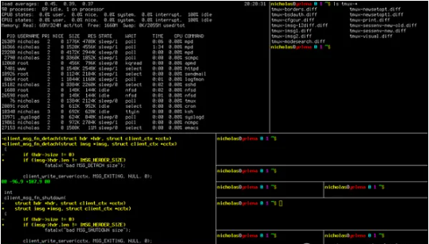

# 开源Shell脚本项目

[JosefZIla/bash2048：2048 游戏的 Bash 实现 (github.com)](https://github.com/JosefZIla/bash2048)

[ropery/FFcast：在矩形屏幕区域上运行命令 (github.com)](https://github.com/ropery/FFcast)

## 揭秘批量远程执行命令的神奇脚本

在日常的系统管理工作中，经常需要远程连接到多台服务器去执行相同的命令。如果你还在一台台地手动连接、输入命令，那你就OUT了！今天，我将向大家揭秘一个能够批量远程执行命令的神奇脚本，让你轻松掌控所有主机！

首先，让我们来看看这个脚本的庐山真面目：

```bash
#!/bin/bash  
# 接收所有传入的参数作为需要远程执行的命令  
COMMAND=$*  
# 主机信息文件，记录着每台主机的IP、用户名、端口和密码  
HOST_INFO=host.info  
# 遍历host.info文件中的每一行，提取IP地址  
for IP in $(awk '/^[^#]/{print $1}' $HOST_INFO); do  
    # 根据IP地址从host.info文件中提取对应的用户名  
    USER=$(awk -v ip=$IP 'ip==$1{print $2}' $HOST_INFO)  
    # 根据IP地址从host.info文件中提取对应的端口号  
    PORT=$(awk -v ip=$IP 'ip==$1{print $3}' $HOST_INFO)  
    # 根据IP地址从host.info文件中提取对应的密码  
    PASS=$(awk -v ip=$IP 'ip==$1{print $4}' $HOST_INFO)  
    # 使用expect工具自动进行SSH连接，并发送命令  
    expect -c "  
       spawn ssh -p $PORT $USER@$IP  
       expect {  
          \"(yes/no)\" {send \"yes\r\"; exp_continue}  
          \"password:\" {send \"$PASS\r\"; exp_continue}  
          \"$USER@*\" {send \"$COMMAND\r exit\r\"; exp_continue}  
       }  
    "  
    # 输出分隔线，方便查看每台主机的执行结果  
    echo "-------------------"  
done
```

这个脚本的工作原理如下：

1. **接收命令**：脚本首先接收所有传入的参数，并将它们组合成一个待执行的命令字符串。
2. **读取主机信息**：脚本会读取一个名为`host.info`的文件，该文件记录了所有需要连接的主机的信息，包括IP地址、用户名、端口和密码。
3. **远程连接**：对于`host.info`文件中的每一台主机，脚本都会使用`expect`工具来自动进行SSH连接。这个工具能够模拟用户与终端的交互，自动输入密码等信息。
4. **执行命令**：一旦成功连接到远程主机，脚本就会发送之前组合好的命令字符串，并在命令执行完毕后自动退出SSH连接。
5. **输出结果**：每台主机的执行结果都会被打印出来，并用分隔线隔开，方便查看。

使用这个脚本的好处显而易见：你可以一次性在所有主机上执行相同的命令，而无需逐台登录、逐台输入。这不仅大大提高了工作效率，还减少了人为错误的可能性。

为了让这个脚本能够正常工作，你需要准备一个`host.info`文件，格式如下：

```bash
# 注释行，以#开头，不会被脚本处理  
# IP地址 用户名 端口 密码  
192.168.1.100 user1 22 passwd1  
192.168.1.101 user2 22 passwd2  
# 可以继续添加更多主机信息...
```

请确保你的密码是安全的，并妥善保管好这个文件，以防泄露敏感信息。

现在，你可以将这个脚本保存为一个可执行文件，比如命名为`remote_exec.sh`，并给它添加执行权限：`chmod +x remote_exec.sh`。然后，你就可以通过以下方式使用它了：

```
./remote_exec.sh "ls -l /home"
```

这条命令会在所有主机上列出`/home`目录下的文件和文件夹。你可以将`"ls -l /home"`替换为任何你需要远程执行的命令。



## 轻松监控多台服务器磁盘利用率

### 脚本介绍

这个Bash脚本通过SSH连接到多台服务器，收集各服务器的磁盘利用情况，并在发现某个磁盘分区使用率超过80%时，发送警告邮件到你的指定邮箱。下面，让我们详细了解一下这个脚本的工作原理。

```bash

#!/bin/bash  
HOST_INFO=host.info  
for IP in $(awk '/^[^#]/{print $1}' $HOST_INFO); do  
    # 取出用户名和端口  
    USER=$(awk -v ip=$IP 'ip==$1{print $2}' $HOST_INFO)  
    PORT=$(awk -v ip=$IP 'ip==$1{print $3}' $HOST_INFO)  
      
    # 创建临时文件，保存信息  
    TMP_FILE=/tmp/disk.tmp  
      
    # 通过公钥登录获取主机磁盘信息  
    ssh -p $PORT $USER@$IP 'df -h' > $TMP_FILE  
      
    # 分析磁盘占用空间  
    USE_RATE_LIST=$(awk 'BEGIN{OFS="="}/^\/dev/{print $NF,int($5)}' $TMP_FILE)  
      
    # 循环磁盘列表，进行判断  
    for USE_RATE in $USE_RATE_LIST; do  
        # 取出等号(=)右边的值，即挂载点名称  
        PART_NAME=${USE_RATE%=*}  
        # 取出等号(=)左边的值，即磁盘利用率  
        USE_RATE=${USE_RATE#*=}  
          
        # 进行判断  
        if [ $USE_RATE -ge 80 ]; then  
            echo "Warning: $PART_NAME Partition usage $USE_RATE%!"  
            echo "服务器$IP的磁盘空间占用过高，请及时处理" | mail -s "空间不足警告" 你的qq@qq.com  
        else  
            echo "服务器$IP的$PART_NAME目录空间良好"  
        fi  
    done  
done
```

这个脚本首先从一个名为`host.info`的文件中读取服务器信息，该文件应包含每行一个服务器的IP地址、用户名和端口号，以空格分隔。例如：


```bash
# host.info 文件示例  
192.168.1.100 username1 22  
192.168.1.101 username2 2222  
# ... 更多服务器信息
```

脚本通过SSH连接到每台服务器，并运行`df -h`命令来获取磁盘使用情况。然后，它使用`awk`命令分析输出结果，提取出每个磁盘分区的挂载点和利用率。如果某个分区的利用率达到或超过80%，脚本将发送一封警告邮件到你的指定邮箱。

### 脚本优势与特点

1. **集中监控**：通过一个脚本即可监控多台服务器的磁盘利用率，无需在每台服务器上单独设置监控。
2. **灵活性**：你可以根据需要轻松添加或删除要监控的服务器，只需在`host.info`文件中进行相应的更改即可。
3. **实时性**：脚本实时获取服务器的磁盘使用情况，确保你能够及时了解并解决潜在的磁盘空间问题。
4. **可扩展性**：你可以根据自己的需求对脚本进行修改和扩展，例如添加更多的监控项或自定义警告阈值等。

### 使用建议与注意事项

1. **安全性**：确保在使用SSH连接时采用了安全的身份验证方式，如公钥认证，以避免密码泄露风险。
2. **性能考虑**：如果你监控的服务器数量众多，建议合理安排脚本的运行频率，以避免对服务器造成过大的负载。
3. **错误处理**：在实际使用中，可能会遇到网络问题、SSH连接失败等异常情况。建议在脚本中添加适当的错误处理逻辑，以提高稳定性。
4. **日志记录**：为了便于追踪和排查问题，建议将脚本的输出重定向到一个日志文件，以便随时查看和分析。

通过这个实用的Bash脚本，你可以轻松实现多台服务器磁盘利用率的集中监控。无论是对于系统管理员还是运维工程师来说，这都是一个非常有价值的工具。现在就开始尝试吧，让你的服务器管理工作更加高效和便捷！

## 打造动态进度条的Shell脚本秘诀

你是否曾在命令行终端中看到过那些酷炫的动态进度条，它们是如何实现的呢？今天，就让我们一起揭开这个神秘的面纱，通过一个简单而有趣的Shell脚本实例，来教大家如何制作属于自己的动态进度条！


在Linux终端中，我们经常需要执行一些耗时较长的任务，如文件传输、大数据处理或软件编译等。在这些任务执行过程中，如果能够有一个直观的进度条来展示任务进度，无疑会大大提升用户体验。下面这段代码，就是利用Shell脚本和ANSI转义序列，来制作一个简单的动态进度条。

```shell
# 声明一个数组变量ary  
declare -a ary  
  
# 初始化数组，为数组的每个元素（下标40到49）赋值为空格  
for i in `seq 40 49`  
do  
    ary[$i]=" "  # 数组下标从40到49的元素均赋值为一个空格  
  
    # 使用ANSI转义序列在终端的特定行上显示数组内容，模拟进度条效果  
    # \e[ 是转义字符的开始，$i 是行号，5m 表示设置文本闪烁，${ary[@]} 打印整个数组的内容  
    # \e[;0m 是转义字符的结束，用于重置之前的文本属性设置  
    echo -en "\e[$i;5m ${ary[@]}\e[;0m"  
done  
  
# 下面的代码是一个更复杂的例子，通过双层循环来模拟一个动态更新的进度条效果  
declare -a ary  
for s in `seq 1 10000`  # 外层循环，用于控制进度条的更新次数  
do  
    for i in `seq 40 49`  # 内层循环，用于初始化或更新进度条  
    do  
        ary[$i]=" "  # 每次循环都重新为数组元素赋值空格，相当于清空进度条  
  
        # 与上面的echo命令类似，但这次是在双层循环中，因此会不断更新进度条的状态  
        echo -en "\e[$i;5m ${ary[@]}\e[;0m"  
    done  
done
```

**代码解析**：

1. **declare -a ary**：这行代码声明了一个名为`ary`的数组变量。在Shell脚本中，数组可以存储多个值，每个值由一个唯一的下标标识。
2. **for i in `seq 40 49`**：这个循环用于初始化数组`ary`，将其下标从40到49的元素设置为空格。这些下标对应于终端中的行号，稍后将用于在特定行上显示进度条。
3. echo -en "\e[i;5m{ary[@]}\e[;0m"：这行代码使用ANSI转义序列在终端的指定行上显示数组的内容。`\e[` 开始一个转义序列，`$i` 是行号，`5m` 设置文本闪烁（这样可以让进度条动态显示），`${ary[@]}` 打印整个数组的内容，`\e[;0m` 重置文本属性。
4. 在第二个双层循环中，外层循环控制进度条的更新次数，内层循环则负责在每次更新时清空并重新显示进度条。虽然这个示例中的进度条并没有实际的进度信息（只是简单地重复显示空格），但你可以根据需要修改代码，比如根据任务的实际进度来更新进度条的状态。

**如何应用这段代码？**

这个简单的Shell脚本示例展示了如何在Linux终端中创建动态进度条。你可以将这段代码嵌入到你的Shell脚本中，用于显示长时间运行任务的进度。当然，为了让它更加实用，你可能需要根据你的具体任务来定制进度条的更新逻辑。

**注意事项**：

- 这个脚本在大多数Linux终端中应该都能正常工作，但不同的终端可能对ANSI转义序列的支持有所不同。
- 进度条的显示效果和性能也取决于你的终端性能和设置。

现在你已经知道了如何在Shell脚本中创建动态进度条，快去试试吧！无论是为了提升你的脚本的用户体验，还是仅仅为了好玩，这都是一个值得尝试的技巧。

**终端魔法：更多高级技巧等你来探索**

当然，这只是终端技巧中的冰山一角。Linux终端是一个强大而灵活的工具，掌握它可以让你的工作更加高效、有趣。除了动态进度条，还有很多其他的高级技巧和工具等待你去探索，比如使用`tput`命令来控制光标位置、颜色和其他终端属性，或者使用`expect`工具来自动化交互式任务。不断学习和实践，你会发现终端世界中的无尽魅力！

## Bash脚本入门：随机数数组排序全解析-生成与排序

在Linux系统中，Bash脚本是一种强大的自动化工具，它可以帮助我们执行一系列复杂的任务。今天，我们将通过一个简单的示例，展示如何在Bash脚本中生成一个随机数数组，并对其进行排序。这个过程不仅有趣，而且是学习Bash编程基础知识的好方法。

### 一、生成随机数数组

首先，让我们来看看如何生成一个包含随机数的数组。在Bash脚本中，我们可以使用`$RANDOM`变量来生成随机数。下面是一个简单的脚本，它创建了一个包含10个随机数的数组：

```bash
#!/bin/bash  
declare -a array # 声明一个数组变量  
for i in `seq 1 10` # 使用seq命令生成一个从1到10的序列  
do  
    array[$i]=$RANDOM # 将每个随机数赋值给数组的对应元素  
done  
echo -e "Array_1:  ${array[@]}" # 打印整个数组的内容
```

这段代码首先声明了一个名为`array`的数组。然后，它使用一个for循环和`seq`命令来生成一个从1到10的数字序列。在每次循环中，它都将一个随机数赋值给数组的相应元素。最后，它使用`${array[@]}`来打印整个数组的内容。

### 二、对随机数数组进行排序

生成了随机数数组之后，我们可能希望对这些数字进行排序。虽然Bash本身没有提供内置的排序函数，但我们可以通过编写自己的排序算法来实现这一目标。下面是一个使用冒泡排序算法对数组进行排序的脚本：

```bash
for (( x=1; x<=9; x++ )) # 外层循环，控制排序的轮数  
do  
    for(( y=1; y<=9; y++ )) # 内层循环，负责两两比较和交换  
    do  
        if [ ${array[$y]} -gt ${array[$(($y+1))]} ] # 如果前一个数大于后一个数  
        then  
            # 交换两个元素的值  
            temp=${array[$y]} # 将array[y]的值保存到临时变量中  
            array[$y]=${array[$(($y+1))]} # 将array[y+1]的值赋给array[y]  
            array[$(($y+1))]=$temp # 将临时变量的值赋给array[y+1]  
        fi  
    done  
done  
echo -e "Array_2:  ${array[@]}" # 打印排序后的数组内容
```

这段代码使用了嵌套的for循环来实现冒泡排序。外层循环控制排序的轮数，内层循环则负责两两比较数组中的元素，并根据需要进行交换。注意，在比较时我们使用了`-gt`（大于）操作符来判断前一个数是否大于后一个数。如果是，则交换这两个数的位置。最后，我们再次打印整个数组的内容，以验证排序结果。

### 三、完整脚本及运行示例

将上述两部分代码合并，我们得到了一个完整的Bash脚本，该脚本可以生成一个随机数数组并对其进行排序：

```bash
#!/bin/bash  
declare -a array # 声明数组变量  
for i in `seq 1 10` # 生成随机数数组  
do  
    array[$i]=$RANDOM # 为数组元素赋值随机数  
done  
echo -e "Array_1:  ${array[@]}" # 打印原始数组内容  
# 使用冒泡排序算法对数组进行排序  
for (( x=1; x<=9; x++ ))   
do  
    for(( y=1; y<=9; y++ ))   
    do  
        if [ ${array[$y]} -gt ${array[$(($y+1))]} ]   
        then  
            temp=${array[$y]} # 交换元素值  
            array[$y]=${array[$(($y+1))]}  
            array[$(($y+1))]=$temp  
        fi  
    done  
done  
echo -e "Array_2:  ${array[@]}" # 打印排序后的数组内容
```

保存上述代码为一个`.sh`文件（例如`sort_random_array.sh`），然后在终端中运行以下命令来执行脚本：

```bash
chmod +x sort_random_array.sh # 添加可执行权限  
./sort_random_array.sh # 运行脚本
```

你将看到脚本首先打印出一个包含10个随机数的数组，然后打印出排序后的数组。每次运行脚本时，生成的随机数都会不同，但排序后的数组总是按升序排列的。这是因为我们使用了冒泡排序算法对数组进行了排序。

### 四、结语

通过这个简单的示例，我们学习了如何在Bash脚本中生成随机数数组，并使用冒泡排序算法对其进行排序。这个过程不仅展示了Bash脚本的强大功能，还帮助我们巩固了编程基础知识。现在，你可以尝试修改这个脚本，以适应不同的需求或添加更多的功能。

例如，你可以尝试使用其他排序算法（如插入排序、选择排序等）来对数组进行排序，或者生成不同大小和范围的随机数数组。无论你选择做什么样的修改和扩展，这个简单的示例都将为你提供一个坚实的基础，帮助你更好地理解Bash脚本编程的原理和技巧。