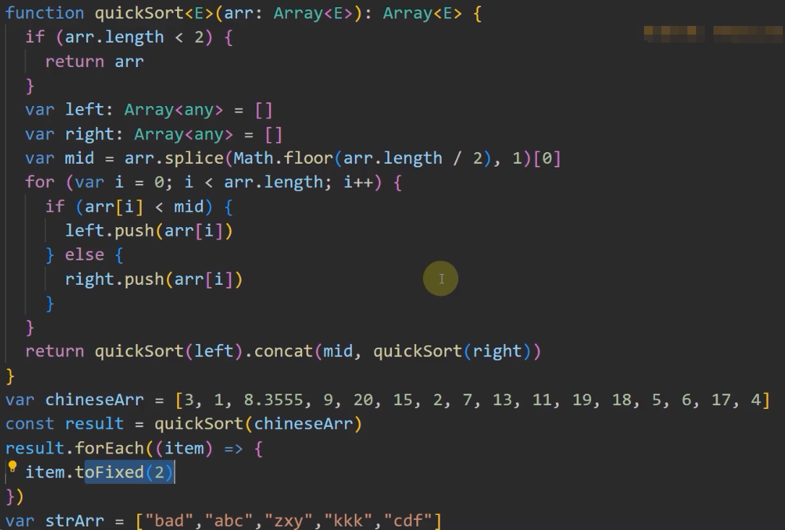

# 5-泛型

泛型（Generics）是指在定义函数、接口或类的时候，不预先指定具体的类型，而在使用的时候再指定类型的一种特性
- 特点一：定义时不明确使用时必须明确成某种具体数据类型的数据类型。【泛型的宽泛】
- 特点二：编译期间进行数据类型检查的数据类型。【泛型的严谨】

泛型 `T` 作用域只限于函数内部使用

## 引子

下面创建一个函数，实现功能：根据指定的数量 `count` 和数据 `value` ，创建一个包含 `count` 个 `value` 的数组。

### 不用泛型的话，这个函数可能是下面这样

```typescript
function createArray(value: any, count: number): any[] {
  const arr: any[] = []
  for (let index = 0; index < count; index++) {
    arr.push(value)
  }
  return arr
}

const arr1 = createArray(11, 3)
const arr2 = createArray('aa', 3)
console.log(arr1[0].toFixed(), arr2[0].split(''))
```

### 使用泛型函数

<>里面的内容，可以任意大写字母，写 ”T“ 是习惯和规范

```typescript
function createArray2<T>(value: T, count: number) {
  const arr: Array<T> = []
  for (let index = 0; index < count; index++) {
    arr.push(value)
  }
  return arr
}

// 使用的时候再指定类型，<>里面的类型对应T
const arr3 = createArray2<number>(11, 3)
console.log(arr3[0].toFixed())
// console.log(arr3[0].split('')) // error

// 使用的时候再指定类型，<>里面的类型对应T
const arr4 = createArray2<string>('aa', 3)
console.log(arr4[0].split(''))
// console.log(arr4[0].toFixed()) // error
```

## 多个泛型参数的函数

一个函数可以定义多个泛型参数

```typescript
function swap<K, V>(a: K, b: V): [K, V] {
  return [a, b]
}
const result = swap<string, number>('abc', 123)
console.log(result[0].length, result[1].toFixed())
```

- 实现一个函数 createArray，它可以创建一个指定长度的数组，同时将每一项都填充一个默认值

```typescript
function createArray(length: number, value: any): Array<any> {
  let result: any = [];
  for (let i = 0; i < length; i++) {
    result[i] = value;
  }
  return result;
}
let result = createArray(3,'x');
console.log(result);
```

使用了泛型

```typescript
function createArray<T>(length: number, value: T): Array<T> {
    let result: T[] = [];
    for (let i = 0; i < length; i++) {
      result[i] = value;
    }
    return result;
  }
let result = createArray2<string>(3,'x');
console.log(result);
```

## 类数组

- 类数组（Array-like Object）不是数组类型，比如 `arguments`
- 使用IArguments ，需要在typescript.json文件中配置："lib":["dom", dom.iterable", "es2015", "es5"]

```typescript
function sum() {
    let args: IArguments = arguments;
    for (let i = 0; i < args.length; i++) {
        console.log(args[i]);
    }
}
sum(1, 2, 3);

// 数据绑定元素
let root = document.getElementById('root');
let children: HTMLCollection = (root as HTMLElement).children;
children.length;
let nodeList: NodeList = (root as HTMLElement).childNodes;
nodeList.length;
```

## 泛型类

在定义类时，为类中的属性或方法定义泛型类型

在创建类的实例时，再指定特定的泛型类型

```typescript
class GenericNumber<T> {
  zeroValue: T
  add: (x: T, y: T) => T
}

let myGenericNumber = new GenericNumber<number>()
myGenericNumber.zeroValue = 0
myGenericNumber.add = function(x, y) {
  return x + y
}

let myGenericString = new GenericNumber<string>()
myGenericString.zeroValue = 'abc'
myGenericString.add = function(x, y) {
  return x + y
}

console.log(myGenericString.add(myGenericString.zeroValue, 'test'))
console.log(myGenericNumber.add(myGenericNumber.zeroValue, 12))
```

### 泛型与 new

```typescript
function factory<T>(type: {new():T}): T {
  return new type(); // This expression is not constructable.
}
```

## 泛型约束

如果我们直接对一个泛型参数取 `length` 属性, 会报错, 因为这个泛型根本就不知道它有这个属性

```typescript
// 没有泛型约束
function fn<T>(x: T): void {
  // console.log(x.length)  // error
}
```

我们可以使用泛型约束来实现

```typescript
interface Lengthwise {
  length: number
}

// 指定泛型约束
function fn2<T extends Lengthwise>(x: T): void {
  console.log(x.length)
}
```

我们需要传入符合约束类型的值，必须包含必须 `length` 属性：

```typescript
fn2('abc')
// fn2(123) // error  number没有length属性
```

Vue3源码的泛型约束：[core/packages/reactivity/src/ref.ts at 272ab9fbdcb1af0535108b9f888e80d612f9171d · vuejs/core (github.com)](https://github.com/vuejs/core/blob/272ab9fbdcb1af0535108b9f888e80d612f9171d/packages/reactivity/src/ref.ts#L96)

搜索：ObjectRefImpl

## 泛型接口

在函数中使用泛型的时候，由于预先并不知道泛型的类型，所以不能随意访问相应类型的属性或方法。

```typescript
function logger<T>(val: T) {
    console.log(val.length); // 直接访问会报错
}
// 可以让泛型继承一个接口
interface LengthWise {
    length: number
}
// 可以让泛型继承一个接口
function logger2<T extends LengthWise>(val: T) {
    console.log(val.length)
}
logger2('zhufeng');
logger2(1);
```

在定义接口时，为接口中的属性或方法定义泛型类型

在使用接口时，再指定具体的泛型类型

```typescript
interface IbaseCRUD<T> {
  data: T[]
  add: (t: T) => void
  getById: (id: number) => T
}

class User {
  id?: number // id主键自增
  name: string // 姓名
  age: number // 年龄

  constructor(name, age) {
    this.name = name
    this.age = age
  }
}

class UserCRUD implements IbaseCRUD<User> {
  data: User[] = []

  add(user: User): void {
    user = { ...user, id: Date.now() }
    this.data.push(user)
    console.log('保存user', user.id)
  }

  getById(id: number): User {
    return this.data.find(item => item.id === id)
  }
}

const userCRUD = new UserCRUD()
userCRUD.add(new User('tom', 12))
userCRUD.add(new User('tom2', 13))
console.log(userCRUD.data)
```

泛型接口可以用来约束函数

```typescript
interface Calculate{
  <T>(a:T,b:T):T
}
let add: Calculate = function<T>(a:T,b:T){
  return a;
}
add<number>(1,2);
```

### 多个类型参数

泛型可以有多个

```typescript
function swap<A,B>(tuple:[A,B]):[B,A]{
  return [tuple[1],tuple[0]];
}
let swapped = swap<string,number>(['a',1]);
console.log(swapped);
console.log(swapped[0].toFixed(2));
console.log(swapped[1].length);
```

### 默认泛型类型

```typescript
function createArray3<T = number>(length: number, value: T): Array<T> {
  let result: T[] = [];
  for (let i = 0; i < length; i++) {
    result[i] = value;
  }
  return result;
}
let result2 = createArray3(3,'x');
console.log(result2);
```

## compose

示例：[compose.ts](https://gitee.com/zhufengpeixun/redux/blob/master/src/compose.ts)

```typescript
import compose from ".";
/* zero functions */
console.log(compose()<string>("zhufeng"));

/* one functions */
interface F{
    (a:string):string
}
let f: F = (a:string):string => a+'f';
console.log(compose<F>(f)("zhufeng"));

/* two functions */
type A = string;
type R = string;
type T = string[];

let f1 = (a: A): R => a + "f1";
let f2 = (...a: T): A => a + "f2";
console.log(compose<A,T,R>(f1,f2)("zhufeng"));
```

## 泛型类型别名

泛型类型别名可以表达更复杂的类型

```typescript
type Cart<T> = { list: T[] } | T[];
let c1: Cart<string> = { list: ['1'] };
let c2: Cart<number> = [1];
```

## 泛型keyof映射属性

```typescript
interface Person {
  name: string;
  age: number;
  gender: string;
}

// type NAME = 'name';
// key: 'name';
// Person['name'];

// type T = 'age'
// key: 'age'
// Person['age']

// type T = 'gender'
// key: 'gender'
// Person['gender']

class Teacher {
  constructor(private info: Person) {}
  // keyof关键字映射接口Person的的key
  getInfo<T extends keyof Person>(key: T): Person[T] {
    return this.info[key];
  }
}

const teacher = new Teacher({
  name: 'dell',
  age: 18,
  gender: 'male'
});

const test = teacher.getInfo('name');
console.log(test);
```

## 泛型接口 vs 泛型类型别名

- 接口创建了一个新的名字，它可以在其他任意地方被调用。而类型别名并不创建新的名字，例如报错信息就不会使用别名
- 类型别名不能被 extends和 implements,这时我们应该尽量使用接口代替类型别名
- 当我们需要使用联合类型或者元组类型的时候，类型别名会更合适

## 泛型晋级——函数重载

### 函数重载

不同参数列表的和返回值无关并且具有一个实现签名和一个或多个重载签名的多个函数

函数重置例子：

```typescript
// 重载签名
function searchMsg(condition: MessageType): Message[];
function searchMsg(condition: number): Message | undefined;
// 实现签名
function searchMsg(condition: MessageType | number): Message | undefined | Message[] {
    if (typeof condition === "number") {
        return messages.find((msg) => condition === msg.id)
    } else if {
        return messages.filter((msg) => condition === msg.type)
    }
}
```

类似于vue3源码的下面的代码：

```typescript
// 重载签名
export function ref<T>(value: T): Ref<UnwrapRef<T>>
export function ref<T = any>(): Ref<T | undefined>
// 实现签名
export function ref(value?: unknown) {
  return createRef(value, false)
}
```

### 泛型函数重载

#### 泛型函数和它的真实应用

准备知识：快速排序法

快速排序法的思想

- 1.先从数列中取出一个数作为基准数。
- 2.分区过程，将比这个数大的数全放到它的右边，小于它的数全放到它的左边。
- 3.再对左右区间重复第二步，直到各区间只有一个数。



```typescript
const strResult=quickSort(strArr)
export {}
```

#### 泛型函数重载

经典复杂排序器

泛型函数重载准备:

- 1.中文排序
- 2.字符串自排序
- 3.中文+英文、数字数组排序
- 4.中文+英文、数字数组 + 数组内部字符串自排序
- 5.字符串自排序 +中文+英文、数字数组+数组内部字符串自排序
- 素材：`var pattern1 = /[ u4e00- u9fa5]+/g`

```ts
import { quickSort } from '.dd'

var chineseArr = ["武汉", "石家庄", "郑州", "太原", "济南", "沈阳", "大连", "青岛"]

// 中文排序
function sortChinese(arr: Array<string>): Array<String> {
    return arr.sort(function (preStr, curstr) {
        return prestr.localeCompare(curstr, "zh-CN")
    })
	return arr
}
console.log(sortChinese(chineseArr))

// 判断是否是中文
var pattern1 = /[\u4e00-\u9fa5]+/g
function isChinese(arr:Array<string>):boolean {
    var pattern1 = /[\u4e00-\u9fa5]+/g
    return chineseArr.some(function(item){
        return pattern.test(item)
    })
}

// 字符串的自排序
export function strSelfSort(str: string) {
    const strArr = str.split("")
    const strSortArr = quickSort(strArr)
    return strSortArr.join("")
}
console.log(strSelfSort("xssdsfebzcjd"))

// 结合排序
export function sort<T>(data: T): Array<any> | string | undefined{
    if(data instanceof Array){
        if(isChinese(data)){
			return sortChinese(data)
        }else {
			return quickSort(data)
        }
    } else if(typeof data==="string"){
        return strSelfSort(data)
    }
}
console.log(sort("sczxbd"))

export {}
```

#### 泛型工厂函数类型和拓展知识

泛型工厂函数类型定义：可以代表任意一个类构造函数的函数类型

代码：

```typescript
class CommercialBank {
    public address: string = "beijing"
    public name: string = "wangwu"
    static count: number
    
    constructor(name: string, address: string) {
        this.address = address
        this.name = name
    }
    loan(): void {
        console.log(this.name + " 银行贷款")
    }
}
// new 实例化后的类型
type ConstructorTyp = new (...args: any) => CommercialBank
// 使用interface接口写法
interface ConstrutorInter {
    new(...args: any): any
}

// 构造函数类型
// let CommercialBankInstance: ConstructorTyp = CommercialBank
// const cbInstance = new CommercialBankInstance("wangwu",
"tianjin")
// cbInstance.loan()

// 泛型工厂函数类型的应用
function createFactoryConstructor(constructorTyp: new
...args: any) => any) {
    console.log(constructorTyp.name +"被创建...")
	new constructorTyp()
}
createFactoryConstructor(CommercialBank)

// 通用交叉合并的方法


export {}
```

