# VSCode 插件开发教程

[VSCode 插件开发全攻略（一）概览 - 我是小茗同学 - 博客园 (cnblogs.com)](https://www.cnblogs.com/liuxianan/p/vscode-plugin-overview.html)

因为 vscode 本身是基于 electron 开发的，所以总体来说开发插件就是在写 node 代码，额外再加一些编辑器 api，插件发布的过程和 npm 包的发布很类似。

vscode 官方提供的脚手架还帮忙加上了调试配置，调试非常方便。

## Visual Studio Code 拓展开发 API

拓展开发 API 文档：[扩展 API |Visual Studio Code 扩展 API](https://code.visualstudio.com/api)

指南：[扩展指南 |Visual Studio Code 扩展 API](https://code.visualstudio.com/api/extension-guides/overview)

示例代码：[microsoft/vscode-extension-samples: Sample code illustrating the VS Code extension API. (github.com)](https://github.com/microsoft/vscode-extension-samples)

用户体验 UX 指南：[用户体验指南 |Visual Studio Code 扩展 API](https://code.visualstudio.com/api/ux-guidelines/overview)

如果要查找已发布的扩展，请前往 [VS Code 扩展市场](https://marketplace.visualstudio.com/vscode)

## 环境准备

这个很简单，我就直接拷贝过来了。

- nodejs: 建议使用 LTS 版本
- npm: 建议最新版本
- yeoman : npm install -g yo
- generator-code : npm install -g generator-code

另外小`TIPS`，我们平时直接安装的插件所在目录是`~/.vscode/extensions`，有兴趣的可以看看这些插件是怎么实现的。

## 脚手架

安装的 yo 可以直接生成一个 Hello World 版本的插件目录。执行

```bash
yo code
```

即会提示一些问题，按照个人喜好填写即可，最后会生成样板代码:

```bash
.
├── CHANGELOG.md                 插件变更记录
├── README.md
├── extension.js                 插件入口main文件
├── jsconfig.json                编辑器关于js的配置
├── package.json                 全局配置
├── test                         测试代码文件夹
│   ├── extension.test.js
│   └── index.js
├── vsc-extension-quickstart.md  新手介绍
└── yarn.lock
```

其中的`quickstart.md`是新手引导，里面包含了对文件的作用解析、如何运行插件、测试插等等，推荐去看一看，我们在下面也会介绍一些。除此之外在 package.json 里也包含了很多非常重要的信息：

```json
{
	"name": "hello-world", // 插件名称
	"displayName": "hello-world", // 插件显示名称
	"description": "hello world", // 插件描述
	"version": "0.0.1",
	"publisher": "my", // 插件发布者
	"engines": {
		"vscode": "^1.35.0" // 运行插件需要vscode最低版本
	},
	"categories": ["Other"],
	"activationEvents": ["onCommand:extension.helloWorld"], // 如何激活插件:在命令面板(Command+Shift+P吊起)输入helloWorld. 注意command名需要在contributes.commands中有配置
	"main": "./extension.js", // 插件入口
	"contributes": {
		"commands": [
			// 此数组表示插件支持的所有命令
			{
				"command": "extension.helloWorld", // 命令对应的Command，需要和代码里保持一致
				"title": "Hello World" // 命令的显示名称
			}
		]
	},
	"scripts": {
		// 正常的npm script
		"postinstall": "node ./node_modules/vscode/bin/install",
		"test": "node ./node_modules/vscode/bin/test"
	},
	"devDependencies": {
		// 依赖包
		"typescript": "^3.3.1",
		"vscode": "^1.1.28",
		"eslint": "^5.13.0",
		"@types/node": "^10.12.21",
		"@types/mocha": "^2.2.42"
	}
}
```

## 启动、调试插件

### 启动运行

脚手架生成的其实就是一个 node 应用，直接按 F5 即可运行。对配置感兴趣的也可以查看根目录下的`.vscode/launch.json`。

跑起来以后默认会新开一个 vscode 窗口，然后会发现什么都没有发生，这是由插件的启动方式决定的，配置于`package.json`里的`activationEvents`项。常用的有：

- `onLanguage` 在打开特定语言类型的文件后激活
- `onCommand` 在执行特定命令后激活

由于我们的插件是配置的`onCommand`启动，并且指定的命令名是`Hello World`，所以我们在新开的`vscode`窗口中按下快捷键`Command+Shift+P`后再找到`Hello World`,选中并执行即可。

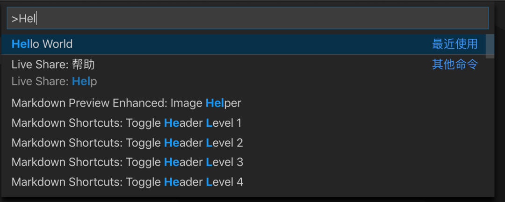

最后顺利的话，编辑器右下角会弹出 Hello World!。

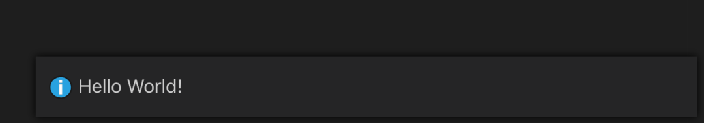

如果细心的话，还会在源窗口的控制台的调试控制台 tab 中看到如下输出：

```bash
Congratulations, your extension "hello-world" is now active!
```

这个就是由插件的真正代码部分输出的了。我们接下来看看 extension.js 的内容：

```js
// vscode编辑器api入口
const vscode = require("vscode");

/**
 * 此生命周期方法在插件激活时执行
 * @param {vscode.ExtensionContext} context
 */
function activate(context) {
	// console的各种方法都是输出在`调试控制台`tab下
	console.log('Congratulations, your extension "hello-world" is now active!');

	// registerCommand用于注册命令并提供具体逻辑，命令名需要和package.json里写的一致。
	// 回调函数在命令被触发时执行。
	let disposable = vscode.commands.registerCommand(
		"extension.helloWorld",
		function () {
			// 在编辑器右下角展示一个message box
			vscode.window.showInformationMessage("Hello World!");
		}
	);

	// 将registerCommand的返回值放入subscriptions可以自动执行内存回收逻辑。
	context.subscriptions.push(disposable);
}
exports.activate = activate;

// 当插件被设置为无效时执行此生命周期钩子
function deactivate() {}

module.exports = {
	activate,
	deactivate,
};
```

以上就是此插件的完整逻辑了，配置注释是很简单的。可以看到主要就是两个生命周期函数，另外搭配一些编辑器 api 就完成了。

### 调试

脚手架已经贴心的帮我们加了调试配置，我们只用添加断点即可：

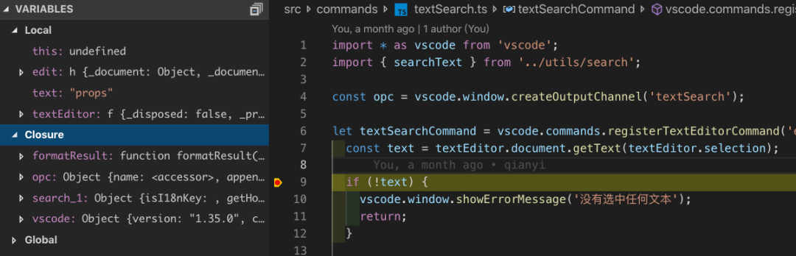

### Command 配置

上面提到了生成一个 command 只需要 2 步，先是利用 vscode.commands.registerCommand 注册一个，然后再到 package.json 里的 contributes.commands 中配置即可。围绕 command 还可以做一些其他事情，最常见的就是配置右键菜单和快捷键。

### 右键菜单

表示右键的菜单里出现指定 command，配置方法：

```json
"contributes":{
  "menus": {
    "editor/context": [
      {
        "when": "editorHasSelection && resourceFilename =~ /.js|.vue|.ts/", // 出现时机，当编辑器中有选中文本同时文件名后缀是js/vue/ts
        "command": "extension.starling_textSearch", // 需要在`contributes.commands`存在此命令
        "group": "6_Starling" // 命令所在的组，右键菜单可以分组，组与组之间存在分隔线
      },
    ]
  }
}
```

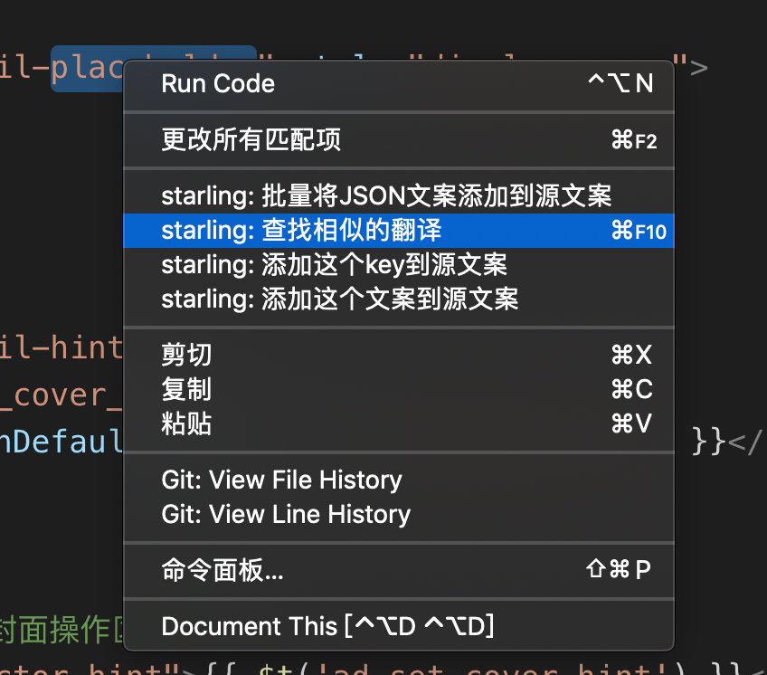

### 快捷键

有了快捷键后，就不用每次在命令面板里查找并运行命令了，同样是在 package.json 中配置：

```json
"contributes": {
  "keybindings": [
    {
      "command": "extension.starling_textSearch",
      "key": "ctrl+f11", // 在Windows上的快捷键
      "mac": "cmd+f11", // 在mac上的快捷键
      "when": "editorTextFocus" // 出现时机， 当编辑器焦点在某个文本中
    }
  ],
}
```

### 发布

主要参考的是官方文档

首先需要安装 vsce 工具：

```bash
npm install -g vsce
```

本地打包将插件打包成.vsix 文件。

```bash
vsce package
```

会在项目根目录生成 hello-world-0.0.1.vsix，然后在编辑器的插件面板选择从 VSIX 安装即可：

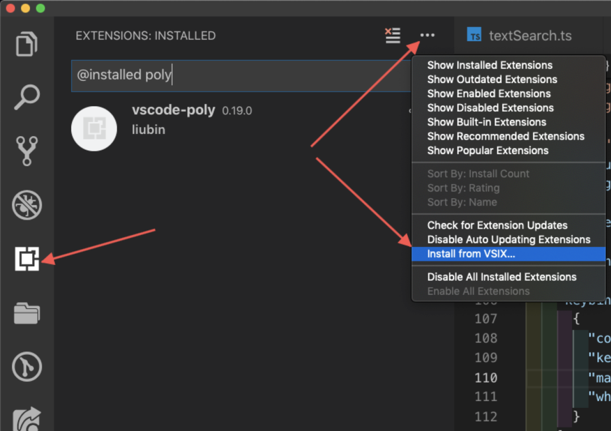

### 发布到插件市场

- 需要获取一个 token，参考官方文档
- 利用 token 创建一个 publisher，这是在插件市场的用户

```bash
vsce create-publisher (publisher name)
```

- 本地登录此用户

```bash
vsce login (publisher name)
```

- 发布插件

```bash
vsce publish
```

顺利的话在控制台会提示发布成功，然后过几分钟就可以在插件市场搜到自己的插件啦！?

### 版本升级

当插件内容发生变更时，重新发布时最好更新版本号，vsce 可以遵循语义化版本指定升级大(major)/小(minor)/补丁(patch)版本，也可以直接指定版本号。例如只升级小版本：

```bash
vsce publish minor
```

如果插件代码在 gitlab 上，因为仓库在内网，需要事先将 README 里的图片替换为公网 cdn 上的路径。

### snippets

snippets 是代码片段，可以理解为代码快捷键，在输入很少量触发代码后即可联想出一大坨关联代码，非常方便。对于 js、ts、vue 都可以在插件市场找到非常多的 snippets 插件。

开发 snippets 只用两步：

- 编写 snippets 映射文件，它是一个 json，例如 javascript.json：

```json
{
	"this$t": {
		"prefix": "tt'", // 触发代码
		"body": [
			// 联想出来的关联代码
			"this.\\$t('${1:key}')" // ${1: key} 是占位符，联想出来后会自动聚焦在这里
		],
		"description": "this.$t" // snippets描述，当有多个匹配的代码片段时，可以用来识别
	}
}
```

- 在 package.json 中配置

```json
"contributes": {
  "snippets": [
    {
      "language": "javascript", // 代码片段起作用的语言类型
      "path": "./src/snippets/javascript.json" // 对应的映射文件
    }
  ]
}
```

最后就可以在编辑器看到效果了：

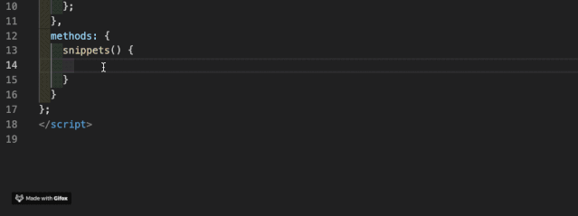

- 更多细节参考 snippets-syntax

### 插件默认配置

很多插件是需要一些额外配置才能工作的，设置默认配置同样在 package.json 里：

```json
"contributes": {
  "configuration": { // 默认配置
    "type": "object",
    "title": "",
    "required": [
      "sid"
    ],
    "properties": {
      "includes": {
        "type": "Array",
        "default": [
          "json"
        ],
        "description": "文件类型过滤器"
      }
    }
  },
}
```

默认配置是 json schema 格式，在覆盖默认配置时如果校验出错会有提示。

插件中使用 getConfiguration 来读取配置：

```js
function getConfig() {
	const config = vscode.workspace.getConfiguration();
	const includes: string[] | undefined = config.get("includes"); // 获取指定配置项

	return {
		includes: includes || [],
	};
}
```

### 监听配置项修改

在用户安装了插件后，可能会修改配置，如何实时监听配置项的修改呢？vscode 提供了 onDidChangeConfiguration 事件监听。

```js
vscode.workspace.onDidChangeConfiguration(function (event) {
	const configList = ["includes"];
	// affectsConfiguration: 判断是否变更了指定配置项
	const affected = configList.some((item) => event.affectsConfiguration(item));
	if (affected) {
		// do some thing ...
	}
});
```

### 常见编辑器 api

所有 vscode 相关 api 都可以在官网文档查找，vscode 内部也集成了.d.ts 文件，编辑器内直接跳转定义即可。这里只列举一些常见的 api.

- messgae

用于展示提示性消息，出现在编辑器右下角，而不是顶部或右上角。

和 console 类似，提供了普通消息、警告消息、错误消息。

```js
vscode.window.showInformationMessage("普通消息");
vscode.window.showWarningMessage("警告消息");
vscode.window.showErrorMessage("错误消息");
```

消息也支持交互按钮，当选中按钮时返回的是按钮本身：

```js
vscode.window
	.showErrorMessage(
		`与starling的远程交互依赖vscode-starling.sid配置项`,
		"打开配置项"
	)
	.then((selection) => {
		if (selection === "打开配置项") {
			vscode.commands.executeCommand("workbench.action.openSettings");
		}
	});
```

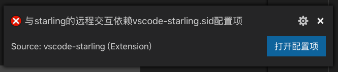

### input box

在编辑器顶部展示一个 input 输入框，使用 vscode.window.showInputBox,会返回一个 Promise:

```js
const text: string | undefined = await vscode.window.showInputBox({
  '最后一步，输入文案'
})
```

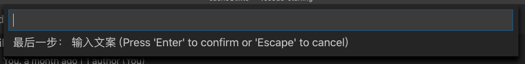

### quick pick

用于从一组选项中选择一个，类似于 select 组件。使用 vscode.window.showQuickPick，同样返回一个 Promise，resolve 时得到被选中的选项或 undefined：

```js
const lang: string | undefined = await vscode.window.showQuickPick(
	["en", "zh", "ja"],
	{
		placeHolder: "第一步：选择语言",
	}
);
```

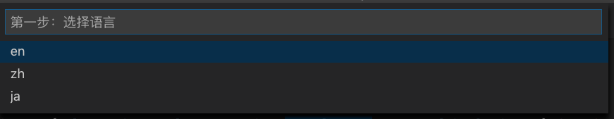

每个选项也可以是对象类型：

```js
const option: Object | undefined = await vscode.window.showQuickPick(
	[
		{ id: 1, name: "a" },
		{ id: 2, name: "b" },
		{ id: 3, name: "c" },
	],
	{
		placeHolder: "select an option",
	}
);
```

### output channel

在利用 Control + ~打开控制台后，会出现 4 个 tab，从左到右依次是问题、输出、调试控制台、终端。output channel 就是用于控制输出 tab 的内容，可以往其中追加文本、追加行、清空，可以将其看成一个简单的文件。output channel 适用于一次展示大量信息.

使用 vscode.window.createOutputChannel 创建 output channel 实例，然后就可以操作各种 api 了。

```js
const opc = vscode.window.createOutputChannel("textSearch"); // 可以有多个OutputChannel共存，使用参数名区分

opc.clear(); // 清空
opc.appendLine("水电费"); // 追加一行
opc.show(); // 打开控制台并切换到OutputChannel tab
```

一个例子：

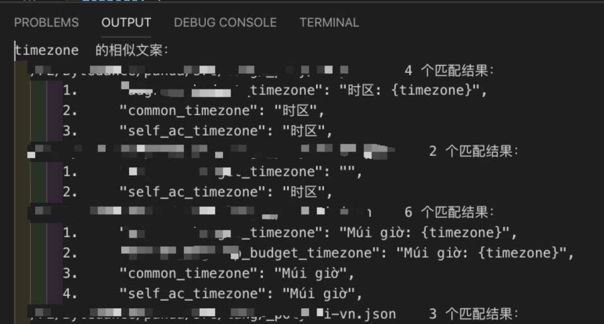

### file selector

有些时候需要操作本地文件系统，例如选择某个文件、将文件保存到指定位置等。

- 保存文件到指定位置使用 showSaveDialog，它会打开文件选择器弹窗，选择了保存路径后点击确定会返回选中的路径，如果点击取消会返回 undefined。

```js
// 让用户手动选择文件的的存储路径
const uri = await vscode.window.showSaveDialog({
	filters: {
		zip: ["zip"], // 文件类型过滤
	},
});
if (!uri) {
	return false;
}

writeFile(uri.fsPath); // 写入文件
```

- 文件选择 showOpenDialog 同样会打开文件选择器弹窗，不过这次是用于选择文件,如果有选择文件会返回选中的文件路径，反之返回 undefined。

```js
// showOpenDialog返回的是文件路径数组
const uris = await window.showOpenDialog({
	canSelectFolders: false, // 是否可以选择文件夹
	canSelectMany: false, // 是否可以选择多个文件
	filters: {
		json: ["json"], // 文件类型过滤
	},
});

if (!uris || !uris.length) {
	return;
}

handleFiles(uris);
```

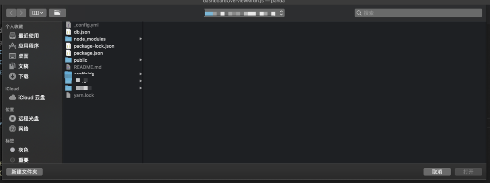

### hover

有时候需要在 hover 到文本上时展示一些提示信息，例如 eslint 插件在 hover 到不合规的代码上时会展示具体违反了哪些规则：

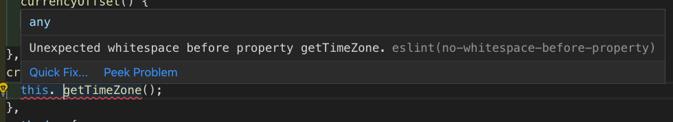

处理 hover 需要注册一个 hover 处理器，vscode 会在 hover 到文本上时自动调用处理器，同时传递 hover 相关的信息。例如一个展示光标所在的单词 hover 处理器：

```js
/**
 * document: 打开的文本
 * position：hover的位置
 * token： 用于取消hover处理器作用
 */
async function hover(
	document: vscode.TextDocument,
	position: vscode.Position,
	token: vscode.CancellationToken
) {
	const line = document.lineAt(position).text; // 光标所在的行
	// getWordRangeAtPosition获取光标所在单词的行列号范围；getText获取指定范围的文本
	const positionWord = document.getText(
		document.getWordRangeAtPosition(position)
	);

	console.log("光标所在位置的单词是：", positionWord);
}

// registerHoverProvider的第一个参数数组表明此处理器的作用范围
const hoverDisposable = vscode.languages.registerHoverProvider(
	["javascript", "vue"],
	{
		provideHover: hover,
	}
);

context.subscriptions.push(hoverDisposable);
```

### selection

与 hover 类似，有时候需要处理选中的文本，获取它是通过 vscode.TextEditor 实例上的属性，有两个相关属性

- selections：所有被选中的文本信息
- selection：第一个被选中的文本信息， 等同于 selections[0]

获取 TextEditor 的一个方法是通过注册 textEditorCommand,会在回调函数里提供 TextEditor 实例，例如展示选中文本：

```js
let command = vscode.commands.registerTextEditorCommand(
	"extension.selection",
	function (textEditor, edit) {
		const text = textEditor.document.getText(textEditor.selection);
		console.log("选中的文本是:", text);
	}
);

context.subscriptions.push(command);
```

### FileSystemWatcher

用于监听文件是否发生了变化，可以监听到新建、更新、删除这 3 种事件,也可以选择忽略其中某个类型事件。创建 watcher 是利用 vscode.workspace.createFileSystemWatcher：

```typescript
function createFileSystemWatcher(
	globPattern: GlobPattern,
	ignoreCreateEvents?: boolean,
	ignoreChangeEvents?: boolean,
	ignoreDeleteEvents?: boolean
): FileSystemWatcher;
```

例如监听所有 js 文件的变动：

```js
const watcher = vscode.workspace.createFileSystemWatcher('*.js', false, false, false);
watcher.onDidChange(e => { // 文件发生更新
  console.log('js changed,' e.fsPath);
});
watcher.onDidCreate(e => { // 新建了js文件
  console.log('js created,' e.fsPath);
});
watcher.onDidDelete(e => { // 删除了js文件
  console.log('js deleted,' e.fsPath);
});
```

# 使用 Rust 开发 VS Code 扩展

Visual Studio Code 现在支持通过 WebAssembly 执行引擎扩展运行 WASM 二进制文件。这使得开发者能够将 Rust 编写的程序编译为 WebAssembly，并在 VS Code 中直接运行。

完成这一过程的关键技术是`组件模型`，该模型通过 WIT 文件标准化 WebAssembly 组件与宿主环境的交互。

原文同时提供了 Rust 计算器示例，展示了如何在 VS Code 扩展中集成用 Rust 编写的库，并生成 Rust 和 TypeScript 绑定

原文链接 https://code.visualstudio.com/blogs/2024/05/08/wasm

## egui 在 web 中使用多线程

作者在将桌面应用移植到 Web 过程中，通过使用 egui 进行 GUI 编写，并通过 WebWorkers 替代线程来进行计算密集型任务，以提升用户体验和性能。

通过引入`gloo-worker` crate，并调整相关 Rust 代码和 index.html 文件，实现了 WebWorker 的创建和通信

原文链接 https://voelklmichael.github.io/Blog/2024/05/12/egui-wasm-threads.html

## bevy_ios_iap: Bevy 中提供 IOS 原生 StoreKit2 API

`bevy_ios_iap` 提供从 Bevy Apps 内部访问 iOS 原生 StoreKit2 Swift API。它使用 Swift-Bridge 自动生成胶水代码并传输数据类型。

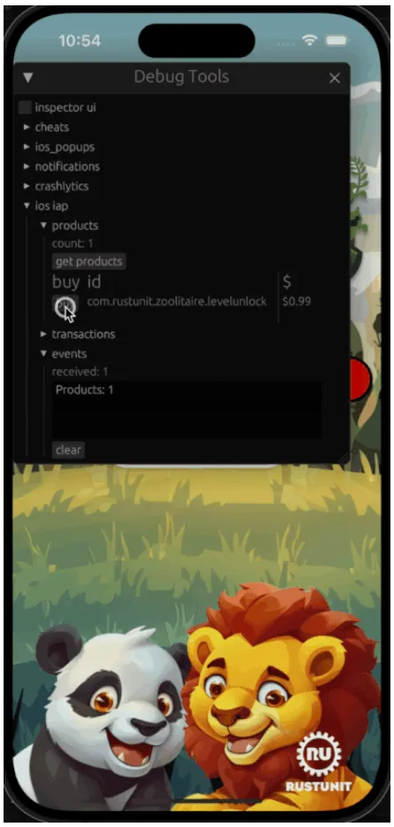

原文链接 https://github.com/rustunit/bevy_ios_iap

## Rust 构建决策树

决策树可以处理分类或回归任务，适用于类别或连续型特征。作者选择了`polars` crate 来加载和处理数据，以简化数据集特征的访问和迭代过滤。使用 Gini 不纯度指标评估最有效的分割点，并通过数据分割来计算这个指标。最终，通过选择数量最多的类别来进行类别预测。

原文链接：https://noiseonthenet.space/noise/2024/05/sowing-a-decision-tree
