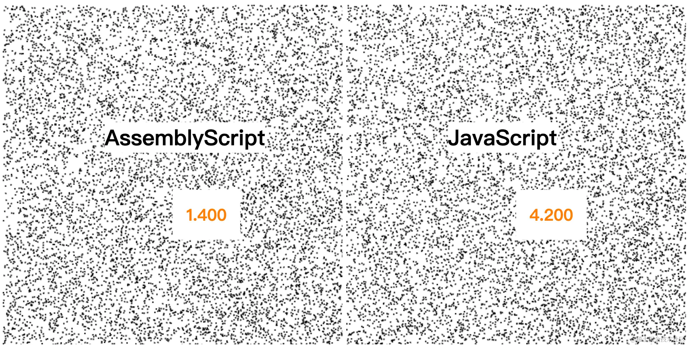

# AssemblyScript

GitHub：[AssemblyScript/assemblyscript: A TypeScript-like language for WebAssembly. (github.com)](https://github.com/AssemblyScript/assemblyscript)

官网文档：[Getting started | The AssemblyScript Book](https://www.assemblyscript.org/getting-started.html#setting-up-a-new-project)

## AssemblyScript介绍

AssemblyScript 是一个把 TypeScript 转换到 WebAssembly 的编译器。由微软开发的 TypeScript 将类型添加到了 JavaScript 中。它已经变得相当受欢迎，即使对于不熟悉它的人，AssemblyScript 只允许 TypeScript 的有限功能子集，因此不需要花太多时间就可以上手。

因为它与 JavaScript 非常相似，所以 AssemblyScript 使 Web 开发人员可以轻松地将 WebAssembly 整合到他们的网站中，而不必使用完全不同的语言。


AssemblyScript十分的易用，它有着类似于TypeScript的语法，支持WebAssembly。

**AssemblyScript**的语言，它采用了类TypeScript的语法设计，对于前端小伙伴来说十分的友好！几乎可以无痛的将原有的ts代码迁移过去。

安装它也十分的简单，与安装其他npm包类似，只需要执行 `npm install`就好了！

## 创建项目

首先是创建项目，我们使用官方提供的方法来创建一个AssemblyScript的项目。

官网文档：[Getting started | The AssemblyScript Book](https://www.assemblyscript.org/getting-started.html#setting-up-a-new-project)

在本文中我就不具体展开了。

在`index.ts`使用 AssemblyScript编写一个计算斐波那契数列的函数。

```ts
export function fib(n: i32): i32 {
   var a = 0, b = 1
   if (n > 0) {
     while (--n) {
       let t = a + b
       a = b
       b = t
     }
     return b
   }
   return a
 }
```

最后在命令行中执行命令：

```bash
npm run asbuild:debug
```

注意，`asbuild:debug` 与 `asbuild:release`在运行时的性能上有较大的差异，在开发调试时我们可以使用 `debug`版本的编译结果，但是在生产环境中千万别忘了一定要使用 `release`版本的编译结果！

编译结束后，我们能够得到 `debug.wasm`与 `debug.js` 两个编译产物，我们直接在index.html中引入 `debug.js`即可。为什么不直接引入 `debug.wasm`？因为 `debug.js` 中包含了一些**胶水代码**，它包括但不限于以下的功能：

1. 加载 WASM文件
2. 类型转换
3. 导入导出WASM，JavaScript的对象等

```html
<!DOCTYPE html>
 <html lang="en">
     <head>
         <meta charset="UTF-8" />
         <meta name="viewport" content="width=device-width, initial-scale=1.0" />
         <title>Fib</title>
     </head>
     <body></body>
     <script type="module">
         import * as module from './build/debug.js';
         console.log(module);
     </script>
 </html>
```

我们可以在控制台中打印一下 `module` 对象，看看其中到底有什么内容。

我们可以从上图中看到，导出的对象中除了我们编写 `fib`函数以外，还有一个 `memory` 对象。在之前的[深入浅出WebAssembly （一）—— 理解WAT - 掘金 (juejin.cn)](https://juejin.cn/post/7288963080856059941)文章中我们说过，`memory` 对象是一段JavaScript与 WebAssembly共同使用的一段线性内存空间。由于我们的模块中并不涉及使用这段内存，所以它的大小为0。

接下来我们可以直接执行module.fib(10)来查看运行结果。最终的运行结果为

```ts
fib(10) = 55
```

# 登堂入室

接下来，我们要开始编写一个稍微复杂的示例，我们编写一个粒子程序，创建N个粒子，让其无序的移动。

为了说明一些问题，我们采用一个比较特殊的实现方式。我们使用一个数组来保存粒子的位置，使用另一个数组来保存粒子的速度。

在TypeScript中的函数签名如下：

```ts
export function simulate(
     posArray: number[],
     velocityArray: number[],
     dt: number
 ): void;
```

我们在 AssmeblyScript可以将这段代码直接搬过来，我们直接实现即可。实现如下。

```ts
function clamp(x: number, min: number, max: number): number {
     if (x < min) {
         x = min;
     } else if (x > max) {
         x = max;
     }
     return x;
 }
 
 export function simulate(
     posArray: number[],
     velocityArray: number[],
     width: number,
     height: number,
     dt: number
 ): void {
     for (let i = 0; i < posArray.length; i += 2) {
         let x = posArray[i];
         let y = posArray[i + 1];
 
         let vx = velocityArray[i];
         let vy = velocityArray[i + 1];
 
         x = x + vx * dt;
         y = y + vy * dt;
 
         if (x < 0 || x > width) {
             x = clamp(x, 0, width);
               vx = -vx;
         }
 
         if (y < 0 || y > height) {
             y = clamp(y, 0, height);
             vy = -vy;
         }
 
         posArray[i] = x;
         posArray[i + 1] = y;
 
         velocityArray[i] = vx;
         velocityArray[i + 1] = vy;
     }
 }
 
```

输入 `npm run asbuild:debug`编译~启动！

编译完成后，我们可以测试一下 `simulate` 函数耗时为多少，这里我采用了1000个粒子进行测试。

```ts
import * as module from './build/debug.js';
 
 const size = 1000;
 const width = 500;
 const height = 500;
 
 const posArray = new Array(size * 2).fill(0);
 const velArray = new Array(size * 2).fill(0);
 for (let i = 0; i < posArray.length; i += 2) {
     posArray[i] = Math.random() * width;
     posArray[i + 1] = Math.random() * height;
 
     velArray[i] = Math.random() * 200;
     velArray[i + 1] = Math.random() * 200;
 }
 console.time('simulate');
 module.simulate(posArray, velArray, 0.016);
 console.timeEnd('simulate');
```

测试结果如下：

但是，但是！！！我用JS同样实现了我们的粒子系统的逻辑，发现同样的逻辑JS中仅需要 0.03ms！

为什么慢了这么多！！！

我发现这个叫 `_lowerArray`的函数就占据了 ）0.96ms的时间！

这是为什么呢？

噢~！因为我们在JS代码中直接使用了 `Array`对象，而 `Array`对象是不能够直接被WebAssembly的代码所使用的。记住：

在WebAssembly当中，有且仅有4中基本的数据类型：**i32, i64, f32, f64**。即32位整型，64位整型，32位浮点数，64位浮点数，总共就四类数据类型（*SIMD数据类型不计算在其中，本文不做介绍*）

所以我们要尽可能的避免数据的复制。那么解决办法是什么呢？答案是显而易见的，我们需要直接将数据放入到JavaScript与WebAssembly共用的那段线性内存当中。这段内存就是之前看到的`memory`对象。

那么，我们AssemblyScript中的代码需要修改，首先我们将函数签名改为如下的代码：

```ts
export function simulateSystem(
     posPtr: usize,
     velPtr: usize,
     size: i32,
     width: f64,
     height: f64,
     dt: f64
 ): void;
```

`posPtr`与 `velPtr`表示的是“指针”，它表示的是在共享内存中的偏移位置。我们可以使用 AssemblyScript提供的`load`这个API来加载共享内存中的数据。相对的，使用`store`API将数据存回共享内存中。完整的代码如下：

```ts
export function simulateSystem(
     posPtr: usize,
     velPtr: usize,
     size: i32,
     width: f64,
     height: f64,
     dt: f64
 ): void {
     let i: i32;
     let x: f64, y: f64, vx: f64, vy: f64;
     for (i = 0; i < size * 2; i += 2) {
         x = load<f64>(posPtr + i * 8);
         y = load<f64>(posPtr + (i + 1) * 8);
 
         vx = load<f64>(velPtr + i * 8);
         vy = load<f64>(velPtr + (i + 1) * 8);
 
         x = x + vx * dt;
         y = y + vy * dt;
 
         if (x < 0 || x > width) {
             x = clamp(x, 0, width);
             vx = -vx;
             store<f64>(velPtr + i * 8, vx);
         }
         if (y < 0 || y > height) {
             y = clamp(y, 0, height);
             vy = -vy;
 
             store<f64>(velPtr + (i + 1) * 8, vy);
         }
 
         store<f64>(posPtr + i * 8, x);
         store<f64>(posPtr + (i + 1) * 8, y);
     }
 }
```

注意，在使用 `load`与 `store`这两个API时，需要显式地制定读写数据的数据类型。还有你也许可能会对循环中的自变量`i`为什么要乘以8感到疑惑。这是因为我们的位置数据是用双精度浮点数进行表示的。它对应的正是 `f64`类型的数据，它占据64位、8个字节，所以两个相邻的数据之间的距离是8个字节，所以需要乘以8。

另外，我们在开辟内存空间时，最好采用AssemblyScript提供的 `heap.alloc`API。这样可以避免我们自己计算内存偏移量。所以我们导出一个名为 `malloc`的函数。

```ts
export function malloc(size: usize): usize {
     return heap.alloc(size);
 }
```

继续，编译~启动！我们先使用`malloc`函数来获取共享内存中的可用空间的起始偏移地址。

```ts
const size = 1000;
 const posPtr = module.malloc(size * 2 * 8);
 const velPtr = module.malloc(size * 2 * 8);
```

再使用下面的代码来填充随机数据

```ts
const view = new Float64Array(module.memory.buffer);
 for (let i = 0; i < size * 2; i++) {
     const x = Math.random() * canvas.width;
     const y = Math.random() * canvas.height;
     const vx = Math.random() * 100;
     const vy = Math.random() * 200;
 
     view[posPtr / 8 + i] = x;
     view[posPtr / 8 + i + 1] = y;
 
     view[velPtr / 8 + i] = vx;
     view[velPtr / 8 + i + 1] = vy;
 }
```

再在每一帧中对粒子的位置进行迭代计算并且渲染~

```ts
const dt = 16;
 function tick() {
     module.simulateSystem(
         posPtr,
         velPtr,
         size,
         canvas.width,
         canvas.height,
         dt / 1000
     );
     
     render(ctx, view.subarray(posPtr / 8, posPtr / 8 + size * 2));
     setTimeout(tick, dt);
 }
```

我们也使用JS编写相同的逻辑，并进行性能比较（JS代码略）。最终的性能对比结果如下：



另外，再次强调，编译一定要使用release版本的产物，这样才可以让WebAssembly发挥出最大的威力！！！

通过上图我们可以看出来，避免数据重复复制是多么的重要呀！再加上使用了release版本的编译产物，WebAssembly程序的性能几乎是JavaScript程序的**3倍**~ 这已经是一个相当可观的性能提升了！

## 小结

今天我们使用AssemblyScript实现了一个简单的粒子系统。学习到了如何直接往共享内存中填充数据并通过数据在内存中的偏移量来使用它。

另外，我们在发布到生产环境时，一定要选择使用release版本的编译产物。