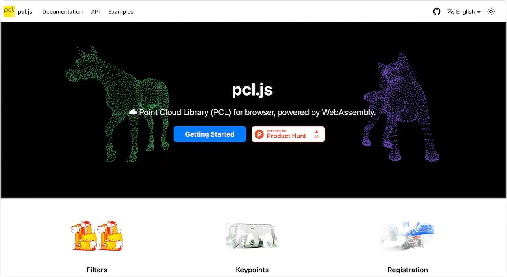

# C-C++与WebAssembly

## C语言与WebAssembly

[Web 端 H265 wasm 软解入门 - 掘金 (juejin.cn)](https://juejin.cn/post/7362547971060367398)

## C++与WebAssembly

## pcl.js - 通过WebAssembly将大型 C++ 库 PCL 移植到浏览器的 JS 库

**GitHub**：https://github.com/luoxuhai/pcl.js

官**网**：[https://pcljs.org](https://pcljs.org/)

### 简介

[pcl.js](https://github.com/luoxuhai/pcl.js) 是一个将大型 C++ 库 [Point Cloud Library (PCL)](https://pointclouds.org/) 编译为 **WebAssembly**，运行在浏览器中，并提供**易于使用的 JavaScript 接口**的开源库。Point Cloud Library (PCL) 是一个独立、大型、开源的 2D/3D 图像和 **[点云](https://zhuanlan.zhihu.com/p/22581673?utm_id=0)** 处理库，它实现了大量点云相关的通用算法和高效数据结构，涉及到点云**获取、滤波、分割、配准、检索、特征提取、识别、追踪、曲面重建、可视化**等。

### 示例

- 去除点云异常值：[https://kl2zjs.csb.app](https://kl2zjs.csb.app/)
- 提取点云关键点：[https://3l6tfj.csb.app](https://3l6tfj.csb.app/)

### 应用场景

在浏览器里处理由**激光雷达**等设备扫描生成的 [点云](https://zhuanlan.zhihu.com/p/22581673?utm_id=0) 数据。点云数据处理有以下应用场景：**无人驾驶、机器人、人机交互、逆向工程与其他工业自动化、测绘、建筑信息模型化**。

