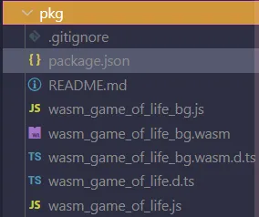
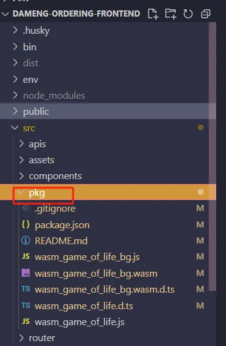
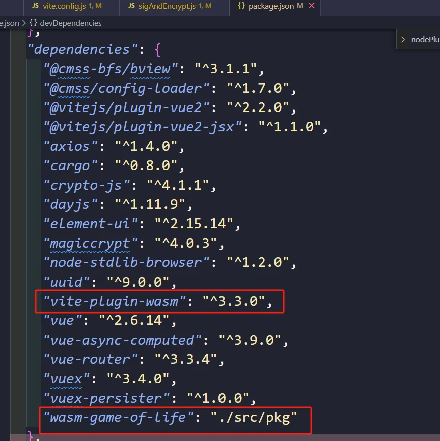
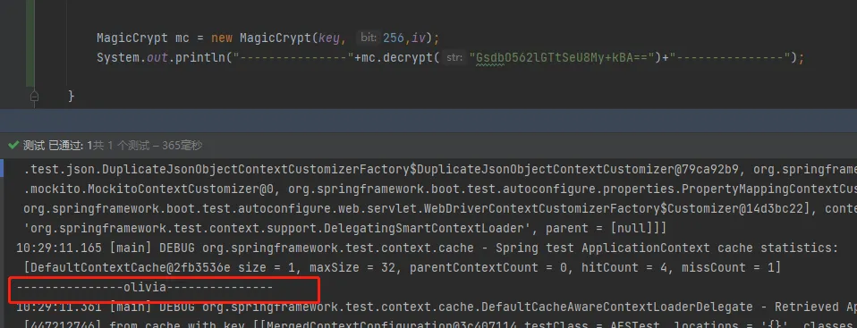

# Rust与WebAssembly

教程：[前端入门 ｜ Rust 和 WebAssembly - Rust精选 (rustmagazine.github.io)](https://rustmagazine.github.io/rust_magazine_2021/chapter_2/rust_wasm_frontend.html)

## Rust的WebAssembly运行时库

Rust与WebAssembly的结合为构建高性能、安全且开放的WebAssembly应用提供了许多优势。

能够方便地在web上与JavaScript互操作。Rust能够利用这一点，使得它在许多用例中非常有用。例如：

- CPU密集型工作(加密)
- GPU密集型工作(图像/视频处理、图像识别)

文档：https://www.rust-lang.org/zh-CN/what/wasm

### 以下是一些与Rust和WebAssembly相关的库和工具：

1. **wasm-bindgen**：这是一个工具，可以轻松地将Rust代码与WebAssembly之间生成绑定代码，使它们可以在JavaScript中调用。它简化了Rust和WebAssembly之间的互操作性。
2. **wasm-bindgen-cli**：
3. **web-sys**：这是一个Rust库，提供了对Web平台API的预打包绑定。使用web-sys，您可以在Rust中直接调用浏览器的功能，而无需手动编写JavaScript。
4. **wasm-pack**：这是一个用于构建、打包和发布Rust WebAssembly包的工具。它可以将Rust WebAssembly模块发布到npm等包仓库中心，并与webpack、Parcel等工具一起使用。
5. **napi-rs**：
6. **yew**：这是一个现代的Rust前端框架，用于构建Web应用程序。它使用WebAssembly作为目标，允许您在整个Web应用程序中使用Rust。
7. **source-map**：如果您需要在WebAssembly中处理源映射，可以使用Rust来提高性能。Rust不会强迫您在明确表达意图和运行时性能之间做出选择。

总之，Rust和WebAssembly的结合为构建高性能、安全且现代的Web应用提供了强大的工具和生态系统。

# 使用wasm-bindgen-cli

创建一个简单的图像处理模块，字节数组操作和数据处理是Rust可以显著提高应用程序速度的领域。

在开始之前，请确保安装了wasm32-unknown-unknown。如果没有，使用以下命令安装：

```bash
rustup target add wasm32-unknown-unknown
```

请注意，为了测试我们的模块，还需要额外安装npm(或任何替代方案)。

## 构建项目

首先使用如下命令创建一个名为wasm-example的新项目：

```bash
cargo init --lib wasm-example
```

然后，执行以下命令来安装依赖项：

```bash
cargo add wasm-bindgen@0.2.91
cargo add js-sys@0.3.68
cargo add image@0.25.0
```

我们还需要将动态库标志添加到Cargo.toml文件中。通常，它让Cargo知道我们想要创建一个动态系统库——但是当它与WebAssembly目标一起使用时，它的意思是“创建一个没有启动函数的*.wasm文件”：

```bash
[lib]
crate-type = ["cdylib"]
```

为了能够在Rust中使用JavaScript类型，除了使用wasm-bindgen宏之外，我们还需要使用extern C。这允许我们直接从JavaScript中导入函数到Rust中！

WASM中的Hello World例子是这样的：

```rust
use wasm_bindgen::prelude::*;

#[wasm_bindgen]
extern "C" {
    fn alert(s: &str);
}

#[wasm_bindgen]
pub fn greet(name: &str) {
    alert(&format!("Hello, {}!", name));
}
```

注意，外部C代码中的alert函数直接取自JavaScript，因此我们可以在Rust函数中调用它。如果我们要编译它并在JavaScript文件中执行，它将与从常规JavaScript文件中调用alert()相同。

我们可以应用相同的逻辑来处理其他类型和函数——缓冲区。JavaScript中的`Vec<u8>`可以用以下两种方式表示：

- Uint8Array类型(直接相当于JavaScript中的`Vec<u8>`)

- Buffer类型

  

Buffer是Uint8Array的子类。这是因为当Node.js第一次发布时，没有Uint8Array类型-这就是导致Buffer类型创建的原因。后来，当Uint8Arrays被引入ES6时，两者最终被合并。许多JavaScript库仍然使用Buffer，通过使用js-sys，我们可以在JavaScript和Rust之间实现互操作性。

让我们在src/lib.rs文件中一个定义Buffer类型和提供一个方法buffer()方法：

```rust
use js_sys::{wasm_bindgen, ArrayBuffer};

// 这定义了Node.js的Buffer类型
#[wasm_bindgen]
extern "C" {
    pub type Buffer;

    #[wasm_bindgen(method, getter)]
    fn buffer(this: &Buffer) -> ArrayBuffer;

    #[wasm_bindgen(method, getter, js_name = byteOffset)]
    fn byte_offset(this: &Buffer) -> u32;

    #[wasm_bindgen(method, getter)]
    fn length(this: &Buffer) -> u32;
}
```


现在，当我们编写WASM函数时，我们可以直接引用Buffer类型！

让我们编写用于转换图像文件格式的Rust函数。这个函数需要上面定义的缓冲区，它返回`Vec<u8>`。当我们通过wasm-pack或其他编译器编译它时，它将自动转换为Uint8Array。

```rust
use image::io::Reader;
use image::ImageFormat;
use js_sys::{wasm_bindgen, ArrayBuffer, Uint8Array};
use std::io::Cursor;
use wasm_bindgen::prelude::wasm_bindgen;

// .. extern C stuff goes here

#[wasm_bindgen]
pub fn convert_image(buffer: &Buffer) -> Vec<u8> {
    // 这将从Node.js缓冲区转换为Vec<u8>
    let bytes: Vec<u8> = Uint8Array::new_with_byte_offset_and_length(
        &buffer.buffer(),
        buffer.byte_offset(),
        buffer.length(),
    )
    .to_vec();

    let img2 = Reader::new(Cursor::new(bytes))
        .with_guessed_format()
        .unwrap()
        .decode()
        .unwrap();

    let mut new_vec: Vec<u8> = Vec::new();
    img2.write_to(&mut Cursor::new(&mut new_vec), ImageFormat::Jpeg)
        .unwrap();

    new_vec
}
```

## 通过wasm-bindgen-cli构建

首先，执行以下命令安装wasm-bindgen-cli：

```bash
cargo install wasm-bindgen-cli
```

然后，我们需要构建wasm32-unknown-unknown target，将Rust代码编译到WASM，我们可以这样做：

```bash
cargo build --target=wasm32-unknown-unknown
```

接下来，需要使用wasm-bindgen命令来生成JS粘合代码，以使其正常工作。我们使用nodejs target，它将生成一个CommonJS模块，并将其放在./pkg文件夹中，然后就可以将其植入到任何我们想要的地方。

```bash
wasm-bindgen --target nodejs --out-dir ./pkg ./target/wasm32-unknown-unknown/debug/wasm_example.wasm
```

现在我们可以将WASM代码作为包发布。

如果你不想使用CommonJS，比如你正在使用ESM (EcmaScript模块，或ES6模块)，CLI目前支持生成以下几种target：

- bundler：生成用于Webpack等捆绑器的代码
- Web：可直接在Web浏览器中加载
- nodejs：可通过require作为CommonJS的Node.js模块加载
- deno：可用作deno模块
- no-modules：像web目标，但不使用ES模块

就使用哪种编译器而言，最简单的方法通常是使用Webpack，因为它是最兼容的。

现在让我们来测试一下！我们将使用Express.js启动一个JavaScript后端服务器。在Rust项目根目录下运行以下代码(为了方便起见)：

```bash
npm init -y
npm i express express-fileupload
```

接下来，我们将在项目根目录中创建一个server.js文件，并插入以下代码：

```js
const express = require('express');
const fileUpload = require('express-fileupload');
const cors = require('cors');
const bodyParser = require('body-parser');
const morgan = require('morgan');
const _ = require('lodash');
const { convert_image } = require('./pkg/wasm_example.js');

const app = express();
const port = 3030;

app.use(fileUpload({
    createParentPath: true
}));

app.use(cors());
app.use(bodyParser.json());
app.use(bodyParser.urlencoded({extended: true}));
app.use(morgan('dev'));

app.get('/', (req, res) => {
  res.send(`
    <h2>With <code>"express"</code> npm package</h2>
    <form action="/api/upload" enctype="multipart/form-data" method="post">
      <div>Text field title: <input type="text" name="title" /></div>
      <div>File: <input type="file" name="file"/></div>
      <input type="submit" value="Upload" />
    </form>
  `);
});

app.post('/api/upload', (req, res, next) => {
    const image = convert_image(req.files.file.data);

    res.setHeader('Content-disposition', 'attachment; filename="meme.jpeg"');
    res.setHeader('Content-type', 'image/jpg');
    res.send(image);
});

app.listen(port, () => {
  console.log(`Example app listening on port ${port}`)
})
```

这段代码做了以下工作：

- 在端口3030设置了一个Express服务器
- 我们在/上有一个路由，当我们在浏览器中访问它时，它会给我们一个HTML表单
- 我们有一个API路由，它将从文件上传中获取数据，将其转换为新格式，设置正确的头信息并返回新图像。

使用以下命令启动服务器：

```bash
node server.js
```


然后在浏览器中输入http://localhost:3030/，如图：


请注意，根据用于图像文件格式转换的设置，转换后的文件大小可能会增加。这是因为使用的是无损转换。如果你想使用有损转换来减小文件大小，需要在Rust代码中实例化图像编码器时使用new_with_quality方法。

虽然wasm-bindgen-cli很有用，但它也是我们选项中最底层的CLI，在使用它时可能会遇到一些问题，比如wasm-bindgen版本不兼容问题。

# Wasm-pack的使用


wasm-pack是一个旨在将Rust编译为WASM的一站式工具。它包含一个CLI，可以使用如下命令来安装它：

```bash
cargo install wasm-pack
```

与使用wasm-bindgen-cli相比，它有许多质量上的升级：

- 附带一个WebAssembly分配器wee_alloc，它的代码占用(预压缩)为1kB。

- 附带一个panic钩子，可以在浏览器中调试Rust panic消息。

  

要初始化我们的项目，可以使用以下命令：

```bash
wasm-pack new wasm-example-2
```

它将为我们做所有的事情。在代码方面，我们的主函数(和C/JS绑定)将保持与wasm-pack相同，它主要提供工具添加，使编译更容易。

然后使用如下命令构建WASM：

```bash
wasm-pack build
或
wasm-pack build --target nodejs
```

### 开源插件

[rwasm/vite-plugin-rsw： 🦞 用于 Vite 的 wasm-pack 插件 (github.com)](https://github.com/rwasm/vite-plugin-rsw)

## Wasm-bpf：在 WebAssembly 中构建和运行 eBPF 程序的工具链与运行时

- 项目地址：https://github.com/eunomia-bpf/wasm-bpf
- 官网：[eunomia.dev/wasm-bpf/](https://eunomia.dev/wasm-bpf/)

### 项目描述：

Wasm 最初是以浏览器安全沙盒为目的开发的，发展到目前为止，WebAssembly 已经成为一个用于云原生软件组件的高性能、跨平台和多语言软件沙箱环境，Wasm 轻量级容器也非常适合作为下一代无服务器平台运行时。另一个令人兴奋的趋势是 eBPF 的兴起，它使云原生开发人员能够构建安全的网络、服务网格和多种可观测性组件，并且它也在逐步渗透和深入到内核的各个组件，提供更强大的内核态可编程交互能力。

现在，借助 Wasm-bpf 编译工具链和运行时，我们可以使用 Wasm 将 eBPF 程序编写为跨平台的模块，同时使用 C/C++ 或 Rust 来编写 Wasm-eBPF 程序并发布。通过在 WebAssembly 中使用 eBPF 程序，我们不仅能让 Wasm 应用享受到 eBPF 的高性能和对系统接口的访问能力，还可以让 eBPF 程序使用到 Wasm 的沙箱、灵活性、跨平台性、和动态加载，并且使用 Wasm 的 OCI 镜像来方便、快捷地分发和管理 eBPF 程序。结合这两种技术，我们将会给 eBPF 和 Wasm 生态来一个全新的开发体验！

Wasm-bpf 是一个 WebAssembly eBPF 库和运行时， 基于 [CO-RE](https://facebookmicrosites.github.io/bpf/blog/2020/02/19/bpf-portability-and-co-re.html)(一次编写 – 到处运行) [libbpf](https://github.com/libbpf/libbpf) 和 [wasm-micro-runtime](https://github.com/bytecodealliance/wasm-micro-runtime) 实现。

- 亮点：
- `通用`: 给 WASM 提供大部分的 eBPF 功能。 比如从 `ring buffer` 或者 `perf buffer` 中获取数据、 通过 `maps` 提供 `内核` eBPF 和 `用户态` Wasm 程序之间的双向通信、 动态 `加载`, `附加` 或者 `解除附加` eBPF程序等。 支持大量的 eBPF 程序类型和 map 类型， 覆盖了用于 `tracing（跟踪）`, `networking（网络）`, `security（安全）` 的使用场景。
- `高性能`: 对于复杂数据类型，没有额外的 `序列化` 开销。 通过 `共享内存` 来避免在 Host 和 WASM 端之间的额外数据拷贝。
- `简单便捷的开发体验`: 提供和 [libbpf-bootstrap](https://github.com/libbpf/libbpf-bootstrap) 相似的开发体验， `自动生成` Wasm-eBPF 的 `skeleton` 头文件以及用于绑定的 `类型` 定义。
- `非常轻量`: 编译完成的二进制文件只有 `1.5 MB` 的大小，编译好的 WASM 模块只有 `~90K` ，远远比传统的以容器方式分发和运行 eBPF 程序来的轻量，同时保持良好的隔离性和沙箱特性。你可以非常容易地使用任何语言，在任何平台上建立你自己的 Wasm-eBPF 运行时，使用相同的工具链来构建应用！


- 演示视频：https://www.bilibili.com/video/BV1vD4y1P78S/
- 示例代码：

使用 C/C++ 在 Wasm 中构建 eBPF 应用，将 eBPF 字节码加载到内核并处理内核返回的对应的数据

```
    /* Load and verify BPF application */
    skel = bootstrap_bpf__open();
    if (!skel) {
        fprintf(stderr, "Failed to open and load BPF skeleton\n");
        return 1;
    }

    /* Parameterize BPF code with minimum duration parameter */
    skel->rodata->min_duration_ns = env.min_duration_ms * 1000000ULL;

    /* Load & verify BPF programs */
    err = bootstrap_bpf__load(skel);
    if (err) {
        fprintf(stderr, "Failed to load and verify BPF skeleton\n");
        goto cleanup;
    }

    /* Attach tracepoints */
    err = bootstrap_bpf__attach(skel);
    if (err) {
        fprintf(stderr, "Failed to attach BPF skeleton\n");
        goto cleanup;
    }
```


使用 Rust 在 Wasm 中编写 eBPF 应用：

```
extern "C" fn handle_event(_ctx: u32, data: u32, _data_sz: u32) {
    let event_slice = unsafe { slice::from_raw_parts(data as *const Event, 1) };
    let event = &event_slice[0];
    let pid = event.pid;
    let ppid = event.ppid;
    let exit_code = event.exit_code;
    if event.exit_event == 1 {
        print!(
            "{:<8} {:<5} {:<16} {:<7} {:<7} [{}]",
            "TIME",
            "EXIT",
            unsafe { CStr::from_ptr(event.comm.as_ptr() as *const i8) }
                .to_str()
                .unwrap(),
            pid,
            ppid,
            exit_code
        );
        ...
}
```


一行命令从云端的 Github Packages 中下载并运行 eBPF 程序，或通过 Github Packages 发布：

```bash
# push to Github Packages
ecli push https://ghcr.io/eunomia-bpf/sigsnoop:latest
# pull from Github Packages
ecli pull https://ghcr.io/eunomia-bpf/sigsnoop:latest
# run eBPF program
ecli run https://ghcr.io/eunomia-bpf/sigsnoop:latest
```


- 后续更新计划：
  - 继续完善多种语言支持；
  - 支持更完善的 eBPF 特性；
  - 探索更多的应用场景；

# napi-rs的使用

napi-rs是一个框架，用于在Rust中构建预编译的Node.js插件。如果你发现使用wasm-bindgen太复杂而无法使用，并且只想编写Node.js的东西，那么这是一个很好的选择。要使用它。可以使用如下命令来安装它(需要npm或它的替代品)：

```bash
npm install -g @napi-rs/cli
```

安装完成后，就可以使用以下命令来构建新的napi项目了：

```bash
napi new wasm-example-3
```

napi-rs确实带来了一些代码的变化，你可以在下面看到：我们最终可以摆脱“extern C”块，而是使用napi的bindgen_prelude来包含我们需要的任何东西。

```rust
use napi::bindgen_prelude::*;
use image::io::Reader;
use image::ImageFormat;
use image::ImageOutputFormat;
use std::io::Cursor;

#[macro_use]
extern crate napi_derive;

#[napi]
pub fn convert_image(buffer: Buffer) -> Result<Buffer> {
    let bytes: Vec<u8> = buffer.into();

    let img2 = Reader::new(Cursor::new(bytes)).with_guessed_format().unwrap().decode().unwrap();

    let mut new_vec: Vec<u8> = Vec::new();
    img2.write_to(&mut Cursor::new(&mut new_vec), ImageFormat::Jpeg).unwrap();

    Ok(new_vec.into())
}
```

这样做的好处是显而易见的：

- 我们不需要使用“extern C”手动导入任何东西
- 我们可以轻松地使用Node.js内部组件

当然，尽管有这些优点，但是napi-rs只与Node.js兼容，同时还需要使用Node生态系统来更新CLI，从rust优先的角度来看，这是一个有点奇怪的方式。但是，napi-rs是用Rust开始编写Node.js的一种非常简单的方法。如果要为浏览器编写一些通用WASM代码，还是需要使用wasm-pack或wasm-bindgen。

# emsdk(Emscripten)库的使用

## 在浏览器内实现光线追踪

[juejin.cn/post/7363164003138797605](https://juejin.cn/post/7363164003138797605)

# Wasmtime库的使用

GitHub：https://github.com/bytecodealliance/wasmtime

官网：https://wasmtime.dev/

Wasmtime 是一个用于WebAssembly（简称WASM）的独立运行时，它由Bytecode Alliance项目开发。WASM是一种为更高效执行和更安全的Web应用而设计的二进制指令格式。Wasmtime运行时为开发者提供了一系列丰富、符合WASM标准的API，并通过优化生成高质量的机器代码，使WASM应用能在各种环境中快速、安全地运行。

## 安装与使用Wasmtime运行时

您可以通过使用以下简单的安装脚本在Linux和macOS上安装Wasmtime CLI：

```bash
curl https://wasmtime.dev/install.sh -sSf | bash
```

对于Windows用户或其他感兴趣的用户，可以直接从GitHub的Releases页面下载安装程序和二进制文件。

安装完Wasmtime后，如果您已经安装了Rust编译器，就可以使用以下的命令来编译和运行Rust源代码：

```bash
// Rust源代码
fn main() {
    println!("Hello, world!");
}
// 编译和运行命令
$ rustup target add wasm32-wasi
$ rustc hello.rs --target wasm32-wasi
$ wasmtime hello.wasm
// 输出：Hello, world!
```

这个示例展示了如何将Rust源代码编译为WASM，并使用Wasmtime运行它。

## Wasmtime的主要特性

- **速度快**：Wasmtime基于优化的Cranelift代码生成器构建，可以快速生成高质量的机器代码。Wasmtime针对有效实例化、嵌入者和wasm之间的低开销调用以及并发实例的可扩展性进行优化。
- **安全**：Wasmtime的开发强烈专注于正确性和安全性。每个Wasmtime特性都通过仔细的审查和考虑通过RFC过程。一旦特性被设计和实现，他们就会经受Google的OSS Fuzz提供的24/7模糊测试。随着特性的稳定，他们成为版本发布的一部分，当事情出错时，我们有一个明确的安全策略来快速缓解并修复任何问题。我们遵循深度防御的最佳实践，并集成针对像Spectre这样的问题的保护和缓解措施。
- **可配置**：Wasmtime使用合理的默认设置，但也可以配置提供对CPU和内存消耗等方面的更精细控制。

Wasmtime还提供了许多语言支持。

Bytecode Alliance支持的语言包括Rust（wasmtime crate）、C（wasm.h、wasi.h、wasmtime.h头文件）、C++（wasmtime-cpp库）、Python（wasmtime PyPI包）、.NET（Wasmtime NuGet包）、Go（wasmtime-go库）和Ruby（wasmtime宝石）。社区还支持了Elixir（wasmex hex包）和Perl（Wasm Perl包的Wasm::Wasmtime）。

# 前端加密实践：利用Rust与WebAssembly封装安全的加密工具

在当前日益重视数据安全和隐私保护的时代，前端应用中数据的安全传输和存储显得尤为重要。本文将详细介绍一个关于使用Rust语言结合WebAssembly（WASM）技术，在前端环境中实现高效且安全的加密功能的调研与实践过程。

## 一．背景知识介绍及目标

前端加密技术

前端加密技术是指在客户端（通常是浏览器）执行加密操作的技术。这种技术允许数据在发送到服务器之前进行加密，从而增强了数据的安全性和隐私保护。前端加密技术通常使用JavaScript来实现，但近年来，随着WebAssembly（Wasm）的发展，前端加密性能得到了显著提升。

前端加密技术主要包括以下几种：

对称加密算法：如AES（高级加密标准）。这种算法使用相同的密钥进行加密和解密。数据的安全性依赖于密钥的保密性。AES算法在前端加密中广泛使用，因为它既安全又高效；非对称加密算法：如RSA。这种算法使用一对密钥，一个用于加密（公钥），另一个用于解密（私钥）。公钥可以公开，而私钥必须保密。非对称加密算法在数字签名和密钥交换等场景中非常有用；哈希算法：如MD5和SHA-256。这些算法将任意长度的数据映射为固定长度的哈希值。哈希算法是不可逆的，即无法通过哈希值还原原始数据。哈希算法常用于验证数据的完整性和生成数字签名。

在前端加密中，还需要考虑一些额外的因素，如加密性能、浏览器兼容性以及加密密钥的管理。为了解决这些问题，开发者通常会使用一些专门的加密库，如crypto-js，这些库提供了丰富的加密功能，并且针对Web环境进行了优化。需要注意的是，虽然前端加密可以增强数据的安全性，但它并不能完全防止数据泄露。因此，在后端也需要采取相应的安全措施来保护数据。在实际应用中，前端加密通常与其他安全机制（如HTTPS、访问控制等）结合使用，以提供更全面的数据保护。

### AES加密

AES加密有AES-128、AES-192、AES-256三种，分别对应三种密钥长度128bits（16字节）、192bits（24字节）、256bits（32字节）。当然，密钥越长，安全性越高，加解密花费时间也越长。默认的是 AES-128，其安全性完全够用。

AES 算法为最常见的对称加密算法(微信小程序加密传输就是用这个加密算法的)。对称加密算法也就是加密和解密用相同的密钥，具体的加密流程如下：


AES有五种加密模式（CBC、ECB、CTR、OCF、CFB），分组密码有五种工作体制：

1.电码本模式（Electronic Codebook Book (ECB)）；

2.密码分组链接模式（Cipher Block Chaining (CBC)）；

3.计算器模式（Counter (CTR)）；

4.密码反馈模式（Cipher FeedBack (CFB)）；

5.输出反馈模式（Output FeedBack (OFB)）。


### WebAssembly

WebAssembly（简称Wasm）是一种为浏览器设计的二进制指令格式，它使得开发者能够将以其他语言（如C、C++、Rust等）编写的代码编译成WebAssembly格式，然后在现代网络浏览器中高效、安全地运行。WebAssembly的设计初衷是为了解决JavaScript在性能上的瓶颈，同时保持与Web平台的兼容性。

WebAssembly的主要特点包括：

高效性：WebAssembly代码接近原生应用的运行速度，可以在不同的平台上以接近本地速度运行，从而提升了应用程序的性能。

安全性：WebAssembly被限制在一个安全的沙箱执行环境中，遵循浏览器的同源策略和授权策略，确保了代码的安全运行。

可移植性：WebAssembly是一种开放的、与平台无关的二进制格式，可以在不同的浏览器和平台上运行，无需进行额外的修改。

兼容性：WebAssembly设计为与现有的Web技术无缝集成，可以嵌入到JavaScript代码中，或者作为独立的模块运行。此外，它还支持与其他网络技术的和谐共处，保持向后兼容。

WebAssembly的应用场景非常广泛，包括但不限于在线游戏、视频与音频编解码器、定制化的数据压缩、3D模型渲染、媒体编辑工具、语音合成与语音识别、客户端的计算机视觉等。此外，WebAssembly还可以用于服务端执行不可信任的代码，如服务端应用、移动混合原生应用等。

总的来说，WebAssembly为开发者提供了一种新的方式来提升Web应用的性能和安全性，使得更多的高级语言编写的应用程序能够在Web平台上高效运行。


### Rust语言

Rust是一种现代的系统级编程语言，由Mozilla主导开发并于2010年首次发布。Rust的设计初衷是为了克服C++等传统系统级语言中常见的内存安全问题，同时又不牺牲性能。Rust的核心理念在于提供“零开销抽象”，这意味着程序员可以在享受高级别抽象带来的便利的同时，还能保持接近C或C++的运行速度。

### Rust与加密安全性

在加密领域，Rust的重要性体现在其严格的内存管理模型上。Rust通过所有权系统和借用 checker 机制有效地预防了诸如缓冲区溢出、空指针解引用、数据竞争等内存错误，这类错误在处理敏感信息如密钥和加密数据时可能导致严重的安全漏洞。因此，使用Rust开发加密库能够极大地提高系统的安全性，减少因编程错误引发的安全风险。

### 高性能加密

Rust支持无垃圾回收的内存管理，允许开发者直接操作内存，这对于加密算法实现中的密集计算和低延迟场景至关重要。Rust编译器可以生成高效的本机代码，从而让加密算法在运行时达到接近C语言的性能水平。

### 并发安全

Rust强调并发安全，其语言特性确保了多线程环境下的数据一致性。加密库常常需要在多线程环境下工作，如处理大量并发加密请求，此时Rust提供的强大并发控制工具可以有效防止数据竞争和其他并发相关的bug。

## 二、项目实施步骤

1. 选择与开发Rust加密库：首先选定magiccrypto这样的可信加密库作为基础支持，基于此开发一个专门针对AES加密/解密操作的模块。
2. Rust到WebAssembly的编译：使用wasm-pack等工具将Rust加密模块编译成WebAssembly模块，确保生成的.wasm文件可在浏览器环境中安全、高效地运行。
3. JavaScript接口封装：创建JavaScript层适配代码，借助WebAssembly的导入导出机制，将Rust加密API暴露给JavaScript调用，实现两者之间的无缝集成。
4. 前端项目的集成：在实际前端应用中引入编译好的WebAssembly加密模块，并编写相关业务逻辑以实现在用户登录密码加密、敏感信息传输加密等场景下的应用。

## 三、实践细节与挑战

本文采用rust+wasm的方法加密前端AES算法中的key和iv，避免在浏览器编译的过程中明文暴漏出来。操作步骤如下：

### Step1 创建Rust项目：

官方文档地址：https://rustwasm.github.io/docs/book/game-of-life/hello-world.html

目录如下


### Step2 实现加密逻辑：

引入加密库MagicCrypt

MagicCrypt地址：https://github.com/magiclen/rust-magiccrypt

MagicCrypt是一个Java/PHP/NodeJS/Rust库，用于使用数据加密标准（DES）或高级加密标准（AES）算法加密/解密字符串、文件或数据。它支持CBC分组密码模式、PKCS5填充以及64、128、192或256位的密钥长度。如果加密数据是字符串，它将自动格式化为Base64。

需要设置Rust开发环境：rustup


调用加密方法


### Step3 打包为WebAssembly依赖文件：

wasm-pack build

获得pkg文件

Pkg文件目录如下



### Step4 集成到前端项目：

将生成的pkg文件夹复制到前端项目的适当路径下。

在前端项目的package.json文件中添加指向pkg文件夹中JavaScript绑定文件的引用，并运行npm install安装本地依赖。

在Vite配置文件vite.config.js中启用WASM插件以便正确加载和解析.wasm文件：



在package.json中输入pkg的地址



Npm install

在vite.config.js中安装


### Step5 在对应地方引入所需的加密函数


将需要加密的内容传入引入的函数

在页面调用


即可获取加密后的内容


### Step6 将加密后的内容解密验证


解密得到前端加密之前的内容，加密实践成功

将前端加密结果发给后端，后端解密成功



通过以上方法，我们可以成功地在前端环境中利用Rust和WebAssembly的优势，构建一个高效、安全的加密解决方案，极大地增强了应用程序的数据安全保障能力。同时，这一方案也强调了综合运用多种安全措施的重要性，包括前端加密、HTTPS协议以及严格的后端数据保护策略等。

# 优秀的Rust WebAssembly项目

文档：https://www.rust-lang.org/zh-CN/what/wasm

以下是一些与Rust和WebAssembly相关的优秀项目：

1. **deno**：作为Node.js的替代，deno旨在为TypeScript/Javascript提供更现代、更安全、更强大的运行时。它内置了许多强大的工具，用于打包、编译成可执行文件、文档、测试、lint等.
2. **alacritty**：这是一个跨平台、基于OpenGL的终端，性能极高且支持自定义和可扩展性.
3. **starship**：一个命令行提示，支持任何shell，包括zsh。它简单易用、非常快且高度可配置，同时支持智能提示.
4. **MeiliSearch**：一个轻量级搜索平台，用于终端用户提供边输入边提示的即刻搜索功能。适用于网页端或APP的搜索条.
5. **swc**：Typescript/Javascript编译器，用于编译、压缩和打包JS。被Next.js、Parcel、Deno等知名项目使用，性能非常高.
6. **yew**：一个正在活跃开发的Rust/Wasm框架，用于构建Web应用.
7. **firecracker**：一个安全、高性能的无服务计算虚拟机，由Amazon公司开发，为AWS部分云计算服务提供支持.
8. **nushell**：一个全新的shell，使用Rust实现，具有现代化特性，例如使用SQL语法来选择内容.
9. **tokio**：一个异步IO的运行时，提供了I/O、网络、调度、定时器等异步编程所必须的功能和工具，性能和功能都异常强大.
10. **AppFlowy**：Notion的开源实现，使用Rust和Flutter构建，用于用户文档和数据的管理.
11. **Bevy**：一个数据驱动的游戏引擎，支持2D和3D图形开发，社区活跃且更新快.
12. **actix-web**：全世界最快的web框架之一，功能丰富，性能强大.
13. **iced**：一个跨平台GUI库，具有简单易用、模块化设计、响应式布局等优点.
14. **wasmer**：业界领先的WASM运行时，支持WASI和Emscripten.
15. **ruffle**：用Rust写的Flash Player模拟器，支持桌面端和Web端，通过WASM提供支持.
16. **rustdesk**：国内团队开发的一款远程桌面软件，使用Rust和Flutter构建.
17. **RustPython**：使用Rust实现的Python解释器，支持Python3.
18. **vector**：一个性能很高的数据采集agent，用于采集本地的日志、监控等数据，发送到远程的kafka、jaeger等数据下沉端.
19. **mdbook**：基于markdown文件自动创建在线电子书的工具.
20. **zola**：静态网站生成器，类似hugo.
