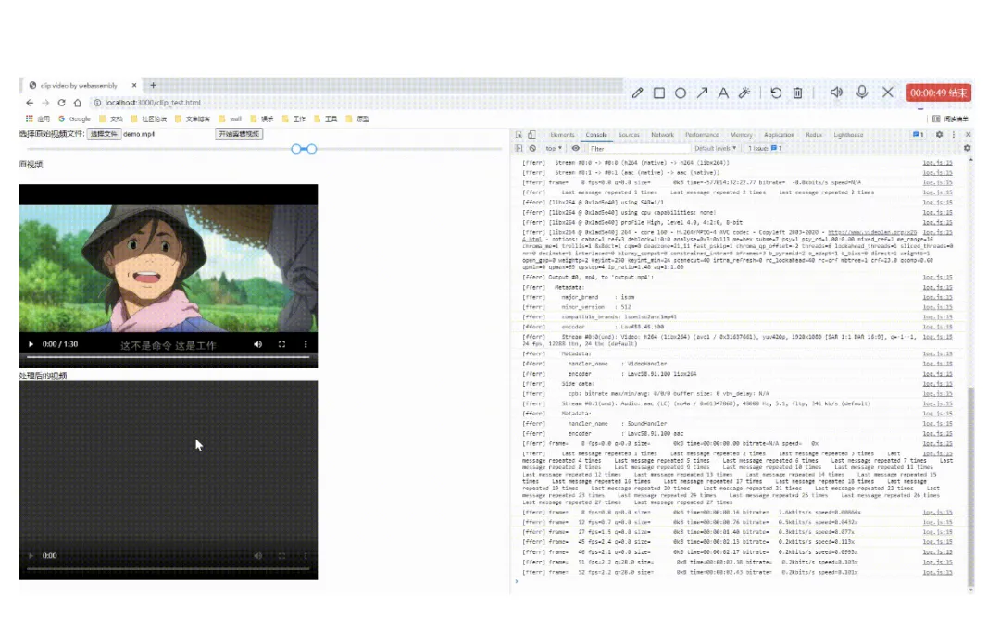

# WebAssembly 入门

[【WASM 入门与实战】使用 Rust 封装一个 WASM NPM 包 - 掘金 (juejin.cn)](https://juejin.cn/post/7219613068275449893)

[浏览器第四种语言-WebAssembly - 掘金 (juejin.cn)](https://juejin.cn/post/7212074532341104699)

[WebAssembly：开启新时代的跨平台 - 掘金 (juejin.cn)](https://juejin.cn/post/7242614671001288759)

[走进 WebAssembly 的世界 - 字节前端的专栏 - 掘金 (juejin.cn)](https://juejin.cn/column/7210666370487681082)

[WebAssembly：未来前端开发的必备技能 - 掘金 (juejin.cn)](https://juejin.cn/post/7229899593260154935)

[使用 WebAssembly 来增强你的前端应用 - 掘金 (juejin.cn)](https://juejin.cn/post/7103155873740455944)

[前端视频帧提取 ffmpeg + Webassembly - 掘金 (juejin.cn)](https://juejin.cn/post/6854573219454844935)

## 如何在应用里使用 WebAssembly？

WebAssembly 给 Web 平台添加了两块内容：一种二进制格式代码，以及一系列可用于加载和执行二进制代码的 API。

WebAssembly 目前处于一个萌芽的节点，之后肯定会涌现出很多工具，而目前有四个主要的入口：

- 使用 EMScripten 来移植 C/C++ 应用
- 在汇编层面直接编写和生成 WebAssembly 代码
- 编写 Rust 应用，然后将 WebAssembly 作为它的输出
- 使用 AssemblyScript，它是一门类似 TypeScript 的语言，能够编译成 WebAssembly 二进制

[ WebAssembly，移植 C/C++ 应用（后面的教程都可以）](https://juejin.cn/post/7013286944553566215#heading-5)

## Rust 和 WebAssembly 书籍

[介绍 - Rust 和 WebAssembly (llever.com)](https://llever.com/rustwasm-book/introduction.zh.html#rust--和-webassembly-)

[Rust WebAssembly 实现视频实时滤镜效果 - 掘金 (juejin.cn)](https://juejin.cn/post/7340307383505862696)

[解锁前端新潜能：如何使用 Rust 锈化前端工具链 - 掘金 (juejin.cn)](https://juejin.cn/post/7321410906426998810)

[WASM-BINDGEN 搭起 Rust 与 JavaScript 的桥梁 (qq.com)](https://mp.weixin.qq.com/s/6CI44wULfQbj-4ez4yPtiQ)

[前端Rust生态的背后，napi-rs如何让Rust与JavaScript可以相互调用 - 掘金 (juejin.cn)](https://juejin.cn/post/7322288075850039359)

**MDN 教程文档(包括 C/C++和 Rust 语言编写 WebAssembly 的教程)**：[WebAssembly | MDN (mozilla.org)](https://developer.mozilla.org/zh-CN/docs/WebAssembly)

[i5ting/learn-rust-for-fe: Rust 是未来前端基础设施 (github.com)](https://github.com/i5ting/learn-rust-for-fe)

[揭秘 Rust Sycamore 如何革新前端开发，打造极速响应式 SPA【耗血整理】 (qq.com)](https://mp.weixin.qq.com/s/QsiYZxCoweelaeEb6vFaog)


[使用Rust和WebAssembly整花活儿(一)——快速开始 - 掘金 (juejin.cn)](https://juejin.cn/post/7244436632439013413)

[使用Rust和WebAssembly整花活儿(二)——DOM和类型转换 - 掘金 (juejin.cn)](https://juejin.cn/post/7245610463899025468)

[使用Rust和WebAssembly整花活儿(三)——Rust与JS交互 - 掘金 (juejin.cn)](https://juejin.cn/post/7248951438743420983)

[使用Rust和WebAssembly整花活儿(四)——更小更小的wasm文件体积 - 掘金 (juejin.cn)](https://juejin.cn/post/7294476268505448475)

## WebAssembly 官网

网址：[WebAssembly](https://webassembly.org/)

资源社区：[资源 - WebAssembly](https://webassembly.org/community/resources/)

中文网：[WebAssembly中文网 | WebAssembly中文网 (wasmdev.cn)](https://wasmdev.cn/)

## 视频学习

[学习 WebAssembly：实用指南 |从零到精通 (zerotomastery.io)](https://zerotomastery.io/courses/learn-webassembly/)

## 探索进阶主题

当掌握了 WebAssembly 的基础知识后，可以进一步探索一些进阶主题。例如，如何在 JavaScript 中使用 WebAssembly、如何优化 WebAssembly 代码的性能等。

## 支持WebAssembly的语言

[Webassembly支持哪些语言？ | WebAssembly中文网 (wasmdev.cn)](https://wasmdev.cn/guide/introduction/lang-wasm.html#wasm支持的编程语言)

WebAssembly作为一项新兴的技术，已经发展至2.0版本。它具有跨平台、高效、安全的优点，可以在各种计算机架构上运行，并且具有接近原生代码的性能。目前，许多语言已经支持了WebAssembly，让开发者能够更方便地将不同语言编写的代码部署到Web端。以下是一些常用的WebAssembly开发语言：

1. **C/C++**: C/C++是WebAssembly的先行者，拥有庞大的用户群体和完备的工具链。LLVM已经将WebAssembly添加为受支持的后端，同时WebAssembly System Interface标准（WASI）使得WebAssembly的能力从Web端拓展到了非Web端，服务端成为了WebAssembly下一个热门的发展方向。
2. **Rust**: Rust是WebAssembly的目标语言之一，通过LLVM生成WebAssembly产物。Rust兼容C/C++的内存模型，无GC，因此生成的WebAssembly产物体积小巧性能良好。Rust同样支持WASI标准，非Web端应用也成了Rust WebAssembly生态发展的热门方向。
3. **Go**: Go从1.11版本开始正式支持WebAssembly，但存在一些局限性，如不支持WASI和体积膨胀。尽管如此，Go作为服务端领域的主流语言，仍在WebAssembly社区中有一定影响力。
4. **AssemblyScript**: AssemblyScript是专为WebAssembly服务的语言，使用类似TypeScript的语法。它方便前端开发者编写WebAssembly项目，但生成的WebAssembly产物相对臃肿。
5. **JavaScript**: JavaScript作为前端领域必不可少的语言，与WebAssembly可以无缝交互。通过WebAssembly的JavaScript API，你可以在同一个应用中利用WebAssembly的性能和能力以及JavaScript的表达力和灵活性。

除了上述语言，还有其他一些主流语言以各种方式支持了WebAssembly，例如Lua、C#、Kotlin等。WebAssembly的发展潜力巨大，未来还有许多值得期待的方向，如多线程支持、AI模型的推理和训练，以及在区块链领域的智能合约编写和执行

# 运行时执行

就像编译 wasm 的方式有很多种一样，执行它的方法也有很多种。

## 在浏览器中使用WebAssembly

要在浏览器中使用WebAssembly API，首先加载WebAssembly模块：

```javascript
// fetch .wasm file
const response = fetch('/path/to/some.wasm')

// instantiate module with streaming
const module = WebAssembly.instantiateStreaming(response)
```

然后，调用导出的`add`的函数：

```java
const result = module.instance.exports.add(1, 2)
```

还可以向模块传递其他方法，例如可以共享 `console.log` 方法：

```javascript
// fetch .wasm file
const response = fetch('/path/to/some.wasm')

// instantiate module and pass an api
const module = WebAssembly.instantiateStreaming(response, {
  imports: {
    // share console.log
    log: console.log
  }
  
})
```

## 在服务器上使用 WebAssembly

WebAssembly也可以在服务器上执行，使用的方法与在浏览器中的几乎相同。

唯一不同的是，不使用URL从服务器获取.wasm文件，而是使用 `fs.readFile()` 从磁盘上读取它：

```javascript
import fs from 'fs'

// read .wasm file
const bytes = await fs.promises.readFile('/path/to/some.wasm')

// instantiate the module
const module = WebAssembly.instantiate(bytes)
```

然后，调用 `add` 函数：

```java
const result = module.instance.exports.add(1, 2)
```

还可以从许多其他编程语言中执行此操作，例如 **rust[5] \**、\** ruby[6]**、 **python[7]** 或来自 **CLI[8]** 。

## 在云端使用 WebAssembly

WebAssembly在云端也有一些重要的应用场景。

与JavaScript云函数相比，它具备一些明显的优势：

1. 无冷启动：主机只需加载一个.wasm文件，而不是整个应用程序；典型的JavaScript应用包含许多需要加载的文件，这会耗费较长的时间。
2. 更快的部署：需要上传的仅仅是一个简单的二进制文件。
3. 多语言托管：所有可以编译为WebAssembly的编程语言都可以在云中部署，无需特殊的运行时环境。
4. 快照：执行状态可以进行快照；例如，一个在初始化期间执行大量计算的应用程序可以创建快照。随后的请求可以从快照状态开始，从而避免浪费大量的启动时间。

# 120 行代码实现纯 Web 剪辑视频

### 什么是 webasembly?

WebAssembly（wasm）就是一个可移植、体积小、加载快并且兼容 Web 的全新格式。可以将 C,C++等语言编写的模块通过编译器来创建 wasm 格式的文件，此模块通过二进制的方式发给浏览器，然后 js 可以通过 wasm 调用其中的方法功能。

### WebAssembly 的优势

网上对于这个相关的介绍应该有很多了，WebAssembly 优势性能好，运行速度远高于 Js,对于需要高计算量、对性能要求高的应用场景如图像/视频解码、图像处理、3D/WebVR/AR 等，优势非常明显，们可以将现有的用 C、C++等语言编写的库直接编译成 WebAssembly 运行到浏览器上，并且可以作为库被 JavaScript 引用。那就意味着我们可以将很多后端的工作转移到前端，减轻服务器的压力。.........

### WebAssembly 最简单的实践调用

我们编写一个最简单的 c 文件

```c
int add(int a,int b) {
  return a + b;
}
```

然后安装对于的 Emscripten 编译器 Emscripten 安装指南

```bash
emcc test.c -Os -s WASM=1 -s SIDE_MODULE=1 -o test.wasm
```

然后我们在 html 中引入使用即可

```js
fetch("./test.wasm")
	.then((response) => response.arrayBuffer())
	.then((bytes) => WebAssembly.instantiate(bytes))
	.then((results) => {
		const add = results.instance.exports.add;
		console.log(add(11, 33));
	});
```

这时我们即可在控制台看到对应的打印日志,成功调用我们编译的代码啦

### 正式开动

既然我们已经知道如何能快速的调用到一些已经成熟的 C,C++的类库，那我们离在线剪辑视频预期目标更进一步了。

### 最终 demo 演示

由于录制操作的电脑 cpu 不太行，所以可能耗时比较久，但整体的效果还是能看的到滴

demo 仓库地址：https://github.com/Dseekers/clip-video-by-webassembly



### FFmpeg

在这个之前你得稍微的了解下啥是 FFmpeg? 以下根据维基百科的目录解释

> FFmpeg 是一个开放源代码的自由软件，可以运行音频和视频多种格式的录影、转换、流功能[1]，包含了 libavcodec——这是一个用于多个项目中音频和视频的解码器库，以及 libavformat——一个音频与视频格式转换库。

简单的说这个就是由 C 语言编写的视频处理软件，它的用法也是相当滴简单

我主要将这次需要用到的命令给调了出来，如果你还可能用到别的命令，可以根据他的官方文档查看 ，还可以了解下阮一峰大佬的文章 (https://www.ruanyifeng.com/blog/2020/01/ffmpeg.html)

```bash
ffmpeg -ss [start] -i [input] -to [end] -c copy [output]
```

start 为开始时间 end 为结束时间 input 为需要操作的视频源文件 output 为输出文件的位置名称

这一行代码就是我们需要用到的剪辑视频的命令了

### 获取相关的 FFmpeg 的 wasm

由于通过 Emscripten 编译 ffmpeg 成 wasm 存在较多的环境问题，所以我们这次直接使用在线已经编译好的 CDN 资源

这边就直接使用了这个比较成熟的库 https://github.com/ffmpegwasm/ffmpeg.wasm

为了本地调试方便，我把其相关的资源都下了下来 一共 4 个资源文件

```js
ffmpeg.min.js;
ffmpeg - core.js;
ffmpeg - core.wasm;
ffmpeg - core.worker.js;
```

我们使用的时候只需引入第一个文件即可，其它文件会在调用时通过 fetch 方式去拉取资源

### 最小的功能实现

前置功能实现: 在我们本地需要实现一个 node 服务，因为使用 ffmpeg 这个模块会出现如果没在服务器端设置响应头， 会报错 `SharedArrayBuffer is not defined`，这个是因为系统的安全漏洞，浏览器默认禁用了该 api，若要启用则需要在 header 头上设置

```bash
Cross-Origin-Opener-Policy: same-origin
Cross-Origin-Embedder-Policy: require-corp
```

我们启动一个简易的 node 服务

```js
const Koa = require("koa");
const path = require("path");
const fs = require("fs");
const router = require("koa-router")();
const static = require("koa-static");
const staticPath = "./static";
const app = new Koa();
app.use(static(path.join(__dirname, staticPath)));
// log request URL:
app.use(async (ctx, next) => {
	console.log(`Process ${ctx.request.method} ${ctx.request.url}...`);
	ctx.set("Cross-Origin-Opener-Policy", "same-origin");
	ctx.set("Cross-Origin-Embedder-Policy", "require-corp");
	await next();
});

router.get("/", async (ctx, next) => {
	ctx.response.body = "<h1>Index</h1>";
});
router.get("/:filename", async (ctx, next) => {
	console.log(ctx.request.url);
	const filePath = path.join(__dirname, ctx.request.url);
	console.log(filePath);
	const htmlContent = fs.readFileSync(filePath);
	ctx.type = "html";
	ctx.body = htmlContent;
});
app.use(router.routes());
app.listen(3000);
console.log("app started at port 3000...");
```

我们做一个最小化的 demo 来实现下这个剪辑功能,剪辑视频的前一秒钟 新建一个 demo.html 文件，引入相关资源

```html
<script src="https://cdn.jsdelivr.net/npm/jquery@3.6.0/dist/jquery.min.js"></script>
<script src="./assets/ffmpeg.min.js"></script>

<div class="container">
	<div class="operate">
		选择原始视频文件:
		<input type="file" id="select_origin_file" />
		<button id="start_clip">开始剪辑视频</button>
	</div>
	<div class="video-container">
		<div class="label">原视频</div>
		<video class="my-video" id="origin-video" controls></video>
	</div>
	<div class="video-container">
		<div class="label">处理后的视频</div>
		<video class="my-video" id="handle-video" controls></video>
	</div>
</div>
let originFile $(document).ready(function () {
$('#select_origin_file').on('change', (e) => { const file = e.target.files[0]
originFile = file const url = window.webkitURL.createObjectURL(file)
$('#origin-video').attr('src', url) }) $('#start_clip').on('click', async
function () { const { fetchFile, createFFmpeg } = FFmpeg; ffmpeg =
createFFmpeg({ log: true, corePath: './assets/ffmpeg-core.js', }); const file =
originFile const { name } = file; if (!ffmpeg.isLoaded()) { await ffmpeg.load();
} ffmpeg.FS('writeFile', name, await fetchFile(file)); await ffmpeg.run('-i',
name, '-ss', '00:00:00', '-to', '00:00:01', 'output.mp4'); const data =
ffmpeg.FS('readFile', 'output.mp4'); const tempURL = URL.createObjectURL(new
Blob([data.buffer], { type: 'video/mp4' })); $('#handle-video').attr('src',
tempURL) }) });
```

其代码的含义也是相当简单，通过引入的 FFmpeg 去创建一个实例，然后通过 ffmpeg.load()方法去加载对应的 wasm 和 worker 资源 没有进行优化的 wasm 的资源是相当滴大，本地文件竟有 23MB，这个若是需要投入生产的可是必须通过 emcc 调节打包参数的方式去掉无用模块。然后通 fetchFile 方法将选中的 input file 加载到内存中去，接下来就可以通过 ffmpeg.run 运行和 本地命令行一样的 ffmpeg 命令行参数了参数基本一致

这时我们的核心功能已经实现完毕了。

### 做一点小小的优化

剪辑的话最好是可以选择时间段，我这为了方便直接把 element 的以 cdn 方式引入使用 通过 slider 来截取视频区间,我这边就只贴 js 相关的代码了，具体代码可以去 github 仓库里面仔细看下

```js
class ClipVideo {
	constructor() {
		this.ffmpeg = null;
		this.originFile = null;
		this.handleFile = null;
		this.vueInstance = null;
		this.currentSliderValue = [0, 0];
		this.init();
	}
	init() {
		console.log("init");
		this.initFfmpeg();
		this.bindSelectOriginFile();
		this.bindOriginVideoLoad();
		this.bindClipBtn();
		this.initVueSlider();
	}
	initVueSlider(maxSliderValue = 100) {
		console.log(`maxSliderValue ${maxSliderValue}`);
		if (!this.vueInstance) {
			const _this = this;
			const Main = {
				data() {
					return {
						value: [0, 0],
						maxSliderValue: maxSliderValue,
					};
				},
				watch: {
					value() {
						_this.currentSliderValue = this.value;
					},
				},
				methods: {
					formatTooltip(val) {
						return _this.transformSecondToVideoFormat(val);
					},
				},
			};
			const Ctor = Vue.extend(Main);
			this.vueInstance = new Ctor().$mount("#app");
		} else {
			this.vueInstance.maxSliderValue = maxSliderValue;
			this.vueInstance.value = [0, 0];
		}
	}
	transformSecondToVideoFormat(value = 0) {
		const totalSecond = Number(value);
		let hours = Math.floor(totalSecond / (60 * 60));
		let minutes = Math.floor(totalSecond / 60) % 60;
		let second = totalSecond % 60;
		let hoursText = "";
		let minutesText = "";
		let secondText = "";
		if (hours < 10) {
			hoursText = `0${hours}`;
		} else {
			hoursText = `${hours}`;
		}
		if (minutes < 10) {
			minutesText = `0${minutes}`;
		} else {
			minutesText = `${minutes}`;
		}
		if (second < 10) {
			secondText = `0${second}`;
		} else {
			secondText = `${second}`;
		}
		return `${hoursText}:${minutesText}:${secondText}`;
	}
	initFfmpeg() {
		const { createFFmpeg } = FFmpeg;
		this.ffmpeg = createFFmpeg({
			log: true,
			corePath: "./assets/ffmpeg-core.js",
		});
	}
	bindSelectOriginFile() {
		$("#select_origin_file").on("change", (e) => {
			const file = e.target.files[0];
			this.originFile = file;
			const url = window.webkitURL.createObjectURL(file);
			$("#origin-video").attr("src", url);
		});
	}
	bindOriginVideoLoad() {
		$("#origin-video").on("loadedmetadata", (e) => {
			const duration = Math.floor(e.target.duration);
			this.initVueSlider(duration);
		});
	}
	bindClipBtn() {
		$("#start_clip").on("click", () => {
			console.log("start clip");
			this.clipFile(this.originFile);
		});
	}
	async clipFile(file) {
		const { ffmpeg, currentSliderValue } = this;
		const { fetchFile } = FFmpeg;
		const { name } = file;
		const startTime = this.transformSecondToVideoFormat(currentSliderValue[0]);
		const endTime = this.transformSecondToVideoFormat(currentSliderValue[1]);
		console.log("clipRange", startTime, endTime);
		if (!ffmpeg.isLoaded()) {
			await ffmpeg.load();
		}
		ffmpeg.FS("writeFile", name, await fetchFile(file));
		await ffmpeg.run(
			"-i",
			name,
			"-ss",
			startTime,
			"-to",
			endTime,
			"output.mp4"
		);
		const data = ffmpeg.FS("readFile", "output.mp4");
		const tempURL = URL.createObjectURL(
			new Blob([data.buffer], { type: "video/mp4" })
		);
		$("#handle-video").attr("src", tempURL);
	}
}
$(document).ready(function () {
	const instance = new ClipVideo();
});
```

这样文章开头的效果就这样实现啦

# Rust 利用 wasm-bindgen 做一个简化 web 计算器

## 入门

`wasm-bindgen`是一个 Rust 库和工具，旨在促进 WebAssembly 模块与 JavaScript 之间的高级交互。它允许开发者在 Rust 中定义 JavaScript 类，或者从 JavaScript 获取和返回复杂的类型，如字符串、对象等。本教程将指导你如何使用`wasm-bindgen`来创建和部署一个 Rust 编写的 WebAssembly 应用。

### 步骤 1: 设置 Rust 环境

确保你已经安装了 Rust 和 Cargo。如果没有，请访问 [Rust 官网](https://www.rust-lang.org/tools/install) 进行安装。

### 步骤 2: 创建新的 Rust 项目

在命令行中创建一个新的 Rust 库项目，并将其指定为 WebAssembly 目标：

```bash
cargo new my_project --lib
```

将`my_project`替换为你的项目名称。

### 步骤 3: 编辑 `Cargo.toml`

在你的`Cargo.toml`文件中，添加`wasm-bindgen`依赖项：

```toml
[dependencies]
wasm-bindgen = "0.2"
```

### 步骤 4: 编写 Rust 代码

在你的`src/lib.rs`文件中，使用`wasm-bindgen`宏定义 Rust 函数和 JavaScript 交互：

```rust
use wasm_bindgen::prelude::*;

#[wasm_bindgen]
pub fn say_hello(name: &str) {
	web_sys::console::log_1(&wasm_bindgen::JsValue::from_str(&format!("Hello, {}!", name)));
}
```

这里我们定义了一个`say_hello`函数，它接受一个字符串参数`name`，并使用`web_sys`的`console::log`函数在浏览器控制台输出一条问候信息。

### 步骤 5: 编译 Rust 代码为 WebAssembly

使用以下命令编译你的 Rust 项目为 WebAssembly 模块：

```bash
cargo build --target wasm32-unknown-unknown
```

编译完成后，你会在`target/wasm32-unknown-unknown/debug/my_project.wasm`找到编译后的文件。

### 步骤 6: 使用 `wasm-bindgen` 生成 JavaScript 绑定

安装`wasm-bindgen-cli`工具，并使用它来生成 JavaScript 绑定：

```bash
cargo install wasm-bindgen-cli

wasm-bindgen target/wasm32-unknown-unknown/debug/my_project.wasm --out-dir ./pkg --target web
```

这将生成一个`pkg`目录，其中包含与你的 WebAssembly 模块交互所需的 JavaScript 文件。

### 步骤 7: 在 Web 应用中使用 WebAssembly 模块

在你的 HTML 文件中，添加一个脚本标签来加载编译后的 WebAssembly 模块：

```html
<!DOCTYPE html>
<html>
	<head>
		<meta charset="utf-8" />
		<title>My Rust Wasm App</title>
		<script src="pkg/my_project.js"></script>
	</head>
	<body>
		<script>
			my_project.say_hello("World"); // 调用 Rust 函数
		</script>
	</body>
</html>
```

现在，当你在浏览器中打开这个 HTML 文件时，你应该会在控制台看到输出的问候信息。

### 额外资源

- [wasm-bindgen 官方文档](https://rustwasm.github.io/docs/wasm-bindgen/)

- [Yew v0.18 中文文档](https://www.bookstack.cn/read/yew-0.18-zh) - 包含了关于`wasm-bindgen`的更多高级用法。

- [MDN WebAssembly 文档](https://developer.mozilla.org/zh-CN/docs/WebAssembly) - 提供了关于 WebAssembly 和相关技术的详细信息。

通过以上步骤，你已经成功地创建并运行了一个使用`wasm-bindgen`的 Rust WebAssembly 应用。你可以继续探索`wasm-bindgen`的更多功能，如使用`JsCast`进行类型转换、`wasm-bindgen-futures`处理异步操作等，以增强你的应用功能。

## 简单版计算器

我们可以设计并实现一个复杂的 Web 计算器项目，它不仅支持基本的加减乘除运算，还包括更高级的数学功能，如指数、对数、三角函数等。这个项目将使用 WebAssembly (Wasm) 和 JavaScript 结合来实现。

### 项目概述

计算器项目将包含以下特性：

- 基本运算：加法、减法、乘法、除法。

- 高级运算：指数、对数、平方根、三角函数等。

- 用户界面：清晰的输入输出显示，操作按钮。

- 错误处理：处理除以零等错误情况。

- 历史记录：保存用户的计算历史。

### 技术栈

- **Rust**：作为 WebAssembly 的编写语言，因为它提供了性能和安全性。

- **wasm-bindgen**：将 Rust 代码与 JavaScript 互操作。

- **JavaScript**：用于创建用户界面和处理用户交互。

- **HTML/CSS/Vue**：构建前端页面和样式。

### 实现步骤

#### 1. Rust 计算器库

创建一个 Rust 库，实现计算器的核心功能。使用`wasm-bindgen`来暴露 Rust 函数给 JavaScript。

```rust
// calculator.rs
use wasm_bindgen::prelude::*;

#[wasm_bindgen]
pub struct Calculator;

#[wasm_bindgen]
impl Calculator {
pub fn new() -> Calculator {
Calculator
}

// 基本运算

pub fn add(&self, a: f64, b: f64) -> f64 {
 a + b
}

pub fn subtract(&self, a: f64, b: f64) -> f64 {
 a - b
}

pub fn multiply(&self, a: f64, b: f64) -> f64 {
 a * b
}

pub fn divide(&self, a: f64, b: f64) -> Result<f64, &'static str> {
 if b == 0.0 {
 Err("Cannot divide by zero")
 } else {
 Ok(a / b)
 }
}

// 高级运算
pub fn sqrt(&self, a: f64) -> f64 {
 (a).sqrt()
}

pub fn pow(&self, base: f64, exp: f64) -> f64 {
 base.powf(exp)
}
// 更多高级运算可以按需添加...
}
```

#### 2. 编译为 WebAssembly

使用 Cargo 和 wasm-pack 将 Rust 库编译为 WebAssembly 模块。

```bash
wasm-pack build --target web
```

#### 3. JavaScript 接口

创建 JavaScript 文件来加载和使用 Wasm 模块，并提供与 HTML 界面交互的函数。

```javascript
// calculator.js
import * as wasm from "path/to/calculator.js";
async function loadCalculator() {
	return wasmCalculator();
}

function performOperation(calculator, operation, a, b) {
    // 根据操作调用相应的计算器函数
    // 例如：calculator.add(a, b)
}
// 更多 JavaScript 函数来处理用户界面交互...
```

#### 4. HTML 和 CSS 最简单化地版本

创建 HTML 页面和 CSS 样式，构建用户界面。

```html
<!-- index.html -->
<!DOCTYPE html>
<html lang="en">
	<head>
		<meta charset="UTF-8" />
		<title>Complex Calculator</title>
		<link rel="stylesheet" href="styles.css" />
	</head>
	<body>
		<div id="calculator">
			<!-- 输入显示和按钮 -->
		</div>
		<script src="calculator.js"></script>
		<script>
			// JavaScript 逻辑
		</script>
	</body>
</html>
```

#### 5. 用户界面实现

在 HTML 中添加输入框、显示结果的元素和操作按钮。使用 JavaScript 来处理用户的点击事件，调用相应的计算函数，并显示结果。

```vue
<template>
	<div class="calculator">
		<input class="input-number" type="number" v-model="inputValue" />
		<div class="display">{{ result }}</div>
		<button @click="performOperation('add')">+</button>
		<button @click="performOperation('subtract')">-</button>
		<button @click="performOperation('multiply')">*</button>
		<button @click="performOperation('divide')">/</button>
		<button @click="performOperation('sqrt')">√</button>
		<button @click="performOperation('pow', 2)">x²</button>
		<button @click="performOperation('pow', 3)">x³</button>
		<!-- 更多操作按钮 -->
	</div>
</template>

<script setup lang="ts">
import { ref } from "vue";
const inputValue = ref("");
const result = ref("");
const performOperation = (operation: string, exponent?: number) => {
	try {
		const value = parseFloat(inputValue.value);
		if (isNaN(value)) {
			throw new Error("Invalid input");
		}
		let newValue: number;
		switch (operation) {
			case "add":
				newValue = value + 1;
				break;
			case "subtract":
				newValue = value - 1;
				break;
			case "multiply":
				newValue = value * 2;
				break;
			case "divide":
				if (value === 0) throw new Error("Cannot divide by zero");
				newValue = value / 2;
				break;
			case "sqrt":
				newValue = Math.sqrt(value);
				break;
			case "pow":
				newValue = Math.pow(value, exponent!);
				break;
			default:
				newValue = value;
		}

		result.value = newValue.toString();
	} catch (error) {
		result.value = "Error";
	}
};
</script>

<style scoped>
.calculator {
	display: flex;
	flex-direction: column;
	align-items: center;
	gap: 10px;
}
.input-number {
	margin-bottom: 10px;
	padding: 5px;
	font-size: 1rem;
}
.display {
	font-size: 2rem;
	font-weight: bold;
}
button {
	padding: 5px 10px;
	font-size: 1rem;
	margin: 5px;
}
</style>
```

我们使用`v-model`指令将`inputValue`与用户输入绑定，这样我们就可以在`performOperation`函数中使用这个值来进行计算。

请注意，我们还在`performOperation`函数中添加了错误处理逻辑，以确保用户输入的是有效的数字，并且在执行除法操作时避免除以零的错误。如果发生错误，结果将显示为"Error"。

### 部署

将项目文件部署到 Web 服务器或使用静态页面托管服务，如 GitHub Pages。

### 总结

通过以上步骤，你可以创建一个功能简洁的 Web 计算器应用，它利用了 WebAssembly 的性能优势和 JavaScript 的灵活性。这个项目可以根据需求进一步扩展，增加更多的数学运算和高级功能。
