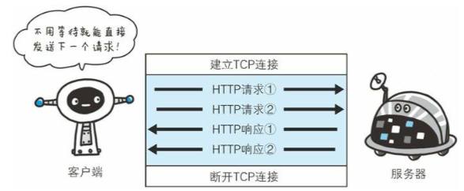
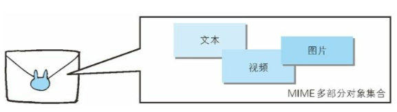
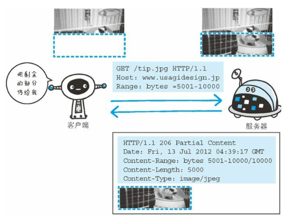

# HTTP 协议和 TCP 协议

参考书籍：HTTP 协议详解

文档笔记：<http://www.zhufengpeixun.com/strong/html/14.http-1.html>

## HTTP 协议介绍

- 超文本传输协议：HyperText Transfer Protocol
- 规定了客户端和服务端如何通讯
- 是互联网世界数据通讯的标准和基石

## HTTP 协议入门

为什么？绝大多数的 Web 应用，都构建在 HTTP 协议之上

是什么？无状态、B/S 模式应用层协议，多基于 TCP 协议

包含什么?

请求：报文格式(报头、正文、URI) 、请求方法、请求头

响应：状态码、消息报头、响应正文

FAQ?

常见请求头: User-Agent、Cookie、Referrer

常见响应头: Content-Type、Content-Length、Cache

常见状态码: 2XX、3XX、4XX、5XX

## 1.HTTP 协议和 TCP 协议

### 1.1 长链接

### 1.2 管线化

## 2. URI 和 URL

### 2.1 URI

URI(Uniform Resource Identifier)是统一资源标识符,在某个规则下能把这个资源独一无二标示出来，比如人的身份证号

- Uniform 不用根据上下文来识别资源指定的访问方式
- Resource 可以标识的任何东西
- Identifier 表示可标识的对象

### 2.2 URL

统一资源定位符，表示资源的地点，URL 时使用浏览器访问 WEB 页面时需要输入的网页地址

- Uniform 不用根据上下文来识别资源指定的访问方式
- Resource 可以标识的任何东西
- Location 定位

### 2.2.1 URL 的格式

- 协议类型
- 登录信息
- 服务器地址
- 服务器端口号
- 带层次的文件路径
- 查询字符串
- 片段标识符

## 3. HTTP

- 请求的一方叫客户端，响应的一方叫服务器端
- 通过请求和响应达成通信
- HTTP 是一种不保存状态的协议

### 3.1 请求报文

#### 3.1.1 请求行

##### 3.1.1.1 方法

- GET：获取资源
- POST：向服务器端发送数据，传输实体主体
- PUT：传输文件
- HEAD：获取报文首部
- DELETE：删除文件
- OPTIONS：询问支持的方法
- TRACE：追踪路径
- 

##### 3.1.1.2 协议/版本号

##### 3.1.1.3 URL

##### 3.1.1.4 请求头

- General Header：通用首部
- Request Header：请求首部
- Response Header：响应首部
- Entity Header Fields：实体首部

##### 3.1.1.5 请求体

-

### 3.2 响应报文

HTTP 协议和 TCP 协议

HTTP 协议和 TCP 协议

3.2.1 响应行

3.2.2 响应头

3.2.3 响应体

### 3.3 编码

HTTP 可以在传输的过程中通过编码提升传输效率，但是会消耗更多的 CPU 时间。

#### 3.3.1 编码压缩

发送文件时可以先用 ZIP 压缩功能后再发送文件

- gzip
- compress
- deflate
- identify

#### 3.3.2 分割发送的分块传输编码

请求的实体在尚未传输完成前浏览器不能显示。所以在传输大容量数据时，通过把数据分割成多块，能让浏览器逐步显示页面。

#### 3.3.3 多部分对象集合

- 一份报文主体中可以包含多类型实体。
- 使用 boundary 字符串来划分多部分对象指明的各类实体。在各个实体起始行之前插入**--**标记,多部分对象集合最后插入**--**标记

##### 3.3.3.1 multiparty/form-data

上传表单时使用 multiparty/form-data

##### 3.3.3.2 multipart/byteranges 206(Particial Content)

状态码(Partical Content)响应报文中包含多个范围时使用

- 

#### 3.3.4 获取部分内容的范围请求

为了实现中断恢复下载的需求，需要能下载指定下载的实体范围

- 请求头中的 Range 来指定 资源的 byte 范围
- 响应会返回状态码 206 响应报文
- 对于多重范围的范围请求，响应会在首部字段`Content-Type`中标明`multipart/byteranges`
- 
- 

### 3.4 内容协商

- 首部字段
  - Accept
  - Accept-Charset
  - Accept-Encoding
  - Accept-Language
  - Content-Language
- 协商类型
  - 服务器驱动
  - 客户端驱动协商
  - 透明协商

### 3.5 状态码

状态码负责表示客户端请求的返回结果、标记服务器端是否正常、通知出现的错误

#### 3.5.1 状态码类别

| 类别 | 原因短语                       |     |
| :--- | :----------------------------- | --- |
| 1XX  | Informational(信息性状态码)    |     |
| 2XX  | Success(成功状态码)            |     |
| 3XX  | Redirection(重定向)            |     |
| 4XX  | Client Error(客户端错误状态码) |     |
| 5XX  | Server Error(服务器错误状态吗) |     |

#### 3.5.2 2XX 成功

- 200(OK 客户端发过来的数据被正常处理
- 204(Not Content 正常响应，没有实体
- 206(Partial Content 范围请求，返回部分数据，响应报文中由 Content-Range 指定实体内容

#### 3.5.3 3XX 重定向

- 301(Moved Permanently) 永久重定向
- 302(Found) 临时重定向，规范要求方法名不变，但是都会改变
- 303(See Other) 和 302 类似，但必须用 GET 方法
- 304(Not Modified) 状态未改变 配合(If-Match、If-Modified-Since、If-None_Match、If-Range、If-Unmodified-Since)
- 307(Temporary Redirect) 临时重定向，不该改变请求方法

#### 3.5.4 4XX 客户端错误

- 400(Bad Request) 请求报文语法错误
- 401 (unauthorized) 需要认证
- 403(Forbidden) 服务器拒绝访问对应的资源
- 404(Not Found) 服务器上无法找到资源

#### 3.5.5 5XX 服务器端错误

- 500(Internal Server Error)服务器故障
- 503(Service Unavailable) 服务器处于超负载或正在停机维护

## 4. Web 服务器

### 4.1 虚拟主机(Virtual Host)

一台 HTTP 服务器上搭建多个 Web 站点,客户端发送请求时必须在 Host 首部完整指定主机名或域名的 URL

### 4.2 通信转发程序:代理、网关

#### 4.2.1 代理

代理就是客户端和服务器的中间人

##### 4.2.1.1 为啥使用代理

- 利用缓存技术减少网络流量

- 组织内部针对网站进行访问控制

- 获取访问日志

##### 4.2.1.2 代理的分类

- 缓存代理 会预先把资源副本保存在服务器上

- 透明代理 不对报文进行任何加工

#### 4.2.2 网关

接收从客户端发送来的数据时，会转发给其他服务器处理，再由自己返回

- 使通信线路上的服务器提供非 HTTP 协议服务
- 提高通信安全性

## 5. 首部

### 5.1 通用首部字段

| 首部字段名       | 说明                       |
| :--------------- | :------------------------- |
| Cache-Control    | 控制缓存行为               |
| Connection       | 链接的管理                 |
| Date             | 报文日期                   |
| Pragma           | 报文指令                   |
| Trailer          | 报文尾部的首部             |
| Trasfer-Encoding | 指定报文主体的传输编码方式 |
| Upgrade          | 升级为其他协议             |
| Via              | 代理服务器信息             |
| Warning          | 错误通知                   |

### 5.2 请求首部字段

| 首部字段名          | 说明                                          |
| :------------------ | :-------------------------------------------- |
| Accept              | 用户代理可处理的媒体类型                      |
| Accept-Charset      | 优先的字符集                                  |
| Accept-Encoding     | 优先的编码                                    |
| Accept-Langulage    | 优先的语言                                    |
| Authorization       | Web 认证信息                                  |
| Expect              | 期待服务器的特定行为                          |
| From                | 用户的电子邮箱地址                            |
| Host                | 请求资源所在的服务器                          |
| If-Match            | 比较实体标记                                  |
| If-Modified-Since   | 比较资源的更新时间                            |
| If-None-Match       | 比较实体标记                                  |
| If-Range            | 资源未更新时发送实体 Byte 的范围请求          |
| If-Unmodified-Since | 比较资源的更新时间(和 If-Modified-Since 相反) |
| Max-Forwards        | 最大传输跳数                                  |
| Proxy-Authorization | 代理服务器需要客户端认证                      |
| Range               | 实体字节范围请求                              |
| Referer             | 请求中的 URI 的原始获取方                     |
| TE                  | 传输编码的优先级                              |
| User-Agent          | HTTP 客户端程序的信息                         |

### 5.3 响应首部字段

| 首部字段名         | 说明                         |
| :----------------- | :--------------------------- |
| Accept-Ranges      | 是否接受字节范围             |
| Age                | 资源的创建时间               |
| ETag               | 资源的匹配信息               |
| Location           | 客户端重定向至指定的 URI     |
| Proxy-Authenticate | 代理服务器对客户端的认证信息 |
| Retry-After        | 再次发送请求的时机           |
| Server             | 服务器的信息                 |
| Vary               | 代理服务器缓存的管理信息     |
| www-Authenticate   | 服务器对客户端的认证         |

### 5.4 实体首部字段

| 首部字段名       | 说明                       |
| :--------------- | :------------------------- |
| Allow            | 资源可支持的 HTTP 方法     |
| Content-Encoding | 实体的编码方式             |
| Content-Language | 实体的自然语言             |
| Content-Length   | 实体的内容大小(字节为单位) |
| Content-Location | 替代对应资源的 URI         |
| Content-MD5      | 实体的报文摘要             |
| Content-Range    | 实体的位置范围             |
| Content-Type     | 实体主体的媒体类型         |
| Expires          | 实体过期时间               |
| Last-Modified    | 资源的最后修改时间         |
