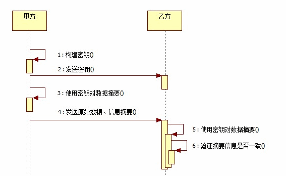
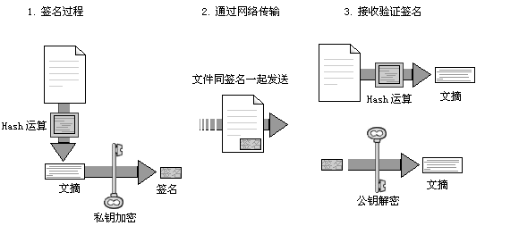
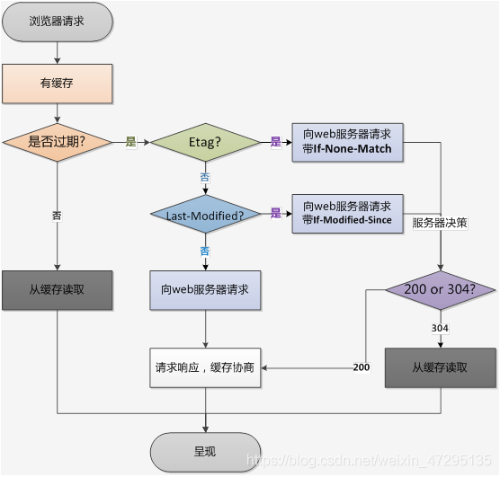

# HTTP 服务器和客户端

## 一.HTTP 服务器

HTTP 全称是超文本传输协议，构建于 TCP 之上，属于应用层协议。

### 1.1 创建 HTTP 服务器

```javascript
let server = http.createServer([requestListener]);
server.on("request", requestListener);
```

- requestListener 当服务器收到客户端的连接后执行的处理
  - http.IncomingMessage 请求对象
  - http.ServerResponse 对象 服务器端响应对象

### 1.2 启动 HTTP 服务器

```javascript
server.listen(port, [host], [backlog], [callback]);
server.on("listening", callback);
```

- port 监听的端口号
- host 监听的地址
- backlog 指定位于等待队列中的客户端连接数

```javascript
let http = require("http");
let server = http
	.createServer(function (req, res) {})
	.listen(8080, "127.0.0.1", function () {
		console.log("服务器端开始监听!");
	});
```

### 1.3 关闭 HTTP 服务器

```javascript
server.close();
server.on("close", function () {});
let http = require("http");
let server = http.createServer(function (req, res) {});
server.on("close", function () {
	console.log("服务器关闭");
});
server.listen(8080, "127.0.0.1", function () {
	console.log("服务器端开始监听!");
	server.close();
});
```

### 1.4 监听服务器错误

```javascript
server.on('error',function(){
    if(e.code == 'EADDRINUSE'){
         console.log('端口号已经被占用!);
    }
});
```

### 1.5 connection

```javascript
let server = http.createServer(function (req, res) {});
server.on("connection", function () {
	console.log(客户端连接已经建立);
});
```

### 1.6 setTimeout

设置超时时间，超时后不可再复用已经建立的连接，需要发请求需要重新建立连接。默认超时时间时 2 分钟

```javascript
server.setTimeout(msecs, callback);
server.on("timeout", function () {
	console.log("连接已经超时");
});
```

### 1.7 获取客户端请求信息

- request

  - method 请求的方法

  - url 请求的路径

  - headers 请求头对象

  - httpVersion 客户端的 http 版本

  - socket 监听客户端请求的 socket 对象

    ```javascript
    let http = require('http');
    let fs = require('fs');
    let server = http.createServer(function(req,res){
    if(req.url != '/favicon.ico'){
    let out = fs.createWriteStream(path.join(__dirname,'request.log'));
    out.write('method='+req.method);
    out.write('url='+req.url);
    out.write('headers='+JSON.stringify(req.headers));
    out.write('httpVersion='+req.httpVersion);
    }
    }).listen(8080,'127.0.0.1);
    ```

```javascript
let http = require('http');
let fs = require('fs');
let server = http.createServer(function(req,res){
  let body = [];
  req.on('data',function(data){
    body.push(data);
  });
  req.on('end',function(){
      let result = Buffer.concat(body);
      console.log(result.toString());
  });
}).listen(8080,'127.0.0.1);
```

### 1.8 querystring

querystring 模块用来转换 URL 字符串和 URL 中的查询字符串

#### 1.8.1 parse 方法用来把字符串转换成对象

```javascript
querystring.parse(str, [sep], [eq], [options]);
```

#### 1.8.2 stringify 方法用来把对象转换成字符串

```javascript
querystring.stringify(obj, [sep], [eq]);
```

### 1.9 querystring

```javascript
url.parse(urlStr, [parseQueryString]);
```

- href 被转换的原 URL 字符串
- protocal 客户端发出请求时使用的协议
- slashes 在协议与路径之间是否使用了//分隔符
- host URL 字符串中的完整地址和端口号
- auth URL 字符串中的认证部分
- hostname URL 字符串中的完整地址
- port URL 字符串中的端口号
- pathname URL 字符串的路径，不包含查询字符串
- search 查询字符串，包含?
- path 路径，包含查询字符串
- query 查询字符串，不包含起始字符串`?`
- hash 散列字符串，包含`#`

### 1.10 发送服务器响应流

http.ServerResponse 对象表示响应对象

#### 1.10.1 writeHead

```javascript
response.writeHead(statusCode, [reasonPhrase], [headers]);
```

- content-type 内容类型
- location 将客户端重定向到另外一个 URL 地址
- content-disposition 指定一个被下载的文件名
- content-length 服务器响应内容的字节数
- set-cookie 在客户端创建 Cookie
- content-encoding 指定服务器响应内容的编码方式
- cache-cache 开启缓存机制
- expires 用于制定缓存过期时间
- etag 指定当服务器响应内容没有变化不重新下载数据

#### 1.10.2 Header

设置、获取和删除 Header

```javascript
response.setHeader('Content-Type','text/html;charset=utf-8');
response.getHeader('Content-Type');
response.removeHeader('Content-Type');
response.headersSent 判断响应头是否已经发送
```

#### 1.10.3 headersSent

判断响应头是否已经发送

```javascript
let http = require('http');
let server = http.createServer(function(req,res){
  console.log(resopnse.headersSent?"响应头已经发送":"响应头未发送!");
  res.writeHead(200,'ok);
  console.log(resopnse.headersSent?"响应头已经发送":"响应头未发送!");
});
```

#### 1.10.4 sendDate

不发送 Date

```javascript
res.sendDate = false;
```

#### 1.10.5 write

可以使用 write 方法发送响应内容

```javascript
response.write(chunk, [encoding]);
response.end([chunk], [encoding]);
```

#### 1.10.6 timeout

可以使用 setTimeout 方法设置响应让超时时间，如果在指定时间内不响应，则触发 timeout 事件

```javascript
response.setTimeout(msecs, [callback]);
response.on("timeout", callback);
```

#### 1.10.7 close

在响应对象的 end 方法被调用之前，如果连接中断，将触发 http.ServerResponse 对象的 close 事件

```javascript
response.on("close", callback);
```

#### 1.10.8 parser

```javascript
net;
onconnection;

_http_server.js;
连接监听;
connectionListenerInternal;
socketOnData;
onParserExecuteCommon;
parserOnIncoming;
```

## 二.HTTP 客户端

### 2.1 向其他网站请求数据

```javascript
let req = http.request(options, callback);
req.on("request", callback);
request.write(chunk, [encoding]);
request.end([chunk], [encoding]);
```

- host 指定目标域名或主机名
- hostname 指定目标域名或主机名，如果和 host 都指定了，优先使用 hostname
- port 指定目标服务器的端口号
- localAddress 本地接口
- socketPath 指定 Unix 域端口
- method 指定 HTTP 请求的方式
- path 指定请求路径和查询字符串
- headers 指定客户端请求头对象
- auth 指定认证部分
- agent 用于指定 HTTP 代理，在 Node.js 中，使用 http.Agent 类代表一个 HTTP 代理，默认使用 keep-alive 连接，同时使用 http.Agent 对象来实现所有的 HTTP 客户端请求

```javascript
let http = require("http");
let options = {
	hostname: "localhost",
	port: 8080,
	path: "/",
	method: "GET",
};
let req = http.request(options, function (res) {
	console.log("状态吗:" + res.statusCode);
	console.log("响应头:" + JSON.stringify(res.headers));
	res.setEncoding("utf8");
	res.on("data", function (chunk) {
		console.log("响应内容", chunk);
	});
});
req.end();
```

### 2.2 取消请求

可以使用 abort 方法来终止本次请求

```javascript
req.abort();
```

### 2.3 监听 error 事件

如果请求过程中出错了，会触发 error 事件

```javascript
request.on("error", function (err) {});
```

### 2.4 socket

建立连接过程中，为该连接分配端口时，触发`socket`事件

```javascript
req.on("socket", function (socket) {
	socket.setTimeout(1000);
	socket.on("timeout", function () {
		req.abort();
	});
});
```

### 2.5 get

可以使用 get 方法向服务器发送数据

```javascript
http.get(options, callback);
```

### 2.6 addTrailers

可以使用 response 对象的 addTrailers 方法在服务器响应尾部追加一个头信息

```javascript
let http = require("http");
let path = require("path");
let crypto = require("crypto");

let server = http
	.createServer(function (req, res) {
		res.writeHead(200, {
			"Transfer-Encoding": "chunked",
			Trailer: "Content-MD5",
		});
		let rs = require("fs").createReadStream(path.join(__dirname, "msg.txt"), {
			highWaterMark: 2,
		});
		let md5 = crypto.createHash("md5");
		rs.on("data", function (data) {
			console.log(data);
			res.write(data);
			md5.update(data);
		});
		rs.on("end", function () {
			res.addTrailers({
				"Content-MD5": md5.digest("hex"),
			});
			res.end();
		});
	})
	.listen(8080);
let http = require("http");
let options = {
	hostname: "localhost",
	port: 8080,
	path: "/",
	method: "GET",
};
let req = http.request(options, function (res) {
	console.log("状态吗:" + res.statusCode);
	console.log("响应头:" + JSON.stringify(res.headers));
	res.setEncoding("utf8");
	res.on("data", function (chunk) {
		console.log("响应内容", chunk);
	});
	res.on("end", function () {
		console.log("trailer", res.trailers);
	});
});
req.end();
```

### 2.7 制作代理服务器

```javascript
let http = require("http");
let url = require("url");
let server = http
	.createServer(function (request, response) {
		let { path } = url.parse(request.url);
		let options = {
			host: "localhost",
			port: 9090,
			path: path,
			headers: request.headers,
		};
		let req = http.get(options, function (res) {
			console.log(res);
			response.writeHead(res.statusCode, res.headers);
			res.pipe(response);
		});
		req.on("error", function (err) {
			console.log(err);
		});
		request.pipe(req);
	})
	.listen(8080);
```

## 三.压缩与解压缩处理

可以使用`zlib`模块进行压缩及解压缩处理,压缩文件以后可以减少体积，加快传输速度和节约带宽 [代码](https://github.com/zhufengnodejs/static-server/tree/master/lesson/zlib)

### 压缩对象

压缩和解压缩对象都是一个可读可写流

| 方法               | 说明                                                       |
| :----------------- | :--------------------------------------------------------- |
| zlib.createGzip    | 返回 Gzip 流对象，使用 Gzip 算法对数据进行压缩处理         |
| zlib.createGunzip  | 返回 Gzip 流对象，使用 Gzip 算法对压缩的数据进行解压缩处理 |
| zlib.createDeflate | 返回 Deflate 流对象，使用 Deflate 算法对数据进行压缩处理   |
| zlib.createInflate | 返回 Deflate 流对象，使用 Deflate 算法对数据进行解压缩处理 |

### 压缩和解压缩

```javascript
var zlib = require("zlib");
var fs = require("fs");

function zip(src) {
	var gzip = zlib.createGzip(); // 创建压缩流
	var inputStream = fs.createReadStream(src);
	var outputStream = fs.createWriteStream(src + ".gz");
	inputStream.pipe(gzip).pipe(outputStream);
}
zip("source.txt");

function unzip(src) {
	var gunzip = zlib.createGunzip();
	var inputStream = fs.createReadStream(src);
	var outputStream = fs.createWriteStream(src.slice(0, -3));
	inputStream.pipe(gunzip).pipe(outputStream);
}

gnzip("source.txt.gz");
```

### http 中的应用

```javascript
var zlib = require("zlib");
var fs = require("fs");
var http = require("http");
http
	.createServer(function (request, response) {
		var raw = fs.createReadStream("." + request.url);
		var acceptEncoding = request.headers["accept-encoding"];
		if (!acceptEncoding) {
			acceptEncoding = "";
		}
		if (acceptEncoding.match(/\bdeflate\b/)) {
			response.setHeader("Content-Encoding", "deflate");
			raw.pipe(zlib.createDeflate()).pipe(response);
		} else if (acceptEncoding.match(/\bgzip\b/)) {
			response.setHeader("Content-Encoding", "gzip");
			raw.pipe(zlib.createGzip()).pipe(response);
		} else {
			raw.pipe(response);
		}
	})
	.listen(9090);
var zlib = require("zlib");
var fs = require("fs");
var http = require("http");

var request = http.get({
	host: "localhost",
	path: "/index.html",
	port: 9090,
	headers: {
		"accept-encoding": "gzip,deflate",
	},
});

request.on("response", function (response) {
	var output = fs.createWriteStream("test.txt");
	switch (response.headers["content-encoding"]) {
		case "gzip":
			response.pipe(zlib.createGunzip()).pipe(output);
			break;
		case "deflate":
			response.pipe(zlib.createInflate()).pipe(output);
			break;
		default:
			response.pipe(output);
			break;
	}
});
request.end();
```

### 方法调用

```javascript
var zlib = require("zlib");
var fs = require("fs");

var out = fs.createWriteStream("input.log");
var input = "input";
zlib.gzip(input, function (err, buffer) {
	if (!err) {
		zlib.unzip(buffer, function (err, buffer) {
			if (!err) {
				console.log(buffer.toString());
				out.end(buffer);
			}
		});
	}
});
```

## 四.crypto 加密解密

`crypto`是`node.js`中实现加密和解密的模块 在`node.js`中，使用`OpenSSL`类库作为内部实现加密解密的手段 `OpenSSL`是一个经过严格测试的可靠的加密与解密算法的实现工具

[windows 版 openSSL 下载](http://dl.pconline.com.cn/download/355862-1.html)

### 散列(哈希)算法

散列算法也叫哈希算法，用来把任意长度的输入变换成固定长度的输出,常见的有 md5,sha1 等

- 相同的输入会产生相同的输出
- 不同的输出会产生不同的输出
- 任意的输入长度输出长度是相同的
- 不能从输出推算出输入的值


#### 1 获取所有的散列算法

```javascript
console.log(crypto.getHashes());
```

#### 2 语法说明

```javascript
crypto.createHash(algorithm); //创建HASH对象
hash.update(data, [input_encoding]); //增加要添加摘要的数据，摘要输出前可以使用多次update
hash.digest([encoding]); //输出摘要内容，输出后则不能再添加摘要内容
```

#### 3 散列算法示例

```javascript
var crypto = require("crypto");
var md5 = crypto.createHash("md5"); //返回哈希算法
var md5Sum = md5.update("hello"); //指定要摘要的原始内容,可以在摘要被输出之前使用多次update方法来添加摘要内容
var result = md5Sum.digest("hex"); //摘要输出，在使用digest方法之后不能再向hash对象追加摘要内容。
console.log(result);
```

多次 update

```javascript
var fs = require("fs");
var shasum = crypto.createHash("sha1"); //返回sha1哈希算法
var rs = fs.createReadStream("./readme.txt");
rs.on("data", function (data) {
	shasum.update(data); //指定要摘要的原始内容,可以在摘要被输出之前使用多次update方法来添加摘要内容
});
rs.on("end", function () {
	var result = shasum.digest("hex"); //摘要输出，在使用digest方法之后不能再向hash对象追加摘要内容。
	console.log(result);
});
```

### HMAC 算法

HMAC 算法将散列算法与一个密钥结合在一起，以阻止对签名完整性的破坏



#### 1 语法

```javascript
let hmac crypto.createHmac(algorithm,key);
hmac.update(data);
```

- algorithm 是一个可用的摘要算法，例如 sha1、md5、sha256
- key 为一个字符串，用于指定一个 PEM 格式的密钥

#### 2 生成私钥

PEM 是 OpenSSL 的标准格式，OpenSSL 使用 PEM 文件格式存储证书和密钥，是基于 Base64 编码的证书。

```bash
openssl genrsa -out rsa_private.key 1024
```

#### 3 示例

```javascript
let pem = fs.readFileSync(path.join(__dirname, "./rsa_private.key"));
let key = pem.toString("ascii");
let hmac = crypto.createHmac("sha1", key);
let rs = fs.createReadStream(path.join(__dirname, "./1.txt"));
rs.on("data", function (data) {
	hmac.update(data);
});
rs.on("end", function () {
	let result = hmac.digest("hex");
	console.log(result);
});
```

### 对称加密

- blowfish 算法是一种对称的加密算法,对称的意思就是加密和解密使用的是同一个密钥。


```javascript
var crypto = require("crypto");
var fs = require("fs");
let str = "hello";
let cipher = crypto.createCipher(
	"blowfish",
	fs.readFileSync(path.join(__dirname, "rsa_private.key"))
);
let encry = cipher.update(str, "utf8", "hex");
encry += cipher.final("hex");
console.log(encry);

let deciper = crypto.createDecipher(
	"blowfish",
	fs.readFileSync(path.join(__dirname, "rsa_private.key"))
);
let deEncry = deciper.update(encry, "hex", "utf8");
deEncry += deciper.final("utf8");
console.log(deEncry);
```

### 非对称加密算法

- 非对称加密算法需要两个密钥：公开密钥(publickey)和私有密钥(privatekey)
- 公钥与私钥是一对，如果用公钥对数据进行加密，只有用对应的私钥才能解密,如果私钥加密，只能公钥解密
- 因为加密和解密使用的是两个不同的密钥，所以这种算法叫作非对称加密算法


为私钥创建公钥

```javascript
openssl rsa -in rsa_private.key -pubout -out rsa_public.key
var crypto = require('crypto');
var fs = require('fs');
let key = fs.readFileSync(path.join(__dirname, 'rsa_private.key'));
let cert = fs.readFileSync(path.join(__dirname, 'rsa_public.key'));
let secret = crypto.publicEncrypt(cert, buffer);//公钥加密
let result = crypto.privateDecrypt(key, secret);//私钥解密
console.log(result.toString());
```

### 签名

在网络中，私钥的拥有者可以在一段数据被发送之前先对数据进行**签名**得到一个签名 通过网络把此数据发送给数据接收者之后，数据的接收者可以通过**公钥**来对该签名进行验证,以确保这段数据是私钥的拥有者所发出的原始数据，且在网络中的传输过程中未被修改。



```javascript
let private = fs.readFileSync(path.join(__dirname, "rsa_private.key"), "ascii");
let public = fs.readFileSync(path.join(__dirname, "rsa_public.key"), "ascii");
let str = "zhufengpeixun";
let sign = crypto.createSign("RSA-SHA256");
sign.update(str);
let signed = sign.sign(private, "hex");
let verify = crypto.createVerify("RSA-SHA256");
verify.update(str);
let verifyResult = verify.verify(public, signed, "hex"); //true
```

## 五.进程

- 在 Node.js 中每个应用程序都是一个进程类的实例对象。
- 使用`process`对象代表应用程序,这是一个全局对象，可以通过它来获取 Node.jsy 应用程序以及运行该程序的用户、环境等各种信息的属性、方法和事件。

### 1.进程事件

#### 1.1 进程对象属性

- execPath 可执行文件的绝对路径,如 `/usr/local/bin/node`
- version 版本号
- versions 依赖库的版本号
- platform 运行平台。 如 darwin、freebsd、linux、sunos、win32
- stdin 标准输入流可读流，默认暂停状态
- stdout 标准输出可写流，同步操作
- stderr 错误输出可写流，同步操作
- argv 属性值为数组
- env 操作系统环境信息
- pid 应用程序进程 ID
- title 窗口标题
- arch 处理器架构 arm ia32 x64

```javascript
process.stdin.resume();
process.stdin.on("data", function (chunk) {
	process.stdout.write(`进程接收到数据: ` + chunk);
});
process.argv.forEach((val, index, ary) => console.log(index, val));
```

#### 1.2 memoryUsage 方法

```javascript
process.memoryUsage();
```


- rss（resident set size）：所有内存占用，包括指令区和堆栈。
- heapTotal："堆"占用的内存，包括用到的和没用到的。
- heapUsed：用到的堆的部分。
- external： V8 引擎内部的 C++ 对象占用的内存。

#### 1.3 nextTick 方法

nextTick 方法用于将一个函数推迟到代码中所书写的下一个同步方法执行完毕或异步方法的回调函数开始执行前调用

#### 1.4 chdir

chdir 方法用于修改 Node.js 应用程序中使用的当前工作目录，使用方式如下

```javascript
process.chdir(directory);
```

#### 1.5 cwd 方法

cwd 方法用返回当前目录，不使用任何参数

```javascript
console.log(process.cwd());
```

#### 1.6 chdir 方法

改变当前的工作目录

```javascript
console.log(`当前目录: ${process.cwd()}`);
process.chdir('..);
console.log(`上层目录: ${process.cwd()});
```

#### 1.7 exit 方法

退出运行 Node.js 应用程序的进程

```javascript
process.exit(0);
```

#### 1.8 kill 方法

用于向进程发送一个信号

- SIGINT 程序终止(interrupt)信号, 在用户键入 INTR 字符(通常是 Ctrl-C)时发出，用于通知前台进程组终止进程。
- SIGTERM 程序结束(terminate)信号, 该信号可以被阻塞和处理。通常用来要求程序自己正常退出，shell 命令 kill 缺省产生这个信号

```javascript
process.kill(pid, [signal]);
```

- pid 是一个整数，用于指定需要接收信号的进程 ID
- signal 发送的信号，默认为 SIGTERM

#### 1.9 uptime

返回当前程序的运行时间

```javascript
process.uptime();
```

#### 1.10 hrtime

测试一个代码段的运行时间,返回两个时间，第一个单位是秒，第二个单位是纳秒

```javascript
let fs = require('fs);
let time = process.hrtime();
let data = fs.readFileSync('index.txt');
let diff = process.hrtime(time);
console.log(`读文件操作耗费的%d秒`,diff[0]);
```

#### 1.11 exit 事件

当运行 Node.js 应用程序进程退出时触发进程对象的 exit 事件。可以通过指定事件回调函数来指定进程退出时所执行的处理。

```javascript
process.on('exit',function(){
    console.log('Node.js进程被推出);
});
process.exit();
```

#### 1.12 uncaughtException 事件

当应用程序抛出一个未被捕获的异常时触发进程对象的 uncaughtException 事件

```javascript
process.on("uncaughtException", function (err) {
	console.log("捕获到一个未被处理的错误:", err);
});
notExist();
```

#### 1.13 信号事件

```javascript
process.stdin.resume();
process.on("SIGINT", function () {
	console.log("接收到SIGINT信号");
});
```

### 2. 子进程

- 在 Node.js 中，只有一个线程执行所有操作，如果某个操作需要大量消耗 CPU 资源的情况下，后续操作都需要等待。

- 在 Node.js 中，提供了一个

```bash
child_process
```

模块,通过它可以开启多个子进程，在多个子进程之间可以共享内存空间，可以通过子进程的互相通信来实现信息的交换。

### 2.1 spawn

#### 2.1.1 语法

```javascript
child_process.spawn(command, [args], [options]);
```

- command 必须指定的参数，指定需要执行的命令

- args 数组，存放了所有运行该命令需要的参数

- options 参数为一个对象，用于指定开启子进程时使用的选项

  - cwd 子进程的工作目录
  - env 环境变量
  - detached 如果为 true,该子进程魏一个进程组中的领头进程，当父进程不存在时也可以独立存在
  - stdio 三个元素的数组，设置标准输入/输出
    - pipe 在父进程和子进程之间创建一个管道，父进程可以通过子进程的 stdio[0]访问子进程的标准输入，通过 stdio[1]访问标准输出,stdio[2]访问错误输出
    - ipc 在父进程和子进程之间创建一个专用与传递消息的 IPC 通道。可以调用子进程的 send 方法向子进程发消息，子进程会触发`message`事件
    - ignore 指定不为子进程设置文件描述符。这样子进程的标准输入、标准输出和错误输出被忽略
    - stream 子进程和父进程共享一个终端设备、文件、端口或管道
    - 正整数值 和共享一个 steam 是一样的
    - null 或 undefined 在子进程中创建与父进程相连的管道

默认情况下，子进程的 stdin,stdout,stderr 导向了 ChildProcess 这个对象的 child.stdin,child.stdout,child.stderr 流,

```javascript
let spawn = require("child_process").spawn;
sapwn("prg", [], { stdio: ["pipe", "pipe", process.stderr] });
```

- ignore ['ignore','ignore','ignore'] 全部忽略
- pipe ['pipe','pipe','pipe'] 通过管道连接
- inherit [process.stdin,process.stdout,process.stderr]或[0,1,2] 和父进程共享输入输出

```javascript
let spawn = require("child_process").spawn;
spawn("prg", [], { stdio: "inherit" });
```

- spawn 方法返回一个隐式创建的代表子进程的 ChildProcess 对象
- 子进程对象同样拥有 stdin 属性值为一个可用于读入子进程的标准输入流对象
- 子进程对象同样拥有 stdiout 属性值和 stderr 属性值可分别用于写入子进程的标准输出流与标准错误输出流

#### 2.1.2 close

- 当子进程所有输入输出都终止时，会触发子进程对象的 close 事件。

```javascript
child.on("close", function (code, signal) {});
```

- code 为 0 表示正常推出，为 null 表示异常退出
- 当在父进程中关闭子进程时，signal 参数值为父进程发给子进程的信号名称

#### 2.1.3 exit

- 当子进程退出时，触发子进程对象的 exit 事件

- 因为多个进程可能会共享 i 个输入/输出，所以当子进程退出时，子进程的输入/输出可能并未终止

  ```javascript
  child.on("exit", function (code, signal) {});
  ```

#### 2.1.4 error

如果子进程开启失败，那么将会触发子进程对象的 error 事件

```javascript
child1.on("error", function (err) {
	console.log(err);
});
```

#### 2.1.5 kill

- 父进程还可以使用 kill 方法向子进程发送信号,参数为描述该信号的字符串，默认参数值为`SIGTERM`

- SIGTERM 程序结束(terminate)信号, 与 SIGKILL 不同的是该信号可以被阻塞和处理. 通常用来要求程序自己正常退出

```javascript
child.kill([signal]);
```

#### 2.1.6 案例

1. spawn.js

   ```javascript
   let path = require("path");
   let { spawn } = require("child_process");
   //默认情况下，子进程的stdin,stdout,stderr导向了ChildProcess这个对象的child.stdin,child.stdout,child.stderr流,
   //这和设置stdio为['pipe', 'pipe', 'pipe']是一样的
   let p1 = spawn("node", ["test1.js", "a"], {
   	cwd: path.join(__dirname, "test1"),
   });
   let p2 = spawn("node", ["test3.js"], {
   	cwd: path.join(__dirname, "test3"),
   	stdio: "pipe",
   });
   //监听test1.js脚本子进程对象的标准输出的data事件，把数据写给p2
   p1.stdout.on("data", function (data) {
   	console.log("P1:子进程的标准输出:" + data);
   	p2.stdin.write(data);
   });
   p1.on("error", function () {
   	console.log("p1:子进程1开启失败");
   });
   p2.on("error", function () {
   	console.log("p2:子进程2开启失败");
   });
   ```

2. test1.js

   ```javascript
   process.stdout.write("p1:子进程当前工作目录为:" + process.cwd() + "\r\n");
   process.stdout.write("p1:" + process.argv[2] + " \r\n");
   ```

3. test2.js

   ```javascript
   let fs = require("fs");
   let path = require("path");
   let out = fs.createWriteStream(path.join(__dirname, "msg.txt"));
   process.stdin.on("data", function (data) {
   	out.write(data);
   });
   process.stdin.on("end", function () {
   	process.exit();
   });
   ```

#### 2.1.7 detached

- 在默认情况下，只有在子进程全部退出后，父进程才能退出。为了让父进程可以先退出，而让子进程继续进行 I/O 操作,可以在 spawn 方法中使用 options 参数，把 detached 属性值设置为 true

- 默认情况下父进程会等待所有的子进程退出后才可以退出，使用 subprocess.unref 方法可以让父进程不用等待子进程退出就可以直接退出

  ```javascript
  let cp = require("child_process");
  let fs = require("fs");
  let path = require("path");
  let out = fs.openSync(path.join(__dirname, "msg.txt"), "w", 0o666);
  let sp = cp.spawn("node", ["4.detached.js"], {
  	detached: true,
  	stdio: ["ignore", out, "ignore"],
  });
  sp.unref();
  ```

```javascript
let count = 10;
let $timer = setInterval(() => {
    process.stdout.write(new Date().toString() + '\r\n');
    if (--count == 0) {
        clearInterval($timer);
    }
}, 500);
`
```

### 2.2 fork 开启子进程

- 衍生一个新的 Node.js 进程，并通过建立一个 IPC 通讯通道来调用一个指定的模块，该通道允许父进程与子进程之间相互发送信息
- fork 方法返回一个隐式创建的代表子进程的 ChildProcess 对象
- 子进程的输入/输出操作执行完毕后，子进程不会自动退出，必须使用`process.exit()`方法显式退出

```javascript
child_process.fork(modulePath, [args], [options]);
```

- args 运行该文件模块文件时许哟啊使用的参数
- options 选项对象
  - cwd 指定子进程当前的工作目录
  - env 属性值为一个对象，用于以"键名/键值"的形式为子进程指定环境变量
  - encoding 属性值为一个字符串，用于指定输出及标准错误输出数据的编码格式，默认值为'utf8'
  - silent 属性值为布尔值，当属性值为 false 时，子进程和父进程对象共享标准(输入/输出),true 时不共享

#### 2.2.1 发送消息

```javascript
child.send(message, [sendHandle]); //在父进程中向子进程发送消息
process.send(message, [sendHandle]); //在子进程中向主进程发送消息
```

- message 是一个对象，用于指定需要发送的消息

- sendHandle 是一个 net.Socket 或 net.Server 对象

- 子进程可以监听父进程发送的 message 事件

  ```javascript
  process.on("message", function (m, setHandle) {});
  ```

- m 参数值为子进程收到的消息

- sendHandle 为服务器对象或 socket 端口对象

当父进程收到子进程发出的消息时，触发子进程的 message 事件

```javascript
child.on("message", function (m, setHandle) {
	//TODO事件回调函数代码
});
```

5.fork.js

```javascript
let { fork } = require("child_process");
let path = require("path");
let child = fork(path.join(__dirname, "fork.js"));
child.on("message", function (m) {
	console.log("父进程接收到消息:", m);
	process.exit();
});
child.send({
	name: "zfpx",
});
child.on("error", function (err) {
	console.error(arguments);
});
```

fork.js

```javascript
process.on("message", function (m, setHandle) {
	console.log("子进程收到消息:", m);
	process.send({
		age: 9,
	});
});
```

#### 2.2.2 silent

在默认情况下子进程对象与父进程对象共享标准输入和标准输出。如果要让子进程对象用独立的标准输入输出，可以将 silent 属性值设置为 true forkslient.js

```javascript
let { fork } = require("child_process");
let path = require("path");

let p1 = fork("node", [path.join(__dirname, "fork1.js")], {
	silent: true,
});
let p2 = fork("node", path.join(__dirname, "fork2.js"));
p1.stdout.on("data", function (data) {
	console.log("子进程1标准输出：" + data);
	p2.send(data.toString());
});
p1.on("exit", function (code, signal) {
	console.log("子进程退出，退出代码为:" + code);
});
p1.on("error", function (err) {
	console.log("子进程开启失败:" + err);
	process.exit();
});
```

fork1.js

```javascript
process.argv.forEach(function (item) {
	process.stdout.write(item + "\r\n");
});
```

fork2.js

```javascript
let fs = require("fs");
let out = fs.createWriteStream(path.join(__dirname, "msg.txt"));
process.on("message", function (data) {
	out.write(data);
});
```

#### 2.2.3 子进程与父进程共享 HTTP 服务器

```javascript
let http = require("http");
let { fork } = require("child_process");
let fs = require("fs");
let net = require("net");
let path = require("path");
let child = fork(path.join(__dirname, "8.child.js"));
let server = net.createServer();
server.listen(8080, "127.0.0.1", function () {
	child.send("server", server);
	console.log("父进程中的服务器已经创建");
	let httpServer = http.createServer();
	httpServer.on("request", function (req, res) {
		if (req.url != "/favicon.ico") {
			let sum = 0;
			for (let i = 0; i < 100000; i++) {
				sum += 1;
			}
			res.write("客户端请求在父进程中被处理。");
			res.end("sum=" + sum);
		}
	});
	httpServer.listen(server);
});
let http = require("http");
process.on("message", function (msg, server) {
	if (msg == "server") {
		console.log("子进程中的服务器已经被创建");
		let httpServer = http.createServer();
		httpServer.on("request", function (req, res) {
			if (req.url != "/favicon.ico") {
				sum = 0;
				for (let i = 0; i < 10000; i++) {
					sum += i;
				}
				res.write("客户端请求在子进程中被处理");
				res.end("sum=" + sum);
			}
		});
		httpServer.listen(server);
	}
});
let http = require("http");
let options = {
	hostname: "localhost",
	port: 8080,
	path: "/",
	method: "GET",
};
for (let i = 0; i < 10; i++) {
	let req = http.request(options, function (res) {
		res.on("data", function (chunk) {
			console.log("响应内容:" + chunk);
		});
	});
	req.end();
}
```

#### 2.2.4 子进程与父进程共享 socket 对象

```javascript
let { fork } = require("child_process");
let path = require("path");
let child = fork(path.join(__dirname, "11.socket.js"));
let server = require("net").createServer();
server.on("connection", function (socket) {
	if (Date.now() % 2 == 0) {
		child.send("socket", socket);
	} else {
		socket.end("客户端请求被父进程处理!");
	}
});
server.listen(41234);
process.on("message", function (m, socket) {
	if (m === "socket") {
		socket.end("客户端请求被子进程处理.");
	}
});
let net = require("net");
let client = new net.Socket();
client.setEncoding("utf8");
client.connect(41234, "localhost");
client.on("data", function (data) {
	console.log(data);
});
```

### 2.3 exec 开启子进程

- exec 方法可以开启一个用于运行某个命令的子进程并缓存子进程的输出结果
- spawn 是一个异步方法，exec 是一个同步方法
- 衍生一个 shell 并在 shell 上运行命令

```javascript
child_process.exec(command, [options], [callback]);
```

- command 需要执行的命令

- options 选项对象

  - cwd 子进程的当前工作目录
  - env 指定子进程的环境变量
  - encoding 指定输出的编码
  - timeout 子进程的超时时间
  - maxbuffer 指定缓存标准输出和错误输出的缓存区最大长度
  - killSignal 指定关闭子进程的信号，默认值为 "SIGTERM"

- callback 指定子进程终止时调用的回调函数

  ```javascript
  function(err,stdout,stderr){}
  ```

- err 错误对象

- stdout 标准输出

- stderr 错误输出

```javascript
let { exec } = require("child_process");
let path = require("path");
let p1 = exec(
	"node test1.js a b c",
	{
		cwd: path.join(__dirname, "test3"),
	},
	function (err, stdout, stderr) {
		if (err) {
			console.log("子进程开启失败:" + err);
			process.exit();
		} else {
			console.log("子进程标准输出\r\n" + stdout.toString());
			p2.stdin.write(stdout.toString());
		}
	}
);
let p2 = exec(
	"node test2.js",
	{
		cwd: path.join(__dirname, "test3"),
	},
	function (err, stdout, stderr) {
		process.exit();
	}
);
let path = require("path");
process.argv.forEach(function (item) {
	process.stdout.write(item + "\r\n");
});
let fs = require("fs");
let path = require("path");
let out = fs.createWriteStream(path.join(__dirname, "msg.txt"));
process.stdin.on("data", function (data) {
	out.write(data);
	process.exit();
});
```

### 2.4 execFile 开启子进程

- 可以使用`execFile`开启一个专门用于运行某个可执行文件的子进程
- 类似 child_process.exec()，但直接衍生命令，且无需先衍生一个 shell

```javascript
child_process.execFile(file, [args], [optioins], [callback]);
```

- file 指定需要运行的可执行文件路径及文件名
- args 运行该文件所需要的参数
- options 开启子进程的选项
- callback 指定子进程终止时调用的回调函数

```javascript
let {
    execFile
} = require('child_process');
let path = require('path');

let p1 = execFile('node', ['./test1.js'], {
    cwd: path.join(__dirname, 'test4')
}, function (err, stdout, stderr) {
    if (err) {
        console.log('子进程1开启失败:' + err);
        process.exit();
    } else {
        console.log('子进程标准输出:' + stdout.toString());
        p2.stdin.write(stdout.toString());
    }
});
let p2 = execFile('node', ['./test2.js'], {
    cwd: path.join(__dirname, 'test4')
}, function (err, stdout, stderr) {
    if (err) {
        console.log('子进程2开启失败:' + err);
        process.exit();
    } else {
        console.log('子进程标准输出:' + stdout.toString());
    }
});
#!/usr/bin/env node

let path = require('path');
process.argv.forEach(function (item) {
    process.stdout.write(item + '\r\n');
});
#!/usr/bin/env node

let fs = require('fs');
let path = require('path');
let out = fs.createWriteStream(path.join(__dirname, 'msg.txt'));
process.stdin.on('data', function (data) {
    out.write(data);
    process.exit();
})
```

### 3. cluster

为了利用多核 CPU 的优势，Node.js 提供了一个 cluster 模块允许在多个子进程中运行不同的 Node.js 应用程序。

#### 3.1 fork 方法创建 work 对象

- 可以使用 fork 方法开启多个子进程，在每个子进程中创建一个 Node.js 应用程序的实例，并且在该应用程序中运行一个模块文件。

- fork 方法返回一个隐式创建的 work 对象

- 在 cluster 模块中，分别提供了一个 isMaster 属性与一个 isWork 属性，都是布尔值

  ```javascript
  cluster.fork([env]);
  ```

- env 为子进程指定环境变量

##### 3.1.1 获取所有的 worker

```javascript
for (let index in cluster.workers) {
	console.log(cluster.workers[index]);
}
```

##### 3.1.2 获取当前的 worker 和 id

```javascript
if (cluster.isMaster) {
	cluster.fork();
} else if (cluster.isWorker) {
	console.log("I am worker #" + cluster.worker.id);
}
```

##### 3.1.3 服务器

```javascript
let cluster = require("cluster");
let http = require("http");
if (cluster.isMaster) {
	cluster.fork();
	console.log("这段代码运行在主进程里");
} else {
	http
		.createServer(function (req, res) {
			if (req.url != "/favicon.ico") {
				res.end("hello");
				console.log("这段代码运行在子进程里");
			}
		})
		.listen(8080);
}
```

##### 3.1.4 fork 事件

当使用 fork 方法开启子进程时，将同时触发 fork 事件

```javascript
cluster.on("fork", function (worker) {
	console.log("子进程 " + workder.id + "被开启");
});
```

##### 3.1.5 online 事件

- 在使用 fork 方法开启一个新的用于运行 Node.js 应用程序的子进程后，该应用程序将通过向主进程发送反馈信息，当主进程接收到该反馈信息后，触发 online 事件

```javascript
cluster.on("online", function (worker) {
	console.log("已经收到子进程#" + workder.id + "的消息");
});
```

##### 3.1.6 listening

当在子进程运行的 Node.js 应用程序中调用服务器的 listen 方法后，该服务器开始对指定地址及端口进行监听，同时触发 listening 事件。

```javascript
let cluster = require("cluster");
let http = require("http");
if (cluster.isMaster) {
	cluster.fork();
	console.log("这段代码运行在主进程里");
} else {
	http
		.createServer(function (req, res) {
			if (req.url != "/favicon.ico") {
				res.end("hello");
				console.log("这段代码运行在子进程里");
			}
		})
		.listen(8080, "localhost");
}
cluster.on("online", function (worker) {
	console.log("已经收到子进程#" + worker.id + "的消息");
});
cluster.on("listening", function (worker, address) {
	console.log(
		"子进程中的服务器开始监听,地址为:" + address.address + ":" + address.port
	);
});
```

##### 3.1.7 setupMaster

子进程中的 Node.js 应用程序默认运行当前正在运行的 Node.js 应用程序中的主模块文件。可以使用 setupMaster 方法修改子进程中运行的模块文件

```javascript
cluster.setupMaster([settings]);
```

- settings 设置子进程中运行的 Node.js 应用程序各种默认行为的对象
  - exec 子进程运行的模块文件名称的完整路径及文件名
  - args 属性为一个数组，其中存放了所有运行子进程的 Node.js 运行程序所需要的参数
  - silent 布尔值。当属性值为 false 时，子进程对象与主进程对象共享标准输入/输出

```javascript
let cluster = require("cluster");
cluster.setupMaster({
	exec: "subtask.js",
});
cluster.fork();
console.log("这段代码被运行子主进程中");
console.log("cluster.settings属性值: %j", cluster.settings);
let http = require("http");
http
	.createServer(function (req, res) {
		if (req.url != "/favicon.ico") {
			res.writeHead(200);
			res.end("ok");
			console.log("这段代码被运行在子进程中");
		}
	})
	.listen(8080);
```

##### 3.1.8 在子进程里运行服务器

当在子进程里运行服务器时，客户端总是先被主进程接收，然后转发给子进程中的服务器。如果在多个子进程中运行服务器，当主进程接收到客户端请求后，将会自动分配给一个当前处于空闲状态的子进程。

```javascript
let cluster = require("cluster");
let http = require("http");
if (cluster.isMaster) {
	cluster.fork();
	cluster.fork();
} else {
	http
		.createServer(function (req, res) {
			if (req.url !== "/favicon.ico") {
				let sum = 0;
				for (let i = 0; i < 1000000; i++) {
					sum += i;
				}
				res.writeHead(200);
				res.write(`客户端请求在子进程${cluster.worker.id}中被处理`);
				res.end(`子进程${cluster.worker.id}中的计算结果=${sum}`);
			}
		})
		.listen(8080);
}
```

##### 3.1.9 在子进程使用单独的输出

```javascript
let cluster = require("cluster");
let http = require("http");
if (cluster.isMaster) {
	cluster.setupMaster({
		silent: true,
	});
	let worker = cluster.fork();
	worker.process.stdout.on("data", function (data) {
		console.log("接收到来自客户端的请求，目标地址:" + data);
	});
} else {
	http
		.createServer(function (req, res) {
			if (req.url !== "/favicon.ico") {
				let sum = 0;
				for (let i = 0; i < 1000000; i++) {
					sum += i;
				}
				res.writeHead(200);
				console.log(`客户端请求在子进程${cluster.worker.id}中被处理`);
				res.write(`客户端请求在子进程${cluster.worker.id}中被处理`);
				res.end(`子进程${cluster.worker.id}中的计算结果=${sum}`);
			}
		})
		.listen(8080);
}
```

#### 3.2 worker 对象

##### 3.2.1 online

当新建一个工作进程后，工作进程应当响应一个 online 消息给主进程。当主进程收到 online 消息后触发这个事件

```javascript
let cluster = require("cluster");
let http = require("http");
if (cluster.isMaster) {
	let worker = cluster.fork();
	console.log("这段代码被运行在主进程里");
	worker.on("online", function () {
		console.log(`已经收到子进程${worker.id}的运行信息`);
	});
} else {
	http
		.createServer(function (req, res) {
			if (req.url !== "/favicon.ico") {
				let sum = 0;
				for (let i = 0; i < 1000000; i++) {
					sum += i;
				}
				res.end("ok");
				console.log(`这段代码被运行在子进程中。`);
			}
		})
		.listen(8080);
}
```

##### 3.2.2 send

在使用 fork 发放开启子进程后，可以使用 fork 方法所返回的 worker 对象的 send 方法在主进程中向子进程发送消息。

```javascript
worker.send(message, [sendHandle]); //在主进程中向子进程发送消息
process.send(message, [sendHandle]); //在子进程中像主进程发送消息
process.on("message", function (m, setHandle) {});
let cluster = require("cluster");
cluster.setupMaster({
	exec: "child.js",
});
let worker = cluster.fork();
worker.on("message", function (m) {
	console.log("父进程接收到消息:", m);
	process.exit();
});
worker.send({
	name: "zfpx",
});
```

##### 3.2.3 共享 socket

```javascript
let http = require("http");
let cluster = require("cluster");
let net = require("net");
cluster.setupMaster({
	exec: "22.subsocket.js",
});
let worker = cluster.fork();
let server = require("net").createServer();
server.on("connection", function (socket) {
	if (Date.now() % 2 == 0) {
		worker.send("socket", socket);
	} else {
		socket.end("客户端的请求在主进程中处理");
	}
});
server.listen(41234, "localhost");
worker.on("message", function (m, socket) {
	console.log(m);
});
process.on("message", function (msg, socket) {
	if (msg == "socket") {
		socket.end("子进程中返回消息:" + msg);
		process.send("告诉父进程我处理了一个消息");
	}
});
```

##### 3.2.4 kill

当使用 fork 方法开启子进程后，可以使用 fork 方法返回的 worker 对象的 kill 方法强制关闭子进程

```javascript
worker.kill([signal]);
```

- signal 强制关闭子进程的信号字符串。默认参数值为 "SIGTERM"

##### 3.2.5 exit

当子进程退出时，将会触发 worker 对象的 exit 事件

```js
worker.on('exit',function(code,signal));
```

- code 退出代码。正常退出为 0，异常退出为 null
- worker.exitedAfterDisconnect 可以用于区分自发退出还是被动退出，主进程可以根据这个值决定是否重新衍生新的工作进程。

```javascript
let cluster = require("cluster");
let http = require("http");
if (cluster.isMaster) {
	cluster.setupMaster({
		silent: true,
	});
	let worker = cluster.fork();
	worker.process.stdout.on("data", function (data) {
		console.log("接收到来自客户端的请求,目标地址为:" + data);
		worker.kill(); //让子进程退出
	});
	worker.on("exit", function (code, signal) {
		console.log(arguments);
		//suicide可以判断是自动退出还是异常退出，退出之前时undefined.自动退出为true,异常退出为false
		if (worker.exitedAfterDisconnect == true) {
			console.log(`子进程%{worker.id}自动退出`);
		} else if (worker.exitedAfterDisconnect == false) {
			console.log(`子进程${worker.id}异常退出，退出代码为${code}`);
		}
		if (signal) {
			console.log("退出信号为 %s", signal);
		}
	});
} else {
	let server = http
		.createServer(function (req, res) {
			if (req.url != "/favicon.ico") {
				res.end("hello");
				process.stdout.write(req.url);
			}
		})
		.listen(8080);
}
```

#### 3.2.6 disconnect

可以使用 worker 对象的 disconnect 方法使该子进程不再接收外部连接

```javascript
let cluster = require("cluster");
let http = require("http");
if (cluster.isMaster) {
	cluster.setupMaster({ silent: true });
	let worker = cluster.fork();
	worker.process.stdout.on("data", function (data) {
		console.log("接收到来自客户端的请求,目标地址为:" + data);
		setTimeout(function () {
			worker.disconnect(); //不再接收连接
			worker.send("disconnect");
		}, 2000);
	});

	worker.on("disconnect", function () {
		console.log(`子进程${worker.id}断开连接`);
	});
	worker.on("exit", function (code, signal) {
		if (worker.exitedAfterDisconnect) {
			console.log(`子进程${worker.id}正常退出`);
		} else {
			console.log(`子进程${worker.id}异常退出`);
		}
		if (signal) {
			console.log(" 退出信号为" + signal);
		}
	});
} else {
	let http = require("http");
	let server = http
		.createServer(function (req, res) {
			if (req.url != "/favicon.ico") {
				res.end("hello");
				process.stdout.write(req.url);
			}
		})
		.listen(8080);
	process.on("message", function (msg) {
		if (msg == "disconnect") {
			//process.exit(0);
		}
	});
}
```

## 六.yargs 模块 处理命令行参数

- [yargs](http://yargs.js.org/)模块能够解决如何处理命令行参数。

### 1. 可执行脚本

使用 Javascript 语言编写一个可执行脚本

```javascript
#!/usr/bin/env node
console.log("hello");
```

然后修改权限

```javascript
chmod 755 hello
```

执行脚本

```javascript
./hello
hello
```

如果想把路径去掉可以把 hello 的路径加入环境变量 PATH。但是，另一种更好的做法时在当前目录下创建一个 package.json

```javascript
{
    name:'hello',
    "bin":{
        "hello":"hello"
    }
}
```

然后 npm link

```javascript
npm link
```

在执行 hello 就不用输入路径了

```javascript
hello;
```

### 2. 命令行参数的原始写法

命令行参数可以用系统变量`process.env`获取

```javascript
#!/usr/bin/env node
console.log('hello ',process.argv[2]);
hello zfpx

process.env = ['node','hello','zfpx']
```

### 3. 新建进程

脚本可以通过`child_process`模块新建子进程，从而执行`linux`命令

```javascript
#!/usr/bin/env node
let name = process.argv[2];
let {exec} = require('child_process');
let child  = exec('echo hello '+name,(err,stdout,stderr)=>{
    if(err) throw err;
    console.info(stdout);
});
hello zfpx
```

### 4. yargs

yargs 模块能够解决如何处理命令行参数。

#### 4.1 安装

```javascript
npm install yargs --save
```

#### 4.2 读取命令行参数

yargs 模块提供了 argv 对象，用来读取命令行参数

```javascript
#!/usr/bin/env node
let argv = require('yargs').argv;
console.log('hello ',argv.name);
hello --name=zfpx
hello --name zfpx
```

process.argv

```bash
[ '/usr/local/bin/node', '/usr/local/bin/hello4', '--name=zfpx' ]
```

argv

```bash
{
  name: 'zfpx',
}
```

#### 4.3 还可以指定别名

```javascript
let argv = require('yargs')
.alias('n','name')
.argv
hello -n zfpx
hello --name zfpx
```

#### 4.4 下划线属性

argv 对象有一个下划线属性，可以获取非连词线开头的参数

```javascript
let argv = require('yargs').argv
console.log('hello ',argv.n);
console.log(argv._);
hello A -n zfpx B C
hello zfpx ['A','B','C']
```

#### 4.5 命令行参数的配置

- demand 是否必选
- default 默认值
- describe 提示

```javascript
#!/usr/bin/env node
let argv = require("yargs")
	.demand(["n"])
	.default({ n: "zfpx" })
	.describe({ n: "你的名字" }).argv;
console.log("hello ", argv.n);
```

这个代表 n 不能省略，默认值为 zfpx,并给出提示

option 方法允许将所有的配置写入配置对象

```javascript
#!/usr/bin/env node
let argv = require("yargs").option("n", {
	alias: "name",
	demand: true,
	default: "zfpx",
	describe: "请输入你的名字",
	type: "string",
	boolean: true,
}).argv;
console.log("hello", argv.n);
```

有时候，某些参数不需要，只起到开关作用。可以用 boolean 指定这些参数返回布尔值

```javascript
#!/usr/bin/env node
let argv = require("yargs").boolean(["private"]).argv;
console.log("hello", argv.n);
```

参数 private 总是返回一个布尔值

```javascript
hello
false
hello -private
true
hello -private zfpx
true
```

#### 4.6 帮助信息

yargs 模块提供以下方法，生成帮助信息

- usage 用法格式
- example 提供例子
- help 显示帮助信息
- epilog 出现在帮助信息的结尾

```javascript
#!/usr/bin/env node
let argv = require("argv")
	.option("n", {
		alias: "name",
		demand: true,
		default: "tom",
		describe: "你的名字",
		type: "string",
	})
	.usage("Usage: hello [options]")
	.example("hello -n zfpx", "say hello to zfpx")
	.help("h")
	.alias("h", "help")
	.epilog("copyright 2018").argv;
```

## 七.cache 缓存作用

- 减少了冗余的`数据传输`，节省了网费。
- 减少了服务器的负担， 大大提高了网站的`性能`
- 加快了客户端加载网页的`速度`

### 2. 缓存分类

- 强制缓存如果生效，不需要再和服务器发生交互，而对比缓存不管是否生效，都需要与服务端发生交互

- 两类缓存规则可以同时存在，强制缓存优先级高于对比缓存，也就是说，当执行强制缓存的规则时，如果缓存生效，直接使用缓存，不再执行对比缓存规则

#### 2.1 强制缓存

强制缓存，在缓存数据未失效的情况下，可以直接使用缓存数据，那么浏览器是如何判断缓存数据是否失效呢？ 我们知道，在没有缓存数据的时候，浏览器向服务器请求数据时，服务器会将数据和缓存规则一并返回，缓存规则信息包含在响应 header 中。


#### 2.2 对比缓存

- 对比缓存，顾名思义，需要进行比较判断是否可以使用缓存。
- 浏览器第一次请求数据时，服务器会将缓存标识与数据一起返回给客户端，客户端将二者备份至缓存数据库中。
- 再次请求数据时，客户端将备份的缓存标识发送给服务器，服务器根据缓存标识进行判断，判断成功后，返回 304 状态码，通知客户端比较成功，可以使用缓存数据。


### 3. 请求流程

#### 3.1 第一次请求


#### 3.2 第二次请求



### 4. 通过最后修改时间来判断缓存是否可用

1. Last-Modified：响应时告诉客户端此资源的`最后修改时间`
2. `If-Modified-Since`：当资源过期时（使用 Cache-Control 标识的 max-age），发现资源具有*Last-Modified*声明，则再次向服务器请求时带上头*If-Modified-Since*。
3. 服务器收到请求后发现有头*If-Modified-Since*则与被请求资源的最后修改时间进行比对。若最后修改时间较新，说明资源又被改动过，则`响应最新的资源`内容并返回 200 状态码；
4. 若最后修改时间和*If-Modified-Since*一样，说明资源没有修改，则响应 304 表示`未更新`，告知浏览器继续使用所保存的缓存文件。

```javascript
let http = require("http");
let fs = require("fs");
let path = require("path");
let mime = require("mime");
http
	.createServer(function (req, res) {
		let file = path.join(__dirname, req.url);
		fs.stat(file, (err, stat) => {
			if (err) {
				sendError(err, req, res, file, stat);
			} else {
				let ifModifiedSince = req.headers["if-modified-since"];
				if (ifModifiedSince) {
					if (ifModifiedSince == stat.ctime.toGMTString()) {
						res.writeHead(304);
						res.end();
					} else {
						send(req, res, file, stat);
					}
				} else {
					send(req, res, file, stat);
				}
			}
		});
	})
	.listen(8080);
function send(req, res, file, stat) {
	res.setHeader("Last-Modified", stat.ctime.toGMTString());
	res.writeHead(200, { "Content-Type": mime.getType(file) });
	fs.createReadStream(file).pipe(res);
}
function sendError(err, req, res, file, stat) {
	res.writeHead(400, { "Content-Type": "text/html" });
	res.end(err ? err.toString() : "Not Found");
}
```

### 5. 最后修改时间存在问题

1. 某些服务器不能精确得到文件的`最后修改时间`， 这样就无法通过最后修改时间来判断文件是否更新了。
2. 某些文件的修改非常频繁，在秒以下的时间内进行修改. Last-Modified 只能`精确到秒`。
3. 一些文件的最后修改时间改变了，但是`内容并未改变`。 我们不希望客户端认为这个文件修改了。
4. 如果同样的一个文件位于多个`CDN`服务器上的时候内容虽然一样，修改时间不一样。

### 6. ETag

ETag 是实体标签的缩写，根据实体内容生成的一段`hash`字符串,可以标识资源的状态。当资源发生改变时，ETag 也随之发生变化。 ETag 是 Web 服务端产生的，然后发给浏览器客户端。

1. 客户端想判断缓存是否可用可以先获取缓存中文档的*ETag*，然后通过*If-None-Match*发送请求给 Web 服务器询问此缓存是否可用。
2. 服务器收到请求，将服务器的中此文件的*ETag*,跟请求头中的*If-None-Match*相比较,如果值是一样的,说明缓存还是最新的,Web 服务器将发送*304 Not Modified*响应码给客户端表示缓存未修改过，可以使用。
3. 如果不一样则 Web 服务器将发送该文档的最新版本给浏览器客户端

```javascript
let http = require("http");
let fs = require("fs");
let path = require("path");
let mime = require("mime");
let crypto = require("crypto");
http
	.createServer(function (req, res) {
		let file = path.join(__dirname, req.url);
		fs.stat(file, (err, stat) => {
			if (err) {
				sendError(err, req, res, file, stat);
			} else {
				let ifNoneMatch = req.headers["if-none-match"];
				let etag = crypto
					.createHash("sha1")
					.update(stat.ctime.toGMTString() + stat.size)
					.digest("hex");
				if (ifNoneMatch) {
					if (ifNoneMatch == etag) {
						res.writeHead(304);
						res.end();
					} else {
						send(req, res, file, etag);
					}
				} else {
					send(req, res, file, etag);
				}
			}
		});
	})
	.listen(8080);
function send(req, res, file, etag) {
	res.setHeader("ETag", etag);
	res.writeHead(200, { "Content-Type": mime.lookup(file) });
	fs.createReadStream(file).pipe(res);
}
function sendError(err, req, res, file, etag) {
	res.writeHead(400, { "Content-Type": "text/html" });
	res.end(err ? err.toString() : "Not Found");
}
```

### 7. 如何干脆不发请求

- 浏览器会将文件缓存到 Cache 目录，第二次请求时浏览器会先检查 Cache 目录下是否含有该文件，如果有，并且还没到**Expires**设置的时间，即文件还没有过期，那么此时浏览器将直接从**Cache**目录中读取文件，而不再发送请求
- **Expires**是服务器响应消息头字段，在响应*http*请求时告诉浏览器在过期时间前浏览器可以直接从浏览器缓存取数据，而无需再次请求,这是 HTTP1.0 的内容，现在浏览器均默认使用 HTTP1.1,所以基本可以忽略
- **Cache-Control**与**Expires**的作用一致，都是指明当前资源的有效期，控制浏览器是否直接从浏览器缓存取数据还是重新发请求到服务器取数据,如果同时设置的话，其优先级高于**Expires**

#### 7.1 Cache-Control

- private 客户端可以缓存
- public 客户端和代理服务器都可以缓存
- max-age=60 缓存内容将在 60 秒后失效
- no-cache 需要使用对比缓存验证数据,强制向源服务器再次验证
- no-store 所有内容都不会缓存，强制缓存和对比缓存都不会触发

> Cache-Control:private, max-age=60, no-cache

```javascript
let http = require("http");
let fs = require("fs");
let path = require("path");
let mime = require("mime");
let crypto = require("crypto");
http
	.createServer(function (req, res) {
		let file = path.join(__dirname, req.url);
		console.log(file);

		fs.stat(file, (err, stat) => {
			if (err) {
				sendError(err, req, res, file, stat);
			} else {
				send(req, res, file);
			}
		});
	})
	.listen(8080);
function send(req, res, file) {
	let expires = new Date(Date.now() + 60 * 1000);
	res.setHeader("Expires", expires.toUTCString());
	res.setHeader("Cache-Control", "max-age=60");
	res.writeHead(200, { "Content-Type": mime.lookup(file) });
	fs.createReadStream(file).pipe(res);
}
function sendError(err, req, res, file, etag) {
	res.writeHead(400, { "Content-Type": "text/html" });
	res.end(err ? err.toString() : "Not Found");
}
```

## 八.action 静态资源服务器命令行工具

### 1. 静态资源服务器命令行工具

1. [创建一个服务器](https://gitee.com/zhufengnodejs/zf-server/commit/f364e32c0d3a1b65a671af946fd13a5363032f65)
2. [实现压缩](https://gitee.com/zhufengnodejs/zf-server/commit/246b6868a77f721816b5a35fdb7fd2f53d5e303f)
3. [实现缓存](https://gitee.com/zhufengnodejs/zf-server/commit/81c2515ebfd475d88d521c68769c498369afb6f6)
4. [实现断点续传](https://gitee.com/zhufengnodejs/zf-server/commit/89656a75d7e79aa42b5f0528aee45d5286fc502f)
5. [发布命令行工具](https://gitee.com/zhufengnodejs/zf-server/commit/e3897cb4b92b1e9b8fc22cec47edc75eaee25e5a)

[静态资源服务器](https://gitee.com/zhufengnodejs/zf-server)

#### 1.1 -r/--range

- 该选项指定下载字节的范围，常应用于分块下载文件

- range 的表示方式有多种，如 100-500，则指定从 100 开始的 400 个字节数据；-500 表示最后的 500 个字节；5000-表示从第 5000 个字节开始的所有字节

- 另外还可以同时指定多个字节块，中间用","分开

- 服务器告诉客户端可以使用 range `response.setHeader('Accept-Ranges', 'bytes')`

- Server 通过请求头中的

```bash
Range: bytes=0-xxx
```

来判断是否是做 Range 请求，如果这个值存在而且有效，则只发回请求的那部分文件内容，响应的状态码变成 206,如果无效，则返回 416 状态码，表明 Request Range Not Satisfiable

```bash
curl -r 0-1024 -o music.mp3
```

### 2. 多语言切换

可以通过 Accept-Language 检测浏览器的语言

- 请求头格式 Accept-Language: Accept-Language:zh-CN,zh;q=0.9
- 响应头格式 Content-Language:zh-CN

```javascript
let http = require("http");
let pack = {
	en: {
		title: "hello",
	},
	cn: {
		title: "欢迎",
	},
};

function request(req, res) {
	let acceptLangulage = req.headers["accept-language"];
	let lan = "en";
	if (acceptLangulage) {
		lan = acceptLangulage
			.split(",")
			.map((item) => {
				let values = item.split(";");
				return {
					name: values[0].split("-")[0],
					q: isNaN(values[1]) ? 1 : parseInt(values[1]),
				};
			})
			.sort((lan1, lan2) => lan1.q - lan2.q)
			.shift().name;
	}
	res.end(pack[lan] ? pack[lan].title : pack["en"].title);
}
let server = http.createServer();
server.on("request", request);
server.listen(8080);
```

### 3. 图片防盗链

- 从一个网站跳转，或者网页引用到某个资源文件时，HTTP 请求中带有 Referer 表示来源网页的 URL
- 通过检查请求头中的 Referer 来判断来源网页的域名
- 如果来源域名不在白名单内，则返回错误提示
- 用浏览器直接访问图片地址是没有 referer 的

```javascript
let http = require("http");
let url = require("url");
let path = require("path");
let fs = require("fs");
let root = path.join(__dirname, "public");

function removePort(host) {
	return host.split(":")[0];
}

function getHostName(urlAddr) {
	let { host } = url.parse(urlAddr);
	return removePort(host);
}

function request(req, res) {
	let refer = req.headers["referer"] || req.headers["referrer"];
	if (refer) {
		let referHost = getHostName(refer);
		let host = removePort(req.headers["host"]);
		if (referHost != host) {
			sendForbidden(req, res);
		} else {
			serve(req, res);
		}
	} else {
		serve(req, res);
	}
}

function serve(req, res) {
	let { pathname } = url.parse(req.url);
	let filepath = path.join(root, pathname);
	console.log(req.url, filepath);

	fs.stat(filepath, (err, stat) => {
		if (err) {
			res.end("Not Found");
		} else {
			fs.createReadStream(filepath).pipe(res);
		}
	});
}

function sendForbidden(req, res) {
	res.end("防盗链");
}
let server = http.createServer();
server.on("request", request);
server.listen(8080);
//-H "referer: http://xxx.xxx.xxx.xxx"   http://localhost:8080/mv.jpg
```

### 4. 代理服务器

代理（英语：Proxy），也称网络代理，是一种特殊的网络服务，允许一个网络终端（一般为客户端）通过这个服务与另一个网络终端（一般为服务器）进行非直接的连接。一些网关、路由器等网络设备具备网络代理功能。一般认为代理服务有利于保障网络终端的隐私或安全，防止攻击。

```javascript
npm install http-proxy --save
```

- web 代理普通的 HTTP 请求
- listen port
- close 关闭内置的服务

<https://www.npmjs.com/package/http-proxy>

```javascript
let httpProxy = require("http-proxy");
let http = require("http");
let proxy = httpProxy.createProxyServer();

http
	.createServer(function (req, res) {
		proxy.web(req, res, {
			target: "http://localhost:8000",
		});
		proxy.on("error", function (err) {
			console.log("出错了");
			res.end(err.toString());
		});
	})
	.listen(8080);
```

### 5. 虚拟主机

通过 Host 实现多个网站共用一个端口,多个网站共用一个服务器

```javascript
let http = require("http");
let httpProxy = require("http-proxy");
let proxy = httpProxy.createProxyServer();

let hosts = {
	"a.zfpx.cn": "http://localhost:8000",
	"b.zfpx.cn": "http://localhost:9000",
};
let server = http
	.createServer(function (req, res) {
		let host = req.headers["host"];
		host = host.split(":")[0];
		let target = hosts[host];
		proxy.web(req, res, {
			target,
		});
	})
	.listen(80);
```

### 6. User-Agent

User Agent 中文名为用户代理，简称 UA，它是一个特殊字符串头，使得服务器能够识别客户使用的操作系统及版本、CPU 类型、浏览器及版本、浏览器渲染引擎、浏览器语言、浏览器插件等。

- 请求头 User-Agent:Mozilla/5.0 (Windows NT 6.1; Win64; x64) AppleWebKit/537.36 (KHTML, like Gecko) Chrome/62.0.3202.94 Safari/537.36
- `user-agent-parser`
